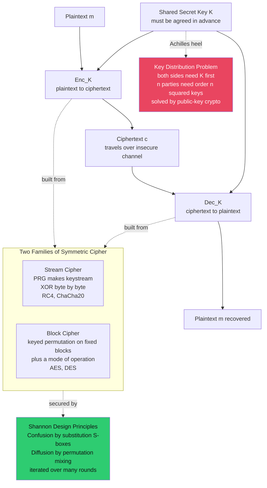

# 🔐 Symmetric Encryption Fundamentals

> [!abstract] TL;DR
> Symmetric-key encryption uses **one shared secret key** for both encryption and decryption: `Enc_K(m) = c` and `Dec_K(c) = m`. It is the fast workhorse that actually protects the world's data in bulk — HTTPS payloads, disk encryption, VPNs, messaging. It comes in two families: **stream ciphers** (generate a pseudorandom keystream and XOR it into the plaintext, like a practical one-time pad — RC4, ChaCha20) and **block ciphers** (a keyed permutation on fixed-size blocks plus a *mode of operation* — AES, DES). Every good cipher is built on **Shannon's twin principles**: *confusion* (substitution / S-boxes make the key-to-ciphertext relationship hopelessly complex) and *diffusion* (permutation / mixing spreads each plaintext bit across the whole block — the *avalanche effect*). Its Achilles heel is **key distribution**: both parties must share `K` beforehand, and `n` parties need on the order of n-squared pairwise keys — the exact problem that public-key cryptography was invented to solve. And because encryption alone gives confidentiality but **not integrity**, real systems pair it with a MAC or use authenticated encryption (AEAD).

---

## Intuition

**Analogy:** Symmetric encryption is a **shared padlock where the same key both locks and unlocks the box.** You put your message in a strongbox, snap the lock shut, and mail it across a city full of thieves. Anyone can carry the box, shake it, or try to pick it — but without the key it stays sealed. When it arrives, your friend uses an *identical copy of the same key* to open it. This is beautifully fast and simple, and it is exactly why symmetric crypto does the heavy lifting for essentially all bulk data protection.

But the analogy exposes the one nagging problem that has haunted symmetric cryptography for millennia: **how did your friend get an identical copy of the key in the first place?** If you mail the key, a thief opens the box in transit. If you meet in person, you don't need the internet. Two strangers who have *never met* somehow have to agree on a secret key while an eavesdropper watches every message. That **key-distribution puzzle** is symmetric crypto's Achilles heel — and it is the precise reason public-key cryptography was invented (see the *Public-Key Cryptography Foundations* and *Diffie-Hellman and Discrete Log* notes elsewhere in this section).

---

## How It Works

### The model

Both parties hold the same secret key `K`. The sender computes a ciphertext `c = Enc_K(m)` from the plaintext `m`; the receiver recovers `m = Dec_K(c)`. Under **Kerckhoffs's principle** (see [[Cryptography_Overview]]) the algorithms `Enc` and `Dec` are *public* — all security rests on the secrecy of `K`. The scheme is *fast*: modern CPUs run AES at hundreds of MB/s to multiple GB/s using hardware AES-NI instructions, which is why symmetric ciphers, not public-key ones, encrypt the actual bytes flowing through TLS, SSH, disk encryption, and messaging apps.

### The two families

1. **Stream ciphers.** A pseudorandom generator (PRG) is seeded with the key (and a nonce) to produce a long **keystream**, which is XORed byte-by-byte or bit-by-bit into the plaintext: `c = m XOR keystream`. This is a *practical* approximation of the perfectly secure **one-time pad** — the difference is the pad is generated pseudorandomly from a short key instead of being truly random and message-length. Examples: RC4 (now broken), ChaCha20 (modern, constant-time). See the *Stream Ciphers and PRGs* note.
2. **Block ciphers.** A keyed, invertible permutation scrambles a **fixed-size block** (typically 128 bits) into another 128-bit block: AES, DES. To encrypt data of arbitrary length you wrap the block cipher in a **mode of operation** (CTR turns it into a stream cipher, CBC chains blocks, GCM adds authentication). Never use ECB for structured data — identical plaintext blocks produce identical ciphertext blocks. See the *Block Ciphers and AES* and *Modes of Operation* notes.

### Shannon's design principles: confusion and diffusion

Claude Shannon (1949) named the two properties every good cipher needs:

- **Confusion** makes the relationship between the *key* and the *ciphertext* as complex as possible, so an attacker cannot deduce key bits from ciphertext statistics. It is achieved by **substitution** — non-linear lookup tables called **S-boxes**.
- **Diffusion** spreads the influence of each plaintext bit over *many* ciphertext bits, so patterns and redundancy in the plaintext vanish. It is achieved by **permutation** and mixing that shuffle bits across the block.

Together they defeat statistical cryptanalysis (see the *Cryptanalysis Fundamentals* note). Their visible fingerprint is the **avalanche effect**: flipping a single input bit (or key bit) flips roughly *half* of the output bits, with no predictable pattern. A cipher without avalanche leaks structure.

### Iterated round structure

You cannot get strong confusion and diffusion in one shot. Modern ciphers apply a **simple round function many times** — each round contributes a little confusion (S-box) and a little diffusion (permutation), and the effect *compounds*. Two dominant blueprints: **Feistel networks** (DES) and **substitution-permutation networks / SPNs** (AES). More rounds means a larger *security margin* against attacks like differential and linear cryptanalysis; AES-128 uses 10 rounds, AES-256 uses 14.

### The key-distribution problem

The central weakness: both parties must already **share `K` over a secure channel**. Worse, for a group of `n` mutually-communicating parties you need a distinct key for every pair — on the order of **n-squared keys** to manage and protect. This is exactly what motivated **public-key cryptography** (Diffie-Hellman key exchange lets strangers agree on a shared secret over a public wire) and **hybrid encryption** (use slow public-key crypto once to transport a fast symmetric session key, then do all the bulk work symmetrically). See [[Asymmetric_Cryptography_and_PKI]] and the *Key Exchange and PKI* note.



---

## Key Concepts

### Secondary (explain to a curious beginner)
- **One key, two jobs.** The same secret key both locks (encrypts) and unlocks (decrypts). Keep it secret and only the right people can read the message.
- **Fast and simple.** Because it is just fast scrambling, symmetric encryption is what actually protects big files, video calls, and web pages.
- **The classic weakness.** Both people need the *same* key first — if a spy steals the key while it is being shared, the whole thing falls apart.
- **Ancestors.** The Caesar shift and the Vigenere cipher are baby symmetric ciphers. They are breakable by counting letters, which is why real ciphers scramble far more thoroughly.

### Undergraduate (needs some CS background)
- **Formal model.** `Enc_K: M -> C` and `Dec_K: C -> M` with `Dec_K(Enc_K(m)) = m`. Security assumes the adversary knows `Enc`/`Dec` and only `K` is secret.
- **Stream vs block.** Stream = keystream XOR (a keyed PRG); block = keyed permutation on fixed blocks plus a mode of operation for arbitrary-length data.
- **Confusion and diffusion.** Confusion = non-linear substitution (S-boxes); diffusion = permutation spreading each bit. The **avalanche effect** (one bit in flips ~half the bits out) is diffusion made measurable.
- **Rounds.** Iterating a weak round function many times (Feistel or SPN) compounds confusion/diffusion into strong security.
- **Key size vs brute force.** Security against brute force is roughly the key length: 2^128 keys is infeasible to search; DES's 56-bit key (2^56) is now trivially cracked; 256-bit keys give long-term and post-quantum margin. Symmetric keys are *far shorter* than public keys for equivalent security.
- **Key distribution.** `O(n^2)` pairwise keys and the "how do strangers agree?" problem motivate public-key crypto and hybrid encryption.

### Graduate (system-level thinking)
- **Security definitions.** We don't hand-wave "secure": a block cipher is modeled as a **pseudorandom permutation (PRP)** indistinguishable from a random permutation; a stream cipher's PRG as a **PRF**. Encryption schemes are judged by **IND-CPA** (indistinguishability under chosen-plaintext attack) and the stronger **IND-CCA** (chosen-ciphertext). Deterministic or nonce-reusing schemes fail IND-CPA.
- **The perfect-secrecy boundary.** The one-time pad achieves Shannon **perfect secrecy** — `I(m; c) = 0`, ciphertext reveals nothing — but requires a truly random key at least as long as the message, which is why it is impractical and why we settle for *computational* security (see [[Information_Theoretic_Security_and_Privacy]] and [[Entropy_and_Information_Content]]).
- **Encryption is not integrity.** IND-CPA confidentiality says nothing about tampering. Malleable modes (CTR, CBC) let an attacker flip ciphertext bits into predictable plaintext changes. You must add a MAC (**encrypt-then-MAC**) or use **authenticated encryption / AEAD** (AES-GCM, ChaCha20-Poly1305). See the *Message Authentication Codes* note.
- **Nonce discipline and misuse resistance.** Stream ciphers and CTR-based AEADs are catastrophic under nonce reuse (identical keystream leaks `c1 XOR c2 = m1 XOR m2`). Misuse-resistant designs (AES-GCM-SIV) blunt this.
- **Beyond the black box.** Provable-security reductions assume an idealized adversary; real breaks come from **side channels** (cache-timing on table-based AES, power analysis) and **implementation bugs**, which is why constant-time designs like ChaCha20 matter.

---

## Python Demo

Pure standard library plus matplotlib. It builds intuition for two things: (a) why a **repeating-key XOR stream cipher is weak** and how to *break* it, versus a **one-time key** that is unbreakable; and (b) **Shannon's confusion and diffusion** in a tiny toy block cipher, measured and visualized via the **avalanche effect** (one bit in flips ~half the bits out, and *more rounds* makes it sharper).

```python
# symmetric_encryption_fundamentals_demo.py
# Demonstrates: (1) repeating-key XOR is weak (Vigenere-style break) vs a one-time key;
#               (2) confusion + diffusion in a toy SPN block cipher via the avalanche effect.
# Pure stdlib + matplotlib. Run:  python symmetric_encryption_fundamentals_demo.py

import random
import matplotlib.pyplot as plt

random.seed(42)

# ======================================================================
# PART 1 — Stream cipher: repeating-key XOR (weak) vs one-time key (secure)
# ======================================================================

def xor_repeating(data, key):
    """A Vigenere-style stream cipher: XOR data with a repeating key."""
    return bytes(b ^ key[i % len(key)] for i, b in enumerate(data))

def hamming(a, b):
    return sum(bin(x ^ y).count("1") for x, y in zip(a, b))

# English letter frequencies (percent) for scoring candidate decryptions.
_FREQ = {'e':12.7,'t':9.1,'a':8.2,'o':7.5,'i':7.0,'n':6.7,'s':6.3,'h':6.1,
         'r':6.0,'d':4.3,'l':4.0,'c':2.8,'u':2.8,'m':2.4,'w':2.4,'f':2.2,
         'g':2.0,'y':2.0,'p':1.9,'b':1.5,'v':1.0,'k':0.8,'j':0.15,'x':0.15,
         'q':0.10,'z':0.07}

def english_score(data):
    """Higher = more English-like. Rewards spaces/letters, punishes non-printables."""
    s = 0.0
    for b in data:
        ch = chr(b)
        if ch == ' ':
            s += 13.0
        elif ch.isalpha():
            s += _FREQ.get(ch.lower(), 0.0)
        elif b in (10, 13) or ch in ".,!?;:'\"-":
            s += 0.5
        elif 32 <= b < 127:
            s += 0.1
        else:
            s -= 8.0          # non-printable byte: almost certainly a wrong key guess
    return s

def break_single_byte_xor(block):
    """Try all 256 key bytes; keep the most English-like."""
    best_key, best_score = 0, float("-inf")
    for k in range(256):
        score = english_score(bytes(b ^ k for b in block))
        if score > best_score:
            best_key, best_score = k, score
    return best_key

def break_repeating_xor(ciphertext, key_len):
    """Split ciphertext into key_len columns; each column is a single-byte XOR."""
    columns = [ciphertext[i::key_len] for i in range(key_len)]
    return bytes(break_single_byte_xor(col) for col in columns)

def normalized_keylen_distance(ciphertext, key_len, n_blocks=6):
    """Average normalized Hamming distance between key_len-sized blocks.
    At the TRUE key length the key cancels, so blocks reflect plaintext-vs-plaintext
    XOR (low, ~0.3-0.4 for English). At wrong lengths blocks look random (~0.5)."""
    blocks = [ciphertext[i*key_len:(i+1)*key_len] for i in range(n_blocks)]
    blocks = [b for b in blocks if len(b) == key_len]
    dists, pairs = 0.0, 0
    for i in range(len(blocks)):
        for j in range(i + 1, len(blocks)):
            dists += hamming(blocks[i], blocks[j]) / key_len
            pairs += 1
    return dists / pairs if pairs else 0.5

PLAINTEXT = (b"symmetric encryption uses one shared secret key for both encryption "
             b"and decryption. it is fast and ideal for bulk data, but two parties "
             b"must agree on the key in advance. that key distribution problem is the "
             b"achilles heel that public key cryptography was invented to solve. good "
             b"ciphers rely on confusion and diffusion to defeat statistical attacks.")

SHORT_KEY = b"KEY"                                   # weak: repeats every 3 bytes
ct_repeating = xor_repeating(PLAINTEXT, SHORT_KEY)

# One-time key: as long as the message, fully random -> ciphertext is random -> unbreakable.
otp_key = bytes(random.randint(0, 255) for _ in range(len(PLAINTEXT)))
ct_otp = xor_repeating(PLAINTEXT, otp_key)

# Detect the key length of the repeating-key ciphertext.
candidate_lengths = list(range(2, 13))
dist_repeating = [normalized_keylen_distance(ct_repeating, L) for L in candidate_lengths]
dist_otp       = [normalized_keylen_distance(ct_otp, L)       for L in candidate_lengths]
guessed_len = candidate_lengths[min(range(len(dist_repeating)),
                                    key=lambda i: dist_repeating[i])]
recovered_key = break_repeating_xor(ct_repeating, guessed_len)
recovered_pt  = xor_repeating(ct_repeating, recovered_key)

print("=== Part 1: breaking repeating-key XOR ===")
print(f"true key       : {SHORT_KEY!r}")
print(f"guessed length : {guessed_len}")
print(f"recovered key  : {recovered_key!r}")
print(f"recovered text : {recovered_pt[:60].decode('latin-1')}...")
print("one-time-key ciphertext shows NO key-length dip -> unbreakable\n")

# ======================================================================
# PART 2 — Toy SPN block cipher: confusion (S-box) + diffusion (permutation)
# ======================================================================
# 16-bit blocks = four 4-bit nibbles. Each round: XOR round key, substitute
# each nibble (confusion), then transpose the 4x4 bit matrix (diffusion).

SBOX = [0xC,0x5,0x6,0xB,0x9,0x0,0xA,0xD,0x3,0xE,0xF,0x8,0x4,0x7,0x1,0x2]  # PRESENT S-box

def substitute(x):                       # confusion: non-linear S-box per nibble
    out = 0
    for i in range(4):
        out |= SBOX[(x >> (4*i)) & 0xF] << (4*i)
    return out

def permute(x):                          # diffusion: transpose 4x4 bit matrix
    out = 0
    for r in range(4):
        for c in range(4):
            out |= ((x >> (4*r + c)) & 1) << (4*c + r)
    return out

def round_keys(master, rounds):
    keys, k = [], master & 0xFFFF
    for i in range(rounds + 1):
        keys.append(k)
        k = ((k << 3) | (k >> 13)) & 0xFFFF      # rotate
        k ^= ((i + 1) * 0x1111) & 0xFFFF         # round constant
    return keys

def encrypt_block(pt, master, rounds):
    rk = round_keys(master, rounds)
    state = pt & 0xFFFF
    for i in range(rounds):
        state ^= rk[i]          # add round key
        state = substitute(state)   # confusion
        state = permute(state)      # diffusion
    return state ^ rk[rounds]   # final key mixing

def avalanche_fraction(rounds, trials=3000):
    """Average fraction of the 16 output bits that flip when ONE input bit flips."""
    flipped = 0
    for _ in range(trials):
        pt, key, bit = random.randint(0, 0xFFFF), random.randint(0, 0xFFFF), random.randint(0, 15)
        diff = encrypt_block(pt, key, rounds) ^ encrypt_block(pt ^ (1 << bit), key, rounds)
        flipped += bin(diff).count("1")
    return flipped / (trials * 16)

def avalanche_heatmap(rounds, trials=600):
    """H[i][j] = P(output bit j flips | input bit i flipped). Ideal cipher -> ~0.5 everywhere."""
    H = [[0.0]*16 for _ in range(16)]
    for _ in range(trials):
        pt, key = random.randint(0, 0xFFFF), random.randint(0, 0xFFFF)
        base = encrypt_block(pt, key, rounds)
        for ib in range(16):
            diff = base ^ encrypt_block(pt ^ (1 << ib), key, rounds)
            for ob in range(16):
                H[ib][ob] += (diff >> ob) & 1
    return [[H[i][j] / trials for j in range(16)] for i in range(16)]

rounds_axis = list(range(1, 8))
avalanche = [avalanche_fraction(r) for r in rounds_axis]
heat_1  = avalanche_heatmap(1)     # too few rounds: sparse, structured -> weak diffusion
heat_6  = avalanche_heatmap(6)     # enough rounds: uniform ~0.5 -> full avalanche

print("=== Part 2: avalanche effect (fraction of output bits flipped) ===")
for r, a in zip(rounds_axis, avalanche):
    print(f"rounds={r}: avalanche={a:.3f}   (ideal = 0.500)")

# ======================================================================
# Visualization
# ======================================================================
fig, ax = plt.subplots(2, 2, figsize=(13, 10))

# (A) avalanche vs rounds
ax[0,0].plot(rounds_axis, avalanche, "o-", color="#2ecc71", lw=2)
ax[0,0].axhline(0.5, ls="--", color="#e94560", label="ideal 0.5 (half the bits)")
ax[0,0].set_title("Diffusion in action: more rounds -> stronger avalanche")
ax[0,0].set_xlabel("number of rounds"); ax[0,0].set_ylabel("fraction of output bits flipped")
ax[0,0].set_ylim(0, 0.6); ax[0,0].legend(); ax[0,0].grid(alpha=0.3)

# (B) repeating-key XOR key-length detection
ax[0,1].plot(candidate_lengths, dist_repeating, "o-", color="#e94560",
             label="repeating key (period 3)")
ax[0,1].plot(candidate_lengths, dist_otp, "s--", color="#3498db",
             label="one-time key (no period)")
ax[0,1].axvline(guessed_len, ls=":", color="#111", label=f"detected length = {guessed_len}")
ax[0,1].set_title("Why repeating-key XOR leaks its period")
ax[0,1].set_xlabel("candidate key length")
ax[0,1].set_ylabel("normalized Hamming distance (lower = more structure)")
ax[0,1].legend(); ax[0,1].grid(alpha=0.3)

# (C) & (D) avalanche heatmaps
for a, H, r in [(ax[1,0], heat_1, 1), (ax[1,1], heat_6, 6)]:
    im = a.imshow(H, cmap="magma", vmin=0, vmax=1, aspect="equal")
    a.set_title(f"Bit-flip propagation, {r} round(s)")
    a.set_xlabel("output bit index"); a.set_ylabel("flipped input bit index")
    fig.colorbar(im, ax=a, fraction=0.046, pad=0.04, label="P(output bit flips)")

fig.suptitle("Symmetric Encryption Fundamentals: confusion, diffusion, and a weak cipher",
             fontsize=14, weight="bold")
fig.tight_layout(rect=[0, 0, 1, 0.97])
fig.savefig("symmetric_encryption_fundamentals_demo.png", dpi=120)
print("\nsaved figure -> symmetric_encryption_fundamentals_demo.png")
plt.show()
```

**What you observe.** Part 1 recovers the key `b"KEY"` and the full plaintext from ciphertext alone: the repeating-key XOR shows a sharp *dip* in normalized Hamming distance at key length 3 (the key cancels between aligned blocks, exposing the low-entropy plaintext), while the one-time key produces a flat ~0.5 curve with no period to exploit — the practical face of perfect secrecy. Part 2 shows the toy block cipher's avalanche climbing from ~0.15 at one round toward the ideal ~0.5 as rounds increase, and the heatmaps make it vivid: after one round each input bit only touches a handful of output bits (weak, structured diffusion), while after six rounds the map is a uniform ~0.5 haze — every input bit influences every output bit. That uniform haze *is* Shannon's confusion and diffusion, and it is exactly what iterated rounds buy you.

---

## Real-World Applications

- **TLS / HTTPS.** After a public-key handshake establishes a shared session key, virtually all web traffic is bulk-encrypted with **AES-GCM** or **ChaCha20-Poly1305** (both AEAD). Symmetric crypto does the real work; public-key only bootstraps the key. See [[TLS_Protocol_Deep_Dive]].
- **Full-disk encryption.** BitLocker, FileVault, and Linux **LUKS/dm-crypt** encrypt entire volumes with AES (XTS mode), protecting data at rest against device theft.
- **VPNs and secure tunnels.** WireGuard uses ChaCha20-Poly1305; IPsec and OpenVPN use AES-GCM to encrypt every packet.
- **End-to-end messaging.** Signal, WhatsApp, and iMessage encrypt message bodies with symmetric AEAD keys derived from the Double Ratchet.
- **At-rest storage and backups.** Cloud storage (S3 server-side encryption), databases, and password managers rely on AES for confidentiality of stored blobs.
- **Historical baseline.** DES (56-bit) secured banking for decades until brute force made it obsolete, driving the NIST competition that produced AES in 2001 — a live lesson in *key size vs brute force*.

---

## Common Pitfalls

- **Reusing a keystream / nonce (the two-time pad).** Encrypting two messages with the same stream-cipher keystream (or reusing a CTR/GCM nonce) leaks `c1 XOR c2 = m1 XOR m2`, and Part 1 shows how tractable XOR-of-plaintexts is. Nonces must be unique per key; prefer random 96-bit nonces or misuse-resistant modes.
- **Assuming encryption gives integrity.** IND-CPA confidentiality says nothing about tampering. CTR and CBC are *malleable* — an attacker can flip predictable plaintext bits without knowing the key. Always authenticate: encrypt-then-MAC, or use AEAD (AES-GCM, ChaCha20-Poly1305). This is the single most commonly missed point.
- **ECB mode on structured data.** Identical plaintext blocks map to identical ciphertext blocks (the infamous "ECB penguin"). ECB provides confusion but zero diffusion across blocks — never use it for real data.
- **Rolling your own cipher (or too few rounds).** Weak S-boxes, linear round functions, or truncated round counts collapse the security margin and open the door to differential/linear cryptanalysis. Part 2's one-round heatmap is what a broken cipher looks like.
- **Under-sized or reused keys.** 56-bit DES is brute-forceable in hours; use 128-bit minimum, 256-bit for long-term or post-quantum margin. Reusing keys across contexts (encryption and MAC from the same raw key) invites cross-protocol attacks — derive separate keys.
- **Mishandling the key-distribution problem.** Hard-coding shared keys, emailing them, or shipping them in the app defeats the whole scheme. Use key exchange (Diffie-Hellman) or a KMS; the secrecy of `K` is the *only* thing standing between the adversary and your plaintext.

---

## Related Concepts

- [[Cryptography_Overview]] — the vault entry point: security goals, primitives, Kerckhoffs's principle; this note is the symmetric-primitive deep dive beneath it.
- [[Symmetric_Encryption]] — the *applied* Cybersecurity companion (AES internals, GCM/CBC/CTR modes, padding oracles, KDFs); this note is the theory/fundamentals half of the same story.
- [[Asymmetric_Cryptography_and_PKI]] — public-key crypto is the direct answer to the key-distribution problem; real systems combine both (hybrid encryption).
- [[Modular_Arithmetic_and_Number_Theory]] — the algebraic machinery (finite fields) behind S-boxes, MixColumns, and the key exchange that delivers symmetric keys.
- [[Information_Theoretic_Security_and_Privacy]] — the one-time pad and Shannon perfect secrecy that our repeating-key-vs-one-time-key demo approximates.
- [[Entropy_and_Information_Content]] — why low-entropy plaintext makes repeating-key XOR breakable, and why keys need full entropy.
- [[Joint_Conditional_Entropy_and_Mutual_Information]] — confusion/diffusion in the language of information: good ciphers drive `I(key; ciphertext)` and plaintext structure toward zero.
- [[Hash_Functions_and_MACs]] — the integrity half that encryption lacks; encrypt-then-MAC and AEAD combine confidentiality with authentication.
- [[TLS_Protocol_Deep_Dive]] — the canonical hybrid system: public-key handshake then symmetric AES-GCM/ChaCha20 for bulk data.
- [[Post_Quantum_Cryptography]] — why 256-bit symmetric keys stay safe (Grover only halves the exponent) while public-key schemes need replacing.

*Not yet written in this section (referenced in prose above): Block Ciphers and AES, Stream Ciphers and PRGs, Modes of Operation, Message Authentication Codes, Public-Key Cryptography Foundations, Diffie-Hellman and Discrete Log, Key Exchange and PKI, and Cryptanalysis Fundamentals.*

---

## Review Questions

**Secondary**
1. In one sentence, what does it mean for encryption to be "symmetric," and why is sharing the key the hard part?
2. The Vigenere cipher repeats a short keyword. Using the demo's idea, explain in plain words why repeating the key makes the cipher breakable.

**Undergraduate**
3. Define confusion and diffusion, name the cipher component that provides each (substitution vs permutation), and explain how the avalanche effect is evidence that both are working.
4. A team uses AES-128 in CTR mode and reuses the same nonce for two messages under the same key. What exactly leaks, and why? What is the minimal fix?
5. Why does a symmetric system for `n` mutually-communicating parties need on the order of n-squared keys, and how does public-key cryptography change that count?

**Graduate**
6. State what it means for a block cipher to be a secure pseudorandom permutation (PRP) and connect that abstraction to the IND-CPA security of a mode of operation built on top of it. Why must the mode be randomized or nonce-based to achieve IND-CPA?
7. The one-time pad achieves perfect secrecy yet is almost never used, while AES-256 is used everywhere despite offering "only" computational security. Justify this trade-off in terms of key length, `I(m; c)`, and practicality.
8. Encryption alone leaves a scheme malleable. Explain a concrete bit-flipping attack against unauthenticated CTR mode, then describe how encrypt-then-MAC or an AEAD such as AES-GCM closes it — and why the *order* of encryption and authentication matters.

---

## Sources

- Shannon, C. E. (1949). *Communication Theory of Secrecy Systems.* Bell System Technical Journal — the origin of confusion, diffusion, and perfect secrecy. https://ieeexplore.ieee.org/document/6769090
- Katz, J. & Lindell, Y. *Introduction to Modern Cryptography* (3rd ed.) — pseudorandomness, PRPs, IND-CPA/CCA, and authenticated encryption. https://www.cs.umd.edu/~jkatz/imc.html
- NIST FIPS 197 (2001, updated 2023). *Advanced Encryption Standard (AES).* https://csrc.nist.gov/publications/detail/fips/197/final
- Heys, H. M. *A Tutorial on Linear and Differential Cryptanalysis* — the 16-bit toy SPN and avalanche behavior this note's demo is modeled on. https://www.engr.mun.ca/~howard/PAPERS/ldc_tutorial.pdf
- The Cryptopals Crypto Challenges, Set 1 — practical single-byte and repeating-key XOR breaking. https://cryptopals.com/sets/1

---

#cryptography #symmetric-encryption #confusion-diffusion #stream-cipher #block-cipher
