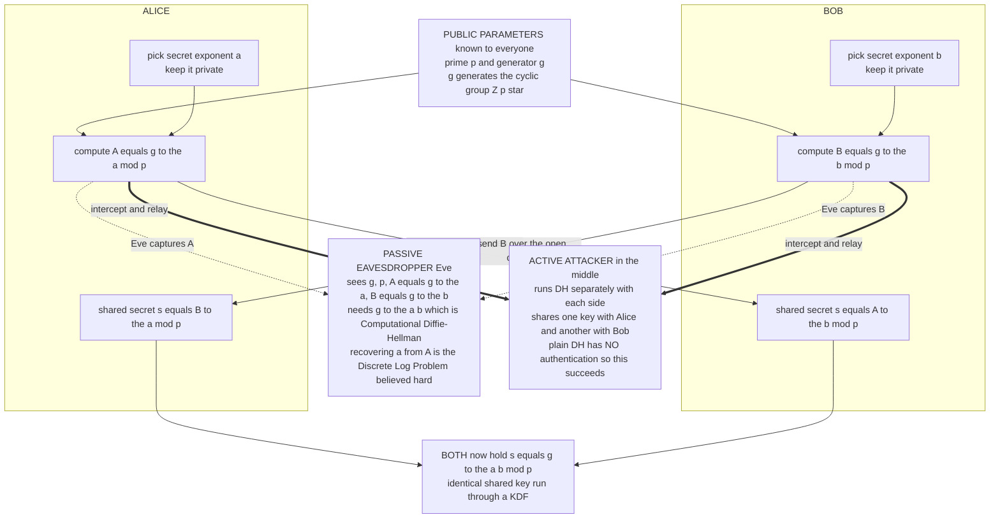

# 🔑 Diffie-Hellman Key Exchange and the Discrete Logarithm Problem

> [!abstract] TL;DR
> In 1976 **Diffie and Hellman** solved the problem that had haunted cryptography for millennia: how do two strangers agree on a secret key while an eavesdropper watches *every* byte they exchange? The trick is **modular exponentiation in a cyclic group**. Public parameters are a large prime `p` and a **generator** `g`. Alice secretly picks `a` and publishes `A = g^a mod p`; Bob secretly picks `b` and publishes `B = g^b mod p`. Alice computes `B^a`, Bob computes `A^b`, and both land on the *same* value `g^(ab) mod p` — their shared key. An eavesdropper sees `g`, `p`, `g^a`, and `g^b` but computing `g^(ab)` is the **Computational Diffie-Hellman** problem, and recovering `a` from `g^a` is the **Discrete Logarithm Problem** — both believed intractable for large `p`. This one idea underwrites **ElGamal** encryption, **DSA** signatures, **TLS/SSH/IPsec/Signal/WireGuard** key exchange, and — via its **ephemeral** form — **forward secrecy**. Its one weakness: plain DH authenticates *nothing*, so an active **man-in-the-middle** can impersonate both sides. Modern **elliptic-curve DH (ECDH/X25519)** does the same math in a harder group for far smaller keys, and **Shor's algorithm** on a quantum computer would break it all.

---

## Intuition

**Analogy — mixing secret paint in broad daylight.** Alice and Bob want a shared secret color, but they can only communicate by mailing paint cans that anyone along the route can open, photograph, and even copy. Here is the trick. They publicly agree on a **common base color** — say, a specific yellow — that everyone, including the eavesdropper, knows. Then each of them privately picks a **secret color** they never reveal: Alice a certain red, Bob a certain blue. Each mixes their secret into the shared yellow and mails the resulting blend: Alice sends yellow+red (an orange), Bob sends yellow+blue (a green). They *swap* these mixtures over the open channel. Finally, each adds their *own* secret color one more time: Alice takes Bob's green and stirs in her red; Bob takes Alice's orange and stirs in his blue. Both cans now hold the identical blend — **yellow + red + blue** — the shared secret color.

The eavesdropper saw the yellow base, the orange, and the green fly past, and could photograph all three. But paint mixing is a **one-way street**: separating a blend back into its exact component pigments and amounts is practically hopeless. To forge the final color the attacker would need to un-mix Alice's orange to recover her secret red — and that is the paint version of the hard problem. Diffie-Hellman replaces paint with **modular exponentiation**: the "base color" is `g`, "adding your secret" is raising to your private exponent, and "un-mixing" is the **discrete logarithm** — easy to mix forward (`g^a`), infeasible to reverse (recover `a` from `g^a`). Two strangers walk away with a shared key nobody watching could reconstruct.

---

## How It Works

### Core mechanics

The whole protocol lives inside a **finite cyclic group** — concretely, the multiplicative group `Z_p*` of nonzero residues modulo a large prime `p`. A **generator** (primitive root) `g` is an element whose powers `g^0, g^1, g^2, ...` cycle through every element of the group before repeating. Modular exponentiation `g^x mod p` is cheap (fast **square-and-multiply**, `O(log x)` multiplications), but its inverse — the **discrete logarithm** — has no known efficient classical algorithm.

1. **Public parameters.** Everyone, including the attacker, knows the prime `p` and the generator `g`. These are not secret; often they are standardized (named DH groups, or a fixed curve for ECDH).
2. **Private choices.** Alice draws a random secret exponent `a` in `[2, p-2]`; Bob draws a random secret `b`. These *never* leave their machines.
3. **Public messages.** Alice sends `A = g^a mod p`; Bob sends `B = g^b mod p`. These traverse the open channel and may be read by anyone.
4. **Shared-secret derivation.** Alice computes `B^a = (g^b)^a = g^(ba) mod p`. Bob computes `A^b = (g^a)^b = g^(ab) mod p`. Because exponents commute, both equal `g^(ab) mod p` — the **shared secret** `s`.
5. **Key derivation.** They do not use `s` raw; they run it through a **KDF** (e.g. HKDF) to derive symmetric keys for a fast cipher like AES-GCM. DH establishes the key; symmetric crypto does the bulk work — this **hybrid** pattern is universal (see [[Symmetric_Encryption_Fundamentals]]).

**Why the eavesdropper is stuck.** A passive attacker holds `g`, `p`, `A = g^a`, and `B = g^b`, and wants `g^(ab)`. Producing it from `g^a` and `g^b` *without* the exponents is the **Computational Diffie-Hellman (CDH)** problem. The obvious route — recover `a` from `A = g^a` (a **discrete log**), then compute `B^a` — is exactly the **Discrete Logarithm Problem (DLP)**. Both are believed hard; DLP-hard implies CDH-hard implies DDH-hard, but not obviously the reverse (see [[Computational_Hardness_Assumptions]]).

### DLP, CDH, and DDH — the precise assumptions

- **Discrete Logarithm Problem (DLP).** Given `g` and `y = g^x mod p`, find `x`. Forward is a handful of multiplications; backward, the best classical algorithms are **sub-exponential** — **index calculus** and the **number field sieve for DLP** — which is why a *2048-bit or larger* prime is needed for the multiplicative group.
- **Computational Diffie-Hellman (CDH).** Given `g^a` and `g^b`, compute `g^(ab)`. What DH secrecy against a passive attacker literally requires.
- **Decisional Diffie-Hellman (DDH).** Given `g^a`, `g^b`, and a candidate `z`, decide whether `z = g^(ab)` or is a random group element. **Strictly stronger** than CDH, and it is what **ElGamal**'s semantic security rests on. Crucially, **DDH is *false* in some groups** — for example the full group `Z_p*` leaks the **quadratic-residue** bit of the exponent (see [[Groups_Rings_Fields_for_Cryptography]]), which is exactly why real deployments work in a **prime-order subgroup** where DDH is believed to hold.

### ElGamal — turning DH into public-key encryption

ElGamal (1985) is "Diffie-Hellman with one party fixed in advance." A recipient publishes a **long-term public key** `h = g^x` (private key `x`). To encrypt a message `m` (a group element), the sender picks a **fresh random** `k` and sends the pair `(c1, c2) = (g^k, m * h^k)`. The recipient recovers `m = c2 * (c1^x)^(-1)`, because `c1^x = g^(kx) = h^k`. Two consequences matter:

- **Randomized, semantically secure under DDH.** Because `k` is fresh each time, encrypting the same `m` twice yields different ciphertexts — unlike **textbook RSA**, which is deterministic and leaks equality (see [[Asymmetric_Cryptography_and_PKI]]).
- **Multiplicatively homomorphic.** `Enc(m1) * Enc(m2)` decrypts to `m1 * m2`, a property exploited in e-voting and a stepping stone toward fully homomorphic schemes (referenced in a forthcoming `Homomorphic_Encryption` sibling).

### Ephemeral DH and forward secrecy

If Alice reuses a *static* private `a` for every session, then compromising `a` later exposes **every past session key**. The fix is **ephemeral Diffie-Hellman (DHE / ECDHE)**: generate a **fresh, throwaway** key pair per session and delete it afterward. The result is **forward secrecy** — an attacker who records ciphertext today and steals the server's long-term signing key *tomorrow* still cannot recover past traffic, because the ephemeral exponents that produced those session keys no longer exist anywhere. **TLS 1.3 mandates** ephemeral (EC)DHE for exactly this reason (see [[TLS_Protocol_Deep_Dive]]).

### The authentication gap — man-in-the-middle

Plain DH provides **confidentiality against a passive eavesdropper but zero authentication**. An *active* attacker on the wire runs DH *separately* with each side: it establishes key `K1` with Alice (who thinks she is talking to Bob) and key `K2` with Bob (who thinks he is talking to Alice), then decrypts, reads, and re-encrypts everything in between. Neither party can tell. The cure is to **authenticate the exchange** — sign the DH values with a certificate-backed key, or mix in a pre-shared secret. This is **authenticated key exchange (AKE)**, and it is precisely what TLS (server certificate + signature over the handshake) and Signal (identity keys in X3DH) do. Referenced siblings `Key_Exchange_and_PKI`, `Digital_Signatures`, `TLS_and_Secure_Channels`, and `Secure_Messaging_and_Signal_Protocol` will develop this in depth.

### Flow / Architecture



---

## Key Concepts

### Secondary (intuitive, no CS background needed)

- **A shared secret built in public.** Two people who never met can agree on a secret key while an eavesdropper reads every message — the paint-mixing trick made of arithmetic.
- **Easy to mix, impossible to un-mix.** Combining your secret into the shared base is fast; separating a combined value back into its ingredients is what defeats the attacker.
- **The lock has a blind spot: it does not check *who* you are.** Plain Diffie-Hellman keeps a passive listener out, but an active impostor who intercepts and relays can fool both sides. That is why real systems add certificates or signatures.
- **Fresh keys protect the past.** If you throw away the secret exponents after each conversation, then even if your master key leaks years later, yesterday's conversations stay private — that is "forward secrecy."

### Undergraduate (a first crypto or number-theory course)

- **The protocol.** Public `(p, g)`; Alice sends `g^a`, Bob sends `g^b`; both compute `g^(ab)` because `(g^a)^b = (g^b)^a`. The shared value feeds a KDF, not the cipher directly.
- **Generators and subgroups.** `g` should generate a **large prime-order subgroup**. Working in `Z_p*` of composite order leaks bits and enables **small-subgroup** attacks; using a **safe prime** `p = 2q + 1` and an order-`q` generator is the classic fix.
- **DLP vs CDH vs DDH.** Recovering the exponent (DLP) is the strongest attack; computing `g^(ab)` (CDH) is what breaks secrecy; distinguishing `g^(ab)` from random (DDH) is what breaks ElGamal's semantic security. DLP ≥ CDH ≥ DDH in hardness.
- **ElGamal.** Public key `h = g^x`; ciphertext `(g^k, m·h^k)` with fresh `k`; decrypt via `x`. Randomized and semantically secure under DDH; multiplicatively homomorphic.
- **Ephemeral vs static.** DHE/ECDHE generate per-session key pairs → forward secrecy; static DH reuses a long-term exponent and has none.
- **Attack toolbox for small `p`.** **Baby-step giant-step** solves DLP in `O(√p)` time and space; **Pollard's rho** matches the time in `O(1)` space; **Pohlig-Hellman** reduces DLP to the prime factors of the group order — devastating if the order is smooth, hence prime-order groups.

### Graduate (advanced cryptography)

- **Security reductions.** DH key-exchange secrecy against passive adversaries reduces to CDH; ElGamal IND-CPA security reduces to DDH via a tight reduction (see [[Provable_Security_and_Reductions]]). Gap-DH groups (CDH hard, DDH easy) enable pairing-based constructions like BLS signatures.
- **Why DDH fails in `Z_p*`.** The Legendre symbol reveals whether an exponent is even or odd, so `g^(ab)` is distinguishable from random in the full group. Restricting to the order-`q` subgroup of quadratic residues (with `p = 2q + 1`) removes the leak — the standard DDH-secure setting.
- **Sub-exponential DLP.** The **index calculus** family and the **number field sieve** solve prime-field DLP in `L_p[1/3]` time, forcing 2048+ bit primes. The **elliptic-curve** discrete log (ECDLP) has *no* known sub-exponential attack, so 256-bit curves match 3072-bit RSA — the basis of ECDH/X25519 (referenced sibling `Elliptic_Curve_Cryptography`).
- **Authenticated key exchange.** Signed-DH (STS protocol), MQV/HMQV, and the Noise framework bind DH values to long-term identities. Signal's **X3DH** combines multiple DH operations (identity, signed-prekey, one-time prekey) to get mutual authentication *and* forward secrecy in an asynchronous setting.
- **The quantum cliff.** **Shor's algorithm** solves DLP and ECDLP in polynomial time, breaking *all* Diffie-Hellman variants at once (see [[Shors_Factoring_Algorithm]]). Post-quantum key exchange uses **lattice KEMs** (ML-KEM / Kyber), typically deployed in a **hybrid** X25519+Kyber handshake so a break in either component alone is survivable (see [[Post_Quantum_Cryptography]]).
- **Parameter provenance.** Nothing-up-my-sleeve constants, verifiable curve generation, and rejection of unexplained "magic" parameters guard against backdoors — the lesson of the **Dual_EC_DRBG** affair and the **Logjam** downgrade to 512-bit export DH.

---

## Python Demo

```python
# DIFFIE-HELLMAN, THE DISCRETE-LOG ATTACK, AND A MAN-IN-THE-MIDDLE.
#
# Four things, all with the standard library (matplotlib only draws pictures):
#   (1) An honest DH key exchange: Alice and Bob derive the SAME secret g^(ab)
#       mod p over a fully public channel, while an eavesdropper who sees only
#       g^a and g^b is stuck on the Computational Diffie-Hellman problem.
#   (2) The discrete-log ATTACK: recover a private exponent from g^a for SMALL p
#       with baby-step giant-step -- and watch the cost climb as p grows, which
#       is exactly why real primes are 2048+ bits.
#   (3) A MAN-IN-THE-MIDDLE on UNAUTHENTICATED DH: an active attacker runs DH
#       separately with each side and reads everything -- motivating that DH
#       MUST be authenticated (signatures / certificates / pre-shared keys).
#   (4) A picture: the key-exchange flow, and the discrete-log difficulty scaling.

import time
import math
import random
import matplotlib.pyplot as plt

random.seed(1)

# --------- primality test + prime sampler (deterministic Miller-Rabin) --------
_WITNESSES = (2, 3, 5, 7, 11, 13, 17, 19, 23, 29, 31, 37)

def is_prime(n):
    if n < 2:
        return False
    for p in _WITNESSES:
        if n % p == 0:
            return n == p
    d, s = n - 1, 0
    while d % 2 == 0:
        d //= 2
        s += 1
    for a in _WITNESSES:                       # deterministic for n < 3.3e24
        x = pow(a, d, n)
        if x == 1 or x == n - 1:
            continue
        for _ in range(s - 1):
            x = x * x % n
            if x == n - 1:
                break
        else:
            return False
    return True

def gen_prime(bits):
    lo, hi = 1 << (bits - 1), (1 << bits) - 1
    while True:
        n = random.randint(lo, hi) | 1
        if is_prime(n):
            return n

def factorize(n):
    facs, d = set(), 2
    while d * d <= n:
        while n % d == 0:
            facs.add(d)
            n //= d
        d += 1
    if n > 1:
        facs.add(n)
    return facs

def primitive_root(p):
    # g is a generator of Z_p* iff g^((p-1)/q) != 1 for every prime q | (p-1).
    order = p - 1
    prime_facs = factorize(order)
    for g in range(2, p):
        if all(pow(g, order // q, p) != 1 for q in prime_facs):
            return g
    raise ValueError("no generator found")

# ================================================================= (1) HONEST DH
p = gen_prime(20)                 # TOY prime; real DH uses 2048+ bits
g = primitive_root(p)

a = random.randrange(2, p - 1)    # Alice's private exponent (secret)
b = random.randrange(2, p - 1)    # Bob's   private exponent (secret)

A = pow(g, a, p)                  # Alice -> Bob, public
B = pow(g, b, p)                  # Bob   -> Alice, public

s_alice = pow(B, a, p)            # Alice computes B^a = g^(ab)
s_bob   = pow(A, b, p)            # Bob   computes A^b = g^(ab)

print("=== (1) Honest Diffie-Hellman key exchange ===")
print(f"public parameters:  p = {p}   g = {g}")
print(f"Alice sends A = g^a = {A}     Bob sends B = g^b = {B}")
print(f"Alice's secret s = B^a mod p = {s_alice}")
print(f"Bob's   secret s = A^b mod p = {s_bob}")
print(f"shared secret matches: {s_alice == s_bob == pow(g, a * b, p)}")
print(f"an eavesdropper holds only g, p, A, B -- computing g^(ab) is CDH.\n")

# ============================================================ (2) DISCRETE-LOG ATTACK
def dlog_bruteforce(g, y, p):                 # ~ p steps
    cur = 1
    for x in range(p):
        if cur == y:
            return x
        cur = cur * g % p
    return None

def dlog_bsgs(g, y, p):                        # baby-step giant-step, ~ sqrt(p)
    m = math.isqrt(p) + 1
    table = {}
    cur = 1
    for j in range(m):                         # baby steps: g^j -> j
        table.setdefault(cur, j)
        cur = cur * g % p
    g_inv_m = pow(pow(g, m, p), p - 2, p)      # (g^m)^{-1} via Fermat (p prime)
    gamma = y
    for i in range(m + 1):                     # giant steps
        if gamma in table:
            return i * m + table[gamma]
        gamma = gamma * g_inv_m % p
    return None

recovered = dlog_bsgs(g, A, p)                 # attacker recovers Alice's exponent
print("=== (2) Discrete-log attack (small p only) ===")
print(f"attacker sees A = {A}; solves g^x = A for x ...")
print(f"recovered x = {recovered}   (g^x mod p = {pow(g, recovered, p)} == A: "
      f"{pow(g, recovered, p) == A})")
print(f"with x known, attacker forges the shared key B^x = {pow(B, recovered, p)} "
      f"== s: {pow(B, recovered, p) == s_alice}")
print("this works ONLY because p is tiny; the cost explodes with bit length.\n")

# ============================================================ (3) MAN-IN-THE-MIDDLE
# Unauthenticated DH: attacker M relays the channel and swaps in its OWN keys.
m1 = random.randrange(2, p - 1)   # M's private exponent facing Alice
m2 = random.randrange(2, p - 1)   # M's private exponent facing Bob

# Alice believes she is talking to Bob; M intercepts and answers with g^m1.
M_to_alice = pow(g, m1, p)
K_alice   = pow(M_to_alice, a, p)   # Alice's key  = g^(a*m1)
K_M_alice = pow(A, m1, p)           # M's matching key, computed from Alice's A

# Bob believes he is talking to Alice; M intercepts and answers with g^m2.
M_to_bob = pow(g, m2, p)
K_bob   = pow(M_to_bob, b, p)       # Bob's key    = g^(b*m2)
K_M_bob = pow(B, m2, p)             # M's matching key, computed from Bob's B

print("=== (3) Man-in-the-middle on UNAUTHENTICATED DH ===")
print(f"Alice<->M share K1 = {K_alice}   (M agrees: {K_alice == K_M_alice})")
print(f"Bob  <->M share K2 = {K_bob}   (M agrees: {K_bob == K_M_bob})")
print(f"Alice and Bob think they share a key but K1 == K2 is {K_alice == K_bob}.")
print("M decrypts, reads, and re-encrypts every message. Neither side notices.")
print("FIX: authenticate the DH values (signatures/certs/PSK) -> authenticated KE.\n")

# ==================================================== (4) DIFFICULTY SCALING + FLOW
brute_bits = list(range(10, 21))
bsgs_bits  = list(range(10, 25))

def time_attack(fn, bits):
    xs, ts = [], []
    for nb in bits:
        pp = gen_prime(nb)
        gg = primitive_root(pp)
        secret = random.randrange(1, pp - 1)
        yy = pow(gg, secret, pp)
        t0 = time.perf_counter()
        fn(gg, yy, pp)
        ts.append(time.perf_counter() - t0)
        xs.append(nb)
    return xs, ts

bx, bt = time_attack(dlog_bruteforce, brute_bits)
sx, st = time_attack(dlog_bsgs, bsgs_bits)

fig, ax = plt.subplots(1, 2, figsize=(15, 6))

# --- left: key-exchange flow schematic ---
axf = ax[0]
axf.axis("off")
axf.set_xlim(0, 10)
axf.set_ylim(0, 10)
blue = dict(boxstyle="round", fc="#e8f0fe", ec="steelblue")
green = dict(boxstyle="round", fc="#d7f5dd", ec="green")
red = dict(boxstyle="round", fc="#fde8e8", ec="crimson")
axf.text(5, 9.4, "public: prime p, generator g", ha="center", fontsize=10, bbox=blue)
axf.text(1.7, 7.9, "ALICE\npick secret a\nA = g^a mod p", ha="center", va="center", bbox=blue)
axf.text(8.3, 7.9, "BOB\npick secret b\nB = g^b mod p", ha="center", va="center", bbox=blue)
axf.annotate("", xy=(6.4, 6.7), xytext=(3.6, 6.7),
             arrowprops=dict(arrowstyle="->", color="seagreen", lw=2))
axf.text(5, 6.95, "send  A = g^a", ha="center", color="seagreen", fontsize=9)
axf.annotate("", xy=(3.6, 5.9), xytext=(6.4, 5.9),
             arrowprops=dict(arrowstyle="->", color="seagreen", lw=2))
axf.text(5, 6.15, "send  B = g^b", ha="center", color="seagreen", fontsize=9)
axf.text(1.7, 4.6, "s = B^a mod p", ha="center", va="center", bbox=blue)
axf.text(8.3, 4.6, "s = A^b mod p", ha="center", va="center", bbox=blue)
axf.text(5, 3.1, "SHARED SECRET\ns = g^(ab) mod p", ha="center", va="center", bbox=green)
axf.text(5, 1.2, "EVE sees g, p, g^a, g^b\ncannot get g^(ab): discrete log is hard",
         ha="center", va="center", fontsize=9, bbox=red)
axf.set_title("Diffie-Hellman key exchange over a public channel")

# --- right: discrete-log difficulty scaling ---
axr = ax[1]
axr.semilogy(bx, bt, "o-", color="crimson", lw=2,
             label="brute force  ~ 2^bits")
axr.semilogy(sx, st, "s-", color="darkorange", lw=2,
             label="baby-step giant-step  ~ 2^(bits/2)")
axr.set_xlabel("prime bit length")
axr.set_ylabel("seconds to recover the exponent (log scale)")
axr.set_title("Discrete log gets exponentially harder with p\n"
              "real DH uses 2048+ bits -- off the top of any chart")
axr.legend(loc="upper left")
axr.grid(True, which="both", alpha=0.3)

plt.tight_layout()
plt.show()
```

**What the demo shows.** Part (1) confirms the magic: Alice's `B^a` and Bob's `A^b` land on the *identical* `g^(ab)` although the two never exchanged their secret exponents — the eavesdropper, holding only `A` and `B`, faces CDH. Part (2) breaks it *only because `p` is tiny*: baby-step giant-step recovers Alice's exponent, and with it the attacker reconstructs the shared key — a live demonstration that DH's safety is *entirely* the size of `p`. Part (3) is the sobering one: on an **unauthenticated** channel an active attacker ends up sharing key `K1` with Alice and `K2` with Bob while both believe they are talking to each other, and can read and rewrite every message — DH gives secrecy against *passive* eavesdroppers but *no authentication*, which is why TLS and Signal sign the exchange. Part (4) plots why real cryptography is safe: the crimson brute-force curve tracks `2^bits`, the orange baby-step-giant-step curve tracks `2^(bits/2)`, and both climb off the chart long before the 2048+ bits real primes use — the *measured* wall that CDH and DLP hide behind.

---

## Real-World Applications

> **Example — every HTTPS handshake you make is a Diffie-Hellman exchange.** When your browser opens a TLS 1.3 connection, it performs an **ephemeral elliptic-curve Diffie-Hellman (ECDHE)** with the server, typically over **X25519**. The server signs its ephemeral public key with its certificate's private key so the client knows it is not talking to a man-in-the-middle; the resulting shared secret is fed through HKDF into AES-GCM (or ChaCha20-Poly1305) session keys. Because the DH keys are *ephemeral* and discarded after the session, stealing the server's long-term key later cannot decrypt captured traffic — **forward secrecy**, which TLS 1.3 makes mandatory (see [[TLS_Protocol_Deep_Dive]]).

- **TLS / HTTPS.** ECDHE (X25519, P-256) is the dominant key exchange for the entire web. TLS 1.3 removed static-RSA and non-forward-secret modes outright.
- **SSH.** The SSH transport layer negotiates a shared session key with (EC)DH; the server's host key signs the exchange to prevent MITM (the "host key fingerprint" you accept on first connect).
- **IPsec / VPNs.** IKE (the Internet Key Exchange) uses DH to establish IPsec session keys; **WireGuard** builds its entire handshake on the **Noise protocol framework** using **Curve25519** ECDH with static and ephemeral keys.
- **Signal / WhatsApp.** The **X3DH** ("Extended Triple Diffie-Hellman") agreement performs several DH operations combining identity, signed-prekey, and one-time-prekey keys for authenticated, forward-secret session setup, then the **Double Ratchet** keeps ratcheting DH for per-message forward and future secrecy (referenced sibling `Secure_Messaging_and_Signal_Protocol`).
- **ElGamal and its descendants.** ElGamal encryption underlies parts of PGP/GnuPG; **DSA** and its elliptic-curve cousin **ECDSA** are DLP-based *signatures* securing code signing, TLS certificates, and cryptocurrency wallets (see [[Digital_Signatures]] once available).
- **Cryptocurrencies.** Bitcoin and Ethereum keys are elliptic-curve (secp256k1) — the ECDLP hardness that ECDH relies on is the same one guarding wallet private keys.

---

## Common Pitfalls

- **Unauthenticated DH (the MITM trap).** Raw DH authenticates nothing; an active attacker relays and reads everything. *Always* authenticate the exchange with signatures, certificates, or a pre-shared key. This is the single most important operational lesson and the reason "authenticated key exchange" exists.
- **Static keys, no forward secrecy.** Reusing a long-term DH private exponent means one key compromise decrypts *all* past sessions. Use **ephemeral** DHE/ECDHE and delete the exponents after each session.
- **Non-prime-order groups and small-subgroup attacks.** Working in the full `Z_p*` (composite order) leaks exponent bits and lets an attacker force the shared secret into a tiny subgroup to brute-force it. Use a **safe prime** `p = 2q + 1` with an order-`q` generator, and **validate** received public values (reject `0, 1, p-1`, and non-subgroup points).
- **Weak or export-grade parameters (Logjam).** 512-bit "export" DH groups are trivially broken; worse, a *shared* fixed prime lets a nation-state precompute the sieve *once* and break many connections. Use ≥2048-bit groups or, better, elliptic curves.
- **Backdoored parameters (Dual_EC_DRBG).** Unexplained "magic" constants can hide a trapdoor. Prefer standardized, verifiably-generated parameters (named DH groups, Curve25519's nothing-up-my-sleeve design).
- **Using the raw DH output as a key.** `g^(ab)` is a group element with structure and bias, not a uniform key. Always run it through a **KDF** (HKDF) before use.
- **Reusing the ElGamal / ECDSA random `k`.** Repeating the per-message randomness `k` catastrophically leaks the private key (the PlayStation 3 ECDSA break). `k` must be fresh, uniform, and secret every time.
- **Ignoring the quantum clock.** DH, ECDH, and ElGamal all fall to **Shor's algorithm**. "Harvest now, decrypt later" means today's ECDHE traffic is at risk once a large quantum computer exists — hence hybrid post-quantum key exchange.

---

## Related Concepts

- [[Computational_Hardness_Assumptions]] — the DLP, CDH, and DDH assumptions this note rests on, and where they sit in the hardness hierarchy.
- [[Groups_Rings_Fields_for_Cryptography]] — cyclic groups, generators, prime-order subgroups, and *why* DDH fails in the full `Z_p*` but holds in the quadratic-residue subgroup.
- [[Provable_Security_and_Reductions]] — how ElGamal's IND-CPA security reduces to DDH and DH secrecy reduces to CDH.
- [[Cryptography_Overview]] — the entry note framing key exchange as one of the core cryptographic primitives.
- [[Symmetric_Encryption_Fundamentals]] — the hybrid pattern: DH establishes the key, a fast symmetric cipher does the bulk encryption.
- [[Asymmetric_Cryptography_and_PKI]] — the broader public-key world (RSA, ElGamal, certificates) that DH lives inside.
- [[TLS_Protocol_Deep_Dive]] — ECDHE in the TLS handshake and the mandatory forward secrecy of TLS 1.3.
- [[Shors_Factoring_Algorithm]] — the quantum algorithm that solves discrete log (and ECDLP), breaking every DH variant.
- [[Post_Quantum_Cryptography]] — lattice KEMs (Kyber/ML-KEM) and hybrid handshakes replacing/augmenting DH.
- [[Modular_Arithmetic]] — the `mod p` arithmetic and fast exponentiation the whole protocol runs on.
- [[Divisibility_and_Primes]] — safe primes, primitive roots, and the number theory behind good DH parameters.
- [[Groups_and_Subgroups]] — the abstract-algebra foundation of the cyclic group where DLP is defined.
- [[Quadratic_Residues_and_Reciprocity]] — the Legendre-symbol leak that makes DDH fail in `Z_p*` and forces prime-order subgroups.

*(Forthcoming siblings in this Cryptography vault — `Public_Key_Cryptography_Foundations`, `Key_Exchange_and_PKI`, `Elliptic_Curve_Cryptography`, `Digital_Signatures`, `TLS_and_Secure_Channels`, `Secure_Messaging_and_Signal_Protocol`, `Homomorphic_Encryption`, and `Cryptographic_Failures_and_Misuse` — are referenced in prose above until they exist.)*

---

## Review Questions

1. **(Conceptual)** Walk through a Diffie-Hellman exchange with public `(p, g)` and explain *precisely why* Alice's `B^a` and Bob's `A^b` are equal, then state exactly what a *passive* eavesdropper must solve to recover the shared key. Distinguish the DLP, CDH, and DDH problems and order them by hardness.
2. **(Scenario)** You capture the full transcript of an *unauthenticated* DH exchange between two parties and can also inject and modify packets in real time. Describe the attack that lets you read every subsequent message, explain why neither party detects it, and name three concrete mechanisms that would have stopped you. Why does this attack fail against a *passive*-only adversary?
3. **(Trade-off / deep)** A messaging service must protect conversations that stay sensitive for decades. Compare (a) static RSA key transport, (b) ephemeral ECDHE over X25519, and (c) a hybrid X25519 + Kyber exchange, on forward secrecy, key size/performance, and resistance to a future quantum adversary. Explain what "harvest now, decrypt later" implies for the choice you would deploy *today*, and precisely which of Shor's and Grover's algorithms threatens each option.

---

## Sources

- Diffie, W., & Hellman, M. (1976). "New Directions in Cryptography." *IEEE Transactions on Information Theory*, 22(6), 644–654. — The founding paper introducing public-key exchange and the discrete-log foundation.
- ElGamal, T. (1985). "A Public Key Cryptosystem and a Signature Scheme Based on Discrete Logarithms." *IEEE Transactions on Information Theory*, 31(4), 469–472. — Turning DH into public-key encryption and signatures.
- Katz, J., & Lindell, Y. (2020). *Introduction to Modern Cryptography* (3rd ed.). CRC Press. — Rigorous treatment of DLP, CDH/DDH, ElGamal security, and key exchange.
- Adrian, D., et al. (2015). "Imperfect Forward Secrecy: How Diffie-Hellman Fails in Practice" (Logjam). *ACM CCS 2015*. https://weakdh.org/ — Real-world DH parameter failures and downgrade attacks.
- Rescorla, E. (2018). *The Transport Layer Security (TLS) Protocol Version 1.3.* RFC 8446. https://www.rfc-editor.org/rfc/rfc8446 — Mandatory ephemeral (EC)DHE and forward secrecy in modern TLS.
- Marlinspike, M., & Perrin, T. (2016). *The X3DH Key Agreement Protocol.* Signal. https://signal.org/docs/specifications/x3dh/ — Authenticated, forward-secret multi-DH key agreement in Signal.

---

#cryptography #diffie-hellman #discrete-log #key-exchange #elgamal
