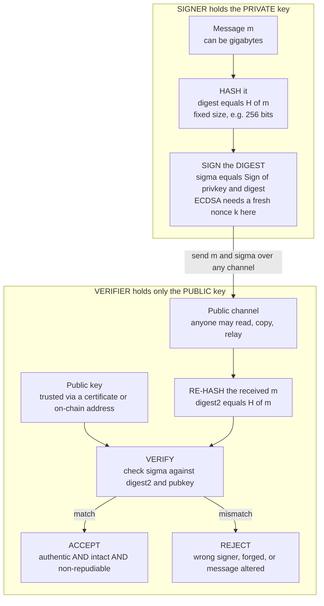

# ✍️ Digital Signatures

> [!abstract] TL;DR
> A **digital signature** is the public-key analog of a handwritten signature that is *unforgeable* and *tamper-evident*. The signer holds a **private key** and produces a signature `sigma` over a message; anyone with the matching **public key** can verify it. A valid signature gives **three guarantees at once**: **authentication** (it came from the holder of the private key), **integrity** (not one bit of the message changed since signing), and **non-repudiation** (the signer *cannot later deny* signing — because verification uses a *public* key that anyone can check, and only the signer holds the private key). This last property is exactly what separates signatures from **MACs**, which use a *shared* secret and therefore prove nothing about *which* of the two parties made the tag. In practice you never sign the raw message — you use the **hash-and-sign** paradigm: hash the message to a fixed-size digest, then sign the digest, so security leans on the hash's **collision resistance** (a hash collision *is* a signature forgery — how the **Flame** malware forged a Microsoft code-signing certificate via an MD5 collision). The gold-standard security definition is **EUF-CMA** (existential unforgeability under chosen-message attack). Real schemes: **RSA-PSS** (RSA "in reverse", must use PSS padding, never textbook), **DSA/ECDSA** (discrete-log based, secp256k1 powers Bitcoin/Ethereum, TLS, and SSH — but needs a fresh random **nonce** per signature), **Schnorr** (simple, linear, enables key aggregation and multisig — Bitcoin Taproot), and **EdDSA/Ed25519** (the modern best practice: **deterministic** nonces eliminate the nonce-reuse trap, fast, safe curve). The defining catastrophe is **nonce reuse in (EC)DSA**: sign two messages with the *same* `k` and the private key falls out of simple algebra — the exact bug behind the **Sony PS3** master-key leak and multiple **Bitcoin wallet** thefts.

---

## Intuition

**Analogy — the unforgeable wax seal.** A handwritten signature is supposed to prove *you* approved a document. But everyone knows the problem: a signature is trivial to trace, photocopy, or lift onto another page, and it says nothing about whether someone edited the paragraph *above* it after you signed. A medieval wax seal was a bit better — hard to duplicate without your signet ring — but you could still peel a seal off one letter and stick it on another, and the letter's text could be rewritten.

A **digital signature** is the version with all the holes plugged. You "sign" with a **secret private key** that only you possess, in such a way that **anyone** can verify the signature using your **public key** — yet **no one** can produce a valid signature without the private key, no matter how many of your genuine signatures they have already seen. And crucially, the signature is bound to *this exact message*: change a single character of the document and the signature stops verifying. So a digital signature is a seal that is (1) impossible to forge, (2) impossible to lift onto a different document, and (3) impossible to keep valid after even a one-bit edit.

There is one more twist that makes signatures *stronger* than the shared-secret world of [[Message_Authentication_Codes|MACs]]. Because verification uses a **public** key that the whole world can hold, a valid signature is **evidence a third party can check** — a judge, an auditor, a blockchain full of strangers. The signer cannot later say "that wasn't me" because only they had the private key. That property, **non-repudiation**, is why every TLS certificate, every code-signed app update, and every Bitcoin transaction is a *signature*, not a MAC.

---

## How It Works

### The three guarantees a signature provides

A verified signature over message `m` under public key `pk` simultaneously establishes:

1. **Authentication** — `m` was signed by whoever holds the private key `sk` matching `pk`. If `pk` is bound to an identity (via a certificate / PKI), that is *authenticity of origin*.
2. **Integrity** — `m` has not been altered since it was signed. Any modification, even one bit, breaks verification (this comes for free from the hash step below).
3. **Non-repudiation** — the signer cannot credibly deny having signed. Verification needs only the *public* key, so **any** third party can check it, and only the signer could have produced it. A MAC cannot give this: with a shared key, *either* party could have forged the tag, so a MAC proves integrity to the two participants but is worthless as evidence to an outsider.

This is the deep asymmetry: a **MAC** is symmetric-key integrity (fast, but repudiable and only checkable by key holders); a **signature** is public-key integrity (slower, but *publicly verifiable* and *non-repudiable*). Choose a signature precisely when you need public verifiability or legal-grade non-repudiation. See [[Hash_Functions_and_MACs]] and the forthcoming `Message_Authentication_Codes`.

### The hash-and-sign paradigm

You almost never feed the raw message into the signing math. Instead:

1. **Hash** the message to a fixed-size digest: `d = H(m)` (e.g. SHA-256).
2. **Sign** the *digest* with the private key: `sigma = Sign(sk, d)`.
3. To verify, the receiver **re-hashes** the received message `d' = H(m)` and checks `Verify(pk, d', sigma)`.

Two reasons. First, **practicality**: signing operates on a small fixed-size input, but you may want to sign a gigabyte file or a whole certificate. Second, **safety**: signing raw messages with textbook RSA has algebraic malleability problems that a hash destroys.

The price is that **security now rests on the hash's collision resistance**. If an attacker finds two messages `m1 != m2` with `H(m1) = H(m2)`, then a signature on `m1` is *automatically* a valid signature on `m2` — a forgery, obtained without ever attacking the signature scheme. This is not theoretical: the **Flame** espionage malware (2012) exploited an **MD5 collision** to forge a certificate that chained to Microsoft's code-signing root, letting it masquerade as a legitimate Windows Update. This is *the* reason MD5 and SHA-1 signatures are dangerous and modern systems mandate SHA-2 / SHA-3. See [[Hash_Functions]].

### The security definition: EUF-CMA

The standard bar for a signature scheme is **EUF-CMA — Existential Unforgeability under Chosen-Message Attack**. The game: an adversary is given the public key and a **signing oracle** — they may request valid signatures on *any messages they choose*, adaptively. They **win** if they output a valid `(m*, sigma*)` for **any** message `m*` they never asked the oracle to sign. A scheme is EUF-CMA-secure if no efficient adversary wins with non-negligible probability. "Existential" means even forging on *some* junk message they don't control counts as a break; "chosen-message" means we assume the attacker has already seen many of your genuine signatures. Proofs typically **reduce** forging to a hard problem (factoring for RSA, discrete log for Schnorr/ECDSA), often in the random-oracle model. See [[Provable_Security_and_Reductions]].

### Flow / Architecture



---

## Key Concepts

### Secondary (intuitive, no CS background needed)

- **A seal only you can stamp, but anyone can check.** The private key stamps; the public key checks. No one can fake your stamp even after seeing thousands of your genuine ones.
- **It locks the exact document.** Edit one character and the seal breaks — that is integrity.
- **You can't take it back.** Because the whole world can verify with your public key, you cannot later deny you signed. That is non-repudiation, and it is why contracts and software updates are *signed*.
- **Different from a password tag.** A shared-password "tag" (a MAC) only convinces the two people who share the password; a signature convinces *everyone*.

### Undergraduate (a first security or theory course)

- **Three algorithms.** `KeyGen -> (pk, sk)`, `Sign(sk, m) -> sigma`, `Verify(pk, m, sigma) -> {accept, reject}`. Correctness: honest signatures always verify.
- **Hash-and-sign.** Sign `H(m)`, not `m`. Security inherits the hash's **collision resistance** — a collision is a forgery.
- **EUF-CMA.** The right definition: unforgeable even against an adversary who obtains signatures on chosen messages. Weaker notions (universal, selective forgery) are insufficient.
- **Signatures vs MACs.** Public-key + non-repudiation + public verifiability (signatures) versus shared-key + faster + repudiable (MACs). Same "integrity + authenticity" goal, different trust model.
- **RSA must use PSS.** Never sign with *textbook* RSA or the deprecated PKCS#1 v1.5 for new designs — use **RSA-PSS** (randomized, provably secure padding). Textbook RSA is malleable and enables **Bleichenbacher**-style signature forgeries.
- **(EC)DSA needs a unique random nonce.** Every signature consumes a per-signature secret `k`. Reuse or predictability is catastrophic (below).

### Graduate (advanced / applied cryptography)

- **The scheme zoo.**
  - **RSA-PSS** — factoring-based; PSS gives a tight EUF-CMA reduction in the random-oracle model (Bellare-Rogaway). Large signatures/keys but simple verification, still ubiquitous in TLS/PKI.
  - **DSA / ECDSA** — discrete-log based. ECDSA over **secp256k1** signs every Bitcoin/Ethereum transaction; over NIST P-256 it is everywhere in TLS and SSH. Compact, but the **random nonce** requirement is a footgun and there is *no* clean tight EUF-CMA proof without idealized assumptions.
  - **Schnorr** — `s = k + e*x` with `e = H(R, pk, m)`. Provably EUF-CMA in the ROM, and **linear**, which enables **key/signature aggregation** and clean **MuSig** multisignatures. Bitcoin's **Taproot** upgrade adopted Schnorr precisely for these benefits. Its Fiat-Shamir structure is the bridge to [[Zero_Knowledge_Proofs]].
  - **EdDSA / Ed25519** — Schnorr instantiated over the safe **Curve25519** (Edwards form) with a **deterministic** nonce `k = H(hash_of_key, m)`. This *removes the RNG from the signing path entirely*, killing the nonce-reuse class of bugs, and it is fast and constant-time. The recommended default today.
- **Deterministic nonces.** **RFC 6979** derives `k` deterministically via HMAC from the private key and message digest, so bad randomness cannot repeat or bias `k`. EdDSA bakes this in by design. Both are responses to the disasters below.
- **Advanced signature families.** **Blind** signatures (signer signs without seeing the message — Chaum e-cash, privacy tokens); **threshold / multi**-signatures (k-of-n signers, Bitcoin multisig, threshold-ECDSA custody); **aggregate** signatures (**BLS** combines thousands of signatures into one — Ethereum 2.0 / consensus attestations); **ring** signatures (sign on behalf of a group anonymously — Monero). See [[Commitment_Schemes]] and the forthcoming `Blockchain_Cryptography`.
- **Post-quantum.** **Shor's algorithm** breaks RSA, DSA, ECDSA, *and* EdDSA (all rest on factoring or discrete log). **Hash-based signatures** — Lamport one-time, Merkle trees, stateful **XMSS/LMS**, and stateless **SPHINCS+** (a NIST PQC standard) — rely *only* on hash-function security and are believed quantum-resistant, at the cost of larger signatures and (for stateful schemes) careful state management. See [[Post_Quantum_Cryptography]].

---

## Python Demo

```python
# DIGITAL SIGNATURES -- hash-and-sign, integrity, forgery, and the NONCE-REUSE catastrophe.
#
# We implement a TOY DSA (discrete-log signature over a small prime-order subgroup)
# purely to make the algebra visible. The parameter sizes are laughably small for
# real security -- the point is the *math*, which is identical to real ECDSA.
#
#   (a) GENUINE  : Verify SUCCEEDS on the real (message, signature) pair.
#   (b) INTEGRITY: flip ONE bit of the message -> Verify FAILS (hash-and-sign catches it).
#   (c) FORGERY  : someone WITHOUT the private key picks a signature -> Verify FAILS.
#   (d) NONCE REUSE: sign TWO messages with the SAME nonce k -> the PRIVATE KEY is
#                    recovered by simple algebra (the Sony PS3 / Bitcoin-wallet disaster).
#   (e) THE FIX  : deterministic nonces (RFC 6979 / EdDSA spirit) -> every k differs,
#                  no key leak.
#
# Pure standard library + hashlib for crypto; matplotlib only to draw the result.
# Requires Python 3.8+ for pow(a, -1, m) modular inverse.

import hashlib
import random
import matplotlib.pyplot as plt

random.seed(1)  # reproducible demo (real signing must use a CSPRNG!)

# ---------------------------------------------------------------------------
# Toy DSA parameters: prime p, prime subgroup order q | (p-1), generator g of order q
# ---------------------------------------------------------------------------
def is_probable_prime(n, rounds=24):
    if n < 2:
        return False
    for sp in (2, 3, 5, 7, 11, 13, 17, 19, 23, 29, 31, 37):
        if n % sp == 0:
            return n == sp
    d, r = n - 1, 0
    while d % 2 == 0:
        d //= 2
        r += 1
    for _ in range(rounds):
        a = random.randrange(2, n - 1)
        x = pow(a, d, n)
        if x in (1, n - 1):
            continue
        for _ in range(r - 1):
            x = pow(x, 2, n)
            if x == n - 1:
                break
        else:
            return False
    return True

def gen_prime(bits):
    while True:
        n = random.getrandbits(bits) | 1 | (1 << (bits - 1))
        if is_probable_prime(n):
            return n

def gen_dsa_params(qbits=64, pbits=256):
    q = gen_prime(qbits)
    while True:                                   # find p = z*q + 1 that is prime
        z = random.getrandbits(pbits - qbits) | (1 << (pbits - qbits - 1)) | 1
        p = z * q + 1
        if is_probable_prime(p):
            break
    while True:                                   # generator of the order-q subgroup
        g = pow(random.randrange(2, p - 1), (p - 1) // q, p)
        if g != 1:
            return p, q, g

p, q, g = gen_dsa_params()

# Key pair: private x, public y = g^x mod p
x_priv = random.randrange(1, q)
y_pub = pow(g, x_priv, p)

def Hq(msg: bytes) -> int:
    """Hash-and-sign: SHA-256 digest reduced into the signing group Z_q."""
    return int.from_bytes(hashlib.sha256(msg).digest(), "big") % q

def sign(msg: bytes, x: int, k: int = None) -> tuple:
    """DSA sign. If k is None a fresh RANDOM nonce is used (the correct behaviour)."""
    h = Hq(msg)
    while True:
        kk = k if k is not None else random.randrange(1, q)
        r = pow(g, kk, p) % q
        s = (pow(kk, -1, q) * (h + x * r)) % q
        if r != 0 and s != 0:
            return (r, s)
        if k is not None:
            raise ValueError("degenerate nonce")

def verify(msg: bytes, sig: tuple, y: int) -> bool:
    r, s = sig
    if not (0 < r < q and 0 < s < q):
        return False
    h = Hq(msg)
    w = pow(s, -1, q)
    u1, u2 = (h * w) % q, (r * w) % q
    v = (pow(g, u1, p) * pow(y, u2, p) % p) % q
    return v == r

# ---------------------------------------------------------------------------
# (a) GENUINE  (b) INTEGRITY  (c) FORGERY
# ---------------------------------------------------------------------------
msg = b"Transfer 100 dollars to Alice"
sig = sign(msg, x_priv)
genuine_ok = verify(msg, sig, y_pub)
print(f"(a) GENUINE   : verify(real msg, real sig) = {genuine_ok}   -> expect True")

tampered = b"Transfer 900 dollars to Alice"          # changed one digit
tampered_ok = verify(tampered, sig, y_pub)
print(f"(b) INTEGRITY : verify(TAMPERED msg, real sig) = {tampered_ok}   -> expect False")

forged_ok = any(verify(msg, (random.randrange(1, q), random.randrange(1, q)), y_pub)
                for _ in range(1000))               # forger has NO private key
print(f"(c) FORGERY   : 1000 blind forgeries WITHOUT private key, any accepted? {forged_ok}   -> expect False")

# ---------------------------------------------------------------------------
# (d) NONCE-REUSE CATASTROPHE -- recover the private key from two signatures
# ---------------------------------------------------------------------------
k_reused = random.randrange(1, q)                    # the FATAL mistake: fixed nonce
m1 = b"Pay Bob 10 coins"
m2 = b"Pay Eve 50 coins"
r1, s1 = sign(m1, x_priv, k=k_reused)
r2, s2 = sign(m2, x_priv, k=k_reused)
assert r1 == r2, "reused k -> identical r is the tell-tale sign"
print(f"\n(d) NONCE REUSE: both signatures share r = {r1}  (the giveaway)")

h1, h2 = Hq(m1), Hq(m2)
# s = k^-1 (h + x r)  =>  s1 - s2 = k^-1 (h1 - h2)  =>  k = (h1 - h2)/(s1 - s2)
k_rec = ((h1 - h2) * pow((s1 - s2) % q, -1, q)) % q
# then  x = (s1 * k - h1) / r
x_rec = ((s1 * k_rec - h1) * pow(r1, -1, q)) % q
recovered = (x_rec == x_priv)
print(f"    recovered nonce k  matches: {k_rec == k_reused}")
print(f"    RECOVERED PRIVATE KEY matches real key: {recovered}   <-- total compromise")

# ---------------------------------------------------------------------------
# (e) THE FIX -- deterministic nonces (RFC 6979 / EdDSA spirit): k = H(x || H(m))
# ---------------------------------------------------------------------------
def det_nonce(msg: bytes, x: int) -> int:
    seed = x.to_bytes(32, "big") + hashlib.sha256(msg).digest()
    return (int.from_bytes(hashlib.sha256(seed).digest(), "big") % (q - 1)) + 1

r1d = sign(m1, x_priv, k=det_nonce(m1, x_priv))[0]
r2d = sign(m2, x_priv, k=det_nonce(m2, x_priv))[0]
print(f"\n(e) DETERMINISTIC nonces: r values differ ({r1d != r2d}) -> no reuse, no key leak, "
      f"and no dependence on a good RNG.")

# ---------------------------------------------------------------------------
# VISUALIZE
# ---------------------------------------------------------------------------
fig, ax = plt.subplots(1, 2, figsize=(15, 5.6))

cases = ["(a) genuine\nsig", "(b) 1-bit\ntampered", "(c) blind\nforgery"]
results = [1 if genuine_ok else 0, 1 if tampered_ok else 0, 1 if forged_ok else 0]
colors = ["seagreen" if v else "crimson" for v in results]
ax[0].bar(cases, [1, 1, 1], color="lightgray", edgecolor="white")   # backdrop
ax[0].bar(cases, results, color=colors, edgecolor="black")
for i, v in enumerate(results):
    ax[0].text(i, 0.5, "ACCEPT" if v else "REJECT", ha="center", va="center",
               fontweight="bold", color="white")
ax[0].set_ylim(0, 1.2)
ax[0].set_yticks([])
ax[0].set_title("Sign / Verify: only the genuine pair is accepted\n"
                "tampering and forgery are both rejected")

nonce_cases = ["unique / deterministic\nnonce (SAFE)", "REUSED nonce\n(key recovered!)"]
exposure = [0, 1]                                    # 0 = key safe, 1 = key leaked
ax[1].bar(nonce_cases, exposure, color=["seagreen", "crimson"], edgecolor="black")
ax[1].set_ylim(0, 1.25)
ax[1].set_ylabel("private-key exposure")
ax[1].set_yticks([0, 1])
ax[1].set_yticklabels(["safe", "FULLY LEAKED"])
ax[1].text(1, 1.05, f"x recovered = {hex(x_rec)[:12]}...", ha="center",
           color="crimson", fontweight="bold", fontsize=9)
ax[1].set_title("(EC)DSA nonce reuse: two signatures with the same k\n"
                "leak the private key by algebra -- Sony PS3 / Bitcoin thefts")

plt.tight_layout()
plt.show()

print("\nTakeaway: hash-and-sign makes a signature bind the EXACT message (b), it is")
print("unforgeable without the private key (c) -- but (EC)DSA hands the private key to")
print("anyone if the nonce k is EVER reused (d). Deterministic nonces / EdDSA fix it (e).")
```

**What the demo shows.** Parts (a)-(c): the toy DSA behaves like a real signature — the honest `(message, signature)` pair verifies, a one-bit edit to the message breaks verification (hash-and-sign integrity), and a thousand blind forgeries by someone *without* the private key are all rejected. Part (d) is the punchline: sign two *different* messages with the **same nonce `k`** and the two signatures betray it by sharing the same `r`; from `s1, s2, h1, h2, r` we solve two linear equations for the nonce `k` and then for the **private key `x`** — the recovered key equals the real key exactly. That is a *total* compromise from a single reused random value, and it is precisely the bug that leaked the **Sony PS3** ECDSA master key and drained **Bitcoin/Android** wallets with weak RNGs. Part (e) shows the fix: deriving `k` **deterministically** from the private key and message (RFC 6979 / EdDSA) makes every nonce distinct and independent of the platform RNG, closing the hole. The left plot summarizes accept/reject; the right plot contrasts "key safe" with "key fully leaked."

---

## Real-World Applications

> **Example — every Bitcoin transaction is an ECDSA (now also Schnorr) signature.** To spend coins, a wallet signs the transaction's hash with the private key controlling the source address, over the **secp256k1** curve. Validators worldwide re-hash the transaction and verify against the public key — this is authentication (only the key holder can spend), integrity (change any output and the signature is void), and non-repudiation (the whole network holds the public key). Bitcoin's **Taproot** upgrade added **Schnorr** signatures so that a multi-party spend can be *aggregated* into a single signature indistinguishable from an ordinary one, improving privacy and fee efficiency. See [[ECDSA_and_Digital_Signatures]], [[Taproot_and_SegWit]], and [[Cryptographic_Primitives_Blockchain]].

- **TLS certificates and the web PKI.** A Certificate Authority *signs* your server's certificate; browsers verify the CA's signature to trust the public key, then the handshake itself is authenticated with a signature (RSA-PSS or ECDSA). This is how HTTPS proves you are really talking to the site. See [[TLS_Protocol_Deep_Dive]] and [[Asymmetric_Cryptography_and_PKI]].
- **Code signing and software updates.** OS vendors sign binaries and update packages; the device verifies the signature before installing, preventing malicious tampering. The **Flame** malware defeated this by forging a code-signing cert via an MD5 hash collision — a live demonstration of why hash choice matters.
- **JSON Web Tokens (JWT).** `RS256`, `ES256`, and `EdDSA` JWTs are *signed* so a resource server can verify a token issued by an auth server without sharing a secret. (`HS256` uses a MAC instead — shared secret, no non-repudiation.) See [[JWT_and_OAuth]].
- **SSH, DNSSEC, and document signing.** SSH host/user keys authenticate connections; DNSSEC signs DNS records to stop spoofing; PDF / DocuSign / eIDAS e-signatures give legally recognized non-repudiation.
- **Ethereum 2.0 / consensus.** **BLS aggregate signatures** combine thousands of validator attestations into one compact signature, making large-scale proof-of-stake consensus verifiable cheaply.

---

## Common Pitfalls

- **Reusing or under-randomizing the (EC)DSA nonce `k`.** *The* defining catastrophe. A reused `k` (fixed, or from a broken RNG) lets anyone recover the private key by algebra, as in the demo — this is the **Sony PS3** master-key leak (a hardcoded `k`) and the 2013 **Android SecureRandom** Bitcoin wallet thefts (a biased RNG produced repeated nonces). Even *partially predictable* or *biased* nonces leak the key via lattice attacks. Fix: **deterministic nonces (RFC 6979)** or use **EdDSA/Ed25519**, which is deterministic by construction. See the forthcoming `Cryptographic_Failures_and_Misuse` and `Random_Number_Generation`.
- **Signing with a broken hash.** Because a hash collision *is* a forgery, MD5 and SHA-1 signatures are dangerous (Flame, SHAttered). Use SHA-256 or better. See [[Hash_Functions]].
- **Textbook RSA or PKCS#1 v1.5 signatures.** Raw RSA signing is malleable; the legacy PKCS#1 v1.5 padding enabled **Bleichenbacher** signature forgeries when verifiers parsed padding loosely. Use **RSA-PSS** for new systems.
- **Signing a hash you did not compute yourself.** If a protocol lets an attacker supply the digest directly (instead of the message), they can sign arbitrary things. Always hash the *message* inside the trusted signer.
- **Confusing a signature with encryption, or "sign-then-encrypt" ordering mistakes.** Signing proves origin/integrity, not confidentiality. Naive combinations (e.g. sign-then-encrypt) have surprising identity-misbinding attacks; use vetted authenticated constructions.
- **Assuming a MAC gives non-repudiation.** It does not — a shared key means either party could have made the tag. If you need to prove to a *third* party who authored a message, you need a **signature**, not a MAC. See [[Hash_Functions_and_MACs]].
- **Not verifying the public key's binding.** A valid signature under the *wrong* public key proves nothing about identity. Non-repudiation and authenticity depend on trusting `pk` via a certificate / PKI or an on-chain address.

---

## Related Concepts

- [[Hash_Functions]] — hash-and-sign signs the digest, so a signature's forgery-resistance inherits the hash's **collision resistance**; MD5/SHA-1 collisions become signature forgeries.
- [[Provable_Security_and_Reductions]] — home of **EUF-CMA** and the reductions that base signature security on factoring or discrete log, often in the random-oracle model.
- [[Asymmetric_Cryptography_and_PKI]] — the public/private key machinery and the certificate/PKI trust that binds a public key to an identity, which is what makes a signature *authenticate* someone.
- [[Hash_Functions_and_MACs]] — the symmetric-key counterpart: MACs give integrity/authenticity to key holders but are **repudiable** and not publicly verifiable — the exact contrast that motivates signatures.
- [[ECDSA_and_Digital_Signatures]] — the Blockchain-vault deep dive on ECDSA over secp256k1, address derivation, and transaction signing.
- [[Taproot_and_SegWit]] — Bitcoin's adoption of **Schnorr** signatures for aggregation, multisig, and privacy.
- [[Zero_Knowledge_Proofs]] — Schnorr signatures are a Fiat-Shamir-transformed sigma protocol, tying signatures directly to ZK proof techniques.
- [[Commitment_Schemes]] — a sibling primitive built on the same hardness/hash foundations; commitments and signatures both underpin blockchain and MPC protocols.
- [[Cryptographic_Primitives_Blockchain]] — how signatures sit alongside hashes and Merkle trees as the primitives securing distributed ledgers.
- [[TLS_Protocol_Deep_Dive]] — signatures authenticate the TLS handshake and the certificate chain that secures HTTPS.
- [[Post_Quantum_Cryptography]] — Shor breaks RSA/ECDSA/EdDSA; **hash-based signatures** (SPHINCS+, XMSS) are the quantum-resistant route.
- [[JWT_and_OAuth]] — signed JWTs (`RS256`/`ES256`/`EdDSA`) versus MAC-based (`HS256`) tokens: the same signatures-vs-MACs decision in the wild.

*(Forthcoming siblings in this Cryptography vault — `Public_Key_Cryptography_Foundations`, `Message_Authentication_Codes`, `RSA`, `Elliptic_Curve_Cryptography`, `Key_Exchange_and_PKI`, `Blockchain_Cryptography`, `Cryptographic_Failures_and_Misuse`, and `Random_Number_Generation` — are referenced in prose above and will each deepen a slice of this note once written.)*

---

## Review Questions

1. **(Conceptual)** A colleague argues "we already authenticate our API requests with HMAC, so digital signatures would add nothing." Explain the *specific* guarantee a signature provides that an HMAC cannot, why it arises from public-key rather than shared-key verification, and give one concrete scenario where that guarantee is legally or operationally decisive.
2. **(Scenario / quantitative)** You are handed two ECDSA signatures `(r, s1)` and `(r, s2)` over two different messages `m1 != m2`, both under the same public key, and you notice the `r` components are identical. Show, step by step, how you recover first the nonce `k` and then the private key `x`, and name two real-world incidents this attack caused. What single change to the signing procedure would have prevented it, and why does EdDSA get this right by design?
3. **(Trade-off)** You must choose a signature scheme for (a) a new blockchain wanting compact signatures and easy multisig, (b) a firmware-update system that must remain secure against a future quantum adversary, and (c) a legacy TLS PKI that must interoperate with existing CAs. For each, pick among RSA-PSS, ECDSA, Ed25519, Schnorr, and SPHINCS+, and justify the choice in terms of size, aggregation, nonce-safety, and quantum resistance.

---

## Sources

- NIST (2023). *FIPS 186-5: Digital Signature Standard (DSS).* https://csrc.nist.gov/pubs/fips/186-5/final — Normative specification of DSA, ECDSA, RSA, and EdDSA.
- Katz, J., & Lindell, Y. (2020). *Introduction to Modern Cryptography* (3rd ed.). CRC Press. — Signature definitions, EUF-CMA, hash-and-sign, RSA-PSS, and Schnorr.
- Bernstein, D. J., Duif, N., Lange, T., Schwabe, P., & Yang, B.-Y. (2012). "High-speed high-security signatures" (Ed25519). *Journal of Cryptographic Engineering.* https://ed25519.cr.yp.to/ed25519-20110926.pdf — The deterministic EdDSA design.
- Pornin, T. (2013). *RFC 6979: Deterministic Usage of the Digital Signature Algorithm (DSA) and Elliptic Curve DSA (ECDSA).* https://www.rfc-editor.org/rfc/rfc6979 — The deterministic-nonce fix for the reuse catastrophe.
- Bellare, M., & Rogaway, P. (1996). "The Exact Security of Digital Signatures — How to Sign with RSA and Rabin" (PSS). *EUROCRYPT 1996.* https://cseweb.ucsd.edu/~mihir/papers/exactsigs.html — The probabilistic signature scheme and its tight security reduction.

---

#cryptography #digital-signatures #ecdsa #eddsa #non-repudiation
