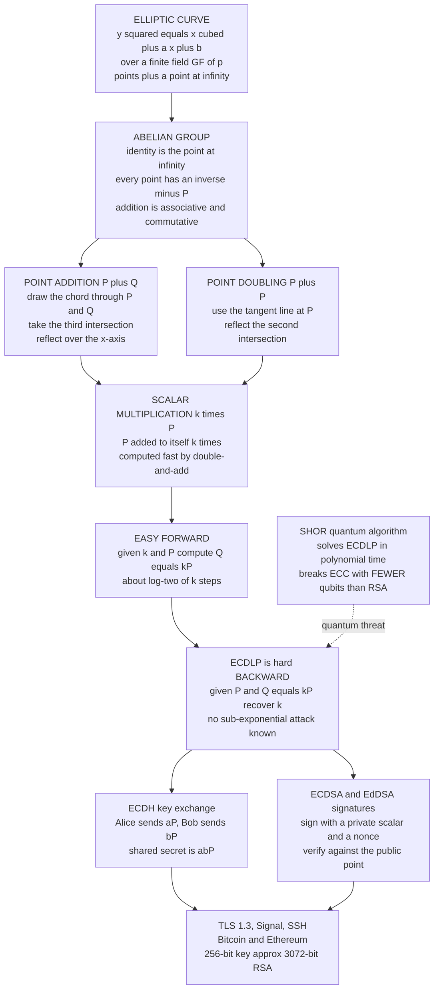

# 🔑 Elliptic Curve Cryptography

> [!abstract] TL;DR
> **Elliptic Curve Cryptography (ECC)** does public-key cryptography inside the group of points on a curve `y^2 = x^3 + a x + b` over a **finite field**. Those points form an **abelian group** under a geometric "chord-and-tangent" addition, and the one-way function is **scalar multiplication** `k·P` — trivial to compute forward but, backward, the **Elliptic-Curve Discrete Log Problem (ECDLP)** of recovering `k` from `P` and `k·P` has **no known sub-exponential attack**. That single fact makes ECC *harder per bit* than RSA or classical Diffie–Hellman, so a **256-bit** elliptic-curve key matches a **3072-bit** RSA key (≈128-bit symmetric security). ECC is the workhorse of the modern internet: **ECDHE** key exchange and **ECDSA/Ed25519** signatures secure TLS 1.3, SSH, Signal, and Bitcoin/Ethereum. Its two famous traps are **nonce reuse in ECDSA** (leaks the private key outright) and **implementation side channels**; and like all discrete-log crypto, **Shor's algorithm breaks it** on a large quantum computer.

---

## Intuition

**Analogy — the bouncing billiard ball.** Picture a strange curved billiard table. The rule for "adding" two balls is geometric: draw a straight line through them, see where that line strikes the curve a *third* time, and bounce to the mirror image of that point. Start from one fixed ball `P` and keep bouncing — `P`, then `P+P`, then that plus `P` again — a secret number of times. After `k` bounces you land at some point `Q` that looks utterly random and scattered. Anyone watching can *see* the ball you started from and the ball you ended on. But asking them **"how many bounces did it take?"** is hopeless: there is no shortcut that reads the bounce-count off the final position — you would have to replay the bounces one by one, and for real curves that count is a 256-bit number.

That hidden bounce-count `k` **is your private key**, and the landing point `Q = k·P` **is your public key**. The forward trip is fast (bounce cleverly by doubling); the backward question is the intractable ECDLP. The magic is that this hidden-counter problem is *so much harder* on a curve than on ordinary numbers that you get the same security as RSA while carrying a key **one-tenth the size** — which is exactly why your phone, your browser, and your crypto wallet all quietly run on curves.

---

## How It Works

### The curve and its group

An elliptic curve over the finite field `GF(p)` (integers mod a prime `p`) is the set of solutions `(x, y)` to

```
y^2 = x^3 + a x + b   (mod p),   with   4a^3 + 27b^2 != 0 (mod p)
```

The side condition (nonzero discriminant) forbids a singular curve with a cusp or self-crossing, where the group law would break. To this set of points we bolt on one extra element, the **point at infinity** `O`, imagined as sitting infinitely far up the vertical axis. Together, **the points plus `O` form an abelian group** — and *that* group, not the geometry, is the object cryptography actually uses.

### The group law: chord-and-tangent

The addition rule is engineered so that **three collinear points sum to the identity**. Concretely:

1. **Adding distinct points `P + Q`** — draw the straight line (the *chord*) through `P` and `Q`. A cubic meets a line in exactly three points, so it hits the curve at a unique third point; **reflect that third point over the x-axis** and you have `P + Q`. Algebraically the slope is `m = (y2 − y1)/(x2 − x1)`, and then `x3 = m^2 − x1 − x2`, `y3 = m(x1 − x3) − y1`.
2. **Doubling `P + P`** — when the two points coincide there is no chord, so use the **tangent line** at `P` (slope `m = (3·x1^2 + a)/(2·y1)`), take its second intersection, and reflect.
3. **Identity** — the point at infinity `O` is the neutral element: `P + O = P`.
4. **Inverses** — the inverse of `P = (x, y)` is its mirror `−P = (x, −y)`; the vertical line through them "meets the curve at infinity", so `P + (−P) = O`.

All four axioms of an abelian group hold (associativity is the non-obvious one — it follows from the geometry). Crucially, **all of this arithmetic is done modulo `p`**, so "reflecting over the x-axis" means negating `y` mod `p`; the pictures over the real numbers are only for intuition.

### Scalar multiplication and the hard problem

Repeated addition defines **scalar multiplication** `k·P = P + P + ... + P` (`k` times). Naively that is `k` additions — hopeless for a 256-bit `k` — but **double-and-add** computes it in about `log2(k)` steps by reading `k`'s bits: square-and-multiply, transplanted from exponents to the curve. So the **forward** map `k ↦ k·P` is cheap.

The **backward** map is the **Elliptic-Curve Discrete Log Problem (ECDLP)**: given the base point `P` and the result `Q = k·P`, recover the scalar `k`. This is believed **exponentially hard** — the best known attacks (Pollard's rho, baby-step giant-step) cost about `sqrt(n)` where `n` is the group order, and — unlike integer factoring or the discrete log in `Z_p*` — **no sub-exponential (index-calculus) algorithm is known** for well-chosen curves. That is the whole efficiency argument: because ECDLP is *harder per bit*, a **256-bit** curve gives ≈128-bit security, matching **RSA-3072**. See [[Computational_Hardness_Assumptions]].

### What gets built on it

- **ECDH** — elliptic-curve Diffie–Hellman: Alice's secret is a scalar `a`, her public key `a·P`; Bob's are `b` and `b·P`. Each computes the shared point `a·(b·P) = b·(a·P) = ab·P`. **ECDHE** (ephemeral) is the dominant key exchange in TLS 1.3; **X25519** is the modern default.
- **ECDSA / EdDSA** — signatures. ECDSA signs with the private scalar plus a **fresh random nonce**; EdDSA/Ed25519 derives that nonce **deterministically** from the message and key, dodging the nonce catastrophe.

### Flow / Architecture



---

## Key Concepts

### Secondary (intuitive, no CS background)

- **A curve is a calculator with a secret counter.** Pick a starting point and "add" it to itself a secret number of times. Publishing where you land is safe; the number of steps is your private key, and nobody can count backward.
- **Smaller keys, same strength.** Because the curve's puzzle is harder than plain-number puzzles, ECC needs far fewer digits — a 256-bit ECC key is as strong as a 3072-bit RSA key. Smaller keys mean faster math and less data to send — perfect for phones and IoT.
- **You use it constantly.** The padlock in your browser, your SSH login, Signal messages, and every Bitcoin transaction are all signed and sealed with elliptic curves.
- **Two famous ways it breaks.** Reuse a "random" value in a signature and thieves can recover your key (this is how the PlayStation 3 was hacked). And a future quantum computer would break it entirely.

### Undergraduate (a first crypto or algebra course)

- **The group law.** Points on `y^2 = x^3 + ax + b` over `GF(p)`, plus `O`, form an abelian group; `−(x,y) = (x,−y)`, three collinear points sum to `O`, and addition uses chord (distinct points) or tangent (doubling) slopes computed **mod p** with a modular inverse.
- **Scalar multiplication = the one-way function.** `k·P` by double-and-add is `O(log k)` group operations; inverting it is the ECDLP.
- **Why ECC beats RSA per bit.** No index-calculus / sub-exponential attack exists on generic curves, so ECDLP security scales like `sqrt(n)` in the group order; the NIST equivalences are 128-bit ⇒ ECC-256 vs RSA-3072, 256-bit ⇒ ECC-521 vs RSA-15360.
- **ECDH.** The Diffie–Hellman protocol transplanted into a curve group; the shared secret is the point `ab·P`. See [[Diffie_Hellman_and_Discrete_Log]] and [[Asymmetric_Cryptography_and_PKI]].
- **ECDSA vs EdDSA.** ECDSA needs a unique unpredictable nonce per signature; **reuse or bias leaks the private key**. Ed25519 makes the nonce deterministic (hash of key + message), is faster, and is misuse-resistant. See [[ECDSA_and_Digital_Signatures]].

### Graduate (advanced cryptography)

- **Curve selection and trust.** NIST P-256/P-384 use designer-chosen constants that drew backdoor suspicion post-Snowden; **Curve25519/Ed25519** (Bernstein) use rigid, transparent parameters and safe defaults. The **SafeCurves** criteria formalize this (twist security, rigidity, complete addition laws, no small-subgroup traps).
- **Weak-curve pitfalls.** **Anomalous** curves (`#E = p`) admit a polynomial-time attack; **supersingular** / small **embedding degree** curves fall to the **MOV/Frey–Rück** attack that maps ECDLP to a tractable finite-field DLP via pairings. Choosing a curve with large prime order and a large embedding degree is essential.
- **Constant-time arithmetic.** Naive double-and-add branches on secret key bits, leaking them through timing/power; the **Montgomery ladder** performs a fixed sequence of operations per bit and is the standard defense. See side-channel discussion below.
- **Point validation.** **Invalid-curve** and **small-subgroup / twist** attacks feed a victim a point that is *not* on the intended curve (or lies on its twist) to extract key bits; implementations must validate that received points satisfy the curve equation and lie in the correct prime-order subgroup.
- **Pairings (advanced branch).** Bilinear pairings on special curves enable **identity-based encryption**, short **BLS signatures** (aggregatable — used in Ethereum's consensus), and some **zk-SNARKs**. See [[Zero_Knowledge_Proofs]].
- **Quantum vulnerability.** **Shor's algorithm** solves ECDLP in polynomial time — and ECC actually falls with *fewer* logical qubits than RSA for a given security level, so migration to [[Post_Quantum_Cryptography]] is a live concern.

---

## Python Demo

```python
# ELLIPTIC-CURVE CRYPTOGRAPHY FROM SCRATCH -- pure standard library, matplotlib
# only to draw. We (1) implement the group law over a small prime field, (2) verify
# it really is a group (identity, inverses, associativity), (3) run a toy ECDH, (4)
# brute-force the ECDLP and time how it scales, (5) contrast ECC vs RSA key sizes,
# and (6) visualize the curve, geometric point addition, and the finite-field points.

import time
import random
import matplotlib.pyplot as plt

random.seed(1)

# ---------------------------------------------------------------------------
# 1) The group law on  y^2 = x^3 + a*x + b  (mod p).  Identity O = None.
# ---------------------------------------------------------------------------
class Curve:
    def __init__(self, a, b, p):
        assert (4 * a**3 + 27 * b**2) % p != 0, "singular curve (bad discriminant)"
        self.a, self.b, self.p = a % p, b % p, p

    def on_curve(self, P):
        if P is None:                       # point at infinity is always "on"
            return True
        x, y = P
        return (y * y - (x * x * x + self.a * x + self.b)) % self.p == 0

def inv_mod(k, p):                          # modular inverse via Fermat (p prime)
    return pow(k % p, p - 2, p)

def add(C, P, Q):
    p, a = C.p, C.a
    if P is None:                           # O + Q = Q
        return Q
    if Q is None:                           # P + O = P
        return P
    x1, y1 = P
    x2, y2 = Q
    if x1 == x2 and (y1 + y2) % p == 0:     # P + (-P) = O
        return None
    if P == Q:                              # DOUBLING: use the tangent slope
        if y1 % p == 0:                     # tangent is vertical -> O
            return None
        m = (3 * x1 * x1 + a) * inv_mod(2 * y1, p) % p
    else:                                   # ADDITION: use the chord slope
        m = (y2 - y1) * inv_mod(x2 - x1, p) % p
    x3 = (m * m - x1 - x2) % p
    y3 = (m * (x1 - x3) - y1) % p
    return (x3, y3)

def mul(C, k, P):                           # SCALAR MULT via double-and-add
    R, base = None, P
    while k > 0:
        if k & 1:
            R = add(C, R, base)
        base = add(C, base, base)
        k >>= 1
    return R

def points_of(C):                           # enumerate all affine points + O
    pts = [None]
    for x in range(C.p):
        rhs = (x**3 + C.a * x + C.b) % C.p
        for y in range(C.p):
            if (y * y) % C.p == rhs:
                pts.append((x, y))
    return pts

# ---------------------------------------------------------------------------
# 2) VERIFY it is genuinely an abelian group.
# ---------------------------------------------------------------------------
C = Curve(a=2, b=3, p=97)
pts = points_of(C)
print(f"Curve y^2 = x^3 + 2x + 3 (mod 97) has {len(pts)} points (incl. O).")

assert all(C.on_curve(P) for P in pts)
# identity:  P + O = P
assert all(add(C, P, None) == P for P in pts)
# inverses:  P + (-P) = O
for P in pts:
    negP = None if P is None else (P[0], (-P[1]) % C.p)
    assert add(C, P, negP) is None
# associativity:  (P+Q)+R == P+(Q+R)  on a random sample
for _ in range(400):
    P, Q, R = random.choice(pts), random.choice(pts), random.choice(pts)
    assert add(C, add(C, P, Q), R) == add(C, P, add(C, Q, R))
print("Group axioms hold: identity O, inverses (x,-y), and associativity verified.")

# double-and-add must match plain repeated addition
G = next(P for P in pts if P is not None)
acc = None
for k in range(1, 25):
    acc = add(C, acc, G)                    # slow: G added k times
    assert acc == mul(C, k, G)             # fast: double-and-add
print(f"double-and-add matches repeated addition; base point G = {G}.")

# ---------------------------------------------------------------------------
# 3) ELLIPTIC-CURVE DIFFIE-HELLMAN (ECDH).
# ---------------------------------------------------------------------------
a_priv = random.randrange(2, 90)           # Alice's secret scalar
b_priv = random.randrange(2, 90)           # Bob's   secret scalar
A_pub = mul(C, a_priv, G)                  # Alice's public point  a*G
B_pub = mul(C, b_priv, G)                  # Bob's   public point  b*G
shared_alice = mul(C, a_priv, B_pub)       # a*(b*G)
shared_bob   = mul(C, b_priv, A_pub)       # b*(a*G)
assert shared_alice == shared_bob
print(f"\nECDH: Alice a={a_priv}, Bob b={b_priv} -> shared point {shared_alice} "
      f"(matches: {shared_alice == shared_bob}).")

# ---------------------------------------------------------------------------
# 4) The ECDLP is HARD backward.  Brute-force recover k from Q = k*G, and time
#    how the cost scales with the field size p.
# ---------------------------------------------------------------------------
def ecdlp_bruteforce(C, G, Q):
    R, k = None, 0
    while True:
        if R == Q:
            return k
        R = add(C, R, G)
        k += 1

primes = [97, 199, 401, 797, 1601, 3203, 6421, 12809]
sizes, times = [], []
for p in primes:
    Cp = Curve(a=2, b=3, p=p)
    Gp = next(P for P in points_of(Cp) if P is not None)
    secret = random.randrange(2, p)
    Q = mul(Cp, secret, Gp)
    t0 = time.perf_counter()
    recovered = ecdlp_bruteforce(Cp, Gp, Q)
    dt = time.perf_counter() - t0
    assert mul(Cp, recovered, Gp) == Q     # recovered a valid discrete log
    sizes.append(p)
    times.append(dt)
print("\nECDLP brute force scales ~linearly with field size (real crypto uses 2^256):")
for p, t in zip(sizes, times):
    print(f"  p = {p:>6}:  {t*1e3:8.2f} ms")

# ---------------------------------------------------------------------------
# 5) ECC vs RSA key size for equal security (NIST SP 800-57 equivalences).
# ---------------------------------------------------------------------------
sym  = [80, 112, 128, 192, 256]            # symmetric-equivalent security bits
rsa  = [1024, 2048, 3072, 7680, 15360]     # RSA / classical DH modulus bits
ecc  = [160, 224, 256, 384, 521]           # elliptic-curve key bits

# ---------------------------------------------------------------------------
# 6) VISUALIZE: real curve, geometric point addition, finite-field points.
# ---------------------------------------------------------------------------
fig, ax = plt.subplots(2, 3, figsize=(17, 10))

# (a) a smooth real curve  y^2 = x^3 - x + 1
def real_curve(a, b, xs):
    X, Yp, Yn = [], [], []
    for x in xs:
        rhs = x**3 + a * x + b
        if rhs >= 0:
            X.append(x); Yp.append(rhs**0.5); Yn.append(-rhs**0.5)
    return X, Yp, Yn
xs = [(-2.0 + 0.01 * i) for i in range(700)]
X, Yp, Yn = real_curve(-1, 1, xs)
ax[0, 0].plot(X, Yp, color="navy"); ax[0, 0].plot(X, Yn, color="navy")
ax[0, 0].axhline(0, color="gray", lw=0.6)
ax[0, 0].set_title("Elliptic curve over the reals\n y^2 = x^3 - x + 1")
ax[0, 0].set_xlabel("x"); ax[0, 0].set_ylabel("y"); ax[0, 0].grid(alpha=0.3)

# (b) geometric point addition on that real curve:  P=(0,1), Q=(1,-1) -> P+Q=(3,5)
Px, Py = 0.0, 1.0
Qx, Qy = 1.0, -1.0
m = (Qy - Py) / (Qx - Px)                  # chord slope
Rx = m * m - Px - Qx                        # third-intersection x
Ry_line = Py + m * (Rx - Px)               # y on the chord (third intersection)
Sx, Sy = Rx, -Ry_line                      # reflect over x-axis -> the sum
ax[0, 1].plot(X, Yp, color="navy"); ax[0, 1].plot(X, Yn, color="navy")
line_x = [-1.5, 3.5]
ax[0, 1].plot(line_x, [Py + m * (x - Px) for x in line_x], "--", color="darkorange",
              label="chord through P, Q")
ax[0, 1].plot([Rx, Sx], [Ry_line, Sy], ":", color="green", label="reflect over x-axis")
for (px, py, lab) in [(Px, Py, "P"), (Qx, Qy, "Q"),
                      (Rx, Ry_line, "3rd pt"), (Sx, Sy, "P+Q")]:
    ax[0, 1].scatter([px], [py], zorder=5)
    ax[0, 1].annotate(lab, (px, py), textcoords="offset points", xytext=(6, 6))
ax[0, 1].axhline(0, color="gray", lw=0.6)
ax[0, 1].set_title("Chord-and-tangent addition\n P + Q = reflect the 3rd intersection")
ax[0, 1].set_xlabel("x"); ax[0, 1].set_ylabel("y")
ax[0, 1].legend(fontsize=8); ax[0, 1].grid(alpha=0.3)

# (c) all points of  y^2 = x^3 + 2x + 3 (mod 97)  -- the discrete "cloud"
ff = [P for P in pts if P is not None]
ax[0, 2].scatter([x for x, _ in ff], [y for _, y in ff], s=12, color="crimson")
ax[0, 2].set_title(f"Finite-field points (mod 97)\n {len(ff)} affine points + O")
ax[0, 2].set_xlabel("x"); ax[0, 2].set_ylabel("y"); ax[0, 2].grid(alpha=0.3)

# (d) scalar multiples k*G walk unpredictably around the finite-field cloud
walk = []
R = None
for _ in range(28):
    R = add(C, R, G)
    if R is not None:
        walk.append(R)
ax[1, 0].scatter([x for x, _ in ff], [y for _, y in ff], s=8, color="lightgray")
ax[1, 0].plot([x for x, _ in walk], [y for _, y in walk],
              "o-", color="purple", ms=4, lw=0.8)
ax[1, 0].set_title("Scalar multiples 1G, 2G, 3G, ...\n forward is easy, reversing is ECDLP")
ax[1, 0].set_xlabel("x"); ax[1, 0].set_ylabel("y"); ax[1, 0].grid(alpha=0.3)

# (e) ECDLP brute-force cost grows with field size
ax[1, 1].plot(sizes, [t * 1e3 for t in times], "o-", color="crimson")
ax[1, 1].set_title("ECDLP brute force cost\n grows with the field size")
ax[1, 1].set_xlabel("prime field size p"); ax[1, 1].set_ylabel("time to recover k (ms)")
ax[1, 1].grid(alpha=0.3)

# (f) ECC needs far fewer bits than RSA for equal security
w = 0.38
idx = list(range(len(sym)))
ax[1, 2].bar([i - w / 2 for i in idx], rsa, w, label="RSA / DH modulus bits", color="steelblue")
ax[1, 2].bar([i + w / 2 for i in idx], ecc, w, label="ECC key bits", color="seagreen")
ax[1, 2].set_yscale("log")
ax[1, 2].set_xticks(idx); ax[1, 2].set_xticklabels([f"{s}-bit\nsym" for s in sym])
ax[1, 2].set_title("Equal security, unequal keys\n ECC-256 approx RSA-3072")
ax[1, 2].set_ylabel("key size in bits (log scale)")
ax[1, 2].legend(fontsize=8); ax[1, 2].grid(alpha=0.3, axis="y")

plt.tight_layout()
plt.show()

print("\nKey-size equivalence (NIST SP 800-57):")
for s, r, e in zip(sym, rsa, ecc):
    print(f"  {s:>3}-bit symmetric  ~  RSA {r:>5}  ~  ECC {e:>3}   "
          f"(RSA is {r // e}x wider)")
```

**What the demo shows.** First it *proves* the point set is a real abelian group — identity `O`, inverses `(x, −y)`, and (sampled) associativity all hold — and that fast double-and-add agrees with slow repeated addition. Then ECDH lands Alice and Bob on the **same shared point** from independently chosen secret scalars. The ECDLP brute-force timing climbs steadily with the field size: at a toy `p ≈ 12809` it is milliseconds, but the curve extrapolates past the age of the universe at the 256-bit sizes real curves use. Finally the bar chart makes the headline visual: for equal security, ECC keys are roughly an order of magnitude smaller than RSA — 256 bits versus 3072 — which is the entire commercial case for elliptic curves.

---

## Real-World Applications

> **Example — the TLS 1.3 handshake your browser just performed.** Opening this page, your browser and the server ran **ECDHE** (ephemeral elliptic-curve Diffie–Hellman), almost always over **X25519**: each side sent an ephemeral public point, and both derived the same shared secret `ab·P` that keys the session — giving forward secrecy because the ephemeral scalars are discarded afterward. The server's certificate was then authenticated with an **ECDSA** (or Ed25519) signature. Two different ECC primitives, one handshake. See [[TLS_Protocol_Deep_Dive]].

- **TLS 1.3** — ECDHE for key exchange (X25519 / P-256) plus ECDSA or Ed25519 certificate signatures; the default secure channel of the web.
- **SSH** — modern hosts and users prefer **Ed25519** keys: short, fast, and misuse-resistant compared to RSA.
- **Bitcoin and Ethereum** — every transaction is authorized by an **ECDSA** signature over the **secp256k1** curve; the account address is derived from the public point. See [[ECDSA_and_Digital_Signatures]] and [[Cryptographic_Primitives_Blockchain]].
- **Signal / WhatsApp / iMessage** — the X3DH and Double Ratchet protocols use **X25519** for key agreement, giving end-to-end encryption with forward secrecy.
- **Ethereum consensus** — **BLS signatures** on a pairing-friendly curve (BLS12-381) let thousands of validator signatures be **aggregated** into one, a pairing-based ECC application.
- **Mobile and IoT** — the small keys mean less CPU, less RAM, and less bandwidth per handshake — the reason ECC dominates constrained devices and TLS at scale.

---

## Common Pitfalls

- **ECDSA nonce reuse or bias — instant key recovery.** Signing two different messages with the *same* nonce `k` lets an attacker solve two linear equations for the private key `d`. Sony reused `k` across PS3 firmware signatures (2010) and the master key fell out; several Bitcoin thefts came from biased or repeated nonces. Fix: **deterministic nonces** (RFC 6979) or use **Ed25519**, whose nonce is a hash of the key and message. See [[ECDSA_and_Digital_Signatures]].
- **Skipping point validation — invalid-curve / small-subgroup / twist attacks.** If you accept a peer's point without checking it satisfies the curve equation *and* lies in the correct prime-order subgroup, an attacker can feed points on a weaker curve or its twist and peel off your secret. Fix: validate every received point; cofactor-clear or use curves with complete addition laws (X25519 is designed to be safe here).
- **Non-constant-time scalar multiplication — timing/power side channels.** Naive double-and-add branches on secret key bits, and the branch pattern leaks through timing, power, or EM emissions. Fix: the **Montgomery ladder** or other constant-time, branch-free routines.
- **Trusting a mystery curve.** Anomalous curves, supersingular curves, and low-embedding-degree curves are catastrophically weak (MOV/Frey–Rück). Fix: use vetted curves (Curve25519, Ed25519, well-analyzed NIST curves) that meet **SafeCurves** criteria; never invent your own.
- **Weak randomness for keys or ephemerals.** A predictable RNG poisons private scalars and ECDH ephemerals just as badly as it poisons ECDSA nonces. Fix: a cryptographically secure RNG, seeded properly.
- **Assuming ECC is future-proof.** It is not quantum-safe. **Shor's algorithm** breaks ECDLP, and ECC falls with *fewer* qubits than RSA. Plan migration to [[Post_Quantum_Cryptography]] for long-lived secrets ("harvest now, decrypt later").

---

## Related Concepts

- [[Groups_Rings_Fields_for_Cryptography]] — the algebra ECC lives in: the curve points over `GF(p)` form the **abelian group** whose discrete log is hard; ECC is the "elliptic-curve group" that note names.
- [[Diffie_Hellman_and_Discrete_Log]] — the multiplicative-group discrete log that ECDH transplants onto a curve; the same protocol, but a harder-per-bit group.
- [[Computational_Hardness_Assumptions]] — ECDLP is the named hardness assumption ECC rests on, and the reason 256-bit ECC ≈ 3072-bit RSA (no sub-exponential attack).
- [[Digital_Signatures]] — the general signature framework that ECDSA and EdDSA instantiate on elliptic-curve groups.
- [[Key_Exchange_and_PKI]] — how ECDHE key agreement and curve-based certificates slot into key establishment and the PKI trust chain.
- [[Public_Key_Cryptography_Foundations]] — the trapdoor / one-way-function framing of which ECC is one concrete instance.
- [[RSA]] — the factoring-based public-key scheme ECC is most often compared against; 256-bit ECC matches RSA-3072.
- [[Modular_Arithmetic_and_Number_Theory]] — the `mod p` arithmetic, modular inverses, and finite fields underneath every point operation.
- [[ECDSA_and_Digital_Signatures]] — the signature schemes built on ECC, the nonce-reuse catastrophe, and Schnorr/EdDSA alternatives (blockchain-focused companion).
- [[Asymmetric_Cryptography_and_PKI]] — where ECC sits in the public-key landscape alongside RSA, and how curve certificates chain in a PKI.
- [[TLS_Protocol_Deep_Dive]] — how ECDHE + ECDSA/Ed25519 actually run inside the TLS 1.3 handshake.
- [[Cryptographic_Primitives_Blockchain]] — secp256k1 ECDSA as the transaction-signing primitive in Bitcoin and Ethereum.
- [[Zero_Knowledge_Proofs]] — pairing-friendly curves power some zk-SNARKs and BLS aggregate signatures, ECC's advanced pairing branch.
- [[Shors_Factoring_Algorithm]] — the quantum algorithm that also solves ECDLP in polynomial time, breaking ECC.
- [[Grovers_Search_Algorithm]] — the quadratic quantum speedup that only *dents* symmetric keys, contrasting with Shor's full break of ECC.
- [[Post_Quantum_Cryptography]] — the lattice/hash-based replacements ECC must migrate to for quantum resistance.
- [[Hash_Functions]] — signatures sign a message *hash*, and Ed25519 derives its nonce by hashing the key and message.
- [[Block_Ciphers_and_AES]] — the symmetric cipher an ECDH-derived key ultimately feeds; ECC-256 targets AES-128-equivalent security.

*(Forthcoming siblings in this Cryptography vault — `TLS_and_Secure_Channels`, `Side_Channel_Attacks`, and `Cryptographic_Failures_and_Misuse` — will each expand a thread referenced above; they are named in prose until those notes exist.)*

---

## Review Questions

1. **(Conceptual)** Walk through why `P + (−P) = O` geometrically and why three collinear points sum to the identity. Then explain precisely why **scalar multiplication is a one-way function**: what makes `k·P` cheap to compute forward yet the recovery of `k` (the ECDLP) infeasible backward, and why this problem has *no* sub-exponential attack while the integer discrete log does.
2. **(Scenario)** You are designing signatures for a new firmware-update system on embedded devices with a weak entropy source. Compare **ECDSA** and **Ed25519** specifically around the nonce: describe the exact failure that sank the PlayStation 3, show how it leaks the private key, and explain how Ed25519's deterministic nonce removes the risk. What else must you still get right (point validation, constant-time math)?
3. **(Trade-off / deep)** A system must protect data confidential for 30 years and also run on battery-powered IoT nodes today. Justify choosing **ECC (X25519 + Ed25519)** over RSA for the *near-term* deployment (key size, speed, bandwidth), then explain why that choice is **not** sufficient for the 30-year horizon. Name the threat, say why ECC falls to it with *fewer* qubits than RSA, and describe a concrete hybrid-migration strategy.

---

## Sources

- Hankerson, D., Menezes, A., & Vanstone, S. (2004). *Guide to Elliptic Curve Cryptography.* Springer. — Standard reference on the group law, ECDLP, ECDH/ECDSA, and implementation.
- Bernstein, D. J. (2006). "Curve25519: New Diffie–Hellman Speed Records." *PKC 2006*, LNCS 3958. — The design and rationale of X25519.
- Bernstein, D. J., Duif, N., Lange, T., Schwabe, P., & Yang, B.-Y. (2012). "High-Speed High-Security Signatures." *Journal of Cryptographic Engineering*, 2(2), 77–89. — Ed25519 and deterministic nonces.
- Bernstein, D. J., & Lange, T. *SafeCurves: Choosing Safe Curves for Elliptic-Curve Cryptography.* https://safecurves.cr.yp.to — Curve-selection criteria and known attacks (anomalous, MOV, twist).
- NIST (2023). *FIPS 186-5, Digital Signature Standard (DSS).* https://csrc.nist.gov/pubs/fips/186-5/final — ECDSA and EdDSA standardization; SP 800-57 for the key-size equivalences.

---

#cryptography #elliptic-curve #ecdh #ecdsa #curve25519
