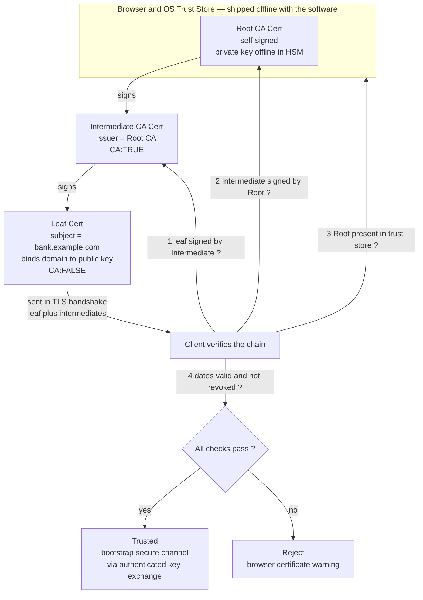

# 🔏 Key Exchange and Public-Key Infrastructure (PKI)

> [!abstract] TL;DR
> Public-key cryptography lets total strangers agree on a secret — but it is worthless against an **active** attacker unless you can answer one question first: **"does this public key TRULY belong to my bank, or to a man-in-the-middle who swapped in their own key?"** That is the **authentication problem**, and **Public-Key Infrastructure (PKI)** is how the internet solves it at scale. A **digital certificate** binds an **identity** (a domain like `bank.example.com`) to a **public key**, and is **digitally signed** by a trusted **Certificate Authority (CA)**. Your browser ships with a few hundred **root CA** certificates it trusts implicitly; a server presents a **leaf** certificate signed by an **intermediate CA**, whose certificate is in turn signed by a **root** — the browser walks this **chain of trust** and verifies every signature up to a root it already trusts (root private keys stay **offline in HSMs**; intermediates take the day-to-day exposure). Combine PKI with **(EC)DHE key exchange** and you get **authenticated key exchange**: the certificate proves whose key it is, ephemeral Diffie-Hellman gives a fresh shared secret with **forward secrecy**, and a **man-in-the-middle is defeated because it cannot forge a valid certificate**. The model is powerful but fragile — **any** trusted CA can issue a certificate for **any** domain, so a single compromise (DigiNotar, 2011) breaks everything. The industry's answer is **Certificate Transparency** (public append-only Merkle logs of every issued cert), **CAA** records, and **short-lived certs** (Let's Encrypt's 90-day automated DV certificates) that reduce reliance on the famously imperfect **revocation** system (CRL, OCSP, OCSP stapling).

---

## Intuition

**Analogy — the notary and the imposter.** Suppose you want to send a private letter to your bank, and the bank has published a lockbox (its public key) that only the bank can open. Anyone can drop a letter into it — that is public-key encryption. But here is the catch: **you found that lockbox on a table in a crowded room.** How do you know a con artist did not quietly swap the bank's lockbox for their own identical-looking one? If they did, you would happily seal your account details into the **attacker's** box. Secrecy is perfect and completely useless, because you encrypted to the wrong person. This is a **man-in-the-middle (MITM)** attack, and it defeats naive public-key crypto entirely.

PKI is the **digital notary system** that fixes this. Instead of trusting a lockbox you found lying around, you demand that it come with a **notarized certificate**: a tamper-evident document that says *"this lockbox belongs to bank.example.com"*, stamped with the **unforgeable seal of a notary** (a Certificate Authority) that you already trust. You do not personally know every notary in the world — but you keep a short list of a **handful of master notaries** (root CAs) whose seals you recognize on sight, and those master notaries vouch for junior notaries, who vouch for the bank. To verify the bank's lockbox you just **follow the chain of seals upward** until you reach a master notary on your list. If every seal checks out, the lockbox is genuine. If the chain leads to a notary you have never heard of, or any seal is broken, you refuse the lockbox and warn the user.

The whole edifice rests on one primitive from the previous notes — a **digital signature** whose seal cannot be forged without the notary's private key — plus one uncomfortable trade: **you are trusting the notaries.** The rest of this note is about how that chain is built, why it works, how it has failed, and how the internet is trying to make the notaries themselves accountable.

---

## How It Works

### The problem PKI actually solves

Recall the foundations. In *Public-Key Cryptography Foundations* you saw that a key pair separates a freely-shareable **public key** from a secret **private key**. In *Diffie_Hellman_and_Discrete_Log* you saw two parties derive a shared secret over a public channel. Both primitives share a fatal gap against an **active** adversary: **unauthenticated public keys.** A passive eavesdropper is stopped, but a MITM who sits on the wire can replace each party's public key (or DH share) with their own, decrypt, re-encrypt, and relay — a perfect transparent relay. **Confidentiality without authentication is theatre.** PKI exists to answer exactly one question at internet scale: *"whose public key is this?"*

### A digital certificate binds identity to a key

A **certificate** is a small, structured, signed document. The dominant format is **X.509** (RFC 5280). Its signed body — the **To-Be-Signed (TBS)** portion — contains:

- **Subject** — the identity: for the web, the domain name(s) in the **Subject Alternative Name (SAN)** extension (the legacy Common Name / CN field is deprecated for hostnames).
- **Subject Public Key** — the public key being vouched for, plus its algorithm (RSA-2048, ECDSA P-256, Ed25519).
- **Issuer** — the name of the CA that signed this certificate.
- **Validity** — `notBefore` / `notAfter` dates; the cert is invalid outside this window.
- **Serial number** — a unique ID used, among other things, for revocation.
- **Extensions** — `Basic Constraints` (`CA:TRUE`/`CA:FALSE` — may this cert sign other certs?), `Key Usage`, `Extended Key Usage`, `Name Constraints`, and SCTs for Certificate Transparency.

The CA then computes a hash of the TBS bytes and **signs that hash with the CA's private key** (see *Digital_Signatures* and [[ECDSA_and_Digital_Signatures]]). **Verifying a certificate = verifying the issuer's signature over the TBS with the issuer's public key.** Change one byte of the subject or the public key and the hash changes, so the signature no longer verifies — the certificate is **tamper-evident**.

### The chain of trust

No single CA signs every certificate directly. Instead trust is **hierarchical**:

1. **Root CA** — a self-signed certificate. Its **private key is the crown jewel**, kept **offline** in a **Hardware Security Module (HSM)** and used only in rare, ceremonially-audited "key ceremonies." Browsers and operating systems ship a **root store** of a few hundred such roots, trusted **implicitly**.
2. **Intermediate CA** — the root signs one or more intermediate certificates (`CA:TRUE`). These take the **daily operational load** of issuing end-entity certs. If an intermediate's key is compromised, you revoke *that intermediate* without burning the root — this is why roots delegate.
3. **Leaf / end-entity certificate** — the intermediate signs the server's certificate (`CA:FALSE`, so it cannot sign further).

During a connection the server presents its **leaf plus any intermediates** (roots are *not* sent — the client already has them). The client verifies **each signature in the chain**: leaf signed by intermediate, intermediate signed by root, and **root present in the local trust store**, while also checking validity dates and revocation status.



### Certificate Authorities and the trust model

CAs are the **trust anchors**. Before issuing, a CA must verify the applicant actually controls the identity, at one of three assurance levels:

- **Domain Validation (DV)** — prove control of the domain (respond to an email, publish a DNS TXT record, or serve a token over HTTP). Fully automatable. **Let's Encrypt** issues free DV certs via the **ACME** protocol (RFC 8555), which single-handedly pushed the web from ~40% to ~95%+ HTTPS.
- **Organization Validation (OV)** and **Extended Validation (EV)** — additional vetting of the legal organization. EV once produced the "green bar"; browsers have largely stopped giving it special UI because studies showed users ignored it.

The systemic weakness is stark: the trust model is a **flat set of ~hundreds of equally-trusted roots**, and **any one of them can issue a valid certificate for any domain on earth.** Your bank may buy its certs from CA *A*, but if attacker-controlled or compromised CA *B* issues a cert for your bank's domain, browsers accept it just the same. Trust is only as strong as the **weakest** CA in the store.

### Authenticated key exchange — where PKI meets Diffie-Hellman

PKI and key exchange are **complementary halves** of bootstrapping a secure channel (this is the heart of *TLS_and_Secure_Channels*):

1. The server sends its **certificate chain**. The client validates it, proving the server's public key genuinely belongs to `bank.example.com`.
2. Client and server run **ephemeral (Elliptic-Curve) Diffie-Hellman ((EC)DHE)** to derive a fresh shared secret — see *Diffie_Hellman_and_Discrete_Log*.
3. **The server signs the key-exchange transcript with the private key that its certificate vouches for.** This **binds** the anonymous DH exchange to the authenticated identity.

The result defeats MITM (the attacker cannot forge a valid certificate, so it cannot sign a substituted DH share) **and** provides **forward secrecy** (the ephemeral secret is discarded, so compromising the server's long-term key later does not decrypt past traffic). Certificate = *who*; ephemeral DH = *a fresh shared secret*; signature over the exchange = *glue that binds who to secret*.

---

## Key Concepts

### Secondary (the padlock, explained)

- The **padlock** in your browser means the site presented a valid **certificate** — a digital ID card for the website, stamped by a trusted authority.
- A **Certificate Authority (CA)** is like a passport office or notary: it checks who you are, then issues a signed document vouching for you.
- Your browser keeps a built-in list of **root authorities** it trusts. Every certificate must trace back to one of them, or you get a big red warning.
- A **man-in-the-middle** is an attacker who tries to impersonate the website; certificates exist to stop them by proving the site's key is genuine.

### Undergraduate (the mechanics)

- **X.509 certificate fields**: subject (SAN, not just CN), subject public key, issuer, validity window, serial number, and extensions (`Basic Constraints`, `Key Usage`).
- **Chain verification algorithm**: for each cert, check `issuer == subject of next cert up`, verify the signature with the issuer's public key, check `notBefore <= now <= notAfter`, check revocation, and confirm the top of the chain is a **trusted root**. Reject on any failure.
- **Root vs intermediate**: roots are self-signed and offline; intermediates do daily issuance so a breach is contained. **Cross-signing** lets a new root be trusted by chaining to an older, widely-distributed one.
- **Validation levels**: DV / OV / EV, and **ACME / Let's Encrypt** for automated DV.
- **Revocation**: **CRL** (a bulky downloaded blocklist), **OCSP** (query the CA in real time), and **OCSP stapling** (server attaches a fresh signed status so the client need not phone the CA).

### Graduate (the hard problems)

- **The n-CA problem**: with a flat trust store, security degrades to the **weakest** CA. Formalize the attack surface and why **Name Constraints** (restrict an intermediate to `*.example.com`) and **CAA** DNS records (declare which CAs may issue for your domain) narrow it.
- **Certificate Transparency (CT, RFC 6962)**: every issued cert must be submitted to public, cryptographically **append-only Merkle-tree logs** (see [[Hash_Functions_and_Merkle_Trees]]); logs return a **Signed Certificate Timestamp (SCT)**, and browsers require SCTs. Misissuance becomes **publicly detectable** even if verification still succeeds — trust shifts from *"CAs never err"* to *"errors are caught fast."*
- **The revocation problem**: soft-fail OCSP (proceed if the responder is unreachable) means a MITM who can block OCSP also blocks revocation; CRLs go stale; **HPKP (key pinning) was deprecated** for bricking risk. The pragmatic fix is **short-lived certificates** (Let's Encrypt's 90-day, trending toward days) so expiry does the work revocation cannot.
- **Authenticated Key Exchange (AKE)** as a formal goal: mutual authentication + a fresh session key + **forward secrecy** + resistance to unknown-key-share and key-compromise-impersonation. TLS 1.3 with certificate + (EC)DHE + transcript signature is the canonical instantiation.
- **Alternative trust models** (below): web of trust, TOFU, DANE, blockchain naming — different answers to *"who vouches?"*

---

## Python Demo

This builds a **toy PKI** end to end in pure Python: a **root CA**, an **intermediate CA**, and a **server**, each certificate a `(subject, public_key)` bound and **signed** by its issuer with a small **RSA toy signature**. It implements full **chain verification**, then demonstrates the attacks — an **untrusted / self-signed** cert is rejected, a **tampered** cert fails signature verification, a **compromised CA** issues a cert that verifies (the trust risk), and **revocation** via a CRL catches it. Finally it **visualizes** the chain of trust and the rejected forged cert with matplotlib.

```python
# Toy PKI: root CA -> intermediate CA -> server, with RSA-signed X.509-style certs,
# chain verification, and attack demonstrations. Pure stdlib + matplotlib.
import random, hashlib, json
import matplotlib.pyplot as plt
from matplotlib.patches import Rectangle

random.seed(1)  # reproducible toy keys

# ---------- tiny RSA (education only; real RSA uses OAEP/PSS, 2048+ bit keys) ----------
def is_probable_prime(n, k=16):
    if n < 2:
        return False
    for p in (2, 3, 5, 7, 11, 13, 17, 19, 23, 29, 31, 37):
        if n % p == 0:
            return n == p
    d, r = n - 1, 0
    while d % 2 == 0:
        d //= 2; r += 1
    for _ in range(k):
        a = random.randrange(2, n - 1)
        x = pow(a, d, n)
        if x in (1, n - 1):
            continue
        for _ in range(r - 1):
            x = pow(x, 2, n)
            if x == n - 1:
                break
        else:
            return False
    return True

def gen_prime(bits=256):
    while True:
        c = random.getrandbits(bits) | (1 << (bits - 1)) | 1
        if is_probable_prime(c):
            return c

def gen_rsa(bits=256):
    e = 65537
    while True:
        p, q = gen_prime(bits), gen_prime(bits)
        if p == q:
            continue
        phi = (p - 1) * (q - 1)
        if phi % e == 0:
            continue
        d = pow(e, -1, phi)            # modular inverse (Python 3.8+)
        return {"priv": {"n": p * q, "e": e, "d": d},
                "pub":  {"n": p * q, "e": e}}

def _digest_int(tbs_bytes, n):
    h = hashlib.sha256(tbs_bytes).digest()
    return int.from_bytes(h, "big") % n

def rsa_sign(priv, tbs_bytes):
    return pow(_digest_int(tbs_bytes, priv["n"]), priv["d"], priv["n"])

def rsa_verify(pub, tbs_bytes, sig):
    return pow(sig, pub["e"], pub["n"]) == _digest_int(tbs_bytes, pub["n"])

# ---------- certificate model (the signature covers exactly these fields) ----------
def cert_tbs(c):
    """Deterministic serialization of the To-Be-Signed body."""
    tbs = {"subject": c["subject"], "issuer": c["issuer"], "serial": c["serial"],
           "not_before": c["not_before"], "not_after": c["not_after"],
           "subject_public_key": {"n": c["subject_public_key"]["n"],
                                  "e": c["subject_public_key"]["e"]}}
    return json.dumps(tbs, sort_keys=True).encode()

def issue_cert(issuer_name, issuer_priv, subject, subject_pub, serial,
               not_before="2026-01-01", not_after="2026-12-31"):
    cert = {"subject": subject, "issuer": issuer_name, "serial": serial,
            "not_before": not_before, "not_after": not_after,
            "subject_public_key": subject_pub, "signature": None}
    cert["signature"] = rsa_sign(issuer_priv, cert_tbs(cert))
    return cert

def verify_signature(cert, issuer_pub):
    return rsa_verify(issuer_pub, cert_tbs(cert), cert["signature"])

def verify_chain(chain, trust_store, crl=(), today="2026-06-01"):
    """chain[0]=leaf ... chain[-1] chains to a trusted root (roots not sent).
       trust_store: {root_subject: root_pub}. Returns (ok, reason)."""
    for i, cert in enumerate(chain):
        if cert["serial"] in crl:
            return False, f"REVOKED: '{cert['subject']}' serial {cert['serial']} on CRL"
        if not (cert["not_before"] <= today <= cert["not_after"]):
            return False, f"EXPIRED/NOT-YET-VALID: '{cert['subject']}'"
        if i + 1 < len(chain):                      # issuer is the next cert up
            issuer = chain[i + 1]
            if cert["issuer"] != issuer["subject"]:
                return False, f"NAME MISMATCH: '{cert['subject']}' issuer != next subject"
            issuer_pub = issuer["subject_public_key"]
        else:                                       # top: issuer must be a trusted root
            if cert["issuer"] not in trust_store:
                return False, f"UNTRUSTED ROOT: '{cert['issuer']}' not in trust store"
            issuer_pub = trust_store[cert["issuer"]]
        if not verify_signature(cert, issuer_pub):
            return False, f"BAD SIGNATURE on '{cert['subject']}'"
    return True, "OK: chain verified to a trusted root"

# ---------- build a legitimate PKI ----------
root  = gen_rsa();  inter = gen_rsa();  server = gen_rsa()
ROOT_NAME, INTER_NAME, SERVER_NAME = "Root CA X1", "Intermediate CA A", "bank.example.com"

root_cert   = issue_cert(ROOT_NAME,  root["priv"],  ROOT_NAME,   root["pub"],   serial=1)   # self-signed
inter_cert  = issue_cert(ROOT_NAME,  root["priv"],  INTER_NAME,  inter["pub"],  serial=1001)
server_cert = issue_cert(INTER_NAME, inter["priv"], SERVER_NAME, server["pub"], serial=2001)

TRUST_STORE = {ROOT_NAME: root["pub"]}               # browser ships the root's public key
good_chain  = [server_cert, inter_cert]              # leaf + intermediate (root not sent)

print("=== 1. Legitimate chain ===")
print("   ", verify_chain(good_chain, TRUST_STORE)[1])

# ---------- attack (a): untrusted / self-signed cert is REJECTED ----------
self_signed = issue_cert(SERVER_NAME, server["priv"], SERVER_NAME, server["pub"], serial=9001)
print("\n=== 2. Attack (a): self-signed / untrusted cert ===")
print("   ", verify_chain([self_signed], TRUST_STORE)[1])

# ---------- attack (b): tampered cert FAILS signature verification ----------
attacker = gen_rsa()
tampered = dict(server_cert)
tampered["subject_public_key"] = attacker["pub"]     # swap in attacker's key, keep old signature
print("\n=== 3. Attack (b): tampered cert (public key replaced) ===")
print("   ", verify_chain([tampered, inter_cert], TRUST_STORE)[1])

# ---------- attack (c): a COMPROMISED CA issues a fraudulent cert (the trust risk) ----------
# The intermediate's private key is stolen; attacker mints a cert for bank.example.com
# that binds the ATTACKER's public key. It is cryptographically valid.
fraud_cert = issue_cert(INTER_NAME, inter["priv"], SERVER_NAME, attacker["pub"], serial=6666)
ok, reason = verify_chain([fraud_cert, inter_cert], TRUST_STORE)
print("\n=== 4. Attack (c): compromised CA issues fraudulent cert ===")
print("    chain verifies?", ok, "->", reason)
print("    (This is why it is scary: the math is valid. Detection needs")
print("     Certificate Transparency logs + revocation, not signature checks.)")

# ---------- revocation: put the fraudulent serial on a CRL -> REJECTED ----------
CRL = {6666}
print("\n=== 5. Mitigation: revocation via CRL ===")
print("   ", verify_chain([fraud_cert, inter_cert], TRUST_STORE, crl=CRL)[1])

# ---------- visualize ----------
def draw_box(ax, x, y, w, h, text, color):
    ax.add_patch(Rectangle((x, y), w, h, facecolor=color, edgecolor="black", lw=1.6))
    ax.text(x + w / 2, y + h / 2, text, ha="center", va="center", fontsize=8.5)

def arrow(ax, x, y1, y2, label):
    ax.annotate("", xy=(x, y2), xytext=(x, y1),
                arrowprops=dict(arrowstyle="-|>", lw=1.8, color="black"))
    ax.text(x + 0.02, (y1 + y2) / 2, label, fontsize=8, ha="left", va="center")

fig, (axL, axR) = plt.subplots(1, 2, figsize=(13, 7))
GREEN, RED, AMBER = "#a8e6a3", "#f2a6a6", "#f5d58a"

axL.set_title("Valid chain of trust  ->  ACCEPTED", fontsize=12, weight="bold")
draw_box(axL, 0.28, 0.76, 0.44, 0.15, "Root CA X1\nself-signed, in trust store\n[OK]", GREEN)
draw_box(axL, 0.28, 0.47, 0.44, 0.15, "Intermediate CA A\nsigned by Root  [OK]", GREEN)
draw_box(axL, 0.28, 0.18, 0.44, 0.15, "bank.example.com (leaf)\nsigned by Intermediate  [OK]", GREEN)
arrow(axL, 0.50, 0.76, 0.62, "signs")
arrow(axL, 0.50, 0.47, 0.33, "signs")
axL.text(0.50, 0.07, "Browser verifies every signature up to a trusted root",
         ha="center", fontsize=8.5, style="italic")

axR.set_title("Forged / untrusted certs  ->  REJECTED", fontsize=12, weight="bold")
draw_box(axR, 0.05, 0.62, 0.9, 0.20,
         "(a) self-signed cert for bank.example.com\nissuer NOT in trust store\n[X] UNTRUSTED ROOT", RED)
draw_box(axR, 0.05, 0.35, 0.9, 0.20,
         "(b) tampered leaf: public key swapped\nsignature no longer matches TBS hash\n[X] BAD SIGNATURE", RED)
draw_box(axR, 0.05, 0.06, 0.9, 0.22,
         "(c) compromised-CA fraud cert\ncryptographically VALID, but\ncaught by Certificate Transparency + CRL\n[!] revoked -> [X] REJECTED", AMBER)

for ax in (axL, axR):
    ax.set_xlim(0, 1); ax.set_ylim(0, 1); ax.axis("off")

plt.tight_layout()
plt.savefig("pki_chain_of_trust.png", dpi=130)
print("\nSaved figure -> pki_chain_of_trust.png")
```

**Expected output:**

```
=== 1. Legitimate chain ===
    OK: chain verified to a trusted root
=== 2. Attack (a): self-signed / untrusted cert ===
    UNTRUSTED ROOT: 'bank.example.com' not in trust store
=== 3. Attack (b): tampered cert (public key replaced) ===
    BAD SIGNATURE on 'bank.example.com'
=== 4. Attack (c): compromised CA issues fraudulent cert ===
    chain verifies? True -> OK: chain verified to a trusted root
=== 5. Mitigation: revocation via CRL ===
    REVOKED: 'bank.example.com' serial 6666 on CRL
```

The demo makes the central lesson concrete: signature checks catch **tampering** and **untrusted roots**, but they are **powerless against a legitimately-signed fraudulent cert** from a compromised CA — that failure mode is why Certificate Transparency and revocation exist as a second line of defense.

---

## Real-World Applications

- **HTTPS / the web padlock** — every TLS connection validates a certificate chain before any application data flows; see [[TLS_Protocol_Deep_Dive]], [[TLS_and_SSL]], [[TLS_SSL]], [[TLS_and_HTTPS]], and [[HTTP_HTTPS]]. Misconfigured or **expired certificates are one of the most common operational outages** (famous examples: Microsoft Teams, Spotify, and countless internal services going dark at midnight when a cert lapsed).
- **Let's Encrypt + ACME** — free automated DV certs ([[SSL_TLS_Certificates]]) that took HTTPS from a paid luxury to the default. Its **90-day** lifetime forces automation and reduces revocation reliance.
- **Certificate Transparency ecosystem** — public Merkle-log infrastructure (crt.sh, Google/Cloudflare logs) that security teams monitor to detect rogue certs for their own domains within minutes.
- **Code signing** — OS and app stores verify a signed certificate chain before running binaries (Windows Authenticode, Apple notarization), stopping malware from masquerading as trusted software.
- **Email (S/MIME) and document signing** — signed certs bind identities to signing keys for legally-recognized digital signatures.
- **VPNs, mutual TLS, and Zero Trust** — enterprise services authenticate *both* sides with certificates; see [[Zero_Trust_Networking]]. **IoT / smart cards** embed device-identity certs so millions of devices authenticate without shared passwords.
- **Blockchain naming and transparency** — CT's append-only Merkle logs share DNA with [[Cryptographic_Primitives_Blockchain]] and [[Hash_Functions_and_Merkle_Trees]]; projects also explore blockchain-anchored identity as an alternative to CAs (*Blockchain_Cryptography*).

---

## Common Pitfalls

- **Confusing encryption with authentication** — a "secure" (encrypted) channel to the **wrong** party is worthless. The certificate is what makes it the *right* party. Encryption without authenticated keys is the classic MITM foot-gun.
- **Trusting self-signed or "just click through the warning" certs** — the warning means *the chain does not reach a trusted root*, which is exactly the MITM signal. Bypassing it in scripts (`curl -k`, `verify=False`) is a top source of real breaches. See *Cryptographic_Failures_and_Misuse*.
- **Assuming any single CA breach is contained** — because **any** trusted CA can issue for **any** domain, one compromised CA endangers the whole web. Mitigate with **CAA** records (limit which CAs may issue for your domain) and **CT monitoring**.
- **Believing revocation "just works"** — OCSP **soft-fail** means an attacker who blocks the OCSP responder also silently defeats revocation; CRLs go stale. Prefer **OCSP stapling** and **short-lived certs**; do not rely on revocation as your only safety net.
- **Key pinning gone wrong** — **HPKP was deprecated** because a bad pin can **brick** a domain for months. Pinning still has a place in mobile apps, but with backup pins and short lifetimes.
- **Ignoring the expiry clock** — the single most common self-inflicted outage. Automate renewal (ACME) and alert well before `notAfter`.
- **Validating the signature but not the name/usage** — a valid signature on a cert for `evil.com` does not authenticate `bank.example.com`. Always check the **SAN matches the hostname**, `Basic Constraints`, and `Key Usage`.

---

## Related Concepts

- [[Asymmetric_Cryptography_and_PKI]] — the applied-security companion covering RSA/ECC internals, X.509 pitfalls (SAN vs CN, ROBOT), and revocation trade-offs in depth.
- [[TLS_Protocol_Deep_Dive]] — how the handshake actually uses the certificate chain plus (EC)DHE to build an authenticated channel (this note's *TLS_and_Secure_Channels* target).
- [[TLS_and_SSL]] / [[TLS_SSL]] / [[TLS_and_HTTPS]] — network- and system-design views of TLS/HTTPS that consume PKI.
- [[HTTP_HTTPS]] — where the padlock and cert validation surface to users.
- [[SSL_TLS_Certificates]] — operational cert lifecycle: issuance, Let's Encrypt/ACME, renewal automation.
- [[ECDSA_and_Digital_Signatures]] — the signature primitive that a CA uses to sign certificates and that servers use to sign the key exchange (this note's *Digital_Signatures* target).
- [[Hash_Functions_and_Merkle_Trees]] — the append-only Merkle structure underlying **Certificate Transparency** logs.
- [[Cryptographic_Primitives_Blockchain]] — shared foundations (signatures, hashing, transparency logs) with blockchain-based identity/naming.
- [[Computational_Hardness_Assumptions]] — why forging a CA signature (factoring / discrete log) is infeasible, which is what makes certificates trustworthy.
- [[Zero_Trust_Networking]] — mutual-TLS and certificate-based identity as the backbone of "never trust, always verify" architectures.
- [[DNS_Protocol]] — DNS underpins both DV challenges (TXT records), **CAA** records, and the **DANE** alternative trust model (certs pinned in DNSSEC).

> Not-yet-created Cryptography siblings referenced in prose (link when they exist): *Public_Key_Cryptography_Foundations*, *Diffie_Hellman_and_Discrete_Log*, *Digital_Signatures*, *TLS_and_Secure_Channels*, *Key_Management_and_Distribution*, *Secure_Messaging_and_Signal_Protocol*, *Cryptographic_Failures_and_Misuse*, *Blockchain_Cryptography*. PKI is one stage of the broader **key-management lifecycle** — generation, distribution, HSM storage, rotation, revocation, destruction — covered in *Key_Management_and_Distribution*. And the **hierarchical CA model is not the only trust model**: PGP's decentralized **web of trust**, **TOFU** (Trust On First Use — SSH host keys, Signal safety numbers, see *Secure_Messaging_and_Signal_Protocol*), **DANE**, and blockchain naming span the spectrum of how trust can be established.

---

## Review Questions

**Secondary.** Your browser shows a padlock on your bank's website but a red warning on a different site. In plain terms, what does the certificate prove, and what might the warning mean? Why is encrypting a message to a public key *not enough* on its own to keep it safe?

**Undergraduate.** A server presents a leaf certificate and one intermediate certificate. Write out, step by step, everything the client must check to accept the chain (signatures, names, dates, trust anchor, revocation). Then explain: why are root private keys kept offline in HSMs while intermediates do the daily signing, and what does that buy you when an intermediate is compromised?

**Graduate.** In the Python demo, the "compromised CA" fraudulent certificate **verifies successfully** — signature checks cannot stop it. (a) Explain precisely why the cryptography is powerless here and what the failure represents at internet scale given the flat multi-CA trust store. (b) Describe how **Certificate Transparency**, **CAA records**, and **short-lived certs** each reduce this risk, and which of them provide *detection* versus *prevention*. (c) Contrast this hierarchical CA model with **web of trust** and **TOFU**: what threat does each optimize against, and what does each give up?

---

## Sources

- [RFC 5280 — Internet X.509 Public Key Infrastructure Certificate and CRL Profile](https://datatracker.ietf.org/doc/html/rfc5280)
- [RFC 6962 — Certificate Transparency](https://datatracker.ietf.org/doc/html/rfc6962)
- [RFC 8555 — Automatic Certificate Management Environment (ACME)](https://datatracker.ietf.org/doc/html/rfc8555)
- [RFC 6960 — X.509 Online Certificate Status Protocol (OCSP)](https://datatracker.ietf.org/doc/html/rfc6960)
- [ENISA / Fox-IT report on the DigiNotar CA compromise (2011)](https://www.enisa.europa.eu/media/news-items/operation-black-tulip)
- [Let's Encrypt — How It Works](https://letsencrypt.org/how-it-works/)

---

#cryptography #pki #certificates #certificate-authority #key-exchange
