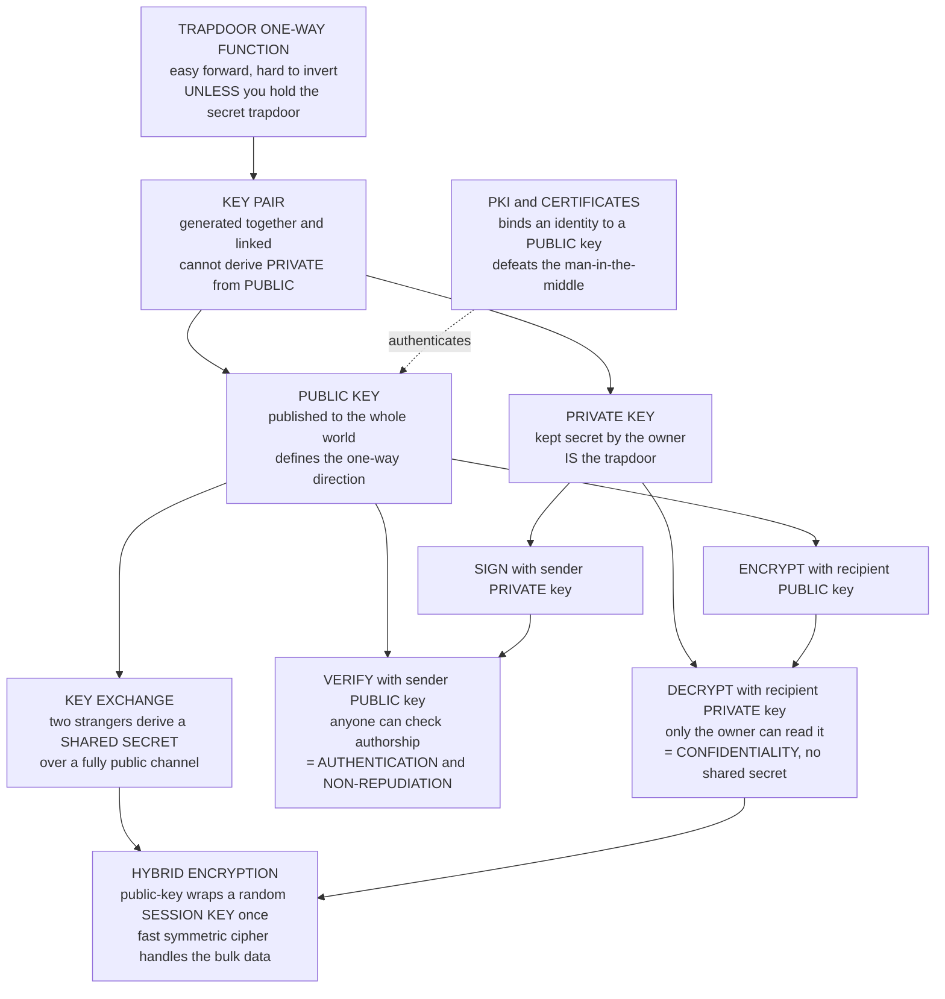

# 🔑 Public-Key Cryptography Foundations

> [!abstract] TL;DR
> **Public-key (asymmetric) cryptography** is the 1976 breakthrough that let strangers exchange secrets *without ever meeting to share a key*. The trick: give every party **two mathematically-linked keys** — a **public** one anyone can use and a **private** one only the owner holds — built from a **trapdoor one-way function** (easy forward, infeasible to invert *unless* you know the secret). This single idea delivers three capabilities symmetric crypto cannot: **encryption** (lock with the recipient's public key, only their private key opens it), **digital signatures** (sign with your private key, anyone verifies with your public key → authentication and non-repudiation), and **key exchange** (Diffie–Hellman lets two parties derive a shared secret over a public wire). Because public-key math — modular exponentiation on enormous numbers — is roughly **1000× slower per byte** than symmetric ciphers, real systems are **hybrid**: use public-key crypto *once* to wrap a random symmetric session key, then encrypt the bulk data with fast AES. This is TLS, PGP, SSH, and every cryptocurrency wallet. The whole edifice rests on hardness assumptions ([[Computational_Hardness_Assumptions|factoring, discrete log, ECDLP]]) that **Shor's algorithm** breaks on a quantum computer — which is why post-quantum public-key crypto is now urgent.

---

## Intuition

**Analogy — a mailbox with two different keys.** Imagine a mailbox with a mail slot governed by two keys. There is a **public** key that *anyone* can use to lock the slot shut after dropping mail in, and a **private** key that only *you* hold, which is the only key that opens the box to read what is inside. You can print the locking key on your business cards, hand it to complete strangers, publish it on a billboard — and it does not matter, because that key can only *close* the box, never *open* it. Only your one private key reads the mail.

That asymmetry — **publicly lockable, privately unlockable** — quietly solves a problem humanity struggled with for three thousand years: how can two people who have *never met and share no secret* send each other confidential messages? With ordinary locks (symmetric encryption) you must somehow first deliver a copy of the *one* key to your correspondent through some already-secure channel — a chicken-and-egg trap. The two-key mailbox breaks the loop. To write to Alice, you simply grab *her* published locking key, seal your message, and send it; only Alice's private key can open it. Run the same trick in reverse — Alice locks something with her *private* key that *her public key* opens — and you get an unforgeable **signature**: proof only Alice could have produced it. The rest of this note is just making that mailbox mathematically precise.

---

## How It Works

### The revolution: encryption and decryption need not use the same key

For all of history before 1976, "encryption" meant **one shared secret key** used both to lock and to unlock. That model has a fatal logistics problem — the **key-distribution problem**: every pair of communicating parties needs a pre-shared secret, delivered over some *already-secure* channel that, by assumption, does not yet exist. For `n` parties talking pairwise you need `n` choose `2` distinct keys, all bootstrapped somehow. Armies, banks, and diplomats spent fortunes couriering key material in locked briefcases.

In **"New Directions in Cryptography" (1976)**, Whitfield Diffie and Martin Hellman proposed the radical idea that the encryption key and the decryption key could be **different** — so the *encryption* key could be made entirely **public**. (Unknown at the time, James Ellis, Clifford Cocks, and Malcolm Williamson at Britain's GCHQ had discovered the same "non-secret encryption" a few years earlier, but it stayed classified until 1997.) Rivest, Shamir, and Adleman turned the concept into a concrete working cryptosystem in 1978 with **RSA**. This is arguably the single most important idea in modern cryptography: it is what lets you buy something from a website you have never visited, run by people you will never meet, without first exchanging a secret.

### The key pair and the trapdoor one-way function

Each party generates a **key pair** in one step: a **public key** (published to everyone) and a **private key** (kept secret), which are *mathematically linked inverses*. The linkage is a **trapdoor one-way function** — the mathematical heart of the whole field (see [[Computational_Hardness_Assumptions]]):

- **One-way:** easy to compute *forward*, computationally infeasible to invert *backward* (multiplying two 300-digit primes is instant; factoring the product is hopeless).
- **Trapdoor:** there is a *secret* — the trapdoor — that makes inversion easy for whoever holds it.

The **public key defines the one-way (forward) direction** that anyone can compute; the **private key IS the trapdoor**. Crucially, you *cannot derive the private key from the public one* — that derivation is exactly the hard problem. Two families dominate: **RSA**, whose trapdoor is the *factorization* of the modulus, and **discrete-log** schemes (Diffie–Hellman, ElGamal, DSA, elliptic curves), whose hardness is recovering an exponent in a cyclic group.

### The two capabilities: encryption and signatures

A key pair does **two things**, and they run in opposite directions:

1. **Public-key encryption → confidentiality without pre-shared secrets.** To send Alice a secret, encrypt with *Alice's public key*; only *Alice's private key* decrypts. Anyone can send her secrets; only she can read them.
2. **Digital signatures → authentication and non-repudiation.** To prove *you* wrote a message, sign with *your private key*; anyone verifies with *your public key*. Only you could have produced a signature that your public key validates, so you cannot later deny it (non-repudiation). This is the "reverse" direction, and it is something **symmetric crypto simply cannot do** — a shared key can authenticate (via a MAC) but cannot prove authorship to a third party, because either holder could have produced it.

### Key exchange: the third pillar

The third capability is **key exchange**. **Diffie–Hellman** lets two parties who have *never met* mix public values to derive an identical **shared secret** over a completely public channel, which an eavesdropper watching every byte still cannot compute. That shared secret then seeds fast symmetric encryption. Every TLS handshake does this.

### Why it is slow → hybrid encryption

Public-key operations are **modular exponentiation on huge numbers** (hundreds to thousands of bits) and are roughly **1000× slower per byte** than symmetric ciphers like AES. Encrypting a video with RSA directly would be absurd. So every real system uses **hybrid (envelope) encryption**: use the slow public-key scheme **once** to encrypt (or exchange) a small random **symmetric session key**, then encrypt the bulk payload with fast symmetric AES-GCM. TLS, PGP, S/MIME, and SSH all do exactly this — public-key crypto for the *handshake*, symmetric crypto for the *conversation*. See [[Symmetric_Encryption]].

### The new problem it creates: authentication and PKI

Public keys solve *secrecy* but open a new hole: **how do you know a public key really belongs to whom it claims?** If an attacker substitutes *their* public key for Alice's, you will happily encrypt to the attacker — a **man-in-the-middle** attack. **Public-Key Infrastructure (PKI)** is the trust layer that fixes this: **certificate authorities** issue **digital certificates** binding an identity to a public key (via the CA's own signature), and PGP uses a decentralized **web of trust**. See [[Asymmetric_Cryptography_and_PKI]].

### Flow / Architecture



---

## Key Concepts

### Secondary (intuitive, no CS background needed)
- **Two keys, not one.** A **public** key everyone can use and a **private** key only you hold. Publish the public one freely; guard the private one with your life.
- **Lock vs open.** Anyone can *lock* a message with your public key; only your private key *opens* it. That is encryption without ever sharing a secret.
- **Signing is the reverse.** Lock with your *private* key what your *public* key opens, and you have proved *you* wrote it — a signature nobody can forge.
- **Slow, so used sparingly.** Public-key math is heavy, so systems use it just to agree on a small fast key, then switch to speedy everyday encryption. That combination is "hybrid."

### Undergraduate (a first crypto course)
- **Trapdoor one-way function.** The primitive: easy forward, hard to invert without a secret. The public key exposes the forward map; the private key is the trapdoor. RSA is the canonical trapdoor *permutation*.
- **Three services from one key pair.** *Encryption* (encrypt with recipient's public, decrypt with private), *signatures* (sign with own private, verify with own public), *key exchange* (Diffie–Hellman shared secret).
- **The key-distribution problem.** Symmetric crypto needs `O(n^2)` pre-shared keys and a secure bootstrap channel; public-key crypto needs each party to publish just *one* public key. This is *the* problem it solves.
- **Hybrid / envelope encryption.** Public-key wraps a random symmetric session key; symmetric cipher encrypts the payload. Motivated by the roughly 1000× per-byte speed gap.
- **The named hard problems.** *Factoring* (RSA), *discrete log* / CDH / DDH (Diffie–Hellman, ElGamal, DSA), *elliptic-curve discrete log* (ECDH, ECDSA — smaller keys). See [[Computational_Hardness_Assumptions]].
- **The MITM gap and PKI.** Public keys need *authentication*; certificates and CAs bind keys to identities. See [[Asymmetric_Cryptography_and_PKI]].

### Graduate (advanced)
- **Textbook vs secure schemes.** Raw ("textbook") RSA is *deterministic* and *malleable* — it fails IND-CPA and is trivially broken by chosen-ciphertext attacks. Real deployments need randomized padding: **OAEP** for encryption, **PSS** for signatures, or better, **KEM/DEM** hybrid constructions.
- **KEM/DEM formalism.** Modern hybrid encryption is a **Key Encapsulation Mechanism** (public-key part that outputs a random symmetric key and its ciphertext) plus a **Data Encapsulation Mechanism** (an AEAD symmetric cipher). This is the clean abstraction behind TLS 1.3 and post-quantum Kyber.
- **Security reductions.** Public-key schemes are "provably secure" only *relative* to an assumption: breaking the scheme reduces to solving factoring, CDH, DDH, or LWE. Security is conditional, never absolute. See [[Provable_Security_and_Reductions]].
- **The quantum cliff.** **Shor's algorithm** solves factoring *and* discrete log (including ECDLP) in polynomial time, breaking **all** deployed public-key crypto at once; **Grover** only quadratically dents symmetric keys. This asymmetry is exactly why lattice-based **post-quantum** public-key crypto is urgent. See [[Shors_Factoring_Algorithm]] and [[Post_Quantum_Cryptography]].
- **Non-repudiation is uniquely asymmetric.** A shared-key MAC authenticates but cannot bind authorship to *one* party in front of a third; only a private-key signature can. This is the structural reason symmetric crypto cannot replace public-key crypto.
- **The algorithm landscape.** RSA (factoring), Diffie–Hellman/ElGamal/DSA (integer discrete log), ECC / ECDH / ECDSA / Ed25519 (elliptic-curve discrete log, now dominant), and lattice schemes Kyber/Dilithium (quantum-resistant).

---

## Python Demo

```python
# =====================================================================
# PUBLIC-KEY CRYPTOGRAPHY + HYBRID ENCRYPTION -- a runnable toy.
#
#   TEXTBOOK RSA is used ONLY to make the ideas concrete and visible.
#   It has NO padding and is DETERMINISTIC -- educational, NOT secure.
#   Never use textbook RSA for real secrets (use OAEP/PSS or libsodium).
#
# The script shows, end to end:
#   1. a PUBLIC key (n, e) and a linked PRIVATE key (n, d)
#   2. ENCRYPT with PUBLIC  ->  DECRYPT with PRIVATE   (confidentiality)
#   3. SIGN with PRIVATE    ->  VERIFY with PUBLIC      (authenticity)
#   4. HYBRID encryption: RSA wraps a random SYMMETRIC key ONCE, then a
#      fast symmetric stream cipher encrypts the bulk message
#   5. a MEASURED throughput gap (public-key is ~1000x slower per byte)
#      -- the whole reason hybrid encryption exists.
#
# Pure standard library for all crypto; matplotlib only to visualize.
# =====================================================================
import os, time, random, hashlib
import matplotlib.pyplot as plt

random.seed(1)

# ---- prime generation (deterministic Miller-Rabin, pure stdlib) -------
_SMALL = (2, 3, 5, 7, 11, 13, 17, 19, 23, 29, 31, 37)

def is_prime(n):
    if n < 2:
        return False
    for p in _SMALL:
        if n % p == 0:
            return n == p
    d, s = n - 1, 0
    while d % 2 == 0:
        d //= 2
        s += 1
    for a in _SMALL:                       # deterministic for n < 3.3e24
        x = pow(a, d, n)
        if x == 1 or x == n - 1:
            continue
        for _ in range(s - 1):
            x = x * x % n
            if x == n - 1:
                break
        else:
            return False
    return True

def gen_prime(bits):
    while True:
        n = random.getrandbits(bits) | (1 << (bits - 1)) | 1   # top+bottom bit set
        if is_prime(n):
            return n

# ---- RSA key generation: build the linked PUBLIC / PRIVATE pair -------
def rsa_keygen(bits=512):
    e = 65537
    while True:
        p, q = gen_prime(bits), gen_prime(bits)
        if p == q:
            continue
        phi = (p - 1) * (q - 1)
        if phi % e != 0:
            n = p * q
            d = pow(e, -1, phi)            # private exponent = inverse of e mod phi
            return (n, e), (n, d)          # (PUBLIC, PRIVATE)

pub, priv = rsa_keygen(bits=512)           # modulus n is ~1024 bits
n, e = pub
_, d = priv
print(f"public key  (n, e): n is {n.bit_length()}-bit,  e = {e}")
print(f"private key (n, d): d is the SECRET trapdoor exponent\n")

# ---- (2) ENCRYPT with PUBLIC, DECRYPT with PRIVATE --------------------
def rsa_transform(x, key):                 # same modexp both ways
    mod, exp = key
    return pow(x, exp, mod)

secret = int.from_bytes(b"attack at dawn!!", "big")   # 16-byte message as int
cipher = rsa_transform(secret, pub)        # lock with PUBLIC key
plain  = rsa_transform(cipher, priv)       # open with PRIVATE key
print("ENCRYPTION  round-trips (public->private):", plain == secret)

# ---- (3) SIGN with PRIVATE, VERIFY with PUBLIC -----------------------
def digest_int(msg):
    return int.from_bytes(hashlib.sha256(msg).digest(), "big") % n

def sign(msg):                             # seal with PRIVATE key
    return rsa_transform(digest_int(msg), priv)

def verify(msg, sig):                      # check with PUBLIC key
    return rsa_transform(sig, pub) == digest_int(msg)

doc = b"transfer 100 coins to alice"
sig = sign(doc)
print("SIGNATURE   valid doc verifies (private->public):", verify(doc, sig))
print("SIGNATURE   tampered doc is rejected            :", not verify(doc + b"!", sig))

# ---- fast symmetric stream cipher: SHA-256 in counter mode -----------
def keystream(key_bytes, nbytes):
    out, ctr = bytearray(), 0
    while len(out) < nbytes:
        out += hashlib.sha256(key_bytes + ctr.to_bytes(8, "big")).digest()
        ctr += 1
    return bytes(out[:nbytes])

def sym_crypt(data, key_bytes):            # XOR is its own inverse
    return bytes(a ^ b for a, b in zip(data, keystream(key_bytes, len(data))))

# ---- (4) HYBRID ENCRYPTION: RSA wraps a session key, symmetric bulk ---
message = b"the quick brown fox jumps over the lazy dog. " * 2000   # ~90 KB
session_key = os.urandom(16)                                # random SYMMETRIC key
wrapped_key = rsa_transform(int.from_bytes(session_key, "big"), pub) # RSA used ONCE
body        = sym_crypt(message, session_key)               # fast bulk encryption
# receiver side: unwrap the session key with the PRIVATE key, then symmetric-decrypt
unwrapped   = rsa_transform(wrapped_key, priv).to_bytes(16, "big")
recovered   = sym_crypt(body, unwrapped)
print("\nHYBRID      decrypts the full ~90 KB message   :", recovered == message)

# ---- (5) MEASURE the per-byte throughput gap -------------------------
block = (n.bit_length() // 8) - 1          # bytes a single RSA op can carry
m_block = int.from_bytes(os.urandom(block), "big")

reps = 200                                 # public-key op throughput
t0 = time.perf_counter()
for _ in range(reps):
    rsa_transform(m_block, pub)
rsa_bps = block / ((time.perf_counter() - t0) / reps)

big = os.urandom(2_000_000)                # symmetric throughput over ~2 MB
t0 = time.perf_counter()
sym_crypt(big, session_key)
sym_bps = len(big) / (time.perf_counter() - t0)

ratio = sym_bps / rsa_bps
print(f"\nRSA public-key throughput : {rsa_bps:14,.0f} bytes/sec")
print(f"symmetric throughput      : {sym_bps:14,.0f} bytes/sec")
print(f"symmetric is ~{ratio:,.0f}x faster per byte  ->  this is WHY we use HYBRID")

# ====================== VISUALIZE ====================================
fig, (axA, axB) = plt.subplots(1, 2, figsize=(15, 6))

# Panel A: the two capabilities of a single key pair
axA.set_xlim(0, 10); axA.set_ylim(0, 10); axA.axis("off")
axA.set_title("One key pair, two jobs\n"
              "ENCRYPT: lock PUBLIC, open PRIVATE  |  "
              "SIGN: seal PRIVATE, check PUBLIC", fontsize=10)

def box(x, y, text, color):
    axA.text(x, y, text, ha="center", va="center", fontsize=9,
             bbox=dict(boxstyle="round,pad=0.4", fc=color, ec="black"))

def arrow(x1, x2, y, label):
    axA.annotate("", xy=(x2, y), xytext=(x1, y),
                 arrowprops=dict(arrowstyle="-|>", lw=2))
    axA.text((x1 + x2) / 2, y + 0.55, label, ha="center", fontsize=8, color="darkred")

box(1.3, 7, "Message", "#d6eaf8"); box(5, 7, "Ciphertext", "#f9e79f"); box(8.7, 7, "Message", "#d6eaf8")
arrow(2.3, 3.9, 7, "encrypt\nPUBLIC key"); arrow(6.1, 7.7, 7, "decrypt\nPRIVATE key")
axA.text(5, 9.0, "CONFIDENTIALITY", ha="center", fontsize=10, weight="bold", color="#1f618d")

box(1.3, 3, "Message", "#d6eaf8"); box(5, 3, "Signature", "#f5b7b1"); box(8.7, 3, "valid or\nforged?", "#abebc6")
arrow(2.3, 3.9, 3, "sign\nPRIVATE key"); arrow(6.1, 7.7, 3, "verify\nPUBLIC key")
axA.text(5, 1.1, "AUTHENTICITY + NON-REPUDIATION", ha="center", fontsize=10, weight="bold", color="#7d3c98")

# Panel B: the measured speed gap that forces hybrid encryption
bars = axB.bar(["RSA\npublic-key", "symmetric\nstream cipher"],
               [rsa_bps, sym_bps], color=["#e74c3c", "#27ae60"])
axB.set_yscale("log")
axB.set_ylabel("throughput  (bytes / sec, log scale)")
axB.set_title(f"Public-key is ~{ratio:,.0f}x slower per byte\n"
              "so: RSA wraps a key ONCE, symmetric does the bulk = HYBRID")
for rect, v in zip(bars, [rsa_bps, sym_bps]):
    axB.text(rect.get_x() + rect.get_width() / 2, v * 1.4, f"{v:,.0f}",
             ha="center", fontsize=9)
axB.grid(True, axis="y", which="both", alpha=0.3)

plt.tight_layout()
plt.show()
```

**What the demo shows.** The RSA key pair round-trips a message (encrypt with the *public* key, decrypt with the *private* key) and produces a signature that verifies with the *public* key but fails the instant the document is altered — the two capabilities, running in opposite directions. Then hybrid encryption uses RSA *once* to wrap a random 16-byte symmetric key and lets the fast stream cipher carry the ~90 KB payload. The measured throughput bars make the motivation visceral: symmetric encryption is hundreds-to-thousands of times faster per byte, which is exactly why no sane system encrypts bulk data directly with public-key math. (Textbook RSA is deterministic and unpadded — shown for clarity, never for real use.)

---

## Real-World Applications

> **Example — the padlock in your browser (TLS 1.3).** Every HTTPS connection is public-key cryptography in production. The client and server run an **(elliptic-curve) Diffie–Hellman key exchange** to derive a fresh shared secret over the open internet; the server proves its identity with a **digital signature** over the handshake, and its **certificate** (PKI) chains that public key to the domain name so a man-in-the-middle cannot impersonate it. From then on, the actual page bytes are protected by **fast symmetric AEAD** (AES-GCM or ChaCha20-Poly1305). Public-key for the handshake, symmetric for the conversation — textbook hybrid encryption. See [[TLS_Protocol_Deep_Dive]].

- **SSH and code signing.** SSH authenticates you to a server with your private key (no password crosses the wire); OS and app updates are **signed** so your device rejects tampered or spoofed binaries — authentication and non-repudiation.
- **Secure email (PGP / S/MIME).** Classic hybrid "digital envelope": the body is encrypted with a one-time symmetric key, and *that* key is RSA-encrypted to each recipient's public key. Signatures prove authorship.
- **Cryptocurrency and blockchain.** A wallet *is* a key pair: the public key (or its hash) is your address, and every transaction is authorized by an **ECDSA/EdDSA signature** from your private key — no signature, no spend. See [[ECDSA_and_Digital_Signatures]] and [[Cryptographic_Primitives_Blockchain]].
- **Messaging (Signal, WhatsApp).** The Double Ratchet bootstraps from public-key key-agreement (X3DH over Curve25519), then ratchets symmetric keys forward for each message — hybrid design with forward secrecy.
- **Digital identity and smart cards.** Passports, national ID, and FIDO2/passkeys store a private key on-device; the matching public key authenticates you without any shared password to phish.

---

## Common Pitfalls

- **Using textbook RSA directly.** Raw RSA is deterministic and malleable — identical plaintexts give identical ciphertexts (leaking equality), and it succumbs to chosen-ciphertext attacks. Always use randomized padding (**OAEP** for encryption, **PSS** for signatures) or a vetted KEM. The demo's textbook RSA is for illustration only.
- **Encrypting bulk data with public-key crypto.** It is roughly 1000× slower per byte and often size-limited to the modulus. The correct pattern is *always* hybrid: public-key wraps a symmetric session key, symmetric does the payload. Skipping hybrid is a performance and correctness bug.
- **Trusting a public key you have not authenticated.** Confidentiality is worthless if you encrypted to the *attacker's* key. Without certificate validation (or a verified fingerprint / web of trust), you are wide open to a **man-in-the-middle**. Public-key crypto solves secrecy but *creates* an authentication problem — PKI exists to close it.
- **Reusing signature nonces (ECDSA/DSA).** A repeated or predictable per-signature nonce leaks the private key outright — this broke the Sony PS3 and drained real Bitcoin wallets. Use deterministic nonces (RFC 6979) or Ed25519.
- **Confusing signing with encryption "in reverse."** They are related but distinct operations with different padding and security goals. "Sign by encrypting with the private key" is a dangerous oversimplification that breaks in practice — use a proper signature scheme.
- **Ignoring the quantum clock.** RSA, Diffie–Hellman, and ECC *all* fall to Shor's algorithm. Data with a long confidentiality horizon is exposed to "harvest now, decrypt later," which is why migration to post-quantum public-key schemes has begun. See [[Post_Quantum_Cryptography]].
- **Leaking or losing the private key.** The entire security model collapses if the private key is exposed (game over for confidentiality *and* authenticity) or lost (unrecoverable — the classic story of forgotten crypto-wallet keys). Protect it in hardware / keystores; there is no "reset password."

---

## Related Concepts

- [[Cryptography_Overview]] — the parent map of security goals and primitives; public-key crypto delivers confidentiality, authentication, and non-repudiation.
- [[Computational_Hardness_Assumptions]] — the trapdoor one-way functions (factoring, discrete log, ECDLP, LWE) that public-key security *bets* on.
- [[Symmetric_Encryption]] — the fast partner in every hybrid scheme; public-key wraps the key, symmetric encrypts the bulk data.
- [[Asymmetric_Cryptography_and_PKI]] — the applied companion: RSA/ECC deployment, X.509 certificates, CAs, revocation, and the MITM defenses.
- [[Provable_Security_and_Reductions]] — why "secure" for a public-key scheme means *reducible to* a named hard problem, not unconditionally safe.
- [[Modular_Arithmetic_and_Number_Theory]] — the arithmetic of `mod n` in which RSA and discrete-log schemes are defined.
- [[Divisibility_and_Primes]] — primes and factorization are the trapdoor behind RSA.
- [[Groups_Rings_Fields_for_Cryptography]] — the cyclic groups where the discrete-logarithm problem (Diffie–Hellman, ECC) lives.
- [[Groups_and_Subgroups]] — the abstract-algebra foundation of discrete-log-based cryptography.
- [[ECDSA_and_Digital_Signatures]] — the private-key-signs / public-key-verifies capability at the heart of blockchain transactions.
- [[Cryptographic_Primitives_Blockchain]] — wallets as key pairs and signatures as spend authorization.
- [[TLS_Protocol_Deep_Dive]] — the flagship hybrid protocol combining key exchange, signatures, PKI, and symmetric AEAD.
- [[Post_Quantum_Cryptography]] — lattice-based public-key schemes built to survive Shor's algorithm.
- [[Shors_Factoring_Algorithm]] — the quantum algorithm that breaks *all* current public-key crypto at once.
- [[P_versus_NP]] — the complexity backdrop: if P equals NP, one-way (and thus trapdoor) functions cannot exist and public-key crypto collapses.

*(Forthcoming siblings in this Cryptography vault — `RSA`, `Diffie_Hellman_and_Discrete_Log`, `Elliptic_Curve_Cryptography`, `Digital_Signatures`, `Key_Exchange_and_PKI`, `TLS_and_Secure_Channels`, and `Symmetric_Encryption_Fundamentals` — will unpack each scheme in depth; they are referenced in prose here until they exist.)*

---

## Review Questions

1. **(Conceptual)** Explain, using the two-key mailbox analogy, why publishing the *encryption* key is safe while the *decryption* key must stay secret — and what property of the underlying trapdoor function makes this asymmetry possible. Then state precisely what capability digital signatures add that symmetric MACs cannot provide, and *why* that capability is structurally impossible with a shared key.
2. **(Scenario)** You must send a 500 MB encrypted database backup to a partner whose public RSA key you have. A junior engineer proposes encrypting the whole file with RSA-OAEP directly. Explain what goes wrong (both correctness and performance), design the correct **hybrid** scheme step by step, and identify where an attacker could still mount a man-in-the-middle attack if you skip one crucial verification.
3. **(Trade-off / deep)** Compare RSA-3072, ECC P-256, and a lattice scheme (Kyber) for a system whose data must remain confidential for 25 years. Contrast them on key size, the *named hardness assumption* each rests on, and quantum exposure. Explain exactly why Shor's algorithm changes the analysis for two of them but not the third, and what "harvest now, decrypt later" implies for a decision you make *today*.

---

## Sources

- Diffie, W., & Hellman, M. (1976). "New Directions in Cryptography." *IEEE Transactions on Information Theory*, 22(6), 644–654. — The paper that introduced public-key cryptography, key exchange, and digital signatures.
- Rivest, R., Shamir, A., & Adleman, L. (1978). "A Method for Obtaining Digital Signatures and Public-Key Cryptosystems." *Communications of the ACM*, 21(2), 120–126. — The first concrete public-key cryptosystem, RSA.
- Ellis, J. H. (1987, released 1997). "The History of Non-Secret Encryption." GCHQ / CESG. https://cryptocellar.org/cesg/possnse.pdf — The declassified account of the earlier classified British discovery.
- Katz, J., & Lindell, Y. (2020). *Introduction to Modern Cryptography* (3rd ed.). CRC Press. — Rigorous treatment of trapdoor functions, public-key encryption, signatures, and hybrid/KEM-DEM constructions.
- Boneh, D., & Shoup, V. *A Graduate Course in Applied Cryptography.* https://toc.cryptobook.us/ — Modern, freely available development of public-key crypto, hybrid encryption, and their security definitions.

---

#cryptography #public-key #asymmetric #trapdoor-functions #hybrid-encryption
