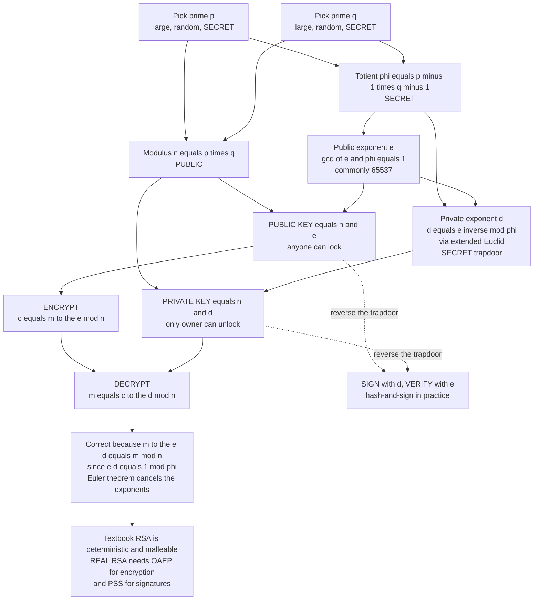

# 🔐 RSA

> [!abstract] TL;DR
> **RSA** is the first and most famous public-key cryptosystem, and its security is a **bet that multiplying is easy but un-multiplying is hard**. Pick two enormous secret primes `p` and `q`, multiply them into a public modulus `n = p times q`, and challenge the world to factor it back — something nobody knows how to do quickly. Anyone can **lock** a message with the public key `n, e` by computing `c = m^e mod n`; only the holder of the private key `d` — derivable *only* from the secret factorization — can **unlock** it via `m = c^d mod n`. The same trapdoor run in reverse gives **signatures**. But **raw "textbook" RSA is dangerously insecure**: it is deterministic, malleable, and homomorphic, so real deployments *must* wrap it in randomized padding — **OAEP** for encryption, **PSS** for signatures. Break RSA and you have either factored a 600-digit number or built a large quantum computer running **Shor's algorithm** — the two events that end RSA's reign.

---

## Intuition

**Analogy — a padlock you hand to strangers.** Imagine you manufacture open padlocks and scatter thousands of them in public. Anyone can snap one shut on a box and mail it to you; nobody but you holds the single key that opens them. Locking is a public act; unlocking is a private secret. That is **public-key cryptography** (see [[Public_Key_Cryptography_Foundations]]) — and RSA is the arithmetic that builds the padlock out of prime numbers.

Here is where the primes come in. **Multiplying** two 300-digit primes into a 600-digit product is something your phone does in a blink. **Factoring** that product back into the two primes has stumped the best algorithms and supercomputers for fifty years. RSA welds a message to that gap: the public padlock is the *product* `n` (which everyone sees), and the secret key is *knowing the two primes* that made it. Encrypting is the cheap forward direction; recovering the message without the primes would require un-multiplying `n` — factoring a 600-digit number. RSA's entire security is the wager that no one can do that. Break RSA and you have solved a problem the whole field believes is intractable.

---

## How It Works

RSA is a **trapdoor permutation**: a function that scrambles messages in a way anyone can compute forward but only the trapdoor-holder can invert. The trapdoor is the secret factorization of `n`. Everything rests on one number-theoretic engine — **modular exponentiation** (see [[Modular_Arithmetic_and_Number_Theory]]) — and one theorem that makes decryption undo encryption (**Euler's theorem**).

### Key generation

1. **Pick two large random primes** `p` and `q` (2048-bit RSA uses two ~1024-bit primes, generated with a probabilistic primality test like Miller–Rabin). These stay **secret forever**.
2. **Compute the modulus** `n = p times q`. This is **public** — it is half the public key. Its bit length is the "RSA key size" (e.g. 2048 bits).
3. **Compute Euler's totient** `phi of n = p minus 1 times q minus 1` — the count of integers below `n` coprime to it. This is **secret**: knowing it is equivalent to knowing the factorization.
4. **Choose the public exponent** `e` with `gcd of e and phi = 1`. In practice `e = 65537` (a prime of low Hamming weight, so `m^e` is fast to compute and still large enough to dodge small-exponent attacks).
5. **Compute the private exponent** `d = e inverse mod phi of n`, using the **extended Euclidean algorithm**. This `d` exists precisely because `gcd of e and phi = 1`, and it is the trapdoor.

The **public key** is `n, e`; the **private key** is `d` (plus `n`). The values `p`, `q`, and `phi of n` must be **destroyed or guarded** — any one of them lets an attacker recompute `d`.

### Encryption and decryption

- **Encrypt:** `c = m^e mod n` (the message `m` must be an integer in `0` to `n minus 1`).
- **Decrypt:** `m = c^d mod n`.

**Why it works.** Decryption raises the ciphertext to `d`, so `c^d = m to the e d mod n`. Because `d` is the inverse of `e` modulo `phi of n`, we have `e d = 1 + k times phi of n` for some integer `k`. **Euler's theorem** says `m to the phi of n = 1 mod n` whenever `gcd of m and n = 1`, so `m to the e d = m times m to the k phi of n = m times 1 = m mod n`. The exponents cancel and the original message falls out. (A short argument via the Chinese Remainder Theorem extends this to all `m`, even those sharing a factor with `n`.)

### Signatures — RSA in reverse

RSA is a *permutation*, so the operations commute: applying `d` then `e` also returns the message. That gives **digital signatures**:

- **Sign:** `s = m^d mod n` (with the **private** key — only the owner can do this).
- **Verify:** check that `s^e mod n = m` (with the **public** key — anyone can do this).

In practice you never sign the raw message; you **hash-and-sign** — sign `H of m` for a collision-resistant hash `H` (see [[Hash_Functions]]) — which shrinks the input, breaks RSA's malleability, and is what standards like PKCS#1 v2 (PSS) formalize.

### Why it is secure — and why textbook RSA is not

Recovering `d` from the public `n, e` requires knowing `phi of n`, which requires **factoring** `n` into `p times q`. The best known classical algorithm is the sub-exponential **General Number Field Sieve** — infeasible for 2048-bit `n`. (Strictly, RSA rests on the slightly weaker **RSA problem**: computing `e`-th roots mod `n` without factoring; see [[Computational_Hardness_Assumptions]].)

But the *raw* trapdoor — "textbook RSA" — is **not** a secure encryption scheme. It is **deterministic** (same `m` always yields the same `c`, leaking equality and destroying IND-CPA), and it is **homomorphic**: `m1^e times m2^e = m1 m2 to the e mod n`, so an attacker can multiply ciphertexts into a valid ciphertext of the product. Small messages under a small `e` fall to a plain integer root, and related messages fall to Coppersmith/Håstad attacks. **Real RSA therefore mandates randomized padding**: **OAEP** (Optimal Asymmetric Encryption Padding) for encryption, achieving IND-CCA2, and **PSS** (Probabilistic Signature Scheme) for signatures. Never deploy textbook RSA.

### Flow / Architecture



---

## Key Concepts

### Secondary (intuitive, no CS background needed)

- **A padlock anyone can close, only you can open.** The public key is an open padlock you hand out; the private key is the one key that opens every copy.
- **Easy to multiply, brutal to un-multiply.** `n` is the product of two secret primes. Everyone sees `n`; only you know the primes. Recovering them means factoring a 600-digit number — nobody can.
- **Signing is locking in reverse.** You sign with your private key so anyone can check with your public key that only *you* could have produced it.
- **Never the raw version.** "Textbook" RSA leaks whether two secret messages are the same and lets attackers tamper with ciphertexts, so real systems always scramble the message with random padding first.

### Undergraduate (a first crypto or number-theory course)

- **The five setup numbers.** Secret primes `p, q`; public modulus `n = p q`; secret totient `phi of n = p minus 1 times q minus 1`; public exponent `e` with `gcd of e and phi = 1`; private exponent `d = e inverse mod phi` from the extended Euclidean algorithm.
- **Correctness via Euler.** `e d = 1 mod phi of n` means `c^d = m to the e d = m mod n` by Euler's theorem — the whole scheme in one line.
- **Why `e = 65537`.** Prime, only two set bits, so `m^e` is fast by square-and-multiply, yet large enough to defeat the `e = 3` cube-root attack on unpadded messages.
- **Trapdoor = the factorization.** Knowing `phi of n` is equivalent to knowing `p` and `q`; recovering `d` reduces to factoring `n`.
- **Textbook RSA's fatal flaws.** Deterministic (no IND-CPA) and homomorphic/malleable (`c1 c2 = m1 m2 to the e`). Fixed only by **OAEP** (encryption) and **PSS** (signatures).
- **CRT speedup.** Decrypting mod `p` and mod `q` separately and recombining is roughly 3–4x faster than one exponentiation mod `n`.

### Graduate (advanced cryptography)

- **RSA problem vs factoring.** RSA security formally rests on the **RSA assumption** (computing `e`-th roots mod `n`), which is *no harder* than factoring but not known to be *equivalent*. Reductions and their limits are the subject of [[Provable_Security_and_Reductions]].
- **OAEP's provable security.** RSA-OAEP is IND-CCA2 in the random-oracle model under the RSA assumption; the original Bellare–Rogaway proof had a gap later repaired by Fujisaki–Okamoto–Pointcheval–Stern. PSS gives tight, provably secure signatures.
- **The attack zoo.** Bleichenbacher's adaptive **padding-oracle** on PKCS#1 v1.5 (and its ROBOT resurrection), **Wiener's** continued-fraction attack when `d < n^{0.25}`, **Coppersmith / Håstad** low-exponent and partial-key-exposure attacks, **common-modulus** attacks, and the 2012 **"Ron was wrong, Whit is right"** mass GCD-factoring of keys sharing a prime from weak randomness.
- **CRT fault attacks.** CRT decryption is fast but if a **single computation fault** corrupts one of the two half-exponentiations, `gcd of s minus s_faulty and n` reveals a prime — the Boneh–DeMillo–Lipton attack. Countermeasure: verify the signature before releasing it, plus blinding.
- **Side channels.** Naive `c^d mod n` leaks `d` through **timing** and power; **base blinding** (`c times r^e`, then divide out `r` after) and constant-time exponentiation are mandatory (see the broader side-channel discussion referenced in prose).
- **The quantum cliff.** **Shor's algorithm** factors `n` in polynomial time on a fault-tolerant quantum computer, breaking RSA *completely* — the central motivation for [[Post_Quantum_Cryptography]].

---

## Python Demo

```python
# ============================================================================
# TEXTBOOK RSA FROM SCRATCH -- EDUCATIONAL ONLY.
# Real deployments MUST use RSA-OAEP for encryption and RSA-PSS for signatures.
# Raw "textbook" RSA (plain m^e mod n) is deterministic, malleable, and
# breakable -- we IMPLEMENT it, then DEMONSTRATE the breaks to prove the point.
# Pure standard library for all crypto; matplotlib only to visualize.
# ============================================================================

import random
import time
import math
import matplotlib.pyplot as plt

random.seed(2026)

# --- primality (Miller-Rabin) + prime generation ----------------------------
def is_probable_prime(n, rounds=40):
    if n < 2:
        return False
    for sp in (2, 3, 5, 7, 11, 13, 17, 19, 23, 29, 31, 37):
        if n % sp == 0:
            return n == sp
    d, r = n - 1, 0
    while d % 2 == 0:
        d //= 2
        r += 1
    for _ in range(rounds):
        a = random.randrange(2, n - 1)
        x = pow(a, d, n)
        if x == 1 or x == n - 1:
            continue
        for _ in range(r - 1):
            x = x * x % n
            if x == n - 1:
                break
        else:
            return False
    return True

def gen_prime(bits):
    while True:
        cand = random.getrandbits(bits) | (1 << (bits - 1)) | 1  # top+bottom bit set
        if is_probable_prime(cand):
            return cand

# --- extended Euclid -> modular inverse -------------------------------------
def egcd(a, b):
    if b == 0:
        return a, 1, 0
    g, x, y = egcd(b, a % b)
    return g, y, x - (a // b) * y

def modinv(a, m):
    g, x, _ = egcd(a % m, m)
    if g != 1:
        raise ValueError("no modular inverse -- gcd is not 1")
    return x % m

def icbrt(x):                       # exact integer cube root (no float error)
    lo, hi = 0, 1 << ((x.bit_length() // 3) + 2)
    while lo < hi:
        mid = (lo + hi + 1) // 2
        if mid ** 3 <= x:
            lo = mid
        else:
            hi = mid - 1
    return lo

# ============================================================================
# 1) KEY GENERATION
# ============================================================================
BITS = 256                          # TOY size. Real RSA uses 2048+ bit modulus.
p = gen_prime(BITS // 2)
q = gen_prime(BITS // 2)
while q == p:
    q = gen_prime(BITS // 2)
n   = p * q
phi = (p - 1) * (q - 1)
e   = 65537
if math.gcd(e, phi) != 1:           # extremely rare fallback
    e = 3
    while math.gcd(e, phi) != 1:
        e += 2
d = modinv(e, phi)
print(f"[keygen] modulus n has {n.bit_length()} bits, public e = {e}")

# ============================================================================
# 2) ENCRYPT / DECRYPT  (verify we recover m)
# ============================================================================
m = 42
c = pow(m, e, n)                    # ENCRYPT: c = m^e mod n
m_back = pow(c, d, n)              # DECRYPT: m = c^d mod n
print(f"[enc/dec] m={m} -> c=...{c % 100000} -> back={m_back}  ok={m_back == m}")

# ============================================================================
# 3) SIGN / VERIFY  (RSA in reverse: sign with d, verify with e)
# ============================================================================
msg = 1234567
sig = pow(msg, d, n)               # SIGN with PRIVATE key
verified = pow(sig, e, n) == msg  # VERIFY with PUBLIC key
print(f"[sign]  msg={msg}  signature verifies = {verified}")

# ============================================================================
# 4) ATTACK A -- HOMOMORPHIC MALLEABILITY  (why textbook RSA is not IND-CCA)
#    (m1^e)(m2^e) = (m1 m2)^e mod n  -> an attacker forges ct of the PRODUCT
# ============================================================================
m1, m2 = 7, 11
c1, c2 = pow(m1, e, n), pow(m2, e, n)
c_forged = (c1 * c2) % n           # attacker never learns m1, m2 -- only multiplies
m_forged = pow(c_forged, d, n)     # decrypts to m1*m2
print(f"[attack A] decrypt(c1*c2) = {m_forged} == m1*m2 = {m1 * m2}  "
      f"-> malleable = {m_forged == m1 * m2}")

# ============================================================================
# 5) ATTACK B -- SMALL-e CUBE ROOT with NO padding
#    If e=3 and m is small enough that m^3 < n, then c = m^3 exactly (no wrap),
#    so ANYONE takes an integer cube root and recovers m WITHOUT the key.
# ============================================================================
e_small = 3
small_m = 4096                     # 4096^3 approx 6.9e10 << n, so no reduction
c_small = pow(small_m, e_small, n) # equals small_m**3 because it is below n
cracked = icbrt(c_small)           # integer cube root -- no private key used
print(f"[attack B] recovered m={cracked} from ciphertext with NO key  "
      f"-> broken = {cracked == small_m}")

# ============================================================================
# 6) CRT DECRYPTION SPEEDUP  (~3-4x): decrypt mod p and mod q, then recombine
# ============================================================================
dp   = d % (p - 1)
dq   = d % (q - 1)
qinv = modinv(q, p)
def decrypt_crt(ct):
    a = pow(ct, dp, p)
    b = pow(ct, dq, q)
    h = (qinv * (a - b)) % p
    return b + h * q
assert decrypt_crt(c) == m

REPS = 400
t0 = time.perf_counter()
for _ in range(REPS):
    pow(c, d, n)                   # straight decryption mod n
t_plain = time.perf_counter() - t0
t0 = time.perf_counter()
for _ in range(REPS):
    decrypt_crt(c)                 # CRT decryption
t_crt = time.perf_counter() - t0
print(f"[CRT]   plain={t_plain:.4f}s  crt={t_crt:.4f}s  speedup={t_plain / t_crt:.2f}x")

# ============================================================================
# 7) VISUALIZE  -- round trip + deterministic permutation + malleability
#    Use a SMALL classic key so ciphertexts fit in a plottable range.
# ============================================================================
sp, sq = 61, 53
sn      = sp * sq                  # 3233
sphi    = (sp - 1) * (sq - 1)      # 3120
se      = 17
sd      = modinv(se, sphi)         # 2753
msgs    = list(range(sn))
cts     = [pow(mm, se, sn) for mm in msgs]        # deterministic permutation
backs   = [pow(cc, sd, sn) for cc in cts]         # decrypt recovers m

fig, ax = plt.subplots(1, 3, figsize=(18, 5.4))

# (i) deterministic permutation: m -> c is a scrambled but FIXED mapping
ax[0].scatter(msgs, cts, s=4, color="steelblue", alpha=0.6)
ax[0].set_title("Textbook RSA is a DETERMINISTIC permutation\n"
                "same m always -> same c  (leaks equality, no IND-CPA)")
ax[0].set_xlabel("message m"); ax[0].set_ylabel("ciphertext c = m^e mod n")
ax[0].grid(True, alpha=0.3)

# (ii) round trip lands exactly back on the diagonal
ax[1].plot(msgs, backs, color="seagreen", lw=1.2)
ax[1].plot([0, sn], [0, sn], "--", color="crimson", lw=1,
           label="perfect recovery y = x")
ax[1].set_title("Decrypt undoes encrypt\n"
                "c^d mod n returns the original m exactly")
ax[1].set_xlabel("original message m"); ax[1].set_ylabel("decrypt(encrypt(m))")
ax[1].legend(); ax[1].grid(True, alpha=0.3)

# (iii) homomorphic malleability: decrypt(c1*c2) == m1*m2 (mod n) -> on diagonal
pairs = [(a, b) for a in range(2, 40) for b in range(2, 40) if a * b < sn]
prod_true = [a * b for a, b in pairs]
prod_dec  = [pow((pow(a, se, sn) * pow(b, se, sn)) % sn, sd, sn) for a, b in pairs]
ax[2].scatter(prod_true, prod_dec, s=8, color="darkorange", alpha=0.7)
ax[2].plot([0, sn], [0, sn], "--", color="crimson", lw=1, label="y = x")
ax[2].set_title("Homomorphic malleability\n"
                "decrypt(c1*c2 mod n) = m1*m2  -> attacker forges products")
ax[2].set_xlabel("true m1 * m2"); ax[2].set_ylabel("decrypt(c1 * c2 mod n)")
ax[2].legend(); ax[2].grid(True, alpha=0.3)

plt.tight_layout()
plt.show()

print("\nEVERY break above is why NOBODY ships textbook RSA. Real RSA wraps the")
print("message in randomized padding: OAEP for encryption (kills determinism and")
print("malleability, gives IND-CCA2) and PSS for signatures.")
```

**What the demo shows.** Panels reading left to right: (i) the `m -> c` mapping is a *fixed, scrambled permutation* — visually structureless yet **deterministic**, so identical plaintexts always collide to identical ciphertexts (the death of IND-CPA); (ii) `c^d mod n` lands every point exactly back on the diagonal, confirming Euler's theorem cancels the exponents; (iii) the malleability points sit *on* the line `y = x`, proving `decrypt of c1 c2 = m1 m2` — an attacker who never saw the plaintexts can still forge a ciphertext of their product. Attack B recovers a small message by a plain **cube root**, no key required. All three failures vanish only when the message is randomized by **OAEP/PSS padding** — which is precisely why textbook RSA is a teaching tool, never a shipping product.

---

## Real-World Applications

> **Example — the certificate that authenticates a website.** When your browser validates an `https` server's certificate, it very often checks an **RSA-PSS or RSA-PKCS#1** signature: the certificate authority signed the site's public key with *its* RSA private key, and your browser verifies with the CA's public key. RSA here proves identity, not confidentiality — the actual session key is exchanged with (elliptic-curve) Diffie–Hellman, but the *trust anchor* is frequently a 2048- or 4096-bit RSA signature. See [[Asymmetric_Cryptography_and_PKI]].

- **TLS certificates and code signing.** RSA signatures authenticate servers, software packages, firmware, and OS updates; RS256 (RSA + SHA-256) is a default JWT signing algorithm for web tokens.
- **SSH and PGP/GPG.** RSA host and user keys authenticate SSH logins; PGP uses RSA for email encryption and signing.
- **Smart cards, HSMs, TPMs.** RSA (with CRT decryption for speed) is baked into hardware security modules, payment cards, and passports — where fault-attack countermeasures matter most.
- **Key transport (legacy).** Older TLS and enterprise protocols used RSA to *encrypt* a session key directly (RSA-OAEP or, unfortunately, PKCS#1 v1.5 — the source of Bleichenbacher/ROBOT oracles). Modern TLS 1.3 dropped RSA key transport in favor of forward-secret ECDHE.
- **The "hello world" of public-key crypto.** Because its number theory is elegant and self-contained, RSA is how nearly every engineer *first* learns asymmetric cryptography — including the crucial lesson that the textbook version is unsafe.

---

## Common Pitfalls

- **Using textbook RSA.** Raw `m^e mod n` is deterministic and homomorphic — no confidentiality guarantee at all. **Always** use RSA-OAEP for encryption and RSA-PSS for signatures. This is the single most important RSA rule.
- **PKCS#1 v1.5 padding oracles.** The old v1.5 encryption padding is vulnerable to **Bleichenbacher's** adaptive-chosen-ciphertext attack (revived as **ROBOT** in 2017). Distinguishable error responses leak the plaintext one query at a time. Migrate to OAEP; never reveal padding-validity via timing or error codes.
- **Weak prime generation / shared factors.** If two keys are generated with poor randomness and share a prime, `gcd of n1 and n2` factors both instantly — the 2012 **"Ron was wrong, Whit is right"** study factored tens of thousands of real Internet keys this way. Use a vetted CSPRNG and never reuse primes.
- **Small private exponent `d`.** Choosing a small `d` to speed decryption invites **Wiener's attack** (works when `d < n^{0.25}`) and Boneh–Durfee extensions. Always derive `d` from a proper `e` like 65537; never shrink `d`.
- **Small `e` without padding, or a broadcast message.** `e = 3` on an unpadded message with `m^3 < n` falls to a cube root; the same message sent to three recipients falls to **Håstad's broadcast attack** via CRT. Padding (OAEP) is the fix.
- **CRT without fault protection.** CRT decryption is ~4x faster but a **single hardware fault** during one half-exponentiation leaks a prime via `gcd of s minus s_faulty and n` (Boneh–DeMillo–Lipton). Verify the result before releasing it, and blind the input.
- **Timing side channels.** Non-constant-time modular exponentiation leaks `d` through decryption timing. Use **base blinding** and constant-time implementations; do not hand-roll the big-integer math.
- **Undersized or long-lived keys.** 1024-bit RSA is broken-adjacent; 2048-bit is today's floor and 3072+ is recommended for long-term data. And *all* RSA is dead once a large quantum computer runs **Shor's algorithm** — plan post-quantum migration for anything that must stay secret for decades.

---

## Related Concepts

- [[Public_Key_Cryptography_Foundations]] — the parent framework of trapdoor functions, key pairs, and asymmetric primitives; RSA is its canonical first instance.
- [[Modular_Arithmetic_and_Number_Theory]] — the engine room of RSA: modular exponentiation, Euler's totient and theorem, the extended Euclidean algorithm for `d`, and the CRT that speeds decryption.
- [[Computational_Hardness_Assumptions]] — RSA is a trapdoor permutation whose security rests on the factoring / RSA assumption; this note situates it among discrete-log, ECDLP, and lattice assumptions.
- [[Provable_Security_and_Reductions]] — why OAEP and PSS are trusted: reductions to the RSA assumption (in the random-oracle model) rather than ad-hoc confidence.
- [[Hash_Functions]] — the collision-resistant hash at the heart of "hash-and-sign" and of PSS/OAEP's mask-generation function.
- [[Asymmetric_Cryptography_and_PKI]] — the deployed public-key ecosystem (certificates, CAs, key transport) where RSA signatures and encryption live.
- [[Shors_Factoring_Algorithm]] — the quantum algorithm that factors `n` in polynomial time and breaks RSA outright, motivating the post-quantum transition.
- [[Post_Quantum_Cryptography]] — lattice-based replacements (Kyber, Dilithium) chosen because their hardness resists Shor, unlike RSA.
- [[Groups_Rings_Fields_for_Cryptography]] — RSA operates in the multiplicative group of integers mod `n`; the group structure is what makes Euler's theorem and the permutation property hold.
- [[Cryptography_Overview]] — where RSA sits in the broader map of symmetric vs asymmetric primitives.

*(Forthcoming siblings in this Cryptography vault — `Digital_Signatures`, `Elliptic_Curve_Cryptography`, `Diffie_Hellman_and_Discrete_Log`, `Side_Channel_Attacks`, and `Cryptographic_Failures_and_Misuse` — are referenced in prose here until they exist. ECC, in particular, delivers 256-bit-key security equivalent to 3072-bit RSA and is increasingly preferred.)*

---

## Review Questions

1. **(Conceptual)** Walk through why `c^d mod n` recovers `m`. State exactly where `gcd of e and phi = 1`, the definition `d = e inverse mod phi`, and **Euler's theorem** each enter the argument — and explain why leaking `phi of n` is as catastrophic as leaking `p` and `q`.
2. **(Scenario)** A developer encrypts each field of a database record with textbook RSA under the company's public key, reasoning "only we hold the private key, so it's safe." Describe two concrete attacks an adversary who sees only the ciphertexts can mount (think determinism and the homomorphic property), and state precisely which padding scheme fixes each and what security property it restores.
3. **(Trade-off / deep)** You must choose a signing scheme for firmware that ships today but must remain verifiable and unforgeable for 25 years. Compare **RSA-3072-PSS** against an elliptic-curve alternative on key size, speed, and the *named hardness assumption* each relies on — then explain why **Shor's algorithm** forces you to also consider a post-quantum signature, and what "harvest now, forge later" would (and would not) mean for a *signature* scheme versus an *encryption* scheme.

---

## Sources

- Rivest, R. L., Shamir, A., & Adleman, L. (1978). "A Method for Obtaining Digital Signatures and Public-Key Cryptosystems." *Communications of the ACM*, 21(2), 120–126. — The original RSA paper.
- Katz, J., & Lindell, Y. (2020). *Introduction to Modern Cryptography* (3rd ed.). CRC Press. — Rigorous treatment of RSA, the RSA problem, OAEP, and PSS.
- Boneh, D. (1999). "Twenty Years of Attacks on the RSA Cryptosystem." *Notices of the AMS*, 46(2), 203–213. — The canonical survey of Wiener, Coppersmith, Håstad, broadcast, and low-exponent attacks.
- Bleichenbacher, D. (1998). "Chosen Ciphertext Attacks Against Protocols Based on the RSA Encryption Standard PKCS#1." *CRYPTO '98*, LNCS 1462, 1–12. — The padding-oracle attack that OAEP was designed to stop.
- Lenstra, A., Hughes, J. P., Augier, M., et al. (2012). "Ron was wrong, Whit is right." *IACR ePrint 2012/064*. https://eprint.iacr.org/2012/064 — Mass factoring of real-world RSA keys with shared primes from weak randomness.
- Moriarty, K., et al. (2016). *PKCS #1 v2.2: RSA Cryptography Specifications* (RFC 8017). https://www.rfc-editor.org/rfc/rfc8017 — The standard defining RSAES-OAEP and RSASSA-PSS.

---

#cryptography #rsa #public-key #factoring #oaep-pss
