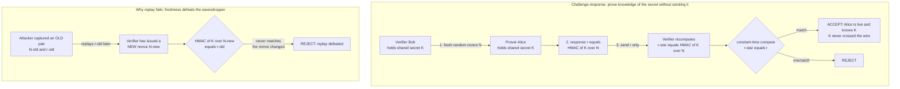

# 🪪 Authentication Protocols

> [!abstract] TL;DR
> **Entity authentication** is the problem of proving to a verifier that you are the *live* party you claim to be, over a network where every message can be **eavesdropped, replayed, or tampered with**. It is distinct from *message* authentication — a [[Message_Authentication_Codes|MAC]] proves *data* wasn't altered; entity authentication proves a *person or machine* is present *right now*. The naive answer — send a password (even a hashed one) — is broken on first use: the secret is **reusable**, so an eavesdropper captures it and **replays** it forever. The core fix is **challenge-response**: the verifier sends a fresh random **nonce**, and the prover replies with a function of the nonce *and* a secret — `HMAC(K, nonce)` for shared keys, or a **signature** for public keys — so the secret **never crosses the wire** and each response is **single-use** because the nonce changes. **Freshness** (random nonces, timestamps, or counters) is what defeats replay. These protocols are famously subtle: **reflection** attacks bounce the verifier's own challenge back at it, **interleaving** attacks weave two sessions together, and "obvious" designs like **Needham-Schroeder** hid flaws for 17 years. This machinery underpins **Kerberos** tickets, **SSH** keys, **TLS** client certs, **TOTP** authenticator codes, and **FIDO2/passkeys** — the phishing-resistant, passwordless future.

---

## Intuition

**Analogy — the secret handshake vs. the bouncer's riddle.** Suppose you want to prove to a nightclub bouncer that you are a club member. The *naive* scheme is a **secret password**: you walk up and whisper "swordfish." It works once — but anyone loitering nearby *overhears* it and can now walk up tomorrow and say "swordfish" to impersonate you. Worse, the password is a **reusable secret**: it leaks completely the first time you use it, and the bouncer himself now knows it too. Even if you whisper it *inside a soundproof booth* (encryption), a spy who records the muffled sound can **replay** the recording later. The password model is doomed because the thing you send is the thing worth stealing.

Now imagine a smarter bouncer. Each time you show up he flips open a book to a **random page number he just picked** and says: "*Tell me the third word on page 412.*" Only a real member — who owns the same book — can answer, and the answer is **different every night** because the page number is fresh. An eavesdropper who hears "the third word on page 412 is *raven*" learns nothing reusable: tomorrow the bouncer asks about page 88, and last night's answer is worthless. You have **proved you know a secret** (the book) **without ever revealing it**, and the eavesdropper captured nothing they can replay. That fresh riddle is a **challenge**; your answer is a **response**; and this challenge-response dance is the beating heart of every serious authentication protocol.

---

## How It Works

### The problem: entity authentication over a hostile channel

*Entity authentication* answers a deceptively hard question: **"Is the party at the other end of this connection really who they claim, and are they live right now?"** The adversary model is the internet: an attacker can **read** every packet (eavesdrop), **resend** old packets (replay), **modify** packets in flight (tamper), and sit **between** the two parties relaying and altering traffic (man-in-the-middle). Note the contrast with *message* authentication: a [[Message_Authentication_Codes|MAC]] on a file proves the *bytes* are intact and came from a key-holder, but a captured `(message, tag)` pair can be replayed indefinitely — a MAC proves **integrity**, not **freshness**. Entity authentication must additionally prove **liveness**: that a specific principal is participating in *this* exchange, *now*.

### Why naive passwords fail

Sending a password is broken for a structural reason: **it is a reusable secret that leaks on first use.**

1. **Eavesdropping + replay.** A passive attacker copies the password off the wire and replays it verbatim. No cracking required — the captured bytes *are* the credential.
2. **Hashing on the wire doesn't help.** If the client sends `H(password)` instead, the hash simply *becomes* the reusable secret: capture it, replay it. (Password hashing with a slow KDF like Argon2/bcrypt protects the *stored database* against offline cracking — a different problem — not the wire; see [[Password_Hashing_and_KDFs]].)
3. **Even TLS is not a complete answer.** A channel like TLS stops the *wire* eavesdropper, but the **server still receives the plaintext password** and can log it, leak it in a breach, or be impersonated by a phishing site that harvests it. The password remains a single high-value secret replayable across every site where it is reused.

The lesson learned across decades of breaches: **do not transmit long-term reusable secrets.** (For the storage side — how to hold verifier material safely — see [[Password_Hashing_and_KDFs]].)

### Challenge-response: the core technique

Instead of sending the secret, the prover **demonstrates knowledge** of it against a fresh challenge:

1. The **verifier** generates a fresh, unpredictable **nonce** `N` (a *number used once*) and sends it.
2. The **prover** computes a **response** as a function of `N` *and* the secret, and returns it — **without revealing the secret**.
   - **Symmetric variant:** `response = HMAC(K, N)` with a shared key `K`. Verifier recomputes and compares (see [[Message_Authentication_Codes]]).
   - **Asymmetric variant:** `response = Sign(sk, N)`, verified with the prover's public key `pk` — no shared secret exists at all (see [[Digital_Signatures]], [[Public_Key_Cryptography_Foundations]]).
3. The verifier checks the response. Because `N` is **fresh each time**, a captured old response is useless — **replay is defeated**. Because the secret is only used *inside* a one-way function, it **never crosses the wire**.

### Nonces, timestamps, and freshness

Replay resistance requires **freshness**, and there are three classic sources, each with trade-offs:

- **Random nonces** — the verifier picks an unpredictable value per session. Stateless and robust, but requires a round trip (the verifier must *send* the challenge first) and a good CSPRNG (see the planned sibling `Random_Number_Generation`).
- **Timestamps** — the prover includes the current time, valid within a small window. Saves a round trip (no challenge needed) but demands **synchronized clocks**; too-wide a window reopens replay, too-narrow rejects honest parties. This is how Kerberos and TOTP achieve freshness.
- **Sequence numbers / counters** — a monotonic counter both sides track. No clock needed, but requires **shared state** that must survive restarts and never rewind. This is HOTP's model and IPsec's anti-replay window.

### Mutual authentication and its pitfalls

Often *both* parties must authenticate each other — mutual authentication. The temptation is to run challenge-response symmetrically in both directions with the **same key and same construction**. This is subtly, dangerously wrong:

- **Reflection attack.** An attacker who cannot compute the response **tricks the verifier into computing it for them**. It opens a *second* session and sends the verifier's *own challenge* back as its challenge; the verifier dutifully answers, and the attacker reflects that answer into the first session. It authenticates as a legitimate party **without knowing the key**. The fix: **bind identities and direction** into the MACed message (`HMAC(K, "A->B" ‖ N)`), or use **different keys per direction**, so a reflected response carries the wrong tag and fails.
- **Interleaving attack.** The attacker weaves messages from multiple concurrent runs to synthesize a valid transcript. The defense is the same design discipline: bind every message to its session, role, and sequence.
- **Why "obvious" protocols are broken.** The **Needham-Schroeder public-key protocol** (1978) was believed correct for **17 years** until **Gavin Lowe** used a model checker in 1995 to find a man-in-the-middle flaw — the attacker relayed identity `A`'s nonce through a session with a malicious party to impersonate `A`. The fix ("Needham-Schroeder-Lowe") was a **one-line change**: include the responder's identity in a message. This is the canonical lesson that authentication protocols demand **formal analysis**, not intuition (see [[Provable_Security_and_Reductions]]).



### Kerberos: ticket-based single sign-on

**Kerberos** is the archetypal *symmetric-key* authentication protocol and the engine behind **Windows Active Directory** login. Its insight: authenticate *once* to a trusted **Key Distribution Center (KDC)**, then receive time-limited encrypted credentials — **tickets** — that let you access many services **without ever resending your password**.

1. The client proves knowledge of its password to the **Authentication Server** and receives a **Ticket-Granting Ticket (TGT)** plus a session key, both usable for hours.
2. To reach a service, the client presents the TGT to the **Ticket-Granting Server** and gets a **service ticket** — an encrypted blob the target service can decrypt to learn a fresh session key and the client's identity.
3. The client sends the service ticket plus a **timestamp authenticator** (freshness against replay).

Passwords never traverse the network after the initial exchange; services never see them at all. The costs are real: Kerberos depends on **synchronized clocks** (default tolerance ~5 minutes) and on the KDC as a trusted third party, and its tickets are the target of **pass-the-ticket** and **Golden Ticket** attacks when key material leaks. Ticket lifetimes, session keys, and the key hierarchy connect to [[Key_Management_and_Distribution]].

### Public-key authentication and passwordless auth

Challenge-response with **signatures** removes the shared secret entirely: the verifier's nonce is **signed by the prover's private key** and checked with the public key. There is no secret for the server to lose, and no reusable credential to phish. This powers:

- **SSH public-key auth** — the server challenges; the client signs with its private key.
- **TLS client certificates / mutual TLS** — both endpoints prove identity via certificates (see [[TLS_and_Secure_Channels]], [[TLS_Protocol_Deep_Dive]], [[Certificate_Management_and_PKI]]).
- **FIDO2 / WebAuthn / passkeys** — a hardware-backed key pair per site; the browser signs a challenge that is **bound to the origin**, making it **phishing-resistant** by construction (a fake site gets a signature over the *wrong* origin). This is the foundation of the modern **passwordless** push.

### One-time passwords and MFA

- **HOTP (RFC 4226)** — a **counter**-based one-time code: `truncate(HMAC(seed, counter))`. Each use increments the counter.
- **TOTP (RFC 6238)** — the time-based variant used by authenticator apps: `counter = floor(time / 30)`, yielding the familiar rotating **6-digit code** from a shared seed and a synced clock.
- **Multi-factor authentication (MFA)** — combine independent factors: **something you know** (password), **have** (phone/security key), **are** (biometric). A stolen password alone is then insufficient. TOTP codes and hardware keys are the "have" factor; FIDO2 is a phishing-resistant "have" that also replaces the password.

### Composition and modern frameworks

- **OAuth 2.0 / OpenID Connect** — delegated **authorization** and, with OIDC, authentication for the web via **tokens** (bearer access tokens, ID tokens). Strictly this is *not* cryptographic entity authentication of a live party — it's about *delegating* access — but it is built on these primitives (signed JWTs, TLS). See [[JWT_and_OAuth]], [[OAuth_and_JWT]], [[Authentication_and_Authorization]].
- **SAML** — XML-based federated authentication assertions, common in enterprise SSO (see [[SSO_and_Federation]]).
- **PAKE — Password-Authenticated Key Exchange** (SRP, **OPAQUE**) — the clever middle ground: authenticate with a *password* while ensuring the **server never learns it** and an eavesdropper cannot mount an **offline dictionary attack**. It turns a low-entropy password into a mutually authenticated session key without a reusable wire secret; it sits alongside the broader authenticated key exchange story in [[Key_Exchange_and_PKI]].

---

## Key Concepts

### Secondary (intuitive)
- **Entity authentication** proves *who* is on the line, *live, now* — different from a MAC, which proves *data* wasn't changed.
- **Naive passwords fail** because the secret is *reusable*: overheard once, it's replayable forever — even hashed, even over TLS the server still sees it.
- **Challenge-response** proves you know a secret *without sending it*: answer a fresh random riddle only the real you can answer. The eavesdropper learns nothing reusable.
- **Freshness** (a new nonce every time) is what makes replay fail; a captured old answer is worthless against a new challenge.
- **MFA** stacks independent factors — know / have / are — so one stolen credential isn't enough. **Passkeys (FIDO2)** are the phishing-resistant, passwordless upgrade.

### Undergraduate (formal)
- **Protocol goals:** unilateral vs **mutual** authentication; freshness via **nonce**, **timestamp**, or **counter**, each with a distinct state/round-trip/clock trade-off.
- **Symmetric challenge-response:** `r = HMAC_K(N)`; verifier recomputes and does a **constant-time** compare. **Asymmetric:** `r = Sign_{sk}(N)`, verified with `pk`; no shared secret.
- **Reflection attack:** in naive symmetric mutual auth, the attacker gets the verifier to answer its own challenge in a second session. **Fix:** bind identity + direction into the input (`HMAC_K("A→B" ‖ N)`) or use per-direction keys.
- **Kerberos:** KDC issues a **TGT** and per-service **tickets** (encrypted, time-limited) so passwords aren't re-sent; needs clock sync; **pass-the-ticket** when keys leak.
- **OTP:** **HOTP** = `HMAC(seed, counter)` truncated; **TOTP** = HOTP with `counter = ⌊t/30⌋`.
- **Needham-Schroeder-Lowe:** the 1978 protocol's MITM flaw, found by Lowe in 1995 via model checking, fixed by binding an identity — the poster child for *formal* protocol analysis.

### Graduate (advanced)
- **Interleaving / multiplicity attacks:** security must hold under **concurrent, adversarially-scheduled** sessions; matching-conversations and session-identifier definitions (Bellare-Rogaway) formalize "the two parties agree on the same run."
- **Authenticated Key Exchange (AKE):** authentication is rarely the end goal — you want a **fresh session key** bound to authenticated identities, with **forward secrecy** and **KCI/UKS resistance** (see [[Key_Exchange_and_PKI]], [[Secure_Messaging_and_Signal_Protocol]]). The SIGMA "sign-and-MAC" design underlies IKE and TLS 1.3.
- **PAKE:** **SRP** and the aPAKE **OPAQUE** achieve mutual auth from a low-entropy password with **no offline dictionary attack** even against a compromised server, by never exposing a password-equivalent verifier over the wire.
- **Downgrade and negotiation attacks:** an active MITM forces both parties onto the weakest mutually-supported method; robust protocols **authenticate the entire negotiation transcript** (TLS 1.3's `Finished` MAC over the handshake — see [[TLS_and_Secure_Channels]]).
- **Formal verification:** symbolic (**ProVerif**, **Tamarin**) and computational proofs are now standard for real protocols; the field learned from a graveyard of "proved-then-broken" designs (see [[Provable_Security_and_Reductions]], [[Computational_Hardness_Assumptions]]).
- **Phishing resistance as a design property:** WebAuthn binds the signed challenge to the **origin**, so credentials are *unphishable by construction* — a categorically stronger guarantee than user vigilance or OTP.

---

## Python Demo

```python
# Authentication protocols: proving WHO you are over a hostile network.
# Four runnable lessons + a matplotlib dashboard.
#   (A) NAIVE "send the password" (even hashed) is broken by EAVESDROP + REPLAY.
#   (B) CHALLENGE-RESPONSE: verifier sends a fresh nonce, prover returns
#       HMAC(secret, nonce). The secret never crosses the wire and each
#       response is single-use, so replay FAILS when the nonce changes.
#   (C) MUTUAL auth and the REFLECTION attack -- and how binding identity +
#       direction into the MAC defeats it.
#   (D) TOTP (RFC 6238): a time-based one-time password sketch.
# Pure standard library (os, hmac, hashlib, time, struct) + matplotlib. No numpy.
import os, hmac, hashlib, time, struct
import matplotlib.pyplot as plt

def mac(key, msg):            # HMAC-SHA256
    return hmac.new(key, msg, hashlib.sha256).digest()

def eq(a, b):                 # constant-time compare (never branch on secret bytes)
    return hmac.compare_digest(a, b)

# ============================================================
# PART A -- NAIVE password over the wire is broken by eavesdrop + replay
# ============================================================
PASSWORD = b"correct horse battery staple"
stored   = hashlib.sha256(PASSWORD).digest()          # server stores a hash (good hygiene)

def login_plain(transmitted):                          # A1: client sends the plaintext password
    return eq(hashlib.sha256(transmitted).digest(), stored)

def login_hashed(transmitted):                         # A2: "we hashed it!" -> hash is the wire secret
    return eq(transmitted, stored)

print("PART A  naive password over the wire")
alice_wire = PASSWORD
print("  legit plaintext login       :", login_plain(alice_wire))         # True
eve_capture = alice_wire                               # passive eavesdropper copies the wire
print("  Eve replays captured bytes  :", login_plain(eve_capture))        # True -> impersonation!
print("  Eve replays captured HASH   :", login_hashed(hashlib.sha256(PASSWORD).digest()))  # still True

# ============================================================
# PART B -- CHALLENGE-RESPONSE: prove knowledge of K, never send it
# ============================================================
K = os.urandom(32)                                     # shared secret: Alice (prover) & Bob (verifier)

def issue_nonce():          return os.urandom(16)      # fresh, unpredictable challenge
def respond(nonce, k=K):    return mac(k, nonce)       # response = HMAC(K, nonce)
def check(nonce, resp, k=K):return eq(resp, mac(k, nonce))

n1 = issue_nonce()
r1 = respond(n1)
print("PART B  challenge-response")
print("  honest response accepted    :", check(n1, r1))          # True
print("  secret K appeared on wire?  :", (K in (n1 + r1)))       # False -- never transmitted

n_prev = issue_nonce()                                 # a nonce from an EARLIER session...
captured = respond(n_prev)                             # ...Eve captured this response
rounds = 8
cr_nonces   = [issue_nonce() for _ in range(rounds)]
cr_legit    = [1 if check(n, respond(n)) else 0 for n in cr_nonces]   # honest prover: all accept
cr_attacker = [1 if check(n, captured)   else 0 for n in cr_nonces]   # replay: all reject
naive_atk   = [1 for _ in range(rounds)]                              # naive replay: always accepts
print("  replay accepted by verifier :", any(cr_attacker), "(challenge-response)")
print("  replay accepted by verifier :", all(naive_atk),  "(naive password)")

# ============================================================
# PART C -- MUTUAL auth: the REFLECTION attack and its fix
# ============================================================
# Naive mutual auth: both directions use the SAME key and SAME construction,
# and B will answer ANY challenge with HMAC(K, nonce) to prove itself.
def B_prove(nonce):            return mac(K, nonce)

# Attacker M (does NOT know K) impersonates A to B:
Na  = os.urandom(16)                                   # session 1: M -> B challenge
Nb  = os.urandom(16)                                   # session 1: B -> M challenge (M must answer)
# M cannot compute HMAC(K, Nb)... so it REFLECTS Nb to B in a 2nd session,
# asking B to "prove itself" on Nb -- and replays B's own answer back:
reflected = B_prove(Nb)
attack_ok = eq(reflected, mac(K, Nb))                  # True -> M authenticated WITHOUT K
print("PART C  mutual authentication")
print("  reflection attack succeeds  :", attack_ok)

# FIX: bind sender/receiver identity + direction into the MAC input.
def prove_bound(nonce, sender, receiver):
    return mac(K, sender + b"->" + receiver + b"|" + nonce)

Nb2       = os.urandom(16)
reflected2 = prove_bound(Nb2, b"B", b"A")              # B can only make a B->A proof
expected   = prove_bound(Nb2, b"A", b"B")              # session 1 needs an A->B proof
attack_fixed = eq(reflected2, expected)                # False -> reflection defeated
print("  reflection after binding    :", attack_fixed)

# ============================================================
# PART D -- TOTP (RFC 6238): time-based one-time password
# ============================================================
def hotp(seed, counter, digits=6):
    h   = hmac.new(seed, struct.pack(">Q", counter), hashlib.sha1).digest()  # RFC 4226
    off = h[-1] & 0x0F                                                        # dynamic truncation
    val = int.from_bytes(h[off:off+4], "big") & 0x7FFFFFFF
    return str(val % (10 ** digits)).zfill(digits)

def totp(seed, t, step=30, digits=6):
    return hotp(seed, int(t // step), digits)

seed = os.urandom(20)
t0   = 1_700_000_000
print("PART D  TOTP")
print("  code at t0            :", totp(seed, t0))
print("  same window t0 plus 10:", totp(seed, t0 + 10))   # identical within a 30s window
print("  next window t0 plus 30:", totp(seed, t0 + 30))   # changes

# ============================================================
# VISUALIZE
# ============================================================
fig, ax = plt.subplots(2, 2, figsize=(14, 9))
x = list(range(rounds))

# Panel 1 -- replay timeline: naive always ACCEPTS the attacker, C-R rejects it.
ax[0, 0].step(x, naive_atk,   where="mid", lw=2, label="naive password: attacker replay")
ax[0, 0].step(x, cr_attacker, where="mid", lw=2, label="challenge-response: attacker replay")
ax[0, 0].step(x, cr_legit,    where="mid", lw=2, ls="--", label="challenge-response: honest prover")
ax[0, 0].set_yticks([0, 1]); ax[0, 0].set_yticklabels(["REJECT", "ACCEPT"])
ax[0, 0].set_ylim(-0.2, 1.2); ax[0, 0].set_xlabel("authentication round")
ax[0, 0].set_title("A/B: replay -- naive always accepts, challenge-response rejects")
ax[0, 0].legend(loc="center right", fontsize=8)

# Panel 2 -- freshness: a new random nonce each round yields a new response.
nonce_vals = [int.from_bytes(n[:4], "big") for n in cr_nonces]
resp_vals  = [respond(n)[0] for n in cr_nonces]
ax[0, 1].plot(x, nonce_vals, "-o", label="fresh nonce (first 4 bytes)")
axb = ax[0, 1].twinx()
axb.plot(x, resp_vals, "-s", color="tab:red", label="response first byte")
ax[0, 1].set_title("Freshness: new random nonce each round -> new response")
ax[0, 1].set_xlabel("authentication round"); ax[0, 1].set_ylabel("nonce value")
axb.set_ylabel("response byte")
ax[0, 1].legend(loc="upper left", fontsize=8); axb.legend(loc="upper right", fontsize=8)

# Panel 3 -- reflection attack: binding identity+direction defeats it.
ax[1, 0].bar(["naive\nmutual auth", "identity plus direction\nbound"],
             [int(attack_ok), int(attack_fixed)], color=["tab:red", "tab:green"])
ax[1, 0].set_yticks([0, 1]); ax[1, 0].set_yticklabels(["safe", "COMPROMISED"])
ax[1, 0].set_ylim(0, 1.3)
ax[1, 0].set_title("C: reflection attack -- binding identity + direction defeats it")

# Panel 4 -- TOTP codes rotate every 30s window.
windows = 12
codes   = [int(totp(seed, t0 + 30 * i)) for i in range(windows)]
ax[1, 1].step(range(windows), codes, where="post", lw=2)
ax[1, 1].set_title("D: TOTP -- one-time code changes every 30s window")
ax[1, 1].set_xlabel("30-second window"); ax[1, 1].set_ylabel("6-digit code")

plt.tight_layout(); plt.show()

# Takeaways:
#   A -> the naive scheme accepts a REPLAYED capture (plaintext OR hash): the wire
#        secret is reusable, so overhearing it once is game over.
#   B -> challenge-response never sends K and rejects every replayed response
#        because the verifier's nonce is fresh each round.
#   C -> naive symmetric mutual auth lets an attacker REFLECT the verifier's own
#        challenge to authenticate without K; binding sender->receiver identity
#        into the MAC input makes a reflected proof carry the wrong tag.
#   D -> TOTP derives a short-lived code from HMAC(seed, time/30): single-use in
#        time, no reusable secret on the wire.
```

Running it prints `Eve replays captured bytes: True` for the naive password (broken by replay) and `replay accepted by verifier: False (challenge-response)` for the fresh-nonce scheme; it shows the reflection attack succeeding (`True`) against naive mutual auth and failing (`False`) once identity and direction are bound; and it prints a TOTP code that is stable within a 30-second window and changes across it. The four panels visualize the replay timeline (naive accepts every attacker attempt while challenge-response rejects them), nonce freshness (a new random challenge and response each round), the reflection attack defeated by binding, and the TOTP code rotating each window.

---

## Real-World Applications

> **Example — Kerberos in Active Directory.** Nearly every corporate Windows login runs this note in production. When you log into a domain, your workstation proves knowledge of your password to the **KDC** *once* and receives a **Ticket-Granting Ticket**; from then on it presents time-stamped **service tickets** to file shares, mail, and intranet apps — your password is **never re-sent** and those services never see it. The freshness comes from **timestamps** (hence the strict clock-sync requirement), and the whole scheme's crown-jewel risk is **ticket theft** (pass-the-ticket, Golden Ticket) when the KDC's key leaks.

- **SSH public-key authentication** — the server sends a challenge; the client signs it with its private key. No password crosses the wire; a stolen `authorized_keys` public key is useless to an attacker.
- **TLS and mutual TLS** — the server (and optionally the client) proves identity by signing handshake data with a certificate's private key; the transcript is MAC-bound to defeat downgrade attacks (see [[TLS_and_Secure_Channels]], [[TLS_Protocol_Deep_Dive]], [[Certificate_Management_and_PKI]]).
- **TOTP authenticator apps** — Google Authenticator, Authy, and 1Password generate RFC 6238 codes from a shared seed and the wall clock; the ubiquitous "second factor."
- **FIDO2 / WebAuthn / passkeys** — hardware- or platform-backed key pairs sign an origin-bound challenge, delivering **phishing-resistant, passwordless** login now shipping in Apple, Google, and Microsoft ecosystems.
- **OAuth 2.0 / OIDC and API tokens** — bearer and signed-JWT tokens delegate access to web and mobile apps; **HMAC request signing** (AWS SigV4, Stripe webhooks) authenticates each API call and binds it against replay (see [[JWT_and_OAuth]], [[OAuth_and_JWT]], [[Authentication_and_Authorization]]).
- **Signal / secure messaging** — mutual authentication of long-term identity keys underpins the authenticated key exchange that bootstraps end-to-end encryption (see [[Secure_Messaging_and_Signal_Protocol]]).

---

## Common Pitfalls

- **Transmitting a reusable secret** — sending a password or a bare `H(password)` hands an eavesdropper a replayable credential. Prove *knowledge* via challenge-response instead of *sending* the secret.
- **No freshness = replay** — a challenge-response that reuses a nonce, or omits freshness entirely, is just a fancy replayable token. Use a **fresh random nonce**, a **timestamp** (with synced clocks), or a **monotonic counter** — and actually reject duplicates.
- **Reflection in symmetric mutual auth** — using the same key and construction in both directions lets an attacker bounce the verifier's challenge back to be answered. **Bind identities and direction** into the MAC input, or use **per-direction keys**.
- **Rolling your own protocol** — Needham-Schroeder hid a flaw for 17 years; "obvious" designs are routinely broken by reflection, interleaving, or downgrade. Use vetted protocols (TLS 1.3, Kerberos, FIDO2) and, if you must design, **formally verify** with ProVerif/Tamarin.
- **Non-constant-time response comparison** — verifying the response with an early-exit `==` leaks a timing oracle (see [[Message_Authentication_Codes]]); use `hmac.compare_digest`.
- **Clock skew with timestamp freshness** — too-wide a validity window reopens replay; too-narrow rejects honest users. Kerberos/TOTP depend on NTP-level sync; monitor drift.
- **Phishable second factors** — SMS OTP and even TOTP can be **relayed in real time** by a proxy phishing site; only **origin-bound** WebAuthn/passkeys are truly phishing-resistant.
- **Confusing authentication with authorization** — a valid OAuth *access token* proves a delegated *permission*, not that a specific live human is present. Don't treat a bearer token as strong entity authentication.
- **Server learns the password anyway** — even with TLS, a plaintext password reaches (and can be logged/leaked by) the server. Prefer public-key auth or a **PAKE** (SRP/OPAQUE) so the server never holds a password-equivalent secret.

---

## Related Concepts

- [[Message_Authentication_Codes]] — the HMAC primitive that powers symmetric challenge-response; also the source of the constant-time-compare rule. Note the distinction: a MAC proves *data* integrity, this note proves *entity* liveness.
- [[Digital_Signatures]] — the asymmetric primitive behind signature-based (passwordless) challenge-response, where the prover signs the verifier's nonce with a private key.
- [[Public_Key_Cryptography_Foundations]] — the public-key machinery under signature-based authentication, SSH keys, and FIDO2.
- [[Key_Exchange_and_PKI]] — authentication is usually run *inside* an authenticated key exchange; PAKE and the SIGMA design live here.
- [[TLS_and_Secure_Channels]] — the applied secure channel that runs authenticated key exchange and transcript-MAC downgrade protection in production.
- [[Password_Hashing_and_KDFs]] — the storage-side complement: how to hold verifier material safely, and why hashing on the wire doesn't fix the replay problem.
- [[Key_Management_and_Distribution]] — Kerberos tickets, session keys, and the key hierarchy that ticket-based auth depends on.
- [[Secure_Messaging_and_Signal_Protocol]] — mutual authentication of identity keys bootstrapping end-to-end encrypted messaging.
- [[Provable_Security_and_Reductions]] — the formal-definition + reduction methodology that catches subtle protocol flaws (Needham-Schroeder-Lowe, matching conversations).
- [[Computational_Hardness_Assumptions]] — the hard problems (discrete log, factoring, lattices) that signature-based authentication ultimately rests on.
- [[Multi_Factor_Authentication]] — the operational MFA layer: know / have / are factors, TOTP, push, and hardware keys.
- [[Authentication_and_Authorization]] — the broader system-design treatment of authN vs authZ, sessions, and identity.
- [[JWT_and_OAuth]] — token-based delegated auth for the web; a study in how tokens differ from live entity authentication.
- [[Cryptography_Overview]] — the parent map placing entity authentication among the field's core security goals.

*(Planned Cryptography sibling still referenced in prose until it exists: `Random_Number_Generation`.)*

---

## Review Questions

1. **Secondary (conceptual):** Using the "bouncer's riddle" analogy, explain why *sending a password* (even a hashed one, even over an encrypted channel) is fundamentally weaker than *challenge-response*. What exactly does an eavesdropper capture in each case, and why is one capture reusable while the other is worthless?
2. **Undergraduate (scenario):** You are designing *mutual* authentication between two servers that share one symmetric key `K`. A colleague proposes: each side sends a random nonce, and each side answers the other's nonce with `HMAC(K, nonce)`. Describe the **reflection attack** that lets an attacker with **no knowledge of `K`** authenticate as one of the servers. Give the specific one-line change to the MAC *input* that defeats it, and explain *why* the reflected response now fails verification.
3. **Graduate (trade-off):** Compare three freshness mechanisms — **random nonces**, **timestamps**, and **sequence counters** — for a high-throughput authentication service across a fleet of stateless nodes with imperfect clocks. Analyze each on round-trips, shared state, clock dependence, and replay-window exposure. Then argue when you would choose a **PAKE** (e.g., OPAQUE) over signature-based public-key authentication, and what specific attack class each additionally defends against.

---

## Sources

- [Menezes, van Oorschot & Vanstone, *Handbook of Applied Cryptography*, Ch. 10 — Identification and Entity Authentication (free PDF)](https://cacr.uwaterloo.ca/hac/about/chap10.pdf)
- [Lowe, "Breaking and Fixing the Needham-Schroeder Public-Key Protocol Using FDR" (TACAS 1996)](https://www.cs.ox.ac.uk/people/gavin.lowe/Security/Papers/NSFDR.pdf)
- [Neuman & Ts'o, "Kerberos: An Authentication Service for Computer Networks" (IEEE Communications, 1994)](https://web.mit.edu/Saltzer/www/publications/atmk/atmk.html) and [RFC 4120 — The Kerberos Network Authentication Service (V5)](https://datatracker.ietf.org/doc/html/rfc4120)
- [RFC 4226 (HOTP)](https://datatracker.ietf.org/doc/html/rfc4226) and [RFC 6238 (TOTP)](https://datatracker.ietf.org/doc/html/rfc6238)
- [W3C, "Web Authentication (WebAuthn) Level 2" and the FIDO2 specifications](https://www.w3.org/TR/webauthn-2/)
- [Boneh & Shoup, *A Graduate Course in Applied Cryptography* — Ch. 18, Authenticated Key Exchange](https://toc.cryptobook.us/)

---

#cryptography #authentication #challenge-response #kerberos #mfa
