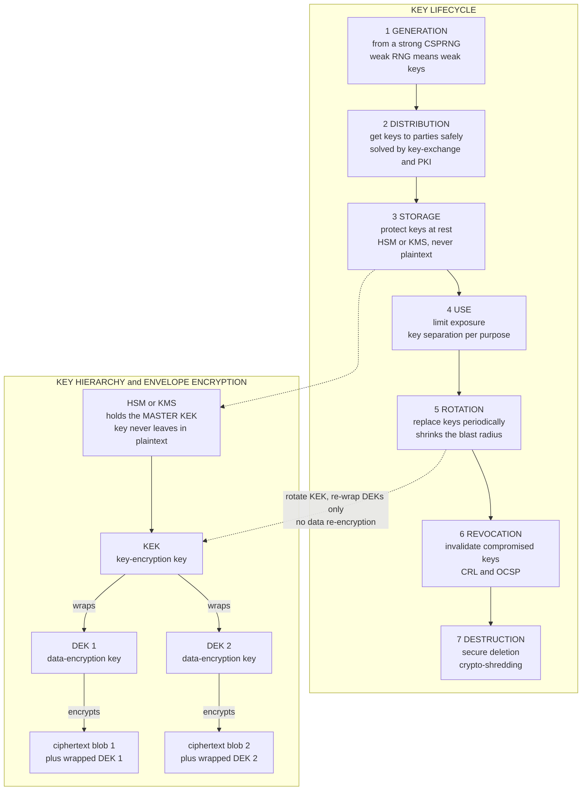

# 🔑 Key Management and Distribution

> [!abstract] TL;DR
> The strongest cipher is useless if the key is mishandled. **Key management** is the operational discipline of the whole **key lifecycle** — *generation, distribution, storage, use, rotation, revocation, destruction* — and it is where real cryptography usually lives or dies. Attackers rarely break AES; they find the key: hardcoded in source, committed to a public repo, never rotated, or sitting in plaintext next to the data it protects. The core toolbox is **KDFs** (HKDF for deriving many purpose-specific keys from one secret; PBKDF2/scrypt/Argon2 for deriving keys from passwords), **key hierarchies + envelope encryption** (a master **KEK** wraps many **DEKs**, so rotating the master only re-wraps small keys instead of re-encrypting terabytes), and **HSMs/KMS** (tamper-resistant hardware where keys are generated and used but never leave in plaintext). Master these and cryptography becomes secure *in practice*, not just on paper.

---

## Intuition

**Analogy:** The strongest deadbolt in the world is worthless if you leave the key under the doormat. You can install a bank-vault door on your house, but if you tape the combination to the door, photocopy the key for every contractor, and never change the lock after the cleaner quits, you are not secure — you just *feel* secure. The lock (the algorithm) was never the weak point. The **key handling** was.

That is almost every real-world crypto breach. The math behind AES-256 has never been broken in production; what gets broken is a key that was hardcoded in a mobile app, pushed to a public GitHub repo, logged in plaintext, shared over Slack, or minted from a predictable random source. **Key management** is the unglamorous plumbing — generate keys from good randomness, get them to the right parties without leaking, keep them locked away while in use, change them on a schedule, kill them when compromised, and shred them when done. It rarely makes the highlight reel, and it is exactly where security is won or lost. *Attackers don't break crypto — they find the keys.*

---

## How It Works

### The central truth: the key is the attack surface

Cryptography (see [[Cryptography_Overview]]) rests on **Kerckhoffs's principle**: the algorithm is public and secure *because* only the key is secret. That single fact relocates the entire security problem onto the key. If the key is guessable, exposed, reused, or immortal, no amount of algorithmic strength saves you. So the practical questions are never "is AES strong?" but "*where did this key come from, who can reach it, and what happens when it leaks?*" Answering those questions across a key's entire life is key management.

### The key lifecycle — seven stages, each with its own failure mode

1. **Generation.** Keys must come from a **cryptographically secure PRNG** (a CSPRNG seeded by real OS entropy — `secrets`, `os.urandom`, `/dev/urandom`). A weak or predictable RNG silently produces weak keys even when everything downstream is perfect. This is the single most upstream dependency; get it wrong and the rest is theatre.
2. **Distribution.** Getting a key to the parties that need it *without an eavesdropper capturing it in transit*. Sharing a symmetric key over an insecure channel is the classic chicken-and-egg problem; it is exactly what **Diffie–Hellman key exchange** and **public-key / PKI** were invented to solve — agree on a fresh secret over a public wire, or encrypt a key to a public key.
3. **Storage.** Protecting keys *at rest*. The rule is simple and constantly violated: **never store a key in plaintext** next to the data it protects. Keys belong in an HSM, a KMS, or an encrypted key vault — never in a config file, environment variable dump, or a `secrets.txt`.
4. **Use.** Limiting exposure while the key is actually working: keep it in memory only as long as needed, restrict which processes can call it, and practice **key separation** — a distinct key for each distinct purpose so one compromise does not cascade.
5. **Rotation.** Periodically replacing keys so a leak has a bounded **blast radius**. A key that has encrypted three years of data is a catastrophic single point of failure; a key rotated every 90 days limits how much any single compromise can expose.
6. **Revocation.** Immediately invalidating a key known or suspected to be compromised — publishing it to a **CRL**, answering **OCSP** queries, or flipping a KMS key to disabled — so systems stop trusting it before rotation would naturally retire it.
7. **Destruction.** Securely deleting keys and their backups when retired. **Crypto-shredding** is the elegant version: to make an entire dataset unrecoverable, just destroy the (small) key that encrypted it, rather than trying to wipe terabytes of ciphertext.

### Key derivation functions (KDFs) — making many keys from one

Rather than generating and storing dozens of independent keys, you derive them deterministically from one high-entropy secret plus a **context/info** label:

- **HKDF** (HMAC-based Extract-then-Expand, RFC 5869) is the standard. *Extract* condenses possibly-non-uniform input key material into a uniform pseudorandom key; *Expand* stretches that into as many output keys as you want, each bound to a distinct `info` string. TLS 1.3 uses exactly this to derive its handshake and traffic keys from the Diffie–Hellman output. The `info` label is what gives **key separation**: `k_enc = HKDF(secret, info="encryption")` and `k_mac = HKDF(secret, info="mac")` are cryptographically independent, so leaking one reveals nothing about the other.
- **Password-based KDFs** — **PBKDF2, scrypt, Argon2** — are a different family for a different job: turning a low-entropy human password into a key. They are deliberately **slow and salted** (and, for scrypt/Argon2, memory-hard) to resist brute-force and hardware-accelerated guessing. Do not confuse the two: HKDF is *fast* because its input is already high-entropy; password KDFs are *slow* because their input is not.

### Key hierarchies and envelope encryption — the pattern that scales

Instead of one key doing everything, real systems build a **hierarchy**. A master **KEK** (Key-Encryption Key) never touches data directly; its only job is to encrypt ("wrap") many **DEKs** (Data-Encryption Keys), and the DEKs encrypt the actual data. This is **envelope encryption**:

- Generate a *fresh random DEK* per object, encrypt the data with it.
- **Wrap** the DEK with the KEK, then store the *wrapped* DEK right alongside the ciphertext. The plaintext DEK is discarded.
- The KEK stays locked in an HSM/KMS and is the only thing that must be truly protected.

The payoff is **rotation without re-encryption**: to rotate the KEK you unwrap each small DEK with the old KEK and re-wrap it with the new one — you never touch the (possibly petabyte-scale) ciphertext. This is precisely how **AWS KMS, GCP KMS, and Azure Key Vault** implement encryption at rest, and it is demonstrated in the Python section below.

### HSMs and KMS — where high-value keys actually live

A **Hardware Security Module** is dedicated, tamper-resistant hardware that generates keys, stores them, and performs cryptographic operations *so that the key material never leaves the device in plaintext*. You send it "wrap this DEK" or "sign this hash" and it returns the result; the KEK stays inside, behind physical and logical tamper protection. **Cloud KMS** (AWS/GCP/Azure) offers this as a managed service; **TPMs** anchor device keys; **secure enclaves** (Intel SGX, Apple Secure Enclave) isolate keys from the host OS; and **hardware wallets** (Ledger, Trezor) apply the same principle to protect cryptocurrency signing keys. This is the gold standard: the key is *used* everywhere but *stored* nowhere reachable.



---

## Key Concepts

### Secondary (intuitive)
- **Key management** = generating, sharing, storing, changing, and destroying keys safely. The algorithm is public; the key is the whole secret, so mishandling it breaks everything.
- **The recurring lesson:** attackers don't break the math — they find a key that was hardcoded, committed to git, logged, or never changed.
- **KDF** = a machine that turns one secret into many keys (or turns a password into a key).
- **Envelope encryption** = lock your data with a small key (DEK), then lock *that key* with a master key (KEK). Store the locked DEK next to the data; keep the master safely away.
- **HSM** = a tamper-proof box that uses keys but never hands them out.

### Undergraduate (formal)
- **Lifecycle stages:** generation (CSPRNG) → distribution (DH / PKI) → storage (HSM/KMS) → use (key separation) → rotation → revocation (CRL/OCSP) → destruction (crypto-shredding). Each stage has a distinct, well-known failure mode.
- **HKDF = Extract-then-Expand.** `PRK = HMAC(salt, IKM)` (extract to a uniform key), then `OKM = HMAC-chain(PRK, info || counter)` (expand). The `info` context yields **key separation**: distinct-purpose keys are computationally independent.
- **Password KDFs (PBKDF2/scrypt/Argon2)** are a separate family: slow, salted, memory-hard, tuned by a work factor to resist offline guessing — see [[Hash_Functions_and_MACs]].
- **KEK vs DEK:** the KEK only wraps keys and lives in an HSM/KMS; DEKs encrypt data and are stored wrapped. Rotating the KEK re-wraps DEKs in O(number of keys), not O(size of data).
- **Ephemeral keys and forward secrecy:** per-session keys that are discarded mean a later compromise of long-term keys cannot decrypt past traffic. This is why TLS uses **ECDHE** and why messengers ratchet keys.

### Graduate (advanced)
- **Key separation as a security reduction.** Deriving `k_1, k_2, ... = HKDF(K, info_i)` and reasoning about each independently relies on HKDF's PRF security: the outputs are indistinguishable from independent random keys, so a break of one context does not degrade another. Reusing one key across contexts voids this and enables cross-protocol attacks.
- **Forward secrecy vs post-compromise security.** Ephemeral DH gives *forward* secrecy (past sessions safe after key leak); the **Signal Double Ratchet** adds *post-compromise* / future secrecy by deriving a fresh per-message key from a symmetric ratchet chained with new DH ratchet steps, so security *heals* after a compromise. The extreme end of the rotation spectrum: rotate on *every message*.
- **Key escrow and recovery tension.** Recoverability (backups, escrow) and security are in direct conflict: any backdoor key for recovery is also a target. The 1990s **Clipper Chip** debate crystallized this. The principled middle ground is **threshold / secret sharing** (Shamir), splitting custody so *k of n* trustees must cooperate — no single point of compromise and no single point of loss. See [[Commitment_Schemes]].
- **Crypto-shredding and right-to-erasure.** Per-record DEKs make GDPR-style deletion tractable: destroy one small key and its record becomes permanently unrecoverable, even in immutable/backup storage where physically wiping ciphertext is impossible.
- **Rotation semantics.** "Rotation" can mean re-wrapping DEKs under a new KEK (cheap, no data change) or actually re-encrypting data under new DEKs (expensive). Understanding which your KMS does — and that re-wrapping does *not* re-protect already-exfiltrated ciphertext — is essential to reasoning about blast radius.

---

## Python Demo

```python
# Key management in ~110 lines of pure stdlib:
#   (a) HKDF (HMAC Extract-then-Expand) derives multiple PURPOSE-SPECIFIC data
#       keys from ONE master key -> KEY SEPARATION.
#   (b) ENVELOPE ENCRYPTION: a random DEK encrypts data; a KEK wraps the DEK;
#       only the WRAPPED dek is stored next to the ciphertext.
#   (c) KEY ROTATION: rotate the KEK and re-wrap the DEK WITHOUT re-encrypting
#       the (arbitrarily large) data -- the whole point of envelope encryption.
# Symmetric encryption here is an HMAC-SHA256 keystream in counter mode (a real
# PRF-based stream cipher), so no external crypto libraries are needed.
import hashlib, hmac, secrets
import matplotlib.pyplot as plt
from matplotlib.patches import Rectangle

HASH, HLEN = hashlib.sha256, 32

# ---------------- HKDF (RFC 5869) ----------------
def hkdf_extract(salt, ikm):
    return hmac.new(salt or bytes(HLEN), ikm, HASH).digest()

def hkdf_expand(prk, info, length):
    okm, t, counter = b"", b"", 1
    while len(okm) < length:
        t = hmac.new(prk, t + info + bytes([counter]), HASH).digest()
        okm += t
        counter += 1
    return okm[:length]

def hkdf(ikm, salt, info, length=32):
    return hkdf_expand(hkdf_extract(salt, ikm), info, length)

# ---------------- HMAC-CTR stream cipher (PRF-based) ----------------
def keystream(key, nonce, n):
    out, ctr = b"", 0
    while len(out) < n:
        out += hmac.new(key, nonce + ctr.to_bytes(8, "big"), HASH).digest()
        ctr += 1
    return out[:n]

def stream_xor(key, nonce, data):
    return bytes(a ^ b for a, b in zip(data, keystream(key, nonce, len(data))))

# ============================================================
# (a) KEY SEPARATION: derive independent keys from one master via HKDF `info`
# ============================================================
master = secrets.token_bytes(32)          # one high-entropy secret
salt   = secrets.token_bytes(16)
k_enc = hkdf(master, salt, b"payments:data-encryption:v1")
k_mac = hkdf(master, salt, b"payments:mac:v1")
k_tok = hkdf(master, salt, b"sessions:token:v1")
print("(a) Key separation from ONE master key:")
print("    k_enc:", k_enc.hex()[:24], "...")
print("    k_mac:", k_mac.hex()[:24], "...")
print("    k_tok:", k_tok.hex()[:24], "...")
print("    all distinct & independent:", len({k_enc, k_mac, k_tok}) == 3)

# ============================================================
# (b) ENVELOPE ENCRYPTION: wrap a random DEK under a KEK; store only the wrap
# ============================================================
def wrap(kek, dek):                        # encrypt-then-MAC the data key
    nonce   = secrets.token_bytes(16)
    wrapped = stream_xor(kek, nonce, dek)
    tag     = hmac.new(kek, nonce + wrapped, HASH).digest()
    return nonce + wrapped + tag

def unwrap(kek, blob):
    nonce, wrapped, tag = blob[:16], blob[16:16 + HLEN], blob[16 + HLEN:]
    if not hmac.compare_digest(tag, hmac.new(kek, nonce + wrapped, HASH).digest()):
        raise ValueError("wrap integrity check failed -- wrong KEK or tampering")
    return stream_xor(kek, nonce, wrapped)

KEK_v1 = secrets.token_bytes(32)           # lives in the "HSM"; never persisted
document = b"customer=alice ssn=123-45-6789 balance=100000.00 " * 20  # ~1 KB

dek       = secrets.token_bytes(32)        # fresh per-object data key
data_nonce = secrets.token_bytes(16)
ciphertext = stream_xor(dek, data_nonce, document)
wrapped_dek = wrap(KEK_v1, dek)            # <-- the ONLY key we store at rest
del dek                                    # plaintext DEK discarded from memory
print("\n(b) Envelope encryption:")
print("    stored ciphertext bytes :", len(ciphertext))
print("    stored WRAPPED dek bytes:", len(wrapped_dek), "(plaintext DEK gone)")

# ============================================================
# (c) KEY ROTATION without re-encrypting the data
# ============================================================
KEK_v2 = secrets.token_bytes(32)           # new master key
dek_tmp     = unwrap(KEK_v1, wrapped_dek)  # recover DEK with OLD KEK
wrapped_dek_v2 = wrap(KEK_v2, dek_tmp)     # re-wrap under NEW KEK
del dek_tmp
# ciphertext was NEVER touched; decryption still works via the new wrap:
recovered = stream_xor(unwrap(KEK_v2, wrapped_dek_v2), data_nonce, ciphertext)
print("\n(c) KEK rotation v1 -> v2:")
print("    data re-encrypted?      :", "NO -- only the 80-byte DEK was re-wrapped")
print("    decrypt after rotation  :", recovered == document)

# ============================================================
# VISUALIZE: key hierarchy + rotation-without-reencrypt cost
# ============================================================
fig, (axL, axR) = plt.subplots(1, 2, figsize=(15, 6))

def box(ax, x, y, w, h, text, color):
    ax.add_patch(Rectangle((x - w / 2, y - h / 2), w, h, fc=color, ec="black", lw=1.4))
    ax.text(x, y, text, ha="center", va="center", fontsize=8.5)

axL.set_title("Key hierarchy: one KEK wraps many DEKs (envelope encryption)")
axL.axis("off"); axL.set_xlim(0, 1); axL.set_ylim(0, 1)
box(axL, 0.5, 0.88, 0.42, 0.13, "HSM / KMS\nMASTER KEK\n(never leaves in plaintext)", "#f39c12")
for i, x in enumerate([0.2, 0.5, 0.8]):
    box(axL, x, 0.55, 0.24, 0.12, f"DEK {i+1}\n(stored WRAPPED\nby the KEK)", "#3498db")
    axL.plot([0.5, x], [0.82, 0.61], "k-", lw=1.2)
    box(axL, x, 0.20, 0.24, 0.12, "encrypted\ndata blob", "#2ecc71")
    axL.plot([x, x], [0.49, 0.26], "k-", lw=1.2)
axL.text(0.5, 0.02, "Rotate the KEK -> re-wrap the 3 small DEKs. Data blobs untouched.",
         ha="center", fontsize=9, style="italic")

sizes_gb = [1, 10, 100, 1000, 10000]
naive_bytes = [g * 1e9 for g in sizes_gb]              # re-encrypt ALL data
envelope_bytes = [3 * 80 for _ in sizes_gb]            # re-wrap 3 tiny DEKs (~80 B each)
axR.plot(sizes_gb, naive_bytes, "o-", color="#e74c3c",
         label="naive: re-encrypt all data (O(data size))")
axR.plot(sizes_gb, envelope_bytes, "s-", color="#2ecc71",
         label="envelope: re-wrap DEKs only (O(number of keys))")
axR.set_xscale("log"); axR.set_yscale("log")
axR.set_xlabel("data protected (GB, log scale)")
axR.set_ylabel("bytes that must be re-encrypted on KEK rotation (log)")
axR.set_title("Why envelope encryption makes rotation cheap")
axR.legend(); axR.grid(True, which="both", ls=":", alpha=0.5)

plt.tight_layout(); plt.show()

# Takeaways:
#  * (a) one master + HKDF `info` -> many INDEPENDENT keys (key separation).
#  * (b) only the WRAPPED dek is stored; the KEK stays in the HSM/KMS.
#  * (c) rotating the KEK re-wraps an 80-byte key -- the terabytes of ciphertext
#        are never rewritten. The right chart shows the cost gap growing without bound.
```

Running it prints three independent derived keys from one master (key separation), shows that only the wrapped 80-byte DEK is stored at rest, confirms decryption still succeeds after rotating the KEK without touching the ciphertext, and plots (left) the KEK→DEK→data hierarchy and (right) the log-scale cost of KEK rotation: flat for envelope encryption versus linear-in-data-size for naive re-encryption.

---

## Real-World Applications

> **Example — AWS KMS envelope encryption for data at rest.** When you enable encryption on S3, EBS, RDS, or DynamoDB, AWS does *exactly* the demo above. A **Customer Master Key** (the KEK) lives inside a FIPS-validated **HSM** and never leaves it in plaintext. For each object, the service asks KMS to `GenerateDataKey`, which returns a random **DEK** in two forms: plaintext (used once to encrypt the object, then wiped from memory) and **wrapped** (encrypted under the CMK, stored next to the ciphertext). To read the data, the service sends the wrapped DEK back to KMS to unwrap. **Rotating the CMK** re-wraps DEKs — petabytes of S3 objects are never rewritten. It is the canonical production key hierarchy.

- **TLS 1.3 session keys** — the handshake's Diffie–Hellman shared secret is fed through **HKDF** to derive separate handshake, application-traffic, and exporter keys. Ephemeral DH (ECDHE) gives **forward secrecy**: recording today's traffic is useless even if the server's long-term key leaks tomorrow — see [[TLS_Protocol_Deep_Dive]] and [[Asymmetric_Cryptography_and_PKI]].
- **Secret management platforms** — [[HashiCorp_Vault]] generates, stores, leases, and rotates secrets behind a barrier encrypted by a master key that is itself unsealed via Shamir secret sharing; [[Secret_Management_Fundamentals]], [[Kubernetes_Secrets]], and [[SOPS_and_Git_Secret_Management]] cover the surrounding devops workflow, and [[AWS_Azure_Secret_Services]] the managed variants.
- **Signal / WhatsApp messaging** — the **Double Ratchet** rotates keys on *every message*, so compromising one message key exposes essentially nothing else; the extreme end of the rotation spectrum, built on ephemeral DH.
- **Hardware wallets** — [[Crypto_Wallets]] (Ledger, Trezor) keep the private signing key inside a secure element; transactions are signed on-device and the key never leaves — an HSM in your pocket.
- **Certificate and key rotation automation** — [[Certificate_Management_and_PKI]] and [[SSL_TLS_Certificates]] describe short-lived certs (ACME/Let's Encrypt) and automated renewal so keys are rotated continuously rather than left to expire in a crisis.

---

## Common Pitfalls

- **Hardcoded / embedded keys** — a key baked into source, a mobile binary, or a container image is trivially extracted by string-scanning or reverse engineering. Keys must be injected at runtime from a vault or KMS, never compiled in.
- **Secrets committed to git** — the classic disaster. Once an API key or private key hits a repo (even briefly, even in a deleted commit) it lives in history forever and is harvested within minutes by automated scanners. Treat any committed secret as compromised and **rotate immediately** — deletion is not enough.
- **Never rotating** — a key that has protected years of data is an unbounded blast radius. Without rotation, a single quiet compromise exposes *everything* the key ever touched. Automate rotation; do not rely on humans remembering.
- **Storing keys in plaintext next to the data** — an attacker who reaches the database or backup then has both the ciphertext and the key. Keys belong in a separate, access-controlled store (HSM/KMS), never in the same blast radius as the data.
- **Reusing one key across contexts** — the same key for encryption and MACs, or across dev/staging/prod, means one leak compromises all of it and can enable cross-protocol attacks. Use **key separation** via HKDF `info` labels.
- **Weak key generation** — deriving keys from `random.random()`, timestamps, or a low-entropy seed produces guessable keys regardless of algorithm strength. Always use a CSPRNG (`secrets`, `os.urandom`).
- **Confusing HKDF with a password KDF** — running a *password* through fast HKDF (instead of slow, memory-hard Argon2/scrypt/PBKDF2) leaves it wide open to offline brute force. Match the KDF family to the input's entropy.
- **Rotation theatre** — assuming that re-wrapping a DEK "re-secures" data that was already exfiltrated. Rotation limits *future* exposure; data an attacker already copied stays readable with the DEK they already have.

---

## Related Concepts

- [[Cryptography_Overview]] — Kerckhoffs's principle establishes *why* the key is the entire secret, making key management the decisive discipline.
- [[Hash_Functions_and_MACs]] — HMAC is the engine inside HKDF, and hashes/MACs underpin both wrapping integrity and password KDFs.
- [[Asymmetric_Cryptography_and_PKI]] — public-key crypto and PKI solve the *distribution* stage of the lifecycle (getting keys to parties safely).
- [[TLS_Protocol_Deep_Dive]] — a live case study: HKDF-derived session keys and ephemeral-DH forward secrecy in production.
- [[Symmetric_Encryption]] — the applied companion covering AES, modes, and the DEKs that envelope encryption wraps.
- [[Block_Ciphers_and_AES]] — the block cipher that real DEKs and KEKs are typically instantiated with.
- [[Stream_Ciphers_and_PRGs]] — CSPRNGs are the source of good key generation; a weak PRG means weak keys.
- [[Secret_Management_Fundamentals]] — the devops discipline of storing, leasing, and rotating application secrets.
- [[HashiCorp_Vault]] — a production secrets engine implementing sealed storage, dynamic secrets, and rotation.
- [[Kubernetes_Secrets]] — how key material is (and is not) protected inside a cluster.
- [[SOPS_and_Git_Secret_Management]] — encrypting secrets so they *can* live in git safely, wrapped under a KMS key.
- [[Certificate_Management_and_PKI]] — certificate/key issuance, rotation, and revocation (CRL/OCSP) in practice.
- [[Crypto_Wallets]] — hardware wallets as consumer HSMs protecting high-value signing keys.
- [[Commitment_Schemes]] — the cryptographic building block behind secret sharing for splitting key custody.
- [[PAM_and_Privileged_Access]] — controlling who can reach keys and privileged credentials at all.
- [[DLP_and_Data_Protection]] — encryption-at-rest and crypto-shredding as data-protection controls.

*(Sibling Cryptography notes `Key_Exchange_and_PKI`, `Random_Number_Generation`, `Password_Hashing_and_KDFs`, `Diffie_Hellman_and_Discrete_Log`, `Secure_Messaging_and_Signal_Protocol`, `Commitment_Schemes_and_Secret_Sharing`, and `Cryptographic_Failures_and_Misuse` are planned for this vault and referenced in prose above until they exist.)*

---

## Review Questions

1. **Conceptual:** Explain why "attackers don't break crypto, they find the keys" is usually true. Walk the seven lifecycle stages and name one realistic failure mode at each stage that would compromise a system whose *algorithm* is perfectly strong.
2. **Scenario:** Your service stores 500 TB of encrypted customer files and your security team mandates KEK rotation every 90 days. With a flat key model (one key encrypts everything) versus envelope encryption (per-file DEKs wrapped by a KEK), what work does each rotation require, and roughly how much data must be rewritten in each design? Explain precisely why envelope encryption makes the mandate feasible.
3. **Trade-off:** You must let the company recover encrypted data if an employee leaves, but any recovery mechanism is itself a target. Compare (a) a single escrow/backup key, (b) no recovery at all, and (c) Shamir *k-of-n* secret sharing for custody. Discuss the recoverability-versus-exposure tension and why the Clipper Chip debate is the historical caution here.

---

## Sources

- [Krawczyk & Eronen, "HKDF: HMAC-based Extract-and-Expand Key Derivation Function," RFC 5869 (2010)](https://datatracker.ietf.org/doc/html/rfc5869)
- [Barker, "Recommendation for Key Management, Part 1: General," NIST SP 800-57 (Rev. 5, 2020)](https://csrc.nist.gov/publications/detail/sp/800-57-part-1/rev-5/final)
- [AWS, "AWS Key Management Service — Envelope Encryption and Cryptographic Details"](https://docs.aws.amazon.com/kms/latest/developerguide/concepts.html#enveloping)
- [OWASP, "Cryptographic Storage Cheat Sheet — Key Management"](https://cheatsheetseries.owasp.org/cheatsheets/Cryptographic_Storage_Cheat_Sheet.html)
- [Katz & Lindell, *Introduction to Modern Cryptography* (3rd ed., 2020) — Ch. on key management and KDFs](https://www.cs.umd.edu/~jkatz/imc.html)

---

#cryptography #key-management #kdf #envelope-encryption #hsm
