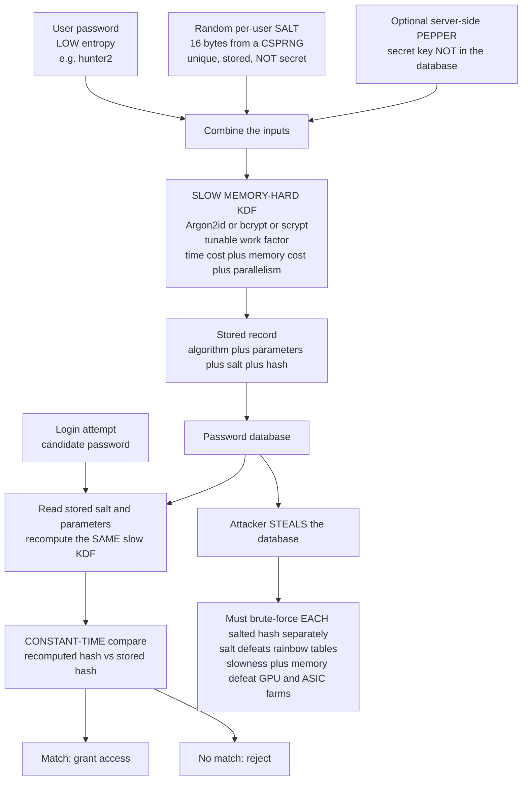

# 🔐 Password Hashing and Key Derivation Functions

> [!abstract] TL;DR
> A service must **verify** a user's password at login without ever storing it in a form a database thief could reuse. The answer is to store a **one-way transformation** and recompute it at login — but doing this **naively with a fast hash (SHA-256, MD5) is catastrophic**: attackers with a stolen database run **billions of guesses per second** on GPUs, identical passwords produce identical hashes (leaking reuse), and **precomputed rainbow tables** crack common passwords instantly. The fix has three parts. **(1) Salt:** prepend a unique random value per user so precomputation is worthless and duplicate passwords hash differently — the salt is stored beside the hash, not secret, just unique. **(2) Key stretching:** run a **deliberately slow** password KDF with a tunable **work/cost factor** so each guess costs the attacker real time, while the defender pays it once per login. **(3) Memory-hardness:** because GPUs and ASICs parallelize pure iteration cheaply, modern KDFs (**scrypt, Argon2**) also demand large **memory** per guess, which specialized hardware cannot replicate cheaply. The algorithm ladder is **PBKDF2** (old, iteration-only, GPU-crackable, but FIPS-approved) → **bcrypt** (Blowfish-based, battle-tested default) → **scrypt** (memory-hard) → **Argon2id** (winner of the 2015 Password Hashing Competition — the current recommended choice). Do **not** confuse these with **general KDFs like HKDF**, which derive keys from *high-entropy* secrets and are intentionally *fast*; using HKDF on a password is crackable, and using Argon2 to expand a Diffie-Hellman secret is pointless. Salted + slow + memory-hard is what turns a stolen password database from an instant disaster into an expensive, mostly-futile cracking project.

---

## Intuition

**Analogy — a bouncer's guest list you must check but never want stolen.** A club keeps a guest list so the bouncer can verify who is allowed in. But if a thief steals the list, everyone's name is exposed. So instead of writing down each guest's *actual* name, the bouncer writes down a **scrambled fingerprint** of it — enough to check a person against the list, but useless to a thief who wants the real names back. This is exactly how passwords should be stored: not the passwords themselves, but **one-way scrambled fingerprints** you can recompute and compare at login.

Now the twist that makes this genuinely hard. Suppose the bouncer uses a *fast, obvious* scramble — reverse the letters, say. A thief who steals the list can un-scramble every entry in seconds, and worse, can prepare a giant lookup book of "scramble → real name" in advance and read every entry off instantly. A plain fast cryptographic hash (SHA-256) is that fast, obvious scramble: an attacker with the stolen fingerprints tests **billions of candidate passwords per second** on a graphics card, and a **precomputed rainbow table** cracks common passwords with a single lookup. Two more disasters: because the scramble is deterministic, **two guests with the same name get the same fingerprint** — the thief instantly sees who reused a password. And nothing costs the attacker anything per guess.

The cure is to make the fingerprinting **deliberately slow and unique per person**. Give every guest a random "spice" (a **salt**) mixed into their name before scrambling, so identical names get different fingerprints and no precomputed book can ever match. Then make the scramble itself **artificially expensive** — a **slow key-stretching KDF** with a dial you can turn up — so testing one guess takes a measurable fraction of a second instead of a nanosecond. The bouncer pays this cost once, when a real guest arrives. The thief pays it **for every one of the billions of guesses** they must make. Modern KDFs add a final twist — **memory-hardness** — that forces each guess to occupy a big chunk of RAM, defeating the attacker's cheap parallel hardware. That is the entire game: *store fingerprints, not passwords; spice each one uniquely; and make each fingerprint slow and memory-hungry to compute.*

---

## How It Works

### The problem, stated precisely

A login system must answer one yes/no question — "does this candidate password match the one this user registered?" — while assuming the **password database will eventually be stolen** (breach it must survive, not breach it must prevent). So it stores a value `v = F(password)` where `F` is one-way, and at login recomputes `F(candidate)` and checks equality. The security of the whole scheme reduces to a single question: **given the stored values, how expensive is it for an attacker to recover the original passwords?** Everything below is about making that expense as high as possible per guess.

### Why plain fast hashes fail — three separate disasters

Storing `SHA256(password)` (or worse, `MD5`) fails on three independent counts, and each has been exploited in real breaches:

1. **Fast is the wrong property.** [[Hash_Functions]] are *engineered to be fast* — hashing gigabytes must be cheap for integrity and signatures. That is exactly backwards for passwords. A modern GPU computes **billions of SHA-256 hashes per second**; a leaked database of fast hashes is an offline brute-force / dictionary buffet.
2. **Determinism leaks reuse.** `SHA256("hunter2")` is always the same value, so any two users with the same password get **identical stored hashes**. The attacker learns password reuse for free and cracks many accounts for the price of one.
3. **Precomputation crushes common passwords.** An attacker can build a **rainbow table** (a space-optimized precomputed map from hash back to password) *once*, then crack every matching hash in any future breach with a lookup — no per-database work at all.

### Defense 1 — Salting (defeats precomputation, hides reuse)

Generate a **unique random salt** per password (16 bytes from a cryptographically secure RNG — see the forthcoming `Random_Number_Generation`) and hash `salt || password`. Store the salt **alongside** the hash. The salt is **not secret** — it is merely **unique**. Two effects:

- **Rainbow tables become worthless.** A precomputed table is tied to a specific salt; with a random 16-byte salt per user, the attacker would need a separate table for each user, which defeats the entire point of precomputation.
- **Reuse is hidden.** The same password under two different salts produces two different stored hashes, so identical passwords are no longer visible.

Salting is **necessary but not sufficient**: it forces the attacker to attack each password *separately*, but if the underlying hash is still fast, brute-forcing one salted password is still billions of guesses per second.

### Defense 2 — Key stretching (defeats brute force)

Replace the single fast hash with a **password KDF** that is **deliberately slow**, controlled by a tunable **work factor** (a.k.a. cost factor / iteration count). Conceptually it applies the underlying primitive thousands or millions of times, or runs a purpose-built slow function, so that computing one hash takes a chosen amount of time — say 100–250 ms. The asymmetry is the whole point:

> The **defender** pays the cost **once per login**. The **attacker** pays it **per guess** — billions of times. Turning the work factor up multiplies the attacker's cost while barely inconveniencing the defender.

Because hardware gets faster every year, the work factor is a **dial you raise over time** to keep per-guess cost roughly constant against improving attackers. This is why the parameters are stored *with* each hash — you can re-derive at a higher cost on the user's next login.

### Defense 3 — Memory-hardness (defeats GPUs, ASICs, FPGAs)

Pure iteration-count slowness (PBKDF2) has a weakness: **GPUs, FPGAs, and ASICs parallelize simple arithmetic astonishingly cheaply**, so an attacker rents thousands of parallel cores and shrugs off a high iteration count. The modern countermeasure is **memory-hardness**: force each guess to allocate and randomly access a **large block of memory** (megabytes to gigabytes). Memory is expensive and hard to parallelize on specialized silicon — a chip with 10,000 cores cannot give each core its own gigabyte cheaply. **scrypt** (2009) introduced sequential memory-hardness for passwords; **Argon2** (2015) refined it with independently tunable **memory cost, time cost, and parallelism**. Memory-hardness is the single biggest advance separating modern password KDFs from PBKDF2.

### The algorithm ladder

| Algorithm | Year | Memory-hard | Notes |
|-----------|------|-------------|-------|
| **PBKDF2** | 2000 | **No** | Iteration-based over HMAC; GPU-crackable but simple and **FIPS-approved**; still common where compliance demands it. Use high iteration counts. |
| **bcrypt** | 1999 | Weakly (4 KB) | Blowfish-based, adaptive cost factor, **battle-tested**; a solid safe default. Caps password length at 72 bytes. |
| **scrypt** | 2009 | **Yes** (tunable) | First mainstream memory-hard KDF; used in some cryptocurrencies (Litecoin) and disk encryption. |
| **Argon2id** | 2015 | **Yes** (tunable) | Winner of the **Password Hashing Competition**; tunable memory/time/parallelism; `id` variant blends data-independent and data-dependent access to resist both side-channel and time-memory attacks. **Current recommended default.** |

### Password KDFs vs general KDFs — do not confuse them

This distinction trips up even experienced engineers:

- **General KDFs (e.g. HKDF).** Derive keys from a **high-entropy** secret such as a Diffie-Hellman shared secret or a random master key. They are **fast on purpose** — the input already has enough entropy that brute force is infeasible, so slowness would only waste cycles. HKDF follows an *extract-then-expand* design. See [[Key_Management_and_Distribution]].
- **Password-based KDFs (Argon2, bcrypt, scrypt, PBKDF2).** Derive keys/verifiers from a **low-entropy** password. They are **slow and salted on purpose**, because the input is guessable and the only defense is per-guess cost.

Using the wrong one is a real vulnerability: **HKDF on a password** produces a fast, crackable value, and **Argon2 on a 256-bit DH secret** is a pointless expense. Match the KDF class to the entropy of the input.

### Pepper and defense in depth

A **pepper** is a *secret* value (a server-side key kept **out of the database**, e.g. in an HSM or app config) mixed in before or after hashing. If only the database leaks, the attacker still lacks the pepper. It is **defense in depth**, not a substitute for salting. Beyond the hash itself, real systems layer on **rate limiting**, **account lockout**, **breach detection** (e.g. checking against HaveIBeenPwned), and **MFA** ([[Multi_Factor_Authentication]]) so a cracked hash alone does not equal account takeover.

### Flow / Architecture



---

## Key Concepts

### Secondary (intuitive, no CS background needed)

- **Never store the password.** Store a scrambled, one-way fingerprint you can recompute at login and compare.
- **A fast, obvious scramble is a disaster.** Attackers who steal it guess billions of passwords per second and keep pre-made lookup books (rainbow tables).
- **Salt = a unique random spice per person.** It makes identical passwords look different and makes pre-made lookup books useless.
- **Slow on purpose.** Make each fingerprint deliberately slow to compute so an attacker's billions of guesses cost real time and money; you only pay it once at login.
- **Use the right tool.** Argon2, bcrypt, or scrypt — never plain MD5 or SHA-256 — for storing passwords.

### Undergraduate (a first security course)

- **Why fast hashes fail, threefold.** Speed enables brute force; determinism leaks reuse; precomputation (rainbow tables) crushes common passwords.
- **Salt properties.** Random, unique per password, stored beside the hash, **not secret**. Defeats precomputation and hides duplicates; necessary but not sufficient.
- **Key stretching / work factor.** A tunable cost that raises per-guess expense; the defender pays once per login, the attacker per guess. Raise it over time as hardware improves.
- **Memory-hardness.** GPUs/ASICs parallelize computation cheaply, so pure iteration count (PBKDF2) is insufficient; requiring large memory per guess levels the field (scrypt, Argon2).
- **Algorithm choice.** PBKDF2 (old, FIPS, GPU-weak) → bcrypt (safe default) → scrypt (memory-hard) → **Argon2id** (recommended).
- **Constant-time comparison.** Compare the recomputed hash to the stored one in constant time to avoid a timing side channel; use a library helper, not `==`.
- **Password KDF vs general KDF.** Slow+salted for low-entropy passwords (Argon2) vs fast for high-entropy secrets (HKDF). Do not swap them.

### Graduate (advanced / applied cryptography)

- **Formal memory-hardness.** scrypt is *sequentially* memory-hard (its ROMix/BlockMix forces a large sequential working set). Argon2 exposes **memory cost `m`, time cost `t`, and parallelism `p`** with a provable space-time lower bound; **Argon2d** uses data-*dependent* memory access (best GPU resistance, but a cache-timing side channel), **Argon2i** data-*independent* (side-channel resistant, weaker vs TMTO), and **Argon2id** hybrids them — the recommended variant per RFC 9106.
- **Time-memory trade-off (TMTO) attacks.** An attacker can trade computation for reduced memory; memory-hard designs are analyzed by how sharply cost degrades under TMTO, which is precisely what Argon2's design targets. Balloon hashing offers provable memory-hardness with a data-independent pattern.
- **Attacker economics.** The real metric is *dollars per cracked password* — amortized ASIC/FPGA cost, energy, and memory bandwidth. Memory-hardness raises the silicon area and DRAM bandwidth per guess, which is what makes it expensive to parallelize; iteration count alone does not.
- **Parameter selection.** Tune so a single hash costs ~0.25–1 s or a target memory (e.g. Argon2id `m` = 64 MiB, `t` = 3, `p` = 1 per OWASP/RFC 9106 baselines), balanced against your login-QPS and DoS surface (an attacker can flood expensive logins).
- **HKDF internals for contrast.** HKDF's *extract* (`HMAC(salt, IKM)` to condense entropy) then *expand* (`HMAC`-based output stretching) is fast because the input material is already high-entropy — structurally the opposite design goal from a password KDF. See [[Hash_Functions_and_MACs]] and [[Key_Management_and_Distribution]].
- **Entropy is the ceiling.** No KDF rescues a truly weak password: if the password is in the top-1000 list, even Argon2 falls to a short dictionary. Password strength (see [[Probability_and_Information_Theoretic_Security]] for entropy) plus slow hashing plus MFA together set the real security. NIST SP 800-63B accordingly favors long passphrases and breached-password screening over forced complexity rules.

---

## Python Demo

```python
# PASSWORD STORAGE, DONE WRONG THEN RIGHT -- measured, not asserted.
#
#   (a) PLAIN SHA-256 is BROKEN: identical passwords -> identical hashes (reuse
#       leaks), and a fast dictionary/rainbow attack cracks them near-instantly.
#   (b) SALT (unique random per user): duplicate passwords now hash differently
#       and a PRECOMPUTED (rainbow) table becomes worthless.
#   (c) SLOW KDF (PBKDF2): raising the WORK FACTOR collapses the attacker's
#       guesses/sec while the defender pays it once per login. scrypt adds
#       MEMORY-HARDNESS that GPUs/ASICs cannot parallelize cheaply.
#
# Pure standard library + hashlib for all crypto; matplotlib only to draw it.

import hashlib
import os
import time
from collections import Counter
import matplotlib.pyplot as plt

# ---------------------------------------------------------------------------
# (a) PLAIN FAST HASH IS BROKEN
# ---------------------------------------------------------------------------
def sha256_hex(data: bytes) -> str:
    return hashlib.sha256(data).hexdigest()

# A tiny "leaked" user table; note the deliberate password REUSE.
users = {
    "alice": "sunshine",
    "bob":   "hunter2",
    "carol": "sunshine",    # reuses alice's password
    "dave":  "password1",
    "erin":  "hunter2",     # reuses bob's password
}

print("=== (a) PLAIN SHA-256: identical passwords -> identical hashes ===")
plain = {u: sha256_hex(p.encode()) for u, p in users.items()}
for u, h in plain.items():
    print(f"  {u:6s} {h[:24]}...")
shared = [h for h, c in Counter(plain.values()).items() if c > 1]
print(f"  -> {len(shared)} hash value(s) shared by >1 user: password REUSE leaks.")

# Raw guessing throughput of a fast hash on ONE core (attacker uses many GPUs).
N = 200_000
t0 = time.perf_counter()
for i in range(N):
    sha256_hex(str(i).encode())
fast_rate = N / (time.perf_counter() - t0)
print(f"  Fast SHA-256: ~{fast_rate:,.0f} guesses/sec on ONE CPU core "
      f"(a GPU does billions).")

# A precomputed "rainbow" table: hash -> password for a small attacker wordlist.
wordlist = ["123456", "password", "hunter2", "sunshine",
            "password1", "qwerty", "letmein", "dragon"]
rainbow = {sha256_hex(w.encode()): w for w in wordlist}
plain_cracked = sum(1 for h in plain.values() if h in rainbow)
print(f"  Precomputed table cracks {plain_cracked}/{len(users)} UNSALTED hashes "
      f"INSTANTLY.\n")

# ---------------------------------------------------------------------------
# (b) SALT: unique random salt per user
# ---------------------------------------------------------------------------
def salted_sha256(password: str, salt: bytes) -> str:
    return hashlib.sha256(salt + password.encode()).hexdigest()

print("=== (b) SALTED: same password -> DIFFERENT stored hash ===")
salts  = {u: os.urandom(16) for u in users}
salted = {u: salted_sha256(users[u], salts[u]) for u in users}
for u, h in salted.items():
    print(f"  {u:6s} salt={salts[u].hex()[:12]}...  hash={h[:20]}...")
shared2 = [h for h, c in Counter(salted.values()).items() if c > 1]
salted_cracked = sum(1 for h in salted.values() if h in rainbow)
print(f"  -> shared hashes now: {len(shared2)} (reuse HIDDEN)")
print(f"  Precomputed table cracks {salted_cracked}/{len(users)} SALTED hashes "
      f"(table is worthless per-salt).\n")

# ---------------------------------------------------------------------------
# (c) SLOW KDF: tune the work factor, watch the attacker's rate collapse
# ---------------------------------------------------------------------------
def pbkdf2(password: str, salt: bytes, iters: int) -> bytes:
    return hashlib.pbkdf2_hmac("sha256", password.encode(), salt, iters)

print("=== (c) KEY STRETCHING: raising PBKDF2 iterations multiplies cost ===")
work_factors = [1_000, 5_000, 10_000, 50_000, 100_000, 300_000, 600_000]
salt = os.urandom(16)
rates = []
for iters in work_factors:
    REP = 20
    t0 = time.perf_counter()
    for _ in range(REP):
        pbkdf2("hunter2", salt, iters)
    per_hash = (time.perf_counter() - t0) / REP
    rate = 1.0 / per_hash                 # guesses/sec an attacker can manage
    rates.append(rate)
    print(f"  iters={iters:>7,}: {per_hash*1000:7.2f} ms/hash "
          f"-> attacker ~{rate:>10,.0f} guesses/sec")

print(f"\n  Plain SHA-256 baseline: ~{fast_rate:,.0f} guesses/sec.")

# Memory-hardness: scrypt's cost is CPU *and* RAM, defeating cheap parallelism.
t0 = time.perf_counter()
hashlib.scrypt(b"hunter2", salt=salt, n=2**14, r=8, p=1, dklen=32)  # ~16 MB/guess
print(f"  scrypt n=2^14 needs ~16 MB PER GUESS: {(time.perf_counter()-t0)*1000:.1f} "
      f"ms -- memory a GPU/ASIC cannot cheaply replicate across thousands of cores.\n")

# ---------------------------------------------------------------------------
# VISUALIZE
# ---------------------------------------------------------------------------
fig, ax = plt.subplots(1, 2, figsize=(15, 5.6))

# left: precomputed-table cracks, unsalted vs salted
bars = ax[0].bar(["unsalted", "salted"], [plain_cracked, salted_cracked],
                 color=["crimson", "seagreen"], edgecolor="black")
ax[0].set_ylabel("passwords cracked by a PRECOMPUTED table")
ax[0].set_ylim(0, len(users) + 0.5)
ax[0].set_title("(b) A per-user random SALT defeats rainbow tables\n"
                "and hides password reuse")
for rect, v in zip(bars, [plain_cracked, salted_cracked]):
    ax[0].text(rect.get_x() + rect.get_width() / 2, v + 0.08, str(v),
               ha="center", fontweight="bold")

# right: attacker crack-rate collapses as the work factor rises
ax[1].semilogy(work_factors, rates, "o-", color="darkorange", lw=2,
               label="PBKDF2 attacker guesses/sec")
ax[1].axhline(fast_rate, color="crimson", ls="--", lw=2,
              label="plain SHA-256 baseline")
ax[1].set_xlabel("work factor (PBKDF2 iterations)")
ax[1].set_ylabel("attacker guesses/sec (log scale)")
ax[1].set_title("(c) Key stretching: raising the work factor\n"
                "collapses the attacker's throughput")
ax[1].legend()
ax[1].grid(True, which="both", alpha=0.3)

plt.tight_layout()
plt.show()

print("Takeaway: salting flips the LEFT bars from 'all cracked' to 'none cracked',")
print("and every step up the work factor drags the ORANGE attacker-rate line far")
print("below the RED fast-hash baseline. Salted + slow + memory-hard is the win.")
```

**What the demo shows.** Part (a): plain SHA-256 hashes reveal that `alice`/`carol` and `bob`/`erin` share identical stored values — password reuse leaks — and a tiny precomputed table cracks *every* common password instantly, at a fast-hash throughput that a real GPU multiplies into billions per second. Part (b): giving each user a unique random salt makes those duplicate passwords hash to different values and drops the precomputed table's success rate to **zero** — the table would have to be rebuilt per salt, which is the whole point of salting. Part (c): switching to a slow KDF and turning up the PBKDF2 iteration count drives the attacker's achievable guesses-per-second down by orders of magnitude (the orange line plunges below the red fast-hash baseline), while the defender pays that cost only once per login; the scrypt call then shows the extra lever — **memory per guess** — that neutralizes cheap GPU/ASIC parallelism. Salted + slow + memory-hard is the measured difference between an instant breach and an expensive, mostly-futile cracking effort.

---

## Real-World Applications

> **Example — how a modern login stores your password (Argon2id).** When you register on a well-built service, the server generates a fresh 16-byte random salt, runs **Argon2id** with tuned parameters (e.g. 64 MiB memory, 3 iterations, 1 lane), and stores a single self-describing string like `$argon2id$v=19$m=65536,t=3,p=1$<salt>$<hash>`. That one field carries the **algorithm, parameters, salt, and hash** together, so at login the server reads the parameters back, recomputes Argon2id over your candidate password, and does a **constant-time compare**. If you set parameters higher on your next login (hardware improved), it silently re-hashes and upgrades you. A thief who steals this table gets no reuse signal, no rainbow-table shortcut, and faces ~64 MiB of memory plus real CPU time *per guess* — the difference between cracking millions of accounts overnight and cracking almost none.

- **Password managers.** 1Password, Bitwarden, and KeePass derive the vault's encryption key from your master passphrase via a **slow password KDF** (PBKDF2 with high iterations, or Argon2id). The KDF *is* the security boundary: it is what stops an attacker who steals the encrypted vault from brute-forcing the master password. See [[Authentication_Protocols]].
- **Full-disk / file encryption.** LUKS, FileVault, VeraCrypt, and BitLocker turn a low-entropy passphrase into a high-entropy encryption key through a slow, salted KDF (Argon2/PBKDF2/scrypt), so an offline attacker with the encrypted disk cannot cheaply brute-force the passphrase.
- **Cryptocurrency wallets and mining.** BIP-39 seed phrases are stretched with **PBKDF2** (2048 rounds) into a wallet seed; some coins (Litecoin, Dogecoin) chose **scrypt** as their proof-of-work precisely for its memory-hardness against ASICs. See [[Key_Management_and_Distribution]].
- **Web application auth.** Every framework's auth layer (Django's `PBKDF2`/`Argon2` hashers, Rails' `bcrypt`, Spring Security, ASP.NET Identity) stores passwords with a salted slow KDF by default. Misconfiguring this is a classic **OWASP** finding — see [[OWASP_Top_10]] and the credential-storage guidance behind [[Database_Security]].
- **Token and session issuance.** After a password login, systems issue signed tokens ([[JWT_and_OAuth]]) so the expensive KDF runs once, not on every request — the login pays the slow cost, subsequent requests verify a fast signature.

---

## Common Pitfalls

- **Storing a bare fast hash (`MD5`, `SHA-1`, `SHA256(password)`).** The original sin. Fast + unsalted = instant rainbow-table and GPU cracking. This is exactly the mistake behind the **LinkedIn 2012** breach (unsalted SHA-1; millions cracked within days). Use Argon2id/bcrypt/scrypt with a salt. See the forthcoming `Cryptographic_Failures_and_Misuse`.
- **Salting but keeping the hash fast.** A salt without key stretching still leaves each password brute-forceable at billions/sec; salt defeats *precomputation*, not *brute force*. You need both.
- **A shared or static salt.** Reusing one salt for all users (or a constant "salt") re-enables a single rainbow table and re-exposes reuse. Salts must be **random and per-password**.
- **Encrypting instead of hashing passwords.** Encryption is *reversible* — if the key leaks (and it usually leaks with the database), every password is instantly recovered. **Adobe 2013** encrypted passwords with ECB and stored plaintext hints; ~150 million credentials were effectively cracked. Password storage must be one-way, not encrypted.
- **Using a general KDF on a password.** Running **HKDF** or a raw single HMAC on a password (because it "derives a key") skips the deliberate slowness — the result is fast and crackable. Use a *password* KDF for passwords.
- **Non-constant-time comparison.** Comparing the recomputed hash with `==` can leak, via timing, how many leading bytes matched. Use a constant-time comparison (`hmac.compare_digest`).
- **Never raising the work factor.** Parameters tuned in 2015 are weak against 2026 hardware. Store parameters with each hash and **upgrade on login**. Not doing so lets attacker economics quietly overtake you.
- **bcrypt's 72-byte truncation and null-byte bug.** bcrypt silently ignores input past 72 bytes and historically mishandled null bytes; pre-hashing long inputs or choosing Argon2id avoids the surprise.

---

## Related Concepts

- [[Hash_Functions]] — the underlying one-way primitive; this note is about why a *fast* cryptographic hash is exactly the **wrong** tool for passwords and must be wrapped in salt + slowness + memory-hardness.
- [[Key_Management_and_Distribution]] — the general-KDF world (HKDF, extract-then-expand, high-entropy secrets) that this note contrasts with password KDFs; do not swap a fast KDF for a slow one or vice versa.
- [[Hash_Functions_and_MACs]] — HMAC is the building block inside PBKDF2, and the *extract-then-expand* HKDF discussed here as the fast, high-entropy counterpart to password KDFs.
- [[Probability_and_Information_Theoretic_Security]] — password **entropy** is the ceiling no KDF can raise; the math of guessing distributions and why weak passwords fall regardless of hashing.
- [[Authentication_Protocols]] — password verification is one step of a login flow; how the recomputed hash gates access and hands off to session/token issuance.
- [[Multi_Factor_Authentication]] — the defense-in-depth layer that limits damage when a hash *is* eventually cracked; a cracked password should not equal account takeover.
- [[Certificate_Management_and_PKI]] — the high-entropy key-management world (where fast KDFs and HSM-held secrets live), contrasting with low-entropy password stretching.
- [[JWT_and_OAuth]] — after the expensive KDF runs once at login, signed tokens carry the session so later requests avoid re-hashing.
- [[OWASP_Top_10]] — credential-storage failures and identification/authentication weaknesses are perennial entries; this note is the concrete "how to store passwords" answer.
- [[Database_Security]] — the credential table is the crown-jewel target; salting + slow hashing is what makes its eventual theft survivable.

*(Forthcoming siblings in this Cryptography vault — `Random_Number_Generation` (salt/CSPRNG source) and `Cryptographic_Failures_and_Misuse` (the breach case studies) — are referenced in prose above until they exist.)*

---

## Review Questions

1. **(Conceptual)** A junior engineer proposes storing `SHA256(password)` and argues SHA-256 is "cryptographically secure and one-way, so it's fine." Give the **three independent reasons** this is broken, and for each, name the specific defense (salt / key stretching / memory-hardness) that fixes it and explain *what class of attack* that defense neutralizes.
2. **(Scenario)** You must store passwords for a new service. You may pick PBKDF2, bcrypt, scrypt, or Argon2id. Your threat model is an attacker who steals the database and rents a large GPU farm. Which do you choose and why, which specific parameters would you tune, and how would you decide their values? Separately, explain why you would use **HKDF** — not Argon2 — to derive session keys from a Diffie-Hellman shared secret.
3. **(Trade-off / quantitative)** Explain the defender-vs-attacker cost asymmetry that makes key stretching work, and why raising the work factor is nearly free for the defender but expensive for the attacker. Then explain the *limits*: (a) why an ultra-high work factor can become a **denial-of-service** vector, and (b) why no work factor rescues a password that appears in the top-1000 most common list — tying your answer to password **entropy** and the role of **MFA** and **breached-password screening**.

---

## Sources

- OWASP Foundation. *Password Storage Cheat Sheet.* https://cheatsheetseries.owasp.org/cheatsheets/Password_Storage_Cheat_Sheet.html — Current best practice: Argon2id parameters, bcrypt/scrypt/PBKDF2 guidance, peppering, and pre-hashing caveats.
- Grassi, P., et al. (2017, rev. 2020). *NIST SP 800-63B: Digital Identity Guidelines — Authentication and Lifecycle Management.* https://pages.nist.gov/800-63-3/sp800-63b.html — Salted, stretched storage; passphrase length over complexity; breached-password screening.
- Biryukov, A., Dinu, D., & Khovratovich, D. (2021). *RFC 9106: Argon2 Memory-Hard Function for Password Hashing and Proof-of-Work.* https://www.rfc-editor.org/rfc/rfc9106 — The Argon2i/d/id variants and recommended parameters.
- Percival, C. (2009). *Stronger Key Derivation via Sequential Memory-Hard Functions.* BSDCan. https://www.tarsnap.com/scrypt/scrypt.pdf — The scrypt design and the case for memory-hardness against custom hardware.
- Provos, N., & Mazières, D. (1999). *A Future-Adaptable Password Scheme.* USENIX ATC. https://www.usenix.org/legacy/events/usenix99/provos/provos.pdf — bcrypt and the adaptive cost-factor idea.
- Moriarty, K., Kaliski, B., & Rusch, A. (2017). *RFC 8018: PKCS #5 — Password-Based Cryptography Specification v2.1 (PBKDF2).* https://www.rfc-editor.org/rfc/rfc8018 — The PBKDF2 iteration-count construction.

---

#cryptography #password-hashing #argon2 #bcrypt #salting
