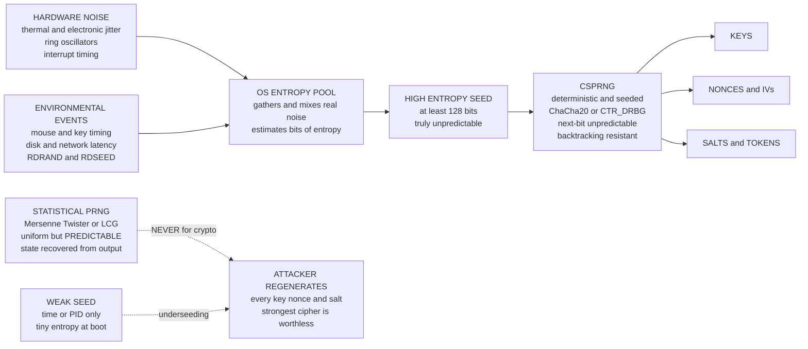

# 🎲 Random Number Generation for Cryptography

> [!abstract] TL;DR
> Every cryptographic secret — **keys, nonces, IVs, salts, Diffie–Hellman exponents, signature nonces, session tokens, challenges** — is only as secure as its **unpredictability**. If an attacker can *guess* the "random" numbers that made your key, they simply regenerate the key and the strongest cipher becomes worthless. The crucial split is between a **statistical PRNG** (Mersenne Twister, LCGs, `rand()`) — which is statistically uniform but **predictable** once you observe enough output — and a **CSPRNG** (`secrets`, `/dev/urandom`, `getrandom`, ChaCha20/CTR_DRBG), which additionally guarantees **next-bit unpredictability** and **backtracking resistance**. A CSPRNG must be seeded from a **high-entropy** source; **underseeding** (an embedded device or VM at boot) or a **weak seed** (time/PID) silently breaks everything — as the **Debian OpenSSL bug**, the **PS3 and Bitcoin ECDSA thefts**, and **Dual_EC_DRBG** all prove. Rule: *use the CSPRNG, never the statistical PRNG, and never seed a crypto RNG for reproducibility.*

---

## Intuition

**Analogy:** Imagine a bank vault whose combination is chosen by rolling dice behind a closed door. The vault door itself can be a foot of hardened steel — but if the "dice" are actually a wind-up music box that plays the same tune every morning, a thief who watches it once knows tomorrow's combination without ever touching the steel. The lock never fails; the *randomness that set it* fails. Cryptographic random number generation is exactly those dice: it is the invisible foundation under every key, nonce, and salt. Get it wrong and everything built on top collapses silently, while the algorithms still *look* perfect.

That is the whole danger. A weak "random" number leaves no error message and no crash. Your AES is still AES, your RSA is still RSA — but the attacker regenerates your secret from a predictable seed or a recovered generator state and walks straight in. **Randomness quality determines security**, and it is one of the very few places where a single line of code (`random.seed(time.time())`) can quietly nullify decades of cryptographic research.

---

## How It Works

### Core mechanics

**1. Why randomness is foundational.** Cryptography is built on secrets that the adversary must not be able to predict. A key is a value drawn from a distribution; security is a statement that the adversary's *advantage* over blind guessing is negligible. That is only true if the secret was drawn from something genuinely unpredictable. The moment the draw is guessable, the adversary's advantage jumps to ~1: they reproduce your key, nonce, or DH exponent directly. This is why `secrets.token_bytes`, `os.urandom`, `getrandom`, and `SecureRandom` exist and why `random`/`rand()` must never touch a secret.

**2. True vs pseudo randomness.** A **TRNG** (true random generator) harvests physical entropy — thermal/electronic noise, ring-oscillator jitter, radioactive decay, interrupt and mouse timing. It is genuinely unpredictable but **slow and limited**. A **PRNG** is a *deterministic* algorithm that expands a short **seed** into an arbitrarily long stream. The practical design combines both: gather a small amount of true entropy, use it to **seed a CSPRNG**, then let the fast deterministic generator produce all the bits you need.

**3. Statistical PRNG vs CSPRNG — the crucial distinction.** A **statistical PRNG** (Mersenne Twister behind Python's `random`, LCGs, C `rand()`) produces output that passes uniformity and independence tests — but is **predictable**: observing enough output reveals the internal state, and with the state you can compute *all future and past* outputs. Recovering an LCG needs only **3 outputs**; recovering Mersenne Twister needs **624 consecutive 32-bit words**. A **CSPRNG** adds two guarantees a statistical PRNG lacks:

- **Next-bit unpredictability** — given every previous output, no efficient algorithm predicts the next bit better than a coin flip.
- **Backtracking resistance (forward secrecy)** — compromising the current state does not reveal previously produced outputs.

Passing statistical tests is **necessary but not sufficient**. Unpredictability is the crypto requirement; a maximal-period generator can be statistically flawless and still cryptographically dead.

**4. Entropy and seeding.** A CSPRNG needs a **high-entropy seed** — at least as many bits of *unpredictability* as the security level you want (128+ bits). **Entropy** is unpredictability measured in bits; **min-entropy** is the worst-case guessing measure that actually matters. The OS maintains an **entropy pool** that continuously mixes hardware and environmental noise. **Underseeding** — low entropy available at boot on embedded devices, freshly cloned VMs, or containers — is the classic silent failure. Historically `/dev/random` **blocked** waiting for "enough" entropy while `/dev/urandom` never blocked; modern advice is: once the pool is seeded, use `getrandom()`/`urandom`, which are cryptographically indistinguishable from `/dev/random` and never block after initial seeding.

**5. CSPRNG constructions and interfaces.** Standard designs include **CTR_DRBG**, **HMAC_DRBG**, and **Hash_DRBG** (NIST SP 800-90A), **Fortuna**, and the **ChaCha20-based** generator in modern Linux. OS interfaces: the `getrandom()` syscall, `/dev/urandom`, and Windows `BCryptGenRandom`. Language APIs: Python `secrets`/`os.urandom`, Java `SecureRandom` (properly seeded), Go `crypto/rand`, Node `crypto.randomBytes` — **never** `random`, `rand()`, `Math.random()`.

### Flow: from physical noise to keys



---

## Key Concepts

### Secondary (intuitive)
- Every secret — **key, nonce, salt, token** — must be **unpredictable**. If an attacker can guess it, the cipher does not matter: they regenerate your key.
- **True** randomness comes from physical noise (unpredictable but slow); **pseudo** randomness is an algorithm stretching a seed (fast). The practical recipe: seed a good algorithm from real noise.
- A generator can pass every statistics test and still be **totally predictable** — Python's `random` is the classic example. Use `secrets`/`os.urandom`, **never `random`**, for anything secret.
- A generator is only as good as its **seed**. Seed it from the time or a process ID and your keys become guessable (the Debian disaster).

### Undergraduate (formal)
- **Statistical PRNG vs CSPRNG:** both are statistically uniform; a CSPRNG *additionally* guarantees **next-bit unpredictability** (Yao) and **backtracking resistance**. Passing the NIST statistical test suite is **necessary, not sufficient**.
- **Entropy:** unpredictability in bits; **min-entropy** `H∞(X) = −log₂ maxₓ p(x)` is the guessing measure. A `k`-bit key delivers `k` bits of security *only if* its seed carries `k` bits of entropy.
- **State recovery:** an LCG `xₙ₊₁ = a·xₙ + c mod m` is recovered from **3 outputs** (with known/prime `m`); **Mersenne Twister** is recovered from **624** consecutive 32-bit outputs. Both then predict all future output — fatal for keys.
- **Constructions and interfaces:** CTR_DRBG, HMAC_DRBG, Hash_DRBG (NIST SP 800-90A), Fortuna, ChaCha20 (Linux). Access via `getrandom()`, `/dev/urandom`, `BCryptGenRandom`; APIs `secrets`, `SecureRandom`, `crypto/rand`.
- **`/dev/random` vs `/dev/urandom`:** blocking vs non-blocking historically; modern guidance — once seeded they are equivalent, so prefer `getrandom`/`urandom`, which never block after init.

### Graduate (advanced)
- **DRBG internals:** reseeding intervals, **prediction resistance**, personalization strings, and the derivation function; the hard, error-prone part is **entropy estimation**, not the deterministic output.
- **Boot-time entropy problem:** VMs cloned from a snapshot, containers, and IoT devices start with empty or duplicated pools → **identical or low-entropy keys**. The 2012 *Mining Your Ps and Qs* study found tens of thousands of Internet hosts sharing RSA/DSA factors for exactly this reason. `getrandom()` **blocks until first seeded** to prevent it.
- **Backdoored generators:** **Dual_EC_DRBG** embedded two curve points `P, Q`; anyone knowing `d` with `P = d·Q` could recover the internal state from a little output — a kleptographic backdoor standardized by NIST and shipped by default in RSA BSAFE and Juniper ScreenOS.
- **Removing the RNG dependence:** the **ECDSA/DSA nonce `k`** must be **unique and unpredictable**; a single reused or predictable `k` leaks the private key. **RFC 6979** derives `k` deterministically from the private key and message (HMAC-DRBG), and **EdDSA** builds this in — eliminating per-signature RNG risk entirely. See [[Digital_Signatures]].
- **Reproducibility vs security:** never seed a crypto RNG for deterministic tests. Determinism and unpredictability are opposites; a seeded "secure" RNG is a statistical PRNG in disguise.

---

## Python Demo

```python
# Cryptographic randomness in three acts. Pure standard library + matplotlib.
#   (A) A STATISTICAL PRNG IS PREDICTABLE. An LCG is recovered from just THREE
#       outputs, then every future output is predicted exactly. (Mersenne Twister
#       behind Python's random is the same story with a 624-word state.)
#   (B) STATISTICS ARE NOT ENOUGH. The LCG's high bits and a real CSPRNG both PASS
#       a chi-square uniformity test -- yet only one is unpredictable. Passing
#       statistical tests is NECESSARY, not SUFFICIENT.
#   (C) THE WEAK SEED (the Debian OpenSSL 2008 disaster). A CSPRNG seeded from a
#       tiny space (only the PID, ~15 bits) yields a keyspace an attacker
#       enumerates in milliseconds -- no cipher is broken, the key is just guessed.
import os
import secrets
import random
from collections import Counter
import matplotlib.pyplot as plt

# ================================================================
# PART A - A STATISTICAL PRNG IS PREDICTABLE
# LCG:  x_{n+1} = (a*x_n + c) mod m.  With a PRIME modulus, three consecutive
# outputs recover a and c, and from there ALL future output is deterministic.
# ================================================================
M = 2147483647                    # 2**31 - 1, prime -> modular inverses exist
A_TRUE, C_TRUE = 48271, 12345     # the "secret" LCG parameters

def lcg_stream(seed, n):
    x, out = seed, []
    for _ in range(n):
        x = (A_TRUE * x + C_TRUE) % M
        out.append(x)
    return out

secret_seed = 0xC0FFEE
outputs = lcg_stream(secret_seed, 60)

# The attacker observes only the first three outputs and solves for (a, c):
x0, x1, x2 = outputs[0], outputs[1], outputs[2]
a_rec = ((x2 - x1) * pow(x1 - x0, -1, M)) % M     # modular inverse, Python 3.8+
c_rec = (x1 - a_rec * x0) % M

def predict(after, a, c, k):
    x, pred = after, []
    for _ in range(k):
        x = (a * x + c) % M
        pred.append(x)
    return pred

predicted = predict(x2, a_rec, c_rec, len(outputs) - 3)
actual = outputs[3:]
lcg_acc = sum(p == q for p, q in zip(predicted, actual)) / len(actual)

print("PART A - LCG state recovery from 3 outputs")
print(f"  true  (a, c) = ({A_TRUE}, {C_TRUE})")
print(f"  recovered    = ({a_rec}, {c_rec})")
print(f"  future outputs predicted exactly: {lcg_acc:.0%}")

# The CSPRNG offers no such foothold: best an attacker can do is guess a byte,
# which is right 1 in 256 (~0.4%). Measure a naive predictor on os.urandom.
stream = os.urandom(20000)
csprng_acc = sum(stream[i] == stream[i - 1] for i in range(1, len(stream))) / (len(stream) - 1)
print(f"  CSPRNG next-byte prediction accuracy: {csprng_acc:.3%} (chance ~0.391%)")

# ================================================================
# PART B - PASSING STATISTICS IS NOT ENOUGH
# The LCG's HIGH bits and a real CSPRNG both look uniform under chi-square.
# ================================================================
def chi_square_bytes(data):
    counts = Counter(data)
    expected = len(data) / 256.0
    return sum((counts.get(v, 0) - expected) ** 2 / expected for v in range(256))

N = 20000
lcg_bytes = bytes((x >> 15) & 0xFF for x in lcg_stream(secret_seed, N))  # HIGH bits
csprng_bytes = os.urandom(N)
CRIT = 310.46          # chi-square critical value, df=255, alpha=0.01

chi_lcg = chi_square_bytes(lcg_bytes)
chi_csprng = chi_square_bytes(csprng_bytes)
print("\nPART B - chi-square uniformity (critical value ~310.5)")
print(f"  LCG high bits : {chi_lcg:7.1f}  -> {'PASS' if chi_lcg < CRIT else 'FAIL'}")
print(f"  CSPRNG        : {chi_csprng:7.1f}  -> {'PASS' if chi_csprng < CRIT else 'FAIL'}")
print("  BOTH pass statistics -- yet only the CSPRNG is unpredictable (Part A).")

# ================================================================
# PART C - THE WEAK SEED (Debian OpenSSL 2008)
# A CSPRNG is only as unpredictable as its SEED. Debian reduced the entropy to
# essentially the process ID (~15 bits -> ~32768 possibilities). An attacker
# regenerates the ENTIRE keyspace and finds the key by brute force.
# ================================================================
PID_SPACE = 32768                 # the Debian catastrophe: only the PID varied

def weak_keygen(pid):
    rng = random.Random()
    rng.seed(pid)                 # ONLY the PID as entropy -- fatal
    return rng.getrandbits(128).to_bytes(16, "big")

victim_pid = 24601
victim_key = weak_keygen(victim_pid)                       # the "secret" 128-bit key
recovered_pid = next(p for p in range(PID_SPACE) if weak_keygen(p) == victim_key)

print("\nPART C - weak seed (Debian-style) key recovery")
print(f"  victim key         : {victim_key.hex()}")
print(f"  brute-forced pid   : {recovered_pid}  (searched a space of {PID_SPACE})")
print(f"  recovery succeeded : {weak_keygen(recovered_pid) == victim_key}")
print(f"  proper CSPRNG key  : {secrets.token_bytes(16).hex()}  (lives in 2**128, unsearchable)")

# ============================= visualize =============================
fig, ax = plt.subplots(2, 2, figsize=(14, 9))

# 1. LCG: predicted vs actual future outputs sit exactly on y = x
ax[0, 0].scatter([a / M for a in actual], [p / M for p in predicted],
                 s=25, color="#e74c3c", alpha=0.8)
ax[0, 0].plot([0, 1], [0, 1], "k--", alpha=0.5, label="predicted == actual")
ax[0, 0].set_title("Statistical PRNG is PREDICTABLE\n3 outputs -> all future recovered")
ax[0, 0].set_xlabel("actual output (normalized)")
ax[0, 0].set_ylabel("predicted output (normalized)")
ax[0, 0].legend()

# 2. chi-square: both pass (necessary, not sufficient)
ax[0, 1].bar(["LCG\nhigh bits", "CSPRNG\nos.urandom"], [chi_lcg, chi_csprng],
             color=["#e67e22", "#2ecc71"])
ax[0, 1].axhline(CRIT, color="k", ls="--", label="critical ~310.5 (fail above)")
ax[0, 1].set_title("Chi-square uniformity: BOTH pass\nstatistics do NOT prove security")
ax[0, 1].set_ylabel("chi-square statistic")
ax[0, 1].legend()

# 3. next-output predictability: the property that actually matters
ax[1, 0].bar(["statistical\nPRNG (LCG)", "CSPRNG"], [lcg_acc, csprng_acc],
             color=["#e74c3c", "#2ecc71"])
ax[1, 0].axhline(1 / 256, color="k", ls="--", label="chance 1/256")
ax[1, 0].set_ylim(0, 1.05)
ax[1, 0].set_title("Next-output prediction\nLCG 100%, CSPRNG ~chance")
ax[1, 0].set_ylabel("prediction accuracy")
ax[1, 0].legend()

# 4. seed-space collapse: guessable vs unsearchable (bits of entropy)
labels = ["Debian PID\n~2^15", "time+PID\n~2^32", "proper CSPRNG\n2^128"]
bits = [15, 32, 128]
colors = ["#e74c3c", "#e67e22", "#2ecc71"]
ax[1, 1].bar(labels, bits, color=colors)
ax[1, 1].axhline(64, color="k", ls="--", label="brute-force ceiling ~2^64")
ax[1, 1].set_title("Seed entropy decides everything\nunderseeding -> guessable keys")
ax[1, 1].set_ylabel("bits of seed entropy")
ax[1, 1].legend()

plt.tight_layout()
plt.show()

# Takeaways:
#  * PART A -> a statistical PRNG leaks its whole future from a handful of outputs;
#    it must NEVER produce keys, nonces, or salts.
#  * PART B -> both generators pass chi-square. Statistical quality is necessary
#    but NOT sufficient; unpredictability is the real crypto requirement.
#  * PART C -> even a perfect CSPRNG is only as strong as its seed; underseeding
#    or a weak seed (time/PID) makes the entire keyspace enumerable -- the Debian
#    OpenSSL bug, and the shape of every "bad randomness" break.
```

**What you see when it runs.** Part A recovers the LCG's `(a, c)` from three outputs and predicts **100%** of its remaining outputs, while the CSPRNG's next byte is guessable only at chance (~0.39%). Part B shows both the LCG's high bits and `os.urandom` **passing** the chi-square uniformity test — statistical quality alone certifies nothing. Part C regenerates the entire Debian-style keyspace and brute-forces the "secret" 128-bit key from a space of just 32768, then contrasts it with a proper `secrets` key that lives in `2**128` and can never be enumerated. The four panels make the thesis visual: **statistical uniformity is cheap; unpredictability and seed entropy are what secure a system.**

---

## Real-World Applications

> **Example — Linux `getrandom()` and the ChaCha20 CSPRNG.** Modern Linux mixes hardware entropy (interrupt timing, `RDSEED`) into a pool, uses it to key a **ChaCha20** stream generator, and exposes it through the `getrandom()` syscall — which **blocks until the pool is first seeded** and never again. Every TLS session key, every `os.urandom` call, and every `secrets` token ultimately draws from this. See [[System_Calls_and_the_Kernel_Interface]] and [[OS_Security_and_Isolation]].

The **hall of famous failures** is the strongest argument for taking RNG seriously — each is a devastating real break caused by bad randomness, not a broken cipher:

- **Debian OpenSSL (2008, CVE-2008-0166).** A code change meant to silence a Valgrind warning removed the main entropy source, reducing the seed to essentially the **process ID** — only ~32768 possible keys. For nearly two years *every* SSH and SSL key generated on Debian/Ubuntu was one of a tiny, precomputable set. Anyone could regenerate them.
- **Sony PlayStation 3 (2010).** Sony's ECDSA firmware signatures used a **fixed nonce `k`** instead of a fresh random one. Two signatures with the same `k` immediately yield the private signing key by simple algebra — the console's master key was extracted.
- **Android Bitcoin wallet thefts (2013).** A flaw in Android's `SecureRandom` produced **repeated ECDSA nonces**, letting attackers recover private keys from the blockchain and drain wallets. Same root cause as the PS3: nonce reuse from weak randomness.
- **Netscape SSL (1995).** Early Netscape seeded its RNG from the **time of day, process ID, and parent PID** — all guessable. Two graduate students (Goldberg and Wagner) brute-forced session keys in seconds.
- **"Ron was wrong, Whit is right" / "Mining Your Ps and Qs" (2012).** Two studies scanned the Internet and found tens of thousands of RSA/DSA keys **sharing prime factors** — a `gcd` of two public moduli factored both. The cause: low **boot-time entropy** on headless devices and routers generating keys before the pool was seeded.
- **Dual_EC_DRBG (2007–2013).** A NIST-standardized generator with constants that permitted a **kleptographic backdoor** to whoever chose them (widely attributed to NSA). Shipped by default in RSA BSAFE and Juniper ScreenOS; the Juniper incident showed the backdoor being *reused* by a third party.
- **MIFARE Classic and gambling machines.** Predictable hardware LFSR/PRNG designs let attackers clone transit cards and predict slot-machine payouts — the same "statistical but predictable" trap as the demo's LCG.

The modern, correct counterexamples: **RFC 6979 deterministic ECDSA** and **EdDSA** remove the per-signature RNG dependency entirely, and **RDRAND**/**TPM** hardware sources plus `getrandom()` fix the boot-entropy problem.

---

## Common Pitfalls

- **Using a statistical PRNG for secrets.** `random` (Mersenne Twister), C `rand()`, `java.util.Random`, and JavaScript `Math.random()` are predictable from a short output prefix. Never generate a key, nonce, salt, or token from them — use `secrets`/`os.urandom`, `SecureRandom`, `crypto/rand`, or `crypto.randomBytes`.
- **Underseeding at boot.** VMs cloned from a snapshot, containers, and IoT/embedded devices often generate keys before the entropy pool is seeded, producing **duplicate or low-entropy keys** across many machines (the *Mining Your Ps and Qs* factor collisions). Use `getrandom()` (which blocks until seeded), provision entropy at first boot, or use a hardware RNG/TPM.
- **Predictable or reused signature nonces.** A repeated or guessable ECDSA/DSA nonce `k` leaks the private key outright (PS3, Android Bitcoin). Use **RFC 6979** deterministic nonces or **EdDSA** so `k` never depends on a live RNG.
- **Seeding a crypto RNG for "reproducibility."** Determinism is the *opposite* of unpredictability. A seeded CSPRNG is a statistical PRNG. Reproducible test vectors belong in fixtures, never from the security RNG.
- **Trusting statistical tests as proof of security.** Passing Dieharder/NIST STS is necessary, not sufficient — an LCG and a maximal-period LFSR pass and are still trivially predicted. Unpredictability to an adversary is the actual requirement.
- **Truncated or low-entropy IVs, salts, and tokens.** A 32-bit IV or a salt from `time()` collides or repeats; short session tokens are guessable. Draw full-width values (96+ bit nonces, 128+ bit salts/tokens) from a CSPRNG.
- **Blocking-RNG panic.** Historically `/dev/random` blocking on low entropy pushed developers to substitute worse sources. The fix is `getrandom`/`urandom` once the pool is seeded — not falling back to `time()`.

---

## Related Concepts

- [[Probability_and_Information_Theoretic_Security]] — defines entropy, min-entropy, and the `H(K) ≥ H(M)` bound; a key's secrecy is exactly the entropy the RNG put into it.
- [[Stream_Ciphers_and_PRGs]] — a CSPRNG *is* a PRG used to make keys/nonces rather than a keystream; the same next-bit-unpredictability requirement governs both.
- [[Symmetric_Encryption_Fundamentals]] — every symmetric key and IV comes from the RNG; a predictable draw defeats even perfect AES.
- [[Modes_of_Operation]] — CBC IVs and CTR/GCM nonces must be unpredictable/unique; the pitfalls there are RNG pitfalls in disguise.
- [[Digital_Signatures]] — the ECDSA/DSA nonce `k` is the sharpest RNG-is-life-or-death case; RFC 6979 and EdDSA remove the dependency.
- [[RSA]] — poor prime generation from low entropy produced shared factors across the Internet (the 2012 studies), factoring real keys with a `gcd`.
- [[Computational_Hardness_Assumptions]] — computational security assumes the adversary cannot guess secrets; a weak RNG hands them the secret and voids the assumption.
- [[Cryptography_Overview]] — the vault entry point framing where "weak randomness silently breaks strong algorithms" fits.
- [[Entropy_and_Information_Content]] — the Information Theory note quantifying the unpredictability an RNG seed must carry.
- [[OS_Security_and_Isolation]] — where the entropy pool, `getrandom`, and boot-time seeding actually live in the kernel.
- [[System_Calls_and_the_Kernel_Interface]] — `getrandom()` is the syscall through which userspace draws secure randomness.

*(Sibling Cryptography notes referenced in prose and to be wired in once written — `Key_Management_and_Distribution`, `Cryptographic_Failures_and_Misuse`, and `Password_Hashing_and_KDFs` — each deepen a slice of this note: key lifecycle, the failure taxonomy, and salt/KDF randomness respectively.)*

---

## Review Questions

1. **Secondary (conceptual).** Python's `random` passes every statistical randomness test you throw at it. Explain, in one or two sentences, why it must *still* never be used to generate an encryption key — and what property a CSPRNG has that `random` lacks.
2. **Undergraduate (scenario).** A team ships an IoT camera that generates its TLS private key on first boot, immediately after power-on, using the default RNG. Field scans later find hundreds of these cameras sharing the same key. Diagnose the root cause, name the class of bug, and give two concrete fixes.
3. **Graduate (trade-off).** Contrast three ways to protect an ECDSA signing service from nonce-related key leakage: (a) a well-seeded CSPRNG per signature, (b) RFC 6979 deterministic nonces, and (c) EdDSA. Discuss the failure modes each eliminates versus retains, and explain why deterministic nonce generation is *safer* than "just use a good RNG" in practice.

---

## Sources

- [Bello / Debian, "Predictable random number generator" (DSA-1571-1, CVE-2008-0166)](https://www.debian.org/security/2008/dsa-1571)
- [Heninger, Durumeric, Wustrow & Halderman, "Mining Your Ps and Qs: Detection of Widespread Weak Keys in Network Devices" (USENIX Security 2012)](https://factorable.net/paper.html)
- [Lenstra et al., "Ron was wrong, Whit is right" (2012)](https://eprint.iacr.org/2012/064)
- [NIST SP 800-90A Rev. 1, "Recommendation for Random Number Generation Using Deterministic Random Bit Generators"](https://csrc.nist.gov/pubs/sp/800/90/a/r1/final)
- [Pornin, RFC 6979 — Deterministic Usage of DSA and ECDSA](https://www.rfc-editor.org/rfc/rfc6979)
- [Bernstein, Lange & Niederhagen, "Dual EC: A Standardized Back Door" (2016)](https://eprint.iacr.org/2015/767)

---

#cryptography #csprng #randomness #entropy #seeding
