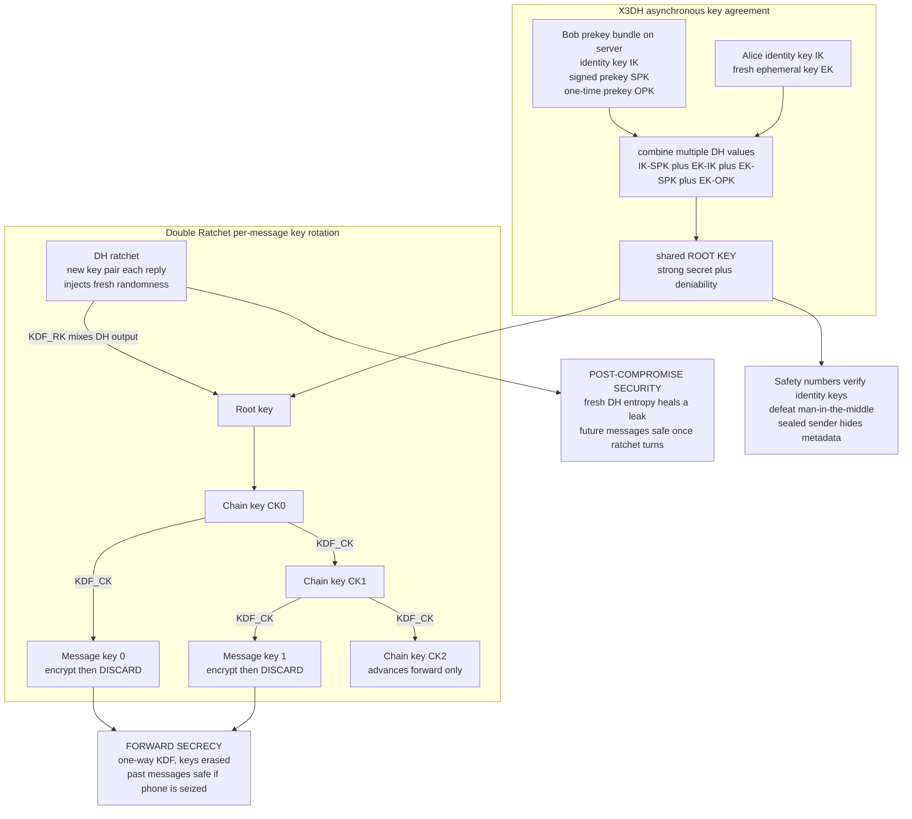

# 🔐 Secure Messaging and the Signal Protocol

> [!abstract] TL;DR
> **End-to-end encryption (E2EE)** guarantees that *only the two endpoints* — not the server, not the ISP, not the app vendor — can read a conversation, unlike ordinary **transport encryption** (TLS to a server that then sees plaintext, see [[TLS_and_Secure_Channels]]). But E2EE alone is not enough: a serious messaging threat model demands **forward secrecy** (stealing today's keys must not expose *past* messages), **post-compromise security** / "future secrecy" (a key leak now must not doom *future* messages once the protocol heals), **asynchronicity** (message an offline recipient), and **deniability** (no cryptographic proof of *who* said what). The **Signal Protocol** — the state of the art protecting billions of conversations across Signal, WhatsApp, Messenger, and Google Messages/RCS — delivers all four by composing two building blocks. **X3DH (Extended Triple Diffie–Hellman)** bootstraps a shared secret between parties who may be offline, using **prekeys** (identity key, signed prekey, one-time prekeys) published to a server. Then the **Double Ratchet** (Marlinspike–Perrin) advances keys *per message*: a **symmetric-key ratchet** derives a fresh single-use **message key** from a one-way **KDF chain** and discards it (forward secrecy within a chain), while a **Diffie–Hellman ratchet** injects new key material with each reply (post-compromise self-healing). Authenticity against a man-in-the-middle is closed by **safety numbers** (key fingerprints verified out-of-band). E2EE for *groups* is harder — **sender keys** and the IETF **MLS/TreeKEM** standard scale it — and **metadata** (who talks to whom, when) remains the stubborn residual leak.

---

## Intuition

**Analogy — a diary written in disappearing ink, with a lock that rekeys itself.** Imagine every single text you send is sealed with a *brand-new key* that is **destroyed the instant it is used**. Now picture two consequences. First, if someone later steals your phone and grabs *every key it currently holds*, they still cannot read yesterday's messages — those keys were shredded the moment they were used, and there is no way to compute them again. That is **forward secrecy**: the past is safe even after a total seizure. Second, suppose an attacker briefly reads your keys *today*. As soon as your correspondent replies, the protocol quietly folds in a fresh burst of randomness the attacker never saw, and from that reply onward the attacker is locked out again. That is **post-compromise security** — the conversation *self-heals*.

The Signal Protocol achieves both with a **ratchet**: a mechanism that, like a socket wrench or a car window crank, *only turns forward and can never be run backward*. Each turn derives the next message key from the current one through a **one-way function**, then throws the old state away. Because the function is one-way, an attacker who captures the current position can grind *forward* (future messages, until healing) but can never crank *backward* to recover what came before. Everything below is just making that self-shredding, self-healing ratchet mathematically precise.

---

## How It Works

### End-to-end vs transport encryption

Ordinary HTTPS gives you **transport encryption**: your message is encrypted to *the server*, which decrypts it, sees the plaintext, and re-encrypts it onward. That protects against a network eavesdropper but trusts the provider completely — a compromised, subpoenaed, or malicious server reads everything (see [[TLS_and_Secure_Channels]] and its applied companion [[TLS_Protocol_Deep_Dive]]). **End-to-end encryption (E2EE)** removes the middle: keys live *only* on the two endpoints, so the relay server forwards ciphertext it fundamentally cannot open. That single shift — from "trust the provider" to "trust only the endpoints" — is the privacy guarantee behind Signal and WhatsApp, and it is the crux of the recurring **encryption-backdoor** policy debate.

### The demanding goals beyond confidentiality

Confidentiality is table stakes. Secure messaging is defined by *four harder* properties:

1. **Forward secrecy.** Compromising *current* keys must not expose *past* messages. Keys advance through one-way functions and are erased, so seized state cannot reconstruct history.
2. **Post-compromise security ("future secrecy" / self-healing).** Compromising keys *now* must not expose *future* messages once the ratchet mixes in fresh entropy the attacker lacks.
3. **Asynchronicity.** You must be able to message an *offline* recipient (phones sleep) — so the initial key agreement cannot require both parties online simultaneously.
4. **Deniability.** Ideally there is *no cryptographic proof* binding a specific message to a specific author, so a leaked transcript is not a signed confession.

### X3DH — establishing the first shared secret asynchronously

Two people who have never interacted, one of them offline, must still derive a shared secret. **X3DH (Extended Triple Diffie–Hellman)** solves this with **prekeys** the recipient publishes to the server ahead of time (built on elliptic-curve DH over Curve25519, see [[Diffie_Hellman_and_Discrete_Log]] and [[Elliptic_Curve_Cryptography]]):

- a long-term **identity key** `IK`,
- a **signed prekey** `SPK` (medium-term, signed by `IK` for authenticity),
- a batch of **one-time prekeys** `OPK` (each used once, then discarded).

To start a session, Alice fetches Bob's prekey bundle, generates an **ephemeral key** `EK`, and computes **multiple DH values** — `DH(IK_A, SPK_B)`, `DH(EK_A, IK_B)`, `DH(EK_A, SPK_B)`, and `DH(EK_A, OPK_B)` — then concatenates and hashes them into one strong root secret. Combining several DH operations means the secret is strong even if one key type is weak, and mixing the *ephemeral* key gives **deniability** (the transcript could have been forged by either party, since no signature binds the messages themselves). This bootstraps the session even though Bob was asleep.

### The Double Ratchet — the core innovation

From that X3DH root secret, the **Double Ratchet** (Marlinspike–Perrin) rotates keys per message by combining *two* ratchets:

1. **Symmetric-key ratchet (the KDF chain).** A **chain key** feeds a key-derivation function each message: `message_key, next_chain_key = KDF(chain_key)`. Every message gets a *fresh single-use* message key; the chain key advances and the old one is erased. Because the KDF is **one-way**, you can march forward but never backward — this delivers **forward secrecy** *within* a chain. This is exactly what the Python demo implements.
2. **Diffie–Hellman ratchet.** Each time the conversation "turns around" (a reply), the sender includes a **new DH public key**. Both sides perform a fresh DH and mix the output into the root via `new_root, new_chain = KDF_RK(root, DH_output)`, spawning a brand-new sending chain. This injects entropy an attacker who stole earlier state does not have — delivering **post-compromise security / healing**.

Together: per-message key rotation *plus* periodic re-seeding. Old keys die (forward secrecy); leaked keys expire once fresh DH material arrives (self-healing).

### Authentication, safety numbers, and metadata

E2EE still must defeat a **man-in-the-middle** who swaps in their own keys. Signal exposes **safety numbers** (a fingerprint of both identity keys) that users compare **out-of-band** — scan a QR code or read digits aloud — plus **Trust-On-First-Use (TOFU)** with a warning when a contact's key changes (see [[Authentication_Protocols]] and [[Key_Exchange_and_PKI]]). Separately, E2EE protects **content** but not **metadata** — *who* talks to *whom*, *when*, and *how much*. Signal narrows this with **sealed sender** (hiding the sender identity from the server) and **private contact discovery**, but full metadata protection needs mix networks or Tor and remains an open frontier.

### Flow / Architecture



---

## Key Concepts

### Secondary (intuitive, no CS background needed)
- **End-to-end** means only the two phones can read the chat — the company running the app cannot, even if forced to. Regular website encryption only protects the trip to the company's server, which *does* see your words.
- **Every message uses a new, throwaway key.** Because old keys are destroyed and can't be recreated, someone who grabs your phone tomorrow still can't read what you sent today. That is **forward secrecy**.
- **The chat can heal itself.** If a snoop briefly steals your keys, the next reply mixes in fresh randomness they never saw, and they're locked out again. That is **post-compromise security**.
- **You can text someone whose phone is off.** The app pre-publishes small "prekeys" so a session can start without both people being online.
- **Verify your contact** by comparing a **safety number** (or scanning a QR code) so nobody can secretly impersonate them.

### Undergraduate (a first crypto / security course)
- **Transport vs end-to-end:** TLS protects client↔server; the server sees plaintext. E2EE keeps keys only at endpoints, so the relay handles opaque ciphertext.
- **Threat-model goals:** confidentiality, integrity/authenticity, **forward secrecy**, **post-compromise security**, **asynchronicity**, **deniability**. TLS gives the first two/three; secure messaging adds the rest.
- **X3DH:** initial key agreement from published prekeys (`IK`, `SPK`, `OPK`) plus an ephemeral key; several DH operations are concatenated and hashed into a root secret, giving strength and deniability while allowing an offline peer.
- **Double Ratchet = two ratchets:** (1) **symmetric KDF chain** `MK, CK' = KDF(CK)` for per-message keys (forward secrecy); (2) **DH ratchet** re-seeding the root each reply (post-compromise security). The "ratchet" only turns forward.
- **Message key lifecycle:** derive → encrypt with an AEAD → **erase immediately**. Out-of-order delivery is handled by caching a bounded number of skipped message keys.
- **MITM defense:** **safety numbers** / key fingerprints verified out-of-band; **TOFU** with change warnings.
- **Deniability:** authenticity via **shared MACs** rather than signatures, so no third party can prove authorship — deliberate **anti-non-repudiation** (contrast [[Message_Authentication_Codes]] and [[Digital_Signatures]]).

### Graduate (advanced)
- **KDF construction:** Signal's `KDF_CK(ck)` is `HMAC(ck, 0x01)` for the message key and `HMAC(ck, 0x02)` for the next chain key; `KDF_RK` is HKDF over the root key and DH output. One-wayness of HMAC is what forbids backward computation — the formal basis of forward secrecy.
- **Security model:** Cohn-Gordon–Cremers–Dowling–Garratt–Stebila gave the first formal analysis, proving forward secrecy and a precise notion of post-compromise security under the gap-DH assumption in the random-oracle model. Post-compromise security is *epoch-bounded*: healing requires a fresh DH exchange the adversary cannot observe.
- **AEAD binding:** each message is sealed with an AEAD (AES-256-CBC + HMAC in the original spec; ChaCha20-Poly1305 in practice, see [[Stream_Ciphers_and_PRGs]] and [[Symmetric_Encryption_Fundamentals]]) with associated data binding the header (ratchet public key, counters) so reordering and cross-protocol confusion are detected.
- **Skipped-key handling:** because messages arrive out of order and asynchronously, receivers precompute and store message keys for gaps, bounded to resist a memory-exhaustion DoS — a subtle forward-secrecy/robustness trade-off.
- **Deniability formalized:** X3DH provides *offline* deniability via shared DH secrets; the message layer uses MACs (not signatures), so transcripts are forgeable by either party — no cryptographic non-repudiation, unlike a signature scheme.
- **Group messaging:** pairwise Double Ratchet is `O(n)` per message and doesn't scale; **sender keys** amortize by having each member ratchet a symmetric sending chain distributed pairwise once. **MLS (RFC 9420)** with **TreeKEM** achieves `O(log n)` group re-keying with continuous group forward secrecy and post-compromise security — the current frontier.
- **Post-quantum:** classical X3DH's DH is Shor-breakable; Signal's **PQXDH** augments X3DH with a lattice KEM (Kyber) for harvest-now-decrypt-later resistance (see [[Post_Quantum_Cryptography]]).

---

## Python Demo

```python
# =====================================================================
# THE SYMMETRIC-KEY RATCHET -- the engine inside Signal's Double Ratchet.
#
# Signal's KDF_CK step, per message:
#     message_key    MK = HMAC(chain_key, 0x01)   # single-use, then DISCARDED
#     next_chain_key CK = HMAC(chain_key, 0x02)   # advance the ratchet FORWARD
#
# HMAC is ONE-WAY: from CK_i you can march FORWARD (CK_{i+1}, CK_{i+2}, ...)
# but you can NEVER run it BACKWARD to CK_{i-1}. So stealing today's chain key
# cannot recover yesterday's message keys  ->  FORWARD SECRECY.
#
# We then add the DH ratchet step, which mixes a FRESH shared secret into the
# root, spawning a NEW chain the old attacker cannot follow  ->  POST-COMPROMISE
# SECURITY (the conversation "heals" after a key leak).
#
# Pure standard library (hashlib / hmac / os) + matplotlib. numpy NOT required.
# =====================================================================
import os, hmac, hashlib
import matplotlib.pyplot as plt
from matplotlib.colors import ListedColormap

# ---- the symmetric-key ratchet: one KDF_CK step ----------------------
def kdf_ck(chain_key):
    """Derive a one-time MESSAGE KEY and the NEXT CHAIN KEY (Signal's KDF_CK)."""
    message_key    = hmac.new(chain_key, b"\x01", hashlib.sha256).digest()
    next_chain_key = hmac.new(chain_key, b"\x02", hashlib.sha256).digest()
    return message_key, next_chain_key

# ---- the DH ratchet step: mix FRESH entropy into the root ------------
def kdf_rk(root_key, dh_output):
    """Signal's KDF_RK: fold a fresh DH shared secret into the root, yielding a
    NEW root key and a NEW chain key that an old attacker cannot reproduce."""
    material      = hmac.new(root_key, dh_output, hashlib.sha256).digest()
    new_root_key  = hmac.new(material, b"root",  hashlib.sha256).digest()
    new_chain_key = hmac.new(material, b"chain", hashlib.sha256).digest()
    return new_root_key, new_chain_key

# ---- a fast one-time-key stream cipher (SHA-256 in counter mode) ------
def stream(key, n):
    out, ctr = b"", 0
    while len(out) < n:
        out += hashlib.sha256(key + ctr.to_bytes(8, "big")).digest()
        ctr += 1
    return out[:n]

def seal(message_key, plaintext):        # XOR is its own inverse -> also opens
    return bytes(p ^ k for p, k in zip(plaintext, stream(message_key, len(plaintext))))

# =====================================================================
# SENDER: ratchet a chain forward, encrypting each message with its own
# single-use key, and DISCARDING that key immediately after use.
# =====================================================================
messages = [f"message #{i}: the secret is {i*i}".encode() for i in range(10)]
N = len(messages)
DH_STEP = 5                               # a DH ratchet step happens before message 5

root_key   = os.urandom(32)               # shared root from X3DH (simulated)
chain_key  = hmac.new(root_key, b"init", hashlib.sha256).digest()

chain_history   = []                      # chain key that GENERATES message i (for analysis)
true_msg_keys   = []                      # the real message keys (kept only to VERIFY the demo)
transcript      = []                      # ciphertexts on the wire
for i, pt in enumerate(messages):
    if i == DH_STEP:                      # <-- DH RATCHET: inject fresh entropy
        fresh_dh = os.urandom(32)         # a brand-new DH shared secret (attacker never saw it)
        root_key, chain_key = kdf_rk(root_key, fresh_dh)
    chain_history.append(chain_key)
    mk, chain_key = kdf_ck(chain_key)     # derive message key, ADVANCE the chain
    true_msg_keys.append(mk)
    transcript.append(seal(mk, pt))
    del mk                                # DISCARD the one-time key immediately

# =====================================================================
# ATTACKER: compromise the chain key that will produce message k, then try to
# recover message keys by cranking the ratchet FORWARD. The one-way KDF blocks
# PAST messages (forward secrecy); the DH ratchet blocks messages after DH_STEP
# (post-compromise security) because the attacker's forward crank never saw the
# fresh DH entropy, so its derived keys DIVERGE from the real ones.
# =====================================================================
def attacker_recovers(stolen_chain_key, count):
    """From a stolen chain key, derive the NEXT `count` message keys (forward only)."""
    keys, ck = [], stolen_chain_key
    for _ in range(count):
        mk, ck = kdf_ck(ck)
        keys.append(mk)
    return keys

k = 3                                     # attacker steals the chain key at message 3
recovered = attacker_recovers(chain_history[k], N - k)   # attacker's forward guesses

# Which recovered keys are actually CORRECT? Compare against the true keys.
readable = [k + j for j, key in enumerate(recovered) if key == true_msg_keys[k + j]]

print("SYMMETRIC RATCHET + DH RATCHET")
print(f"  attacker steals chain key at message {k}")
print(f"  messages the attacker can actually read : {readable}")
print(f"  PAST messages 0..{k-1} are unrecoverable  -> FORWARD SECRECY (one-way KDF)")
print(f"  messages {DH_STEP}.. survive the leak      -> POST-COMPROMISE SECURITY (DH heals)")
assert readable == [3, 4], "attacker should only read msgs 3 and 4"

# Sanity: an honest receiver holding the RIGHT key opens a message.
mk3, _ = kdf_ck(chain_history[3])
print("  honest decrypt of msg 3 :", seal(mk3, transcript[3]).decode())

# =====================================================================
# BUILD the recoverability matrices for visualization.
#   recover[c][m] = 1 (RED, exposed) if an attacker who compromises the chain
#   key at message c can compute message m's key, else 0 (GREEN, safe).
# =====================================================================
def segment(i):                           # which chain segment (the DH ratchet splits them)
    return 0 if i < DH_STEP else 1

# Without a DH ratchet: pure forward secrecy -> upper-triangular exposure.
no_heal = [[1 if m >= c else 0 for m in range(N)] for c in range(N)]
# With the DH ratchet at DH_STEP: exposure ALSO stops at the segment boundary.
with_heal = [[1 if (m >= c and segment(m) == segment(c)) else 0
              for m in range(N)] for c in range(N)]

# =====================================================================
# VISUALIZE
# =====================================================================
cmap = ListedColormap(["#27ae60", "#e74c3c"])   # 0 = green (safe), 1 = red (exposed)
fig, ax = plt.subplots(2, 2, figsize=(15, 11))

# Panel A: schematic of the ratchet chain advancing.
axA = ax[0, 0]; axA.axis("off"); axA.set_xlim(0, 10); axA.set_ylim(0, 10)
axA.set_title("A: the symmetric-key ratchet turns FORWARD only\n"
              "MK, CK' = HMAC(CK, 0x01), HMAC(CK, 0x02)", fontsize=10)
for j, x in enumerate([0.8, 3.4, 6.0, 8.6]):
    axA.text(x, 6.2, f"CK{j}", ha="center", va="center", fontsize=10,
             bbox=dict(boxstyle="round,pad=0.35", fc="#d6eaf8", ec="black"))
    axA.text(x, 3.2, f"MK{j}\nseal+erase", ha="center", va="center", fontsize=8,
             bbox=dict(boxstyle="round,pad=0.3", fc="#f9e79f", ec="black"))
    axA.annotate("", xy=(x, 4.1), xytext=(x, 5.6),
                 arrowprops=dict(arrowstyle="-|>", lw=1.5, color="darkgreen"))
    if x < 8.6:
        axA.annotate("", xy=(x + 2.0, 6.2), xytext=(x + 0.6, 6.2),
                     arrowprops=dict(arrowstyle="-|>", lw=2, color="black"))
axA.annotate("", xy=(2.4, 7.2), xytext=(1.2, 7.2),
             arrowprops=dict(arrowstyle="-|>", lw=1, color="gray", ls="--"))
axA.text(4.6, 7.6, "one-way: cannot crank backward", fontsize=8, color="gray")

# Panel B: the direct forward-secrecy demonstration for a fixed compromise.
axB = ax[0, 1]
exposed = [1 if (m in readable) else 0 for m in range(N)]
axB.bar(range(N), [1]*N, color=[("#e74c3c" if exposed[m] else "#27ae60") for m in range(N)])
axB.axvline(k - 0.5, color="black", ls="--", lw=1.5)
axB.text(k, 1.05, f"compromise\n@ msg {k}", ha="center", fontsize=8)
axB.axvline(DH_STEP - 0.5, color="blue", ls="--", lw=1.5)
axB.text(DH_STEP + 1.6, 1.05, "DH ratchet\nheals here", ha="center", fontsize=8, color="blue")
axB.set_title("B: steal chain key at msg 3 -> read only msgs 3,4\n"
              "PAST (0-2) safe = forward secrecy;  5+ safe = healing")
axB.set_xlabel("message index"); axB.set_yticks([])
axB.set_xticks(range(N))

# Panel C: forward secrecy only (no DH ratchet) -> triangular exposure.
axC = ax[1, 0]
axC.imshow(no_heal, cmap=cmap, vmin=0, vmax=1, aspect="equal", origin="upper")
axC.set_title("C: FORWARD SECRECY (one chain, no DH step)\n"
              "red = attacker CAN read; green = SAFE (past is protected)")
axC.set_xlabel("message index m"); axC.set_ylabel("compromise at message c")
axC.set_xticks(range(N)); axC.set_yticks(range(N))

# Panel D: with the DH ratchet -> exposure is FIREWALLED at the segment boundary.
axD = ax[1, 1]
axD.imshow(with_heal, cmap=cmap, vmin=0, vmax=1, aspect="equal", origin="upper")
axD.axvline(DH_STEP - 0.5, color="blue", lw=2)
axD.axhline(DH_STEP - 0.5, color="blue", lw=2)
axD.set_title("D: + DH RATCHET at msg 5 (blue firewall)\n"
              "POST-COMPROMISE SECURITY: exposure cannot cross the DH step")
axD.set_xlabel("message index m"); axD.set_ylabel("compromise at message c")
axD.set_xticks(range(N)); axD.set_yticks(range(N))

plt.tight_layout(); plt.show()

# Takeaways:
#   A -> the ratchet derives each message key from the current chain key via a
#        ONE-WAY HMAC, then advances; it can only turn forward.
#   B -> stealing the chain key at message 3 exposes ONLY messages 3 and 4:
#        earlier messages are unrecoverable (forward secrecy), and the DH ratchet
#        at message 5 locks the attacker out again (post-compromise security).
#   C -> forward secrecy alone gives a triangular exposure: a compromise at c
#        never reveals any message before c.
#   D -> the DH ratchet firewalls exposure at the re-key boundary, so even a
#        leaked chain key cannot reach messages in the next segment.
```

**What the demo shows.** The symmetric ratchet derives every message key with `HMAC(chain_key, 0x01)` and advances the chain with `HMAC(chain_key, 0x02)`, discarding each one-time key right after sealing a message. When an attacker steals the chain key at message 3, cranking the ratchet *forward* only reproduces messages 3 and 4: the one-way HMAC makes messages 0–2 unrecoverable (**forward secrecy**), and because the Diffie–Hellman ratchet before message 5 re-seeds the chain with entropy the attacker never saw, the attacker's forward guesses *diverge* from the real keys there (**post-compromise security** — the conversation heals). Panels C and D make the two properties visual: forward secrecy alone yields a triangular exposure region, and the DH ratchet firewalls that region at the re-key boundary.

---

## Real-World Applications

> **Example — WhatsApp's two billion users.** WhatsApp encrypts *every* one-to-one and group chat with the **Signal Protocol** by default: an **X3DH** handshake over Curve25519 prekeys sets up the session, then the **Double Ratchet** rotates a fresh key for each message. The WhatsApp *server* only ever relays ciphertext — it cannot read message bodies, which is precisely why it cannot hand plaintext to anyone who asks. This is E2EE deployed at the largest scale in history, and it is the concrete anchor of the global "encryption backdoor" debate: there is no technical middle where the provider both cannot read messages *and* can produce them on demand.

- **Signal** — the reference implementation and the protocol's namesake; the whole design (X3DH, Double Ratchet, sealed sender, safety numbers, PQXDH) originates here.
- **Facebook/Messenger and Instagram DMs** — rolled out Signal-Protocol E2EE (now default) across Meta's messaging surface.
- **Google Messages (RCS)** — uses the Signal Protocol to E2EE RCS chats between Android users.
- **Skype "Private Conversations" and others** — opt-in E2EE built on the same Double Ratchet core.
- **MLS (Messaging Layer Security, RFC 9420)** — the IETF standard for *scalable group* E2EE using **TreeKEM**; adopted by Cisco Webex, Wire, and Matrix-adjacent efforts for efficient `O(log n)` group re-keying.
- **The lineage: OTR (Off-the-Record).** Borisov–Goldberg–Brewer's 2004 OTR introduced per-message forward secrecy *and* deliberate **deniability** for instant messaging — the direct ancestor whose ideas the Double Ratchet generalized and made asynchronous.

---

## Common Pitfalls

- **Confusing transport encryption with end-to-end.** "It uses TLS" only protects the hop to the server, which then sees plaintext. E2EE is a *different, stronger* guarantee — the provider itself is outside the trust boundary. Marketing conflates them constantly.
- **Ignoring the man-in-the-middle.** E2EE without **key authentication** just encrypts to *whoever's* key the server handed you. Users must verify **safety numbers** out-of-band (or trust TOFU with change alerts); skipping this reopens the very attack E2EE was meant to stop.
- **Not erasing message keys.** Forward secrecy *depends* on discarding each one-time key (and consumed chain state) immediately. Logging plaintext, backing up keys to the cloud unencrypted, or holding keys "just in case" silently destroys the property — a device seizure then reads history.
- **Unbounded skipped-key storage.** Caching message keys for out-of-order/late messages is necessary, but an attacker can flood huge gaps to exhaust memory. Bound the cache; unbounded caches are a DoS and a forward-secrecy leak.
- **Reusing X3DH one-time prekeys.** One-time prekeys must be *one-time*; if the server runs out and reuses them (or replays them), the initial secret's freshness and deniability degrade. Rotate the signed prekey and replenish OPKs.
- **Treating metadata as protected.** E2EE hides *content*, not *who/when/how-much*. Assuming Signal "hides everything" is wrong — sealed sender and private contact discovery help, but traffic-analysis-grade anonymity needs mix networks or Tor.
- **Assuming groups are "just pairwise E2EE."** Naive pairwise Double Ratchet is `O(n)` per message and mishandles membership changes. Use **sender keys** or **MLS/TreeKEM**; rolling your own group protocol tends to break post-compromise security on member add/remove.
- **Believing deniability means the app hides who sent what from *you*.** Deniability is about *third-party* proof: the transcript isn't a signature, so it can't cryptographically incriminate an author. The recipient still knows who they're talking to.

---

## Related Concepts

- [[Public_Key_Cryptography_Foundations]] — X3DH is asynchronous public-key key agreement; the Double Ratchet bootstraps from public-key math before switching to fast symmetric ratcheting.
- [[Diffie_Hellman_and_Discrete_Log]] — the DH primitive at the heart of both X3DH's initial secret and the healing DH ratchet.
- [[Elliptic_Curve_Cryptography]] — Curve25519 (X25519), the concrete group Signal's Diffie–Hellman actually runs in.
- [[Key_Exchange_and_PKI]] — the key-agreement-plus-trust context; Signal swaps CA-style PKI for user-verified safety numbers and TOFU.
- [[Key_Management_and_Distribution]] — prekey publishing, rotation, and the key lifecycle that makes asynchronous sessions possible.
- [[TLS_and_Secure_Channels]] — the *transport* channel to contrast against E2EE; both use DH and AEAD, but TLS trusts the endpoint server that Signal deliberately excludes.
- [[Digital_Signatures]] — the non-repudiation primitive the message layer *avoids* on purpose; deniability comes from using shared MACs instead.
- [[Message_Authentication_Codes]] — each message is authenticated with a ratchet-derived MAC; shared MACs (not signatures) are exactly what buy deniability.
- [[Symmetric_Encryption_Fundamentals]] — the AEAD that seals each message under a single-use ratchet key.
- [[Stream_Ciphers_and_PRGs]] — ChaCha20, Signal's bulk cipher, and the keystream/KDF machinery underneath the symmetric ratchet.
- [[Hash_Functions]] — HMAC/HKDF, the one-way primitive whose non-invertibility *is* the forward-secrecy guarantee of the KDF chain.
- [[Authentication_Protocols]] — the broader identity-verification context for safety numbers, TOFU, and defeating a man-in-the-middle.
- [[Post_Quantum_Cryptography]] — Signal's **PQXDH** hardens X3DH with a lattice KEM against harvest-now-decrypt-later attacks.
- [[Cryptography_Overview]] — the parent map placing E2EE messaging among the field's flagship applied protocols.
- [[TLS_Protocol_Deep_Dive]] — the applied cross-vault companion detailing the transport handshake Signal layers *above*.

*(The MLS/TreeKEM group-messaging standard and dedicated metadata-protection techniques (mix networks, sealed sender internals) are candidates for a future `Advanced_Secure_Messaging` sibling.)*

---

## Review Questions

1. **Secondary (conceptual).** Using the "disappearing-ink diary with a self-rekeying lock" analogy, explain the difference between *forward secrecy* and *post-compromise security*. Then explain, in plain terms, why "our chat uses encryption to our servers" is a **weaker** promise than "our chat is end-to-end encrypted."
2. **Undergraduate (scenario).** Alice wants to message Bob, whose phone is currently offline. Walk through how **X3DH** lets her establish a shared secret anyway using Bob's published prekeys, naming each key involved and why *multiple* DH operations are combined. Then, once the session runs, describe exactly what the **symmetric-key ratchet** does for each message and *why discarding the message key immediately* is what delivers forward secrecy.
3. **Graduate (trade-off / deep).** An attacker silently compromises a user's device at message 100 and reads all current key state, then loses access. Explain precisely (a) which *past* messages remain secure and why the one-way KDF chain guarantees it, and (b) under what condition *future* messages recover their secrecy — identify the exact mechanism and why it fails to heal if the conversation is purely one-directional (Alice sending, Bob never replying). Finally, contrast this with why extending these guarantees to a 5,000-member group forces a move from pairwise Double Ratchet to **MLS/TreeKEM**.

---

## Sources

- Marlinspike, M., & Perrin, T. (2016). *The Double Ratchet Algorithm.* Signal Specifications. https://signal.org/docs/specifications/doubleratchet/
- Marlinspike, M., & Perrin, T. (2016). *The X3DH Key Agreement Protocol.* Signal Specifications. https://signal.org/docs/specifications/x3dh/
- Cohn-Gordon, K., Cremers, C., Dowling, B., Garratt, L., & Stebila, D. (2017). "A Formal Security Analysis of the Signal Messaging Protocol." *IEEE EuroS&P.* https://eprint.iacr.org/2016/1013
- Barnes, R., Beurdouche, B., Robert, R., Millican, J., Omara, E., & Cohn-Gordon, K. (2023). *RFC 9420: The Messaging Layer Security (MLS) Protocol.* IETF. https://www.rfc-editor.org/rfc/rfc9420
- Borisov, N., Goldberg, I., & Brewer, E. (2004). "Off-the-Record Communication, or, Why Not To Use PGP." *ACM WPES.* https://otr.cypherpunks.ca/otr-wpes.pdf

---

#cryptography #secure-messaging #signal-protocol #double-ratchet #forward-secrecy
