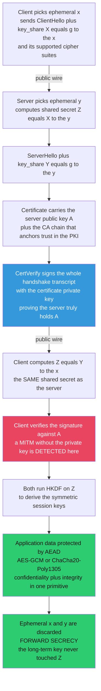

# 🔒 TLS and Secure Channels

> [!abstract] TL;DR
> **TLS (Transport Layer Security)** is the protocol that **composes every cryptographic primitive into one working secure channel** over an insecure network. It delivers all three security goals at once: **confidentiality** (AEAD encryption), **integrity** (the AEAD tag / MAC), and **authentication** (the server — and optionally the client — proves identity with a **certificate**). It is the **S in HTTPS**. The magic lives in the **handshake**: the parties negotiate parameters, run an **authenticated (EC)DHE key exchange** to agree on a shared secret over a public wire, the server **signs the transcript** with its certificate key to prove it holds that identity (defeating a man-in-the-middle), both **derive symmetric session keys via HKDF**, and then switch to fast **AEAD** (AES-GCM or ChaCha20-Poly1305) for bulk data. **TLS 1.3** (2018) is the definitive redesign: it *removed* every insecure option (RSA key transport, CBC, RC4, compression, renegotiation), *mandated* **forward secrecy** via ephemeral (EC)DHE, allows **AEAD only**, and runs a faster **1-RTT** handshake with a clean **HKDF** key schedule. Because ephemeral keys are discarded each session, stealing the server's long-term key *later* cannot decrypt *past* recorded traffic — **"harvest now, decrypt later" is defeated**. TLS's whole evolution was driven by real breaks (BEAST, CRIME, Lucky13, POODLE, Heartbleed, FREAK, Logjam, DROWN, ROBOT), each of which pruned a feature until TLS 1.3's minimal, safe core remained — the definitive case study in applied cryptographic engineering.

---

## Intuition

**Analogy:** Every time you see the padlock in your browser, a tiny cryptographic negotiation just happened in a few milliseconds. Two strangers who have never met — your browser and a server — met in a crowded public square where *everyone can hear every word*, and yet they walked away sharing a secret that none of the eavesdroppers learned. They did it in three moves: first they shouted numbers back and forth that let *only the two of them* compute a common secret (the **key exchange**); then the server held up a **notarized ID card** (its **certificate**) and *signed a live challenge* to prove the card was really its own and not a forgery held by an impostor standing between them (**authentication**, which stops the man-in-the-middle); and finally, now that they share a secret, they switched from shouting to whispering in a fast private code that also stamps every sentence tamper-evident (**AEAD encryption**).

That is exactly what TLS is: not a single algorithm, but the **conductor that makes all the instruments play together**. Key exchange gives you a shared secret; certificates and signatures tell you *who* you share it with; a key-derivation function turns the raw secret into working session keys; and authenticated encryption carries the actual data. Take away any one instrument and the music collapses — DH without authentication is silently intercepted; authentication without fresh ephemeral keys loses forward secrecy; encryption without a tag is malleable. TLS's genius is the **composition**, and the reason it is worth studying is that it is the single most important secure channel on Earth.

---

## How It Works

TLS provides a **secure channel**: an abstraction that takes an insecure, attacker-controlled network (an eavesdropper who reads everything, an active adversary who can inject, drop, and reorder packets) and turns it into a byte-stream with three guarantees — **confidentiality** (the adversary learns nothing about the plaintext), **integrity** (any tampering is detected and the connection is torn down), and **authentication** (you know *which* endpoint you are talking to). It runs *on top of* a reliable transport such as TCP (see [[Transport_Layer]]) and *underneath* application protocols such as HTTP, giving **HTTPS** (see [[HTTP_HTTPS]]).

### Two phases: handshake, then record protocol

TLS has two layers. The **handshake protocol** does the hard cryptographic work *once* at connection setup — it authenticates the peer and establishes the session keys. The **record protocol** then does the boring, fast work *repeatedly* — it chops the application byte-stream into records and protects each one with AEAD under those keys. All the "magic" is in the handshake; the record layer is just a mode of operation applied per record (see [[Modes_of_Operation]]).

### The handshake — an *authenticated* key exchange

The whole point of the handshake is to run a Diffie–Hellman key exchange that a man-in-the-middle *cannot* hijack (see [[Diffie_Hellman_and_Discrete_Log]] and [[Key_Exchange_and_PKI]]). Plain DH lets two parties derive a shared secret over a public channel, but it authenticates *nobody* — an attacker in the middle simply runs one DH with the client and another with the server, and relays. TLS closes that hole by making the server **authenticate the exchange**. In TLS 1.3 the flow is:

1. **ClientHello + key share.** The client picks an **ephemeral** secret `x`, sends its public share `X = g^x` (for a named group — an elliptic curve like X25519, or a finite-field MODP group), plus the cipher suites it supports.
2. **ServerHello + key share.** The server picks its own **ephemeral** `y`, sends `Y = g^y`, and *immediately* both sides can compute the shared secret `Z = g^{xy}` (**ECDHE** — Elliptic-Curve Diffie–Hellman Ephemeral). The ephemerality is what gives **forward secrecy**.
3. **Certificate.** The server sends its **certificate**, which binds its identity (domain name) to a long-term public key `A`, signed by a Certificate Authority. This is the **PKI** trust anchor — the client already trusts the CA's root, so it trusts `A`.
4. **CertificateVerify.** The server **signs the entire handshake transcript** (everything exchanged so far, hashed with SHA-2) using the certificate's *private* key. This is the crux: it proves the server actually *holds the private key* for the certificate — so it is the genuine owner of `A`, not an impostor replaying a stolen certificate. A man-in-the-middle who substituted its own key share cannot produce a valid signature over that transcript, because it does not have the private key. **This single step defeats the MITM.**
5. **Finished.** Both sides run the shared secret `Z` through **HKDF** (HMAC-based key-derivation) to derive the symmetric **session keys**, and exchange a MAC (`Finished`) over the transcript to confirm both saw the *same* handshake — catching any tampering or downgrade.
6. **Application data.** From here on, everything is encrypted with **AEAD** (AES-GCM or ChaCha20-Poly1305) under the derived keys.

TLS 1.3 completes all of this in **one round trip (1-RTT)**, and even encrypts most of the handshake (certificates included), unlike the two-round-trip, mostly-cleartext handshake of TLS 1.2.



### Every primitive, composed

TLS is a *case study in primitive composition* — it uses essentially the entire cryptographic toolbox at once:

- **(EC)DHE key exchange** → the shared secret `Z` (rests on the discrete-log / CDH hardness assumption; see [[Diffie_Hellman_and_Discrete_Log]], [[Elliptic_Curve_Cryptography]], and [[Computational_Hardness_Assumptions]]).
- **Certificates + signatures** (ECDSA, RSA-PSS, or Ed25519) → **authentication**, which defeats the MITM (see [[Digital_Signatures]], [[Key_Exchange_and_PKI]], and [[Asymmetric_Cryptography_and_PKI]]).
- **HKDF** (built on HMAC-SHA-256) → deterministically expands `Z` into all the independent session keys of the key schedule (see [[Message_Authentication_Codes]], [[Hash_Functions_and_MACs]], and [[Hash_Functions]]).
- **AEAD** — AES-GCM or ChaCha20-Poly1305 → **bulk encryption + integrity** in a single primitive (see [[Modes_of_Operation]] and [[Block_Ciphers_and_AES]]).
- **SHA-2** → the transcript hash that the signature and HKDF operate over.

This is why TLS sits at the top of a cryptography vault: it is where key exchange, signatures, key derivation, and authenticated encryption *all come together* into a channel with confidentiality, integrity, authentication, **and** forward secrecy (see [[Cryptography_Overview]]).

### Forward secrecy — the crucial property

Because the DH keys `x` and `y` are **ephemeral** — freshly generated for this session and **discarded** immediately after — the session key `Z = g^{xy}` is **independent of the server's long-term key**. The long-term certificate key is used *only to sign*, never to derive `Z`. The payoff is enormous: an adversary who records all your encrypted traffic today and, *years later*, steals or subpoenas the server's long-term private key **still cannot decrypt** those past sessions, because the ephemeral secrets that produced their keys no longer exist and cannot be recovered from the public transcript without solving the discrete-log problem. This defeats **"harvest now, decrypt later."** TLS 1.2 *optionally* offered forward secrecy (the `ECDHE` suites); **TLS 1.3 makes it mandatory** by removing static-RSA key transport entirely.

### The TLS 1.3 redesign — subtraction as security

The 2018 redesign (RFC 8446) is a masterclass in *removing* features:

| Removed in 1.3 | Why | What replaced it |
|---|---|---|
| Static RSA key transport | No forward secrecy; ROBOT padding oracle | Mandatory ephemeral (EC)DHE |
| CBC-mode cipher suites | BEAST, Lucky13, POODLE padding oracles | AEAD only |
| RC4, 3DES, MD5, SHA-1 | Broken / weak primitives | AES-GCM, ChaCha20-Poly1305, SHA-2 |
| TLS-level compression | CRIME / BREACH | No compression |
| Renegotiation | Complex, attack-prone | Key update messages |
| Cleartext handshake | Metadata leakage | Encrypted handshake |

The result is a protocol that is **dramatically simpler and safer** than 1.2, with a clean, single key-derivation pipeline built on HKDF, and an optional **0-RTT** resumption mode that trades a round trip for a **replay caveat** (0-RTT data can be replayed by an attacker, so it must be used only for idempotent requests).

---

## Key Concepts

### Secondary (intuitive)
- **TLS** is the padlock: it turns an open, eavesdropped network into a private, tamper-proof, identity-checked channel.
- It does three things at once: **hides** the data (confidentiality), **detects tampering** (integrity), and **proves who you're talking to** (authentication, via the certificate).
- The **handshake** is a quick negotiation up front: agree on a secret, check the server's ID, switch to fast encryption.
- **Forward secrecy** means each conversation uses a throwaway key, so stealing the server's master key *later* can't unlock *past* conversations.
- TLS doesn't invent new crypto — it is the **assembly** of key exchange, signatures, key derivation, and encryption into one working system.

### Undergraduate (formal)
- **Secure channel guarantees:** confidentiality + integrity + entity authentication over a Dolev–Yao (active) attacker who controls the network.
- **Authenticated Key Exchange (AKE):** the handshake is an AKE — DH gives the shared secret, and the server's **signature over the transcript** binds the exchange to an authenticated identity, preventing MITM. Unauthenticated DH alone is trivially MITM-able.
- **The key schedule:** `Z = ECDHE shared secret` → `HKDF-Extract` → pseudorandom key → `HKDF-Expand` with labels → `client/server handshake keys`, then `client/server application keys`, plus the `Finished` MAC keys — all cryptographically separated.
- **AEAD record layer:** each record is sealed with AES-GCM or ChaCha20-Poly1305 under a per-record nonce derived from a sequence number, authenticating the record header as associated data.
- **Forward secrecy (PFS):** ephemeral `x, y` are erased post-handshake, so `Z` is unrecoverable from `{X, Y}` and the long-term key; security reduces to CDH in the chosen group.

### Graduate (advanced)
- **Downgrade protection:** TLS 1.3 embeds a sentinel in the server's `Random` and the `Finished` MAC covers the full transcript, so a network attacker cannot silently force the parties down to a weaker version or cipher (the class of attacks behind **Logjam** and version-rollback). Legacy fallback (`SCSV`) was the 1.2-era patch.
- **The record-layer nonce contract:** GCM nonce reuse is catastrophic (the "forbidden attack" exposes the GHASH subkey and enables forgery); TLS derives per-record nonces by XOR-ing a static IV with the 64-bit sequence number, guaranteeing uniqueness without transmitting the nonce.
- **Formal analysis:** TLS 1.3 was designed hand-in-hand with academic verification (Tamarin, ProVerif, miTLS/F*), giving machine-checked proofs of secrecy and authentication — a first for a mainstream protocol, and a direct response to a decade of 1.2 attacks that lived in *unspecified corners*.
- **0-RTT and replay:** early data is encrypted under a pre-shared-key-derived key with no fresh ECDHE, so it lacks forward secrecy for that data and is **replayable**; safe only for idempotent operations, with server-side anti-replay windows as mitigation.
- **Cryptographic agility vs attack surface:** every negotiable legacy option is a downgrade target. TLS 1.3's philosophy is *minimize the menu* — fewer knobs means fewer ways to misconfigure or be downgraded, the opposite of 1.2's "support everything" flexibility.
- **Post-quantum migration:** ECDHE is broken by Shor's algorithm, so hybrid key exchanges (X25519 + ML-KEM/Kyber) are being standardized to preserve forward secrecy against a future quantum "harvest now, decrypt later" adversary (see [[Post_Quantum_Cryptography]]).

---

## Python Demo

```python
# A simplified TLS-1.3-STYLE handshake, from scratch, showing how the primitives
# COMPOSE into a secure channel. Pure stdlib (secrets/hashlib/hmac) + matplotlib.
# TOY, SMALL parameters -- pedagogy only; real TLS uses X25519 / 2048+ bit groups.
#
# The flow, faithful to TLS 1.3:
#   (1) client & server run an EPHEMERAL Diffie-Hellman (DHE) -> shared secret Z
#   (2) the server AUTHENTICATES by SIGNING the handshake transcript with its
#       long-term "certificate" key (a Schnorr signature over the SAME DL group),
#       and the client VERIFIES it against the trusted certificate public key A
#   (3) both derive symmetric SESSION KEYS from Z via HKDF (HMAC-SHA256)
#   (4) they exchange an AEAD-encrypted "application" message (stream cipher + MAC)
#
# Then we DEMONSTRATE:
#   * a MITM WITHOUT the server's signing key is DETECTED (signature fails)
#   * FORWARD SECRECY: two sessions under the SAME long-term key get INDEPENDENT
#     session keys, and leaking the long-term key LATER does not reveal Z
import secrets, hashlib, hmac
import matplotlib.pyplot as plt

# ---------------------------------------------------------------- toy DL group
SMALL_PRIMES = [p for p in range(2, 2000)
                if all(p % f for f in range(2, int(p ** 0.5) + 1))]

def probably_prime(n, rounds=16):
    if n < 2: return False
    for p in SMALL_PRIMES:
        if n % p == 0:
            return n == p
    d, r = n - 1, 0
    while d % 2 == 0:
        d //= 2; r += 1
    for _ in range(rounds):
        a = secrets.randbelow(n - 3) + 2
        x = pow(a, d, n)
        if x == 1 or x == n - 1:
            continue
        for _ in range(r - 1):
            x = pow(x, 2, n)
            if x == n - 1:
                break
        else:
            return False
    return True

def gen_safe_prime(bits=160):
    """p = 2q + 1 with p, q both prime -> QR subgroup has prime order q."""
    while True:
        q = secrets.randbits(bits - 1) | (1 << (bits - 2)) | 1
        if probably_prime(q) and probably_prime(2 * q + 1):
            return 2 * q + 1, q

P, Q = gen_safe_prime(160)
while True:                                     # generator of the order-q subgroup
    h = secrets.randbelow(P - 3) + 2
    G = pow(h, 2, P)
    if G not in (1, P - 1):
        break

def rand_exp():
    return secrets.randbelow(Q - 2) + 2         # a private exponent in [2, Q-1]

def H_int(*parts):
    h = hashlib.sha256()
    for x in parts:
        h.update(str(x).encode())
    return int.from_bytes(h.digest(), "big")

# ------------------------------------------------------- Schnorr signature (auth)
def sign(priv, transcript):
    k = rand_exp()
    R = pow(G, k, P)
    e = H_int(R, pow(G, priv, P), transcript) % Q
    s = (k + e * priv) % Q
    return (R, s)

def verify(pub, transcript, sig):
    R, s = sig
    e = H_int(R, pub, transcript) % Q
    return pow(G, s, P) == (R * pow(pub, e, P)) % P

# ------------------------------------------------------------- HKDF (key schedule)
def hkdf_extract(salt, ikm):
    return hmac.new(salt, ikm, hashlib.sha256).digest()

def hkdf_expand(prk, info, length=32):
    out, t, ctr = b"", b"", 1
    while len(out) < length:
        t = hmac.new(prk, t + info + bytes([ctr]), hashlib.sha256).digest()
        out += t; ctr += 1
    return out[:length]

# ------------------------------------------------- toy AEAD (encrypt-then-MAC)
def _xor(a, b):
    return bytes(i ^ j for i, j in zip(a, b))

def _keystream(key, nonce, n):
    out, ctr = b"", 0
    while len(out) < n:
        out += hmac.new(key, nonce + ctr.to_bytes(8, "big"), hashlib.sha256).digest()
        ctr += 1
    return out[:n]

def aead_seal(key, nonce, plaintext, aad=b""):
    ek, mk = hkdf_expand(key, b"enc"), hkdf_expand(key, b"mac")
    ct = _xor(plaintext, _keystream(ek, nonce, len(plaintext)))
    tag = hmac.new(mk, aad + nonce + ct, hashlib.sha256).digest()
    return ct, tag

def aead_open(key, nonce, ct, tag, aad=b""):
    ek, mk = hkdf_expand(key, b"enc"), hkdf_expand(key, b"mac")
    if not hmac.compare_digest(hmac.new(mk, aad + nonce + ct, hashlib.sha256).digest(), tag):
        raise ValueError("AEAD authentication FAILED")
    return _xor(ct, _keystream(ek, nonce, len(ct)))

def to_bytes(z):
    return z.to_bytes((z.bit_length() + 7) // 8 or 1, "big")

# ================================================================ THE HANDSHAKE
def handshake(server_priv, server_cert_pub, client_trusts_pub, attacker=None):
    """Returns (ok, client_key, server_key). `attacker` (if given) sits in the
    middle and tries to substitute the server's key share + forge a signature."""
    # (1) ClientHello: client ephemeral
    x = rand_exp(); X = pow(G, x, P)

    # (2) ServerHello: server ephemeral (or the MITM's, if intercepting)
    if attacker is None:
        y = rand_exp(); Y = pow(G, y, P)
        Z_server = pow(X, y, P)
        signer_priv = server_priv                  # honest server signs
    else:
        y = rand_exp(); Y = pow(G, y, P)           # MITM's OWN ephemeral share
        Z_server = pow(X, y, P)                     # MITM shares a key with client
        signer_priv = attacker["priv"]             # MITM lacks the cert key -> forges

    # (3+4) transcript = ClientHello || ServerHello || cert ; server signs it
    transcript = H_int(X, Y, server_cert_pub)
    sig = sign(signer_priv, transcript)

    # (5) Client verifies the signature against the TRUSTED certificate key A
    ok = verify(client_trusts_pub, transcript, sig)

    # (6) both derive session keys from their DH secret via HKDF
    Z_client = pow(Y, x, P)
    prk_client = hkdf_extract(b"tls13", to_bytes(Z_client))
    prk_server = hkdf_extract(b"tls13", to_bytes(Z_server))
    c2s_client = hkdf_expand(prk_client, b"c2s application")
    c2s_server = hkdf_expand(prk_server, b"c2s application")
    return ok, c2s_client, c2s_server

# --- server's long-term "certificate" key pair (used ONLY to sign, never for Z)
cert_priv = rand_exp()
cert_pub  = pow(G, cert_priv, P)          # this is A, embedded in the certificate

# ---- (A) HONEST handshake ---------------------------------------------------
ok, ck, sk = handshake(cert_priv, cert_pub, client_trusts_pub=cert_pub)
nonce = b"\x00" * 12
ct, tag = aead_seal(sk, nonce, b"GET /account HTTP/1.1", aad=b"tls-record")
recovered = aead_open(ck, nonce, ct, tag, aad=b"tls-record")
print("HONEST  : signature verifies =", ok, "| keys agree =", ck == sk)
print("          AEAD app data round-trips =", recovered == b"GET /account HTTP/1.1")

# ---- (B) MITM without the certificate key -----------------------------------
mallory = {"priv": rand_exp()}            # attacker's own key, NOT the cert key
mok, mck, msk = handshake(cert_priv, cert_pub, client_trusts_pub=cert_pub, attacker=mallory)
print("MITM    : shares a key with client =", mck == msk,
      "| BUT signature verifies =", mok, "-> handshake ABORTED, MITM detected")

# ---- (C) FORWARD SECRECY ----------------------------------------------------
# Two independent sessions under the SAME long-term cert key.
_, k1, _ = handshake(cert_priv, cert_pub, client_trusts_pub=cert_pub)
_, k2, _ = handshake(cert_priv, cert_pub, client_trusts_pub=cert_pub)
print("FWD SEC : session1 key == session2 key ?", k1 == k2,
      "-> each session is INDEPENDENT")
# The session key derivation NEVER consumed cert_priv: leaking it later reveals
# nothing about Z, which lives at g^(x*y) for DISCARDED ephemerals x, y (CDH-hard).
print("          long-term key was an input to the session key ? False",
      "-> leaking it later does NOT decrypt past sessions")

# ============================================================== VISUALIZATION
fig = plt.figure(figsize=(15, 9))
gs = fig.add_gridspec(2, 2, height_ratios=[1.15, 1])

# (1) handshake message flow -------------------------------------------------
ax = fig.add_subplot(gs[0, :])
ax.set_xlim(0, 10); ax.set_ylim(0, 10); ax.axis("off")
ax.text(1.2, 9.4, "CLIENT", ha="center", fontsize=13, weight="bold", color="#2c3e50")
ax.text(8.8, 9.4, "SERVER", ha="center", fontsize=13, weight="bold", color="#2c3e50")
ax.plot([1.2, 1.2], [0.5, 9], color="#bdc3c7", lw=2)
ax.plot([8.8, 8.8], [0.5, 9], color="#bdc3c7", lw=2)
msgs = [
    (8.4, "ClientHello  +  key_share X = g^x", "->", "#2980b9"),
    (7.2, "ServerHello  +  key_share Y = g^y", "<-", "#16a085"),
    (6.3, "Certificate {A}  +  CA chain", "<-", "#16a085"),
    (5.4, "CertVerify: sign(transcript) with cert key", "<-", "#c0392b"),
    (4.5, "Finished  (AEAD-protected)", "<-", "#16a085"),
    (3.4, "Finished  (AEAD-protected)", "->", "#2980b9"),
    (2.2, "Application Data  (AES-GCM / ChaCha20-Poly1305)", "<->", "#27ae60"),
]
for y, label, direction, color in msgs:
    if direction == "->":
        ax.annotate("", xy=(8.7, y), xytext=(1.3, y),
                    arrowprops=dict(arrowstyle="->", color=color, lw=2))
    elif direction == "<-":
        ax.annotate("", xy=(1.3, y), xytext=(8.7, y),
                    arrowprops=dict(arrowstyle="->", color=color, lw=2))
    else:
        ax.annotate("", xy=(8.7, y), xytext=(1.3, y),
                    arrowprops=dict(arrowstyle="<->", color=color, lw=2.5))
    ax.text(5.0, y + 0.18, label, ha="center", fontsize=9.5, color=color)
ax.text(5.0, 0.9, "shared secret Z = g^(xy) derived on BOTH sides, then HKDF -> session keys",
        ha="center", fontsize=9, style="italic", color="#7f8c8d")
ax.set_title("TLS 1.3-style handshake: authenticated key exchange in one round trip",
             fontsize=12, weight="bold")

# (2) MITM detection ---------------------------------------------------------
ax2 = fig.add_subplot(gs[1, 0])
bars = ax2.bar(["Honest\nserver", "MITM\n(no cert key)"], [1, 0],
               color=["#27ae60", "#e74c3c"])
ax2.set_ylim(0, 1.3); ax2.set_ylabel("signature verifies?")
ax2.set_yticks([0, 1]); ax2.set_yticklabels(["FAIL", "OK"])
ax2.set_title("Authentication defeats the man-in-the-middle")
for b, txt in zip(bars, ["accepted", "REJECTED"]):
    ax2.text(b.get_x() + b.get_width() / 2, b.get_height() + 0.05, txt,
             ha="center", weight="bold")

# (3) forward secrecy: two sessions -> independent keys ----------------------
ax3 = fig.add_subplot(gs[1, 1])
grid = [list(k1[:16]), list(k2[:16])]
ax3.imshow(grid, cmap="viridis", aspect="auto")
ax3.set_yticks([0, 1]); ax3.set_yticklabels(["session 1", "session 2"])
ax3.set_xlabel("session-key bytes (first 16)")
ax3.set_title("Forward secrecy: same long-term key,\nINDEPENDENT session keys")

plt.tight_layout()
plt.show()

# Takeaways:
#  * The channel is built by COMPOSITION: DHE (secret) + signature (identity)
#    + HKDF (keys) + AEAD (data). Remove any one and it breaks.
#  * The signature over the transcript is what stops the MITM: it shares a DH
#    key with the client, but cannot forge the certificate signature -> detected.
#  * Ephemeral DH means the session key never depends on the long-term key, so
#    stealing that key later cannot decrypt recorded past traffic (forward secrecy).
```

Running it prints that the honest handshake verifies and both sides derive the *same* session key that the AEAD message round-trips under; that the MITM *does* share a Diffie–Hellman key with the client but its forged signature **fails verification**, so the handshake aborts; and that two sessions under the same long-term certificate key yield **independent** session keys — with the long-term key never being an input to the derivation, so leaking it later reveals nothing about past sessions. The figure shows the handshake message flow between client and server, a bar chart of signature-verification outcomes (honest accepted, MITM rejected), and a heatmap of two sessions' key bytes making their independence visible.

---

## Real-World Applications

> **Example — the HTTPS padlock.** Every `https://` page load is this note in production. Your browser and (say) a bank's server run a TLS 1.3 handshake: an **X25519 ECDHE** key exchange derives a fresh shared secret; the server presents an **X.509 certificate** chained to a CA your browser trusts, and **signs the transcript with Ed25519 or RSA-PSS** to prove ownership; **HKDF-SHA256** expands the secret into session keys; and the actual HTTP request/response bytes are sealed with **AES-128-GCM** or **ChaCha20-Poly1305**. All of it in one round trip and a few milliseconds — see [[TLS_Protocol_Deep_Dive]], [[TLS_SSL]], and [[HTTP_HTTPS]].

- **Web and APIs:** effectively *all* modern web traffic, REST/GraphQL APIs, and webhooks ride on TLS; browsers now mark plain HTTP "Not Secure."
- **Email transport:** SMTP, IMAP, and POP3 use **STARTTLS** to upgrade cleartext sessions to TLS, protecting mail in transit between servers and clients.
- **Databases and internal services:** Postgres, MySQL, MongoDB, Redis, gRPC, and service meshes (mutual-TLS between microservices) use TLS for both encryption and **client authentication** (mTLS) — see [[Authentication_Protocols]].
- **QUIC / HTTP/3:** QUIC builds **TLS 1.3 directly into the transport**, merging the transport and cryptographic handshakes to cut connection setup to a single round trip (or zero on resumption).
- **VPNs and tunnels:** OpenVPN uses TLS directly; **WireGuard** instead uses the minimalist **Noise protocol framework** (a modern alternative secure-channel design), and IPsec has its own IKE handshake — see [[VPN_and_Tunneling]].
- **Other secure channels:** **SSH** performs a structurally similar authenticated DH handshake for remote login; the **Signal Protocol** uses the Double Ratchet for forward-secret, deniable messaging (see [[Secure_Messaging_and_Signal_Protocol]]). TLS is one design in a family of secure-channel protocols.

---

## Common Pitfalls

- **Thinking "TLS is on, so we're secure"** — TLS secures the *channel*, not the endpoints. It does nothing against a compromised server, application bugs (SQLi, XSS), or a malicious CA. It is one layer, not a security strategy.
- **Not validating the certificate** — the classic app/mobile bug: encrypting with TLS but skipping hostname or chain verification (or accepting any cert) reduces the whole thing to *unauthenticated* DH, which is silently MITM-able. Certificate validation is *the* step that provides authentication.
- **Supporting legacy protocols/ciphers** — leaving SSLv3, TLS 1.0/1.1, RC4, or CBC suites enabled invites **downgrade attacks** (POODLE, FREAK, Logjam, DROWN). Cryptographic agility is an *attack surface*: disable everything below TLS 1.2, prefer 1.3.
- **Static (non-ephemeral) key exchange** — old static-RSA/static-DH suites give **no forward secrecy**, so one stolen long-term key retroactively decrypts *all* recorded traffic. Always use ephemeral (EC)DHE; TLS 1.3 enforces this.
- **GCM nonce reuse in custom TLS stacks** — a repeated GCM nonce under one key is catastrophic (leaks the auth subkey, enables forgery — the "forbidden attack" found in real TLS libraries). Derive nonces from the record sequence number and never reset it.
- **Blindly using 0-RTT early data** — 0-RTT lacks forward secrecy for that data and is **replayable**; using it for non-idempotent requests (payments, state changes) is a real vulnerability. Restrict it to safe, idempotent operations.
- **Ignoring implementation risk** — the math can be perfect while the *code* leaks: **Heartbleed** (a missing bounds check in OpenSSL) exposed private keys and memory, and **Lucky13** was a timing side channel, not a math break. Keep libraries patched (the planned `Cryptographic_Failures_and_Misuse` and `Side_Channel_Attacks` notes cover this class).

---

## Related Concepts

- [[Cryptography_Overview]] — the four security goals and the primitive toolbox; TLS is where confidentiality, integrity, and authentication are delivered together in one protocol.
- [[Key_Exchange_and_PKI]] — the authenticated-key-exchange and certificate/CA machinery that the TLS handshake operationalizes.
- [[Diffie_Hellman_and_Discrete_Log]] — the (EC)DHE key exchange at the heart of the handshake, and the hardness assumption forward secrecy rests on.
- [[Elliptic_Curve_Cryptography]] — the curves (X25519, P-256) that provide fast, small ECDHE key shares and ECDSA/Ed25519 signatures.
- [[Digital_Signatures]] — the CertificateVerify signature (ECDSA, RSA-PSS, Ed25519) that authenticates the server and defeats the MITM.
- [[Modes_of_Operation]] — the AEAD record layer (AES-GCM, ChaCha20-Poly1305) that carries TLS application data, and why 1.3 went AEAD-only after CBC padding-oracle attacks.
- [[Block_Ciphers_and_AES]] — AES is the block cipher underneath AES-GCM, TLS's most common bulk cipher.
- [[Message_Authentication_Codes]] — HMAC underpins HKDF and the `Finished` MAC; the AEAD tag gives per-record integrity.
- [[Hash_Functions]] — SHA-2 powers the transcript hash and, via HMAC, the HKDF key schedule.
- [[Key_Management_and_Distribution]] — certificate issuance, rotation, revocation, and the operational lifecycle behind the keys TLS uses.
- [[Public_Key_Cryptography_Foundations]] — the (EC)DHE key exchange and signatures that the handshake composes rest on public-key hardness assumptions.
- [[Computational_Hardness_Assumptions]] — forward secrecy and MITM resistance reduce to the discrete-log / CDH hardness of the chosen group.
- [[Secure_Messaging_and_Signal_Protocol]] — a sibling secure channel: the Double Ratchet gives per-message forward secrecy and deniability for messaging.
- [[Authentication_Protocols]] — mutual TLS and the broader family of entity-authentication protocols TLS's client-auth mode belongs to.
- [[Asymmetric_Cryptography_and_PKI]] — the applied Cybersecurity view of certificates, the CA trust chain, and signature algorithms.
- [[Hash_Functions_and_MACs]] — the applied companion on HMAC, HKDF, and AEAD tags.
- [[TLS_Protocol_Deep_Dive]] — the applied Cybersecurity companion: wire-format records, cipher-suite negotiation, session resumption, and operational hardening.
- [[TLS_SSL]] — the Networking-vault view of TLS/SSL in the protocol stack.
- [[HTTP_HTTPS]] — how TLS turns HTTP into HTTPS at the application layer.
- [[Transport_Layer]] — the reliable transport (TCP) that TLS runs on top of, and that QUIC fuses with TLS 1.3.
- [[VPN_and_Tunneling]] — sibling secure channels (IPsec, WireGuard/Noise, OpenVPN) that solve the same problem with different handshakes.
- [[Post_Quantum_Cryptography]] — why hybrid PQC key exchange is being added to TLS to preserve forward secrecy against future quantum adversaries.

*Planned Cryptography-vault siblings referenced above in prose — `Cryptographic_Failures_and_Misuse` and `Side_Channel_Attacks` — will be linked once those notes exist.*

---

## Review Questions

1. **Conceptual (Undergraduate).** TLS composes several primitives. For each of ECDHE, the certificate signature, HKDF, and AEAD, name *which* of the three secure-channel guarantees (confidentiality, integrity, authentication) it primarily provides, and explain why removing *any one* of them breaks the channel. In particular, what specifically goes wrong if you run the DH key exchange but omit the server's signature?
2. **Scenario (Graduate).** An adversary silently records a user's entire TLS 1.3 session today. Two years later it compromises the server and steals the server's long-term certificate private key. Can it now decrypt the recorded session? Answer precisely in terms of ephemeral vs long-term keys, which values entered the session-key derivation, and the hardness problem the attacker would have to solve. Then explain how the answer would change for an old TLS 1.2 *static-RSA* cipher suite.
3. **Trade-off (Graduate).** TLS 1.3 deliberately *removed* many options (CBC, static RSA, compression, renegotiation, 0-RTT-by-default). Frame the "cryptographic agility vs attack surface" tension: give one concrete historical attack that each removal defends against, and argue why a *smaller* menu of negotiable parameters can make a protocol *more* secure even though it is less flexible.

---

## Sources

- [RFC 8446 — The Transport Layer Security (TLS) Protocol Version 1.3](https://www.rfc-editor.org/rfc/rfc8446)
- [RFC 5869 — HMAC-based Extract-and-Expand Key Derivation Function (HKDF)](https://www.rfc-editor.org/rfc/rfc5869)
- [Cloudflare — A Detailed Look at RFC 8446 (a.k.a. TLS 1.3)](https://blog.cloudflare.com/rfc-8446-aka-tls-1-3/)
- [Bhargavan, Blanchet, Kobeissi — Verified Models and Reference Implementations for the TLS 1.3 Standard Candidate (IEEE S&P 2017)](https://ieeexplore.ieee.org/document/7958594)
- [Boneh & Shoup — *A Graduate Course in Applied Cryptography*, Ch. 21 (Authenticated Key Exchange)](https://toc.cryptobook.us/)

---

#cryptography #tls #secure-channels #handshake #forward-secrecy
