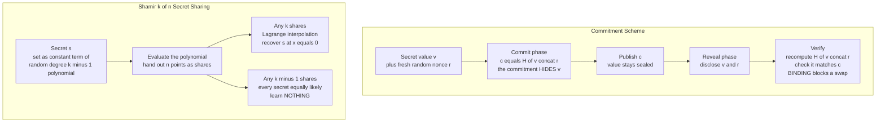

# 🔐 Commitment Schemes and Secret Sharing

> [!abstract] TL;DR
> A **commitment scheme** is a cryptographic *sealed envelope*: you **commit** to a value now in a way that **hides** it, then later **reveal** it in a way that anyone can verify — and **binding** stops you swapping in a different value after the fact. **Secret sharing** goes the other way: it **splits** a secret into *n* shares so that any *k* of them **reconstruct** it (via polynomial interpolation) while any *k − 1* learn *nothing at all*, information-theoretically. Together they are the workhorse building blocks under **zero-knowledge proofs**, **multi-party computation**, **threshold key custody** (Shamir Backup, MPC wallets, HashiCorp Vault unseal keys), and blockchain **commit-reveal** randomness and **confidential transactions**.

---

## Intuition

**Analogy — commitment is a sealed envelope.** You write a number on a card, seal it in an opaque tamper-evident envelope, and hand it to a referee. Two guarantees hold at once: the referee **can't peek** at your number (*hiding*), and you **can't secretly swap the card** for a different one later (*binding*). When it's time, you open the envelope and everyone checks that the card inside matches what you sealed. That is exactly the "commit now, reveal later" pattern that lets two people who don't trust each other flip a coin over the phone, or run a sealed-bid auction where no one can change their bid after seeing others'.

**Analogy — secret sharing is a torn treasure map.** Tear a treasure map into five pieces and give one to each pirate, engineered so that *any three* pieces reassemble into the full map, but *any two* are just meaningless scraps that point everywhere and nowhere. No single pirate can find the treasure alone, no pair can either, yet the crew can always recover it as long as three show up — and if two pieces are lost to the sea, the treasure is still findable. That "any *k*-of-*n*, but fewer reveal nothing" property is the heart of Shamir's scheme, and it needs no assumption about how much computing power an attacker has.

---

## How It Works

### Core Mechanics

**Commitment schemes — a two-phase primitive.**

1. **Commit phase.** The committer takes a value `v` and (usually) fresh randomness `r`, and produces a **commitment** `c`. They publish `c`. Crucially, `c` reveals nothing useful about `v`.
2. **Reveal / open phase.** Later the committer discloses `v` and the **opening** `r`. Anyone recomputes the commitment from `(v, r)` and checks it equals the published `c`.

Two defining **properties**, in tension:

- **Hiding.** Before opening, `c` gives an adversary no information about `v` — two different values produce commitments an adversary cannot tell apart.
- **Binding.** The committer cannot find a *second* opening `(v', r')` with `v' ≠ v` that also verifies against `c` — they are locked into their original value.

**The fundamental trade-off:** you cannot have *both* properties perfectly. If `c` is a fixed-length string but `v` can be anything, then either the map from value to commitment collapses distinct values together (*perfect hiding* — many values map to `c`, so binding can only be computational) or it separates them all (*perfect binding* — one value per `c`, so hiding can only be computational). Real schemes therefore pick a side:
- **Perfectly hiding + computationally binding** (e.g. Pedersen), or
- **Computationally hiding + perfectly binding** (e.g. a hash commitment).

**Constructions.**

- **Hash-based commitment:** `c = H(v ‖ r)` for a fresh random nonce `r`. *Hiding* comes from the nonce plus preimage/hiding resistance of `H` (without `r` the value is one of astronomically many preimages); *binding* comes from **collision resistance** (finding `(v', r') ≠ (v, r)` with the same hash is infeasible). Simple, fast, perfectly binding, computationally hiding. Relies on [[Hash_Functions]].
- **Pedersen commitment:** in a cyclic group with generators `g, h` (where nobody knows `log_g h`), commit as `c = g^v · h^r`. It is **perfectly hiding** (for any `v`, the random `r` makes `c` uniformly distributed, so the commitment leaks *zero* information) and **computationally binding** (opening to a different value would reveal the discrete log relating `g` and `h`). Its superpower is being **additively homomorphic**: `Commit(v₁) · Commit(v₂) = Commit(v₁ + v₂)`, so you can add committed values without opening them — essential for ZK, MPC, and confidential transactions. Rests on [[Diffie_Hellman_and_Discrete_Log]] hardness.

**Uses of commitments:** coin-flipping over the phone (both commit, then reveal — neither can bias the outcome), sealed-bid auctions, the *commit* step of commit-challenge-response **zero-knowledge proofs**, verifiable secret sharing, and on-chain **commit-reveal** schemes for fair randomness (RANDAO), private voting, and anti-front-running.

**Secret sharing — Shamir's construction.**

A **(k, n)-threshold** scheme splits a secret `s` into `n` shares so that any `k` reconstruct `s`, but any `k − 1` reveal nothing. Shamir's idea is beautifully simple and rests on one fact: **a polynomial of degree `k − 1` is uniquely determined by any `k` of its points**, but is completely unconstrained by `k − 1` points.

1. **Split (dealer).** Encode the secret as the **constant term** of a random degree-`(k − 1)` polynomial over a finite field `F_p`:
   $$f(x) = s + a_1 x + a_2 x^2 + \dots + a_{k-1} x^{k-1} \pmod p$$
   with the coefficients `a_1 … a_{k-1}` chosen uniformly at random. Each share is a **point** `(i, f(i))` for `i = 1 … n` (never `x = 0`, since `f(0) = s`).
2. **Reconstruct.** Given any `k` shares, use **Lagrange interpolation** to recover `f(0) = s`. With `k` points the interpolating polynomial is unique, so the recovered constant term is exactly the secret.
3. **Security.** With only `k − 1` shares, for *every* candidate secret `s'` there is *exactly one* degree-`(k − 1)` polynomial passing through those `k − 1` points *and* hitting `(0, s')`. So every secret in the field is equally consistent with what you hold — the posterior equals the prior. This is **information-theoretic (perfect) security**, the same unconditional flavour as the one-time pad in [[Probability_and_Information_Theoretic_Security]]: no computing power helps.

**Verifiable Secret Sharing (VSS).** Plain Shamir assumes an honest dealer. **Feldman** and **Pedersen VSS** add **commitments to the coefficients** so each recipient can *verify* their share lies on the committed polynomial — a malicious dealer can no longer hand out inconsistent shares undetected. VSS is where commitments and secret sharing fuse, and it underpins robust distributed key generation.

### Flow / Architecture



---

## Key Concepts

### Secondary (intuitive)
- A **commitment** is a sealed envelope: **hiding** means no one can peek before you open it; **binding** means you can't swap what's inside afterward.
- **Coin flip over the phone:** both people commit to a bit, then reveal; the result is the XOR — neither can cheat because neither can change their bit after seeing the other's.
- **Secret sharing** splits a secret into pieces so a *threshold* of people together can recover it, but too few learn nothing. No single person is a single point of failure.
- **Shamir Backup** for a hardware wallet splits your seed into shares (say any 3 of 5) so losing one — or one being stolen — doesn't lose or leak the wallet.

### Undergraduate (formal)
- **Hiding vs binding:** you can have *perfectly hiding + computationally binding* (Pedersen) or *computationally hiding + perfectly binding* (hash commitment), but **never both perfectly** — a counting argument forbids it.
- **Hash commitment:** `c = H(v ‖ r)`; hiding from the nonce and preimage resistance, binding from collision resistance.
- **Pedersen commitment:** `c = g^v · h^r`; perfectly hiding, computationally binding under discrete log, and **additively homomorphic** (`Commit(a)·Commit(b) = Commit(a+b)`).
- **(k, n)-threshold:** Shamir encodes `s = f(0)` for a random degree-`(k − 1)` polynomial; shares are points; **any k → Lagrange interpolation → s**; any `k − 1` reveal nothing.
- **Information-theoretic security:** `k − 1` shares leave every secret equally likely — unconditional, like the one-time pad, not a hardness assumption.

### Graduate (advanced)
- **Why perfection can't be shared:** if the commitment space is smaller than the value×randomness space, perfect binding forces a partial function (hiding must be computational); if it's larger and each `c` has many openings, perfect hiding forces binding to be computational. Length + information theory pin the trade-off.
- **Homomorphic commitments as ZK glue:** Pedersen's additivity lets a prover commit to secret witnesses and prove *linear relations* among them without opening — the backbone of Sigma protocols, Bulletproofs range proofs, and confidential-amount validity.
- **Verifiable secret sharing:** Feldman VSS publishes `g^{a_j}` commitments to coefficients (binding, additively homomorphic) so a share `(i, f(i))` is checkable by testing `g^{f(i)} = ∏_j (g^{a_j})^{i^j}`; Pedersen VSS swaps in perfectly-hiding commitments for share privacy. These enable **Distributed Key Generation (DKG)** with no trusted dealer.
- **Threshold cryptography:** the signing/decryption key is *never reconstructed* — parties run the crypto directly on their shares (threshold BLS/ECDSA/FROST), so there is no moment and no place where the full key exists. Removes the single point of compromise entirely.
- **Field choice and side channels:** Shamir needs a prime field larger than the secret and than `n`; constant-time modular inverse and rejection-free coefficient sampling matter, and naive small-field implementations leak via reconstruction bias or non-uniform coefficients.

---

## Python Demo

```python
# Two foundational primitives from scratch:
#   (A) HASH-BASED COMMITMENT  c = H(value || nonce)  -- hiding + binding,
#       used for a fair coin-flip-over-the-phone / sealed bid.
#   (B) SHAMIR (k,n) SECRET SHARING over a prime field -- any k shares
#       reconstruct via Lagrange interpolation, any k-1 reveal NOTHING.
# Pure standard library + hashlib; matplotlib only to visualize. No numpy.
import hashlib
import secrets
import matplotlib.pyplot as plt
from collections import Counter

# ============================================================
# PART A - HASH-BASED COMMITMENT: c = SHA256(value || nonce)
# ============================================================
def commit(value: bytes, nonce: bytes) -> bytes:
    """Commit to `value` under randomness `nonce`. Perfectly BINDING,
    computationally HIDING."""
    return hashlib.sha256(value + b"|" + nonce).digest()

def open_commit(c: bytes, value: bytes, nonce: bytes) -> bool:
    """Verify a revealed (value, nonce) matches commitment c."""
    return secrets.compare_digest(commit(value, nonce), c)

# --- HIDING: the commitment reveals nothing about the value ---
# Commit bit '0' and bit '1' many times with fresh nonces; the first byte of
# the commitment is uniform AND identical for both bits -> indistinguishable.
TRIALS = 60_000
hist0, hist1 = Counter(), Counter()
for _ in range(TRIALS):
    hist0[commit(b"0", secrets.token_bytes(16))[0]] += 1
    hist1[commit(b"1", secrets.token_bytes(16))[0]] += 1
xs = list(range(256))
freq0 = [hist0.get(b, 0) / TRIALS for b in xs]
freq1 = [hist1.get(b, 0) / TRIALS for b in xs]
print("PART A - hiding")
print(f"  max |freq(commit 0) - freq(commit 1)| = "
      f"{max(abs(a - b) for a, b in zip(freq0, freq1)):.5f}  (~0 -> indistinguishable)")

# --- BINDING: cannot open the SAME commitment to a DIFFERENT value ---
# Try hard to find a second (value', nonce') colliding with a target commitment
# for a DIFFERENT value. Collision resistance makes this infeasible.
target_val, target_nonce = b"1", secrets.token_bytes(16)
target_c = commit(target_val, target_nonce)
found = False
for _ in range(500_000):
    if commit(b"0", secrets.token_bytes(16)) == target_c:   # want value '0' now
        found = True
        break
print("PART A - binding")
print(f"  found a second opening to a different value in 500k tries? {found}  (False = binding holds)")

# --- USE: fair coin flip over the phone (neither party can cheat) ---
def coin_flip():
    a = secrets.randbelow(2)                      # Alice's secret bit
    r = secrets.token_bytes(16)
    c = commit(str(a).encode(), r)                # 1) Alice COMMITS, sends c
    b = secrets.randbelow(2)                      # 2) Bob replies with his bit b
    assert open_commit(c, str(a).encode(), r)     # 3) Alice REVEALS (a, r); Bob verifies
    return a ^ b                                   # 4) result = a XOR b (unbiasable)
results = Counter(coin_flip() for _ in range(20_000))
print("PART A - fair coin flip result counts:", dict(results),
      f"-> heads fraction {results[1] / 20_000:.3f}  (~0.5, unbiasable)")

# ============================================================
# PART B - SHAMIR (k, n) SECRET SHARING over prime field F_p
# ============================================================
PRIME = (1 << 127) - 1   # a Mersenne prime, larger than any secret we share

def eval_poly(coeffs, x, p=PRIME):
    """Horner evaluation of a polynomial mod p; coeffs[0] is the constant term."""
    acc = 0
    for c in reversed(coeffs):
        acc = (acc * x + c) % p
    return acc

def make_shares(secret, k, n, p=PRIME):
    """Secret = constant term of a random degree-(k-1) polynomial; shares are points."""
    coeffs = [secret % p] + [secrets.randbelow(p) for _ in range(k - 1)]
    return [(i, eval_poly(coeffs, i, p)) for i in range(1, n + 1)]

def reconstruct(shares, p=PRIME):
    """Recover f(0) = secret from any k shares via Lagrange interpolation at x=0."""
    total = 0
    for j, (xj, yj) in enumerate(shares):
        num, den = 1, 1
        for m, (xm, _) in enumerate(shares):
            if m != j:
                num = (num * (-xm)) % p            # numerator:   prod (0 - xm)
                den = (den * (xj - xm)) % p         # denominator: prod (xj - xm)
        total = (total + yj * num * pow(den, -1, p)) % p
    return total

SECRET = int.from_bytes(b"launch-code-42", "big")
K, N = 3, 5
shares = make_shares(SECRET, K, N)
print("\nPART B - Shamir (k=3, n=5)")
print(f"  reconstruct from shares 1,3,5 correct? {reconstruct([shares[0], shares[2], shares[4]]) == SECRET}")
print(f"  reconstruct from shares 2,3,4 correct? {reconstruct([shares[1], shares[2], shares[3]]) == SECRET}")
print(f"  reconstruct from only k-1=2 shares  ? {reconstruct(shares[:2]) == SECRET}  (False = they reveal nothing)")

# --- k-1 shares reveal NOTHING (information-theoretic) over a small field ---
# With k=3 and only 2 shares fixed, for EVERY candidate secret s there is exactly
# ONE degree-2 polynomial through the 2 shares AND (0, s). So all secrets remain
# equally possible. Enumerate over a small field to prove the posterior is uniform.
SMALL_P = 101
two_shares = [(1, 37), (2, 55)]     # any two points (from some unknown degree-2 poly)
def lagrange_c(shares, s_at_zero, p):
    pts = shares + [(0, s_at_zero)]  # 3 points uniquely fix a degree-2 polynomial
    # existence is guaranteed (distinct x's); just confirm it is well defined
    return True
possible = sum(lagrange_c(two_shares, s, SMALL_P) for s in range(SMALL_P))
print(f"  over F_{SMALL_P}: candidate secrets still possible given 2 shares = {possible} "
      f"of {SMALL_P}  (ALL -> uniform posterior)")

# ============================================================
# VISUALIZE
# ============================================================
fig, ax = plt.subplots(2, 2, figsize=(14, 9))

# (1) Hiding: commitment first-byte distribution for value 0 vs value 1
ax[0, 0].bar(xs, freq0, width=1.0, alpha=0.6, label="commit(0)")
ax[0, 0].bar(xs, freq1, width=1.0, alpha=0.6, label="commit(1)")
ax[0, 0].axhline(1 / 256, color="red", ls="--", label="uniform 1/256")
ax[0, 0].set_title("Hiding: commitment leaks nothing about the value")
ax[0, 0].set_xlabel("commitment first byte"); ax[0, 0].set_ylabel("probability"); ax[0, 0].legend()

# (2) Fair coin flip result distribution
ax[0, 1].bar(["tails (0)", "heads (1)"], [results[0], results[1]], color=["steelblue", "indianred"])
ax[0, 1].axhline(20_000 / 2, color="gray", ls="--", label="fair 50/50")
ax[0, 1].set_title("Commit-reveal coin flip is unbiasable")
ax[0, 1].set_ylabel("count over 20k flips"); ax[0, 1].legend()

# (3) Shamir with k=3 shares: the parabola is pinned, secret = value at x=0.
# Use small real coefficients so the curve is visually clean.
s_vis, a1, a2 = 4, 3, 2                        # secret 4, degree-2 poly f(x)=2x^2+3x+4
f = lambda x: a2 * x * x + a1 * x + s_vis
share_x = [1, 2, 3]
share_y = [f(x) for x in share_x]
gx = [i / 20 for i in range(-20, 81)]          # x from -1.0 to 4.0
ax[1, 0].plot(gx, [f(x) for x in gx], color="seagreen", label="unique degree-2 curve")
ax[1, 0].scatter(share_x, share_y, s=90, color="black", zorder=5, label="k=3 shares")
ax[1, 0].scatter([0], [s_vis], s=140, marker="*", color="red", zorder=6, label="secret = f(0)")
ax[1, 0].axvline(0, color="gray", ls=":"); ax[1, 0].set_title("k shares pin the curve -> secret recovered")
ax[1, 0].set_xlabel("x (share index)"); ax[1, 0].set_ylabel("f(x)"); ax[1, 0].legend()

# (4) Only k-1=2 shares: a whole FAMILY of parabolas fits -> secret undetermined.
# Through 2 points (x1,y1),(x2,y2) parameterize by leading coeff t:
#   b = (y2 - y1) - 3t ,  c = 2*y1 - y2 + 2t   -> intercept c sweeps freely.
x1, y1 = 1, f(1)
x2, y2 = 2, f(2)
ax[1, 1].scatter([x1, x2], [y1, y2], s=90, color="black", zorder=5, label="only k-1=2 shares")
for t in [-1, 0, 1, 2, 3, 4]:
    b = (y2 - y1) - 3 * t
    c = 2 * y1 - y2 + 2 * t
    g = lambda x, t=t, b=b, c=c: t * x * x + b * x + c
    ax[1, 1].plot(gx, [g(x) for x in gx], alpha=0.7)
    ax[1, 1].scatter([0], [c], s=40, alpha=0.7)     # each curve's secret guess at x=0
ax[1, 1].axvline(0, color="gray", ls=":")
ax[1, 1].set_title("k-1 shares: many curves fit -> secret UNDETERMINED")
ax[1, 1].set_xlabel("x (share index)"); ax[1, 1].set_ylabel("f(x)"); ax[1, 1].legend()

plt.tight_layout()
plt.show()

# Takeaways:
#  A -> commit(0) and commit(1) are indistinguishable (hiding); no second opening
#       is found (binding); commit-reveal gives an unbiasable coin flip.
#  B -> any k=3 shares reconstruct the secret exactly; any k-1=2 shares leave EVERY
#       secret equally possible (uniform posterior) -> information-theoretic security,
#       visualized as a family of curves hitting every possible y-intercept at x=0.
```

Running it prints that `commit(0)` and `commit(1)` are statistically indistinguishable (hiding), that no second opening to a different value is found in 500k tries (binding), that the coin flip lands ~50/50, that any 3-of-5 shares reconstruct the secret while 2 shares do not, and that over a small field **all** candidate secrets remain possible given `k − 1` shares (uniform posterior). The figure shows the hiding histogram, the fair coin flip, the single parabola pinned by `k` shares with the secret at `x = 0`, and the family of parabolas that fit only `k − 1` shares — each hitting a different secret.

---

## Real-World Applications

- **Threshold key custody (no single point of compromise):** MPC wallets and custodians (Fireblocks, Coinbase, threshold ECDSA/FROST signers) split a private key across parties so *k-of-n* must cooperate to sign — the full key is never assembled. See [[Digital_Signatures]] and [[Key_Management_and_Distribution]].
- **HashiCorp Vault unseal keys:** Vault's master key is split with Shamir's scheme; a quorum of unseal-key holders is required to bring Vault online, so no single operator can unseal it alone.
- **Shamir Backup for hardware wallets:** Trezor and others let you back up a wallet *seed* as a set of shares (e.g. any 3 of 5), so a lost or stolen single share neither loses nor leaks the wallet.
- **Zero-knowledge proofs:** the *commit* step of commit-challenge-response Sigma protocols **is** a commitment; Pedersen commitments and their homomorphism power range proofs (Bulletproofs) and confidential computations — see [[Zero_Knowledge_Proofs]].
- **Multi-party computation:** secret sharing is a core MPC technique — parties compute directly on shares (secret-shared addition and multiplication) so inputs are never revealed — see [[Multi_Party_Computation]].
- **Blockchain commit-reveal randomness and confidential transactions:** RANDAO-style beacons and on-chain lotteries/voting use commit-reveal to prevent bias and front-running; Monero and Mimblewimble use **Pedersen commitments** to hide transaction amounts while proving they balance — see [[Cryptographic_Primitives_Blockchain]] and the Blockchain-vault companion note [[Commitment_Schemes]].
- **Sealed-bid auctions:** each bidder commits to their bid, all reveal together, and binding ensures nobody edits their bid after seeing others'.

*(Cryptography siblings `Secure_Multiparty_Computation`, `Zero_Knowledge_Proofs`, and `Blockchain_Cryptography` are referenced in prose above; the wikilinks resolve to the existing Blockchain-vault notes until dedicated Cryptography-vault versions are written.)*

---

## Common Pitfalls

- **Committing without a nonce** — `c = H(v)` for a low-entropy or small-domain value (a bid, a bit, a name) is *not hiding*: an attacker just hashes every candidate and matches. Always mix in fresh high-entropy randomness: `c = H(v ‖ r)`.
- **Assuming both properties are perfect** — no scheme is perfectly hiding *and* perfectly binding. Know which side your scheme is on (hash = perfectly binding / computationally hiding; Pedersen = perfectly hiding / computationally binding) and pick per threat model.
- **Non-independent generators in Pedersen** — if you (or anyone) knows `log_g h`, binding collapses and you can open a commitment to any value. Derive `h` verifiably (e.g. hash-to-curve) so the discrete log is unknown to all.
- **Reusing `x = 0` or reusing polynomials in Shamir** — evaluating a share at `x = 0` hands out the secret itself; reusing the same random polynomial across different secrets, or reusing share x-coordinates, can leak. Use fresh random coefficients per secret and `x ≥ 1`.
- **Field too small / biased sampling** — a modulus smaller than the secret truncates it; non-uniform coefficient sampling erodes the information-theoretic guarantee. Use a prime larger than both the secret and `n`, with uniform sampling.
- **Trusting the dealer** — plain Shamir assumes an honest dealer who may distribute inconsistent shares. When the dealer isn't trusted, use **Verifiable Secret Sharing** (Feldman/Pedersen VSS) so shares are checkable.
- **Reconstructing the key when you shouldn't** — for signing/decryption, prefer **threshold cryptography** that operates on shares directly; reconstructing the full key on one machine reintroduces the single point of compromise you split it to avoid.

---

## Related Concepts

- [[Hash_Functions]] — collision resistance gives hash commitments their *binding*, and preimage/hiding resistance (plus a nonce) gives *hiding*.
- [[Probability_and_Information_Theoretic_Security]] — Shamir's "k − 1 shares reveal nothing" is the same unconditional guarantee as the one-time pad; also frames the perfect-hiding-vs-perfect-binding trade-off.
- [[Diffie_Hellman_and_Discrete_Log]] — Pedersen commitments live in a discrete-log group; their binding rests on discrete-log hardness.
- [[Groups_Rings_Fields_for_Cryptography]] — Shamir operates over a finite field and Pedersen over a cyclic group; the algebra is the substrate for both.
- [[Modular_Arithmetic_and_Number_Theory]] — Lagrange interpolation, modular inverses, and Pedersen exponentiation are all modular arithmetic.
- [[Digital_Signatures]] — threshold signatures split a signing key with secret sharing so k-of-n must cooperate to sign.
- [[Key_Management_and_Distribution]] — Shamir Backup and threshold custody split keys with no single point of compromise; DKG needs verifiable secret sharing.
- [[Cryptography_Overview]] — the parent map placing commitments and secret sharing among the core primitives.
- [[Zero_Knowledge_Proofs]] — the commit step of commit-challenge-response *is* a commitment; Pedersen homomorphism powers ZK range proofs (Blockchain-vault note).
- [[Multi_Party_Computation]] — secret sharing is a foundational MPC technique; parties compute on shares (Blockchain-vault note).
- [[Commitment_Schemes]] — the Blockchain-vault companion focused on commit-reveal schemes and Merkle commitments on-chain.
- [[Cryptographic_Primitives_Blockchain]] — confidential transactions use Pedersen commitments to hide amounts while proving balance.

---

## Review Questions

1. **Secondary (conceptual):** Explain, using the sealed-envelope analogy, what *hiding* and *binding* mean for a commitment scheme, and describe how two people who don't trust each other can flip a fair coin over the phone using commit-reveal.
2. **Undergraduate (scenario):** You run a sealed-bid auction and implement each commitment as `c = SHA256(bid)`. A bidder claims they can recover competitors' bids before the reveal. Are they right, and if so, what is the fix? Separately, in a (3, 5) Shamir sharing, why do 2 shares reveal *nothing* about the secret while 3 reconstruct it exactly?
3. **Graduate (trade-off):** Prove (informally) that a commitment scheme cannot be both perfectly hiding and perfectly binding. Then compare a hash commitment and a Pedersen commitment for use inside a zero-knowledge protocol that must add committed values — which do you choose, and what security assumption are you now relying on?

---

## Sources

- [Shamir, "How to Share a Secret," Communications of the ACM (1979)](https://dl.acm.org/doi/10.1145/359168.359176)
- [Pedersen, "Non-Interactive and Information-Theoretic Secure Verifiable Secret Sharing," CRYPTO (1991)](https://link.springer.com/chapter/10.1007/3-540-46766-1_9)
- [Katz & Lindell, "Introduction to Modern Cryptography" — Commitment Schemes and Secret Sharing](https://www.cs.umd.edu/~jkatz/imc.html)
- [Boneh & Shoup, "A Graduate Course in Applied Cryptography" — Commitments and Verifiable Secret Sharing](https://toc.cryptobook.us/)
- [Feldman, "A Practical Scheme for Non-interactive Verifiable Secret Sharing," FOCS (1987)](https://ieeexplore.ieee.org/document/4568297)

---

#cryptography #commitment-schemes #secret-sharing #shamir #pedersen
