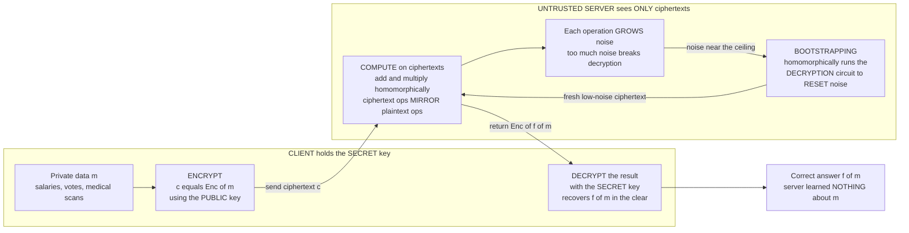

# 🔐 Homomorphic Encryption

> [!abstract] TL;DR
> **Homomorphic encryption (HE)** lets an *untrusted* party **compute on data that stays encrypted** and hand back an encrypted result — one that decrypts to exactly the answer you would have gotten on the plaintext, while the server never sees a single plaintext bit. The trick is that ciphertext arithmetic **mirrors** plaintext arithmetic: for the additively homomorphic **Paillier** scheme, `Enc of a` times `Enc of b` decrypts to `a plus b`; for textbook **RSA**, `Enc of a` times `Enc of b` decrypts to `a times b`. Schemes span a spectrum — **partially** homomorphic (one operation, unbounded: RSA, ElGamal, Paillier), **somewhat/leveled** (both add and multiply but only to a limited depth), and **fully** homomorphic (**FHE** — arbitrary circuits, unbounded add *and* multiply). FHE was the "holy grail" long thought impossible until **Craig Gentry's 2009 lattice-based breakthrough**, whose key idea — **bootstrapping**, homomorphically evaluating the scheme's *own* decryption circuit to reset accumulated **noise** — turns a limited scheme into an unbounded one. HE is a cornerstone **privacy-enhancing technology** for confidential cloud computing and private machine-learning inference, and because modern FHE rests on **lattice / Learning-With-Errors** hardness, it doubles as **post-quantum** crypto. The catch is speed: FHE is still roughly `1000x` to `1,000,000x` slower than plaintext computation.

---

## Intuition

**Analogy — the locked glovebox at the jeweller.** Imagine you hand a jeweller a **transparent, locked glovebox** containing loose gold and gemstones. Built into the box are rubber gloves: the jeweller can reach *inside* and craft a finished necklace — cutting, setting, assembling — **without ever opening the box** and without ever holding the raw materials in their bare hands. When they pass the sealed box back, you use your key (the only one in existence) to open it and lift out the completed piece. The jeweller did all the labour, yet never possessed your gold. Now make the box mathematical: the "gold" is your private data, the "lock" is encryption, and the "gloves" are homomorphic operations. A cloud server does the heavy computation *through* the encryption and returns a sealed result only you can open.

That is the whole miracle in one sentence: **computing on secrets you cannot read.** Ordinarily, to add two numbers a computer must *see* them — so processing data means exposing it. Homomorphic encryption breaks that assumption. Because certain encryption schemes are built on algebra that *commutes with* addition or multiplication, doing arithmetic on the scrambled ciphertexts produces a scrambled version of the arithmetic on the original values. The server manipulates gibberish; the gibberish, once decrypted, is precisely the answer.

---

## How It Works

A **homomorphism** in algebra is a structure-preserving map: a function `phi` where operating and then mapping equals mapping and then operating, i.e. `phi of x times y equals phi of x times phi of y`. A homomorphic *encryption* scheme is exactly this idea weaponised for privacy — the encryption map `Enc` preserves an operation, so a computation on ciphertexts maps back to the corresponding computation on plaintexts. The workflow is always the same four beats: **encrypt locally → ship ciphertexts to an untrusted party → that party computes on the ciphertexts → you decrypt the result.** The party doing the work holds *no* secret key and learns *nothing* about your data.

### The spectrum of "how much" you can compute

Not all schemes preserve every operation. HE is best understood as a ladder of increasing power, each rung paying a steep performance price for more generality.

1. **Partially Homomorphic Encryption (PHE)** — preserves **one** operation, but *unboundedly* many times. **Textbook RSA** and **ElGamal** are **multiplicatively** homomorphic (`Enc of a` times `Enc of b` equals `Enc of a times b`). **Paillier** is **additively** homomorphic (`Enc of a` times `Enc of b` equals `Enc of a plus b`), which also gives *scalar multiplication* by a public constant (`Enc of m` raised to `k` equals `Enc of k times m`). PHE is **efficient and production-ready** for its single operation — Paillier is genuinely deployed for private sums: voting tallies, encrypted counters, salary aggregation, federated-learning gradient sums. See the [[RSA]] note, whose "homomorphic malleability" that ruins textbook RSA as an encryptor is *exactly* the property HE deliberately exploits.
2. **Somewhat / Leveled Homomorphic Encryption (SHE)** — preserves **both** addition *and* multiplication, but only to a **limited depth**. Every operation injects a little **noise** into the ciphertext (an artefact of the lattice constructions below); additions grow noise slowly, multiplications grow it fast, and once noise crosses a ceiling **decryption fails**. A *leveled* scheme is parameterised in advance for a circuit of known multiplicative depth — plenty for many bounded computations (low-degree polynomials, simple statistics) *without* the expensive machinery of full FHE.
3. **Fully Homomorphic Encryption (FHE)** — preserves **arbitrary** computation: any Boolean or arithmetic circuit, unbounded additions *and* multiplications. Because addition and multiplication together are Turing-universal (they build any function), FHE means you can run *any* program on encrypted inputs. This was the fifty-year-old "holy grail," widely suspected impossible.

### Gentry's breakthrough — the noise problem and bootstrapping

The obstacle to FHE was always **noise**. Modern HE hides plaintext by burying it under a small random error term; the secret key strips the error away on decryption. But every homomorphic operation *compounds* that error — multiplications roughly **square** it — so after a handful of multiplications the noise swamps the message and decryption yields garbage. That noise ceiling is exactly what caps SHE at bounded depth.

In his 2009 PhD thesis, **Craig Gentry** cracked it with **bootstrapping**. The insight is almost paradoxical: treat the scheme's *own decryption function* as just another circuit and **evaluate it homomorphically** on a noisy ciphertext, feeding in an *encryption of the secret key*. The homomorphic decryption "cleans" the ciphertext the way real decryption would — but because it runs *under* a fresh encryption, the output is a **new ciphertext of the same plaintext with the noise reset to a low level**. Reset the noise whenever it nears the ceiling and you can compute *forever*: a leveled scheme plus bootstrapping equals a **fully** homomorphic scheme. The price is brutal — bootstrapping is the dominant cost of FHE, historically the difference between "seconds" and "microseconds" per gate — which is why the whole field is a race to make bootstrapping cheap.

### The schemes and libraries

Practical FHE is a small family of lattice constructions, each tuned for a different workload:

- **BGV** and **BFV** — exact **integer** arithmetic; leveled, batched via the Chinese Remainder Theorem ("SIMD" slots) to amortise cost across thousands of values.
- **CKKS** — **approximate** arithmetic on **real and complex numbers**; treats a controlled amount of noise as rounding error, which makes it the natural fit for **machine learning, statistics, and signal processing** on encrypted data.
- **TFHE** — very **fast bootstrapping** over Boolean gates, enabling **programmable** bootstrapping (evaluate a lookup table for free during the noise reset); ideal for arbitrary logic and comparisons.

Mature open-source libraries — **Microsoft SEAL**, **HElib**, **OpenFHE**, Google's HE toolchains, and **Zama's** TFHE stack — now make these usable by non-cryptographers, and all of them rest on the **Learning-With-Errors (LWE)** and **Ring-LWE** lattice assumptions catalogued in [[Computational_Hardness_Assumptions]].

### Flow / Architecture



---

## Key Concepts

### Secondary (intuitive, no CS background needed)

- **Compute on a locked box.** A cloud server can do maths on your data while it stays encrypted, then hand back a locked answer only you can open. It works for you without ever seeing your data.
- **Multiply the scrambles, add the originals.** With Paillier, if you multiply two encrypted numbers you get the encryption of their *sum*. The server tallies encrypted votes into an encrypted total it cannot read.
- **A ladder of power.** *Partial* HE does one operation forever (great for private sums). *Somewhat* HE does both add and multiply, but only a little. *Fully* HE does anything — the breakthrough that was thought impossible.
- **The catch is noise, and the fix is a reset.** Every operation makes the ciphertext a little "noisier"; too noisy and it stops working. **Bootstrapping** magically resets the noise so you can keep computing — but it is slow.

### Undergraduate (a first crypto or algebra course)

- **Homomorphism, literally.** `Enc` is a map that preserves an operation: `Enc of a` `star` `Enc of b` equals `Enc of a` `circ` `b` for some ciphertext operation `star` and plaintext operation `circ`. That is the entire definition.
- **Paillier mechanics.** Public key is a modulus `n equals p times q` and a base `g`; ciphertexts live modulo `n squared`. Encryption is randomised — `c equals g` raised to `m`, times `r` raised to `n`, all mod `n squared`, with a *fresh random* `r` per encryption — so the same plaintext gives different ciphertexts each time (semantic security). The homomorphism: `c1 times c2 mod n squared` decrypts to `m1 plus m2 mod n`.
- **Why RSA is multiplicatively homomorphic.** `Enc of a` times `Enc of b` equals `a` raised to `e` times `b` raised to `e` equals `a times b` raised to `e` equals `Enc of a times b`. This malleability is a *bug* for an encryptor (fixed by OAEP padding, see [[RSA]]) but the *feature* HE builds on.
- **PHE vs SHE vs FHE.** One operation unbounded, versus both operations to bounded depth, versus both operations unbounded — the third requires bootstrapping.
- **Semantic security is mandatory.** HE schemes must be **IND-CPA**: randomised encryption so ciphertexts leak nothing. A deterministic HE scheme would let anyone test guesses by re-encrypting.

### Graduate (advanced cryptography)

- **The LWE foundation.** Modern (S)HE/FHE encrypts by adding a small **error** `e` to a lattice point: a ciphertext is `A times s plus e plus encoding of m`. Security reduces to **Learning With Errors** — distinguishing noisy linear equations from random — which Regev connected to *worst-case* lattice problems (GapSVP, SIVP) and which is believed hard even for **quantum** adversaries. Hence FHE is inherently **post-quantum**; see [[Post_Quantum_Cryptography]].
- **Noise budget and modulus switching.** In BGV/BFV the ciphertext modulus `q` defines a noise budget; each multiplication consumes a chunk, and **modulus switching** (rescaling to a smaller `q`) trims noise between levels to stretch the leveled depth before bootstrapping is needed.
- **Bootstrapping as decryption-under-encryption.** Publishing an encryption of the secret key (the **bootstrapping key**) and homomorphically evaluating `Dec` yields a refreshed ciphertext. **Circular security** — the assumption that it is safe to encrypt the key under itself — is required, and is the main "extra" assumption FHE leans on beyond LWE.
- **The scheme zoo, precisely.** **BGV/BFV** for exact integers with CRT batching; **CKKS** for *approximate* fixed-precision reals (rescaling manages both scale and noise, so it treats noise as controlled rounding — perfect for ML); **TFHE/FHEW** for gate-by-gate Boolean logic with *programmable bootstrapping* that folds a lookup table into the refresh.
- **Where HE sits among "computing on private data."** HE, **Secure Multiparty Computation (MPC)**, and **zero-knowledge proofs** are the three pillars. HE lets **one** party compute on **another's** encrypted data (asymmetric: compute-provider vs data-owner). MPC lets **many** parties **jointly** compute over their **combined** private inputs without any of them revealing their share. ZK proves a statement about hidden data is true without revealing it. They are **complementary and combinable** — e.g. HE for the heavy arithmetic plus ZK to prove the server computed the *right* circuit (HE alone guarantees *privacy*, not *integrity* of the computation). See [[Zero_Knowledge_Proofs]].

---

## Python Demo

```python
# =============================================================================
# THE PAILLIER CRYPTOSYSTEM -- ADDITIVELY HOMOMORPHIC ENCRYPTION FROM SCRATCH.
#
# Goal: make "computing on encrypted data" concrete with a PARTIALLY homomorphic
# scheme. Paillier gives us  Enc(a) * Enc(b) mod n^2  ==  Enc(a + b),  so an
# untrusted SERVER can TALLY encrypted votes / SUM encrypted salaries and return
# an encrypted total it can NEVER read. We then explain (and simulate) why FULLY
# homomorphic encryption -- both add AND multiply, arbitrary circuits -- is far
# harder: NOISE grows with every operation and must be reset by BOOTSTRAPPING.
#
# Pure standard library for all crypto (Python big ints). matplotlib only draws.
# =============================================================================

import random
import math
import matplotlib.pyplot as plt

random.seed(2026)

# --- primality (Miller-Rabin) + prime generation ----------------------------
def is_probable_prime(n, rounds=40):
    if n < 2:
        return False
    for sp in (2, 3, 5, 7, 11, 13, 17, 19, 23, 29, 31, 37):
        if n % sp == 0:
            return n == sp
    d, r = n - 1, 0
    while d % 2 == 0:
        d //= 2
        r += 1
    for _ in range(rounds):
        a = random.randrange(2, n - 1)
        x = pow(a, d, n)
        if x == 1 or x == n - 1:
            continue
        for _ in range(r - 1):
            x = x * x % n
            if x == n - 1:
                break
        else:
            return False
    return True

def gen_prime(bits):
    while True:
        cand = random.getrandbits(bits) | (1 << (bits - 1)) | 1
        if is_probable_prime(cand):
            return cand

def egcd(a, b):
    if b == 0:
        return a, 1, 0
    g, x, y = egcd(b, a % b)
    return g, y, x - (a // b) * y

def modinv(a, m):
    g, x, _ = egcd(a % m, m)
    if g != 1:
        raise ValueError("no modular inverse")
    return x % m

# =============================================================================
# 1) PAILLIER KEY GENERATION
#    Public:  n = p*q  and  g = n + 1   (a standard simplifying choice)
#    Secret:  lambda = lcm(p-1, q-1)  and  mu = (L(g^lambda mod n^2))^{-1} mod n
#    Ciphertexts live modulo n^2.  L(x) = (x - 1) / n.
# =============================================================================
def L(x, n):
    return (x - 1) // n

def paillier_keygen(bits):
    p = gen_prime(bits)
    q = gen_prime(bits)
    while q == p:
        q = gen_prime(bits)
    n = p * q
    nsq = n * n
    lam = (p - 1) * (q - 1) // math.gcd(p - 1, q - 1)   # lcm(p-1, q-1)
    g = n + 1
    mu = modinv(L(pow(g, lam, nsq), n), n)
    pub = (n, g, nsq)
    priv = (lam, mu, n, nsq)
    return pub, priv

def paillier_encrypt(pub, m):
    n, g, nsq = pub
    m = m % n
    while True:                                # fresh random r => IND-CPA
        r = random.randrange(1, n)
        if math.gcd(r, n) == 1:
            break
    return (pow(g, m, nsq) * pow(r, n, nsq)) % nsq

def paillier_decrypt(priv, c):
    lam, mu, n, nsq = priv
    return (L(pow(c, lam, nsq), n) * mu) % n

# --- the two homomorphic operations (done WITHOUT the secret key) ------------
def hom_add(pub, c1, c2):
    """Enc(a) * Enc(b) mod n^2  ==  Enc(a + b).  Server-side, no key needed."""
    _, _, nsq = pub
    return (c1 * c2) % nsq

def hom_scalar_mul(pub, c, k):
    """Enc(m) ^ k mod n^2  ==  Enc(k * m).  Multiply a secret by a PUBLIC scalar."""
    _, _, nsq = pub
    return pow(c, k, nsq)

BITS = 256                                     # TOY size. Real Paillier: 2048+ bit n.
pub, priv = paillier_keygen(BITS)
n = pub[0]
print(f"[keygen] modulus n has {n.bit_length()} bits; ciphertexts live mod n^2")

# =============================================================================
# 2) PROVE THE HOMOMORPHISM: operate on CIPHERTEXTS == encrypt the operation
#    The server multiplies two ciphertexts and NEVER decrypts anything.
# =============================================================================
a, b = 17, 25
ca, cb = paillier_encrypt(pub, a), paillier_encrypt(pub, b)
c_sum = hom_add(pub, ca, cb)                   # server-side: ciphertext product
got = paillier_decrypt(priv, c_sum)            # client-side: open the result
print(f"[homomorphism] Enc({a}) * Enc({b}) decrypts to {got}  == {a}+{b}  "
      f"-> additive = {got == a + b}")

c_scaled = hom_scalar_mul(pub, ca, 4)          # multiply a SECRET by a PUBLIC 4
print(f"[scalar mul]   Enc({a})^4 decrypts to {paillier_decrypt(priv, c_scaled)}"
      f"  == 4*{a} = {4*a}")

# =============================================================================
# 3) A PRIVATE APPLICATION: an untrusted server tallies ENCRYPTED VOTES / SALARIES
#    Each employee encrypts their salary; the server SUMS the ciphertexts into an
#    encrypted TOTAL it cannot read; only HR (the key holder) opens the total.
# =============================================================================
salaries = [82000, 95000, 61000, 120000, 74000, 88000]
enc_salaries = [paillier_encrypt(pub, s) for s in salaries]   # employees encrypt

# --- SERVER SIDE: fold all ciphertexts into one, holding NO key ---------------
enc_total = enc_salaries[0]
for c in enc_salaries[1:]:
    enc_total = hom_add(pub, enc_total, c)     # product of ciphertexts mod n^2

# --- CLIENT SIDE: only now does anyone decrypt --------------------------------
recovered_total = paillier_decrypt(priv, enc_total)
print(f"[private sum]  true total = {sum(salaries)}  "
      f"server-computed total = {recovered_total}  "
      f"-> match = {recovered_total == sum(salaries)}")
print(f"               the server summed 6 salaries WITHOUT reading a single one.")

# =============================================================================
# 4) WHY FULLY HOMOMORPHIC IS HARDER -- a NOISE-GROWTH simulation.
#    Paillier is EXACT (no noise) but does ONE operation. Lattice-based schemes
#    do BOTH add and multiply by hiding m under a small random ERROR that GROWS
#    with every op. Past a ceiling, decryption fails. BOOTSTRAPPING resets it.
#    (Illustrative model: each op multiplies the noise magnitude; multiplications
#     grow it faster than additions -- here a single growth factor for clarity.)
# =============================================================================
growth   = 1.7          # each homomorphic op multiplies the noise (illustrative)
fresh    = 1.0          # noise magnitude of a FRESH ciphertext
ceiling  = 1e12         # decryption FAILS above this (q/2 budget, illustrative)
postboot = 1e3          # bootstrapping resets noise to here (it adds a little too)

# SHE / leveled: NO bootstrapping -- noise climbs until it smashes the ceiling
she = [fresh]
while she[-1] < ceiling * 100:
    she.append(she[-1] * growth)
fail_op = next(i for i, v in enumerate(she) if v > ceiling)

# FHE: bootstrap whenever the NEXT op would cross the ceiling -> sawtooth forever
fhe, boots, cur = [fresh], [], fresh
for op in range(1, len(she) + 30):
    nxt = cur * growth
    if nxt > ceiling:                          # would fail -> BOOTSTRAP first
        cur = postboot
        boots.append(op)
        nxt = cur * growth
    cur = nxt
    fhe.append(cur)

# =============================================================================
# 5) VISUALIZE -- homomorphic correctness, private tally, and the noise wall
# =============================================================================
fig, ax = plt.subplots(1, 3, figsize=(19, 5.6))

# (i) additive homomorphism: decrypt(Enc(a)*Enc(b)) lands on y = a + b
pairs = [(random.randint(0, 500), random.randint(0, 500)) for _ in range(300)]
true_sum = [a + b for a, b in pairs]
dec_sum  = [paillier_decrypt(priv, hom_add(pub,
              paillier_encrypt(pub, a), paillier_encrypt(pub, b))) for a, b in pairs]
ax[0].scatter(true_sum, dec_sum, s=10, color="steelblue", alpha=0.6)
ax[0].plot([0, 1000], [0, 1000], "--", color="crimson", lw=1, label="y = x")
ax[0].set_title("Paillier is ADDITIVELY homomorphic\n"
                "decrypt(Enc(a) * Enc(b) mod n^2) = a + b")
ax[0].set_xlabel("true a + b"); ax[0].set_ylabel("decrypt(Enc(a) * Enc(b))")
ax[0].legend(); ax[0].grid(True, alpha=0.3)

# (ii) private tally: true salaries (hidden from server) vs recovered total
idx = list(range(len(salaries)))
ax[1].bar(idx, salaries, color="lightgray", edgecolor="gray",
          label="individual salaries (server NEVER sees these)")
ax[1].bar([len(salaries)], [recovered_total], color="seagreen",
          label="encrypted total the server computed")
ax[1].axhline(sum(salaries), ls="--", color="crimson", lw=1,
              label=f"true sum = {sum(salaries)}")
ax[1].set_xticks(idx + [len(salaries)])
ax[1].set_xticklabels([f"e{i+1}" for i in idx] + ["TOTAL"])
ax[1].set_title("Private aggregation\n"
                "server sums 6 ENCRYPTED salaries, reads none")
ax[1].set_ylabel("amount"); ax[1].legend(fontsize=8); ax[1].grid(True, alpha=0.3, axis="y")

# (iii) the noise wall: SHE dies at the ceiling; FHE bootstraps forever
ax[2].plot(range(len(she)), she, color="darkorange", lw=1.8,
           label="SHE / leveled: no bootstrapping")
ax[2].plot(range(len(fhe)), fhe, color="royalblue", lw=1.5,
           label="FHE: bootstrapping resets noise")
ax[2].axhline(ceiling, ls="--", color="crimson", lw=1.2,
              label="decryption-failure ceiling")
ax[2].scatter([fail_op], [she[fail_op]], color="red", zorder=5, s=60,
              marker="X", label="SHE decryption FAILS here")
for bop in boots[:6]:
    ax[2].axvline(bop, color="royalblue", ls=":", lw=0.6, alpha=0.5)
ax[2].set_yscale("log")
ax[2].set_title("Why FHE is hard: NOISE grows every op\n"
                "bootstrapping (dotted) refreshes the ciphertext")
ax[2].set_xlabel("number of homomorphic operations")
ax[2].set_ylabel("ciphertext noise magnitude (log scale)")
ax[2].legend(fontsize=8, loc="lower right"); ax[2].grid(True, alpha=0.3, which="both")

plt.tight_layout()
plt.show()

print("\nPaillier gives us ONE operation (addition) with NO noise -- practical today.")
print("Doing BOTH add and multiply forever needs lattice FHE, whose noise must be")
print("reset by expensive BOOTSTRAPPING. That gap is the whole story of the field.")
```

**What the demo shows.** Reading the panels left to right: (i) across 300 random pairs, decrypting the *product of two ciphertexts* lands exactly on the line `y equals a plus b` — visual proof that Paillier's ciphertext multiplication *is* plaintext addition, performed with no secret key; (ii) an untrusted server folds six **encrypted** salaries into one ciphertext and the decrypted total matches the true sum to the cent, while the individual salaries (grey bars) were never visible to it — the essence of privacy-preserving aggregation used in secure voting and federated learning; (iii) the noise simulation contrasts a **leveled** scheme (orange) whose ciphertext noise climbs unchecked until it smashes the decryption ceiling and **fails**, against a **fully** homomorphic scheme (blue) that **bootstraps** at each dotted line to reset the noise and compute indefinitely. Paillier itself is *exact* — it has no noise because it does only one operation; the noise wall is precisely the price of doing **both** operations, and bootstrapping is precisely the (expensive) way to climb it.

---

## Real-World Applications

> **Example — private machine-learning inference in the cloud.** A hospital wants a cloud model to read encrypted MRI features and return a diagnosis *without* the cloud ever seeing patient data. Using **CKKS** (approximate-real FHE, ideal for the matrix multiplies and polynomial-approximated activations of a neural network), the hospital encrypts the input, the server evaluates the model **homomorphically** on ciphertexts, and returns an **encrypted prediction** the hospital alone decrypts. The cloud provider runs the model but is *blind* to both the input and the output — regulatory-grade confidentiality with no trusted middleman. Microsoft SEAL, OpenFHE, and Zama's Concrete-ML target exactly this workflow.

- **Confidential cloud computing.** Outsource storage *and* processing of medical, financial, or genomic data to a provider you do not have to trust with the plaintext — HE keeps it encrypted end to end, even during computation.
- **Private machine-learning / encrypted inference.** Run a model on encrypted inputs (CKKS for real-valued nets); the classic PoC is **CryptoNets**, and it now extends to logistic regression, small CNNs, and encrypted recommendation.
- **Encrypted database queries and private information retrieval (PIR).** Fetch or aggregate over a server's database while hiding *which* records you touched and *what* you computed — a user retrieves an item without the server learning which one.
- **Secure voting and private aggregation.** **Paillier's** additive homomorphism tallies encrypted ballots or sums encrypted metrics (telemetry, ad counts, federated-learning gradients) into an encrypted total, decrypted only by an authority — no individual value is ever exposed.
- **Apple's homomorphic services.** Apple ships **production HE** for privacy features such as Live Caller ID Lookup and encrypted photo/vector search, using OpenFHE-style BFV/BGV so servers answer queries over encrypted client data.
- **Combining with MPC and ZK.** HE handles the heavy per-party computation; **Secure Multiparty Computation** handles multi-party joint computation over combined secrets; [[Zero_Knowledge_Proofs]] certify that the *right* computation was done — together the toolkit of modern **privacy-enhancing technology**.

---

## Common Pitfalls

- **Expecting FHE to be fast.** FHE is still roughly `1000x` to `1,000,000x` slower than plaintext computation, and ciphertexts are orders of magnitude larger than plaintexts. It is practical for **specific, bounded** tasks (a fixed inference, a tally, a low-degree statistic), **not** general-purpose "encrypt your whole program" computing — yet. Choosing FHE where a cheaper PHE (Paillier) or MPC protocol suffices is a common over-engineering trap.
- **Confusing privacy with integrity.** HE guarantees the server does not *see* your data; it does **not** guarantee the server ran the *correct* circuit. A malicious server can return the encryption of a *wrong* answer. You need a **verifiable computation** layer (zk-SNARKs / [[Zero_Knowledge_Proofs]]) or a trust assumption on top. HE alone is honest-but-curious security, not malicious security.
- **Deterministic or unpadded misuse.** HE schemes must be randomised (IND-CPA). **Textbook RSA's** multiplicative homomorphism is real, but RSA-as-deployed uses OAEP padding that *destroys* it — you cannot homomorphically compute on padded RSA. Reaching for "RSA is homomorphic" in production confuses the textbook object with the secure one (see [[RSA]]).
- **Blowing the noise budget (leveled schemes).** With SHE/leveled FHE you must parameterise for your circuit's **multiplicative depth** in advance. Under-provision and decryption silently **fails**; over-provision and every operation is needlessly slow. Multiplications are the expensive ones — additions are nearly free.
- **Ignoring circular-security in bootstrapping.** Bootstrapping publishes an **encryption of the secret key**. This requires the *extra* assumption that a scheme stays secure when its key is encrypted under itself — sound in practice but a real assumption beyond plain LWE, and a subtlety often glossed over.
- **CKKS's approximate results.** CKKS returns *approximate* reals (noise behaves like rounding error). It is superb for ML and statistics but wrong for anything needing **exact** integer equality (use BGV/BFV there). A 2021 line of work also showed naive CKKS decryption can leak information — use the standardised noise-flooding countermeasures.
- **Assuming HE hides everything.** HE hides *values*, not necessarily *metadata*: ciphertext sizes, access patterns, timing, and the *structure* of the computation can still leak. Combine with ORAM / padding when access patterns are sensitive.

---

## Related Concepts

- [[Public_Key_Cryptography_Foundations]] — HE is public-key encryption with an extra algebraic superpower; the public-key/private-key split and IND-CPA semantic security defined there are exactly what HE builds on.
- [[RSA]] — the canonical **multiplicatively** homomorphic scheme; its "homomorphic malleability" (a *bug* fixed by OAEP) is the very property HE turns into a *feature*.
- [[Diffie_Hellman_and_Discrete_Log]] — **ElGamal**, the multiplicatively homomorphic sibling of Diffie–Hellman, is a discrete-log-based PHE; a small tweak makes it additively homomorphic for voting.
- [[Computational_Hardness_Assumptions]] — modern FHE rests on **Learning With Errors (LWE)** and lattice hardness, catalogued here alongside factoring and discrete log; the noise in HE ciphertexts *is* the LWE error term.
- [[Post_Quantum_Cryptography]] — because lattice/LWE hardness is believed to resist Shor's algorithm, lattice-based FHE **doubles as post-quantum** encryption; the two fields share their mathematical foundation.
- [[Zero_Knowledge_Proofs]] — the "integrity" pillar that complements HE's "privacy": ZK proves a computation on hidden data was done correctly, patching HE's honest-but-curious gap.
- [[Groups_Rings_Fields_for_Cryptography]] — a homomorphism is a structure-preserving map between algebraic structures; Paillier operates in the multiplicative group modulo `n squared`, and understanding that group is why its homomorphism works.
- [[Provable_Security_and_Reductions]] — HE security is argued by reduction to LWE / DCRA (Decisional Composite Residuosity for Paillier); this note is the framework for those reductions.
- [[Cryptography_Overview]] — situates HE among the primitives and security goals of the wider cryptographic landscape.

*(Referenced in prose but not yet a note in this vault: **Secure Multiparty Computation (MPC)** — the multi-party counterpart to HE's single-party "compute on another's encrypted data." When that sibling exists it should be cross-linked here, as HE and MPC are complementary and frequently combined pillars of privacy-preserving computation.)*

---

## Review Questions

1. **(Conceptual)** Explain precisely why Paillier lets a server compute an encrypted *sum* it cannot read. State the ciphertext operation the server performs, the plaintext operation it corresponds to, and why the server — holding only the public key — learns nothing about the individual values. Then explain why the scheme *must* be randomised for this to be secure.
2. **(Scenario)** A startup wants to run a neural-network model on customers' encrypted medical records in the cloud, and must (a) keep inputs and outputs private from the cloud, and (b) prove to an auditor that the *correct* model was applied. Which flavour of HE would you choose for the arithmetic and why (BFV vs CKKS vs TFHE)? What does HE alone *fail* to guarantee in requirement (b), and what additional primitive closes that gap?
3. **(Trade-off / deep)** Contrast a **leveled** somewhat-homomorphic scheme against a **fully** homomorphic one with bootstrapping for a computation of known, bounded multiplicative depth. Discuss the noise-budget vs bootstrapping-cost trade-off, why multiplications dominate the cost while additions are nearly free, and the *extra* security assumption (beyond LWE) that bootstrapping introduces. Finally, argue why the same lattice hardness that enables FHE also makes it post-quantum secure — and what that implies for "harvest now, decrypt later."

---

## Sources

- Gentry, C. (2009). *A Fully Homomorphic Encryption Scheme.* PhD thesis, Stanford University. https://crypto.stanford.edu/craig/craig-thesis.pdf — the breakthrough introducing bootstrapping and the first FHE scheme.
- Paillier, P. (1999). "Public-Key Cryptosystems Based on Composite Degree Residuosity Classes." *EUROCRYPT '99*, LNCS 1592, 223–238. — the additively homomorphic scheme implemented in the demo.
- Regev, O. (2009). "On Lattices, Learning with Errors, Random Linear Codes, and Cryptography." *Journal of the ACM*, 56(6). — the LWE assumption underpinning modern FHE and its worst-case-to-average-case reduction.
- Cheon, J. H., Kim, A., Kim, M., & Song, Y. (2017). "Homomorphic Encryption for Arithmetic of Approximate Numbers (CKKS)." *ASIACRYPT 2017*, LNCS 10624, 409–437. — approximate-arithmetic FHE for machine learning.
- Acar, A., Aksu, H., Uluagac, A. S., & Conti, M. (2018). "A Survey on Homomorphic Encryption Schemes: Theory and Implementation." *ACM Computing Surveys*, 51(4). https://arxiv.org/abs/1704.03578 — comprehensive survey of the PHE/SHE/FHE spectrum, schemes, and libraries.
- Microsoft SEAL and OpenFHE documentation. https://github.com/microsoft/SEAL and https://openfhe.org — production HE libraries implementing BGV, BFV, CKKS, and TFHE.

---

#cryptography #homomorphic-encryption #fhe #paillier #privacy-preserving
