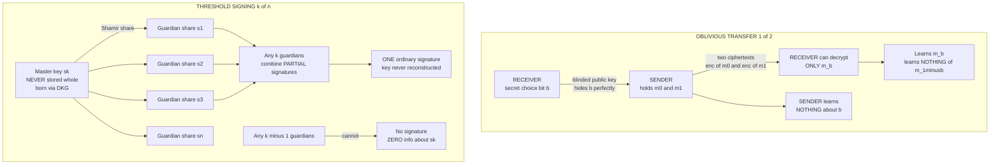

# 🕶️ Oblivious Transfer and Threshold Cryptography

> [!abstract] TL;DR
> Two "impossible-sounding" primitives power modern distributed trust. **Oblivious Transfer (OT)** is a two-party protocol where a **sender** holds messages `m0, m1`, a **receiver** picks a secret bit `b`, and the receiver learns **only** `m_b` while the **sender learns nothing about `b`** — selective access with total choice-privacy, and the receiver learns nothing about `m_(1-b)`. That tiny asymmetry is astonishingly powerful: by **Kilian's theorem, OT is *complete* for secure computation** — *any* secure multi-party computation can be built from OT alone, which is why both **Yao's garbled circuits** and **GMW** use OT to select inputs, and why **OT extension (IKNP)** — bootstrapping millions of OTs from a handful of "base" OTs using only cheap symmetric crypto — is what makes MPC fast enough to deploy. Its flagship application is **Private Set Intersection (PSI)**: two parties learn the *common* elements of their private sets without revealing anything else — the engine behind **Signal / WhatsApp contact discovery**, **Google/Apple ad-conversion measurement**, and **password-breach checking** (Google Password Checkup, Have I Been Pwned's k-anonymity API). **Threshold cryptography** attacks the opposite problem: instead of *combining* private inputs, it *splits* a single cryptographic capability — decryption or signing — across `n` parties so that any **`k`** can cooperate to use it while any **`k-1` cannot**, and the full private key is **never reconstructed in one place**. It is built on **Shamir secret sharing** plus **Distributed Key Generation (DKG)** (so no party ever knows the whole key, even at setup) and yields **threshold signatures** — **threshold ECDSA (GG20)**, **threshold BLS**, and **FROST** for Schnorr — that emit *one ordinary-looking signature*. This is production reality today: **MPC wallets / custody** (Fireblocks, Coinbase, ZenGo hold no single key), **validator / consensus keys** in proof-of-stake chains, **certificate-authority root-key protection**, and **decentralized randomness beacons**. OT builds computation from private inputs; threshold crypto distributes key power so no single party is a point of trust or failure.

---

## Intuition

**Analogy — two cryptographic superpowers.**

**Superpower 1: the oblivious jukebox (Oblivious Transfer).** Imagine a music store with a catalogue of songs. You want to buy exactly **one** track, but you are paranoid about privacy: you do **not** want the store to learn *which* song you chose (maybe your taste is embarrassing, maybe it reveals your politics). At the same time, the store insists — quite reasonably — that you may walk out with only the **one** track you paid for, not the whole catalogue. Oblivious Transfer squares this circle. You hand the clerk a specially "blinded" request; the clerk fulfils it and hands back sealed packages; you can open **only** the package for your chosen song and no other; and the clerk, staring at your request, has **no idea** which song you picked. Selective access *and* choice-privacy, simultaneously — a transaction where the buyer is oblivious to the other goods and the seller is oblivious to the buyer's choice.

**Superpower 2: the guardians of the master key (Threshold Cryptography).** Now imagine a billion-dollar vault whose key, if any one person held it, would be a single point of catastrophe — steal that laptop, bribe that insider, and it's over. Instead you take the *power to open the vault* and split it among **five guardians** so that any **three** must cooperate to act, but no lone guardian — and no two colluding guardians — can do anything at all. Crucially, the full key is never assembled on any one desk, not even for an instant: the three guardians combine *partial* actions that produce a valid result while the key itself stays a ghost that exists nowhere. No single stolen laptop leaks it; no lone insider can act.

In the technical domain, superpower 1 is the atomic building block of **secure computation** (compute on data nobody will reveal), and superpower 2 is the atomic building block of **distributed trust** (wield a key nobody should solely hold). Together they take cryptography from "protect *my* secret" to "let mutually-distrustful parties act *jointly* and *privately*."

---

## How It Works

### Oblivious Transfer: the complete primitive

A **1-out-of-2 OT** involves a sender with two strings `m0, m1` and a receiver with a choice bit `b`. After the protocol the receiver holds `m_b` and *nothing* about `m_(1-b)`; the sender holds *nothing* about `b`. A clean discrete-log construction (Bellare-Micali style) makes the magic concrete:

1. Fix a group of prime order with generator `g` and a public element `C` whose discrete log **nobody** knows.
2. The receiver picks random `k` and sends the sender **one** public key `PK0`, defining `PK1 = C / PK0` implicitly. It arranges things so that `PK0 = g^k` (knowing its discrete log) when `b = 0`, or `PK1 = g^k` when `b = 1`. Because `g^k` is uniformly random, the value the sender sees is **identically distributed** whichever bit was chosen — *perfect* choice-privacy.
3. The sender ElGamal-encrypts `m0` under `PK0` and `m1` under `PK1` and returns both ciphertexts.
4. The receiver knows the discrete log of exactly **one** public key (the one equal to `g^k`), so it can decrypt exactly one message — `m_b`. Recovering the other would require the discrete log of `C`, which it does not have (a **CDH** hardness argument).

**Why it is a big deal — Kilian's theorem.** OT looks almost trivial, yet it is **complete for secure computation**: given a black box that does OT, you can build a protocol for *any* function that two (or more) mutually-distrustful parties want to jointly evaluate on private inputs, revealing only the output. This is the cryptographic bedrock of MPC — **Yao's garbled circuits** use OT to let the evaluator fetch the wire-labels for *its* input bits without revealing them, and **GMW** uses OT to multiply secret-shared bits. See the (forthcoming) `Secure_Multiparty_Computation` sibling and the applied [[Multi_Party_Computation]] note.

**OT extension makes it practical.** Naive OT costs one or more **public-key** operations *per transfer*, and MPC needs millions of them — far too slow. **OT extension (the IKNP protocol)** performs a small number of "base" OTs with public-key crypto and then produces *arbitrarily many* further OTs using only cheap **symmetric** primitives (hashing, a PRG). This is the efficiency breakthrough that turned OT-based MPC from theory into deployed systems. See [[Symmetric_Encryption_Fundamentals]] and [[Hash_Functions]].

**Private Set Intersection (PSI) — the flagship app.** Two parties, each with a private set (your phone contacts vs. the server's user list), want to learn the **intersection** and nothing else. OT-based (and hashing/homomorphic) PSI protocols achieve exactly this and are widely deployed: **contact discovery** in Signal and WhatsApp, **ad-conversion measurement** between advertisers and platforms (Google/Apple), and **password-breach checking** (Have I Been Pwned's k-anonymity range query, Google Password Checkup) — the latter a lightweight PSI-flavoured design that reveals a hash prefix so you learn *whether your password leaked* without either side revealing the full credential. See [[Password_Hashing_and_KDFs]] and [[Secure_Messaging_and_Signal_Protocol]].

### Threshold Cryptography: distributing key power

Threshold cryptography starts from **Shamir secret sharing**: encode a secret `s` as the constant term of a random degree-`(k-1)` polynomial `f`, hand party `i` the point `(i, f(i))`, and observe that any **`k`** points reconstruct `f(0) = s` by Lagrange interpolation while any **`k-1`** points leave `s` *information-theoretically* undetermined (every candidate secret is equally consistent). See [[Commitment_Schemes]] and [[Probability_and_Information_Theoretic_Security]], plus the planned `Commitment_Schemes_and_Secret_Sharing` sibling.

Two ingredients turn sharing into *usable* distributed crypto:

- **Distributed Key Generation (DKG).** Rather than trust a dealer who briefly knows `s`, the parties run a protocol (Pedersen DKG + Feldman verifiable secret sharing) that produces a shared public key and per-party shares such that **no party ever knows the full private key — not even at setup**.
- **Threshold signing / decryption.** The parties compute *partial* signatures or partial decryptions from their shares and combine them (via Lagrange coefficients **in the exponent**) into a **single valid** signature or plaintext — *without ever reconstructing the key in one place*. Schemes: **threshold ECDSA** (GG18/GG20 — harder, needs homomorphic encryption and OT for the `k^-1` step), **threshold BLS** (trivially aggregatable via pairings), and **FROST** for **Schnorr** (round-optimized, IETF RFC 9591). The output is **indistinguishable from an ordinary signature** — the blockchain or verifier cannot even tell it was produced by a committee. See [[Digital_Signatures]], [[ECDSA_and_Digital_Signatures]], and [[Elliptic_Curve_Cryptography]].

### Flow / Architecture



---

## Key Concepts

### Secondary (intuitive, no CS background needed)

- **Oblivious Transfer = the private jukebox.** Buy one song; the store never learns which; you can't sneak the rest.
- **Threshold crypto = many guardians, one power.** Any `k` of `n` guardians can act together; fewer can do nothing; the master key never sits whole on any desk.
- **No single point of failure or trust.** Steal one guardian's laptop and you get *nothing usable* — you'd need `k` of them at once.
- **The result looks normal.** A threshold signature is indistinguishable from a signature made by one person with one key.

### Undergraduate (a first security or theory course)

- **1-out-of-2 OT, formally.** Sender inputs `(m0, m1)`, receiver inputs `b`; receiver output `m_b`; two security goals — **receiver privacy** (`b` hidden from sender) and **sender privacy** (`m_(1-b)` hidden from receiver).
- **OT is complete (Kilian).** Any secure two-party or multi-party computation reduces to OT; garbled circuits and GMW both consume OTs.
- **OT extension (IKNP).** A few base OTs plus symmetric crypto yield millions of OTs — the practicality enabler.
- **Private Set Intersection.** Learn only the shared elements of two private sets; deployed in contact discovery and breach checking.
- **Shamir secret sharing.** Degree-`(k-1)` polynomial; `k` shares reconstruct, `k-1` reveal nothing (information-theoretic).
- **Threshold signature vs. multisig.** Multisig is an *on-chain policy* showing `n` keys; a **threshold signature** is *off-chain crypto* emitting one signature — cheaper, private, but trusts the MPC implementation.

### Graduate (advanced / applied cryptography)

- **Bellare-Micali / Chou-Orlandi OT.** DH-based `1-of-2` OT: security rests on **CDH** in the random-oracle model; the receiver knows the discrete log of exactly one of two public keys summing to a common `C`.
- **OT flavours.** `1-of-n` OT, **random OT** (correlated random outputs, the natural target of extension), **correlated OT (COT)** and **authenticated (TinyOT)** variants that feed Boolean/arithmetic MPC and the SPDZ family.
- **Silent OT / VOLE.** Modern **pseudorandom-correlation-generator (PCG)** techniques (Ferret, Silver) produce OT correlations with sublinear communication — the current efficiency frontier.
- **Threshold ECDSA (GG20).** ECDSA's multiplicative `k^-1` blocks naive additivity; GG18/GG20 use **Paillier homomorphic encryption** and **committed OT** to jointly compute `k^-1(z + r*d)`; MPC-CMP improves round complexity. See the planned `Homomorphic_Encryption` sibling.
- **FROST + threshold BLS.** Schnorr's linearity gives clean 2-round FROST; **BLS** signatures aggregate via pairings, so threshold BLS is a single Lagrange combination in the exponent — the basis of drand/DFINITY randomness beacons.
- **DKG + proactive/verifiable sharing.** Pedersen DKG removes the trusted dealer; **Feldman/Pedersen VSS** lets parties detect bad shares; **proactive secret sharing** re-randomizes shares so old ones expire, bounding a slow-compromise attacker.
- **Trust and completeness in context.** OT, threshold crypto, secret sharing, commitments, ZK, and HE are the "advanced-primitive" toolbox — OT **builds** computation, threshold crypto **distributes** key power. See [[Zero_Knowledge_Proofs]] and [[Provable_Security_and_Reductions]].

---

## Python Demo

```python
# OBLIVIOUS TRANSFER + THRESHOLD CRYPTOGRAPHY -- two distributed-trust superpowers.
#
#   (a) 1-out-of-2 OBLIVIOUS TRANSFER (Bellare-Micali style, discrete-log group):
#       sender holds m0, m1; receiver picks bit b; receiver decrypts ONLY m_b;
#       sender cannot tell b (choice-privacy); receiver cannot read m_(1-b).
#   (b) THRESHOLD ElGamal via Shamir (k,n) secret sharing:
#       a master key is SHARED, never stored whole; any k parties jointly DECRYPT
#       (Lagrange in the exponent -- the key is NEVER reconstructed); any k-1 FAIL.
#
# Parameter sizes are tiny -- the point is the MATH, not real security.
# Pure standard library + hashlib; matplotlib only to visualise. Python 3.8+ (pow(a,-1,m)).

import hashlib
import random
import matplotlib.pyplot as plt

random.seed(7)  # reproducible demo -- real crypto MUST use a CSPRNG

# ---------------------------------------------------------------------------
# A small prime-order group:  safe prime p = 2q+1, g generates the order-q subgroup
# ---------------------------------------------------------------------------
def is_probable_prime(n, rounds=20):
    if n < 2:
        return False
    for sp in (2, 3, 5, 7, 11, 13, 17, 19, 23, 29, 31, 37):
        if n % sp == 0:
            return n == sp
    d, r = n - 1, 0
    while d % 2 == 0:
        d //= 2; r += 1
    for _ in range(rounds):
        a = random.randrange(2, n - 1)
        x = pow(a, d, n)
        if x in (1, n - 1):
            continue
        for _ in range(r - 1):
            x = pow(x, 2, n)
            if x == n - 1:
                break
        else:
            return False
    return True

def gen_safe_prime(bits=192):
    while True:
        q = random.getrandbits(bits) | 1 | (1 << (bits - 1))
        if is_probable_prime(q) and is_probable_prime(2 * q + 1):
            return 2 * q + 1, q

p, q = gen_safe_prime()
g = pow(random.randrange(2, p - 1), 2, p)          # a quadratic residue -> order q

def kdf(elem: int, length: int) -> bytes:
    """Hash a group element into `length` keystream bytes (a one-time pad)."""
    out, ctr = b"", 0
    base = elem.to_bytes((elem.bit_length() + 7) // 8 or 1, "big")
    while len(out) < length:
        out += hashlib.sha256(base + ctr.to_bytes(4, "big")).digest()
        ctr += 1
    return out[:length]

def xor(a: bytes, b: bytes) -> bytes:
    return bytes(x ^ y for x, y in zip(a, b))

def pad16(m: bytes) -> bytes:
    return m[:16].ljust(16, b" ")

# ===========================================================================
# (a) 1-OUT-OF-2 OBLIVIOUS TRANSFER  (Bellare-Micali)
# ===========================================================================
# Public element C whose discrete log NOBODY (esp. the receiver) knows.
C = pow(g, random.randrange(2, q), p)              # dlog kept secret & never used

def ot_receiver_request(b):
    """Receiver picks nonce k; sends PK0. It knows dlog of exactly one of PK0,PK1."""
    k = random.randrange(1, q)
    gk = pow(g, k, p)
    PK0 = gk if b == 0 else (C * pow(gk, -1, p)) % p   # if b=1, PK1 = g^k
    return k, PK0

def ot_sender(PK0, m0, m1):
    """Sender ElGamal-encrypts m_i under PK_i, where PK0*PK1 = C."""
    PK1 = (C * pow(PK0, -1, p)) % p
    cts = []
    for PKi, mi in ((PK0, m0), (PK1, m1)):
        r = random.randrange(1, q)
        E = pow(g, r, p)                            # ephemeral public value
        key = pow(PKi, r, p)                        # PKi^r  (only decryptable with dlog(PKi))
        cts.append((E, xor(mi, kdf(key, len(mi)))))
    return cts

def ot_receiver_decrypt(b, k, cts):
    E, ct = cts[b]
    return xor(ct, kdf(pow(E, k, p), len(ct)))      # E^k = PK_b^r  -> correct pad

song0, song1 = pad16(b"Bohemian Rhaps"), pad16(b"Imagine (Lennon)")

# --- functional check: receiver gets m_b, and CANNOT read m_(1-b) ---
choice_ok = other_hidden = True
for b in (0, 1):
    k, PK0 = ot_receiver_request(b)
    cts = ot_sender(PK0, song0, song1)
    got = ot_receiver_decrypt(b, k, cts)
    choice_ok &= (got == (song0 if b == 0 else song1))
    # try to peek at the OTHER message using the same key -> garbage
    E_other, ct_other = cts[1 - b]
    peek = xor(ct_other, kdf(pow(E_other, k, p), len(ct_other)))
    other_hidden &= (peek != (song1 if b == 0 else song0))
print(f"(a) OT correctness : receiver always recovers m_b        = {choice_ok}   (expect True)")
print(f"    OT sender-priv : receiver CANNOT read m_(1-b)        = {other_hidden} (expect True)")

# --- choice-privacy: can the sender guess b from PK0? Should be ~50% ---
TRIALS, correct = 2000, 0
for _ in range(TRIALS):
    b = random.randint(0, 1)
    _, PK0 = ot_receiver_request(b)
    guess = 0 if PK0 < p // 2 else 1               # any heuristic -> useless, PK0 is uniform
    correct += (guess == b)
sender_guess_acc = correct / TRIALS
print(f"    OT choice-priv : sender guess accuracy for b         = {sender_guess_acc:.3f} (expect ~0.50)")

# ===========================================================================
# (b) THRESHOLD ElGamal via SHAMIR (k, n) SECRET SHARING
# ===========================================================================
N, K = 5, 3                                          # 3-of-5

def poly_eval(coeffs, x, mod):
    acc = 0
    for a in reversed(coeffs):
        acc = (acc * x + a) % mod
    return acc

def make_shares(secret, k, n, mod):
    coeffs = [secret] + [random.randrange(0, mod) for _ in range(k - 1)]  # degree k-1
    return [(i, poly_eval(coeffs, i, mod)) for i in range(1, n + 1)]

def lagrange_at0(xs, i, mod):
    """Lagrange basis coefficient L_i(0) for interpolating through points xs."""
    xi, num, den = xs[i], 1, 1
    for j, xj in enumerate(xs):
        if j == i:
            continue
        num = (num * (-xj)) % mod
        den = (den * (xi - xj)) % mod
    return (num * pow(den, -1, mod)) % mod

# Master keypair: secret s, public h = g^s.  Share s -- NEVER stored whole.
s = random.randrange(1, q)
h = pow(g, s, p)
shares = make_shares(s, K, N, q)

# Encrypt a secret payload under h (hashed-ElGamal): c1 = g^r, c2 = M xor KDF(h^r)
M = pad16(b"launch-code-42!!")
r = random.randrange(1, q)
c1 = pow(g, r, p)
c2 = xor(M, kdf(pow(h, r, p), len(M)))

def threshold_decrypt(subset):
    """Combine PARTIAL decryptions c1^{s_i} via Lagrange -> c1^s, WITHOUT rebuilding s."""
    xs = [i for (i, _) in subset]
    combined = 1
    for idx, (i, si) in enumerate(subset):
        partial = pow(c1, si, p)                     # party i's partial decryption
        combined = (combined * pow(partial, lagrange_at0(xs, idx, q), p)) % p
    return xor(c2, kdf(combined, len(c2)))           # == M only if we truly hit c1^s

# Any K succeed; any K-1 fail -- test every subset size 1..N (first `size` parties)
success_by_size = []
for size in range(1, N + 1):
    ok = (threshold_decrypt(shares[:size]) == M)
    success_by_size.append(1 if ok else 0)
    tag = "DECRYPTS" if ok else "fails"
    print(f"(b) threshold {size}-of-{N}: {size} parties -> {tag}")
print(f"    -> any {K} of {N} reconstruct c1^s in the exponent; {K-1} learn NOTHING")

# ---------------------------------------------------------------------------
# VISUALISE
# ---------------------------------------------------------------------------
fig, ax = plt.subplots(1, 2, figsize=(14, 5.5))

# Left: OT -- selective access + choice-privacy
labels = ["receiver reads\nm_b", "receiver reads\nm_(1-b)", "sender guesses\nchoice b"]
vals = [1.0 if choice_ok else 0.0, 0.0 if other_hidden else 1.0, sender_guess_acc]
cols = ["seagreen", "seagreen", "slateblue"]
ax[0].bar(labels, vals, color=cols, edgecolor="black")
ax[0].axhline(0.5, ls="--", color="gray")
ax[0].text(2, 0.53, "coin-flip = no info", color="gray", ha="center", fontsize=9)
for i, v in enumerate(vals):
    ax[0].text(i, v + 0.03, f"{v:.2f}", ha="center", fontweight="bold")
ax[0].set_ylim(0, 1.2); ax[0].set_ylabel("probability")
ax[0].set_title("Oblivious Transfer\nselective access + choice-privacy")

# Right: threshold k-of-n decryption
sizes = list(range(1, N + 1))
bar_cols = ["seagreen" if v else "crimson" for v in success_by_size]
ax[1].bar(sizes, success_by_size, color=bar_cols, edgecolor="black")
ax[1].axvline(K - 0.5, ls="--", color="black")
ax[1].text(K - 0.5, 1.08, f"threshold k = {K}", ha="center", fontweight="bold")
for xk, v in zip(sizes, success_by_size):
    ax[1].text(xk, 0.5, "OK" if v else "FAIL", ha="center", va="center",
               color="white", fontweight="bold")
ax[1].set_ylim(0, 1.25); ax[1].set_xticks(sizes)
ax[1].set_xlabel("number of cooperating parties"); ax[1].set_yticks([0, 1])
ax[1].set_yticklabels(["denied", "decrypts"])
ax[1].set_title(f"Threshold decryption ({K}-of-{N})\nany k succeed, k-1 are powerless")

plt.tight_layout()
plt.show()

print("\nTakeaway: OT gives the receiver exactly ONE message while hiding the choice from")
print("the sender (a) -- the atom of secure computation. Threshold crypto lets any k of n")
print("wield a key that is NEVER assembled in one place, and k-1 get nothing (b).")
```

**What the demo shows.** Part (a) implements a real `1-out-of-2` Oblivious Transfer over a discrete-log group. The receiver's request `PK0` equals `g^k` (a uniformly random group element) regardless of the chosen bit `b`, so the sender's best "guess" of `b` collapses to a coin flip — the printout confirms accuracy `~0.50`. The receiver decrypts exactly its chosen song, and an attempt to reuse its key on the *other* ciphertext yields garbage (recovering it would need the discrete log of `C`, which it never learns) — selective access with perfect choice-privacy. Part (b) is authentic **threshold ElGamal**: the master secret `s` is Shamir-shared and *never assembled*; each party contributes a **partial decryption** `c1^(s_i)`, and Lagrange coefficients combine these **in the exponent** to reconstruct `c1^s` and recover the plaintext — but only when at least `k = 3` parties participate. With `k-1` parties the Lagrange combination lands on the wrong exponent and decryption fails, exactly as the information-theoretic security of secret sharing predicts. The left plot visualizes OT's selective-access + choice-privacy; the right plot shows the sharp `k`-of-`n` threshold — a step from "denied" to "decrypts" precisely at three cooperating parties.

---

## Real-World Applications

> **Example — MPC custody wallets sign with a key that exists nowhere.** Institutional custodians like **Fireblocks**, **Coinbase**, and **ZenGo** protect billion-dollar wallets with **threshold ECDSA** (e.g. GG20 / MPC-CMP). The signing key is generated by **DKG** and split across geographically separated servers or an MPC-CMP-secured mobile device; to authorize a transaction, a threshold of nodes run the signing protocol and emit a **single ordinary ECDSA signature** that the blockchain verifies like any other. No HSM, laptop, or datacenter ever holds the whole key, so there is **no single point of theft** — an attacker must simultaneously compromise a threshold of independent parties. Fireblocks processed trillions of dollars this way without a custody-key breach. See [[ECDSA_and_Digital_Signatures]] and [[Cryptographic_Primitives_Blockchain]].

- **Validator and consensus keys.** Proof-of-stake chains distribute block-signing across operators to avoid a single compromised key equivocating; **threshold BLS** underpins randomness beacons and consensus signing in systems like DFINITY and drand, and distributed-validator tech (e.g. Obol/SSV) splits Ethereum validator keys. See [[Consensus_Mechanisms]].
- **Certificate Authority root-key protection.** A CA's root private key is catastrophic if stolen; threshold-protecting it (shares held by separate officers / HSMs, a quorum needed to sign) removes the lone-insider and single-device risks. See [[Key_Management_and_Distribution]].
- **Private contact discovery (PSI).** Signal and WhatsApp match your address book against their user base using private-set-intersection-style protocols so the server does not learn your entire contact list. See [[Secure_Messaging_and_Signal_Protocol]].
- **Password-breach checking.** Google Password Checkup and Have I Been Pwned's k-anonymity API let you learn whether your credential appears in a breach corpus without revealing the password — a PSI-flavoured, OT/hashing-based design. See [[Password_Hashing_and_KDFs]] and [[Hash_Functions]].
- **Privacy-preserving ad measurement.** Google and Apple use PSI (and MPC) to measure ad conversions by intersecting advertiser and platform records without exposing individual users — a large-scale deployment of OT-derived techniques.
- **General MPC frameworks.** OT (via OT extension) is the engine under practical two-party and multi-party computation used for privacy-preserving analytics, auctions, and machine learning. See [[Multi_Party_Computation]].

---

## Common Pitfalls

- **Confusing threshold signatures with on-chain multisig.** A **multisig** publishes `n` public keys and a policy on-chain (visible, `O(n)` verification cost); a **threshold signature** is off-chain MPC that emits *one* signature (private, `O(1)` verification) but requires trusting the MPC *implementation*. Picking the wrong one leaks your policy or overpays gas. See [[Digital_Signatures]].
- **Skipping DKG and trusting a dealer.** Generating the key on one machine and then splitting it means that machine *was* a single point of compromise. Use **Distributed Key Generation** so no party ever knows the whole key — even at setup.
- **No verifiable secret sharing.** Without **Feldman/Pedersen VSS**, a malicious dealer or party can hand out inconsistent shares that silently corrupt later reconstruction. Always let parties *verify* shares against public commitments.
- **Ignoring abort / blame handling.** MPC and threshold protocols can be aborted by a single misbehaving party; production systems need identifiable-abort (who cheated) and restart logic, or a malicious node causes a denial of service.
- **Mis-setting the threshold.** `k = n` (unanimity) kills liveness — one offline guardian freezes the vault; `k = 1` kills security. Choose `k` to balance availability against collusion resistance (the **Ronin bridge** lost 624M USD because attackers reached *exactly* the 5-of-9 threshold via compromised validators).
- **Reusing OT randomness / weak base OTs.** OT extension amplifies its base OTs; if the base OTs or their PRG seeds are weak or reused, *all* derived OTs — and the MPC built on them — are compromised. See [[Symmetric_Encryption_Fundamentals]].
- **Assuming a plain protocol resists malicious parties.** Many textbook OT/threshold constructions are only **semi-honest** secure. Real deployments need malicious-secure variants (committed/authenticated OT, robust threshold signing) or an active attacker breaks privacy or forges output.
- **Reconstructing the key "just this once."** The whole point is that `sk` never exists in one place. Any code path that assembles the full key (even transiently, for convenience) reintroduces the single point of failure the scheme was built to eliminate.

---

## Related Concepts

- [[Multi_Party_Computation]] — the applied deep-dive on TSS, Shamir, DKG, and OT; OT is the *complete* primitive that this note formalizes and MPC consumes wholesale.
- [[Commitment_Schemes]] — commitments (Feldman/Pedersen) are what make secret sharing *verifiable* and DKG robust against a cheating dealer.
- [[Digital_Signatures]] — threshold signatures produce an *ordinary* signature from `k` of `n` signers; this is that primitive, distributed.
- [[ECDSA_and_Digital_Signatures]] — threshold ECDSA (GG20) is the workhorse of MPC custody; here is the single-signer scheme it distributes.
- [[Cryptographic_Primitives_Blockchain]] — threshold BLS/ECDSA and DKG sit alongside hashes and signatures as the primitives securing distributed ledgers.
- [[Consensus_Mechanisms]] — validator/consensus signing and threshold randomness beacons rely on distributed key power.
- [[Hash_Functions]] — OT extension and PSI lean on cheap symmetric hashing; breach-checking PSI matches over hashes.
- [[Symmetric_Encryption_Fundamentals]] — OT extension bootstraps millions of OTs from a few base OTs using only symmetric crypto.
- [[Zero_Knowledge_Proofs]] — a sibling advanced primitive; ZK range proofs guard threshold-ECDSA against cheating parties, and OT/ZK/HE/MPC form one toolkit.
- [[Diffie_Hellman_and_Discrete_Log]] — the CDH/discrete-log hardness that the Bellare-Micali OT and threshold ElGamal in the demo rest on.
- [[Elliptic_Curve_Cryptography]] — real threshold ECDSA/BLS/FROST live on elliptic-curve groups.
- [[Key_Management_and_Distribution]] — threshold crypto is the strongest form of key protection: distribute the key so no device or insider is a single point of compromise.
- [[Secure_Messaging_and_Signal_Protocol]] — Signal's private contact discovery is a flagship PSI deployment.
- [[Password_Hashing_and_KDFs]] — password-breach checking (k-anonymity / Password Checkup) is a PSI-flavoured application.
- [[Provable_Security_and_Reductions]] — Kilian's completeness of OT and the CDH-based OT security proofs are reduction arguments.
- [[Probability_and_Information_Theoretic_Security]] — Shamir sharing gives *information-theoretic* secrecy: `k-1` shares reveal nothing.

*(Forthcoming siblings in this Cryptography vault — `Secure_Multiparty_Computation`, `Commitment_Schemes_and_Secret_Sharing`, `Homomorphic_Encryption`, and `Blockchain_Cryptography` — are referenced in prose above and will each deepen a slice of this note once written.)*

---

## Review Questions

1. **(Conceptual)** Explain *why* Oblivious Transfer is called "complete" for secure computation, and give the two OT security properties (receiver privacy and sender privacy) in your own words. In Yao's garbled circuits, precisely which step uses OT and what would break if the sender could learn the receiver's choice bit?
2. **(Scenario)** A custody startup must let any 3 of 5 servers authorize withdrawals with a key that never exists in one place, and the on-chain footprint must look like a normal single signature. Do you choose a 3-of-5 **on-chain multisig** or a 3-of-5 **FROST / threshold-ECDSA** scheme? Justify in terms of on-chain visibility, verification cost, key-rotation, and the trust you must place in the MPC implementation — and explain what role DKG plays at setup.
3. **(Trade-off)** In a `k`-of-`n` threshold scheme, discuss the tension in choosing `k`: what fails at `k = 1`, what fails at `k = n`, and how the **Ronin bridge** incident illustrates the danger. Then contrast the *information-theoretic* security of Shamir shares (why `k-1` shares leak nothing) with the *computational* security that OT and threshold ECDSA rely on — and explain why that distinction matters for a post-quantum adversary.

---

## Sources

- Rabin, M. O. (1981). *How to Exchange Secrets with Oblivious Transfer.* Harvard Aiken Lab TR-81. https://eprint.iacr.org/2005/187 — the original OT primitive.
- Kilian, J. (1988). "Founding Cryptography on Oblivious Transfer." *STOC 1988.* https://dl.acm.org/doi/10.1145/62212.62215 — OT is complete for secure computation.
- Ishai, Y., Kilian, J., Nissim, K., & Petrank, E. (2003). "Extending Oblivious Transfers Efficiently" (IKNP OT extension). *CRYPTO 2003.* https://www.iacr.org/archive/crypto2003/27290145/27290145.pdf
- Shamir, A. (1979). "How to Share a Secret." *Communications of the ACM* 22(11). https://dl.acm.org/doi/10.1145/359168.359176 — the basis of threshold cryptography.
- Gennaro, R., & Goldfeder, S. (2020). "One Round Threshold ECDSA with Identifiable Abort" (GG20). https://eprint.iacr.org/2020/540 — production threshold ECDSA.
- Komlo, C., & Goldberg, I. (2021). "FROST: Flexible Round-Optimized Schnorr Threshold Signatures." *SAC 2020* / IETF RFC 9591 (2024). https://eprint.iacr.org/2020/852
- Pinkas, B., Schneider, T., & Zohner, M. (2018). "Scalable Private Set Intersection Based on OT Extension." *ACM TOPS.* https://eprint.iacr.org/2016/930 — OT-based PSI behind contact discovery.

---

#cryptography #oblivious-transfer #threshold-cryptography #mpc #private-set-intersection
