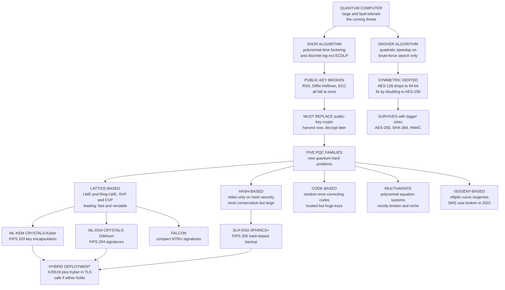

# 🔐 Post-Quantum Cryptography

> [!abstract] TL;DR
> **Post-quantum cryptography (PQC)** is the urgent, civilization-scale effort to replace the public-key crypto securing the entire internet — **RSA, Diffie–Hellman, and elliptic-curve cryptography** — *before* a large quantum computer arrives to break it. The rupture is **Shor's algorithm**, which solves **integer factorization** and the **discrete logarithm** (including ECDLP) in polynomial time, shattering *all* of today's public-key schemes at once. **Grover's algorithm** only *quadratically* speeds unstructured search, so **symmetric crypto and hashes survive** by doubling sizes (AES-256, SHA-384). The asymmetry — **replace public-key, resize symmetric** — defines the whole migration. Because adversaries can already **"harvest now, decrypt later,"** long-lived secrets are *already* at risk, so we must migrate before "Q-day." The replacements rest on **new quantum-hard problems**, with five families: **lattice** (LWE / Ring-LWE, the leading choice — fast, versatile, powers encryption *and* signatures *and* homomorphic encryption), **hash-based** (the most conservative), **code-based** (old, trusted, huge keys), **multivariate** (mostly broken), and **isogeny** (SIKE was broken in 2022 — a cautionary tale). NIST's open competition standardized the winners in 2024: **ML-KEM (Kyber)** for key encapsulation, **ML-DSA (Dilithium)** and **Falcon** for signatures, and **SLH-DSA (SPHINCS+)** as a hash-based backup. Deployment favors **hybrid** schemes (classical + PQC, e.g. X25519 + Kyber) and demands **crypto-agility** as a first-class design requirement.

---

## Intuition

**Analogy — a skeleton key for one specific kind of lock.** Imagine every safe in the world uses the same style of combination lock, "hard" because trying all combinations would take an attacker longer than the age of the universe. Now imagine someone invents a device that, held against *that specific style of lock*, spins straight to the correct combination in seconds. It does not pick every lock — only the ones built on that one clever mechanism. That device is **Shor's algorithm**, and the mechanism it defeats is the "multiply-is-easy, factor-is-hard" trick behind RSA and the discrete-log trick behind Diffie–Hellman and elliptic curves. A big enough quantum computer turns their "impossible" math into *easy* math.

Post-quantum cryptography is the scramble to install **new locks built on a completely different mechanism** — one the skeleton key cannot touch. The leading new mechanism is **geometric**: hide your secret inside a vast grid of points in hundreds of dimensions (a **lattice**), where even a quantum computer cannot find the shortest path to the nearest point. And there is a clock: an adversary can **photograph your locked safe today** and keep it until the skeleton key is built, so anything that must stay secret for decades — state secrets, health records, genomes — is *already* being stolen for later. The migration must finish **before** the quantum threat is real, not after.

---

## How It Works

### The quantum threat: an asymmetric attack

Quantum computers do not make *everything* faster — they exploit specific mathematical structure. Two algorithms matter for cryptography, and they hit it very differently:

1. **Shor's algorithm (catastrophic for public-key).** A large fault-tolerant quantum computer running [[Shors_Factoring_Algorithm]] solves **integer factorization** and the **discrete logarithm** — including the **elliptic-curve** variant (ECDLP) — in *polynomial* time. Since [[RSA]] rests on factoring, [[Diffie_Hellman_and_Discrete_Log]] on discrete log, and [[Elliptic_Curve_Cryptography]] on ECDLP, Shor breaks **all deployed public-key cryptography simultaneously**. There is no "bigger key" fix: polynomial-time means a 4096-bit RSA modulus buys only a constant factor, not safety.
2. **Grover's algorithm (a mere dent for symmetric).** [[Grovers_Search_Algorithm]] gives only a **quadratic** speedup on unstructured brute-force search: an `n`-bit key that took `2^n` classical work takes about `2^(n/2)` quantum work. So AES-128 drops to ~64-bit security (broken), but **doubling the key** to AES-256 restores 128-bit quantum security. Hash functions degrade similarly and are fixed by larger outputs.

The consequence is a clean split. **Symmetric ciphers, hashes, HMAC, and hash-based signatures survive** (with resized parameters); **public-key encryption, key exchange, and signatures must be replaced** with entirely new schemes.

### "Harvest now, decrypt later": why the clock is already running

The threat is not purely future. An adversary can **record encrypted traffic today** — a TLS session, a VPN tunnel, a signed document — and simply **store it** until a cryptographically relevant quantum computer exists. Anything encrypted under RSA/ECC today whose confidentiality must outlast "Q-day" is **retroactively exposed**. Because Q-day's date is uncertain (estimates range from the 2030s to never) and migration takes a decade, the rational response is to migrate **now**, especially for long-lived secrets. This is why governments (NSA's CNSA 2.0, national timelines) already mandate PQC adoption.

### The five PQC families: hedging on different hard problems

PQC replaces factoring/discrete-log with problems believed hard **even for quantum computers**. Diversity is deliberate risk management — if one family falls, others remain:

- **Lattice-based (LWE / Ring-LWE, SVP / CVP)** — the **leading** family. Efficient, versatile (encryption, signatures, *and* fully homomorphic encryption), with a rare **worst-case-to-average-case** security reduction. Powers **Kyber, Dilithium, Falcon**.
- **Hash-based signatures** — security rests **only** on a hash function being collision/preimage resistant, the **most conservative and trusted** assumption. Examples: **SPHINCS+, XMSS, Lamport/Merkle**. Downsides: large signatures, and some variants are **stateful** (must never reuse a one-time key).
- **Code-based** — hardness of decoding random **error-correcting codes** (**McEliece**, 1978). Decades of trust, but **enormous public keys** (hundreds of KB to MB).
- **Multivariate** — solving systems of **multivariate polynomial equations**. Compact signatures in principle, but **most schemes have been broken**; niche.
- **Isogeny-based** — hardness of finding **isogenies** between elliptic curves. Attractively small keys, but **SIKE was spectacularly broken in 2022** by a classical attack — the cautionary tale for why standardization must be slow and adversarial.

### Lattices and Learning With Errors: the leading foundation

A **lattice** is the set of all integer combinations of some basis vectors — a regular grid of points in `n`-dimensional space. Two problems on lattices are believed hard even quantumly:

- **Shortest Vector Problem (SVP):** find the shortest nonzero point of the lattice.
- **Closest Vector Problem (CVP):** given an arbitrary target point, find the nearest lattice point.

In high dimensions with a "bad" (skewed) basis these are brutally hard. **Learning With Errors (LWE)**, introduced by Regev (2005), reframes this as **noisy linear algebra**: publish a matrix `A` and a vector `b = A·s + e`, where `s` is the secret and `e` is a **small random error**. Without the error, Gaussian elimination recovers `s` instantly. **The tiny error is the whole trick** — it turns exact linear algebra into a **bounded-distance decoding / CVP** instance, which is hard. Regev proved that solving *random* LWE instances is as hard as the *worst case* of standard lattice problems — an unusually strong guarantee that factoring and discrete log lack. **Ring-LWE** adds algebraic structure (polynomial rings) for far smaller keys and faster arithmetic; it is the engine of **Kyber, Dilithium**, and lattice-based **homomorphic encryption**.

### NIST standardization and the migration challenge

NIST ran an open, adversarial competition (2016–2024), mirroring the process that produced AES and SHA-3, to build public confidence. The **2024 standards**:

| Standard | Scheme | Purpose | Basis |
|----------|--------|---------|-------|
| **FIPS 203** | **ML-KEM** (CRYSTALS-Kyber) | Key encapsulation / encryption | Module-LWE (lattice) |
| **FIPS 204** | **ML-DSA** (CRYSTALS-Dilithium) | Digital signatures | Module-LWE + Module-SIS (lattice) |
| (draft) | **Falcon** | Compact signatures | NTRU lattice |
| **FIPS 205** | **SLH-DSA** (SPHINCS+) | Conservative signature backup | Hash functions only |

Deployment is genuinely hard: PQC has **larger keys and signatures** (bandwidth, storage, certificate bloat), different performance, and touches every protocol (TLS, X.509, SSH, code signing). The pragmatic answer is **hybrid** schemes — combine a classical algorithm with a PQC one so you are safe if **either** holds — already live as **X25519 + ML-KEM** in Chrome, Cloudflare, and Apple iMessage. Underpinning it all is **crypto-agility**: systems must be built to **swap algorithms** without a rewrite.

### Flow / Architecture



---

## Key Concepts

### Secondary (intuitive, no CS background needed)

- **A skeleton key for one lock.** A big quantum computer running Shor's algorithm opens RSA and elliptic-curve locks instantly — but only *those* locks, because it exploits their one specific math trick.
- **New locks from geometry.** The replacement hides secrets in a huge grid of points in hundreds of dimensions; finding the nearest point is a needle-in-a-haystack even for a quantum computer.
- **The thief who waits.** "Harvest now, decrypt later" — spies record your encrypted data today and unlock it once the quantum key exists. Long-lived secrets are already at risk.
- **Not everything breaks.** Passwords hashed and files encrypted with symmetric crypto (AES-256, SHA-256) stay safe — you just use bigger sizes. Only the *public-key* handshake must be swapped.

### Undergraduate (a first theory or crypto course)

- **The asymmetric threat.** Shor is *polynomial* on factoring and discrete log — a total break of RSA/DH/ECC. Grover is only *quadratic* on brute force — a resize (double the key) fixes symmetric crypto and hashes.
- **Lattices, SVP, CVP.** A lattice is all integer combinations of a basis. SVP asks for the shortest nonzero vector; CVP asks for the lattice point nearest a target. Both are believed quantum-hard in high dimensions.
- **Learning With Errors.** Public key `(A, b = A·s + e)` with *small* error `e`. Zero error → trivial Gaussian elimination; small error → CVP/bounded-distance decoding, which is hard. Ring-LWE adds ring structure for efficiency.
- **The five families and their trade-offs.** Lattice (versatile, leading), hash-based (most trusted, large/stateful), code-based (trusted, huge keys), multivariate (mostly broken), isogeny (small keys, SIKE broken).
- **The NIST standards.** ML-KEM (Kyber) for KEM/encryption; ML-DSA (Dilithium) and Falcon for signatures; SLH-DSA (SPHINCS+) as a hash-based conservative backup.
- **Hybrid + crypto-agility.** Deploy classical *and* PQC together (X25519 + Kyber) so a break of either alone is not fatal; design systems to swap algorithms cheaply.

### Graduate (advanced complexity and cryptography)

- **Worst-case-to-average-case reduction.** Regev showed random LWE is as hard as worst-case GapSVP/SIVP via a quantum reduction — a security guarantee factoring and discrete log (pure average-case conjectures) do not enjoy. See [[Computational_Hardness_Assumptions]].
- **Module-LWE / Module-SIS.** Kyber and Dilithium sit on *module* lattices — a tunable middle ground between plain LWE (large, conservative) and Ring-LWE (efficient, more algebraic structure hence more attack surface). SIS (Short Integer Solution) is the "signature" dual of LWE.
- **Why Shor does not break lattices.** Shor solves the *hidden subgroup problem* over *abelian* groups (which captures factoring/discrete log). Lattice problems reduce to the **dihedral** hidden subgroup problem, for which no efficient quantum algorithm is known despite decades of effort.
- **The isogeny cautionary tale.** SIKE's 2022 break (Castryck–Decru, then Maino–Martindale, using genus-2 glue-and-split and the curve's *torsion-point* auxiliary data) is a live lesson: a "post-quantum" scheme can fall to a *classical* attack years into standardization. Diversity and slow, adversarial evaluation are the mitigations.
- **Decryption-failure and security.** LWE schemes have a nonzero probability that the accumulated noise exceeds the rounding margin; parameters must bound this failure rate because *chosen-ciphertext* attacks can exploit failures to leak the secret. Kyber uses a Fujisaki–Okamoto transform for CCA security.
- **Migration as a systems problem.** Larger artifacts stress TLS record sizes, DNS, certificate chains, and constrained IoT; crypto-agility (algorithm identifiers, negotiated parameters, dual signatures) becomes an architectural mandate, not an afterthought. See [[TLS_and_Secure_Channels]].

---

## Python Demo

```python
# TOY LEARNING-WITH-ERRORS (LWE) -- the math under Kyber/Dilithium, shrunk to
# something you can watch. We do FOUR things and plot them:
#
#   (1) Encrypt/decrypt single bits with Regev-style LWE and confirm it works.
#   (2) Show WHY the small error makes recovering the secret s hard: with ZERO
#       error, modular Gaussian elimination recovers s exactly; add a TINY error
#       and the same solve returns full-range garbage (the noise is amplified by
#       A-inverse into a random vector -- you'd have to search = CVP/BDD).
#   (3) Sweep the error magnitude and measure the decryption ERROR RATE -- LWE
#       rounds correctly only while the noise stays inside the margin.
#   (4) Draw a 2D lattice with the Shortest-Vector (SVP) and Closest-Vector (CVP)
#       problems -- the geometry that is hard even for quantum computers.
#
# Uses q = 3329, the actual Kyber modulus (prime). numpy for linear algebra,
# matplotlib to visualize.

import numpy as np
import matplotlib.pyplot as plt

rng = np.random.default_rng(7)
Q = 3329                      # Kyber's prime modulus
N = 8                         # secret dimension (toy; real Kyber uses 256*k)
M = 48                        # number of LWE samples (rows of A)

# ---- toy LWE key generation --------------------------------------------------
def keygen(err_bound=2):
    s = rng.integers(0, Q, size=N)                      # secret (uniform mod q)
    A = rng.integers(0, Q, size=(M, N))                 # public matrix
    e = rng.integers(-err_bound, err_bound + 1, size=M) # SMALL error
    b = (A @ s + e) % Q                                 # public: b = A.s + e
    return s, A, b

# ---- Regev single-bit encryption / decryption --------------------------------
def encrypt(A, b, bit):
    r = rng.integers(0, 2, size=M)          # random 0/1 subset of the samples
    u = (r @ A) % Q                          # in Z_q^N
    v = (int(r @ b) + bit * (Q // 2)) % Q    # add half-q to carry the bit
    return u, v

def decrypt(u, v, s):
    d = (v - int(u @ s)) % Q                 # = r.e + bit*(q/2)  (mod q)
    return 1 if (Q // 4) <= d < (3 * Q // 4) else 0   # round: near q/2 => 1

# (1) sanity check: 2000 random bits survive a round trip
s, A, b = keygen(err_bound=2)
bits = rng.integers(0, 2, size=2000)
ok = sum(decrypt(*encrypt(A, b, m), s) == m for m in bits)
print(f"(1) round-trip correctness: {ok}/{len(bits)} bits decrypted correctly")

# ---- (2) WHY s is hard to recover: exact vs noisy linear solve mod q ----------
def modinv(a, q):                            # q prime -> Fermat inverse
    return pow(int(a) % q, q - 2, q)

def mod_solve(Am, bm, q):                    # solve Am x = bm (mod q), square Am
    Am = (Am % q).astype(np.int64).copy()
    bm = (bm % q).astype(np.int64).copy()
    n = Am.shape[0]
    for c in range(n):
        piv = next(r for r in range(c, n) if Am[r, c] % q != 0)
        Am[[c, piv]], bm[[c, piv]] = Am[[piv, c]], bm[[piv, c]]
        inv = modinv(Am[c, c], q)
        Am[c] = (Am[c] * inv) % q
        bm[c] = (bm[c] * inv) % q
        for r in range(n):
            if r != c and Am[r, c] % q != 0:
                f = Am[r, c]
                Am[r] = (Am[r] - f * Am[c]) % q
                bm[r] = (bm[r] - f * bm[c]) % q
    return bm % q

A_sq = A[:N]                                  # take N equations -> square system
b_clean = (A_sq @ s) % Q                       # NO error
b_noisy = (A_sq @ s + rng.integers(-2, 3, size=N)) % Q   # tiny error added
s_from_clean = mod_solve(A_sq, b_clean, Q)
s_from_noisy = mod_solve(A_sq, b_noisy, Q)
print(f"(2) true secret s          : {s}")
print(f"    solved with NO error   : {s_from_clean}   match={np.array_equal(s_from_clean, s)}")
print(f"    solved with TINY error : {s_from_noisy}   match={np.array_equal(s_from_noisy, s)}")
print("    -> a tiny error is amplified by A-inverse into full-range garbage;")
print("       recovering s now means finding the *nearest* lattice point = CVP.")

# ---- (3) noise tolerance: decryption error rate vs error magnitude -----------
bounds = list(range(1, 60, 3))
err_rates = []
for eb in bounds:
    s2, A2, b2 = keygen(err_bound=eb)
    trials = rng.integers(0, 2, size=1500)
    wrong = sum(decrypt(*encrypt(A2, b2, m), s2) != m for m in trials)
    err_rates.append(wrong / len(trials))

# gather decryption "d" values to show the two clusters (bit 0 near 0/q, bit 1 near q/2)
s3, A3, b3 = keygen(err_bound=6)
d0 = [(v - int(u @ s3)) % Q for u, v in (encrypt(A3, b3, 0) for _ in range(400))]
d1 = [(v - int(u @ s3)) % Q for u, v in (encrypt(A3, b3, 1) for _ in range(400))]

# ---- (4) a 2D lattice with SVP and CVP ---------------------------------------
B = np.array([[2.0, 0.7], [0.9, 1.9]])         # a skewed ("bad") basis
ij = np.array([[i, j] for i in range(-6, 7) for j in range(-6, 7)])
pts = ij @ B                                   # lattice points
norms = np.linalg.norm(pts, axis=1)
svp = pts[np.argsort(norms)[1]]                # shortest NONZERO vector
target = np.array([3.4, 3.1])                  # arbitrary off-lattice target
cvp = pts[np.argmin(np.linalg.norm(pts - target, axis=1))]  # closest lattice pt

# ---- plot everything ---------------------------------------------------------
fig, ax = plt.subplots(2, 2, figsize=(14, 11))

# (A) decryption clusters
ax[0, 0].hist(d0, bins=40, alpha=0.7, color="seagreen", label="bit 0  (near 0 / q)")
ax[0, 0].hist(d1, bins=40, alpha=0.7, color="crimson", label="bit 1  (near q/2)")
ax[0, 0].axvline(Q // 4, color="black", ls="--", lw=1)
ax[0, 0].axvline(3 * Q // 4, color="black", ls="--", lw=1)
ax[0, 0].set_title("LWE decryption: v - u.s mod q lands in two clusters\n"
                   "dashed lines = rounding boundaries q/4 and 3q/4")
ax[0, 0].set_xlabel("decrypted value d (mod q)")
ax[0, 0].legend(fontsize=8)

# (B) noise tolerance
ax[0, 1].plot(bounds, err_rates, "o-", color="darkorange", lw=2)
ax[0, 1].set_title("Noise tolerance: decryption fails once error grows\n"
                   "small error -> perfect; large error -> coin flip (0.5)")
ax[0, 1].set_xlabel("error bound (max |e_i|)")
ax[0, 1].set_ylabel("decryption error rate")
ax[0, 1].axhline(0.5, color="gray", ls=":", lw=1)
ax[0, 1].grid(alpha=0.3)

# (C) SVP
ax[1, 0].scatter(pts[:, 0], pts[:, 1], s=14, color="steelblue")
ax[1, 0].scatter([0], [0], s=60, color="black", zorder=5)
ax[1, 0].annotate("", xy=svp, xytext=(0, 0),
                  arrowprops=dict(arrowstyle="->", color="crimson", lw=2.5))
ax[1, 0].set_title(f"Shortest Vector Problem (SVP)\nshortest nonzero point, length {np.linalg.norm(svp):.2f}")
ax[1, 0].set_aspect("equal"); ax[1, 0].grid(alpha=0.3)

# (D) CVP
ax[1, 1].scatter(pts[:, 0], pts[:, 1], s=14, color="steelblue")
ax[1, 1].scatter(*target, s=120, marker="*", color="gold", edgecolor="black", zorder=5, label="target")
ax[1, 1].scatter(*cvp, s=70, color="crimson", zorder=5, label="closest lattice point")
ax[1, 1].annotate("", xy=cvp, xytext=tuple(target),
                  arrowprops=dict(arrowstyle="->", color="crimson", lw=2.5))
ax[1, 1].set_title("Closest Vector Problem (CVP)\nfind nearest lattice point to a target = LWE decoding")
ax[1, 1].set_aspect("equal"); ax[1, 1].grid(alpha=0.3); ax[1, 1].legend(fontsize=8)

plt.tight_layout()
plt.show()
```

**What the demo shows.** Part (1) confirms the toy LWE scheme *works* — thousands of bits survive a noisy encrypt/decrypt round trip because `v - u·s mod q` always lands close to `0` (bit 0) or `q/2` (bit 1). Part (2) is the crux: with **zero** error, modular Gaussian elimination recovers the secret `s` *exactly*; add a **tiny** error and the identical solve returns **full-range garbage**, because `A⁻¹` amplifies the small noise into an essentially random vector — to recover `s` you would have to find the one *small-noise* solution among `q^N` candidates, which is exactly the **Closest Vector Problem**. Part (3) plots the two decryption clusters and the **error-rate curve**: decryption is perfect while the noise stays inside the `q/4` margin and degrades to a coin flip (0.5) as it overflows — the parameter-tuning tightrope every real lattice scheme walks. Part (4) draws the geometry: **SVP** (shortest nonzero lattice vector) and **CVP** (nearest lattice point to an off-lattice target) — trivial-looking in 2D, but in the hundreds of dimensions Kyber uses, hard even for a quantum computer.

---

## Real-World Applications

> **Example — hybrid key exchange is already protecting live TLS traffic.** When Chrome connects to a Cloudflare or Google server today, the handshake often negotiates **X25519MLKEM768** — a *hybrid* that runs classical elliptic-curve Diffie–Hellman (X25519) *and* lattice-based ML-KEM (Kyber) and mixes both shared secrets into the session key. An attacker must break **both** to recover the key, so the connection is safe against a classical break of Kyber *and* a quantum break of X25519. This directly defeats "harvest now, decrypt later" for recorded traffic. See [[TLS_and_Secure_Channels]].

- **TLS 1.3 hybrid key exchange.** X25519 + ML-KEM deployed at scale (Chrome, Cloudflare, Google, Apple iMessage PQ3) to protect key establishment first — the most urgent target because of harvest-now-decrypt-later.
- **Signal's PQXDH.** The Signal messenger upgraded its X3DH handshake to **PQXDH**, adding Kyber to the classical elliptic-curve exchange for forward-secure, quantum-resistant messaging.
- **Code signing and firmware.** Long-lived trust anchors (secure boot, firmware update signatures) need PQC signatures now because the signed artifacts must remain verifiable for decades — SLH-DSA (SPHINCS+) is favored where conservative, stateless, hash-only security matters most.
- **SSH and VPNs.** OpenSSH added ML-KEM hybrid key exchange; IPsec/VPN vendors are following, driven by government mandates (NSA CNSA 2.0 requires PQC for national-security systems on a fixed timeline).
- **Homomorphic encryption and ZK.** Ring-LWE is the shared foundation of lattice-based **fully homomorphic encryption** (compute on encrypted data) and many post-quantum zero-knowledge systems — the same hard problem, reused. (Deep dive forthcoming as a Cryptography sibling note.)
- **Blockchain quantum-hardening.** Chains whose addresses expose public keys face a Shor risk to unspent funds; hash-based and lattice signatures are proposed migrations. See [[Post_Quantum_Cryptography_Blockchain]].

---

## Common Pitfalls

- **"Quantum breaks *all* encryption."** No — it breaks *public-key* (RSA/DH/ECC) via Shor. Symmetric crypto and hashes only lose a **quadratic** factor to Grover and are fixed by **doubling sizes** (AES-256, SHA-384). Confusing the two leads to either panic or complacency. See [[Symmetric_Encryption_Fundamentals]] and [[Hash_Functions]].
- **"We'll migrate when quantum computers arrive."** Too late for confidentiality: **harvest-now-decrypt-later** means today's recorded ciphertext is decrypted *retroactively*. Anything that must stay secret for 10+ years is **already** exposed and must move to PQC (or hybrid) now.
- **Deploying pure PQC alone, without a hybrid.** These schemes are young; the SIKE break (2022) proved a "post-quantum" scheme can fall to a *classical* attack mid-standardization. **Hybrid** (classical + PQC) is the safe default until PQC has decades of scrutiny.
- **Treating a bigger RSA key as a fix.** Shor is *polynomial*, so RSA-4096 or even RSA-16384 buys only a constant factor — no key size makes RSA quantum-safe. The algorithm must change, not the parameters.
- **Ignoring decryption-failure and CCA security.** Lattice KEMs have a nonzero decryption-failure probability; naively using the raw CPA scheme leaks the secret under chosen-ciphertext attack. Always use the standardized CCA-secure construction (Kyber's Fujisaki–Okamoto transform), never a hand-rolled LWE.
- **Reusing a stateful hash-based key.** XMSS and stateful SPHINCS variants use *one-time* keys; signing twice with the same state **catastrophically breaks security**. Use stateless SLH-DSA unless you can guarantee perfect state management.
- **No crypto-agility.** Hard-coding an algorithm makes the *next* migration as painful as this one. Build negotiable algorithm identifiers and swappable primitives now. See [[Computational_Hardness_Assumptions]].

---

## Related Concepts

- [[Computational_Hardness_Assumptions]] — PQC swaps factoring/discrete-log for lattice (LWE/SVP), code, and hash assumptions believed hard even for quantum machines; LWE's worst-case-to-average-case reduction is its standout strength.
- [[Public_Key_Cryptography_Foundations]] — the trapdoor-function world Shor breaks; PQC rebuilds encryption, key exchange, and signatures on new trapdoors.
- [[Shors_Factoring_Algorithm]] — the quantum algorithm that factors and solves discrete log in polynomial time, the direct reason RSA/DH/ECC must be replaced.
- [[Grovers_Search_Algorithm]] — the quadratic quantum speedup on brute force; why symmetric keys only need doubling, not replacing.
- [[RSA]] — the factoring-based scheme Shor annihilates; the canonical thing PQC must supersede.
- [[Diffie_Hellman_and_Discrete_Log]] — discrete-log key exchange, also broken by Shor; the classical half of hybrid X25519 + Kyber.
- [[Elliptic_Curve_Cryptography]] — ECDLP falls to Shor too; ECC's small keys are the classical partner in hybrid handshakes.
- [[Digital_Signatures]] — Dilithium, Falcon, and SPHINCS+ are the post-quantum replacements for RSA/ECDSA signatures.
- [[Hash_Functions]] — the *only* assumption hash-based signatures (SPHINCS+, XMSS) rely on; also the primitive that survives quantum (with larger output).
- [[Symmetric_Encryption_Fundamentals]] — AES-256 survives Grover; the "resize, don't replace" half of the quantum story.
- [[TLS_and_Secure_Channels]] — where hybrid PQC key exchange (X25519 + ML-KEM) is being deployed first, against harvest-now-decrypt-later.
- [[Quantum_Complexity_Theory_and_BQP]] — the complexity class where factoring/discrete-log become tractable; lattice problems are believed to sit outside efficient quantum reach.
- [[Post_Quantum_Cryptography_Blockchain]] — how chains that expose public keys plan to migrate signatures to quantum-resistant schemes.

*(Related Cryptography-vault siblings not yet written — a `Homomorphic_Encryption` note on Ring-LWE-based FHE, and expanded `Key_Management_and_Distribution` migration guidance — are referenced in prose until they exist. Note the applied companion at `Cybersecurity/04_Applied_Cryptography/Post_Quantum_Cryptography.md` covers the deployment/engineering angle; this note is the cryptographic/mathematical depth. The two share a basename — flagged for the vault-linker.)*

---

## Review Questions

1. **(Conceptual)** Explain precisely why Shor's algorithm is *catastrophic* for RSA and ECC but Grover's algorithm is merely an *inconvenience* for AES. In your answer, distinguish "polynomial-time break" from "quadratic speedup," and state exactly what parameter change (if any) restores security in each case.
2. **(Scenario)** You are securing a national health-records system whose data must stay confidential for 40 years. A vendor proposes "we'll switch to PQC the day a quantum computer is announced." Using "harvest now, decrypt later," explain why this plan already failed, what you would deploy *today*, and why you would choose a **hybrid** (classical + PQC) construction over pure Kyber — cite the SIKE break in your reasoning.
3. **(Trade-off / deep)** In LWE, the public key is `b = A·s + e` with *small* error `e`. Explain, using the Closest Vector Problem, why removing the error makes recovering `s` trivial but keeping a tiny error makes it hard. Then discuss the parameter tension: how does increasing `e` affect *security* versus *decryption failure rate*, and why does that tension force a chosen-ciphertext-secure construction (Fujisaki–Okamoto) rather than the raw scheme?

---

## Sources

- Regev, O. (2009). "On Lattices, Learning with Errors, Random Linear Codes, and Cryptography." *Journal of the ACM*, 56(6), 1–40. — Introduces LWE and its worst-case-to-average-case reduction to lattice problems.
- Shor, P. W. (1997). "Polynomial-Time Algorithms for Prime Factorization and Discrete Logarithms on a Quantum Computer." *SIAM Journal on Computing*, 26(5), 1484–1509. — The quantum break of factoring and discrete log.
- NIST (2024). *FIPS 203 (ML-KEM), FIPS 204 (ML-DSA), FIPS 205 (SLH-DSA).* https://csrc.nist.gov/projects/post-quantum-cryptography — The standardized post-quantum algorithms and the competition that selected them.
- Castryck, W., & Decru, T. (2023). "An Efficient Key Recovery Attack on SIDH." *EUROCRYPT 2023*, LNCS 14008. https://eprint.iacr.org/2022/975 — The classical break of SIKE; the cautionary tale for isogeny-based PQC.
- Bernstein, D. J., & Lange, T. (2017). "Post-Quantum Cryptography." *Nature*, 549, 188–194. — Survey of the PQC families, hardness assumptions, and migration challenges.
- Chen, L., et al. (2016). *Report on Post-Quantum Cryptography (NISTIR 8105).* NIST. https://doi.org/10.6028/NIST.IR.8105 — The framing of the quantum threat and the migration timeline.

---

#cryptography #post-quantum #lattice-crypto #lwe #kyber-dilithium
