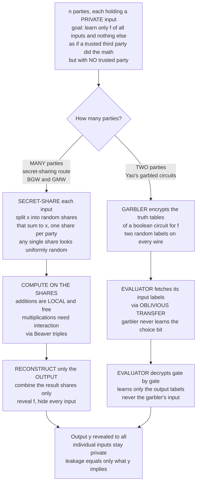

# 🤝 Secure Multiparty Computation

> [!abstract] TL;DR
> **Secure multiparty computation (MPC/SMPC)** lets `n` mutually distrusting parties, each holding a **private input** `x_i`, jointly compute a public function `f(x_1, ..., x_n)` so that everyone learns **only the output** and *nothing else* about the individual inputs — exactly as if a **trusted third party** had collected all inputs, computed `f`, and announced the result, **but with no trusted party at all**. The cryptography *is* the trusted party. The canonical origin is Yao's **millionaires' problem** (1982): two people learn who is richer without revealing their wealth. Two great families of protocols implement this: **secret-sharing MPC** (split each input into random **shares**, compute on the shares — additions are local and free, multiplications need interaction via **Beaver triples** — then reconstruct only the final output; the **BGW** and **GMW** protocols, information-theoretically secure with an honest majority) and **Yao's garbled circuits** (a two-party constant-round approach where one party **garbles** an encrypted boolean circuit and the other **evaluates** it, fetching its input wire labels via **oblivious transfer** without revealing its bits). The whole edifice rests on **oblivious transfer**, which is *complete* for MPC — build it and you can compute anything securely. Security is defined by the **real/ideal paradigm** against **semi-honest** (passive) or **malicious** (active) adversaries, under an honest-majority or dishonest-majority corruption model. Together with **homomorphic encryption** and **zero-knowledge proofs**, MPC forms the "computing on private data" triad, and it now powers private analytics, **private set intersection**, threshold-key custody, and privacy-preserving ML in production.

---

## Intuition

**Analogy — the average salary nobody will reveal.** A group of coworkers suspect they are underpaid and want to know their **average salary**. But nobody will say their number out loud — not to each other, not to HR, not to a "neutral" colleague who might gossip. It sounds impossible: how can you average numbers that no one is willing to state? The obvious fix is a **trusted outsider** — hire an accountant, everyone whispers their salary, the accountant announces "the average is $92,000" and forgets the rest. Secure multiparty computation is the astonishing claim that you can get **exactly that outcome** — the true average, and *only* the average — **without any accountant**. The math itself plays the role of the trusted party. Each person scrambles their salary into random-looking pieces, hands the pieces around, everyone adds up the pieces they were handed, and the scrambling cancels out to reveal the sum — while every individual salary stays as hidden as if it were never spoken.

The trick that makes it click: your salary of `$90,000` gets split into, say, four numbers like `$4,120,377`, `-$811,204`, `$917,916`, and `-$4,137,089` that **sum to $90,000** but are otherwise **uniformly random**. Any one of those pieces, on its own, tells an observer *absolutely nothing* — it is pure noise. Only when *all* the right pieces are added back together does the secret reappear. Hand one piece of each person's salary to each coworker, have everyone add their pile, combine the four piles, and the noise cancels to leave the exact total — with no one ever seeing another person's real number.

---

## How It Works

### The problem, stated precisely

There are `n` parties. Party `i` holds a private input `x_i`. They agree on a public function `f`. They want a protocol that gives everyone the value `y = f(x_1, ..., x_n)` such that the **only** thing any party (or coalition of parties) learns about the honest parties' inputs is **whatever `y` itself logically implies** — nothing more. The gold-standard way to say this is the **ideal world**: imagine a perfectly trusted party `T` that privately receives every `x_i`, computes `y`, and hands `y` back. A **real** protocol is **secure** if anything an adversary can do or learn while running it, it could already do or learn in that ideal world. This **real/ideal (simulation) paradigm** is the rigorous definition of "reveals no more than a trusted third party would" (see [[Provable_Security_and_Reductions]] for the simulation-based style of security proofs).

### The adversary and corruption models

You cannot claim MPC is secure without naming the enemy:

- **Semi-honest (passive / honest-but-curious):** corrupted parties **follow the protocol exactly** but try to infer secrets from the transcript they see. The baseline threat.
- **Malicious (active):** corrupted parties may **deviate arbitrarily** — send wrong messages, lie, abort. Defending against this is much harder and usually needs extra machinery (commitments, zero-knowledge proofs of honest behavior, authenticated shares).
- **Corruption threshold:** how many parties may be corrupt? **Honest-majority** protocols (fewer than `n/2` corrupt) can achieve **information-theoretic** security (BGW). **Dishonest-majority** protocols (up to `n-1` corrupt) must rely on cryptographic assumptions and, in the two-party case, cannot guarantee fairness in general.

### Route 1 — secret-sharing MPC (the many-party workhorse)

Split every input into **shares** distributed among the parties, then compute on the shares:

1. **Share.** Party `i` splits `x_i` into `n` shares. With **additive sharing** over a field, pick `n-1` uniformly random field elements and set the last so all `n` shares sum to `x_i`. Any `n-1` shares are uniformly random and reveal *nothing*. (**Shamir sharing** uses a degree-`t` polynomial so any `t+1` shares reconstruct but `t` reveal nothing — the basis of BGW; see [[Commitment_Schemes]] for the same polynomial machinery.)
2. **Compute on shares.** **Linear operations are local and free:** to add two shared values, each party just adds its own shares; to add a public constant or multiply by a public constant, each party adjusts locally. **Multiplication of two shared values needs interaction** — the standard tool is a precomputed **Beaver (multiplication) triple** `(a, b, c)` with `c = a*b`, shared in advance, which lets parties multiply with one round of communication and no leakage.
3. **Reconstruct only the output.** After evaluating the circuit for `f` gate by gate, the parties hold shares of the *result* and combine **only those** — never the intermediate or input shares. Everyone learns `y`, nobody learns another's input.

This is the **BGW** protocol (Ben-Or, Goldwasser, Wigderson, 1988) with Shamir sharing and honest majority, and the **GMW** protocol (Goldreich, Micali, Wigderson, 1987), which secret-shares *bits* and evaluates a boolean circuit, using **oblivious transfer** for each AND gate — GMW supports any number of corruptions.

### Route 2 — Yao's garbled circuits (the two-party classic)

For **two** parties, Yao (1986) gives a **constant-round** solution:

1. The **garbler** takes a boolean circuit for `f` and, for every wire, invents two random **labels** — one meaning `0`, one meaning `1`. For each gate, it **encrypts the output-wire label** under the pair of input-wire labels, producing a scrambled ("garbled") truth table, then shuffles the rows so their order leaks nothing.
2. The garbler sends the garbled circuit plus the labels for **its own** input bits (it knows them). The **evaluator** needs the labels for **its own** input bits — but must get them **without revealing which bits it holds**. That is exactly **1-out-of-2 oblivious transfer**: the garbler offers both labels for a wire, the evaluator receives only the one matching its bit, and the garbler never learns which.
3. The evaluator now holds one label per input wire and **decrypts the circuit gate by gate**, always learning exactly one output label per gate, until it reaches the final output labels. The garbler publishes the output decoding, so the evaluator recovers `y` — and *nothing* about the garbler's inputs.

### The primitive underneath it all — oblivious transfer

**Oblivious transfer (OT)** is the atom: a sender holds two messages `m_0, m_1`; the receiver has a choice bit `b`; the receiver learns **only `m_b`**, and the sender learns **nothing about `b`**. OT is **complete for MPC** — given OT you can securely compute *any* function (Kilian, 1988) — which is why it sits at the base of both GMW and garbled circuits. Real systems use **OT extension** (Ishai et al.) to turn a few "base" public-key OTs into millions of cheap symmetric ones, the trick that made MPC practical. (A dedicated sibling note *Oblivious Transfer and Threshold Cryptography* will go deeper; it does not yet exist in the vault.)

### Flow / Architecture



---

## Key Concepts

### Secondary (plain-language)
- **The magic goal:** a group computes a shared answer — a sum, an average, "who is richer" — where **nobody reveals their own number** and there is **no trusted middleman**.
- **Scrambling into pieces:** your secret is split into random-looking pieces that only mean something when *all* the right pieces are added back together; one piece alone is pure noise.
- **Only the answer comes out:** the protocol is built so the *final result* appears while every private input stays hidden.
- **Not the same as encryption:** encryption hides data *in storage or transit*; MPC lets people **compute** on data that stays hidden *even from the computers doing the work*.

### Undergraduate (CS background)
- **Real/ideal security:** a protocol is secure if a **simulator** with access only to the output can reproduce the adversary's view — so the real protocol leaks no more than an ideal trusted party.
- **Adversary models:** **semi-honest** (follows the protocol, snoops) vs **malicious** (deviates arbitrarily); **honest majority** vs **dishonest majority** corruption thresholds decide what is achievable and how expensive it is.
- **Additive vs Shamir sharing:** additive shares sum to the secret (any `n-1` reveal nothing); **Shamir** uses a degree-`t` polynomial so any `t+1` of `n` reconstruct via Lagrange interpolation, any `t` reveal nothing.
- **Linear-for-free, multiply-with-interaction:** additions and constant-scaling are local; multiplying two secret-shared values requires a communication round, classically via **Beaver triples**.
- **Garbled circuits + OT:** two-party, constant-round; garbler encrypts gate tables, evaluator gets its wire labels by **oblivious transfer** and decrypts to the output.

### Graduate (research-level)
- **Completeness of OT / feasibility theorems:** OT is complete for secure computation (Kilian); GMW/BGW/CCD establish that *any* function is securely computable (computationally with a dishonest majority; information-theoretically with an honest majority).
- **Malicious security techniques:** cut-and-choose for garbled circuits, authenticated shares and **MACs** (SPDZ), **zero-knowledge proofs** of well-formed inputs, and **committed OT** to force honest behavior; the **preprocessing/online** paradigm pushes heavy correlated-randomness generation (Beaver triples) offline.
- **OT extension:** amortize a handful of base public-key OTs into millions of symmetric-key OTs (IKNP and successors) — the efficiency breakthrough behind practical 2PC.
- **The private-computation triad:** **MPC** distributes the computation among the input holders, **homomorphic encryption** lets one party compute on another's ciphertext, **zero-knowledge** proves a statement about private data; they are frequently *combined* (e.g. MPC-in-the-head, or MPC with ZK to enforce honest inputs). See [[Zero_Knowledge_Proofs]] and [[Interactive_Proofs_and_Zero_Knowledge]]; the sibling *Homomorphic Encryption* note is planned.
- **Fairness impossibility:** in the two-party dishonest-majority setting, complete fairness for general functions is impossible (Cleve) — the corrupt party can abort after learning the output; honest-majority protocols can restore fairness/guaranteed output delivery.

---

## Python Demo

Two runnable pieces, pure standard library plus matplotlib. **Part A** implements **additive secret-sharing MPC** for the private-average-salary scenario: each party splits their salary into random shares, everyone locally adds the shares they hold, and only the final total is reconstructed — while every individual share is uniformly random and leaks nothing. **Part B** is a working **sketch of Yao's garbled circuits with oblivious transfer** for the 1-bit **millionaires' problem** ("is Alice richer than Bob?") — one real garbled gate plus a real 1-out-of-2 OT, showing the evaluator learns only the output.

```python
# SECURE MULTIPARTY COMPUTATION -- two demos, pure stdlib + matplotlib.
#   Part A: additive secret-sharing MPC for the PRIVATE AVERAGE SALARY.
#   Part B: Yao's garbled circuits + oblivious transfer for the MILLIONAIRES' PROBLEM.
# Requires Python 3.8+ (uses pow(x, -1, m)).

import random
import hashlib
import matplotlib.pyplot as plt

random.seed(7)  # reproducible demo; real MPC needs a CSPRNG

# ===========================================================================
# PART A -- ADDITIVE SECRET-SHARING MPC: private sum / average, no trusted party
# ===========================================================================
PRIME = 2**61 - 1  # a large Mersenne prime; the finite field we share over

def share(secret, n):
    """Split `secret` into n additive shares summing to secret mod PRIME.
    The first n-1 shares are UNIFORMLY RANDOM; the last is forced. Any n-1
    shares are independent of the secret -> they leak NOTHING."""
    parts = [random.randrange(PRIME) for _ in range(n - 1)]
    parts.append((secret - sum(parts)) % PRIME)
    return parts

def reconstruct(shares):
    return sum(shares) % PRIME

# Four coworkers' PRIVATE salaries -- never revealed to each other.
salaries = {"Alice": 90000, "Bob": 70000, "Carol": 110000, "Dave": 130000}
names = list(salaries)
n = len(names)

# Each owner shares their salary; share j is sent to party j.
# held[j] = the list of shares party j receives (one per input owner).
held = {j: [] for j in range(n)}
for owner in range(n):
    pieces = share(salaries[names[owner]], n)
    for j in range(n):
        held[j].append(pieces[j])

# Each party LOCALLY adds the shares it holds -> a share of the grand total.
partial_sums = {j: sum(held[j]) % PRIME for j in range(n)}

# Reconstruct ONLY the total (then the average). No individual salary is ever combined.
mpc_total = reconstruct(list(partial_sums.values()))
mpc_average = mpc_total / n
true_total = sum(salaries.values())

print("=== Part A: private average salary via additive secret sharing ===")
print("Each party's held shares (uniform, ~19-digit, reveal nothing):")
for j in range(n):
    print(f"  party {names[j]:6s} holds shares:", [str(s)[:8] + '...' for s in held[j]])
print(f"True total  = {true_total:>8}   MPC total   = {mpc_total:>8}   match={true_total == mpc_total}")
print(f"True average= {true_total / n:>8.1f}   MPC average = {mpc_average:>8.1f}")
print("No individual salary was ever seen by anyone.\n")

# Demonstrate 'a single share leaks nothing': re-share the SAME secret many times
# and collect the first share. Its distribution is UNIFORM, independent of the secret.
SECRET = 90000
first_share_samples = [share(SECRET, n)[0] / PRIME for _ in range(20000)]

# ===========================================================================
# PART B -- YAO'S GARBLED CIRCUITS + OBLIVIOUS TRANSFER (millionaires', 1 bit)
# ===========================================================================
# Gate computes  gt(a, b) = 1 iff a > b  -> "is Alice (a) richer than Bob (b)?"
# Alice = GARBLER (knows her bit a), Bob = EVALUATOR (keeps his bit b private).

def is_probable_prime(m, rounds=16):
    if m < 2: return False
    for p in (2, 3, 5, 7, 11, 13, 17, 19, 23, 29, 31):
        if m % p == 0: return m == p
    d, r = m - 1, 0
    while d % 2 == 0: d //= 2; r += 1
    for _ in range(rounds):
        a = random.randrange(2, m - 1)
        x = pow(a, d, m)
        if x in (1, m - 1): continue
        for _ in range(r - 1):
            x = pow(x, 2, m)
            if x == m - 1: break
        else:
            return False
    return True

def gen_prime(bits):
    while True:
        cand = random.getrandbits(bits) | 1 | (1 << (bits - 1))
        if is_probable_prime(cand): return cand

def rsa_keygen(bits=512):
    e = 65537
    while True:
        p, q = gen_prime(bits // 2), gen_prime(bits // 2)
        if p == q: continue
        phi = (p - 1) * (q - 1)
        if phi % e == 0: continue
        return p * q, e, pow(e, -1, phi)  # N, e, d

# --- 1-out-of-2 Oblivious Transfer (Even-Goldreich-Lempel over RSA) ---
# Sender has messages (M0, M1); receiver's choice bit c learns only M_c;
# sender learns NOTHING about c.
def ot_receiver_query(N, e, x0, x1, c, k):
    xc = x0 if c == 0 else x1
    return (xc + pow(k, e, N)) % N                 # v -> sender

def ot_sender_reply(N, d, M0, M1, x0, x1, v):
    k0 = pow((v - x0) % N, d, N)
    k1 = pow((v - x1) % N, d, N)
    return (M0 + k0) % N, (M1 + k1) % N            # (c0, c1) -> receiver

def ot_receiver_open(cbits, c, k, N):
    return (cbits[c] - k) % N                        # recovers only M_c

# --- Garble a single boolean gate ---
TAGBITS, TAG = 32, 0xC0DEFACE                        # marker to detect the right row

def H(*ints):
    return int.from_bytes(hashlib.sha256("|".join(map(str, ints)).encode()).digest(), "big")

def garble_gate(func):
    lbl = lambda: (random.getrandbits(128), random.getrandbits(128))  # (label0, label1)
    A, B, C = lbl(), lbl(), lbl()                    # input wires A, B; output wire C
    rows = []
    for a in (0, 1):
        for b in (0, 1):
            out_label = C[func(a, b)]
            key = H(A[a], B[b])
            rows.append(key ^ ((out_label << TAGBITS) | TAG))
    random.shuffle(rows)                             # hide the truth-table order
    return A, B, C, rows

def eval_gate(rows, label_a, label_b):
    key = H(label_a, label_b)
    for ct in rows:
        pt = ct ^ key
        if pt & ((1 << TAGBITS) - 1) == TAG:         # only the correct row matches
            return pt >> TAGBITS
    return None

def millionaires(a_bit, b_bit):
    gt = lambda a, b: 1 if a > b else 0              # Alice richer?
    A, B, C, rows = garble_gate(gt)                  # Alice garbles

    alice_label = A[a_bit]                           # Alice sends her own input label

    # Bob obtains his input label via OT (Alice offers both, learns neither which)
    N, e, d = rsa_keygen(512)
    x0, x1 = random.randrange(N), random.randrange(N)
    k = random.randrange(1, N)
    v = ot_receiver_query(N, e, x0, x1, b_bit, k)        # Bob -> Alice
    cbits = ot_sender_reply(N, d, B[0], B[1], x0, x1, v) # Alice -> Bob (offers B[0], B[1])
    bob_label = ot_receiver_open(cbits, b_bit, k, N)     # Bob recovers only B[b_bit]
    assert bob_label == B[b_bit]                         # OT delivered exactly one label

    out_label = eval_gate(rows, alice_label, bob_label)  # Bob evaluates
    decode = {C[0]: 0, C[1]: 1}                           # Alice publishes output decoding
    return decode[out_label]

print("=== Part B: millionaires' problem via garbled circuit + OT ===")
for a_bit, b_bit in [(1, 0), (0, 1), (1, 1), (0, 0)]:
    res = millionaires(a_bit, b_bit)
    truth = 1 if a_bit > b_bit else 0
    print(f"  Alice bit={a_bit}, Bob bit={b_bit}: garbled says 'Alice richer'={bool(res)} "
          f"(correct={res == truth}); neither learned the other's bit")

# ===========================================================================
# VISUALIZE -- (1) a single share leaks nothing  (2) MPC reproduces the truth
# ===========================================================================
fig, (ax1, ax2) = plt.subplots(1, 2, figsize=(13, 5))

ax1.hist(first_share_samples, bins=40, color="steelblue", edgecolor="white")
ax1.set_title("A single secret share is UNIFORM\n(20000 sharings of the SAME salary)\n"
              "-> one share reveals nothing about the input")
ax1.set_xlabel("share value / PRIME  (normalized to [0, 1])")
ax1.set_ylabel("frequency")
ax1.axhline(20000 / 40, ls="--", color="crimson", label="uniform expectation")
ax1.legend()

ax2.bar(["True average\n(central, needs all inputs)", "MPC average\n(inputs stayed private)"],
        [true_total / n, mpc_average], color=["lightgray", "seagreen"], edgecolor="black")
ax2.set_title("Same answer, no trusted party\nindividual salaries never revealed")
ax2.set_ylabel("average salary")
for i, v in enumerate([true_total / n, mpc_average]):
    ax2.text(i, v + 1500, f"{v:,.0f}", ha="center", fontweight="bold")
ax2.set_ylim(0, max(true_total / n, mpc_average) * 1.25)

plt.tight_layout()
plt.savefig("mpc_demo.png", dpi=110)
print("\nSaved plot to mpc_demo.png")
```

**Expected output (values vary by run for the random shares):**

```
=== Part A: private average salary via additive secret sharing ===
Each party's held shares (uniform, ~19-digit, reveal nothing):
  party Alice  holds shares: ['12034987...', '20418822...', ...]
  ...
True total  =   400000   MPC total   =   400000   match=True
True average=  100000.0   MPC average =  100000.0
No individual salary was ever seen by anyone.

=== Part B: millionaires' problem via garbled circuit + OT ===
  Alice bit=1, Bob bit=0: garbled says 'Alice richer'=True  (correct=True); neither learned the other's bit
  Alice bit=0, Bob bit=1: garbled says 'Alice richer'=False (correct=True); ...
  Alice bit=1, Bob bit=1: garbled says 'Alice richer'=False (correct=True); ...
  Alice bit=0, Bob bit=0: garbled says 'Alice richer'=False (correct=True); ...

Saved plot to mpc_demo.png
```

**What the demo shows.** Part A reconstructs the *exact* average (`$100,000`) while every share each party holds is a uniformly random ~19-digit field element — the left plot proves it: 20,000 independent sharings of the *same* salary produce a **uniform** distribution of the first share, so a single share is statistically independent of the secret and leaks nothing. Part B runs a genuine garbled gate and a genuine RSA-based oblivious transfer: Alice garbles the "am I richer" gate and sends her own wire label; Bob fetches *only* his wire label by OT (Alice never learns his bit); Bob decrypts exactly one row of the shuffled table to the output label and decodes the boolean answer. Chaining many such garbled gates into a full comparator circuit is exactly how real 2PC solves the millionaires' problem for arbitrary-precision wealth.

---

## Real-World Applications

> **Example — the Boston gender wage-gap study.** The Boston Women's Workforce Council wanted the *aggregate* pay gap across major employers, but no company would hand over its actual payroll. Boston University built an MPC deployment where each employer **secret-shared** its compensation figures; the servers computed the aggregate statistics on the shares and revealed **only the citywide averages** — no single employer's data was ever exposed. This is the private-average scenario from the demo, at civic scale.

- **Private set intersection (PSI).** Two parties find the elements they have in common — shared contacts, overlapping customers, ad viewers who later purchased — **without revealing their full lists**. Used in contact discovery and in ad **conversion measurement** (Google's *Private Join and Compute*, Meta and Google measuring ad-to-purchase lift without pooling raw data), and in password-breach checking.
- **Threshold cryptography and MPC custody.** A private key is **secret-shared** so no single machine ever holds it; a threshold of parties jointly signs. Institutional crypto custodians (**Fireblocks, Coinbase**) and **distributed key generation** for validators use this to eliminate single-key theft — the applied deep dive lives in [[Multi_Party_Computation]] and connects to [[ECDSA_and_Digital_Signatures]] and [[Digital_Signatures]].
- **Privacy-preserving machine learning.** Hospitals, banks, or phones jointly **train or evaluate a model** over combined private datasets without any party seeing another's raw records — MPC underpins several federated-analytics and secure-inference systems.
- **Secure auctions and voting.** The **Danish sugar-beet auction** (2008) was the first large-scale commercial MPC: farmers submitted sealed bids as secret shares and the market-clearing price was computed with no auctioneer able to see individual bids. Electronic voting and sealed-bid auctions are natural MPC applications.
- **Maturing tooling.** Production frameworks — **MP-SPDZ, SCALE-MAMBA, ABY/ABY3, Sharemind** — implement these protocols with malicious security and preprocessing, moving MPC from theory to industry.

---

## Common Pitfalls

- **Using semi-honest security against a malicious adversary.** A protocol proven secure only against **passive** corruption gives *no* guarantee if a party deviates — a single malformed message can leak inputs or corrupt the output. Match the protocol to the real threat model, and add commitments/ZK for active security.
- **Violating the corruption threshold.** Honest-majority protocols (BGW) collapse the moment a **majority colludes**; a `t`-of-`n` secret sharing is broken by any `t+1` colluders. Assumptions about who might collude must be realistic.
- **Forgetting that the output itself leaks.** MPC hides *inputs beyond what the output implies* — but the output can imply a lot. A 2-party average trivially reveals the other party's input; re-running a computation with different coalitions can triangulate individuals. Combine with **differential privacy** when the output is sensitive.
- **Not validating inputs (garbage-in).** MPC computes `f` faithfully on whatever inputs parties supply — a party can feed a **false value** to skew or probe the result. Enforcing well-formed, honest inputs generally requires **zero-knowledge proofs** attached to the shares (see [[Zero_Knowledge_Proofs]]).
- **Underestimating communication and rounds.** Multiplications need interaction; deep circuits mean many rounds and heavy bandwidth. Ignoring the **round complexity** and the cost of generating **Beaver triples** turns a "working" prototype into an unusably slow deployment. Use preprocessing (offline/online split) and OT extension.
- **Confusing MPC with encryption or with homomorphic encryption.** Encryption protects data at rest/in transit; **HE** lets *one* party compute on *another's* ciphertext; **MPC** distributes the computation among the input holders so no one sees everything. They solve related but distinct problems and are often combined, not interchangeable.
- **Rolling your own.** Subtle simulation-soundness, OT, and malicious-security details sink hand-built protocols. Use audited frameworks.

---

## Related Concepts

- [[Multi_Party_Computation]] — the applied Blockchain-vault companion on **threshold signatures (TSS)**, Shamir sharing, and distributed key generation (GG20, FROST); this note is the cryptographic-theory counterpart.
- [[Commitment_Schemes]] — Shamir secret sharing and Pedersen/polynomial commitments share the same polynomial machinery; commitments enforce honest inputs and are a building block for malicious-secure MPC.
- [[Zero_Knowledge_Proofs]] — the third leg of the "computing on private data" triad; ZK proofs of well-formed inputs upgrade MPC from semi-honest to malicious security.
- [[Interactive_Proofs_and_Zero_Knowledge]] — the complexity-theoretic foundation of interaction and simulation, the same simulation paradigm that defines MPC security.
- [[Provable_Security_and_Reductions]] — the **real/ideal / simulation-based** definition of MPC security and the reduction style behind its proofs.
- [[Digital_Signatures]] — threshold and multi-signatures are a headline MPC application: split the signing key so no single party can forge alone.
- [[ECDSA_and_Digital_Signatures]] — threshold-ECDSA (an MPC protocol) is how custodians sign transactions without ever reconstructing the private key.
- [[Diffie_Hellman_and_Discrete_Log]] — the discrete-log/OT-flavored assumptions underpin efficient oblivious transfer and many MPC building blocks.
- [[Computational_Hardness_Assumptions]] — dishonest-majority MPC is only *computationally* secure, resting on exactly these assumptions; honest-majority MPC can be information-theoretic.
- [[Probability_and_Information_Theoretic_Security]] — additive/Shamir sharing gives **information-theoretic** privacy: any subset below threshold is uniformly random, independent of the secret.
- [[Cryptography_Overview]] — where MPC sits among the field's security goals and primitives.

*(Sibling notes planned for this Cryptography vault — `Homomorphic_Encryption`, `Oblivious_Transfer_and_Threshold_Cryptography`, `Commitment_Schemes_and_Secret_Sharing`, and `Blockchain_Cryptography` — are referenced in prose above and should be wikilinked once created.)*

---

## Review Questions

**Tier 1 — conceptual (explain to a peer):**
1. Explain, using the average-salary example, how additive secret sharing lets a group compute a sum while no individual salary is ever revealed. Why does a *single* share leak nothing about the secret?
2. What does the "real/ideal paradigm" mean, and why is "the protocol reveals no more than a trusted third party would" the right definition of secure computation?
3. In Yao's garbled circuits, what job does **oblivious transfer** do, and why can't the garbler simply send the evaluator both wire labels?

**Tier 2 — applied / scenario:**
4. Two hospitals want to compute the correlation between a treatment and an outcome across their combined patients, but neither may see the other's records and each fears the other might cheat. Which corruption model applies, would you reach for secret-sharing MPC or garbled circuits, and what extra mechanism would you add to defend against a *malicious* party who lies about its inputs?
5. A team deploys a semi-honest 3-party protocol assuming "no two of us would ever collude." A regulator asks what happens if two servers are breached. Explain precisely what breaks and how the honest-majority assumption relates to the secret-sharing threshold.

**Tier 3 — trade-off / research:**
6. Compare secret-sharing MPC (BGW/GMW) with garbled circuits along round complexity, number of parties supported, and corruption threshold. For a two-party computation over a WAN with high latency, which would you prefer and why?
7. MPC "hides everything but the output," yet the output itself can leak inputs. Give a concrete function where the exact output reveals an individual's private input, and describe how you would combine MPC with differential privacy or output perturbation to mitigate it — including the utility cost you accept.

---

## Sources

- Yao, A. C. (1982). "Protocols for Secure Computations." *23rd FOCS.* https://doi.org/10.1109/SFCS.1982.38 — the millionaires' problem and the birth of secure computation.
- Yao, A. C. (1986). "How to Generate and Exchange Secrets." *27th FOCS.* https://doi.org/10.1109/SFCS.1986.25 — garbled circuits.
- Goldreich, O., Micali, S., & Wigderson, A. (1987). "How to Play Any Mental Game, or a Completeness Theorem for Protocols with Honest Majority." *19th STOC.* https://doi.org/10.1145/28395.28420 — the GMW protocol.
- Evans, D., Kolesnikov, V., & Rosulek, M. (2018). *A Pragmatic Introduction to Secure Multi-Party Computation.* NOW Publishers (free). https://securecomputation.org/ — the standard modern textbook.
- Bogetoft, P., et al. (2009). "Secure Multiparty Computation Goes Live." *Financial Cryptography 2009.* https://doi.org/10.1007/978-3-642-03549-4_20 — the Danish sugar-beet auction, the first large-scale practical MPC.

---

#cryptography #mpc #secret-sharing #garbled-circuits #privacy-preserving
