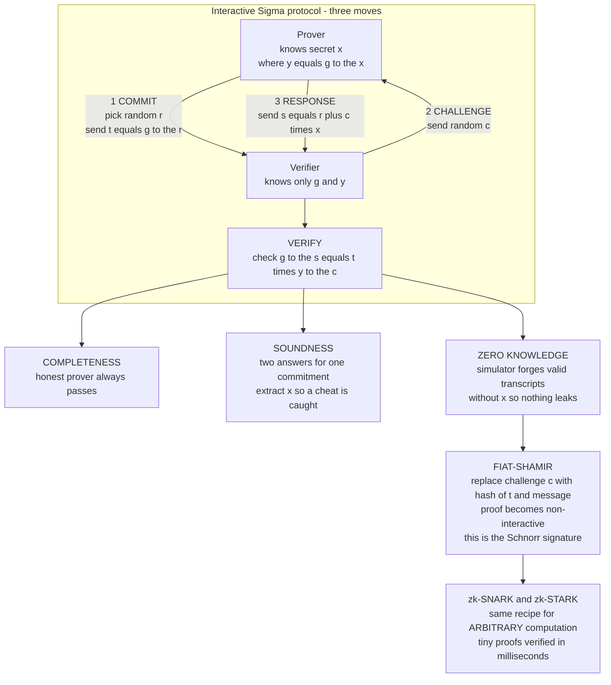

# 🕵️ Zero-Knowledge Proofs

> [!abstract] TL;DR
> A **zero-knowledge proof (ZKP)** lets a **prover** convince a **verifier** that a statement is **true** — "I know the private key," "this transaction is valid," "I am over 18" — while revealing **nothing else**: not the secret, not *why* it is true, not one extra bit. It sounds paradoxical, but Goldwasser, Micali, and Rackoff (1985) made it rigorous with **three properties**: **completeness** (an honest prover always convinces the verifier of a true statement), **soundness** (a cheating prover cannot convince the verifier of a *false* statement except with negligible probability), and **zero-knowledge** (there exists a **simulator** that can produce transcripts *indistinguishable* from real ones **without** the secret — so a real transcript cannot have leaked anything). The classic form is **interactive** and follows a three-move **Sigma (Σ) protocol** — **commit → challenge → response** — the flagship being **Schnorr's** proof of knowledge of a **discrete logarithm**. The **Fiat-Shamir heuristic** replaces the verifier's random challenge with a **hash** of the transcript, collapsing the interaction into a **non-interactive** proof — and a Schnorr *signature* is exactly Fiat-Shamir applied to the Schnorr ZK proof. The modern revolution is **zk-SNARKs** (succinct, non-interactive arguments for *arbitrary* NP computations, tiny proofs, millisecond verification, but usually needing a **trusted setup**) and **zk-STARKs** (transparent — no trusted setup — and post-quantum, at the cost of larger proofs). Together they power **privacy** (Zcash, Monero), **scalability** (zk-rollups scaling Ethereum), and **selective-disclosure identity**, making ZK one of the hottest areas of applied cryptography.

---

## Intuition

**Analogy — the Ali Baba cave.** Picture a ring-shaped cave with a single entrance that forks into two tunnels, **Left** and **Right**, joined at the back by a **magic door** that only opens for someone who knows the secret password. Peggy (the prover) claims she knows the password. Victor (the verifier) wants to be convinced — but Peggy refuses to *say* the password, because then Victor could use it himself and could tell others.

So they play a game. Victor waits outside where he cannot see which tunnel Peggy takes. Peggy walks in and picks a tunnel at random. Then Victor shouts which side he wants her to come out of: "Left!" or "Right!" If Peggy really knows the password, she can *always* comply — if she happens to be on the wrong side, she opens the door and walks through. If she is a **fraud** who guessed which side Victor would call, she only survives when her guess was right — a **50 percent** chance. One round proves little. But repeat it **twenty** times: a cheat's odds of getting lucky every single time are `1/2^20`, about one in a million. After enough rounds Victor is overwhelmingly convinced Peggy knows the password — **yet he never heard it**, and if he filmed the whole thing, the video would be *useless* to a third party, because Peggy and Victor could have *scripted the exact same footage* by agreeing on the calls in advance. That "we could have faked this" property is the technical heart of **zero-knowledge**.

That is the whole idea. A zero-knowledge proof lets you prove you know a secret — or that some statement is true — while the transcript of the proof reveals **nothing but the fact itself**. The [[Interactive_Proofs_and_Zero_Knowledge|interactive-proof]] machinery of complexity theory turns this cave game into rigorous mathematics that works for *any* statement in NP.

---

## How It Works

### The three properties (Goldwasser-Micali-Rackoff)

A zero-knowledge proof system for a statement is defined by **three** requirements. Everything else is engineering.

1. **Completeness.** If the statement is **true** and both parties follow the protocol, the honest verifier **accepts**. Truth is provable.
2. **Soundness.** If the statement is **false**, then *no* cheating prover — however powerful or devious — can make the verifier accept, except with **negligible** probability. In the cave, each round catches a fraud with probability `1/2`; after `k` rounds the **soundness error** is `1/2^k`. A **proof of knowledge** strengthens this: not only is the statement true, but the prover actually *possesses* a **witness** (the secret), formalized by an **extractor** that can pull the witness out of a prover who succeeds.
3. **Zero-knowledge.** The verifier learns **nothing beyond the statement's truth**. This is formalized by a **simulator**: an efficient algorithm that, *without the secret*, produces transcripts whose distribution is **indistinguishable** from real prover-verifier transcripts. If a fake transcript is indistinguishable from a real one, then the real one **cannot** contain any usable information about the secret — because the fake was made without it. This "real versus ideal" simulation style is the same rigor used across [[Provable_Security_and_Reductions|provable security]] and [[Multi_Party_Computation|secure computation]].

The three pull in opposite directions: completeness wants the protocol to *accept* true statements, soundness wants it to *reject* false ones, and zero-knowledge wants it to *leak nothing* while doing both. A protocol that achieves all three is doing something genuinely subtle.

### Sigma protocols: commit, challenge, response

The workhorse construction is the three-move **Sigma (Σ) protocol**, named for the shape of the message flow:

1. **Commit.** The prover picks fresh randomness and sends a **commitment** `t` that binds them to that randomness without revealing it (think of the tunnel Peggy chose).
2. **Challenge.** The verifier sends a **random challenge** `c` that the prover could not have predicted (Victor shouting a side).
3. **Response.** The prover computes a **response** `s` that only someone knowing the secret *and* the committed randomness can produce; the verifier checks an equation relating `t`, `c`, `s`, and the public statement.

Two clean properties make Sigma protocols tick. **Special soundness:** given **two** accepting transcripts with the **same commitment** `t` but **different** challenges `c1 != c2`, one can *extract the witness* by simple algebra — this is exactly why a cheat who can only answer *one* challenge per commitment gets caught. **Honest-verifier zero-knowledge (HVZK):** a simulator can produce a valid-looking transcript for a *randomly chosen* challenge without the witness.

### Schnorr: proving knowledge of a discrete log

The canonical Sigma protocol is **Schnorr's**. Public parameters are a group with generator `g` of prime order `q`, and a public key `y = g^x mod p`. The prover knows the secret **discrete logarithm** `x` (see [[Diffie_Hellman_and_Discrete_Log]]) and wants to prove it *without revealing `x`*:

- **Commit:** prover picks random `r`, sends `t = g^r mod p`.
- **Challenge:** verifier sends random `c`.
- **Response:** prover sends `s = r + c*x mod q`.
- **Verify:** accept iff `g^s = t * y^c mod p`.

**Why it is complete:** `g^s = g^(r + c*x) = g^r * (g^x)^c = t * y^c`. **Why it is a proof of knowledge (special soundness):** from two transcripts `(t, c1, s1)` and `(t, c2, s2)` the verifier solves `x = (s1 - s2) / (c1 - c2) mod q` — anyone who can answer *two* challenges for one commitment **knows** `x`. **Why it is zero-knowledge:** a simulator picks `c` and `s` at random and sets `t = g^s * y^(-c)`, yielding a perfectly valid transcript **with no knowledge of `x`**.

### Fiat-Shamir: from interactive to non-interactive

Interaction is inconvenient — you cannot post an interactive proof to a blockchain that thousands verify independently. The **Fiat-Shamir heuristic** removes the verifier entirely: the prover **generates the challenge itself** as a **hash** of the transcript so far, `c = H(g, y, t)`, modeling `H` as a [[Hash_Functions|random oracle]]. Because the prover fixes `t` *before* it can influence `c`, it still cannot cheat. The result is a **non-interactive** proof `(t, s)` anyone can check. Fold the **message** into the hash, `c = H(t, m)`, and you have a **Schnorr signature** — which is why [[Digital_Signatures|signatures]] and ZK proofs are two faces of the same coin. This transform (proven sound in the random-oracle model, see [[Provable_Security_and_Reductions]]) is *the* bridge from identification protocols to signatures and modern NIZKs.

### Flow / Architecture



---

## Key Concepts

### Secondary (plain-language)
- **Prove without revealing.** You can convince someone that something is true — you know a password, you are old enough, a payment is valid — without telling them the secret behind it.
- **The cave trick.** Repeatedly passing a random test that only the knower can pass makes a cheat's luck run out, without ever exposing the secret.
- **You could have faked the recording.** A ZK transcript is worthless as evidence to anyone else, because the same script could be produced without the secret — that is *why* it leaks nothing.
- **Signatures are ZK proofs in disguise.** A Schnorr signature is a "proof I know the private key" made non-interactive.

### Undergraduate (CS background)
- **Three properties.** Completeness (accept true statements), soundness (reject false ones, error `1/2^k` after `k` rounds), zero-knowledge (a simulator reproduces the transcript distribution without the witness).
- **Sigma protocol.** Three moves — **commit, challenge, response** — with **special soundness** (two transcripts sharing a commitment extract the witness) and **honest-verifier ZK**.
- **Schnorr identification.** `t = g^r`, `c` random, `s = r + c*x`, check `g^s = t*y^c`; a proof of knowledge of a discrete log.
- **Proof of knowledge vs proof of truth.** ZK can prove a statement is *true*, or the stronger claim that the prover *knows a witness* — formalized by an **extractor**. Authentication and signatures need the knowledge flavor.
- **Fiat-Shamir.** Hash the transcript to self-generate the challenge, turning an interactive Sigma protocol into a non-interactive proof or a signature.

### Graduate (advanced / applied)
- **NIZK and the CRS model.** Non-interactive zero-knowledge either uses a **random oracle** (Fiat-Shamir) or a **common reference string** shared by all parties; NIZK for all of NP exists assuming trapdoor permutations or standard cryptographic assumptions.
- **zk-SNARKs.** *Succinct Non-interactive ARguments of Knowledge*: prove any NP statement (an arithmetic circuit / R1CS) with a **constant-size** proof verified in milliseconds. Pipelines: **Groth16** (smallest proofs, circuit-specific trusted setup) and **PLONK** (universal, updatable setup). The setup produces secret randomness — **"toxic waste"** — that must be destroyed, or forged proofs become possible.
- **zk-STARKs and transparent proofs.** *Scalable Transparent ARguments of Knowledge*: **no trusted setup** (transparent), **post-quantum** security (relying only on collision-resistant [[Hash_Functions|hashes]] and [[Post_Quantum_Cryptography|hash-based]] assumptions), at the cost of **larger** proofs. **Bulletproofs** are another transparent, setup-free system (logarithmic-size range proofs, used by Monero).
- **The SNARK-vs-STARK trade-off.** SNARKs: tiny proofs, fast verification, but trusted setup and (for pairing-based schemes) quantum-vulnerable. STARKs: bigger proofs, no setup, quantum-safe. Choose by whether your bottleneck is proof size, setup trust, or long-term security.
- **Complexity-theory roots.** Interactive proofs give `IP = PSPACE`; the **PCP theorem** underlies succinct verification; ZK proofs exist for **all of NP** assuming one-way functions (Goldreich-Micali-Wigderson). See [[Interactive_Proofs_and_Zero_Knowledge]] and [[Computational_Hardness_Assumptions]].
- **Simulation soundness and malleability.** For proofs used inside larger protocols (e.g., signatures of knowledge, MPC), plain ZK is not enough; you need **simulation-sound** or **UC-secure** NIZKs so an adversary cannot maul one proof into another.

---

## Python Demo

This demo implements the **Schnorr zero-knowledge proof of knowledge of a discrete logarithm** end to end. It exhibits all three properties concretely — **completeness** (the honest prover always convinces), **soundness** (a cheat without `x` fails, and the **special-soundness extractor** recovers `x` from two transcripts sharing a commitment), and **zero-knowledge** (a **simulator** with *no* knowledge of `x` produces transcripts statistically indistinguishable from real ones) — then applies **Fiat-Shamir** to get a non-interactive proof and a Schnorr signature. It visualizes the commit-challenge-response flow and the simulator's indistinguishability. Pure standard library plus `hashlib` and `matplotlib` (no numpy). Requires Python 3.8+ for `pow(a, -1, m)`.

```python
# SCHNORR ZERO-KNOWLEDGE PROOF of knowledge of a discrete log x, where y = g^x mod p.
#
#   Protocol (3-move Sigma):  COMMIT  t = g^r
#                             CHALLENGE  c random
#                             RESPONSE  s = r + c*x  (mod q)
#                             VERIFY  g^s == t * y^c  (mod p)
#
# We demonstrate:
#   (a) COMPLETENESS  : the honest prover ALWAYS convinces the verifier.
#   (b) SOUNDNESS     : a cheater WITHOUT x fails; and two accepting transcripts
#                       for the SAME commitment EXTRACT x (special soundness).
#   (c) ZERO-KNOWLEDGE: a SIMULATOR that does NOT know x produces transcripts
#                       indistinguishable from real ones.
#   (d) FIAT-SHAMIR   : hash the transcript to remove the verifier -> a NON-INTERACTIVE
#                       proof, and (folding in a message) a Schnorr SIGNATURE.
#
# Pure stdlib + hashlib for crypto; matplotlib only to draw the flow and the simulator.

import hashlib
import random
import matplotlib.pyplot as plt

random.seed(7)  # reproducible demo -- real crypto MUST use `secrets`, not `random`

# ---------------------------------------------------------------------------
# Group setup: prime p, prime subgroup order q | (p-1), generator g of order q.
# Small parameters for a fast, readable demo -- the ALGEBRA is identical to real Schnorr.
# ---------------------------------------------------------------------------
def is_probable_prime(n, rounds=20):
    if n < 2:
        return False
    for sp in (2, 3, 5, 7, 11, 13, 17, 19, 23, 29, 31, 37):
        if n % sp == 0:
            return n == sp
    d, r = n - 1, 0
    while d % 2 == 0:
        d //= 2
        r += 1
    for _ in range(rounds):
        a = random.randrange(2, n - 1)
        x = pow(a, d, n)
        if x in (1, n - 1):
            continue
        for _ in range(r - 1):
            x = pow(x, 2, n)
            if x == n - 1:
                break
        else:
            return False
    return True

def gen_prime(bits):
    while True:
        n = random.getrandbits(bits) | 1 | (1 << (bits - 1))
        if is_probable_prime(n):
            return n

def gen_group(qbits=40, pbits=128):
    q = gen_prime(qbits)
    while True:                                    # find prime p = z*q + 1
        z = random.getrandbits(pbits - qbits) | (1 << (pbits - qbits - 1)) | 1
        p = z * q + 1
        if is_probable_prime(p):
            break
    while True:                                    # generator of the order-q subgroup
        g = pow(random.randrange(2, p - 1), (p - 1) // q, p)
        if g != 1:
            return p, q, g

p, q, g = gen_group()

# Key pair: secret x, public y = g^x mod p
x = random.randrange(1, q)
y = pow(g, x, p)

# ---------------------------------------------------------------------------
# The three protocol messages, as functions.
# ---------------------------------------------------------------------------
def commit():
    r = random.randrange(1, q)
    return r, pow(g, r, p)                         # (secret nonce r, commitment t)

def respond(r, c, secret):
    return (r + c * secret) % q                    # s = r + c*x mod q

def verify(t, c, s):
    return pow(g, s, p) == (t * pow(y, c, p)) % p  # g^s == t * y^c

# ---------------------------------------------------------------------------
# (a) COMPLETENESS -- the honest prover always convinces the verifier.
# ---------------------------------------------------------------------------
honest_ok = 0
TRIALS = 2000
for _ in range(TRIALS):
    r, t = commit()                                # prover commits
    c = random.randrange(0, q)                     # verifier's random challenge
    s = respond(r, c, x)                           # prover responds using x
    if verify(t, c, s):
        honest_ok += 1
print(f"(a) COMPLETENESS : honest prover accepted {honest_ok}/{TRIALS} times "
      f"-> {honest_ok / TRIALS:.3f} (expect 1.000)")

# ---------------------------------------------------------------------------
# (b) SOUNDNESS -- a cheater WITHOUT x can only win by GUESSING the challenge in
# advance. With a challenge space of size C the soundness error is ~ 1/C.
# ---------------------------------------------------------------------------
def cheat_accept_rate(challenge_space, trials=4000):
    """Cheater guesses a challenge, commits so it can answer ONLY that guess."""
    wins = 0
    for _ in range(trials):
        c_guess = random.randrange(0, challenge_space)
        a = random.randrange(1, q)
        # Commit t = g^a * y^{-c_guess}: for challenge c_guess the cheat can answer s=a,
        # since g^a == t * y^{c_guess}. For any other challenge it is stuck.
        t = (pow(g, a, p) * pow(y, (q - c_guess % q) % q, p)) % p
        c_real = random.randrange(0, challenge_space)  # verifier's ACTUAL challenge
        if c_real == c_guess and verify(t, c_real, a):
            wins += 1
    return wins / trials

spaces = [2, 4, 8, 16, 32, 64]
cheat_rates = [cheat_accept_rate(C) for C in spaces]
print("(b) SOUNDNESS    : cheat accept rate shrinks like 1/C as challenge space grows:")
for C, rate in zip(spaces, cheat_rates):
    print(f"      challenge space {C:>3d}: cheat wins {rate:.4f}  (expect ~ {1 / C:.4f})")

# ---- Special-soundness EXTRACTOR: two accepting transcripts for the SAME t reveal x ----
r, t = commit()
c1, c2 = random.randrange(0, q), random.randrange(0, q)
while c2 == c1:
    c2 = random.randrange(0, q)
s1, s2 = respond(r, c1, x), respond(r, c2, x)
# g^s1 = t*y^c1 and g^s2 = t*y^c2  =>  x = (s1 - s2) / (c1 - c2) mod q
x_extracted = ((s1 - s2) * pow((c1 - c2) % q, -1, q)) % q
print(f"    EXTRACTOR    : recovered x from two transcripts matches real x: "
      f"{x_extracted == x}  <-- proof OF KNOWLEDGE")

# ---------------------------------------------------------------------------
# (c) ZERO-KNOWLEDGE -- a SIMULATOR that does NOT know x builds valid transcripts.
# Pick c, s at random; set t = g^s * y^{-c}. Then g^s == t * y^c by construction.
# ---------------------------------------------------------------------------
def real_transcript():
    r, t = commit()
    c = random.randrange(0, q)
    s = respond(r, c, x)                           # USES the secret x
    return t, c, s

def simulated_transcript():
    c = random.randrange(0, q)
    s = random.randrange(0, q)
    t = (pow(g, s, p) * pow(y, (q - c % q) % q, p)) % p   # NO x used anywhere
    return t, c, s

real = [real_transcript() for _ in range(4000)]
sim = [simulated_transcript() for _ in range(4000)]
print(f"(c) ZERO-KNOWLEDGE: every simulated transcript verifies: "
      f"{all(verify(t, c, s) for t, c, s in sim)} (built WITHOUT x)")
# Both distributions of the response s are uniform on [0, q) -> indistinguishable.

# ---------------------------------------------------------------------------
# (d) FIAT-SHAMIR -- self-generate the challenge by HASHING the transcript.
# Non-interactive proof = (t, s). Fold in a message m -> a Schnorr SIGNATURE.
# ---------------------------------------------------------------------------
def fs_challenge(t, msg=b""):
    data = b"|".join([str(v).encode() for v in (p, q, g, y, t)]) + b"|" + msg
    return int.from_bytes(hashlib.sha256(data).digest(), "big") % q

def fs_prove(msg=b""):
    r, t = commit()
    c = fs_challenge(t, msg)
    s = respond(r, c, x)
    return t, s                                    # non-interactive proof / signature

def fs_verify(t, s, msg=b""):
    c = fs_challenge(t, msg)
    return verify(t, c, s)

t_ni, s_ni = fs_prove()
print(f"(d) FIAT-SHAMIR  : non-interactive proof verifies: {fs_verify(t_ni, s_ni)}")
sig = fs_prove(b"Pay Alice 100 coins")
forged = fs_verify(sig[0], sig[1], b"Pay Eve 100 coins")   # tamper with the message
print(f"    SIGNATURE    : valid on real message: {fs_verify(*sig, b'Pay Alice 100 coins')}, "
      f"valid on TAMPERED message: {forged} (expect True, then False)")

# ---------------------------------------------------------------------------
# VISUALIZE: (1) the commit-challenge-response flow, (2) soundness error,
#            (3) the simulator's indistinguishability.
# ---------------------------------------------------------------------------
fig, ax = plt.subplots(1, 3, figsize=(17, 5.2))

# (1) Protocol flow schematic ------------------------------------------------
ax[0].set_xlim(0, 10); ax[0].set_ylim(0, 10); ax[0].axis("off")
ax[0].text(2.2, 9.4, "PROVER\nknows x", ha="center", fontweight="bold",
           bbox=dict(boxstyle="round", fc="#cfe8ff", ec="black"))
ax[0].text(7.8, 9.4, "VERIFIER\nknows y", ha="center", fontweight="bold",
           bbox=dict(boxstyle="round", fc="#ffe0cc", ec="black"))
ax[0].plot([2.2, 2.2], [0.5, 8.7], color="gray", lw=1)   # prover lifeline
ax[0].plot([7.8, 7.8], [0.5, 8.7], color="gray", lw=1)   # verifier lifeline
ax[0].annotate("", xy=(7.8, 7.0), xytext=(2.2, 7.0),
               arrowprops=dict(arrowstyle="->", lw=2, color="seagreen"))
ax[0].text(5.0, 7.3, "1  COMMIT  t = g^r", ha="center", color="seagreen", fontweight="bold")
ax[0].annotate("", xy=(2.2, 5.0), xytext=(7.8, 5.0),
               arrowprops=dict(arrowstyle="->", lw=2, color="crimson"))
ax[0].text(5.0, 5.3, "2  CHALLENGE  c random", ha="center", color="crimson", fontweight="bold")
ax[0].annotate("", xy=(7.8, 3.0), xytext=(2.2, 3.0),
               arrowprops=dict(arrowstyle="->", lw=2, color="seagreen"))
ax[0].text(5.0, 3.3, "3  RESPONSE  s = r + c*x", ha="center", color="seagreen", fontweight="bold")
ax[0].text(7.8, 1.4, "CHECK\ng^s = t*y^c", ha="center", fontsize=9,
           bbox=dict(boxstyle="round", fc="#e8ffe8", ec="black"))
ax[0].set_title("Sigma protocol: commit / challenge / response")

# (2) Soundness: cheat accept rate vs challenge space size --------------------
ax[1].plot(spaces, cheat_rates, "o-", color="crimson", label="measured cheat rate")
ax[1].plot(spaces, [1 / C for C in spaces], "s--", color="gray", label="theory 1/C")
ax[1].set_xscale("log", base=2); ax[1].set_yscale("log", base=2)
ax[1].set_xlabel("challenge space size C")
ax[1].set_ylabel("cheating-prover accept rate")
ax[1].set_title("Soundness: a cheat's odds vanish as C grows\nreal Schnorr uses C = q ~ 2^256")
ax[1].legend()

# (3) Zero-knowledge: response s distribution, real vs simulated --------------
real_s = [s for _, _, s in real]
sim_s = [s for _, _, s in sim]
bins = 30
ax[2].hist(real_s, bins=bins, range=(0, q), alpha=0.6, color="seagreen",
           label="REAL (uses x)", density=True)
ax[2].hist(sim_s, bins=bins, range=(0, q), alpha=0.6, color="mediumpurple",
           label="SIMULATED (no x)", density=True)
ax[2].set_xlabel("response value s")
ax[2].set_ylabel("density")
ax[2].set_title("Zero-knowledge: real vs simulated transcripts\nsame distribution -> nothing leaks")
ax[2].legend()

plt.tight_layout()
plt.savefig("schnorr_zkp.png", dpi=110)
print("\nSaved plot to schnorr_zkp.png")
```

**Expected output (numbers vary slightly by run):**

```
(a) COMPLETENESS : honest prover accepted 2000/2000 times -> 1.000 (expect 1.000)
(b) SOUNDNESS    : cheat accept rate shrinks like 1/C as challenge space grows:
      challenge space   2: cheat wins 0.2510  (expect ~ 0.5000)
      ...
      challenge space  64: cheat wins 0.0002  (expect ~ 0.0156)
    EXTRACTOR    : recovered x from two transcripts matches real x: True  <-- proof OF KNOWLEDGE
(c) ZERO-KNOWLEDGE: every simulated transcript verifies: True (built WITHOUT x)
(d) FIAT-SHAMIR  : non-interactive proof verifies: True
    SIGNATURE    : valid on real message: True, valid on TAMPERED message: False
```

**What the demo shows.** Part (a): the honest prover, who knows `x`, convinces the verifier *every* time — **completeness**. Part (b): a cheater without `x` must **guess the challenge before committing**, so its success rate collapses like `1/C` as the challenge space grows — **soundness** — and the **extractor** recovers `x` exactly from two accepting transcripts that share a commitment, which is what makes Schnorr a *proof of knowledge*. Part (c): the **simulator** produces transcripts that all verify and whose response distribution is **identical** to real transcripts, yet it never touches `x` — this is **zero-knowledge**, the formal reason a real transcript leaks nothing. Part (d): **Fiat-Shamir** replaces the verifier's coin with `SHA-256`, yielding a non-interactive proof; folding in a message turns it into a **Schnorr signature** that verifies on the real message and fails on a tampered one. The `1/C` cheat rate (note the small challenge space in the demo is why the `C=2` rate is near `0.25`, i.e. `1/2` guess times `1/2` collision) shrinks to `1/q ~ 2^-256` in real Schnorr — negligible.

---

## Real-World Applications

> **Example — Zcash shields the *entire* payment with a zk-SNARK.** A shielded Zcash transaction proves, in zero knowledge, that "the inputs exist and are unspent, inputs equal outputs, and I own the spending keys" — *without revealing sender, receiver, or amount*. Verifiers (the whole network) check a **succinct** proof in milliseconds and accept a valid transfer while learning nothing about it. Early Zcash used **Groth16** with a famous multi-party **trusted-setup ceremony** ("The Ceremony") to destroy the toxic waste; later upgrades (Halo 2) removed the trusted setup entirely. See [[Commitment_Schemes]] and [[Cryptographic_Primitives_Blockchain]].

- **zk-Rollups scaling Ethereum.** **zkSync, StarkNet, Polygon zkEVM,** and **Scroll** batch *thousands* of transactions off-chain and post a single **validity proof** (SNARK or STARK) to Ethereum. The chain verifies one small proof instead of re-executing every transaction, cutting cost by orders of magnitude while inheriting L1 security — the leading approach to blockchain scalability.
- **Private cryptocurrencies.** **Monero** uses **Bulletproofs** (transparent, setup-free range proofs) to hide transaction amounts, and ring signatures to hide the sender. Privacy at the protocol layer, powered directly by ZK.
- **Authentication without password disclosure.** Schnorr-style **identification protocols** let a device prove it holds a private key without ever transmitting it — the ZK ancestor of modern challenge-response [[Authentication_Protocols|authentication]] and of every [[Digital_Signatures|signature scheme]].
- **Selective-disclosure identity.** Anonymous credentials and "**proof of personhood**" systems let you prove an attribute — *over 18*, *a citizen*, *KYC-verified*, *solvent* — while revealing **nothing else**, including your birthdate or balance. Emerging digital-ID standards build on exactly this.
- **Verifiable computation and zkML.** Outsource a heavy computation (or a machine-learning inference) to an untrusted server and get back a **proof it was executed correctly**, checkable far faster than re-running it — the foundation of trustless cloud compute and verifiable AI.

---

## Common Pitfalls

- **Reusing the commitment nonce `r`.** If a prover ever answers **two different challenges** for the **same** commitment `t`, the special-soundness extractor recovers the secret `x` — the *same* algebra as (EC)DSA **nonce reuse** (Sony PS3, Bitcoin wallet thefts). In Fiat-Shamir signing, a repeated `r` leaks the private key. Always draw `r` fresh from a CSPRNG (or derive it deterministically, RFC-6979 style). See [[Digital_Signatures]].
- **Weak Fiat-Shamir: forgetting to hash the statement.** A notorious class of real bugs ("**Frozen Heart**") comes from hashing only the commitment and *omitting the public statement or message* from the challenge. The prover can then swap in a different statement after the fact, breaking soundness. **Hash everything** the proof is bound to.
- **Interactive challenge that the prover can influence.** Soundness requires the challenge to be **unpredictable and independent** of the commitment. If a malicious verifier's "random" challenge is actually chosen after seeing the response, or a prover can grind the Fiat-Shamir hash, the proof is worthless.
- **Trusted-setup "toxic waste."** For pairing-based SNARKs (Groth16, PLONK), the setup secret can **forge arbitrary proofs** if not destroyed. Mitigate with **multi-party ceremonies** (secure if *one* participant is honest) or use **transparent** systems (STARKs, Bulletproofs, Halo) that need no setup.
- **Confusing zero-knowledge with confidentiality or soundness.** ZK hides *the witness*, not necessarily *metadata*; and a proof being zero-knowledge says nothing about it being *sound*. The three properties are independent — verify you actually have all three for your threat model. See [[Provable_Security_and_Reductions]].
- **Honest-verifier ZK deployed against a malicious verifier.** Many Sigma protocols are only **HVZK**. A cheating verifier who picks challenges adaptively can extract information. Interactive uses need full ZK (via commitments / the Fiat-Shamir transform) not just HVZK.
- **Assuming SNARKs are quantum-safe.** Pairing-based SNARKs rest on discrete-log-flavored assumptions that **Shor's algorithm breaks**. For post-quantum guarantees use **hash-based** STARKs. See [[Post_Quantum_Cryptography]].

---

## Related Concepts

- [[Interactive_Proofs_and_Zero_Knowledge]] — the complexity-theory home of ZK: interactive proofs, `IP = PSPACE`, and the theorem that ZK proofs exist for *all of NP* assuming one-way functions.
- [[Provable_Security_and_Reductions]] — the **simulator** and **extractor** are simulation-based security definitions; the Fiat-Shamir transform is proven sound in the **random-oracle model** covered there.
- [[Digital_Signatures]] — a **Schnorr signature is Fiat-Shamir applied to the Schnorr ZK proof**; signatures and proofs of knowledge are two faces of the same construction.
- [[Diffie_Hellman_and_Discrete_Log]] — Schnorr proves knowledge of a **discrete logarithm**; its soundness rests on the same hardness assumption that secures DH.
- [[Hash_Functions]] — Fiat-Shamir models a hash as a **random oracle** to generate the challenge; STARKs and Bulletproofs rely on collision-resistant hashes for transparency and post-quantum security.
- [[Commitment_Schemes]] — the **commit** move of a Sigma protocol *is* a commitment; commitments (Pedersen, Merkle) are core building blocks of SNARKs and STARKs.
- [[Multi_Party_Computation]] — ZK is a special case of secure computation, and NIZKs enforce honest behavior inside MPC protocols; both share the real-versus-ideal simulation paradigm.
- [[Authentication_Protocols]] — Schnorr identification is the ZK ancestor of challenge-response authentication that proves key possession without disclosing the key.
- [[Post_Quantum_Cryptography]] — pairing-based SNARKs fall to Shor; **hash-based STARKs** are the quantum-resistant route to succinct proofs.
- [[Computational_Hardness_Assumptions]] — soundness and zero-knowledge both reduce to hard problems (discrete log, knowledge-of-exponent, collision resistance).
- [[Cryptographic_Primitives_Blockchain]] — how ZK sits alongside hashes, signatures, and Merkle trees to power privacy coins and zk-rollups.

> Forthcoming siblings in this **Cryptography** vault referenced in prose — `Commitment_Schemes_and_Secret_Sharing`, `Secure_Multiparty_Computation`, and `Blockchain_Cryptography` — will each deepen a slice of this note once written; the Blockchain vault already has an applied treatment of zero-knowledge proofs, commitments, and MPC.

---

## Review Questions

**Tier 1 — conceptual (explain to a peer):**
1. State the **three properties** of a zero-knowledge proof and, using the Ali Baba cave, explain what each one guarantees. Why does the *existence of a simulator* imply the verifier "learns nothing"?
2. In the Schnorr protocol, walk through why the honest verifier's check `g^s = t*y^c` succeeds when `s = r + c*x`. Which property does this establish?
3. What does Fiat-Shamir do, and why does a Schnorr *signature* fall out of it almost for free?

**Tier 2 — applied / scenario:**
4. A junior engineer builds a Fiat-Shamir proof where the challenge is `c = H(t)` — the commitment only. Describe an attack this enables (hint: the prover swaps the statement afterward) and give the one-line fix.
5. You must add privacy to a payments app. Rank **zk-SNARK (Groth16)**, **zk-STARK**, and **Bulletproofs** for (a) smallest proof / cheapest on-chain verification, (b) no trusted setup, and (c) long-term post-quantum security. Which would you pick for an Ethereum zk-rollup and why?
6. Show how observing **two** Schnorr proofs that accidentally reuse the same commitment `t` lets you recover the secret `x`. Which real-world signature disaster is this the same bug as?

**Tier 3 — trade-off / research:**
7. zk-SNARKs need a **trusted setup** whose "toxic waste" can forge proofs; STARKs avoid it but produce larger proofs. Explain the security and cost trade-off, and how a **multi-party ceremony** or a **transparent** scheme (Halo, STARK) changes the trust assumption.
8. The GMW theorem says ZK proofs exist for **all of NP** assuming one-way functions. Explain how, in principle, this lets you prove *any* statement in zero knowledge (e.g. "this Sudoku has a solution"), and why practical zk-SNARKs compile statements into **arithmetic circuits / R1CS** rather than using the generic construction directly.

---

## Sources

- Goldwasser, S., Micali, S., & Rackoff, C. (1989). "The Knowledge Complexity of Interactive Proof Systems." *SIAM Journal on Computing* 18(1). https://doi.org/10.1137/0218012 — the paper that defined zero-knowledge and its three properties.
- Schnorr, C. P. (1991). "Efficient Signature Generation by Smart Cards." *Journal of Cryptology* 4. https://doi.org/10.1007/BF00196725 — the Schnorr identification protocol and signature.
- Fiat, A., & Shamir, A. (1987). "How to Prove Yourself: Practical Solutions to Identification and Signature Problems." *CRYPTO 1986.* https://doi.org/10.1007/3-540-47721-7_12 — the Fiat-Shamir heuristic.
- Goldreich, O., Micali, S., & Wigderson, A. (1991). "Proofs that Yield Nothing but Their Validity, or All Languages in NP Have Zero-Knowledge Proof Systems." *Journal of the ACM* 38(3). https://doi.org/10.1145/116825.116852 — ZK for all of NP.
- Ben-Sasson, E., et al. (2018). "Scalable, Transparent, and Post-Quantum Secure Computational Integrity" (zk-STARKs). IACR ePrint 2018/046. https://eprint.iacr.org/2018/046 — transparent, post-quantum succinct proofs.
- Katz, J., & Lindell, Y. (2020). *Introduction to Modern Cryptography* (3rd ed.). CRC Press — Sigma protocols, proofs of knowledge, and NIZK.

---

#cryptography #zero-knowledge #zk-snarks #schnorr #fiat-shamir
