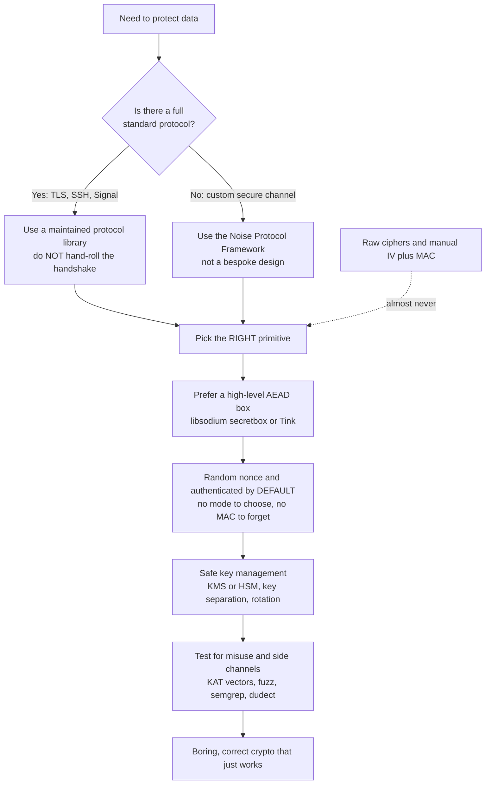

# 🛠️ Applied Cryptography Engineering

> [!abstract] TL;DR
> Knowing the algorithms is **necessary but not sufficient** — most real systems break not because AES was cracked, but because crypto was *used wrong*: no authentication, reused nonces, keys in source control, timing leaks. **Applied cryptography engineering** is the discipline of getting the *usage* right: **don't roll your own crypto**, reach for **vetted, misuse-resistant libraries** (libsodium, Tink, age) whose APIs make the safe path the default, choose the **highest abstraction that fits** (a maintained TLS stack over a hand-rolled handshake; an AEAD "box" over a raw cipher), keep keys in a **KMS/HSM**, use **constant-time** code you didn't write yourself, **test** with known-answer vectors and misuse linters, and design for **crypto-agility** so you can swap a broken primitive. The goal is boring, correct crypto that just works.

---

## Intuition

**Analogy:** Knowing how an internal-combustion engine works does not make you a safe driver. A mechanic who can rebuild a carburetor blindfolded will still crash if they run red lights, skip the seatbelt, and never check the mirrors. *Operating* the machine safely is a completely different skill from understanding its internals — and it is the skill that actually keeps you alive on the road.

Cryptography is the same. Understanding how AES rounds mix bytes or how RSA exponentiation works is engine knowledge. But real systems are wrecked by *driving* mistakes: encrypting without authenticating, reusing a nonce, comparing MACs with `==` instead of a constant-time check, hardcoding a key, seeding a "random" IV from the clock. Applied cryptography engineering is the driving discipline. Its foundational commandment — **"don't roll your own crypto"** — is not an insult to your intelligence; it is hard-won wisdom that *even expert cryptographers get implementations wrong*, so you use the primitives that have already survived a decade of expert review. You want the boring outcome: crypto that is correct by default and gives you no interesting options to get wrong.

---

## How It Works

### The gap between theory and practice

A cipher can be *provably* secure on paper and still produce a breached system, because a deployed cryptosystem is a stack and every layer is a place to fail:

- **The primitive** — is the algorithm itself sound? (Usually yes if you pick a modern standard.)
- **The implementation** — does *this code* compute it without side channels, edge-case bugs, or subtle math errors?
- **The construction** — are the primitives *composed* correctly? (Encrypt-then-MAC, not encrypt-and-hope.)
- **The usage** — does the calling code supply a fresh nonce, a real key, a validated certificate?
- **The operations** — where do keys live, how are they rotated, who can read them?

Cryptanalysis attacks the top layer; nearly every *production* failure lives in the bottom four. Applied crypto engineering is the discipline of hardening those four. (See the sibling notes *Cryptographic Failures and Misuse* for the failure catalogue and *Cryptanalysis Fundamentals* for why the top layer is rarely the weak point.)

### The four commandments

1. **Don't roll your own crypto.** This applies to *algorithms* (never invent a cipher), *protocols* (never invent a handshake), and *implementations* (don't even re-code a standard primitive like AES-GCM yourself — constant-time, side-channel-free implementation is a research-grade problem). Use vetted code that experts have attacked and audited.
2. **Prefer misuse-resistant APIs.** A good crypto API makes the *safe* choice the *default* and the unsafe choice hard or impossible. It hides ECB, hides manual IVs, refuses unauthenticated encryption, and generates the nonce for you. libsodium's `crypto_secretbox` is just `encrypt(message, nonce, key)` returning authenticated ciphertext — there is no bad mode to select.
3. **Choose the highest abstraction that fits.** Full protocols (TLS via a maintained library) beat authenticated-encryption boxes (`secretbox`) beat individual primitives (raw AEAD) beat raw ciphers (almost never). Higher level = fewer ways to fail.
4. **Design for agility and test relentlessly.** Version your protocol, tag algorithms by identifier, and keep known-answer tests, fuzzers, and misuse linters in CI so you can *prove* correctness and *swap* a primitive when it breaks (SHA-1, MD5, RSA-1024 all "broke" on schedule).

### The library landscape

**Recommended (misuse-resistant, well-defaulted):** libsodium / NaCl, Google **Tink** (opinionated, multi-language), **age** (dead-simple file encryption), the **Noise Protocol Framework** (build a *custom* secure channel *safely*), Rust's **RustCrypto** / **ring**, Python's **PyCA `cryptography`** / **PyNaCl**. **Handle with extreme care:** raw OpenSSL — powerful, ubiquitous, and a minefield of footguns unless you know exactly what you are doing. This is Daniel J. Bernstein's **"boring crypto"** philosophy: crypto should be uneventful.

### Flow / Architecture



---

## Key Concepts

### Secondary (the plain-English core)
- **Don't roll your own crypto.** Writing your own cipher or protocol is extraordinarily error-prone; use libraries experts already broke and fixed.
- **Use a library, use AEAD.** Reach for libsodium / Tink / age. Prefer **AEAD** (authenticated encryption) so tampering is detected automatically — never plain "encrypt only".
- **Safe defaults.** A good API generates the random nonce for you and refuses insecure modes. If the library *lets* you reuse an IV or skip the MAC, that is a footgun, not a feature.

### Undergraduate (the working-engineer checklist)
- **Encrypt-then-MAC / use AEAD** — authenticate the ciphertext; unauthenticated encryption enables bit-flipping and padding-oracle attacks (see [[Modes_of_Operation]], [[Message_Authentication_Codes]]).
- **Never reuse a nonce** under the same key — with CTR/GCM/stream ciphers this collapses to a two-time pad and leaks the plaintext XOR. Let the library pick a random nonce.
- **Use a CSPRNG** for keys, nonces, and IVs (`os.urandom`, `secrets`) — never `random`, never the clock (see [[Random_Number_Generation]]).
- **Constant-time comparison** for MACs and tokens (`hmac.compare_digest`) — `==` short-circuits and leaks a timing oracle.
- **Salt + slow-hash passwords** (Argon2/scrypt/bcrypt), never a bare SHA-256 (see [[Password_Hashing_and_KDFs]]).
- **Keys in a KMS/HSM**, key separation per purpose, rotation, validated certificates (see [[Key_Management_and_Distribution]]).

### Graduate (assurance and lifecycle)
- **Side-channel-safe code** — constant-time operations for comparisons, table lookups, and scalar multiplication; verified with **dudect**, **ctgrind**, or **ct-verif**. Writing leak-free code by hand is brutally hard — another reason to use vetted libraries (see sibling *Side Channel Attacks*).
- **Testing hierarchy** — **known-answer tests** against NIST/Wycheproof vectors, **property-based/fuzz** testing, and **misuse detection** via static analysis (semgrep rules, CodeQL) catching hardcoded keys, ECB, and weak RNG.
- **Formal verification** — implementations like **HACL\*/EverCrypt** (Project Everest) are *machine-proven* correct and constant-time, and ship in Firefox and the Linux kernel; the strongest assurance short of a full audit.
- **Crypto-agility** — versioned protocols and algorithm identifiers so you can migrate for the **post-quantum** transition or when a primitive breaks, without re-architecting (see [[Post_Quantum_Cryptography]]).

---

## Python Demo

```python
"""
Applied Cryptography Engineering — contrasting a footgun-laden hand-rolled
construction with a misuse-resistant "secretbox" API.

Pure standard library: hashlib + hmac + os + matplotlib.

WARNING: the toy SHA-256 keystream cipher below exists ONLY to demonstrate
engineering principles without an external crypto dependency. In production
you would call PyNaCl / libsodium or PyCA `cryptography` — never a hand-rolled
primitive. That is the whole point of this note.
"""

import os
import hmac
import hashlib
import matplotlib.pyplot as plt


def _keystream(key: bytes, nonce: bytes, nbytes: int) -> bytes:
    """CTR-style keystream: concatenated SHA256(key || nonce || counter) blocks."""
    out = bytearray()
    counter = 0
    while len(out) < nbytes:
        out.extend(hashlib.sha256(key + nonce + counter.to_bytes(8, "big")).digest())
        counter += 1
    return bytes(out[:nbytes])


def _xor(a: bytes, b: bytes) -> bytes:
    return bytes(x ^ y for x, y in zip(a, b))


# ---------------------------------------------------------------------------
# (a) DANGEROUS: hand-rolled, STATIC nonce, NO authentication
# ---------------------------------------------------------------------------
STATIC_NONCE = b"\x00" * 16  # footgun: fixed nonce, reused on every call


def dangerous_encrypt(msg: bytes, key: bytes) -> bytes:
    # No random nonce, no MAC — malleable AND leaks under reuse.
    return _xor(msg, _keystream(key, STATIC_NONCE, len(msg)))


# ---------------------------------------------------------------------------
# (b) MISUSE-RESISTANT: ONE api, random nonce, encrypt-then-MAC (AEAD-style)
#     Mirrors libsodium crypto_secretbox: secretbox(message, key) -> box
# ---------------------------------------------------------------------------
def _derive(key: bytes, label: bytes) -> bytes:
    """Key separation (HKDF-expand-like): distinct enc and mac subkeys."""
    return hmac.new(key, label, hashlib.sha256).digest()


def secretbox(msg: bytes, key: bytes) -> bytes:
    enc_key, mac_key = _derive(key, b"enc"), _derive(key, b"mac")
    nonce = os.urandom(24)                                    # fresh random nonce, ALWAYS
    ct = _xor(msg, _keystream(enc_key, nonce, len(msg)))
    tag = hmac.new(mac_key, nonce + ct, hashlib.sha256).digest()   # encrypt-THEN-MAC
    return nonce + ct + tag                                   # self-contained box


def secretbox_open(box: bytes, key: bytes) -> bytes:
    enc_key, mac_key = _derive(key, b"enc"), _derive(key, b"mac")
    nonce, ct, tag = box[:24], box[24:-32], box[-32:]
    expected = hmac.new(mac_key, nonce + ct, hashlib.sha256).digest()
    if not hmac.compare_digest(tag, expected):               # constant-time, verify BEFORE decrypt
        raise ValueError("authentication failed: tampered or wrong key")
    return _xor(ct, _keystream(enc_key, nonce, len(ct)))


# ---------------------------------------------------------------------------
# Misuse / property TESTS  (the kind you would keep in CI)
# ---------------------------------------------------------------------------
key = os.urandom(32)
msg = b"transfer $100 to alice"

# T1: same plaintext twice -> DIFFERENT ciphertext (proves the nonce is random)
box1, box2 = secretbox(msg, key), secretbox(msg, key)
assert box1 != box2, "secretbox must be non-deterministic"
assert secretbox_open(box1, key) == msg
print("T1 OK : encrypting twice yields different ciphertext (random nonce)")

# T2: tampering is REJECTED (the box is authenticated)
tampered = bytearray(box1)
tampered[30] ^= 0x01
try:
    secretbox_open(bytes(tampered), key)
    print("T2 FAIL: tampered ciphertext was accepted!")
except ValueError:
    print("T2 OK : tampered ciphertext rejected by the MAC")

# T3: the DANGEROUS version LEAKS — reused nonce => reused keystream => two-time pad
p1, p2 = b"attack at dawn!!", b"retreat at dusk!"   # equal length
c1, c2 = dangerous_encrypt(p1, key), dangerous_encrypt(p2, key)
assert _xor(c1, c2) == _xor(p1, p2), "keystream cancels; plaintext XOR leaks"
print("T3 OK : dangerous ciphertexts XOR to plaintext XOR — keystream was reused")

# ---------------------------------------------------------------------------
# Visualize the ATTACK SURFACE: how many things a developer can get wrong
# ---------------------------------------------------------------------------
handrolled = [
    "No authentication (bit-flip / malleable)",
    "Static nonce -> keystream reuse",
    "No key separation (one key, many uses)",
    "Timing-unsafe comparison (== oracle)",
    "Weak-RNG nonce possible",
    "Mode misuse possible (ECB / raw)",
    "Padding-oracle surface (CBC)",
]
resistant = ["Must keep the key secret"]

fig, ax = plt.subplots(figsize=(8, 5))
labels = ["Hand-rolled\n(low-level)", "secretbox\n(misuse-resistant)"]
counts = [len(handrolled), len(resistant)]
bars = ax.bar(labels, counts, color=["#c0392b", "#27ae60"])
for b, c in zip(bars, counts):
    ax.text(b.get_x() + b.get_width() / 2, c + 0.1, str(c), ha="center", fontweight="bold")
ax.text(0, -1.4, "\n".join("- " + f for f in handrolled), va="top", fontsize=8, color="#7b241c")
ax.text(1, -1.4, "\n".join("- " + f for f in resistant), va="top", fontsize=8, color="#186a3b")
ax.set_ylabel("Number of things a developer can get wrong")
ax.set_title("Attack surface: hand-rolled crypto vs a misuse-resistant API")
ax.set_ylim(-6.5, 8)
plt.tight_layout()
plt.savefig("attack_surface.png", dpi=120)
print("Saved attack_surface.png")
```

Running it prints all three test results and writes a bar chart. The takeaway is visual: the hand-rolled path exposes **seven** independent footguns; the `secretbox` API exposes essentially **one** (keep the key secret). Every option you *cannot* pass is a bug you *cannot* ship — that is what "misuse-resistant" buys you.

---

## Real-World Applications

- **Signal / WhatsApp** — build on libsodium-style primitives and the Double Ratchet rather than bespoke crypto; the protocol is standardized and audited, not invented per-app.
- **Firefox & the Linux kernel** — ship **HACL\*/EverCrypt**, formally verified constant-time implementations of ChaCha20-Poly1305, Curve25519, and SHA-2, so correctness is *proven*, not just tested.
- **Age & Tailscale** — `age` gives dead-simple, hard-to-misuse file encryption; Tailscale builds its mesh on the **Noise Protocol Framework** instead of a hand-rolled handshake.
- **Cloud KMS (AWS KMS, GCP KMS, Vault)** — provide envelope encryption and keys that never leave the HSM in plaintext, so application code never touches raw key material.
- **Google Tink** — deployed across Google products precisely because its opinionated API removes the ECB / static-IV / unauthenticated-encryption footguns from thousands of developers' hands.

---

## Common Pitfalls

- **Rolling your own** — inventing a cipher, protocol, or re-implementing a "standard" primitive. Subtle math bugs, side channels, and protocol flaws are invisible until an attacker finds them. Use vetted code.
- **Unauthenticated encryption** — encrypting without a MAC/AEAD invites bit-flipping and padding-oracle attacks. Always use authenticated encryption; verify the tag *before* decrypting.
- **Nonce/IV reuse** — the single most common catastrophic misuse; with CTR/GCM/stream ciphers it leaks plaintext and (for GCM) the authentication key. Let the library generate the nonce.
- **Weak randomness** — seeding keys or IVs from `random`, PIDs, or timestamps. Use a CSPRNG (`os.urandom`, `secrets`) exclusively.
- **Timing-unsafe comparison** — `tag == expected` short-circuits and leaks a byte-by-byte timing oracle. Use `hmac.compare_digest`.
- **Hardcoded / committed keys** — keys in source, config, or a public repo. Catch them with secret scanners and SAST; store keys in a KMS/HSM.
- **No crypto-agility** — hardcoding a primitive so you cannot migrate when SHA-1/MD5/RSA-1024 (or a pre-quantum scheme) breaks. Tag algorithms by identifier and version your protocol.

---

## Related Concepts

- [[Cryptography_Overview]] — the map of the field this note operationalizes into safe practice.
- [[Modes_of_Operation]] — *why* raw modes (ECB, unauthenticated CBC) are footguns and why AEAD is the default.
- [[Message_Authentication_Codes]] — the integrity half of AEAD; the "encrypt-then-MAC" the demo implements.
- [[Key_Management_and_Distribution]] — where keys actually live (KMS/HSM, rotation, key separation).
- [[Random_Number_Generation]] — the CSPRNG that every nonce, IV, and key depends on.
- [[TLS_and_Secure_Channels]] — the canonical "use a maintained protocol, don't hand-roll the handshake" case.
- [[Password_Hashing_and_KDFs]] — salt + slow-hash discipline for credentials; HKDF-style key separation.
- [[Block_Ciphers_and_AES]] — the primitive underneath; understanding it, yet still *not* implementing it yourself.
- [[Secure_Messaging_and_Signal_Protocol]] — Noise/Signal as "custom secure channel done safely".
- [[Provable_Security_and_Reductions]] — why paper-secure primitives still fail without correct engineering.
- [[Post_Quantum_Cryptography]] — the migration that crypto-agility exists to enable.
- [[Secure_Coding_Practices]] — the broader appsec discipline this sits inside.
- [[SAST_Static_Analysis]] — the tooling (semgrep/CodeQL) that flags hardcoded keys, ECB, and weak RNG.
- [[Verified_and_Certified_Languages]] — the formal-verification lineage behind HACL\*/EverCrypt.

---

## Review Questions

1. **(Secondary)** Explain to a junior developer why "we wrote our own encryption so attackers won't know the algorithm" is wrong on two counts — one about Kerckhoffs's principle and one about the "don't roll your own crypto" rule.
2. **(Undergraduate)** Given a codebase that encrypts with AES-CBC using a static IV and no MAC, list every distinct thing that can go wrong, and describe how switching to a single `secretbox`-style AEAD call removes each one.
3. **(Graduate)** You must ship a new service that will outlive today's algorithms and eventually migrate to post-quantum primitives. Describe how you would design for crypto-agility, what testing/verification you would put in CI (KAT vectors, fuzzing, misuse linters, constant-time checks), and when you would commission a third-party audit versus rely on a formally verified library.

---

## Sources

- Aumasson, J.-P. *Serious Cryptography*, 2nd ed. — No Starch Press, 2024. (Applied engineering, misuse, and the secretbox model.)
- [libsodium documentation — Secret-key authenticated encryption (`crypto_secretbox`)](https://doc.libsodium.org/secret-key_cryptography/secretbox)
- [Google Tink — A multi-language, cross-platform cryptographic library](https://developers.google.com/tink)
- [HACL\* / Project Everest — Formally verified cryptographic library](https://github.com/hacl-star/hacl-star)
- [Latacora — "Cryptographic Right Answers" (2018)](https://latacora.micro.blog/2018/04/03/cryptographic-right-answers.html)

---

#cryptography #crypto-engineering #libsodium #misuse-resistant #dont-roll-your-own
