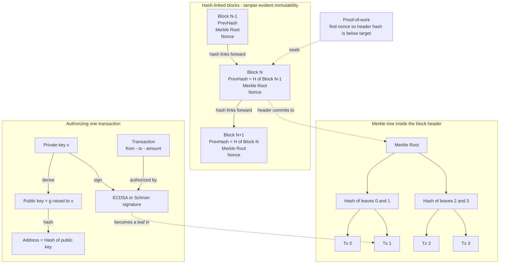

# ⛓️ Blockchain Cryptography

> [!abstract] TL;DR
> A **blockchain is applied cryptography at civilization scale** — a public, append-only ledger held by mutually distrusting strangers whose *every* security property comes from crypto primitives, not from any trusted authority. **Hash chains** link blocks (each block stores the SHA-256 hash of its predecessor), so altering any past entry changes its hash and **breaks every seal after it** — that is **immutability / tamper-evidence**. **Merkle trees** compress all transactions in a block into a single **Merkle root** in the header, letting a light client prove one transaction is included with only `O(log n)` hashes — a **Merkle proof** — instead of downloading the whole block. **Digital signatures** (ECDSA on `secp256k1` for Bitcoin/Ethereum, **Schnorr** since Taproot, **EdDSA** and **BLS** elsewhere) authorize every transaction: ownership *is* control of a private key. **Addresses** are **hashes of public keys** (`RIPEMD160(SHA256(pubkey))` in Bitcoin), adding indirection, privacy, and quantum-resistance-until-spend. **Proof-of-work** turns the hash function into a hard, one-way puzzle — miners search for a nonce making the block hash fall below a target. The frontier stacks **zk-SNARKs/STARKs** (private transactions in Zcash, zk-rollups scaling Ethereum), **BLS aggregation** (thousands of validator signatures collapsed into one), **VRFs** (verifiable on-chain randomness), and **commitments / ring signatures** (confidential amounts in Monero). Remove the cryptography and a blockchain is just a slow, expensive, replicated database.

---

## Intuition

**Analogy — a tamper-evident ledger held by strangers who do not trust each other.** Imagine a shared account book that lives in thousands of copies around the world, written and audited by people who have never met and have no reason to trust one another. There is no bank, no notary, no referee. Yet everyone agrees on exactly what the book says, nobody can quietly edit a past page, and anyone can prove that their entry is really in the book. How? The book is held together **entirely by cryptography**:

- Each page is stamped with a **wax seal computed from the previous page's seal** — a hash chain. Change one word on page 40 and its seal changes, which invalidates the seal reference on page 41, which invalidates 42, and so on. To rewrite history you must **re-forge every seal from that page to the end of the book** — and out-run everyone still adding honest pages.
- Each page summarizes its hundreds of entries into a single tiny **fingerprint of fingerprints** — a Merkle root — so you can prove "my transaction is on this page" by showing a short **path of sibling fingerprints** rather than reading the whole page.
- Each entry carries an **unforgeable signature** proving *who* authorized it, without revealing the private key that made it. Owning coins simply means holding a key: **"not your keys, not your coins."**

Strip those three primitives away and the magic vanishes — you are left with a plain database that any editor could rewrite. Blockchain is the ultimate showcase of the primitives in this vault ([[Hash_Functions]], [[Digital_Signatures]], [[Elliptic_Curve_Cryptography]], [[Zero_Knowledge_Proofs]]) **composed into a single working trustless system**. See [[Cryptography_Overview]] for the wider map.

---

## How It Works

### Core mechanics

1. **Hash-linked blocks (the chain).** A block header contains, among other fields, the **hash of the previous block header** and the **Merkle root** of its transactions. Because a cryptographic hash is collision-resistant and avalanche-sensitive, the header's hash is a compact commitment to *everything* the block contains **and** to the entire history before it. Tampering with any past block changes that block's hash, so the "previous hash" pointer in the next block no longer matches — the chain visibly breaks from that point forward. This is **tamper-evidence**, and combined with proof-of-work it becomes practical **immutability**: rewriting history means redoing all subsequent work faster than the honest majority. Collision resistance of SHA-256 is **load-bearing** — a practical collision would let an attacker swap block contents undetectably. See [[Hash_Functions]] and [[Hash_Functions_and_Merkle_Trees]].
2. **Merkle tree (efficient membership).** Transactions are hashed into leaves; pairs of hashes are hashed together up the tree until one **Merkle root** remains, stored in the header. A **Merkle proof (inclusion proof)** for one transaction is just the `O(log n)` **sibling hashes** along the path to the root — enough for a **light / SPV client** to verify inclusion against a header it trusts, **without the full block**. The same structure powers Ethereum's Merkle-Patricia state tries, Git commits, IPFS Merkle-DAGs, and certificate transparency logs.
3. **Digital signatures (authorization).** Every transaction is **signed by the sender's private key**. The signature proves authorization and gives **non-repudiation** without exposing the key. Bitcoin and Ethereum use **ECDSA over `secp256k1`**; Bitcoin's **Taproot** upgrade added **Schnorr**, which is linear and enables clean key/signature aggregation; other chains use **EdDSA** (Ed25519). See [[Digital_Signatures]], [[Elliptic_Curve_Cryptography]], and [[ECDSA_and_Digital_Signatures]].
4. **Addresses (hash of public key).** An address is derived by **hashing the public key** — Bitcoin uses `RIPEMD160(SHA256(pubkey))`. Hashing adds a layer of indirection (privacy: your public key stays hidden until you first spend) and **quantum-resistance-until-spend** (Shor cannot attack a key it has never seen). **HD wallets** (BIP32/39/44) derive an entire *tree* of keys from a single seed phrase — see [[Key_Management_and_Distribution]] and [[Crypto_Wallets]].
5. **Proof-of-work (Nakamoto consensus).** Mining is finding a **nonce** so that `SHA256(SHA256(header))` is **below a target** — a partial hash **preimage** search. Because hashing is one-way, the only strategy is brute force, making blocks **expensive to produce but trivial to verify**. This turns the hash function into the economic engine of consensus. See [[Mining_and_Difficulty]] and [[Blockchain_and_Nakamoto_Consensus]].
6. **The frontier.** **zk-SNARKs/STARKs** prove a batch of transactions is valid while revealing nothing (Zcash privacy, Ethereum **zk-rollups**); **BLS** aggregates thousands of validator signatures into one for Ethereum consensus; **VRFs** give verifiable randomness for leader election (Algorand, Chainlink); **Pedersen commitments** and **ring signatures** hide amounts and senders (Monero); **threshold/multisig** custody and **MPC** enable distributed validators and private DeFi. See [[Zero_Knowledge_Proofs]], [[Commitment_Schemes_and_Secret_Sharing]], [[Oblivious_Transfer_and_Threshold_Cryptography]], [[Secure_Multiparty_Computation]], and [[Random_Number_Generation]].

### Flow / Architecture



---

## Key Concepts

**Secondary (explain to a curious beginner).** A blockchain is a chain of "blocks." Each block carries a **fingerprint (hash) of the block before it**, like pages that each quote the seal of the previous page. If you change an old block, its fingerprint changes, so the next block's quote is wrong and everyone notices — that is why blockchains are hard to edit. Each transaction is signed with a secret **private key**, and your **address** is just a scrambled version (hash) of your **public key**. Owning crypto means owning the key.

**Undergraduate (needs a CS background).** The three load-bearing primitives are: **(1) a collision-resistant hash** `H` used both to chain block headers (`header_i` includes `H(header_{i-1})`) and to build **Merkle trees**, giving `O(log n)` inclusion proofs; **(2) an EC signature scheme** — ECDSA over `secp256k1` — where a transaction is valid iff `Verify(pubkey, msg, sig)` holds, and the address is `RIPEMD160(SHA256(pubkey))`; and **(3) proof-of-work**, a partial-preimage puzzle: find `nonce` such that `H(header || nonce) < target`. Difficulty adjusts `target` to keep block time roughly constant. Tamper-evidence is the composition: editing block `k` forces re-mining blocks `k..n`. Note ECDSA's **malleability** (both `s` and `-s mod n` verify) motivated Bitcoin's SegWit txid fix — see [[Taproot_and_SegWit]].

**Graduate (system-level thinking).** The security reduction: chain immutability reduces to **collision resistance** of `H` and the **honest-majority hashrate** assumption of Nakamoto consensus; unforgeability of ownership reduces to **EC-DLP hardness** (ECDSA/Schnorr EUF-CMA in the ROM). **Schnorr** is *linear* — `s = r + c·x` — enabling **key aggregation (MuSig2)** and Taproot's indistinguishable multisig; **BLS** signatures are pairing-based, non-interactively aggregatable (`σ_agg = Π σ_i`, verified with one pairing check), which is why Ethereum's beacon chain aggregates thousands of attestations. The frontier composes: **zk-SNARKs/STARKs** provide succinct verification of arbitrary state transitions (validity rollups), **VRFs** give bias-resistant leader election with a proof, **Pedersen commitments** `C = g^v h^r` hide amounts while remaining additively homomorphic for balance checks, and **ring signatures** provide sender anonymity. The looming risk is **post-quantum**: exposed public keys (revealed on first spend, or always for pay-to-pubkey) are **Shor-vulnerable**, and migrating an *immutable* chain to hash-based or lattice signatures is a governance and coordination problem, not just a crypto one — see [[Post_Quantum_Cryptography]] and [[Post_Quantum_Cryptography_Blockchain]].

---

## Python Demo

```python
# Blockchain Cryptography: the CRYPTOGRAPHIC skeleton of a blockchain.
#   (a) HASH CHAIN  -> tamper in one block breaks the chain from there on
#   (b) MERKLE TREE -> build a root + produce/verify an O(log n) inclusion proof
#   (c) ADDRESS + SIGNATURE -> address = hash(pubkey); toy Schnorr authorizes a transfer
# Then VISUALIZE the tamper-propagation and the Merkle proof path with matplotlib.
# Pure stdlib + hashlib + matplotlib.  Run:  python blockchain_crypto_demo.py

import hashlib
import secrets
import matplotlib.pyplot as plt
import matplotlib.patches as mpatches

def H(b: bytes) -> bytes:
    """SHA-256 as raw bytes (the load-bearing collision-resistant hash)."""
    return hashlib.sha256(b).digest()

def hx(b: bytes) -> str:
    return b.hex()

# ---------------------------------------------------------------------------
# (a) HASH CHAIN -- each block commits to the previous block's hash
# ---------------------------------------------------------------------------
class Block:
    def __init__(self, index, data, prev_hash, nonce=0):
        self.index = index
        self.data = data
        self.prev_hash = prev_hash      # stored pointer to previous block's hash
        self.nonce = nonce

    def hash(self) -> bytes:
        payload = f"{self.index}|{self.data}|{self.prev_hash}|{self.nonce}".encode()
        return hashlib.sha256(payload).digest()

def mine(index, data, prev_hash, leading_zero_hex=3):
    """Proof-of-work: search for a nonce so the block hash starts with N zero hex digits.
    This is a partial-preimage puzzle -- the one-way-ness of SHA-256 makes it hard."""
    prefix = "0" * leading_zero_hex
    nonce = 0
    while True:
        b = Block(index, data, prev_hash, nonce)
        if b.hash().hex().startswith(prefix):
            return b
        nonce += 1

def build_chain(datas):
    chain = []
    prev = "0" * 64  # genesis "previous hash"
    for i, d in enumerate(datas):
        b = mine(i, d, prev)
        chain.append(b)
        prev = b.hash().hex()
    return chain

def first_broken(chain):
    """Return the index of the first block whose link is broken, or None if intact."""
    for i in range(1, len(chain)):
        if chain[i].prev_hash != chain[i - 1].hash().hex():
            return i
    return None

datas = ["genesis", "alice->bob 5", "bob->carol 3", "carol->dave 2",
         "dave->erin 1", "erin->frank 4"]
chain = build_chain(datas)
print("HASH CHAIN")
print("  intact chain, first broken link:", first_broken(chain))  # None

# Tamper with block 2's data WITHOUT re-mining the rest (as an attacker would try).
TAMPER = 2
chain[TAMPER].data = "bob->MALLORY 3"
broken = first_broken(chain)
print(f"  tampered block {TAMPER}: chain now breaks at link index -> {broken}")
print("  every block from there on is invalid (tamper-evidence).\n")

# ---------------------------------------------------------------------------
# (b) MERKLE TREE -- root + inclusion proof (does NOT reveal all transactions)
# ---------------------------------------------------------------------------
def build_merkle(tx_list):
    """Return list of layers; layers[0] = leaf hashes (padded), layers[-1] = [root]."""
    cur = [H(tx.encode()) for tx in tx_list]
    layers = []
    while True:
        if len(cur) % 2 == 1 and len(cur) > 1:
            cur = cur + [cur[-1]]           # Bitcoin-style: duplicate the last leaf
        layers.append(cur)
        if len(cur) == 1:
            break
        cur = [H(cur[i] + cur[i + 1]) for i in range(0, len(cur), 2)]
    return layers

def merkle_proof(layers, index):
    """The O(log n) authentication path: sibling hash + which side it sits on."""
    proof, idx = [], index
    for layer in layers[:-1]:               # every layer except the root
        sib = idx ^ 1                        # sibling is the paired node
        side = "right" if sib > idx else "left"
        proof.append((layer[sib], side))
        idx //= 2
    return proof

def verify_proof(leaf_hash, proof, root):
    cur = leaf_hash
    for sib, side in proof:
        cur = H(cur + sib) if side == "right" else H(sib + cur)
    return cur == root

txs = [f"tx{i}" for i in range(8)]           # 8 transactions -> path length 3
layers = build_merkle(txs)
root = layers[-1][0]
PROVE = 5                                     # prove tx5 is included
proof = merkle_proof(layers, PROVE)
leaf = H(txs[PROVE].encode())
ok = verify_proof(leaf, proof, root)
print("MERKLE TREE")
print("  root:", hx(root)[:16], "...")
print(f"  proof for {txs[PROVE]} uses {len(proof)} sibling hashes (not all 8 txs)")
print("  proof verifies against root:", ok, "\n")

# ---------------------------------------------------------------------------
# (c) ADDRESS = hash(public_key) + a toy Schnorr signature authorizing a transfer
#     Toy prime-order group (p=2039, q=1019, g=4) -- illustrative, NOT secure sizes.
# ---------------------------------------------------------------------------
p, q, g = 2039, 1019, 4                       # p safe prime, q prime order of g

def keygen():
    x = 1 + secrets.randbelow(q - 1)          # private key
    y = pow(g, x, p)                          # public key  y = g^x mod p
    return x, y

def address(y):
    """Bitcoin uses RIPEMD160(SHA256(pubkey)); we use double-SHA256[:20] for portability."""
    pub = y.to_bytes(2, "big")
    return hashlib.sha256(H(pub)).hexdigest()[:40]

def sign(msg, x):
    r = 1 + secrets.randbelow(q - 1)
    t = pow(g, r, p)                          # commitment
    c = int.from_bytes(H(f"{t}:{msg}".encode()), "big") % q  # Fiat-Shamir challenge
    s = (r + c * x) % q                       # response
    return (t, s)

def verify(msg, sig, y):
    t, s = sig
    c = int.from_bytes(H(f"{t}:{msg}".encode()), "big") % q
    return pow(g, s, p) == (t * pow(y, c, p)) % p   # g^s == t * y^c  (mod p)

x, y = keygen()
addr = address(y)
tx = f"{addr}->beef... amount=10"
sig = sign(tx, x)
print("SIGNED TRANSACTION")
print("  address (hash of pubkey):", addr)
print("  signature verifies:", verify(tx, sig, y))
forged = sign(tx, keygen()[0])                # someone else's key cannot authorize
print("  forged-by-other-key verifies:", verify(tx, forged, y), "\n")

# ---------------------------------------------------------------------------
# VISUALIZATION
# ---------------------------------------------------------------------------
fig, (ax1, ax2) = plt.subplots(2, 1, figsize=(12, 10))

# --- ax1: hash-chain tamper propagation --------------------------------------
n = len(chain)
for i in range(n):
    if i < TAMPER:
        col = "#4caf50"            # green: valid, untouched
    elif i == TAMPER:
        col = "#ff9800"            # orange: the tampered block
    else:
        col = "#e53935"            # red: link broken, cascades to the end
    ax1.add_patch(mpatches.FancyBboxPatch((i * 2, 0), 1.4, 1.2,
                  boxstyle="round,pad=0.05", facecolor=col, edgecolor="black"))
    ax1.text(i * 2 + 0.7, 0.6, f"Block {i}", ha="center", va="center",
             color="white", fontsize=9, fontweight="bold")
    if i > 0:
        edge_broken = (i - 1 >= TAMPER)      # link out of a tampered/invalid block
        ax1.annotate("", xy=(i * 2, 0.6), xytext=(i * 2 - 0.6, 0.6),
                     arrowprops=dict(arrowstyle="->", lw=2,
                                     color=("#e53935" if edge_broken else "#4caf50")))
ax1.text(TAMPER * 2 + 0.7, 1.6, "tampered here", ha="center", color="#ff9800",
         fontweight="bold")
ax1.set_xlim(-1, n * 2)
ax1.set_ylim(-0.5, 2.2)
ax1.axis("off")
ax1.set_title("(a) Hash chain: tampering block 2 breaks every link after it "
              "(green=valid link, red=broken)")

# --- ax2: Merkle proof path --------------------------------------------------
depth = len(layers)
def node_x(li, j):
    span = 2 ** li
    return j * span + (span - 1) / 2

path_nodes = {(li, PROVE >> li) for li in range(depth)}          # recomputed path
proof_nodes = {(li, (PROVE >> li) ^ 1) for li in range(depth - 1)}  # siblings shown

for li, layer in enumerate(layers):
    for j in range(len(layer)):
        x0, y0 = node_x(li, j), li
        if (li, j) == (depth - 1, 0):
            col = "#1e88e5"       # blue: root
        elif (li, j) in proof_nodes:
            col = "#ff9800"       # orange: proof siblings supplied
        elif (li, j) in path_nodes:
            col = "#4caf50"       # green: recomputed along the path
        else:
            col = "#bdbdbd"       # grey: not needed for this proof
        ax2.add_patch(mpatches.FancyBboxPatch((x0 - 0.35, y0 - 0.2), 0.7, 0.4,
                      boxstyle="round,pad=0.02", facecolor=col, edgecolor="black"))
        lbl = "ROOT" if (li, j) == (depth - 1, 0) else (
              txs[j] if li == 0 else "")
        if lbl:
            ax2.text(x0, y0, lbl, ha="center", va="center", color="white", fontsize=8)
        if li > 0:  # edges down to children
            for child in (2 * j, 2 * j + 1):
                if child < len(layers[li - 1]):
                    ax2.plot([x0, node_x(li - 1, child)], [y0 - 0.2, li - 1 + 0.2],
                             color="#888", lw=1, zorder=0)

ax2.set_xlim(-1, len(layers[0]))
ax2.set_ylim(-0.6, depth - 0.4)
ax2.axis("off")
ax2.set_title(f"(b) Merkle proof for {txs[PROVE]}: only orange siblings are revealed; "
              "green path is recomputed up to the blue root")

legend = [mpatches.Patch(color="#1e88e5", label="Merkle root"),
          mpatches.Patch(color="#4caf50", label="recomputed path"),
          mpatches.Patch(color="#ff9800", label="proof siblings (O(log n))"),
          mpatches.Patch(color="#bdbdbd", label="not revealed")]
ax2.legend(handles=legend, loc="upper right", fontsize=8)

plt.tight_layout()
plt.savefig("blockchain_crypto_demo.png", dpi=120)
print("Saved visualization -> blockchain_crypto_demo.png")
```

Running it prints that the intact chain has no broken link, that tampering block 2 breaks the chain at link index 3 (cascading to the end), that a Merkle proof for `tx5` uses only 3 sibling hashes and still verifies against the root, and that a signature made with the wrong private key fails to authorize the transfer. The figure shows the red tamper-cascade and the orange authentication path climbing to the blue root.

---

## Real-World Applications

- **Bitcoin** — SHA-256 hash chain + Merkle roots in headers + ECDSA/`secp256k1` (now Schnorr via [[Taproot_and_SegWit]]) signatures + `RIPEMD160(SHA256(pubkey))` addresses + double-SHA-256 proof-of-work. The canonical composition of every primitive here.
- **Ethereum** — ECDSA transactions, **Merkle-Patricia tries** for account/state/receipt roots, and post-Merge **BLS** signature aggregation across thousands of validator attestations in the beacon chain.
- **zk-Rollups (zkSync, StarkNet, Scroll)** — batch thousands of L2 transactions and post a single **zk-SNARK/STARK** validity proof to Ethereum L1; the chain verifies the proof instead of re-executing every transaction. Scaling *is* cryptography here.
- **Zcash / Monero** — privacy via **zk-SNARKs** (shielded pools) and **Pedersen commitments + ring signatures** (confidential amounts and sender anonymity) respectively — see [[Zero_Knowledge_Proofs]] and [[Commitment_Schemes_and_Secret_Sharing]].
- **Algorand / Chainlink VRF** — **verifiable random functions** produce on-chain randomness with a proof, used for bias-resistant leader selection and fair lotteries — see [[Random_Number_Generation]].
- **Beyond currency** — **Certificate Transparency** logs, **Git** commit DAGs, and **IPFS/Filecoin** content-addressing all use Merkle trees/DAGs for the same tamper-evident, verifiable-membership guarantees — see [[IPFS_and_Filecoin]].

---

## Common Pitfalls

- **Treating "immutable" as "unhackable."** Immutability protects the *ledger's history*, not the smart contracts, bridges, or private keys on top of it. Most losses are stolen keys and buggy contracts, not broken hashes.
- **Nonce reuse in ECDSA.** Signing two different messages with the **same `k`** (per-signature nonce) leaks the private key via simple algebra — this is exactly how the Sony PS3 and early Android wallets were compromised. Use RFC 6979 deterministic nonces.
- **Signature malleability.** ECDSA accepts both `s` and `n - s`; treating the signature as part of a transaction's identity (as pre-SegWit Bitcoin did) let attackers alter txids. Fixed by low-`s` rules and SegWit/Taproot.
- **Confusing collision vs preimage strength.** Proof-of-work needs *preimage-style* difficulty; chain integrity needs *collision* resistance. SHA-256's ~128-bit collision resistance (birthday bound) is the real ceiling — see [[Hash_Functions]].
- **Assuming a valid Merkle proof means a valid transaction.** A proof only shows *inclusion under a given root*; the client must independently trust that the **header/root** came from the honest longest chain.
- **Ignoring the post-quantum clock.** Reused or exposed public keys are Shor-vulnerable; migrating an immutable chain to PQ signatures is a coordination nightmare — see [[Post_Quantum_Cryptography]].
- **Weak or biased on-chain randomness.** Using a block hash as "randomness" is miner/validator-manipulable; VRFs or commit-reveal exist precisely to fix this.

---

## Related Concepts

- [[Hash_Functions]] — the collision- and preimage-resistant primitive that chains blocks, builds Merkle trees, and powers proof-of-work; the single most load-bearing tool.
- [[Digital_Signatures]] — authorize every transaction; ownership is control of the signing key (non-repudiation, EUF-CMA).
- [[Elliptic_Curve_Cryptography]] — the `secp256k1` / Ed25519 curves behind ECDSA, Schnorr, EdDSA, and BLS keys and addresses.
- [[Zero_Knowledge_Proofs]] — zk-SNARKs/STARKs for private transactions (Zcash) and validity rollups scaling Ethereum.
- [[Commitment_Schemes_and_Secret_Sharing]] — Pedersen commitments hide amounts; secret sharing underpins threshold/multisig custody.
- [[Oblivious_Transfer_and_Threshold_Cryptography]] — threshold and multisig signatures for distributed validators and shared custody.
- [[Secure_Multiparty_Computation]] — MPC enables distributed key signing and privacy-preserving DeFi over shared secrets.
- [[Key_Management_and_Distribution]] — HD wallets, seed phrases, and the custody problem behind "not your keys, not your coins."
- [[Random_Number_Generation]] — VRFs and unbiased randomness for leader election; nonce generation for signatures.
- [[Cryptography_Overview]] — the map of primitives that blockchain composes into one production system.
- [[Hash_Functions_and_Merkle_Trees]] — the Blockchain-vault deep dive on hashing and Merkle structures.
- [[ECDSA_and_Digital_Signatures]] — the Blockchain-vault view of signature schemes on the wire.
- [[Cryptographic_Primitives_Blockchain]] — companion primitives note from the Blockchain fundamentals section.
- [[Mining_and_Difficulty]] — proof-of-work target search and difficulty adjustment in practice.
- [[Taproot_and_SegWit]] — Schnorr adoption, key aggregation, and the malleability fix in Bitcoin.
- [[Crypto_Wallets]] — BIP32/39/44 HD wallets and address derivation in the wild.
- [[Blockchain_and_Nakamoto_Consensus]] — how hash-based proof-of-work becomes probabilistic distributed consensus.
- [[Post_Quantum_Cryptography]] — the Shor threat to exposed public keys and PQ signature migration.
- [[Post_Quantum_Cryptography_Blockchain]] — the Blockchain-vault treatment of the same migration challenge.
- [[IPFS_and_Filecoin]] — Merkle-DAG content addressing, the same tamper-evident structure beyond currency.

---

## Review Questions

1. **(Conceptual)** Why does changing one byte in an old block invalidate *every* later block rather than just that one? Which specific property of the hash function makes this tamper-evidence, and which additional assumption turns tamper-*evidence* into practical *immutability*?
2. **(Scenario)** A light-wallet on your phone wants to confirm that your payment is in block 800,000 but cannot store the block's 3,000 transactions. Describe exactly what data it downloads and the steps it runs to be convinced, and state precisely what it must still trust that the proof itself does not establish.
3. **(Trade-off)** Compare **ECDSA**, **Schnorr**, and **BLS** for a chain with thousands of validators signing every block: which would you choose to minimize on-chain signature size and verification cost, what do you give up (interactivity, aggregation model, assumptions), and how does the choice interact with the post-quantum migration problem?

---

## Sources

- [Nakamoto, S. (2008). *Bitcoin: A Peer-to-Peer Electronic Cash System*](https://bitcoin.org/bitcoin.pdf)
- [Merkle, R. (1988). *A Digital Signature Based on a Conventional Encryption Function* (CRYPTO '87)](https://link.springer.com/chapter/10.1007/3-540-48184-2_32)
- [Ben-Sasson, E. et al. (2014). *Zerocash: Decentralized Anonymous Payments from Bitcoin* (IEEE S&P)](https://ieeexplore.ieee.org/document/6956581)
- [Boneh, D., Lynn, B., Shacham, H. (2001). *Short Signatures from the Weil Pairing* (BLS)](https://link.springer.com/chapter/10.1007/3-540-45682-1_30)
- [Antonopoulos, A. & Wood, G. *Mastering Bitcoin / Mastering Ethereum* (crypto primitives chapters)](https://github.com/bitcoinbook/bitcoinbook)

---

#cryptography #blockchain #merkle-trees #hash-chains #ecdsa
