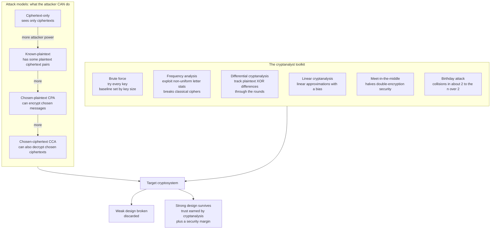

# 🕵️ Cryptanalysis Fundamentals

> [!abstract] TL;DR
> **Cryptanalysis** is the science of **breaking** cryptographic systems — recovering plaintext or keys without authorization, or finding any weakness that undermines a scheme's stated guarantees. It is the adversarial half of **cryptology** (cryptography + cryptanalysis), and it is *what makes cryptography trustworthy*: a cipher is believed secure only after years of public cryptanalysis fails to break it. The field is organized by **attack models** — how much power the attacker has: **ciphertext-only** (sees only ciphertexts), **known-plaintext** (has some plaintext–ciphertext pairs), **chosen-plaintext / CPA** (can encrypt messages of its choosing), and **chosen-ciphertext / CCA** (can also decrypt). Its **toolkit** spans the ancient (**frequency analysis**, al-Kindi, 9th century) to the modern (**differential** and **linear** cryptanalysis, which broke many ciphers and forced AES's S-box design), plus generic bounds like **brute force** (set by key size), the **meet-in-the-middle** trick (why *double*-DES gives only ~57 bits, not 112), and the **birthday attack** (collisions in ~$2^{n/2}$, why hash outputs are doubled). The golden rule: *"attacks only get better, never worse"* — so security rests on **openness** ([[Cryptography_Overview|Kerckhoffs's principle]]) plus a hefty **security margin** beyond the best known attack.

---

## Intuition

**Analogy — the locksmith who picks locks to build better ones.** The best lock designers in the world are also expert lock *pickers*. You cannot know whether a lock is strong by admiring it; you know only by handing it to the most skilled burglars alive and watching them fail. A lock that has survived a decade of relentless picking attempts by everyone who tried is one you can bolt to your front door with confidence. A brand-new lock that "looks unpickable" but has never been attacked is a gamble. **Cryptanalysis is the picking, and it is not vandalism — it is quality control.** Every cipher you actually trust today (AES, SHA-2, RSA) is trusted *precisely because* an army of cryptanalysts spent decades trying to break it and came up empty.

Translate this into cipher terms. A cryptanalyst does not politely ask for the key; they exploit any crack — a statistical fingerprint the cipher forgot to erase, a mathematical relationship between input and output differences, a key space small enough to exhaust, a collision that arrives far sooner than the digest size suggests. Cryptography and cryptanalysis are a perpetual arms race: each new attack technique kills a generation of weak designs and, in doing so, *teaches the next generation how to be strong*. Differential cryptanalysis did not just break ciphers — it handed designers the exact criterion (nonlinear, differentially-uniform S-boxes) that AES was built to satisfy. **You cannot design a strong cipher without understanding how ciphers are broken.**

---

## How It Works

Cryptanalysis is structured along two axes: **what the attacker can do** (the *attack model*) and **how they exploit the cipher** (the *technique*). Stronger attack models grant the attacker more power, so a scheme proven secure against a stronger model gives a stronger guarantee — this is the same ladder used in [[Provable_Security_and_Reductions|provable security]] (CPA ⊂ CCA).

### The attack models — from weakest to strongest attacker

1. **Ciphertext-only (COA).** The attacker sees only ciphertexts and must exploit residual structure. This is the hardest setting for the attacker, yet **frequency analysis** breaks classical ciphers here — the ancient Enigma break at Bletchley Park was largely ciphertext-only aided by cribs.
2. **Known-plaintext (KPA).** The attacker holds some plaintext–ciphertext pairs (e.g., a predictable header). Many statistical and linear attacks live here.
3. **Chosen-plaintext (CPA).** The attacker can *encrypt messages of its choosing* and observe the ciphertexts — an "encryption oracle." **Differential** and **linear** cryptanalysis are CPA/KPA attacks; they need many chosen or known pairs.
4. **Chosen-ciphertext (CCA).** The strongest common model: the attacker can also *decrypt chosen ciphertexts* (except the target) via a "decryption oracle." Padding-oracle and Bleichenbacher attacks are real-world CCA attacks.

The principle: **design for the strongest model your attacker could plausibly reach.** Modern schemes target **IND-CCA2**, because in the real world attackers *do* get to submit ciphertexts and watch reactions.

### The classic and modern toolkit

- **Brute force / exhaustive key search.** The baseline every cipher must beat: try all $2^\kappa$ keys. Infeasible for $\kappa \ge 128$ ($2^{128}$ is astronomically large), but **DES's 56-bit key** ($2^{56}$) was cracked by the EFF's *Deep Crack* in ~2 days (1998). Brute force sets the security bar — everything else is an attack that does *better* than it.
- **Frequency analysis.** Exploits **non-uniform statistics** — English letters, bigrams, and words appear with characteristic frequencies. Classical ciphers (Caesar, monoalphabetic substitution, Vigenère) preserve these fingerprints and fall trivially. This is *why* modern ciphers must destroy all statistical structure via Shannon's **confusion and diffusion** (see [[Symmetric_Encryption_Fundamentals]]).
- **Differential cryptanalysis** (Biham & Shamir, 1990). Track how a fixed **XOR difference** in plaintext pairs *propagates* through the cipher's rounds. If some output difference occurs far more often than $1/2^n$ (a high-probability **differential characteristic**), it leaks key bits. It broke many ciphers; famously, IBM/NSA had **secretly designed DES's S-boxes to resist it** years before it was public, and AES's S-box is explicitly *differentially uniform*.
- **Linear cryptanalysis** (Matsui, 1993). Find a **linear approximation** among plaintext, ciphertext, and key bits that holds with probability $\ne \tfrac12$ (a *bias*). Accumulate the bias over many known pairs to recover key bits. Ciphers are designed with high **nonlinearity** to resist it.
- **Meet-in-the-middle (MITM).** Attacks *composed* encryption. Naively, double encryption $C = E_{k_2}(E_{k_1}(P))$ has a $2^{2\kappa}$ key space — but the attacker meets in the middle: tabulate $E_{k_1}(P)$ for all $k_1$, then match against $D_{k_2}(C)$ for all $k_2$, finding both keys in ~$2^{\kappa+1}$ work. This is why **2DES ≈ 57 bits, not 112**, and why real triple-DES uses *three* stages.
- **Birthday attack.** Exploits the **birthday paradox**: a collision in an $n$-bit function appears after only ~$2^{n/2}$ samples. It breaks **collision resistance at half the digest size** — so a 128-bit hash gives only ~64-bit collision security. This is why we double hash outputs (SHA-256 → 128-bit collision strength) and why 64-bit block ciphers fell to *Sweet32* and MD5/SHA-1 to practical collisions (see [[Hash_Functions]]).
- **Algebraic and structural attacks.** Integral/cube attacks, related-key attacks, slide attacks, and correlation attacks on stream ciphers form an ever-growing arsenal. A special class — **implementation attacks** (timing, power, cache **side channels**) — bypass the math entirely (covered in the sibling *Side_Channel_Attacks* note).



### Why attacking is essential to trusting

A cipher is a **conjecture**: "no efficient adversary can break me." Cryptanalysis is the community's attempt to *refute* that conjecture. The open **NIST competitions** — AES (1997–2001), SHA-3 (2007–2012), and Post-Quantum (2016–2024) — institutionalize this: candidates are published and the whole world is invited to attack them for years. Survivors earn trust; casualties are discarded. Two governing maxims: **"attacks only get better, never worse"** (a break today is permanent, so margins matter) and **Kerckhoffs's principle** (security must rest on the *key*, not on hiding the algorithm — see [[Cryptography_Overview]]). Designers then add a **security margin**: AES-128 uses 10 rounds even though the best attacks reach only ~7; those extra rounds are insurance against the *next* attack.

---

## Key Concepts

### Secondary (explain to anyone)
- **Cryptanalysis = codebreaking.** It is the art and science of breaking secret codes, the flip side of making them.
- **You trust a lock by trying to pick it.** A cipher is trustworthy only *because* experts tried hard to break it and failed.
- **Frequency analysis** is the oldest trick: in English, `E` and `T` are common, so a code that keeps those patterns is easy to unravel.
- **Bigger keys, bigger hashes.** Doubling a key or hash size makes brute force and collision-finding astronomically harder — that is *why* AES-256 and SHA-256 exist.

### Undergraduate (needs some CS background)
- **The four attack models:** ciphertext-only ⊂ known-plaintext ⊂ chosen-plaintext (CPA) ⊂ chosen-ciphertext (CCA); each gives the attacker strictly more power.
- **Brute force cost = $2^\kappa$;** meet-in-the-middle collapses double encryption to ~$2^{\kappa+1}$, not $2^{2\kappa}$ — hence **3DES**, not 2DES.
- **Birthday bound:** collision resistance is only ~$n/2$ bits for an $n$-bit hash; preimage resistance is ~$n$ bits.
- **Differential cryptanalysis:** fix an input XOR difference, look for an output difference that is *too likely*; **linear cryptanalysis:** find a linear equation over plaintext/ciphertext/key bits that is *biased away from* $\tfrac12$.
- **Confusion & diffusion** are the countermeasures: nonlinear S-boxes (confusion) resist linear attacks; strong diffusion + differential-uniform S-boxes resist differential attacks (see [[Block_Ciphers_and_AES]]).

### Graduate (system-level / research)
- **Differential uniformity & nonlinearity** are exact design targets: the AES S-box is $x \mapsto x^{-1}$ over $\mathrm{GF}(2^8)$, giving max **DDT** entry $4/256$ and near-optimal nonlinearity — provably bounding the probability of any single-round differential/linear trail.
- **Trail/characteristic probability × number of rounds** determines the data complexity; the **wide-trail strategy** (Rijndael) bounds the number of active S-boxes to make full-cipher trails negligible. Round count = best-attack rounds + margin.
- **Attack complexity is three-dimensional:** *data* (chosen/known texts), *time* (operations), and *memory* (e.g., MITM trades memory for time). A "break" is any distinguisher faster than the generic bound, even $2^{126}$ vs $2^{128}$ (biclique on AES-128).
- **Provable-security framing:** attack models map directly to security games — CPA ↔ IND-CPA, CCA ↔ IND-CCA2 (see [[Provable_Security_and_Reductions]]); an attack *is* an adversary winning the game with non-negligible advantage.
- **Generic vs dedicated attacks:** brute force and birthday bounds are *generic* (apply to any cipher/hash of that size); differential/linear/algebraic attacks are *dedicated* (exploit specific structure). Key/output sizes are chosen so the generic bound is the *only* feasible attack.

---

## Python Demo

Three classic cryptanalysis techniques, built from scratch to convey the intuition, with two matplotlib visualizations. Pure standard library plus matplotlib (numpy optional).

**(a) Frequency analysis** breaks a shift/substitution cipher by scoring every candidate decryption with a **chi-square** statistic against English letter frequencies — the lowest chi-square recovers the mapping. **(b) Differential cryptanalysis** builds the **Difference Distribution Table (DDT)** of a 4-bit S-box: feeding input *pairs* with a fixed XOR difference reveals that output differences are **non-uniform** — some occur far more often (the *differential characteristic* that leaks key bits), and a well-designed S-box (like AES's) flattens this. **(c) Meet-in-the-middle** breaks double encryption in ~$2^{\kappa+1}$ instead of $2^{2\kappa}$ work — the reason 2DES only buys ~57 bits.

```python
"""
Cryptanalysis fundamentals from scratch (EDUCATIONAL ONLY):
  (a) FREQUENCY ANALYSIS  -- chi-square breaks a substitution (shift) cipher
  (b) DIFFERENTIAL CRYPTANALYSIS -- the S-box Difference Distribution Table (DDT)
  (c) MEET-IN-THE-MIDDLE  -- why double-encryption ~= (kappa+1) bits, not 2*kappa

Pure standard library + matplotlib (numpy optional). Run: python cryptanalysis_demo.py
"""
import string
import time
from collections import Counter
import matplotlib.pyplot as plt

# =====================================================================
# (a) FREQUENCY ANALYSIS: chi-square vs English letter frequencies
# =====================================================================
# Relative frequency (percent) of letters in typical English text.
ENGLISH_FREQ = {
    'A': 8.167, 'B': 1.492, 'C': 2.782, 'D': 4.253, 'E': 12.702, 'F': 2.228,
    'G': 2.015, 'H': 6.094, 'I': 6.966, 'J': 0.153, 'K': 0.772, 'L': 4.025,
    'M': 2.406, 'N': 6.749, 'O': 7.507, 'P': 1.929, 'Q': 0.095, 'R': 5.987,
    'S': 6.327, 'T': 9.056, 'U': 2.758, 'V': 0.978, 'W': 2.360, 'X': 0.150,
    'Y': 1.974, 'Z': 0.074,
}

PLAINTEXT = (
    "the science of breaking codes is as old as the science of making them "
    "every cipher we trust today survives only because clever adversaries "
    "spent decades trying to break it and failed frequency analysis was the "
    "first great weapon of the cryptanalyst and it still breaks classical "
    "ciphers in the blink of an eye because natural language leaks structure"
).upper()

def shift_encrypt(text, key):
    """Caesar/shift cipher: a monoalphabetic SUBSTITUTION with a 1-parameter mapping."""
    out = []
    for c in text:
        if c.isalpha():
            out.append(chr((ord(c) - 65 + key) % 26 + 65))
        else:
            out.append(c)
    return "".join(out)

def shift_decrypt(text, key):
    return shift_encrypt(text, -key % 26)

def chi_square(text):
    """Chi-square distance of `text`'s letter distribution from English. Lower = more English-like."""
    letters = [c for c in text if c.isalpha()]
    n = len(letters)
    counts = Counter(letters)
    chi = 0.0
    for L in string.ascii_uppercase:
        expected = n * ENGLISH_FREQ[L] / 100.0
        observed = counts.get(L, 0)
        chi += (observed - expected) ** 2 / expected
    return chi

SECRET_KEY = 7
ciphertext = shift_encrypt(PLAINTEXT, SECRET_KEY)

# The attacker knows NOTHING but the ciphertext. Score all 26 candidate shifts.
scores = [chi_square(shift_decrypt(ciphertext, k)) for k in range(26)]
recovered_key = min(range(26), key=lambda k: scores[k])

print("=== (a) FREQUENCY ANALYSIS: breaking a substitution cipher ===")
print(f"  ciphertext (first 50): {ciphertext[:50]}...")
print(f"  secret shift = {SECRET_KEY}, recovered by min chi-square = {recovered_key}")
print(f"  recovered plaintext:   {shift_decrypt(ciphertext, recovered_key)[:50]}...")
assert recovered_key == SECRET_KEY
print("  SUCCESS: chi-square against English frequencies recovered the key.\n")

# =====================================================================
# (b) DIFFERENTIAL CRYPTANALYSIS: the S-box Difference Distribution Table
# =====================================================================
# A STRONG 4-bit S-box (the PRESENT cipher S-box) -- deliberately differentially uniform.
PRESENT_SBOX = [0xC, 0x5, 0x6, 0xB, 0x9, 0x0, 0xA, 0xD,
                0x3, 0xE, 0xF, 0x8, 0x4, 0x7, 0x1, 0x2]

# A WEAK S-box: a nibble bit-rotation. It is LINEAR over GF(2), so differences pass
# through with probability 1 -- catastrophic for differential cryptanalysis.
WEAK_SBOX = [((x << 1) | (x >> 3)) & 0xF for x in range(16)]

def ddt(sbox):
    """Difference Distribution Table: for each input diff dx, count output diffs dy.
    DDT[dx][dy] = number of inputs x such that S(x) XOR S(x XOR dx) == dy."""
    n = len(sbox)
    table = [[0] * n for _ in range(n)]
    for dx in range(n):
        for x in range(n):
            dy = sbox[x] ^ sbox[x ^ dx]
            table[dx][dy] += 1
    return table

def max_ddt(table):
    """Differential uniformity = largest DDT entry ignoring the trivial dx=0 row."""
    return max(table[dx][dy] for dx in range(1, len(table)) for dy in range(len(table)))

ddt_strong = ddt(PRESENT_SBOX)
ddt_weak = ddt(WEAK_SBOX)

print("=== (b) DIFFERENTIAL CRYPTANALYSIS: S-box difference distribution ===")
print(f"  strong S-box (PRESENT): max DDT entry = {max_ddt(ddt_strong)}/16 "
      f"-> best differential prob = {max_ddt(ddt_strong)/16:.3f}")
print(f"  weak S-box (linear):    max DDT entry = {max_ddt(ddt_weak)}/16 "
      f"-> best differential prob = {max_ddt(ddt_weak)/16:.3f}")
# Show the NON-UNIFORM output distribution for one input difference (a "characteristic").
dx_demo = 1
row = ddt_strong[dx_demo]
best_dy = max(range(16), key=lambda dy: row[dy])
print(f"  For input difference dx={dx_demo:#x}, output differences are NON-uniform:")
print(f"    most likely output diff dy={best_dy:#x} occurs {row[best_dy]}/16 times "
      f"(uniform would be 1/16). This bias is what leaks key bits.")
print("  AES's S-box is designed to keep this maximum as low as possible.\n")

# =====================================================================
# (c) MEET-IN-THE-MIDDLE on DOUBLE encryption
# =====================================================================
# A toy INVERTIBLE 16-bit block cipher with a 16-bit key (an SPN-lite permutation).
KAPPA = 16          # key size in bits
MASK = (1 << 16) - 1

def _sub16(x, box):                      # apply a 4-bit S-box to each of 4 nibbles
    return ((box[(x >> 12) & 0xF] << 12) | (box[(x >> 8) & 0xF] << 8) |
            (box[(x >> 4) & 0xF] << 4) | box[x & 0xF])

INV_PRESENT = [PRESENT_SBOX.index(i) for i in range(16)]

def _rotl16(x, r): return ((x << r) | (x >> (16 - r))) & MASK
def _rotr16(x, r): return ((x >> r) | (x << (16 - r))) & MASK

def E(k, x):                             # encrypt one 16-bit block under 16-bit key k
    x ^= k
    x = _sub16(x, PRESENT_SBOX)
    x = _rotl16(x, 5)
    x = _sub16(x, PRESENT_SBOX)
    return x ^ k

def D(k, y):                             # decrypt: exact inverse of E
    y ^= k
    y = _sub16(y, INV_PRESENT)
    y = _rotr16(y, 5)
    y = _sub16(y, INV_PRESENT)
    return y ^ k

# The victim picks two secret keys and publishes a few known plaintext/ciphertext pairs.
SECRET_K1, SECRET_K2 = 0xB3A5, 0x7F1C
plaintexts = [0x0000, 0x1234, 0xABCD, 0xFACE]
pairs = [(p, E(SECRET_K2, E(SECRET_K1, p))) for p in plaintexts]

print("=== (c) MEET-IN-THE-MIDDLE on double encryption ===")
p0, c0 = pairs[0]
t0 = time.perf_counter()

# Step 1: forward-encrypt p0 under EVERY k1, store middle value -> list of k1.
middle_table = {}
for k1 in range(1 << KAPPA):
    middle_table.setdefault(E(k1, p0), []).append(k1)

# Step 2: for every k2, decrypt c0 to the middle and look up matching k1 candidates.
found = []
for k2 in range(1 << KAPPA):
    mid = D(k2, c0)
    for k1 in middle_table.get(mid, ()):
        # Verify each candidate against the REMAINING known pairs to kill false hits.
        if all(E(k2, E(k1, p)) == c for p, c in pairs[1:]):
            found.append((k1, k2))
elapsed = time.perf_counter() - t0

mitm_ops = 2 * (1 << KAPPA)               # ~2^(kappa+1)
brute_ops = 1 << (2 * KAPPA)              # naive double search 2^(2*kappa)
print(f"  secret keys = ({SECRET_K1:#06x}, {SECRET_K2:#06x})")
print(f"  MITM recovered: {[(f'{a:#06x}', f'{b:#06x}') for a, b in found]}")
assert (SECRET_K1, SECRET_K2) in found
print(f"  MITM work  ~ 2^{KAPPA+1} = {mitm_ops:,} cipher evaluations ({elapsed:.2f}s)")
print(f"  Naive work ~ 2^{2*KAPPA} = {brute_ops:,} cipher evaluations")
print(f"  Speedup factor ~ {brute_ops // mitm_ops:,}x  "
      f"-> double encryption gives only ~{KAPPA+1} bits, not {2*KAPPA}.")
print("  This is exactly why real triple-DES uses THREE stages, not two.\n")

# =====================================================================
# VISUALIZE: (top) the frequency-analysis break; (bottom) the S-box DDTs
# =====================================================================
fig, ax = plt.subplots(2, 2, figsize=(14, 10))

# Top-left: chi-square score for every candidate shift; the minimum is the recovered key.
colors = ["#dc2626" if k == recovered_key else "#3b82f6" for k in range(26)]
ax[0, 0].bar(range(26), scores, color=colors)
ax[0, 0].set_title("(a) Frequency analysis breaks a substitution cipher\n"
                   f"lowest chi-square = recovered shift {recovered_key} (red)")
ax[0, 0].set_xlabel("candidate shift key")
ax[0, 0].set_ylabel("chi-square distance from English")
ax[0, 0].set_yscale("log")

# Top-right: recovered-plaintext letter frequency vs the English reference.
recovered_text = shift_decrypt(ciphertext, recovered_key)
n_letters = sum(1 for c in recovered_text if c.isalpha())
rec_counts = Counter(c for c in recovered_text if c.isalpha())
letters = list(string.ascii_uppercase)
rec_pct = [100 * rec_counts.get(L, 0) / n_letters for L in letters]
eng_pct = [ENGLISH_FREQ[L] for L in letters]
xpos = range(26)
ax[0, 1].bar([x - 0.2 for x in xpos], rec_pct, width=0.4,
             label="recovered plaintext", color="#16a34a")
ax[0, 1].bar([x + 0.2 for x in xpos], eng_pct, width=0.4,
             label="English reference", color="#9ca3af")
ax[0, 1].set_xticks(list(xpos))
ax[0, 1].set_xticklabels(letters, fontsize=7)
ax[0, 1].set_title("(a) Recovered text now matches English letter stats")
ax[0, 1].set_ylabel("frequency (percent)")
ax[0, 1].legend()

# Bottom-left: DDT of the strong (AES-style) S-box -- flat, max entry small.
im0 = ax[1, 0].imshow(ddt_strong, cmap="viridis", vmin=0, vmax=16)
ax[1, 0].set_title(f"(b) STRONG S-box DDT (PRESENT)\nmax entry = {max_ddt(ddt_strong)}/16 "
                   f"-> resists differential cryptanalysis")
ax[1, 0].set_xlabel("output difference  dy")
ax[1, 0].set_ylabel("input difference  dx")
fig.colorbar(im0, ax=ax[1, 0], fraction=0.046, label="pair count / 16")

# Bottom-right: DDT of the weak (linear) S-box -- a bright diagonal of 16s (prob 1).
im1 = ax[1, 1].imshow(ddt_weak, cmap="viridis", vmin=0, vmax=16)
ax[1, 1].set_title(f"(b) WEAK linear S-box DDT\nmax entry = {max_ddt(ddt_weak)}/16 "
                   f"-> differentials with probability 1 = broken")
ax[1, 1].set_xlabel("output difference  dy")
ax[1, 1].set_ylabel("input difference  dx")
fig.colorbar(im1, ax=ax[1, 1], fraction=0.046, label="pair count / 16")

plt.tight_layout()
plt.savefig("cryptanalysis_fundamentals.png", dpi=120)
print("Saved plot to cryptanalysis_fundamentals.png")
```

Running it prints the recovered shift key (frequency analysis), the strong-vs-weak S-box differential uniformity (4/16 vs 16/16 — the linear S-box has probability-1 differentials, a total break), and the meet-in-the-middle recovery of both double-encryption keys in ~$2^{17}$ work versus the naive $2^{32}$ (a ~32,000× speedup). The figure shows (top) the chi-square minimum pinpointing the key and the recovered text's letter statistics snapping onto English, and (bottom) the two DDT heatmaps side by side — the AES-style S-box a flat field capped at 4, the linear S-box a single blinding diagonal of 16s. That heatmap contrast *is* the design lesson AES internalized.

---

## Real-World Applications

> **Example — the AES and SHA-3 competitions turned cryptanalysis into public infrastructure.** NIST did not pick AES (2001) or SHA-3 (2012) behind closed doors. It published the candidate ciphers and invited the entire cryptographic community to attack them for **years**. Rijndael won AES partly because its **wide-trail** structure and $\mathrm{GF}(2^8)$-inverse S-box gave provable bounds against exactly the **differential and linear** attacks in this note; weaker candidates were eliminated when cryptanalysts found distinguishers. The result is trust you can point to: AES has absorbed 20+ years of the world's best attacks with no practical break (see [[Block_Ciphers_and_AES]]).

- **Killing DES and 2DES.** Brute force ($2^{56}$) retired single DES; the **meet-in-the-middle** attack proved 2DES gives only ~57 bits, forcing the industry to **triple-DES**, and eventually AES.
- **Retiring MD5 and SHA-1.** **Birthday**-style collision attacks (Wang et al.; Google's *SHAtterred* for SHA-1, 2017) produced real colliding files, breaking certificate and signature security. Digest sizes doubled to SHA-256/384 in response (see [[Hash_Functions]]).
- **Sweet32 (2016).** A **birthday attack** on 64-bit block ciphers (3DES, Blowfish) in long-lived TLS/VPN sessions — collisions after ~$2^{32}$ blocks — pushed browsers to deprecate 64-bit ciphers.
- **Padding-oracle and Bleichenbacher attacks (POODLE, DROWN, ROBOT).** Textbook **chosen-ciphertext (CCA)** attacks: the attacker submits crafted ciphertexts and learns from accept/reject responses, recovering plaintext or keys — the practical reason protocols must be IND-CCA2 (see [[Provable_Security_and_Reductions]]).
- **Historic codebreaking that changed the world.** Breaking the German **Enigma** at Bletchley Park (Turing and colleagues) shortened WWII by an estimated two years and helped *invent* computer science; the **VENONA** project decrypted Soviet cables for decades (see [[The_Information_Age]]).

---

## Common Pitfalls

- **Rolling your own cipher (or S-box, or hash).** Homebrew designs almost always fall to differential/linear cryptanalysis or statistical structure that a specialist spots in an afternoon. Use vetted, competition-survived primitives — that survival *is* the security argument.
- **Confusing secrecy of the algorithm with security ("security through obscurity").** Kerckhoffs's principle: assume the attacker knows the design; only the *key* is secret. A cipher whose safety depends on hiding its internals has not been cryptanalyzed and cannot be trusted (see [[Cryptography_Overview]]).
- **Under-sizing keys or hash outputs.** A 64-bit key is brute-forceable; a 128-bit hash gives only ~64-bit collision resistance (birthday bound). Size for the *generic* attack: 128+ bit keys, 256-bit hashes for 128-bit collision strength.
- **Ignoring the meet-in-the-middle trap.** Composing a weak cipher with itself does **not** double the security — MITM halves the exponent. Cascading needs care (this is why it is 3DES, not 2DES).
- **Designing against only one attack.** Hardening an S-box against differential attacks while leaving a linear approximation (or vice versa) leaves a hole. Modern S-boxes are jointly optimized for **both** nonlinearity and differential uniformity.
- **Assuming "provably secure" means "unbreakable."** Proofs cover the *algorithm* under an *assumption* and a *model*; they say nothing about a leaky *implementation*. **Side-channel** and misuse attacks (timing, power, nonce reuse, bad randomness) routinely break provably-secure schemes — covered in the sibling *Side_Channel_Attacks* and *Cryptographic_Failures_and_Misuse* notes.
- **Believing an attack "won't get better."** Attacks only improve. Deploy a **security margin** and plan migrations (e.g., to [[Post_Quantum_Cryptography|post-quantum]] algorithms as Shor/Grover reshape the cost of the generic attacks).

---

## Related Concepts

- [[Cryptography_Overview]] — the constructive counterpart; cryptology = cryptography + cryptanalysis, and Kerckhoffs's principle plus open cryptanalysis is *why* we trust vetted algorithms.
- [[Block_Ciphers_and_AES]] — the design side of this note: confusion/diffusion, the differentially-uniform AES S-box, and the wide-trail strategy exist specifically to resist differential and linear cryptanalysis.
- [[Symmetric_Encryption_Fundamentals]] — where frequency analysis breaks classical ciphers and why modern ciphers must destroy all statistical structure.
- [[Hash_Functions]] — the birthday attack sets collision resistance at ~$n/2$ bits; the MD5/SHA-1 collisions and doubled digest sizes come straight from this analysis.
- [[Provable_Security_and_Reductions]] — the attack models (COA/KPA/CPA/CCA) are exactly the security games (IND-CPA/IND-CCA2); an attack is an adversary winning a game with non-negligible advantage.
- [[Computational_Hardness_Assumptions]] — brute force and generic bounds define the baseline; public-key cryptanalysis attacks the *math problems* (factoring, discrete log) these assumptions rest on.
- [[Message_Authentication_Codes]] — forgery attacks (existential/universal) are the cryptanalysis of integrity primitives; birthday bounds also cap MAC tag security.
- [[Stream_Ciphers_and_PRGs]] — correlation attacks and keystream-reuse cryptanalysis (the classic two-time-pad break) target stream ciphers specifically.
- [[Modes_of_Operation]] — padding-oracle (CCA) and Sweet32 (birthday) attacks exploit *modes*, not the block cipher core.
- [[Probability_and_Information_Theoretic_Security]] — perfect secrecy (the one-time pad) is the one design frequency analysis and every statistical attack provably cannot touch; it frames what cryptanalysis can and cannot do.
- [[Post_Quantum_Cryptography]] — Shor's and Grover's algorithms are *quantum cryptanalysis*, reshaping brute-force and factoring costs and motivating new standards.
- [[Information_Theoretic_Security_and_Privacy]] — the information-theoretic bound cryptanalysis of a perfectly-secret scheme runs into: zero mutual information between ciphertext and plaintext.
- [[Entropy_and_Information_Content]] — key entropy sets the brute-force wall; low-entropy keys and non-uniform message distributions are exactly what statistical cryptanalysis exploits.
- [[Kolmogorov_Complexity_and_Algorithmic_Information]] — a deep view of "structure": a strong cipher's output should be algorithmically random, leaving nothing for a cryptanalyst to compress or predict.
- [[The_Information_Age]] — the historical arc: breaking Enigma at Bletchley Park (Turing) both shortened WWII and helped birth computer science.

> Sibling notes referenced in prose but not yet created in this Cryptography vault: *Side_Channel_Attacks* and *Cryptographic_Failures_and_Misuse* — wikilink them once they exist.

---

## Review Questions

**Tier 1 — conceptual (explain to a peer):**
1. Why is cryptanalysis *necessary* for trusting a cipher, rather than a purely destructive activity? Frame your answer around the "attacks only get better, never worse" maxim and the idea of a security margin.
2. List the four standard attack models from weakest to strongest attacker, giving one concrete capability each grants. Why does proving security against a *stronger* model give a *stronger* guarantee?
3. Explain how frequency analysis breaks a monoalphabetic substitution cipher, and state precisely what property modern ciphers must have (and which design elements provide it) so that this attack fails.

**Tier 2 — applied / scenario:**
4. A colleague proposes strengthening AES-128 by encrypting twice with two independent 128-bit keys, claiming "256-bit security." Using the meet-in-the-middle attack, explain the actual security level and the *memory* cost, and say what construction the industry uses instead and why.
5. You must choose a hash for a system where an attacker who finds *any* two colliding inputs can forge a signature. You are considering a 128-bit and a 256-bit digest. Using the birthday bound, state the collision-security level of each and justify your choice. How does your answer change if only *preimage* resistance mattered?

**Tier 3 — trade-off / research:**
6. Differential and linear cryptanalysis attack a cipher through *different* structural weaknesses. Describe what each exploits (input/output XOR differences vs biased linear approximations), what S-box property defends against each (differential uniformity vs nonlinearity), and why a strong S-box must optimize *both* simultaneously. How does the DDT you computed in the demo quantify differential resistance?
7. "Provably secure" schemes are routinely broken in practice. Reconcile this with the reduction proofs of [[Provable_Security_and_Reductions]]: which classes of attack (side channels, misuse, model gaps) fall *outside* a security proof's scope, and what does this imply about how much a proof — versus sustained public cryptanalysis — should drive your trust in a deployed system?

---

## Sources

- Katz, J. and Lindell, Y. *Introduction to Modern Cryptography* (3rd ed.), CRC Press, 2020 — attack models, differential/linear cryptanalysis, generic attacks. [Link](https://www.cs.umd.edu/~jkatz/imc.html)
- Biham, E. and Shamir, A. "Differential Cryptanalysis of DES-like Cryptosystems." *Journal of Cryptology*, 1991. [Link](https://doi.org/10.1007/BF00630563)
- Matsui, M. "Linear Cryptanalysis Method for DES Cipher." *EUROCRYPT '93*, LNCS 765. [Link](https://doi.org/10.1007/3-540-48285-7_33)
- Stinson, D. and Paterson, M. *Cryptography: Theory and Practice* (4th ed.), CRC Press, 2018 — frequency analysis, meet-in-the-middle, birthday attacks. [Link](https://www.routledge.com/Cryptography-Theory-and-Practice/Stinson-Paterson/p/book/9781138197015)
- Stevens, M. et al. "The First Collision for Full SHA-1" (SHAttered). *CRYPTO 2017*. [Link](https://shattered.io/static/shattered.pdf)
- Bhargavan, K. and Leurent, G. "Sweet32: Birthday Attacks on 64-bit Block Ciphers in TLS and OpenVPN." *ACM CCS 2016*. [Link](https://sweet32.info/)

---

#cryptography #cryptanalysis #differential-cryptanalysis #linear-cryptanalysis #frequency-analysis
