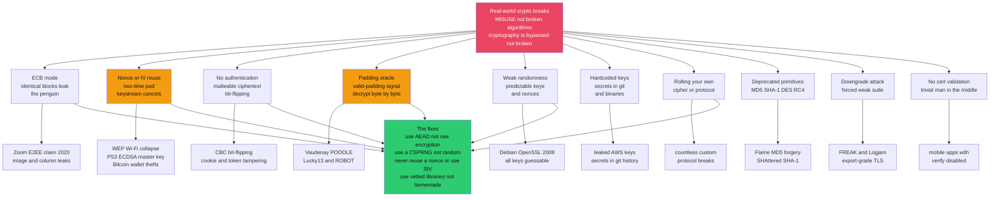

# 💥 Cryptographic Failures and Misuse

> [!abstract] TL;DR
> Almost no real-world system is broken because someone **factored a 2048-bit RSA modulus** or **found a distinguisher on AES**. Modern *algorithms* — **AES, SHA-2, RSA-OAEP, Ed25519, ChaCha20-Poly1305** — are, for practical purposes, **unbreakable**. Real breaches come almost entirely from **MISUSE and IMPLEMENTATION**: a reused **nonce**, **ECB** mode, a **missing MAC**, a **padding oracle**, a **hardcoded key**, a **weak RNG**, a **deprecated primitive**, or an engineer who **rolled their own** cipher. The slogan is *"cryptography is bypassed, not broken"* — attackers don't attack the math, they attack **how the math is used**. This note is the **misuse catalog**: ten recurring failure classes, each mapped to a famous disaster (**WEP, PS3, Heartbleed, Debian OpenSSL, POODLE, Adobe**), and the small set of **safe-usage principles** — *use AEAD, use a CSPRNG, never reuse a nonce, don't roll your own, use vetted libraries* — that prevent the overwhelming majority of real breaks. OWASP ranks **"Cryptographic Failures"** among its **Top 10** web risks precisely because misuse, not cryptanalysis, is where systems die.

---

## Intuition

**Analogy.** Imagine a bank vault with a **flawless, un-pickable lock** — the best metallurgy on Earth, rated to resist a century of attack. Now watch how the vault *actually* gets robbed: someone **props the door open with a chair**, **tapes the key under the welcome mat**, **installs the same lock on a thousand branches so one key opens them all**, or **hires a locksmith's apprentice to build a cheaper copy of the lock** that turns out to have a keyhole you can reach through. The lock was never the problem. The **procedures around the lock** were.

That is exactly the state of applied cryptography. The primitives (the locks) are extraordinary; the failures live in **how they are deployed**. A developer XORs plaintext with a keystream and **reuses the same keystream twice** (two identical keys under the mat). Another encrypts but **forgets to authenticate**, so an attacker flips ciphertext bits and edits the plaintext without knowing the key. Another uses `random.random()` to make a "secret" token — a lock whose key is stamped with a **predictable serial number**. Another writes their own AES because it "looked simple," and leaks the key through a **timing side channel** they never imagined. Every one of these is a **usage** bug sitting on top of a mathematically perfect primitive. Understanding this catalog is, for most engineers, **more valuable than understanding the number theory** underneath.

---

## How It Works

### The central lesson: bypassed, not broken

Cryptographic *primitives* are validated by decades of public cryptanalysis. AES has resisted the world's best attacks since 2001; the best known attack shaves a few bits off a 128-bit key — irrelevant in practice. SHA-256, RSA-OAEP, and Ed25519 are in the same category. When you read about a "crypto break" in the news, it is **almost never** a break of the primitive. It is one of a **small, recurring set of misuse patterns**, because correct *usage* has far more moving parts than the primitive itself: mode selection, nonce/IV discipline, authentication, key management, randomness, protocol negotiation, constant-time coding, and certificate validation. Each is a place to go wrong, and attackers systematically hunt those places. This is why [[Cryptography_Overview]] insists that **"encryption without a threat model is theater"** and why OWASP renamed its old "Sensitive Data Exposure" category to **"Cryptographic Failures"** (A02:2021) — the failure is in the *cryptographic engineering*, not the cipher.

### The misuse catalog — ten recurring failure classes

1. **ECB mode.** Encrypting each block independently (`C_i = E_k(P_i)`) is deterministic: identical plaintext blocks become identical ciphertext blocks. Structure **survives encryption** — the infamous **ECB penguin**. Real cases: Zoom's early "E2EE" used AES-ECB (2020), and image/database-column encryption routinely leaks with ECB. See [[Modes_of_Operation]].
2. **Nonce / IV reuse.** In any stream/CTR/GCM construction, the keystream is a function of `(key, nonce)`. Reuse the nonce and you get a **two-time pad**: `C1 XOR C2 = P1 XOR P2`, leaking the XOR of plaintexts. In **GCM** it is *worse* — it also exposes the authentication subkey and enables **forgery**. Real cases: **WEP** (RC4 IV reuse broke Wi-Fi), MS-PPTP. See [[Stream_Ciphers_and_PRGs]].
3. **Missing authentication.** Confidentiality without integrity yields **malleable** ciphertext. An attacker **flips bits** in CBC/CTR ciphertext to flip corresponding plaintext bits (change `amount=0010` to `amount=9910`) without ever decrypting. The fix is **AEAD** or **Encrypt-then-MAC**. See [[Message_Authentication_Codes]].
4. **Padding oracles.** CBC decryption plus *any* signal of whether padding is valid lets an attacker **decrypt ciphertext byte-by-byte without the key** — Vaudenay's attack, and its TLS incarnations **POODLE** (SSLv3) and **Lucky13** (a *timing* oracle). The RSA analogue is **Bleichenbacher's PKCS#1 oracle** (and its 2017 revival **ROBOT**). Detailed below.
5. **Weak randomness.** Predictable keys, nonces, or seeds silently destroy everything. Real cases: the **Debian OpenSSL** bug (2006–2008) made all generated keys guessable; the **PS3** and multiple **Bitcoin** thefts came from predictable/reused signature nonces. See [[Random_Number_Generation]].
6. **Hardcoded / committed keys.** Secrets baked into source, binaries, or git history. GitHub secret-scanning finds **millions** of leaked keys per year; a single committed AWS key has bankrupted startups overnight. Keys belong in a **KMS**, never in code. See [[Key_Management_and_Distribution]].
7. **Rolling your own.** Custom ciphers and protocols almost always harbor subtle flaws — bad S-boxes, missing authentication, timing leaks, replay windows — that public primitives spent decades eliminating.
8. **Weak / deprecated primitives.** **MD5** and **SHA-1** are collision-broken (Flame malware forged a Microsoft cert via MD5; **SHAttered** produced two colliding PDFs). **DES** (56-bit) and **RC4** (biased keystream) are dead. Using them is a self-inflicted wound.
9. **Downgrade attacks.** An active attacker forces the weakest mutually-supported option. **FREAK** and **Logjam** (2015) forced TLS down to 1990s **export-grade** 512-bit crypto that could then be broken.
10. **Improper certificate validation.** Skipping hostname/chain checks (or `verify=False`) turns TLS into unauthenticated encryption — trivially **man-in-the-middled**.

### Padding oracles in depth

A **padding oracle** is the purest illustration of "the primitive is fine, the *usage* leaks." CBC requires plaintext to be a whole number of blocks, so short messages are **PKCS#7-padded**: `n` bytes each equal to `n`. On decrypt, the receiver strips the padding and — critically — may **behave differently** when padding is malformed (an error message, a different response time, a connection reset). That single **valid/invalid bit** is a decryption oracle.

Because CBC decryption is `P_i = D_k(C_i) XOR C_{i-1}`, an attacker who controls the *previous* block `C_{i-1}` controls the plaintext byte-for-byte *after* the fixed, unknown intermediate value `I_i = D_k(C_i)`. By tampering with `C_{i-1}` and watching the oracle, the attacker forces the decrypted last byte to `0x01` (valid 1-byte padding), which reveals one byte of `I_i`; then forces `0x02 0x02`, revealing the next; and so on — **recovering the whole block using ~256 queries per byte, no key required**. **Lucky13** showed the "oracle" can be a **timing** difference of microseconds, and **POODLE** exploited SSLv3's under-specified CBC padding. The fixes are structural: **AEAD** (authenticate first, so tampered ciphertext is rejected *before* decryption reveals anything), **Encrypt-then-MAC**, and **constant-time** padding checks. The Python demo below implements a working padding oracle and recovers plaintext from it.

### The nonce-reuse class across primitives

"Nonce" literally means **number used once**. The failure recurs at every layer:

- **Stream / CTR keystream reuse** → two-time pad (WEP, MS-PPTP).
- **GCM nonce reuse** → two-time pad **plus** recovery of the GHASH subkey → **universal forgery** (the "forbidden attack").
- **(EC)DSA signature nonce reuse** → **full private-key recovery** from two signatures. Two signatures with the same `k` give two linear equations in `(k, privkey)` — solve for both. This is exactly how the **PS3 master signing key** leaked (Sony fixed `k` to a constant) and how **Bitcoin** wallets with buggy RNGs were drained. See [[Digital_Signatures]].

The engineering answer is **misuse-resistant** design: **AES-GCM-SIV** (RFC 8452) derives a synthetic IV from the message, so a repeated nonce only leaks *equality*; **deterministic ECDSA/EdDSA** (RFC 6979, Ed25519) derives `k` deterministically from the key and message, making nonce reuse **impossible by construction**.



---

## Key Concepts

### Secondary (intuitive)
- The **lock is perfect; the procedures leak.** Real breaks are propped-open doors and keys under the mat, not picked locks.
- **ECB** stamps identical data identically — the picture survives encryption (the **penguin**). Never use it for real data.
- A **nonce** is a **number used once**. Reuse it and two secret messages XOR together and cancel — you can read both.
- **Encrypt but don't authenticate** and an attacker can **edit** your ciphertext without knowing the key.
- Use **`secrets`, never `random`**, for anything secret. `random` is predictable.
- **Don't roll your own crypto** — use a vetted library that makes the safe choice the default.

### Undergraduate (formal)
- **IND-CPA vs INT-CTXT.** ECB fails **IND-CPA** (deterministic → equal blocks leak). Unauthenticated CBC/CTR provides confidentiality but **not integrity** (INT-CTXT); malleability enables bit-flipping. **AEAD** delivers both.
- **Two-time pad.** For any keystream cipher, `C1 = P1 XOR KS`, `C2 = P2 XOR KS` with the same `KS` gives `C1 XOR C2 = P1 XOR P2`. Known-plaintext or language statistics then peel both apart.
- **Padding oracle.** CBC gives `P_i = D_k(C_i) XOR C_{i-1}`; controlling `C_{i-1}` plus a valid-padding oracle recovers `D_k(C_i)` byte-by-byte in ~`256 * blocklen` queries, no key.
- **Signature nonce reuse.** ECDSA with reused `k`: `s1 = k^{-1}(h1 + r*d)`, `s2 = k^{-1}(h2 + r*d)` → `k = (h1 - h2)/(s1 - s2)`, then `d = (s1*k - h1)/r`. Full key recovery.
- **CSPRNG requirement.** Keys/nonces/IVs/salts/tokens must come from a source with **next-bit unpredictability** and **backtracking resistance** — `os.urandom`, `secrets`, `getrandom` — never a statistical PRNG (Mersenne Twister).

### Graduate (advanced)
- **Misuse-resistant AE (MRAE).** **AES-GCM-SIV** derives a synthetic IV `= MAC(nonce, AAD, plaintext)`, degrading nonce reuse to leaking only message *equality*; **key-commitment** AEAD additionally prevents a ciphertext from decrypting under two different keys (relevant to multi-recipient and partitioning attacks).
- **Timing oracles are real oracles.** **Lucky13** exploited the few-microsecond MAC-timing difference in TLS CBC; **Bleichenbacher/ROBOT** exploited PKCS#1 v1.5 RSA decryption error distinctions. Countermeasures require **constant-time** decoding and **uniform error handling**, not just "hide the error string."
- **The composition order matters.** MAC-then-Encrypt and Encrypt-and-MAC process attacker-chosen ciphertext *before* authentication, enabling padding oracles; **Encrypt-then-MAC** (verify tag first) is the only sound generic order. AEAD removes the choice.
- **Deterministic signatures.** RFC 6979 and Ed25519 make `k = H(privkey, msg)`, eliminating the RNG from signing entirely — a whole failure class engineered away.
- **Provable security is a contract, not a guarantee.** A scheme "proven IND-CPA" is secure *only if* its assumptions hold: unique nonces, unpredictable IVs, constant-time execution, honest randomness. Misuse **violates the theorem's hypotheses**, which is why proofs don't stop real breaks — the code broke the contract.

---

## Python Demo

```python
# ============================================================================
#  CRYPTO MISUSE "HALL OF SHAME": each bug BROKEN then FIXED. Pure stdlib +
#  matplotlib (numpy optional -- not used). We build a real invertible toy
#  block cipher (a SHA-256 Feistel network = a genuine keyed PRP) so nothing
#  depends on external crypto libraries.
#
#    (a) NONCE REUSE  -> two-time pad: C1 XOR C2 == P1 XOR P2 (keystream cancels)
#    (b) ECB          -> identical plaintext blocks leak (the penguin)
#    (c) PADDING ORACLE -> decrypt CBC ciphertext BYTE BY BYTE, no key, using
#                          only a valid/invalid-padding signal (Vaudenay class)
#    (d) WEAK RANDOMNESS + NON-CONSTANT-TIME COMPARE for a token, and the fix
#
#  We VISUALIZE the nonce-reuse leak and the padding-oracle byte-recovery.
# ============================================================================
import os, struct, hashlib, secrets, hmac, random
import matplotlib.pyplot as plt

BLOCK, HALF, ROUNDS = 16, 8, 6

def _xor(a, b):                      # XOR two equal-length byte strings
    return bytes(x ^ y for x, y in zip(a, b))

def _F(half, key, rnd):              # Feistel round function: a PRF from SHA-256
    return hashlib.sha256(key + bytes([rnd]) + half).digest()[:HALF]

def block_encrypt(block, key):       # deterministic 16-byte -> 16-byte PRP
    L, R = block[:HALF], block[HALF:]
    for rnd in range(ROUNDS):
        L, R = R, _xor(L, _F(R, key, rnd))
    return L + R

def block_decrypt(block, key):
    L, R = block[:HALF], block[HALF:]
    for rnd in reversed(range(ROUNDS)):
        L, R = _xor(R, _F(L, key, rnd)), L
    return L + R

# --- CTR mode (a stream cipher; its own inverse) ----------------------------
def ctr_crypt(data, key, nonce):
    out = bytearray()
    for idx, i in enumerate(range(0, len(data), BLOCK)):
        ks = block_encrypt(nonce + struct.pack(">Q", idx), key)
        chunk = data[i:i + BLOCK]
        out += _xor(chunk, ks[:len(chunk)])
    return bytes(out)

# --- PKCS#7 padding + CBC ----------------------------------------------------
def pkcs7_pad(data):
    n = BLOCK - (len(data) % BLOCK)
    return data + bytes([n]) * n

def pkcs7_unpad(data):
    if not data or len(data) % BLOCK != 0:
        raise ValueError("bad length")
    n = data[-1]
    if n < 1 or n > BLOCK or data[-n:] != bytes([n]) * n:
        raise ValueError("bad padding")     # <-- the fatal leak: distinguishable
    return data[:-n]

def cbc_encrypt(pt, key, iv):
    data, out, prev = pkcs7_pad(pt), bytearray(), iv
    for i in range(0, len(data), BLOCK):
        prev = block_encrypt(_xor(data[i:i + BLOCK], prev), key)
        out += prev
    return bytes(out)

def cbc_decrypt_raw(ct, key, iv):
    out, prev = bytearray(), iv
    for i in range(0, len(ct), BLOCK):
        c = ct[i:i + BLOCK]
        out += _xor(block_decrypt(c, key), prev)
        prev = c
    return bytes(out)

# ============================================================================
#  (a) NONCE REUSE = TWO-TIME PAD
# ============================================================================
key = os.urandom(16)
W = H = 96                                    # small patterned "images"
def band(v0, v1):                             # horizontal-stripe pattern
    return bytes((v0 if (i // W) % 12 < 6 else v1) for i in range(W * H))
def box(v0, v1):                              # centered-square pattern
    out = bytearray(W * H)
    for i in range(W * H):
        x, y = i % W, i // W
        out[i] = v1 if (24 <= x < 72 and 24 <= y < 72) else v0
    return bytes(out)
p1, p2 = band(30, 210), box(40, 200)

nonce_bad = os.urandom(HALF)
c1 = ctr_crypt(p1, key, nonce_bad)
c2 = ctr_crypt(p2, key, nonce_bad)            # SAME nonce + key -> FORBIDDEN
leak = _xor(c1, c2)
print("(a) nonce reuse : C1 XOR C2 == P1 XOR P2 ?", leak == _xor(p1, p2),
      "-> keystream cancels, both secrets leak")
# FIX: a unique nonce per message makes C1 XOR C2 pure noise.
good = _xor(ctr_crypt(p1, key, os.urandom(HALF)), ctr_crypt(p2, key, os.urandom(HALF)))

# ============================================================================
#  (b) ECB reveals patterns (the penguin)
# ============================================================================
def ecb_encrypt(data, key):
    return b"".join(block_encrypt(data[i:i + BLOCK], key)
                    for i in range(0, len(data), BLOCK))
ecb = ecb_encrypt(box(40, 200), key)
n_blk = len(ecb) // BLOCK
distinct = len({ecb[i:i + BLOCK] for i in range(0, len(ecb), BLOCK)})
print(f"(b) ECB         : {n_blk} cipher blocks but only {distinct} DISTINCT "
      "-> the shape survives (penguin). FIX: use CBC/CTR/GCM.")

# ============================================================================
#  (c) PADDING ORACLE: decrypt ciphertext byte-by-byte with NO KEY
# ============================================================================
class PaddingOracle:
    """The victim: leaks ONE bit -- 'is the padding valid?' -- per query.
       That single bit is enough to decrypt everything."""
    def __init__(self, key): self.key, self.queries = key, 0
    def valid(self, iv, ct):
        self.queries += 1
        try:
            pkcs7_unpad(cbc_decrypt_raw(ct, self.key, iv)); return True
        except ValueError:
            return False

def recover_block(oracle, target, prev, progress):
    """Vaudenay: recover I = D_k(target) using only oracle.valid(), then
       plaintext = I XOR prev. Returns the recovered plaintext block."""
    inter = bytearray(BLOCK)
    base = bytearray(os.urandom(BLOCK))       # bytes we aren't attacking (any value)
    for pos in range(BLOCK - 1, -1, -1):
        pad = BLOCK - pos                     # target padding value for this step
        forged = bytearray(base)
        for k in range(pos + 1, BLOCK):       # force known tail bytes to `pad`
            forged[k] = inter[k] ^ pad
        for guess in range(256):
            forged[pos] = guess
            if oracle.valid(bytes(forged), target):
                if pos == BLOCK - 1:          # disambiguate a false 0x02 0x02 ...
                    probe = bytearray(forged); probe[pos - 1] ^= 0xFF
                    if not oracle.valid(bytes(probe), target):
                        continue
                inter[pos] = guess ^ pad
                progress.append((oracle.queries, BLOCK - pos))
                break
        else:
            raise RuntimeError(f"oracle stuck at byte {pos}")
    return _xor(bytes(inter), prev)

secret = b"user=admin; role=root; flag=CRYPTO_MISUSE_IS_THE_REAL_ENEMY!!"
iv = os.urandom(BLOCK)
ct = cbc_encrypt(secret, key, iv)
oracle = PaddingOracle(key)
blocks = [iv] + [ct[i:i + BLOCK] for i in range(0, len(ct), BLOCK)]
progress, recovered = [], b""
for j in range(1, len(blocks)):
    recovered += recover_block(oracle, blocks[j], blocks[j - 1], progress)
recovered = pkcs7_unpad(recovered)
print(f"(c) padding oracle: recovered plaintext without the key? "
      f"{recovered == secret}  in {oracle.queries} oracle queries")
print("    -> \"" + recovered.decode() + "\"")
# FIX: AEAD / Encrypt-then-MAC verifies a tag BEFORE decrypting, so tampered
#      ciphertext is rejected and the oracle never runs. Plus constant-time checks.

# ============================================================================
#  (d) WEAK RANDOMNESS + NON-CONSTANT-TIME COMPARE for a token
# ============================================================================
random.seed(1337)                             # attacker-guessable seed
broken = "".join(random.choice("0123456789abcdef") for _ in range(32))
random.seed(1337)                             # attacker replays the seed
forged = "".join(random.choice("0123456789abcdef") for _ in range(32))
print("(d) weak RNG    : `random` token reproduced by attacker who knows seed?",
      broken == forged, "-> predictable. FIX: secrets.token_hex ->", secrets.token_hex(8), "...")

def insecure_eq(a, b):                        # leaks timing: returns on 1st mismatch
    if len(a) != len(b): return False
    for x, y in zip(a, b):
        if x != y: return False
    return True
def secure_eq(a, b):                          # constant-time
    return hmac.compare_digest(a, b)
tok = secrets.token_bytes(16)
print("    non-constant-time compare correct?", insecure_eq(tok, tok),
      "| constant-time (hmac.compare_digest) correct?", secure_eq(tok, tok))

# ============================================================================
#  VISUALIZE: nonce-reuse leak  +  padding-oracle byte-recovery progress
# ============================================================================
def grid(b): return [[b[y * W + x] for x in range(W)] for y in range(H)]
fig, ax = plt.subplots(2, 2, figsize=(12, 10))
show = dict(cmap="gray", vmin=0, vmax=255)

ax[0, 0].imshow(grid(leak), **show)
ax[0, 0].set_title("(a) NONCE REUSE: C1 XOR C2 = P1 XOR P2\nboth secret shapes leak")
ax[0, 0].axis("off")

ax[0, 1].imshow(grid(good), **show)
ax[0, 1].set_title("(a-fix) UNIQUE nonces: C1 XOR C2 = noise\nno leak")
ax[0, 1].axis("off")

qx = [q for q, _ in progress]; by = [b for _, b in progress]
ax[1, 0].step(qx, by, where="post", color="#e94560")
ax[1, 0].set_title("(c) PADDING ORACLE byte recovery\ndecrypting with NO key, only a valid/invalid bit")
ax[1, 0].set_xlabel("oracle queries (valid/invalid signals)")
ax[1, 0].set_ylabel("plaintext bytes recovered")
ax[1, 0].grid(alpha=0.3)

ecb_img = grid(ecb[:W * H])
ax[1, 1].imshow(ecb_img, **show)
ax[1, 1].set_title(f"(b) ECB: {distinct} distinct blocks of {n_blk}\nthe shape survives (penguin)")
ax[1, 1].axis("off")

plt.tight_layout(); plt.show()

# Takeaways:
#  * (a) reuse a nonce and two ciphertexts XOR to reveal P1 XOR P2 -> both leak.
#  * (b) ECB collapses identical blocks -> structure survives encryption.
#  * (c) a single "padding valid?" bit decrypts the whole message with NO key.
#  * (d) `random` is predictable and `==` leaks timing; use `secrets` + compare_digest.
#  Every bug lives in USAGE. The primitive was never touched.
```

Running it prints that nonce reuse satisfies `C1 XOR C2 == P1 XOR P2`, that the ECB ciphertext of a patterned image has thousands of blocks but only a handful of *distinct* values, that the **padding oracle recovers the full secret plaintext without the key** in a few thousand valid/invalid queries, and that the `random`-seeded token is trivially reproduced while `secrets` is not. The figure shows the nonce-reuse leak (both hidden shapes visible in `C1 XOR C2`), the same XOR turning to noise with unique nonces, the step-plot of bytes recovered climbing as the oracle is queried, and the ECB "penguin."

---

## Real-World Applications

> **Example — the Hall of Shame.** Each of these is a *usage* failure sitting on a sound primitive, and each is a canonical teaching case.

- **WEP (Wi-Fi, 1999–2004).** RC4 with a **24-bit IV** that repeats within hours on a busy network → **keystream reuse** plus a related-key weakness. The cipher (RC4) was merely weak; the **IV discipline** made Wi-Fi trivially decryptable, forcing WPA2/AES-CCMP.
- **Sony PlayStation 3 (2010).** ECDSA signatures with a **hardcoded constant nonce** `k`. Two signatures were enough to solve for the **master private signing key**, letting anyone sign homebrew/pirated firmware. A textbook [[Digital_Signatures]] nonce-reuse catastrophe.
- **Debian OpenSSL (2006–2008).** A well-meaning patch removed the entropy source from the RNG, so keys were drawn from only **~32,768 possibilities**. Every SSH/TLS/OpenVPN key generated for two years was **brute-forceable**. See [[Random_Number_Generation]].
- **Heartbleed (2014).** Not a crypto-algorithm bug at all — a **buffer over-read** in OpenSSL's TLS heartbeat leaked 64 KB of server memory per request, including **private keys**. A reminder that implementation memory-safety *is* cryptographic security.
- **POODLE / Lucky13 / ROBOT (2014–2017).** **Padding-oracle** attacks against CBC in SSLv3/TLS and PKCS#1 v1.5 in RSA. They drove TLS 1.3 to **AEAD-only** and killed RSA key-exchange. See [[Modes_of_Operation]] and [[TLS_and_Secure_Channels]].
- **Adobe (2013) / LinkedIn (2012).** Password disasters: Adobe **encrypted** (reversible, ECB, no salt) rather than **hashed** passwords, and reused hints; LinkedIn used **unsalted SHA-1**. Both let attackers recover millions of passwords. The fix is **salted, slow** hashing — see [[Password_Hashing_and_KDFs]].
- **Zoom (2020).** Marketed "end-to-end encryption" while using **AES-128-ECB** and holding keys server-side — both a mode-misuse and a threat-model misrepresentation.

**Where the discipline lives.** This is the daily reality of security *engineering*: **OWASP A02 Cryptographic Failures** ([[OWASP_Top_10]]) drives crypto code review; static analysis and **secret-scanning** hunt hardcoded keys; teams choose **libsodium/Tink/age** over homemade AES; and reviewers check for AEAD usage, CSPRNG sourcing, and nonce management. For most engineers, mastering this catalog matters far more than mastering the number theory.

---

## Common Pitfalls

- **Encrypting without authenticating.** The single most common bug. Unauthenticated CBC/CTR is malleable and padding-oracle-prone. **Always use AEAD** (AES-GCM, ChaCha20-Poly1305); if you truly cannot, use **Encrypt-then-MAC** and verify the tag *before* decrypting.
- **Reusing a nonce/IV.** Catastrophic in CTR/GCM (two-time pad, and GCM forgery) and in signatures (key recovery). Use a random 96-bit nonce, a strictly increasing counter you never reset, or a **misuse-resistant** mode (AES-GCM-SIV, deterministic ECDSA/Ed25519).
- **Using `random` for anything secret.** The Mersenne Twister is predictable from ~624 outputs and reproducible from its seed. Use `secrets` / `os.urandom` for keys, tokens, nonces, salts, and password-reset codes.
- **Non-constant-time comparison.** Comparing MACs/tokens with `==` leaks timing that enables byte-by-byte forgery. Use `hmac.compare_digest`.
- **ECB for structured data.** Only ever safe for a single random block (key wrapping). Anything with repetition leaks.
- **Distinguishable error/timing on decrypt.** *Any* observable difference between "bad padding" and "bad MAC" — a string, a status code, a few microseconds (Lucky13) — is an oracle. Handle all decryption failures **identically and in constant time**.
- **Hardcoded / committed secrets.** Keys in source, config, containers, or git history. Rotate anything that touched a repo; use a **KMS/secret manager**; enable secret-scanning.
- **Deprecated primitives.** MD5, SHA-1, DES/3DES, RC4, RSA PKCS#1 v1.5, and ECB are legacy landmines. Prefer SHA-2/3, AES-GCM, RSA-OAEP/PSS, Ed25519.
- **Rolling your own.** Custom crypto fails in ways that took the field decades to discover. Use vetted, high-level, **misuse-resistant** libraries.
- **Skipping certificate validation.** `verify=False` (or ignoring hostname/chain errors) silently reduces TLS to unauthenticated encryption. Never ship it.

---

## Related Concepts

- [[Cryptography_Overview]] — the vault entry point; frames threat models and IND-CPA, and why "encryption without a threat model is theater" (the root of misuse).
- [[Modes_of_Operation]] — ECB penguin, CBC padding oracles, CTR/GCM nonce discipline, and why TLS 1.3 went AEAD-only; the deepest source of misuse.
- [[Random_Number_Generation]] — CSPRNG vs statistical PRNG; the Debian/PS3/Bitcoin failures behind the "weak randomness" class.
- [[Message_Authentication_Codes]] — MACs, HMAC, Encrypt-then-MAC, and constant-time comparison; the fix for the "missing authentication" and timing-oracle classes.
- [[Stream_Ciphers_and_PRGs]] — keystream reuse and the two-time pad that makes nonce reuse catastrophic in stream/CTR modes.
- [[Digital_Signatures]] — ECDSA/EdDSA nonce reuse → private-key recovery; deterministic signing (RFC 6979) as the misuse-resistant fix.
- [[Key_Management_and_Distribution]] — keeping keys out of code (KMS), rotation, and envelope encryption; the "hardcoded key" class.
- [[Password_Hashing_and_KDFs]] — salted, slow hashing; the correct answer to the Adobe/LinkedIn password disasters.
- [[Block_Ciphers_and_AES]] — the primitive that is *not* the problem; misuse lives in the mode around it.
- [[Hash_Functions]] — MD5/SHA-1 collision breaks behind the "deprecated primitives" class.
- [[RSA]] — Bleichenbacher/ROBOT PKCS#1 padding oracles and PKCS#1 v1.5 vs OAEP/PSS.
- [[Elliptic_Curve_Cryptography]] — where deterministic-nonce Ed25519 engineers the signature-nonce failure away.
- [[TLS_and_Secure_Channels]] — POODLE/Lucky13/FREAK/Logjam and the AEAD-only redesign that removed whole misuse classes.
- [[OWASP_Top_10]] — Cybersecurity vault: "A02 Cryptographic Failures," the practitioner's framing of this note.
- [[TLS_Protocol_Deep_Dive]] — Cybersecurity vault: the protocol-level view of the CBC/padding-oracle and downgrade attacks.

*Planned Cryptography-vault siblings referenced above in prose — `Side_Channel_Attacks` (timing/Lucky13, power/cache leaks), `Cryptanalysis_Fundamentals` (why the algorithms hold), and `Applied_Cryptography_Engineering` (libsodium/Tink/age, misuse-resistant APIs, the safe-usage checklist) — will be linked once those notes exist.*

---

## Review Questions

1. **Conceptual (Secondary/Undergraduate).** Explain the slogan *"cryptography is bypassed, not broken."* Give three distinct misuse patterns from the catalog and, for each, name the sound primitive it sits on top of and the real breach it caused. Why is knowing this catalog often more useful to a working engineer than knowing the underlying number theory?
2. **Scenario (Undergraduate/Graduate).** You inherit a service that encrypts session cookies with **AES-CBC** and returns a distinct "invalid padding" error on malformed input. An attacker reports they can read arbitrary users' cookies without the key. Explain *precisely* what they are exploiting, why controlling the previous ciphertext block plus a one-bit padding signal suffices to recover plaintext byte-by-byte, and give **two structurally different fixes** (not just "hide the error message").
3. **Trade-off (Graduate).** Compare the failure modes of a **repeated nonce** in (i) raw CTR, (ii) AES-GCM, and (iii) ECDSA signing. What exactly leaks in each case, why is GCM's failure *worse* than CTR's, and how do **AES-GCM-SIV** and **deterministic ECDSA (RFC 6979)** change the picture — including what residual leakage remains under SIV?

---

## Sources

- [OWASP Top 10 — A02:2021 Cryptographic Failures](https://owasp.org/Top10/A02_2021-Cryptographic_Failures/)
- [Serge Vaudenay, "Security Flaws Induced by CBC Padding" (EUROCRYPT 2002)](https://www.iacr.org/archive/eurocrypt2002/23320530/cbc02_e02d.pdf)
- [AlFardan & Paterson, "Lucky Thirteen: Breaking the TLS and DTLS Record Protocols" (2013)](http://www.isg.rhul.ac.uk/tls/Lucky13.html)
- [Böck et al., "Nonce-Disrespecting Adversaries: Practical Forgery Attacks on GCM in TLS" (2016)](https://eprint.iacr.org/2016/475.pdf)
- [Debian Security Advisory DSA-1571: OpenSSL predictable random number generator (2008)](https://www.debian.org/security/2008/dsa-1571)
- [RFC 8452 — AES-GCM-SIV: Nonce Misuse-Resistant Authenticated Encryption](https://www.rfc-editor.org/rfc/rfc8452)
- [RFC 6979 — Deterministic Usage of DSA and ECDSA](https://www.rfc-editor.org/rfc/rfc6979)

---

#cryptography #crypto-misuse #padding-oracle #nonce-reuse #dont-roll-your-own
