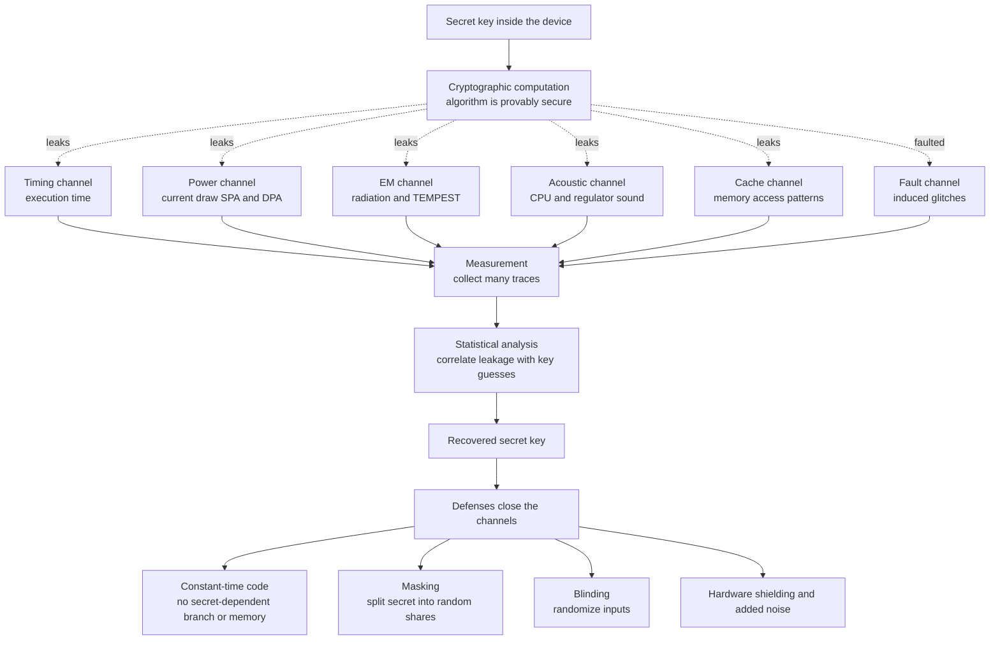

# 🕵️ Side-Channel Attacks

> [!abstract] TL;DR
> A **side-channel attack** breaks a cryptosystem without ever attacking its **math**. The algorithm can be **provably secure** on paper, yet the **implementation running on real hardware** leaks the secret key through **physical side effects** — how **long** the computation takes, how much **power** it draws, what **electromagnetic** waves or **sounds** it emits, which **cache** lines it touches, or how it **misbehaves when faulted**. The attacker measures those side effects, correlates them with guesses about the key, and reads the secret straight out of the leakage the proof never accounted for. This is the sharpest expression of a crucial gap: **"provably secure" is about the algorithm; the key lives in the implementation, and implementations leak.** The primary defenses are **constant-time code** (no secret-dependent timing, branches, or memory accesses), **masking** (split the secret into random shares), and **blinding** (randomize inputs so leakage no longer correlates with the key).

---

## Intuition

**Analogy — the safecracker who never touches the combination.** A great safecracker does not attack the *mathematics* of the lock — they do not try every one of the millions of possible combinations. Instead they rest their fingers on the dial and **listen to the clicks** and **feel the tiny vibrations** as the tumblers fall into place. The lock's design might be flawless, but the *physical act of opening it* leaks information about the correct number, one wheel at a time. The safecracker reads the secret out of the **side effects** of the mechanism, not the mechanism's specification.

Side-channel attacks do exactly this to cryptography. The cipher may be **AES** or **RSA** with a mathematically unbreakable key, but the *machine computing it* is a physical object: it consumes current, warms up, radiates radio waves, takes measurable time, and shuffles bytes through a cache. Every one of those is a "click" that depends, however slightly, on the secret bits being processed. The attacker never breaks the math — they **observe how the computation manifests in the real world** and reconstruct the key from the manifestation. Perfect math, leaky hardware.

---

## How It Works

### The key insight: secure algorithm, leaky implementation

A [[Provable_Security_and_Reductions|security proof]] establishes something about an **abstract algorithm**: *if* factoring is hard, *then* no efficient adversary who sees only the ciphertext can recover the plaintext. That model assumes the adversary observes **inputs and outputs and nothing else**. Real hardware violates the assumption. The moment a secret-dependent value flows through a physical processor, the processor emits *extra* observable quantities the model never included — a **side channel**. As the sibling note *Provable_Security_and_Reductions* stresses, **a proof of the algorithm says nothing about a leaky implementation**. Side channels are the canonical demonstration: the theorem stays true, and the key still walks out the door.

Two broad families exist:

- **Passive** side channels — the attacker only **observes** leakage while the device runs normally: timing, power, electromagnetic (EM), acoustic, cache.
- **Active** side channels — the attacker **perturbs** the device to force revealing behavior: fault injection via voltage or clock glitching, lasers, or Rowhammer.

### Timing attacks

The **execution time** of a computation often depends on the **secret**. Classic sources:

1. **Early-exit comparison.** A naive byte-by-byte comparison of a MAC tag, password, or token **returns as soon as it finds a mismatch**. The response time therefore encodes **how many leading bytes were correct** — letting an attacker recover the secret **one byte at a time** by finding the guess that runs longest (the [[Message_Authentication_Codes|MAC]]/tag comparison demo below).
2. **Secret-dependent branches.** An `if secret_bit then A else B` where `A` and `B` take different times leaks the bit.
3. **Variable-time modular exponentiation.** Textbook square-and-multiply in [[RSA]] performs a **multiply only when the exponent bit is 1**; timing the operation leaks the private-key bits. **Kocher's 1996 paper** first showed timing attacks recovering RSA, Diffie-Hellman, and DSS keys.
4. **Remote timing is practical.** **Brumley-Boneh (2003)** extracted an RSA private key from an OpenSSL server **over a network**, defeating the folklore that network jitter hides timing signals — averaging many samples beats the noise.

The fix is **constant-time code**: the running time must be a function of the **input sizes only**, never of the secret values — no secret-dependent branches, no secret-dependent memory addresses, no early exits.

### Power analysis: SPA and DPA

The **instantaneous power** a chip draws depends on the data it processes, because CMOS gates burn energy mainly when bits **flip**. Measuring the current on a smart card or embedded device (see the sibling *Cryptanalysis_Fundamentals* for the analytic mindset) yields a **power trace**.

- **Simple Power Analysis (SPA)** reads operations **directly** off a single (or few) trace. In square-and-multiply RSA, a **square** and a **multiply** produce visibly different power shapes, so the trace literally *spells out* the key bits.
- **Differential / Correlation Power Analysis (DPA / CPA)** is far more powerful and needs no visible features. The attacker collects **thousands of traces** with known inputs, hypothesizes a **key byte**, predicts an **intermediate value** (e.g. an AES S-box output), models its **power as a function of Hamming weight**, and **statistically correlates** the model against the measured traces. The correct key guess produces a **correlation spike** that rises out of the noise; wrong guesses stay flat. DPA is **devastating against smart cards and hardware wallets** and, like timing attacks, traces back to **Kocher, Jaffe, and Jun (1999)**.

### Electromagnetic, acoustic, and other exotic channels

- **EM emanations** are power analysis **without a wire** — a nearby antenna picks up the radiation, enabling **contactless** and even **remote** key extraction. Military shielding standards against this are known as **TEMPEST**.
- **Acoustic cryptanalysis** — **Genkin, Shamir, and Tromer (2014)** extracted a full **4096-bit RSA key from the high-pitched sound a laptop's voltage regulators make** while decrypting, captured with an ordinary microphone.
- **Photonic, thermal, and power-line** channels round out a surprisingly broad leakage surface: almost any measurable physical quantity that depends on the data is a potential channel.

### Cache and microarchitectural attacks

Modern CPUs share a [[Cache_Hierarchy|cache]] across processes and virtual machines, and **cache-hit vs cache-miss timing** leaks **which memory addresses** the victim touched. Since crypto code indexes tables (AES S-boxes) or key-dependent branches, access patterns leak the key:

- **FLUSH+RELOAD** and **PRIME+PROBE** recover **AES and RSA keys across process and VM boundaries** on shared hardware — a first-class threat in **multi-tenant cloud**.
- The **Spectre / Meltdown** family (2018) weaponizes [[Superscalar_and_Out_of_Order_Execution|speculative and out-of-order execution]]: the CPU speculatively executes instructions past a security check, and although the results are architecturally discarded, they leave **microarchitectural footprints in the cache** that a timing side channel reads back — leaking data **across [[OS_Security_and_Isolation|isolation]] boundaries** (kernel, other processes, other tenants).

### Fault attacks (active)

Instead of observing, the attacker **induces errors** — glitching the voltage or clock, firing a laser at the die, or hammering DRAM rows (Rowhammer) — to make the crypto **misbehave in a revealing way**:

- **RSA-CRT fault attack (Bellcore).** RSA signing optimized with the Chinese Remainder Theorem can be broken by a **single fault**: one faulty signature `s'` and one correct one (or the public data) lets the attacker compute `gcd of s' minus s and n`, which **factors the modulus `n`** outright.
- **Differential Fault Analysis (DFA)** on AES recovers the key from a handful of correct/faulty ciphertext pairs.
- Countermeasures: **verify the computation** before releasing output, **redundant computation**, and sensors that detect glitching.

### Leakage channels, analysis, and defenses



---

## Key Concepts

**Secondary (intuition level).**
- A cipher can be **unbreakable in theory** yet **leak the key** because the **machine running it** gives off clues: time, power, sound, heat, radio waves.
- The attacker does not break the code; they **watch how the computer behaves** and work out the secret.
- The main fix is to make the computation **behave identically no matter what the secret is** — same time, same operations.

**Undergraduate (CS background).**
- **Timing attack:** execution time depends on secret data; an **early-exit comparison** leaks how many bytes matched; **square-and-multiply** leaks exponent bits.
- **SPA vs DPA:** SPA reads operations off one trace; **DPA/CPA** uses statistics over many traces to pull the key out of noise via a **Hamming-weight leakage model**.
- **Constant-time comparison:** compare **all** bytes and accumulate differences with OR/XOR so the running time never depends on where the first mismatch is.
- **Cache attacks:** shared caches make **memory access patterns** observable through hit/miss timing (FLUSH+RELOAD, PRIME+PROBE).

**Graduate (system-level thinking).**
- **Leakage models:** Hamming-weight and Hamming-distance models underpin DPA/CPA; **template attacks** and **deep-learning SCA** profile a device to extract keys from *single* traces.
- **Provable countermeasures:** **masking** realizes the leakage as a **secret-sharing / MPC problem** — a `d`-th order masking scheme is secure against an adversary observing `d` intermediate values; order must exceed the probing power, at quadratic cost.
- **Blinding:** RSA/ECC randomize the base or exponent (`m times r^e`, scalar/point blinding) so timing and power **decorrelate** from the key; the **Montgomery ladder** gives a branch-free, uniform-operation scalar multiplication for [[Elliptic_Curve_Cryptography|ECC]].
- **Microarchitectural leakage** (Spectre/Meltdown, MDS, port contention) shows that **the ISA abstraction is not a security boundary** — the *implementation* of the processor itself is the side channel.

---

## Python Demo

Pure standard library plus **matplotlib** (numpy optional). Three parts:
1. **Timing attack** on a **naive early-exit tag comparison**, recovering a secret token **one byte at a time**.
2. **Constant-time comparison** that leaks nothing (flat signal).
3. A **CPA / DPA sketch**: the **Hamming weight** of an AES S-box output correlates with simulated power, so the correct key byte spikes.

```python
"""
Side-channel demo: timing attack vs constant-time defense, plus a CPA/DPA sketch.
Pure stdlib + matplotlib. Run:  python side_channel_demo.py
"""
import os
import random
import statistics
import matplotlib.pyplot as plt

random.seed(1337)

# --- Simulated leakage model -------------------------------------------------
# Real timing is noisy; we model it faithfully: time is proportional to the
# number of bytes actually compared, PLUS large Gaussian measurement noise.
# The whole point of the attack is that AVERAGING many trials beats the noise.
PER_BYTE_COST = 100.0     # simulated cost of comparing one byte
NOISE_SD      = 350.0     # per-measurement noise DWARFS a single byte of signal
TRIALS        = 1500      # measurements averaged per guess to recover the signal

SECRET = os.urandom(8)    # the secret token / MAC tag the attacker wants


def insecure_compare_time(secret: bytes, guess: bytes) -> float:
    """NAIVE comparison: returns early on the first mismatched byte.
    We return a simulated time = (bytes examined) * cost + noise."""
    examined = 0
    for a, b in zip(secret, guess):
        examined += 1
        if a != b:
            break                      # <-- the leak: early exit
    return examined * PER_BYTE_COST + random.gauss(0.0, NOISE_SD)


def constant_time_compare_time(secret: bytes, guess: bytes) -> float:
    """CONSTANT-TIME comparison: ALWAYS scans every byte, OR-ing differences.
    Running time is independent of where (or whether) bytes match."""
    diff = 0
    for a, b in zip(secret, guess):
        diff |= a ^ b                  # no branch, no early exit
    _ = diff                           # result unused here; timing is the point
    return len(secret) * PER_BYTE_COST + random.gauss(0.0, NOISE_SD)


def avg_time(timer, secret, guess, trials=TRIALS) -> float:
    return statistics.fmean(timer(secret, guess) for _ in range(trials))


def recover_token(timer) -> bytes:
    """Byte-by-byte timing attack: for each position, the candidate whose
    average time is LARGEST is the correct byte (it lets the loop advance
    one more step). Only the insecure timer leaks enough to succeed."""
    recovered = bytearray()
    for pos in range(len(SECRET)):
        best_val, best_time = 0, -1.0
        for cand in range(256):
            guess = bytes(recovered) + bytes([cand]) + b"\x00" * (len(SECRET) - pos - 1)
            t = avg_time(timer, SECRET, guess)
            if t > best_time:
                best_time, best_val = t, cand
        recovered.append(best_val)
    return bytes(recovered)


# --- Part A/B: run the attack against both comparators ------------------------
leaky = recover_token(insecure_compare_time)
safe  = recover_token(constant_time_compare_time)
print("secret token        :", SECRET.hex())
print("recovered (insecure):", leaky.hex(), "->", "SUCCESS" if leaky == SECRET else "partial")
print("recovered (constant):", safe.hex(),  "->", "FAILED (as intended)" if safe != SECRET else "leaked!")

# --- Visualize the timing signal for ONE byte position ------------------------
# We already know the correct prefix; probe all 256 candidates for byte 0.
prefix = b""            # attacking the first secret byte
insec_sig = [avg_time(insecure_compare_time, SECRET, bytes([c]) + b"\x00" * 7) for c in range(256)]
const_sig = [avg_time(constant_time_compare_time, SECRET, bytes([c]) + b"\x00" * 7) for c in range(256)]
correct_byte = SECRET[0]

# --- Part C: CPA / DPA sketch -------------------------------------------------
# AES S-box: power leakage of the first-round output SBOX[plaintext ^ key]
# is modeled by its Hamming weight. Correlate HW model vs simulated power;
# the correct key byte gives the highest correlation.
AES_SBOX = bytes.fromhex(
    "637c777bf26b6fc53001672bfed7ab76ca82c97dfa5947f0add4a2af9ca472c0"
    "b7fd9326363ff7cc34a5e5f171d8311504c723c31896059a071280e2eb27b275"
    "09832c1a1b6e5aa0523bd6b329e32f8453d100ed20fcb15b6acbbe394a4c58cf"
    "d0efaafb434d338545f9027f503c9fa851a3408f929d38f5bcb6da2110fff3d2"
    "cd0c13ec5f974417c4a77e3d645d197360814fdc222a908846eeb814de5e0bdb"
    "e0323a0a4906245cc2d3ac629195e479e7c8376d8dd54ea96c56f4ea657aae08"
    "ba78252e1ca6b4c6e8dd741f4bbd8b8a703eb5664803f60e613557b986c11d9e"
    "e1f8981169d98e949b1e87e9ce5528df8ca1890dbfe6426841992d0fb054bb16"
)
HW = [bin(b).count("1") for b in range(256)]        # popcount lookup

def pearson(xs, ys):
    mx, my = statistics.fmean(xs), statistics.fmean(ys)
    num = sum((x - mx) * (y - my) for x, y in zip(xs, ys))
    den = (sum((x - mx) ** 2 for x in xs) * sum((y - my) ** 2 for y in ys)) ** 0.5
    return num / den if den else 0.0

TRUE_KEY = 0xAB
plaintexts = [random.randrange(256) for _ in range(400)]
# leakage: power proportional to HW of the real S-box output, plus noise
power = [HW[AES_SBOX[p ^ TRUE_KEY]] + random.gauss(0, 1.2) for p in plaintexts]
corrs = []
for kguess in range(256):
    model = [HW[AES_SBOX[p ^ kguess]] for p in plaintexts]
    corrs.append(abs(pearson(model, power)))
best_key = max(range(256), key=lambda k: corrs[k])
print(f"CPA recovered key byte: 0x{best_key:02X} (true 0x{TRUE_KEY:02X}) ->",
      "SUCCESS" if best_key == TRUE_KEY else "miss")

# --- Plot everything ----------------------------------------------------------
fig, ax = plt.subplots(3, 1, figsize=(10, 9))
ax[0].plot(range(256), insec_sig, lw=0.8)
ax[0].axvline(correct_byte, color="red", ls="--", label=f"correct byte 0x{correct_byte:02X}")
ax[0].set_title("Insecure early-exit compare: correct byte takes LONGEST (leaks)")
ax[0].set_xlabel("guessed byte value"); ax[0].set_ylabel("avg time"); ax[0].legend()

ax[1].plot(range(256), const_sig, lw=0.8, color="green")
ax[1].axvline(correct_byte, color="red", ls="--", label=f"correct byte 0x{correct_byte:02X}")
ax[1].set_title("Constant-time compare: flat signal, correct byte hidden (no leak)")
ax[1].set_xlabel("guessed byte value"); ax[1].set_ylabel("avg time"); ax[1].legend()

ax[2].plot(range(256), corrs, lw=0.8, color="purple")
ax[2].axvline(TRUE_KEY, color="red", ls="--", label=f"true key 0x{TRUE_KEY:02X}")
ax[2].set_title("CPA/DPA: Hamming-weight correlation spikes at the correct key byte")
ax[2].set_xlabel("guessed key byte"); ax[2].set_ylabel("|correlation|"); ax[2].legend()

fig.tight_layout()
fig.savefig("side_channel_demo.png", dpi=120)
print("saved side_channel_demo.png")
```

**What you see.** The insecure comparator's timing curve has a **sharp peak at the correct byte** (it advances the loop one step further), so `recover_token` reconstructs the whole token; the constant-time curve is **flat noise**, so the same attack fails. The CPA panel shows a lone **correlation spike at the true AES key byte** — statistics pulling the key out of noisy "power." Averaging (`TRIALS`, 400 traces) is what defeats the noise, exactly as in real remote timing and DPA attacks.

---

## Real-World Applications

> **Lucky Thirteen (2013).** A **timing side channel in TLS/DTLS** CBC-mode record processing: the time to verify padding + MAC leaked plaintext, letting attackers recover HTTPS cookies. Fixed only by constant-time MAC verification in the [[TLS_and_Secure_Channels|TLS record layer]].

- **Smart cards and hardware wallets** — DPA/SPA on payment cards, SIMs, and crypto wallets is the classic threat; certification (Common Criteria, EMVCo) mandates side-channel resistance.
- **Cloud multi-tenancy** — FLUSH+RELOAD and PRIME+PROBE recover [[Block_Ciphers_and_AES|AES]] and RSA keys across co-located VMs; a driver of dedicated-tenancy and cache-partitioning features.
- **Spectre / Meltdown / MDS (2018 onward)** — speculative-execution leaks across kernel, process, and VM boundaries, forcing OS and microcode mitigations industry-wide.
- **Minerva and TPM-FAIL (2019)** — **ECDSA nonce timing leaks** in smart cards, TPMs, and libraries let attackers recover long-term signing keys from a lattice attack on biased nonces.
- **RSA key extraction via acoustic and EM channels** (Genkin-Shamir-Tromer) — proof that even a **microphone or antenna near a laptop** is an attack surface.

Constant-time discipline is now mandatory in serious libraries: **libsodium, BearSSL, HACL\*, and Go's `crypto/subtle`** provide constant-time primitives, and this practice is a core theme of the sibling note *Applied_Cryptography_Engineering*.

---

## Common Pitfalls

- **Comparing secrets with `==` / `memcmp`.** The default equality/`memcmp` **short-circuits** and leaks a byte-by-byte timing signal on MACs, tokens, and password hashes. Use a **constant-time comparison** (`hmac.compare_digest`, `crypto/subtle.ConstantTimeCompare`).
- **Trusting the compiler.** "Constant-time" C is fragile: optimizers can **reintroduce branches**, replace a masked select with a `cmov`-turned-branch, or vectorize table lookups. Verify with tools like **ctgrind, dudect, or ct-verif**, not by reading source.
- **Secret-dependent table indices and branches.** Any array index or branch condition derived from the key leaks through the **cache**. AES needs **bit-sliced or AES-NI** implementations; RSA/ECC need **Montgomery ladders** and **blinding**.
- **Forgetting active attacks.** Constant-time defends against *observation* but not against *faults*. RSA-CRT without **output verification** falls to a single glitch that factors `n`.
- **Assuming the network hides timing.** Brumley-Boneh showed remote jitter is beaten by **averaging** — never rely on distance or noise as a defense.
- **First-order masking against higher-order attacks.** A single random share stops first-order DPA but not **second-order** analysis that combines two leakage points; the masking **order must exceed the attacker's probing order**.
- **Over-trusting the proof.** As *Provable_Security_and_Reductions* and *Cryptographic_Failures_and_Misuse* warn, a security proof covers the **algorithm**, not the **binary on real silicon** — provable security is necessary but far from sufficient.

---

## Related Concepts

- [[Provable_Security_and_Reductions]] — the proof secures the **algorithm**; side channels exploit the **implementation** the proof ignores. The definitive statement of the theory-vs-practice gap.
- [[RSA]] — variable-time modular exponentiation leaks exponent bits (Kocher); RSA-CRT falls to a single fault; defended by **blinding** and output verification.
- [[Elliptic_Curve_Cryptography]] — ECDSA nonce timing leaks (Minerva, TPM-FAIL) recover signing keys; the **Montgomery ladder** gives branch-free scalar multiplication.
- [[Message_Authentication_Codes]] — tag verification is the textbook early-exit timing leak; must use constant-time comparison (the demo above).
- [[Block_Ciphers_and_AES]] — table-based AES leaks through cache-access patterns; motivates bit-slicing and AES-NI.
- [[TLS_and_Secure_Channels]] — Lucky Thirteen and Bleichenbacher/padding-oracle timing bugs live in the TLS record and handshake layers.
- [[Cache_Hierarchy]] — shared caches are the medium for FLUSH+RELOAD, PRIME+PROBE, and Spectre/Meltdown leakage.
- [[Superscalar_and_Out_of_Order_Execution]] — speculative/out-of-order execution is what Spectre and Meltdown abuse to leak across boundaries.
- [[OS_Security_and_Isolation]] — microarchitectural attacks defeat process/VM isolation, driving KPTI, cache partitioning, and mitigation strategy.

*Referenced in prose (siblings not yet in the vault):* Cryptanalysis_Fundamentals, Cryptographic_Failures_and_Misuse, Applied_Cryptography_Engineering.

---

## Review Questions

**Secondary.**
1. Explain, using the safecracker analogy, how a cryptosystem can be mathematically unbreakable yet still lose its key. What is the "click" the attacker listens to?

**Undergraduate.**
2. A login endpoint compares the submitted API token to the real one with a normal `==`. Describe precisely how an attacker recovers the token **one byte at a time** by measuring response times, and rewrite the check to eliminate the leak. Why must the fix examine **every** byte?
3. Contrast **SPA** and **DPA**. Why can DPA succeed even when a power trace shows no visible structure, and what role does the **Hamming-weight model** play?

**Graduate.**
4. You must implement constant-time ECDSA on a smart card facing both **DPA** and **fault** attacks. Which countermeasures address which threat (constant-time code, blinding, masking order, output verification, Montgomery ladder), and why is any single one insufficient? Discuss how compiler behavior could silently undo your constant-time guarantees and how you would detect it.

---

## Sources

- P. Kocher, *Timing Attacks on Implementations of Diffie-Hellman, RSA, DSS, and Other Systems*, CRYPTO 1996 — [https://www.paulkocher.com/doc/TimingAttacks.pdf](https://www.paulkocher.com/doc/TimingAttacks.pdf)
- P. Kocher, J. Jaffe, B. Jun, *Differential Power Analysis*, CRYPTO 1999 — [https://www.paulkocher.com/doc/DifferentialPowerAnalysis.pdf](https://www.paulkocher.com/doc/DifferentialPowerAnalysis.pdf)
- D. Brumley, D. Boneh, *Remote Timing Attacks Are Practical*, USENIX Security 2003 — [https://crypto.stanford.edu/~dabo/papers/ssl-timing.pdf](https://crypto.stanford.edu/~dabo/papers/ssl-timing.pdf)
- D. Genkin, A. Shamir, E. Tromer, *RSA Key Extraction via Low-Bandwidth Acoustic Cryptanalysis*, CRYPTO 2014 — [https://www.cs.tau.ac.il/~tromer/acoustic/](https://www.cs.tau.ac.il/~tromer/acoustic/)
- Y. Yarom, K. Falkner, *FLUSH+RELOAD: A High Resolution, Low Noise, L3 Cache Side-Channel Attack*, USENIX Security 2014 — [https://www.usenix.org/system/files/conference/usenixsecurity14/sec14-paper-yarom.pdf](https://www.usenix.org/system/files/conference/usenixsecurity14/sec14-paper-yarom.pdf)
- P. Kocher et al., *Spectre Attacks: Exploiting Speculative Execution*, IEEE S&P 2019 — [https://spectreattack.com/spectre.pdf](https://spectreattack.com/spectre.pdf)

---

#cryptography #side-channel #timing-attacks #power-analysis #constant-time
