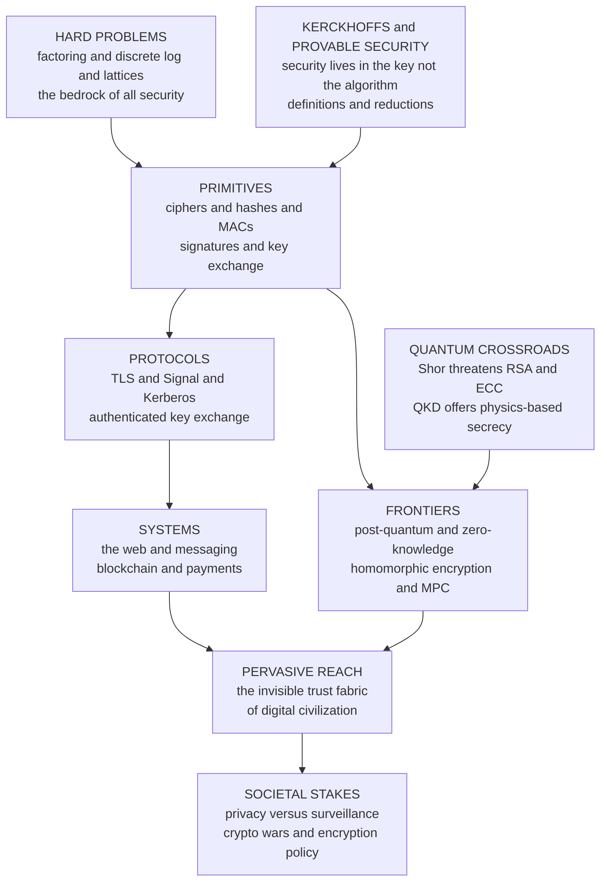

# 🌐 The Reach and Future of Cryptography

> [!abstract] TL;DR
> Cryptography began as the art of hiding messages between kings and generals; today it is the **invisible trust fabric of civilization** — silently securing every tap, purchase, login, and message of billions of people. This capstone ties the whole vault together around a handful of deep ideas that recur everywhere: **hard problems** (factoring, discrete log, lattices) as the bedrock, **Kerckhoffs's principle** (security in the *key*, not the algorithm), the four goals (**confidentiality, integrity, authentication, non-repudiation**) mapped to a small toolbox of **primitives**, **provable security** (definitions + reductions), and the **symmetric + public-key = hybrid** pattern that powers real systems. Those primitives compose upward — **primitives → protocols → systems** — into TLS, Signal, blockchains, and payments. And the field is now expanding into something stranger: proving things while revealing nothing (**zero-knowledge**), computing on data you cannot read (**homomorphic encryption**, **MPC**), and racing to outrun the **quantum computers** that could unravel today's public-key crypto. Beneath all of it runs one hard truth: **misuse, not math, is how cryptography usually fails** — and one large political question: who gets to keep secrets from whom.

---

## Intuition

**Analogy — cryptography grew from a lockbox into the plumbing of a civilization.** For most of history, cryptography was a *lockbox for messages*: a courier carried a sealed dispatch, and only the recipient holding the matching secret could open it. It was rare, deliberate, and human — used by a general the night before a battle or a diplomat guarding a treaty. You could count the users on your fingers, and each act of secrecy was a conscious decision.

Now imagine that lockbox dissolved into the walls, the pipes, the wiring, and the very air of a modern city — invisible, automatic, and load-bearing. Every time you tap your phone, buy coffee, unlock your car, send a photo, or load a web page, dozens of lockboxes snap shut and spring open in milliseconds *without you noticing*. Cryptography stopped being a tool people *use* and became the **substrate people stand on**. Pull it out and the city collapses: no online banking, no private messaging, no software updates you can trust, no way to prove you are who you say you are. The same mathematics that once protected a single letter now underwrites the trust of eight billion strangers transacting with people and machines they will never meet.

And the walls are still being rebuilt while everyone lives inside them. Three renovations are underway at once: cryptographers are learning to let you **prove a fact without revealing it**, to **compute on data that stays encrypted the whole time**, and to **replace the locks before quantum computers learn to pick them**. From a courier's sealed pouch to the invisible trust fabric of civilization — that is the reach, and this note is the map of how the vault's pieces got there and where they are going.

---

## How It Works

This capstone does two jobs: it **recaps the throughlines** that recur across every note in the vault, and it **looks forward** to where the field is heading. Both rest on the same observation — that all of modern cryptography is built from *a few deep ideas*, stacked into layers.

### The recurring foundations (the vault's throughlines)

Read enough of this vault and the same handful of ideas keep reappearing under different names. They are the load-bearing columns:

1. **Hard problems are the bedrock.** Practical cryptography does not achieve *unconditional* secrecy (only the one-time pad does that, see [[Probability_and_Information_Theoretic_Security]]). Instead it rests on **computational hardness**: problems believed infeasible to solve — integer **factoring** (RSA), the **discrete logarithm** (Diffie–Hellman, elliptic curves), and, for the post-quantum era, **lattice problems** like Learning-With-Errors. Break the problem and you break the scheme; that conditional bargain is the whole edifice (see [[Computational_Hardness_Assumptions]]).
2. **Kerckhoffs's principle.** Security must live in the **secret key**, never in the secrecy of the algorithm. "The enemy knows the system." This is why real crypto is open, published, and competitively vetted (AES, SHA-3), and why "security through obscurity" is a fallacy.
3. **Four goals, one small toolbox.** Every construction serves some of four goals — **confidentiality** (they cannot read it), **integrity** (they cannot alter it undetected), **authentication** (you know who sent it), **non-repudiation** (they cannot deny sending it) — delivered by five primitive families: ciphers, hashes, MACs, signatures, and key exchange (see [[Cryptography_Overview]]).
4. **Provable security.** Since Goldwasser–Micali, a scheme comes with a **precise definition** (IND-CPA, EUF-CMA) and a **reduction** proving that breaking it would solve a believed-hard problem. Security became a theorem conditional on an assumption, not a hope (see [[Provable_Security_and_Reductions]]).
5. **Symmetric + public-key = hybrid.** Symmetric crypto is fast but cannot solve key distribution; public-key crypto solves distribution and enables signatures but is slow. Real systems combine them: public-key to *agree on* a fresh symmetric key, symmetric to *do the bulk work*. TLS, Signal, and PGP are all this pattern.
6. **Misuse, not math, is the usual failure.** The AES cipher is not what breaks — reused nonces, weak randomness, unauthenticated ciphertext, padding oracles, and mismanaged keys are. The mathematics is the *strongest* link; the engineering around it is the weakest.

### The ladder: primitives → protocols → systems

The vault is organized as a ladder, and each rung stands on the one below. This is the single most important structural idea in cryptography:

- **PRIMITIVES** — the atoms: block ciphers ([[Block_Ciphers_and_AES]]), hash functions ([[Hash_Functions]]), MACs ([[Message_Authentication_Codes]]), digital signatures ([[Digital_Signatures]]), and key exchange ([[Diffie_Hellman_and_Discrete_Log]], [[Elliptic_Curve_Cryptography]]). Individually each does *one* thing well.
- **PROTOCOLS** — atoms combined into interactive procedures with security guarantees: **TLS** authenticates a server and builds a confidential channel ([[TLS_and_Secure_Channels]]); the **Signal** Double Ratchet gives forward-secret, deniable messaging ([[Secure_Messaging_and_Signal_Protocol]]); **Kerberos** distributes session keys inside an enterprise. A protocol is where composition becomes subtle — the pieces are proven, but *gluing* them correctly is where designs live or die.
- **SYSTEMS** — protocols deployed at civilization scale: the web, messaging platforms, blockchains, and payment networks. Here cryptography meets key management, hardware, human behavior, and law.

The lesson repeated throughout the vault: **you almost never invent a primitive; you compose vetted ones into a protocol, and the composition is the dangerous part.**

### The frontiers: what cryptography is learning to *do*

The classical goals were about *protecting* data in transit and at rest. The frontier redefines what cryptography can accomplish at all:

- **Post-quantum cryptography.** A large, urgent migration from factoring/discrete-log schemes (broken by Shor's algorithm, see [[Shors_Factoring_Algorithm]]) to **lattice-based** and **hash-based** schemes believed quantum-resistant. NIST standardized the first set in 2024 — **ML-KEM** (Kyber) for key encapsulation and **ML-DSA** (Dilithium) plus **SLH-DSA** (SPHINCS+) for signatures — and deployment is now **hybrid** (classical + post-quantum together) so a flaw in the young schemes does not unravel everything.
- **Zero-knowledge proofs.** Prove a statement is true while revealing *nothing else* — that you are over 18 without showing your birthdate, that a transaction is valid without exposing its amounts. **zk-SNARKs** and **zk-STARKs** now make this efficient and non-interactive, powering privacy coins and, crucially, **blockchain scaling** (rollups prove thousands of transactions with one succinct proof). See [[Zero_Knowledge_Proofs]] and the complexity-theory roots in [[Interactive_Proofs_and_Zero_Knowledge]].
- **Fully homomorphic encryption (FHE).** Compute *directly on ciphertext* so a server can run analytics or ML inference on data it can never read, returning an encrypted result only the owner can open. Long a theoretical curiosity, it is steadily maturing toward practicality (see [[Homomorphic_Encryption]]).
- **Secure multiparty computation (MPC).** Several parties jointly compute a function of their private inputs while each keeps its input secret — private auctions, joint fraud detection across banks, and **threshold custody** where no single party ever holds a whole key. The `Secure_Multiparty_Computation` note is a planned sibling; its foundations live in [[Commitment_Schemes_and_Secret_Sharing]].

ZK + FHE + MPC together form the **"computing on private data" trio** — the privacy-enhancing technologies that transform cryptography from a shield into a general tool for cooperation without trust.

### The quantum crossroads

Quantum computing cuts both ways. **Shor's algorithm** would break RSA and elliptic-curve crypto outright once large fault-tolerant machines exist — which is why the post-quantum migration is one of the largest crypto transitions in history. The urgency is **"harvest now, decrypt later"**: adversaries can record encrypted traffic *today* and decrypt it *later* when quantum hardware arrives, so data that must stay secret for a decade needs post-quantum protection *now*. Yet quantum mechanics also *enables* a new kind of security — **Quantum Key Distribution** (BB84), where eavesdropping is detectable because measurement disturbs the state, deriving secrecy from *physics* rather than *computational hardness* (see [[Quantum_Key_Distribution_and_BB84]]).

### The societal stakes

Cryptography is not politically neutral technology — it redistributes power. The **Crypto Wars** of the 1990s (the Clipper chip, export controls that treated strong crypto as a munition, the prosecution threat over PGP) were fights over whether individuals could keep secrets from their own governments. The **encryption backdoor** debate — "**going dark**" versus the mathematical fact that a backdoor for the good guys is a backdoor for everyone — remains unresolved. The **Snowden revelations** exposed mass surveillance and the suspected **Dual_EC_DRBG** backdoor (a NIST-standardized random generator with a probable NSA trapdoor), a case study in how subverting a *primitive* subverts everything above it. Cryptography now sits at the center of the balance of power between individuals, corporations, and states — a civilization-scale stake that no amount of clean math resolves.

### The synthesis map



---

## Key Concepts

### Secondary (the big picture)
- **Cryptography is the invisible plumbing of digital life.** It runs constantly and silently behind every login, message, and payment — you only notice when it breaks.
- **A few deep ideas power everything.** Hard math problems, secret keys, and a small toolbox of primitives (locks, fingerprints, signatures, key-swaps) combine into everything from HTTPS to cryptocurrencies.
- **The frontier is astonishing.** New cryptography lets you *prove something is true without revealing why*, and *compute on data nobody can read* — and there is a race to replace today's locks before quantum computers can pick them.
- **It is deeply political.** Whether people can keep secrets from governments and companies is one of the defining fights of the digital age.

### Undergraduate (the working machinery)
- **The primitive → goal map (memorize it):** encryption → confidentiality; hash → integrity; MAC → integrity + authentication (shared key); signature → authentication + non-repudiation (public key); key exchange → a shared secret. Ephemeral key exchange adds **forward secrecy** — past sessions stay safe even if a long-term key later leaks.
- **Hybrid encryption is the default architecture.** Public-key or key-exchange establishes a session key; **AEAD** (authenticated encryption, e.g. AES-GCM or ChaCha20-Poly1305) does the bulk work, providing confidentiality *and* integrity in one primitive. See [[Public_Key_Cryptography_Foundations]], [[TLS_and_Secure_Channels]].
- **The post-quantum menu.** RSA/ECC rest on factoring/discrete-log, which **Shor** breaks; the replacements rest on **lattice** problems (ML-KEM, ML-DSA) or **hash** functions (SLH-DSA), which are believed quantum-hard. **Grover's** algorithm only *halves* symmetric security, so AES-256 and SHA-384 remain fine — the crisis is specifically in *public-key* crypto.
- **The privacy trio, informally.** *Zero-knowledge* = prove without revealing. *FHE* = compute on ciphertext. *MPC* = jointly compute on split-up secret inputs. All three let mutually distrustful parties cooperate.
- **Crypto-agility.** Because assumptions can fall, systems should be designed so algorithms can be *swapped* without re-architecting — the engineering lesson the post-quantum transition is teaching the whole industry.

### Graduate (the frontier and the unification)
- **Reductions and average-case hardness.** Cryptography needs problems hard *on average* over randomly chosen instances, not merely worst-case — a subtle demand that ties the field to [[Complexity_Cryptography_and_Average_Case_Hardness]] and, ultimately, to [[P_versus_NP]] (a proof that P = NP would collapse most computational security; a proof P ≠ NP still would *not* by itself guarantee cryptography, since it says nothing about average-case or one-way functions).
- **Lattice cryptography's double role.** Learning-With-Errors underpins *both* post-quantum KEMs/signatures *and* fully homomorphic encryption — the same hardness assumption that survives quantum attack also enables computing on ciphertext, a remarkable convergence of the two biggest frontiers.
- **Proof systems as a spectrum.** Interactive proofs → zero-knowledge → succinct non-interactive arguments (SNARKs) → transparent, quantum-resistant STARKs, trading setup assumptions, proof size, and prover cost. The Fiat–Shamir transform turns interactive ZK into non-interactive signatures — a bridge from [[Interactive_Proofs_and_Zero_Knowledge]] to deployed systems.
- **The random-oracle and idealized-model gap.** Many efficient schemes are proven secure only in idealized models (random oracle, generic group). The gap between these heuristics and reality is an active theoretical frontier and a recurring source of subtle real-world breaks.
- **Information-theoretic vs computational security as endpoints.** The one-time pad and QKD offer *unconditional* secrecy (bounded by Shannon's `H(K) ≥ H(M)`); everything scalable is *computational*. The field is the tension between these poles — see [[Information_Theoretic_Security_and_Privacy]] and the parallel synthesis in [[The_Reach_of_Information_Theory]].
- **Cryptography as a crossroads discipline.** It draws its *hardness* from complexity theory, its *math* from number theory and algebra, its *limits* from information theory, its *threat and its tool* from quantum computing, and its *deployment* from distributed systems (blockchain consensus is applied cryptography at scale). Few fields sit at so many intersections at once.

---

## Python Demo

This demo is the vault in miniature: an **end-to-end secure message pipeline** that *composes* five primitives from different sections into a single system delivering **confidentiality + integrity + authenticity + forward secrecy + non-repudiation + a binding commitment**. It shows that cryptography is not one algorithm but a *stack*: (1) an ephemeral **Diffie–Hellman** key agreement (forward secrecy), (2) **HKDF** key derivation from the shared secret, (3) an **AEAD** encrypt-then-MAC of the message (confidentiality + integrity), (4) an **RSA digital signature** over the transcript (authenticity + non-repudiation), and (5) a **hash commitment** to the plaintext (binding integrity check). Everything is pure standard library (`hashlib`, `hmac`, `secrets`) plus `matplotlib`; no third-party crypto. The two plots visualize the **layered secure-system stack** and the **"what do you need → which primitive" selection map**.

```python
# The vault, composed: a mini secure-message pipeline stacking five primitives.
#   DH key agreement (forward secrecy) -> HKDF (key derivation)
#   -> AEAD encrypt-then-MAC (confidentiality + integrity)
#   -> RSA signature (authenticity + non-repudiation) -> hash commitment (binding).
# Pure stdlib + matplotlib. Illustrative key sizes; use vetted libraries in production.
import hashlib, hmac, secrets
import matplotlib.pyplot as plt
from matplotlib.patches import Rectangle

# ============================================================
# 1. EPHEMERAL DIFFIE-HELLMAN  ->  FORWARD SECRECY
#    RFC 3526 2048-bit MODP group. Fresh keys per session, so past traffic
#    stays safe even if long-term secrets later leak.
# ============================================================
P = int("FFFFFFFFFFFFFFFFC90FDAA22168C234C4C6628B80DC1CD1"
        "29024E088A67CC74020BBEA63B139B22514A08798E3404DD"
        "EF9519B3CD3A431B302B0A6DF25F14374FE1356D6D51C245"
        "E485B576625E7EC6F44C42E9A637ED6B0BFF5CB6F406B7ED"
        "EE386BFB5A899FA5AE9F24117C4B1FE649286651ECE45B3D"
        "C2007CB8A163BF0598DA48361C55D39A69163FA8FD24CF5F"
        "83655D23DCA3AD961C62F356208552BB9ED529077096966D"
        "670C354E4ABC9804F1746C08CA18217C32905E462E36CE3B"
        "E39E772C180E86039B2783A2EC07A28FB5C55DF06F4C52C9"
        "DE2BCBF6955817183995497CEA956AE515D2261898FA0510"
        "15728E5A8AACAA68FFFFFFFFFFFFFFFF", 16)
G = 2

def dh_keypair():
    priv = secrets.randbelow(P - 3) + 2
    pub = pow(G, priv, P)
    return priv, pub

a_priv, a_pub = dh_keypair()          # Alice ephemeral
b_priv, b_pub = dh_keypair()          # Bob ephemeral
shared_a = pow(b_pub, a_priv, P)
shared_b = pow(a_pub, b_priv, P)
assert shared_a == shared_b, "DH agreement failed"
shared_secret = shared_a.to_bytes(256, "big")
print("[1] DH agreement OK; both sides derived the same 2048-bit shared secret.")

# ============================================================
# 2. HKDF  ->  turn one shared secret into independent, purpose-bound keys
# ============================================================
def hkdf_extract(salt, ikm):
    return hmac.new(salt, ikm, hashlib.sha256).digest()

def hkdf_expand(prk, info, length):
    okm, t, counter = b"", b"", 1
    while len(okm) < length:
        t = hmac.new(prk, t + info + bytes([counter]), hashlib.sha256).digest()
        okm += t
        counter += 1
    return okm[:length]

prk    = hkdf_extract(salt=b"secure-message-v1", ikm=shared_secret)
k_enc  = hkdf_expand(prk, b"encryption", 32)     # separate key per purpose:
k_mac  = hkdf_expand(prk, b"authentication", 32) # never reuse one key for two jobs
print("[2] HKDF derived independent encryption and MAC keys from the secret.")

# ============================================================
# 3. AEAD (encrypt-then-MAC)  ->  CONFIDENTIALITY + INTEGRITY
#    Keystream via HMAC in counter mode; authenticity via HMAC over nonce||aad||ct.
# ============================================================
def _keystream(key, nonce, n):
    ks, counter = b"", 0
    while len(ks) < n:
        ks += hmac.new(key, nonce + counter.to_bytes(8, "big"), hashlib.sha256).digest()
        counter += 1
    return ks[:n]

def aead_encrypt(k_enc, k_mac, nonce, plaintext, aad=b""):
    ct  = bytes(p ^ k for p, k in zip(plaintext, _keystream(k_enc, nonce, len(plaintext))))
    tag = hmac.new(k_mac, nonce + aad + ct, hashlib.sha256).digest()
    return ct, tag

def aead_decrypt(k_enc, k_mac, nonce, ct, tag, aad=b""):
    expected = hmac.new(k_mac, nonce + aad + ct, hashlib.sha256).digest()
    if not hmac.compare_digest(expected, tag):      # verify BEFORE decrypting
        raise ValueError("integrity check failed -- ciphertext was tampered with")
    return bytes(c ^ k for c, k in zip(ct, _keystream(k_enc, nonce, len(ct))))

MESSAGE = b"Attack at dawn -- and bring the vault of primitives with you."
nonce   = secrets.token_bytes(16)
aad     = b"from:alice;to:bob;seq:1"                # authenticated but not encrypted
ct, tag = aead_encrypt(k_enc, k_mac, nonce, MESSAGE, aad)
print("[3] AEAD encrypted the message (confidentiality) and tagged it (integrity).")

# ============================================================
# 4. RSA DIGITAL SIGNATURE  ->  AUTHENTICITY + NON-REPUDIATION
#    Alice signs the whole transcript so Bob knows it is really from her,
#    and she cannot later deny it. (Textbook RSA for illustration only.)
# ============================================================
def _is_prime(n, k=20):
    if n < 2: return False
    for p in (2,3,5,7,11,13,17,19,23,29,31,37):
        if n % p == 0: return n == p
    d, r = n - 1, 0
    while d % 2 == 0: d //= 2; r += 1
    for _ in range(k):
        x = pow(secrets.randbelow(n - 3) + 2, d, n)
        if x in (1, n - 1): continue
        for _ in range(r - 1):
            x = pow(x, 2, n)
            if x == n - 1: break
        else:
            return False
    return True

def _gen_prime(bits):
    while True:
        cand = secrets.randbits(bits) | (1 << (bits - 1)) | 1
        if _is_prime(cand): return cand

p, q = _gen_prime(512), _gen_prime(512)
n    = p * q
phi  = (p - 1) * (q - 1)
e    = 65537
d    = pow(e, -1, phi)                               # private exponent

transcript = a_pub.to_bytes(256, "big") + b_pub.to_bytes(256, "big") + nonce + aad + ct + tag
h_sig = int.from_bytes(hashlib.sha256(transcript).digest(), "big")
signature = pow(h_sig, d, n)                         # Alice signs
verified  = pow(signature, e, n) == h_sig           # Bob verifies with public (e, n)
print(f"[4] RSA signature over the transcript verifies: {verified}")

# ============================================================
# 5. HASH COMMITMENT  ->  BINDING INTEGRITY CHECK
#    Alice publishes a commitment first; revealing later proves she did not
#    change the message. (Hiding + binding, the core of many ZK/MPC protocols.)
# ============================================================
opening = secrets.token_bytes(16)
commitment = hashlib.sha256(opening + MESSAGE).digest()

# ---- Bob's side: receive, verify signature, decrypt, check commitment ----
assert pow(signature, e, n) == int.from_bytes(hashlib.sha256(transcript).digest(), "big")
recovered = aead_decrypt(k_enc, k_mac, nonce, ct, tag, aad)
assert hashlib.sha256(opening + recovered).digest() == commitment
assert recovered == MESSAGE
print("[5] Bob verified the signature, decrypted, and matched the commitment.")
print("    Recovered message:", recovered.decode())

# ---- tamper test: flip one ciphertext byte and watch integrity catch it ----
bad = bytearray(ct); bad[0] ^= 0x01
try:
    aead_decrypt(k_enc, k_mac, nonce, bytes(bad), tag, aad)
except ValueError as err:
    print("    Tamper detected as expected:", err)

# ============================================================
# VISUALIZE: (left) the layered secure-system stack,
#            (right) the "what do you need -> which primitive" selection map.
# ============================================================
fig, (axL, axR) = plt.subplots(1, 2, figsize=(15, 6))

# ---- left: the ladder primitives -> protocols -> systems ----
layers = [
    ("HARD PROBLEMS   factoring / discrete log / lattices", "#34495e"),
    ("PRIMITIVES   ciphers, hashes, MACs, signatures, key exchange", "#2980b9"),
    ("PROTOCOLS   TLS, Signal, Kerberos, key exchange", "#27ae60"),
    ("SYSTEMS   web, messaging, blockchain, payments", "#e67e22"),
    ("REACH   the invisible trust fabric of civilization", "#8e44ad"),
]
for i, (label, color) in enumerate(layers):
    axL.add_patch(Rectangle((0.05, i), 0.9, 0.82, facecolor=color, alpha=0.85))
    axL.text(0.5, i + 0.41, label, ha="center", va="center",
             color="white", fontsize=10, fontweight="bold")
axL.set_xlim(0, 1); axL.set_ylim(0, len(layers))
axL.axis("off")
axL.set_title("Each layer stands on the one below\n(this demo composes the bottom two rungs)",
              fontsize=11)

# ---- right: security goal (rows) vs primitive (cols) coverage matrix ----
goals = ["Confidentiality", "Integrity", "Authentication",
         "Non-repudiation", "Forward secrecy", "Compute on\nprivate data"]
prims = ["AEAD\ncipher", "Hash", "MAC", "Signature",
         "Ephemeral\nkey exch.", "ZK / FHE\n/ MPC"]
#           AEAD Hash MAC Sig  KEX  ZKtrio
M = [
    [1,   0,  0,  0,   0,   1],   # Confidentiality
    [1,   1,  1,  1,   0,   0],   # Integrity
    [0,   0,  1,  1,   0,   0],   # Authentication
    [0,   0,  0,  1,   0,   0],   # Non-repudiation
    [0,   0,  0,  0,   1,   0],   # Forward secrecy
    [0,   0,  0,  0,   0,   1],   # Compute on private data
]
axR.imshow(M, cmap="Greens", vmin=0, vmax=1.4, aspect="auto")
axR.set_xticks(range(len(prims))); axR.set_xticklabels(prims, fontsize=9)
axR.set_yticks(range(len(goals))); axR.set_yticklabels(goals, fontsize=9)
for r in range(len(goals)):
    for c in range(len(prims)):
        if M[r][c]:
            axR.text(c, r, "OK", ha="center", va="center",
                     color="#145a32", fontweight="bold", fontsize=9)
axR.set_title("What do you need?  ->  Which primitive provides it", fontsize=11)
axR.set_xlabel("primitive"); axR.set_ylabel("security goal")

plt.tight_layout()
plt.show()

# Takeaways:
#  * No single primitive is "security"; the goals are covered by DIFFERENT tools,
#    and a real system STACKS them (this pipeline used five at once).
#  * Ephemeral DH gave forward secrecy; HKDF gave clean key separation; AEAD gave
#    confidentiality+integrity; RSA gave authenticity+non-repudiation; the hash
#    commitment gave a binding check -- exactly the vault, composed end to end.
#  * The tamper test shows integrity is CHECKED, not assumed: encryption alone is
#    not enough, which is why AEAD (encrypt-then-authenticate) is the modern default.
```

**What it shows.** The script runs the full handshake-encrypt-sign-commit flow, prints a checkmark at each of the five stages, decrypts back to the original plaintext, and then flips a single ciphertext byte to demonstrate that the integrity tag *catches* tampering rather than silently decrypting garbage. The left plot renders the **primitives → protocols → systems → reach** ladder (this demo lives on the bottom two rungs, exactly where you compose atoms); the right plot is the **goal-to-primitive selection map** — a grid showing that confidentiality, integrity, authentication, non-repudiation, forward secrecy, and "compute on private data" are each served by *different* tools, which is precisely why real security is a *stack*, not a single call.

---

## Real-World Applications

> **Example — one HTTPS page load is this entire vault firing at once.** Open any banking site and, in under a second: an **ephemeral elliptic-curve key exchange** (ECDHE) agrees on a fresh secret giving *forward secrecy*; the server's **digital signature** and the **PKI** certificate chain prove *authentication*; **HKDF** derives session keys; **AEAD** (AES-GCM or ChaCha20-Poly1305) provides *confidentiality + integrity* for every byte; and **hash functions** verify the certificate and the transcript. Change one primitive and the page cannot load securely — see [[TLS_and_Secure_Channels]].

- **The web (HTTPS / TLS 1.3).** Every padlock, every website — cryptography's single largest deployment, securing essentially all web traffic.
- **Secure messaging.** Signal, WhatsApp, and iMessage use the **Double Ratchet** for forward-secret, end-to-end-encrypted, deniable chat for billions of users (see [[Secure_Messaging_and_Signal_Protocol]]).
- **Banking, payments, and identity.** Card networks, open banking, passkeys/FIDO2, and government e-ID all rest on signatures, MACs, and authenticated encryption.
- **Passwords and keys at rest.** Memory-hard password hashing (Argon2, bcrypt, scrypt) and KDFs protect credentials; full-disk encryption (BitLocker, FileVault, LUKS) protects data at rest (see [[Password_Hashing_and_KDFs]], [[Key_Management_and_Distribution]]).
- **Cryptocurrency and blockchains.** Signatures authorize transactions, hash functions chain blocks and build Merkle trees, and **zero-knowledge rollups** (zk-SNARKs/STARKs) now scale throughput and add privacy — cryptography *is* the ledger's trust model (see [[Cryptographic_Primitives_Blockchain]]).
- **Infrastructure trust.** VPNs, DNSSEC/DoH, code signing, TLS-secured APIs, and software-update integrity all silently depend on the same primitive toolbox.
- **Privacy-enhancing frontiers in production.** MPC-based **threshold custody** protects exchange and institutional keys; FHE pilots run analytics on encrypted health and financial data; ZK proofs power privacy-preserving identity and compliance — the "computing on private data" trio moving from theory into deployment.

---

## Common Pitfalls

- **Rolling your own crypto.** Hand-built ciphers and protocols almost always harbor subtle, catastrophic flaws that only years of public review expose. Compose *vetted* primitives with *vetted* libraries; never invent. This is the single most repeated lesson in the entire vault.
- **Confidentiality without integrity.** Encryption alone does not stop tampering — unauthenticated ciphertext is malleable (padding oracles, bit-flipping). Always use **AEAD** or encrypt-then-MAC, as the demo's tamper test illustrates.
- **Key and nonce misuse.** Reusing a nonce with a stream cipher, reusing one key for two purposes, or drawing keys from a weak RNG silently destroys security *even when the math is perfect*. Derive purpose-separated keys (HKDF) and use a cryptographically secure RNG (see [[Random_Number_Generation]]). Recall the **Dual_EC_DRBG** backdoor: subvert the randomness and you subvert everything above it.
- **Misuse beats math — expect the failure to be operational.** The AES cipher is not what breaks; key management, certificate validation, side channels, and glue-code bugs are. Budget your paranoia for *deployment*, not for the primitive.
- **Ignoring the quantum clock.** "We'll migrate later" fails against **harvest-now-decrypt-later**: long-lived secrets encrypted today under RSA/ECC may be decrypted once quantum computers arrive. Adopt **crypto-agility** and hybrid post-quantum key exchange for anything that must stay secret for years.
- **Treating computational security as permanent.** Every practical scheme rests on *unproven* hardness assumptions. A new algorithm, a proof that P = NP, or a large quantum computer could undermine them. Design so algorithms can be *swapped*, and hold the guarantees with humility.
- **Believing a backdoor can be safe.** "Lawful-access" backdoors and key escrow create a master vulnerability that cannot be limited to authorized users — a recurring, mathematically stubborn lesson of the Crypto Wars.

---

## Related Concepts

- [[Cryptography_Overview]] — the front door to the vault; this capstone is its mirror image, looking outward and forward from the same foundations.
- [[Public_Key_Cryptography_Foundations]] — the asymmetric core (encryption, signatures, key exchange) that makes internet-scale trust possible.
- [[Computational_Hardness_Assumptions]] — factoring, discrete log, and lattices: the bedrock every practical scheme reduces to.
- [[Provable_Security_and_Reductions]] — the definitions-and-reductions discipline that turned "secure" into a conditional theorem.
- [[Probability_and_Information_Theoretic_Security]] — the one-time pad and perfect secrecy; the unconditional pole opposite computational security.
- [[Zero_Knowledge_Proofs]] — prove a fact while revealing nothing; the privacy-and-scaling revolution powering rollups and private identity.
- [[Homomorphic_Encryption]] — compute directly on ciphertext; the "process without reading" frontier, sharing lattice roots with post-quantum crypto.
- [[Commitment_Schemes_and_Secret_Sharing]] — the hiding-and-binding and secret-splitting primitives underpinning MPC, threshold custody, and the demo's commitment step.
- [[TLS_and_Secure_Channels]] — the flagship hybrid protocol; one page load exercises nearly the whole vault.
- [[Secure_Messaging_and_Signal_Protocol]] — the Double Ratchet: forward-secret, deniable, end-to-end messaging at billion-user scale.
- [[Digital_Signatures]] — authentication + non-repudiation; the signature step in the demo pipeline.
- [[Diffie_Hellman_and_Discrete_Log]] — the key-agreement primitive that gives forward secrecy, implemented in the demo.
- [[Elliptic_Curve_Cryptography]] — the compact discrete-log setting behind modern ECDHE and signatures.
- [[Key_Management_and_Distribution]] — where cryptography most often fails in practice; the operational half of applied crypto.
- [[Random_Number_Generation]] — weak randomness silently breaks strong math; the Dual_EC_DRBG cautionary tale.
- [[Password_Hashing_and_KDFs]] — protecting credentials and deriving keys; HKDF and memory-hard hashing.
- [[Shors_Factoring_Algorithm]] — the quantum algorithm that breaks RSA/ECC and drives the entire post-quantum migration.
- [[Quantum_Key_Distribution_and_BB84]] — secrecy from physics rather than hardness; the other face of the quantum crossroads.
- [[Complexity_Cryptography_and_Average_Case_Hardness]] — why cryptography needs average-case hardness, tying it to complexity theory.
- [[P_versus_NP]] — the open question whose resolution would reshape what "computationally secure" can mean.
- [[Interactive_Proofs_and_Zero_Knowledge]] — the complexity-theory roots of zero-knowledge and SNARKs.
- [[Information_Theoretic_Security_and_Privacy]] — perfect secrecy, key-entropy bounds, and differential privacy; the unconditional-security companion.
- [[Cryptographic_Primitives_Blockchain]] — how signatures, hashes, and Merkle trees compose into a decentralized ledger's trust model.
- [[The_Reach_of_Information_Theory]] — the parallel capstone showing entropy unifying communication, learning, and physics.

*(Sibling notes `Post_Quantum_Cryptography`, `Secure_Multiparty_Computation`, `Blockchain_Cryptography`, `Applied_Cryptography_Engineering`, and `Cryptographic_Failures_and_Misuse` are planned for this vault and referenced here in prose until they exist.)*

---

## Review Questions

**Secondary**
1. Using the "cryptography as invisible plumbing" analogy, explain what would practically stop working if strong cryptography vanished for one day. Then name the three big frontier changes underway (prove-without-revealing, compute-on-encrypted-data, and quantum-proofing) in plain language.

**Undergraduate**
2. Walk through the demo's pipeline and state which security goal each of the five primitives provides: ephemeral Diffie–Hellman, HKDF, AEAD, RSA signature, and hash commitment. Which primitive gives *forward secrecy*, and why does using *ephemeral* keys protect *past* sessions? Why is AEAD used instead of plain encryption, and what does the tamper test demonstrate about "confidentiality without integrity"?

**Graduate**
3. "Harvest now, decrypt later" is the argument for migrating to post-quantum cryptography *before* large quantum computers exist. (a) Explain why Shor's algorithm threatens RSA/ECC but Grover's algorithm leaves AES-256 essentially fine, and what that asymmetry implies about *which* primitives must change. (b) Lattice hardness underpins both post-quantum KEMs and fully homomorphic encryption — argue why that convergence is significant. (c) Take a position: does the fact that all computational security rests on *unproven* assumptions (and could fall to P = NP, a new algorithm, or quantum hardware) make cryptography fundamentally fragile, or is crypto-agility a sufficient engineering answer? Defend your view, and connect it to the unresolved backdoor/"going dark" policy debate.

---

## Sources

- [Katz & Lindell, *Introduction to Modern Cryptography* (3rd ed., 2020)](https://www.cs.umd.edu/~jkatz/imc.html)
- [Boneh & Shoup, *A Graduate Course in Applied Cryptography* (free full text)](https://toc.cryptobook.us/)
- [Ferguson, Schneier & Kohno, *Cryptography Engineering* (2010)](https://www.schneier.com/books/cryptography-engineering/)
- [NIST Post-Quantum Cryptography Standardization — FIPS 203 (ML-KEM), 204 (ML-DSA), 205 (SLH-DSA)](https://csrc.nist.gov/projects/post-quantum-cryptography)
- [The Cryptopals Crypto Challenges — learn crypto by breaking it](https://cryptopals.com/)
- [Dan Boneh, *Cryptography I* (Stanford, Coursera)](https://www.coursera.org/learn/crypto)

---

#cryptography #synthesis #post-quantum #privacy #frontiers
