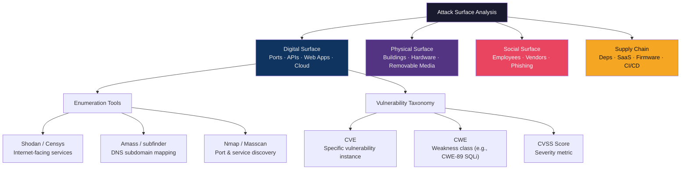

# 🗺️ Attack Surface Analysis

> [!abstract] TL;DR
> Attack surface = the sum of all points where an attacker can attempt to enter or extract data from an environment. It spans four dimensions: digital (open ports, APIs, exposed services), physical (server rooms, lost laptops), social (employees, vendors, social engineering), and supply chain (third-party libraries, SaaS dependencies, firmware). CVE tracks specific vulnerabilities; CWE classifies the underlying weakness classes. Shodan/Censys enumerate internet-facing infrastructure; Amass/subfinder map DNS attack surface; attack surface metrics (number of entry points, privilege levels reachable from each) drive prioritisation. The goal is reduction: remove unneeded entry points, increase privilege requirements at remaining ones.

---

## Intuition — Analogy First

A medieval castle has an attack surface: walls (height, thickness, material), gates (number, guard strength), windows (ground floor vs. high tower), water supply (moat, well), and human factors (bribable guards, visiting merchants). Defenders spent thousands of years learning to reduce unnecessary gates, raise walls, and screen merchants — this is attack surface reduction.

Modern organisations similarly have more "gates" than they realise: shadow IT SaaS tools, developer laptops with open ports, GitHub repos with leaked credentials, third-party JavaScript loading on login pages. Attack surface analysis makes these visible before attackers find them. The CVE/CWE taxonomy provides a shared vocabulary so that "this gate has a known weak lock (CVE-2021-44228)" is immediately understood across teams.

---

## How It Works



---

## Key Concepts / Details

### Four Attack Surface Dimensions

| Dimension | Examples | Reduction Strategies |
|-----------|---------|---------------------|
| **Digital** | Open ports, unpatched services, APIs, web apps, cloud buckets, VPNs | Firewall rules, patch management, cloud posture management (CSPM) |
| **Physical** | Server rooms, unlocked workstations, USB ports, HVAC/OT systems | Badge access, clean desk policy, USB blockers, physical pen tests |
| **Social** | Employees, contractors, help desk, executives, social media | Security awareness training, phishing simulations, vishing policies |
| **Supply Chain** | npm/pip packages, SaaS integrations, managed service providers, firmware | SCA/SBOM, vendor risk assessments, 4th-party risk mapping |

### CVE and CWE Taxonomy

**CVE (Common Vulnerabilities and Exposures)**: A specific vulnerability in a specific version of a product.
- Format: `CVE-YEAR-NNNNN`
- Maintained by MITRE, published in NVD (National Vulnerability Database)
- Example: CVE-2021-44228 (Log4Shell) — JNDI injection in Log4j 2.x, CVSS 10.0

**CWE (Common Weakness Enumeration)**: The class of programming error that leads to vulnerabilities.
- CWE-89: SQL Injection
- CWE-79: Cross-Site Scripting
- CWE-787: Out-of-Bounds Write (most dangerous CWE, 2023)
- CWE-502: Deserialization of Untrusted Data
- CWE-22: Path Traversal

Relationship: CWE-89 is the weakness class → CVE-2019-19781 (Citrix ADC SQLi) is a specific CVE instance of CWE-89.

### Shodan and Censys — Internet Attack Surface

```bash
# Shodan CLI searches
shodan search "org:MyCompany" --fields ip_str,port,transport,product
shodan search "ssl.cert.subject.cn:*.mycompany.com" --fields ip_str,port
shodan search "product:Apache tomcat" "200 OK" country:US

# Censys (API-based)
censys search "parsed.subject_dn: O=MyCompany" --index certificates
censys search "services.port=8080 and services.software.product=Tomcat"
```

Shodan indexes ~600 million internet-connected devices, scanning the entire IPv4 space weekly. Censys provides certificate-based discovery, critical for finding misconfigured TLS endpoints.

### DNS Attack Surface — Amass and Subfinder

```bash
# Passive subdomain enumeration
amass enum -passive -d target.com -o amass_output.txt
subfinder -d target.com -all -o subfinder_output.txt

# Active DNS brute-forcing
amass enum -active -d target.com -brute -w /usr/share/wordlists/dns.txt

# Zone transfer attempt (AXFR)
dig @ns1.target.com target.com AXFR

# Certificate transparency logs
curl -s "https://crt.sh/?q=%.target.com&output=json" | jq '.[].name_value' | sort -u
```

Common findings: forgotten dev/staging subdomains, takeable subdomains (dangling CNAME to deleted cloud resources), exposed internal admin panels.

### Attack Surface Metrics

Quantitative metrics for attack surface:

| Metric | Formula | Target |
|--------|---------|--------|
| Entry Point Count | # unique attack vectors | Minimise |
| Mean Time to Patch (MTTP) | Avg days from CVE publish to patch | < 7 days Critical |
| Exposed High-Severity CVEs | KEV-listed unpatched CVEs | 0 |
| Internet-Exposed Services | Services visible from internet (Shodan) | Minimise |
| Orphaned Cloud Resources | Unowned S3/storage/VMs | 0 |

### Supply Chain Attack Surface — SBOM and SCA

Software Composition Analysis (SCA) tools scan dependency trees:
- **OWASP Dependency-Check**: scans JARs/npm packages against NVD CVE database
- **Snyk**: developer-facing SCA with fix PRs
- **Trivy**: container image scanning (OS packages + app dependencies)

SBOM (Software Bill of Materials): machine-readable inventory of all components. SPDX and CycloneDX are the two dominant standards. US Executive Order 14028 (2021) mandates SBOM for federal software suppliers.

Log4Shell (CVE-2021-44228) impact: organisations without SBOM took weeks to identify all affected systems; those with SBOM identified exposure in hours.

---

## Real-World Notes

- Google Project Zero's "Project Zero" 90-day disclosure policy creates a CVE-to-patch deadline; vendors have 90 days before public disclosure
- Microsoft Defender External Attack Surface Management (EASM) continuously monitors your internet-facing surface using Shodan-like scanning
- Subdomain takeover: if `staging.company.com` CNAME points to a deleted Heroku/Azure app, an attacker can register that app and serve malicious content from `staging.company.com`
- Open redirect in any subdomain breaks domain-level trust and can be chained with OAuth redirect_uri attacks

---

## Common Pitfalls

1. **Scanning only known assets** — Shadow IT (employee-created AWS accounts, SaaS subscriptions) is outside central asset inventory but still part of the attack surface
2. **Ignoring supply chain** — A perfect internal codebase is irrelevant if a third-party analytics JavaScript snippet is compromised (see: Magecart)
3. **One-time surface assessment** — Attack surface changes with every deployment; continuous EASM tooling is required
4. **CVE severity without context** — A CVSS 10.0 CVE in a library you don't call in any code path has zero exploitability in your environment

---

## Related Concepts

- [[Threat_Modeling|← Threat Modeling]] — Attack surface defines the scope for threat models
- [[Reconnaissance_and_OSINT|→ Recon & OSINT]] — Attackers enumerate your attack surface using these same tools
- [[Risk_Management_and_GRC|→ Risk & GRC]] — Attack surface metrics feed risk register
- [[_MOC_Security_Foundations|↑ Security Foundations MOC]]

---

## Review Questions

1. Your Shodan search reveals 12 RDP (port 3389) services exposed to the internet across your organisation. You find CVE-2019-0708 (BlueKeep, CVSS 9.8) affects 8 of them. Construct a triage plan with timelines.
2. A subdomain `dev.company.com` returns a 404. How would you determine if it's a takeover candidate, and what's the attack scenario if it is?
3. A new Python microservice depends on 47 pip packages. Describe the SBOM generation and SCA process you'd run in CI/CD before deployment.

---

## Sources

- NVD CVE Database: https://nvd.nist.gov/
- Shodan: https://www.shodan.io/
- Amass Project: https://github.com/owasp-amass/amass
- CISA SBOM Resources: https://www.cisa.gov/sbom

#Cybersecurity #SecurityFoundations #AttackSurface #CVE #CWE #Shodan
