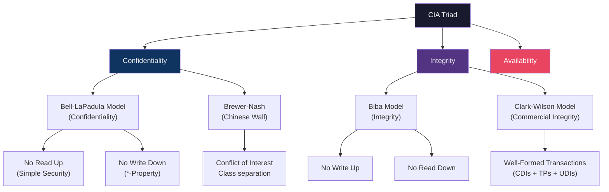

# 🔐 CIA Triad and Security Models

> [!abstract] TL;DR
> The CIA Triad — Confidentiality, Integrity, Availability — forms the foundational goal of every security control. Formal models translate these goals into mathematical rules: Bell-LaPadula enforces confidentiality with no-read-up/no-write-down rules; Biba mirrors this for integrity; Clark-Wilson uses well-formed transactions and separation of duties; Brewer-Nash (Chinese Wall) prevents conflict-of-interest. These models are not mutually exclusive but operate in different contexts, and every real system involves explicit tradeoffs among C, I, and A.

---

## Intuition — Analogy First

Imagine a classified government archive. The Confidentiality goal is: only personnel with the right clearance read documents. The Integrity goal is: no one tampers with evidence files — only authorised archivists may update records, and only through the approved amendment process. The Availability goal is: emergency responders need those files at 3 AM even if the archivist is asleep.

Now notice the tension: maximum confidentiality (lock everything, require in-person verification) conflicts with availability (you cannot reach an analyst at 3 AM). Maximum integrity (every edit requires a three-person sign-off) conflicts with availability (you cannot act quickly). This is the **CAP triangle of security** — not a bug, but a fundamental design constraint every architect must document explicitly.

Formal models emerged in the 1970s–1980s because vague policy statements are unenforceable. A model defines subjects (users/processes), objects (files/resources), and access rules in first-order logic that can be proven consistent.

---

## How It Works

### CIA as Explicit Tradeoffs

| Property | Definition | Broken By | Example Control |
|----------|-----------|-----------|-----------------|
| **Confidentiality** | Information disclosed only to authorised parties | Eavesdropping, data exfiltration, misconfigured ACL | Encryption, least-privilege, DLP |
| **Integrity** | Data and systems modified only by authorised parties via authorised means | Tampering, injection, unauthorised writes | Digital signatures, hashing, WORM storage |
| **Availability** | Systems and data accessible when needed | DoS, ransomware, hardware failure | Redundancy, rate limiting, backups |

Additional properties often appended: **Non-repudiation** (cannot deny action), **Authentication** (identity verification), **Authorisation** (permission enforcement).

### Formal Models

---

## Key Concepts / Details

### Bell-LaPadula (BLP) — Confidentiality

Developed by David Bell and Leonard LaPadula for the US DoD in 1973. Subjects and objects are assigned security labels (Unclassified < Confidential < Secret < Top Secret).

- **Simple Security Property (no-read-up)**: A subject at level L cannot read an object at level > L. A Secret-cleared analyst cannot read Top Secret documents.
- **\*-Property (no-write-down)**: A subject at level L cannot write to an object at level < L. This prevents a Top Secret process from leaking data into an Unclassified file.
- **Discretionary Security Property**: Access matrix governs need-to-know within a level.

**Limitation**: BLP only addresses confidentiality. A Top Secret process can freely corrupt Top Secret data — integrity is unaddressed.

### Biba Model — Integrity

The dual of BLP, developed by Kenneth Biba in 1977.

- **Simple Integrity (no-read-down)**: A subject at integrity level L cannot read objects of lower integrity, preventing contamination by untrusted data.
- **\*-Integrity (no-write-up)**: A subject at level L cannot write to objects of higher integrity, preventing a low-trust process from corrupting high-trust data.

Conflict with BLP: A user simultaneously needing BLP and Biba cannot read down (Biba) or write down (BLP), severely restricting data flow. Real systems rarely enforce both simultaneously.

### Clark-Wilson Model — Commercial Integrity

Addresses the integrity requirements of commercial environments (financial systems, healthcare records). Built on:

- **CDIs (Constrained Data Items)**: High-integrity data (bank balances, medical records)
- **UDIs (Unconstrained Data Items)**: External input, user-supplied data
- **TPs (Transformation Procedures)**: The only authorised ways to modify CDIs (e.g., a double-entry ledger transaction)
- **IVPs (Integrity Verification Procedures)**: Functions that confirm CDIs are in a valid state

Key principles: **Separation of Duty** (two people must certify a transaction) and **Well-Formed Transactions** (all state changes go through TPs, never directly).

Implemented in: banking software, ERP systems (SAP), healthcare EMR workflows.

### Brewer-Nash (Chinese Wall) — Conflict of Interest

Designed for consulting/financial firms. An analyst working for Company A must not access data from Company B if A and B are competitors. Subjects accumulate access history, and the model dynamically adjusts what they can access:

- Objects belong to **Company Datasets** within **Conflict of Interest Classes**
- Once you read from one dataset in a COI class, you cannot read from any other dataset in that class
- Implemented in financial services via information barriers ("Chinese walls") between M&A advisory and trading desks

---

## Real-World Notes

- AWS IAM implements a least-privilege model close to Clark-Wilson: policies are TPs, resource ARNs are CDIs
- Modern operating systems implement Biba-like integrity via Windows Integrity Levels (Low/Medium/High/System) for UAC
- Healthcare compliance (HIPAA) prioritises availability + confidentiality; EHR systems use Clark-Wilson-style audit trails for integrity
- Cloud misconfiguration (e.g., public S3 buckets) is a confidentiality failure, not an integrity one — distinguish these in incident reports

---

## Common Pitfalls

1. **Treating CIA as equal priority** — Most systems are asymmetric. A hospital prioritises Availability > Integrity > Confidentiality; a national intelligence database reverses this.
2. **Confusing authentication with confidentiality** — Knowing who accessed something ≠ controlling what they can see.
3. **BLP deployed without Biba** — Confidentiality-only systems allow insider sabotage without a trace.
4. **Ignoring non-repudiation** — Logging who accessed is insufficient if logs can be deleted; append-only audit trails (WORM) needed.

---

## Related Concepts

- [[Threat_Modeling|→ Threat Modeling]] — STRIDE maps directly onto CIA properties
- [[Risk_Management_and_GRC|→ Risk & GRC]] — NIST CSF categories protect CIA properties
- [[_MOC_Security_Foundations|↑ Security Foundations MOC]]

---

## Review Questions

1. A financial trading system allows analysts to read news feeds (low integrity) and then update trade records (high integrity). Which formal model is violated, and how would you fix it?
2. A Top Secret military system uses Bell-LaPadula. An analyst writes a Python script that reads TS data and emails a summary. Which BLP property does this violate?
3. A healthcare startup claims their system is "secure" because it uses TLS. Which CIA properties does TLS directly address, and which does it leave unaddressed?

---

## Sources

- Bell, D.E. & LaPadula, L.J. (1973). *Secure Computer Systems: Mathematical Foundations*. MITRE Corporation.
- Biba, K.J. (1977). *Integrity Considerations for Secure Computer Systems*. MITRE Corporation.
- Clark, D.D. & Wilson, D.R. (1987). *A Comparison of Commercial and Military Computer Security Policies*. IEEE S&P.

#Cybersecurity #SecurityFoundations #CIA #FormalModels
