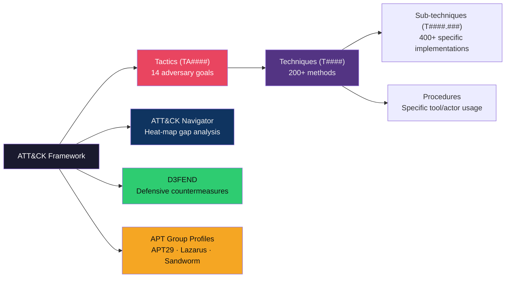

# ⚔️ MITRE ATT&CK Framework

> [!abstract] TL;DR
> MITRE ATT&CK (Adversarial Tactics, Techniques, and Common Knowledge) is a globally-accessible knowledge base of adversary behaviour documented from real-world observations. The Enterprise matrix covers 14 tactics (TA0001–TA0011 + ICS/Mobile extensions) with 200+ techniques and 400+ sub-techniques. Each technique specifies procedure examples, detection data sources (Sysmon Event IDs 1/10 are critical), and mitigation mappings. Navigator provides heat-map gap analysis. APT29 (Cozy Bear) and Lazarus Group are canonical profiles for nation-state TTPs. The companion D3FEND framework maps defensive countermeasures to each ATT&CK technique.

---

## Intuition — Analogy First

ATT&CK is the adversary's playbook converted into a menu. Before ATT&CK, security teams described incidents in free-text narratives ("the attacker moved laterally and dumped credentials"), which made comparing incidents across organisations impossible. ATT&CK gives every action a structured identifier — T1003 (OS Credential Dumping), T1059.003 (Windows Command Shell) — turning narratives into machine-comparable data.

The framework separates **tactics** (the adversary's goal — why) from **techniques** (the method — how) from **procedures** (the specific implementation — exactly how). This three-level hierarchy lets defenders build detections that are technique-level (catching an entire class of attacks) rather than procedure-level (catching only one tool's specific command line).

---

## How It Works



### Enterprise Matrix Tactics

| Tactic ID | Name | Description | Example Technique |
|-----------|------|-------------|-------------------|
| TA0001 | Initial Access | Entry into environment | T1190 Exploit Public App |
| TA0002 | Execution | Run malicious code | T1059.003 Windows Shell |
| TA0003 | Persistence | Maintain foothold | T1547.001 Registry Run Keys |
| TA0004 | Privilege Escalation | Gain higher permissions | T1548.002 Sudo/SUID |
| TA0005 | Defence Evasion | Avoid detection | T1027 Obfuscated Files |
| TA0006 | Credential Access | Steal credentials | T1003 OS Cred Dumping |
| TA0007 | Discovery | Understand environment | T1082 System Info Discovery |
| TA0008 | Lateral Movement | Move through environment | T1021 Remote Services |
| TA0009 | Collection | Gather target data | T1056 Input Capture |
| TA0010 | Exfiltration | Steal data | T1041 C2 Channel Exfil |
| TA0011 | Command & Control | Communicate with implants | T1071 App Layer Protocol |
| TA0040 | Impact | Manipulate/destroy/disrupt | T1486 Data Encrypted (Ransomware) |

---

## Key Concepts / Details

### Technique Hierarchy: T1059.003

T1059 = Command and Scripting Interpreter (parent technique)
T1059.001 = PowerShell
T1059.003 = Windows Command Shell (`cmd.exe`)
T1059.005 = Visual Basic
T1059.007 = JavaScript

Each sub-technique has: description, procedure examples (specific malware/actor usage), detection data sources, mitigations, and references.

### Detection Data Sources — Sysmon

Sysmon (System Monitor) Event IDs critical for ATT&CK detection:

| Sysmon Event ID | Description | ATT&CK Coverage |
|-----------------|-------------|-----------------|
| **1** | Process Creation | T1059, T1003, T1548 |
| **3** | Network Connection | T1071, T1041, T1021 |
| **7** | Image Loaded | T1055, T1129 |
| **8** | CreateRemoteThread | T1055.001 Process Injection |
| **10** | ProcessAccess (LSASS) | T1003.001 LSASS Memory |
| **12/13** | Registry events | T1547.001, T1112 |
| **17/18** | Pipe events | T1021.002 SMB Named Pipes |

```xml
<!-- Sysmon config to detect LSASS access (T1003.001) -->
<EventFiltering>
  <ProcessAccess onmatch="include">
    <TargetImage condition="is">C:\Windows\system32\lsass.exe</TargetImage>
  </ProcessAccess>
</EventFiltering>
```

### ATT&CK Navigator — Gap Analysis

Navigator is a web-based tool for visualising ATT&CK coverage:

1. Load your detection layer (SIEM rules mapped to technique IDs)
2. Load an adversary layer (e.g., APT29 profile)
3. Subtract → red cells = detected gaps where APT29 has technique coverage but you have no detection

Typical gap analysis reveals: Lateral Movement and Defence Evasion are most frequently under-detected.

### APT29 (Cozy Bear) — Russian SVR

Known campaigns: SolarWinds (SUNBURST 2020), Microsoft Outlook zero-day (CVE-2023-23397)

Key techniques used: T1195 (Supply Chain), T1566.002 (Spear-phishing Link), T1027.010 (Command Obfuscation), T1003.006 (DCSync)

Detection focus: PowerShell with encoded commands, WMI subscriptions for persistence, DCSYNC detection via 4662 events on directory objects.

### Lazarus Group — North Korean DPRK

Known for: Sony Pictures (2014), WannaCry (2017), Bybit crypto heist (2025, $1.5B)

Key techniques: T1486 (Data Encrypted for Impact), T1059.001 (PowerShell), T1133 (External Remote Services), T1196 (Control Panel Items)

### D3FEND — The Defensive Complement

MITRE D3FEND maps defensive techniques to ATT&CK: each D3FEND node (e.g., `d3f:ProcessSpawnAnalysis`) links to ATT&CK techniques it detects and mitigates. Enables systematic "for every technique the adversary can use, what countermeasure do I have?"

---

## Real-World Notes

- Sigma rules (open-source SIEM detection language) use ATT&CK technique IDs as tags: `tags: [attack.credential_access, attack.t1003.001]`
- Purple Team exercises use ATT&CK to script adversary simulations (Atomic Red Team provides runnable atomic tests per technique)
- SOC dashboards should display "ATT&CK coverage heatmap" as a KPI alongside MTTD/MTTR
- Threat intel reports from Mandiant/CrowdStrike now standardise on ATT&CK technique IDs

---

## Common Pitfalls

1. **Technique-level detection only** — Detecting Mimikatz.exe by filename is procedure-level; detect LSASS access patterns (Sysmon 10) to catch all credential-dumping tools
2. **Navigator coverage ≠ real detection** — Mapped rules may be too noisy (high FPR) or cover only specific environments; validate with purple team testing
3. **Ignoring sub-techniques** — T1059 coverage doesn't mean T1059.003 coverage; each sub-technique has different detection data sources
4. **Static APT profile assumption** — APT groups evolve their toolkits; yesterday's profile is incomplete today

---

## Related Concepts

- [[Threat_Modeling|← Threat Modeling]] — ATT&CK operationalises STRIDE threats with real techniques
- [[Post_Exploitation_and_Lateral_Movement|→ Post-Exploitation]] — ATT&CK TA0008/TA0006 coverage
- [[Log_Analysis_and_SIEM|→ Log Analysis & SIEM]] — Sysmon → SIEM → ATT&CK detection pipeline
- [[_MOC_Security_Foundations|↑ Security Foundations MOC]]

---

## Review Questions

1. An adversary uses `wmic.exe process call create "powershell -enc <base64>"`. Map this to ATT&CK with Tactic, Technique, and Sub-technique IDs.
2. Your ATT&CK Navigator gap analysis shows zero coverage for TA0008 (Lateral Movement). List three concrete Sysmon events you would enable and which sub-techniques they detect.
3. APT29 is known to use DCSync (T1003.006). What Windows Event ID, on which domain controller, would alert on this, and what false-positive sources exist?

---

## Sources

- MITRE ATT&CK Enterprise: https://attack.mitre.org/
- MITRE D3FEND: https://d3fend.mitre.org/
- Atomic Red Team: https://github.com/redcanaryco/atomic-red-team
- SwiftOnSecurity Sysmon config: https://github.com/SwiftOnSecurity/sysmon-config

#Cybersecurity #SecurityFoundations #MITRE #ATT&CK #ThreatIntel
