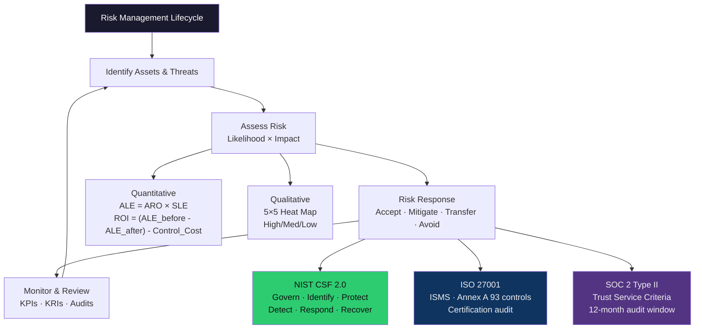

# 📊 Risk Management and GRC

> [!abstract] TL;DR
> Risk = Likelihood × Impact. GRC (Governance, Risk, Compliance) operationalises this formula across three frameworks that dominate enterprise security: NIST CSF 2.0 (Govern/Identify/Protect/Detect/Respond/Recover), ISO 27001 (Annex A 93 controls, ISMS audit), and SOC 2 Type II (Trust Service Criteria, 12-month audit window). CVSS base score (0–10) drives severity, but environmental scores and business impact must adjust patch SLAs. Quantitative risk analysis (ALE = ARO × SLE) enables ROI calculations for security investments, while qualitative heat maps communicate risk to non-technical stakeholders.

---

## Intuition — Analogy First

Risk management in cybersecurity is identical to actuarial science in insurance: you are estimating the expected cost of bad events and comparing it to the cost of preventing them. A bank doesn't guard every door equally — they put the vault with the most money behind the thickest doors. Security risk management does the same: identify your crown jewels (high-impact assets), estimate how likely attackers will target them (likelihood), and spend proportionally.

The GRC bureaucracy that surrounds this — frameworks, audits, compliance certifications — exists because organisations cannot self-certify trustworthiness. A SOC 2 Type II report is a third-party attestation that your risk controls actually worked over 12 months, not just on the day an auditor visited. This is the difference between Type I (point-in-time design) and Type II (operational effectiveness over time).

---

## How It Works

---

## Key Concepts / Details

### Risk Equation and Quantitative Methods

**Risk = Likelihood × Impact**

| Term | Definition | Example |
|------|-----------|---------|
| **SLE** (Single Loss Expectancy) | Cost of one successful attack | $500,000 data breach |
| **ARO** (Annual Rate of Occurrence) | Expected frequency per year | 0.2 (once every 5 years) |
| **ALE** (Annual Loss Expectancy) | SLE × ARO | $100,000/year |
| **Control Cost** | Annual cost of the mitigating control | $30,000/year |
| **ROI** | (ALE_before - ALE_after) - Control_Cost | ($100k - $20k) - $30k = $50k positive ROI |

FAIR (Factor Analysis of Information Risk) is the ISO standard for quantitative risk analysis in cybersecurity, decomposing LEF (Loss Event Frequency) and LM (Loss Magnitude) into sub-factors.

### NIST CSF 2.0 — The US Government Standard

Published 2024, CSF 2.0 adds a **Govern** function as the overarching category:

| Function | Category Examples | Key Outcomes |
|----------|------------------|--------------|
| **Govern** | Risk Strategy, Roles | Board-level accountability |
| **Identify** | Asset Management, Risk Assessment | Complete asset inventory, vulnerability register |
| **Protect** | Identity Management, Data Security, Training | MFA, encryption, security awareness |
| **Detect** | Continuous Monitoring, SIEM | Anomaly detection, event correlation |
| **Respond** | Incident Management, Communications | IR playbooks, stakeholder notification |
| **Recover** | Recovery Planning, Improvements | RTO/RPO, lessons-learned process |

Maturity tiers: Partial (1) → Risk-Informed (2) → Repeatable (3) → Adaptive (4).

### ISO 27001 — International ISMS Standard

ISO 27001:2022 structure:
- **Clauses 4–10**: ISMS requirements (mandatory)
- **Annex A**: 93 controls across 4 themes:
  - Organisational (37 controls): policies, roles, supplier relations
  - People (8 controls): screening, training, offboarding
  - Physical (14 controls): secure areas, equipment protection
  - Technological (34 controls): access control, cryptography, malware, logging

**Certification process**: Internal audit → Stage 1 (documentation review) → Stage 2 (implementation audit) → Surveillance audits (annual) → Recertification (3 years).

Key differentiator from NIST CSF: ISO 27001 is certifiable by an accredited CB (Certification Body); NIST CSF is a self-assessment framework.

### SOC 2 — AICPA Trust Services Criteria

Five Trust Service Criteria (TSC):
1. **Security** (CC series — always required)
2. Availability
3. Processing Integrity
4. Confidentiality
5. Privacy

**Type I**: Tests design of controls at a point in time (~4–6 months to achieve)
**Type II**: Tests operating effectiveness over 6–12 months. Customers require Type II for vendor risk management.

SOC 2 is mandatory for SaaS companies selling to enterprise; a 2023 survey found 78% of enterprise procurement teams require SOC 2 Type II.

### CVSS and Patch SLAs

**CVSS Base Score → Severity → SLA**:

| CVSS Score | Severity | Typical Patch SLA |
|-----------|----------|-------------------|
| 9.0–10.0 | Critical | 24–48 hours |
| 7.0–8.9 | High | 7–14 days |
| 4.0–6.9 | Medium | 30–90 days |
| 0.1–3.9 | Low | 180 days |
| 0 | None | Informational |

**Environmental score adjustments**: A Critical CVSS score for a vulnerability in software you don't use drops to 0 environmental. Always compute environmental CVSS for your specific context. CISA KEV (Known Exploited Vulnerabilities) catalogue overrides SLAs — KEV-listed vulns should be patched within 15 days regardless of base score.

---

## Real-World Notes

- A typical enterprise CISO reports risk using a 5×5 heat map: Likelihood (1–5) × Impact (1–5), colour-coded red/amber/green
- NIST CSF "Detect" function is routinely rated lowest maturity; most organisations have asset inventory gaps in "Identify"
- SOC 2 Type II does NOT mean "we are secure" — it means "our stated controls operated as designed." Scope exclusions are a common audit manipulation
- CIS Controls v8 (18 controls) is the practical implementation guide for NIST CSF; control 1 (asset inventory) is the most impactful starting point

---

## Common Pitfalls

1. **Compliance ≠ Security** — Passing a SOC 2 audit doesn't prevent breaches; controls may be technically compliant but ineffective (e.g., a password policy no one enforces)
2. **Base CVSS for patching SLAs** — Environmental score drops a Critical to Medium if the service is not internet-accessible; prioritise with environmental context
3. **Risk register as a box-checking exercise** — Risk registers that aren't reviewed quarterly become stale and create false confidence
4. **ALE without Monte Carlo** — Single-point estimates hide uncertainty; use probability distributions and sensitivity analysis for major risk decisions

---

## Related Concepts

- [[CIA_Triad_and_Security_Models|← CIA Triad]] — Risk management protects CIA properties
- [[Threat_Modeling|← Threat Modeling]] — CVSS from threat models feeds risk register
- [[Attack_Surface_Analysis|→ Attack Surface Analysis]] — Asset inventory is prerequisite to risk assessment
- [[_MOC_Security_Foundations|↑ Security Foundations MOC]]

---

## Review Questions

1. Your security team found a CVSS 8.5 vulnerability. The affected system processes only internal employee time sheets and is not internet-accessible. How do you adjust the patch SLA, and what environmental CVSS metrics change?
2. A CFO asks why you need a $200,000 EDR solution. Construct an ALE-based ROI argument using realistic breach cost figures.
3. A startup is pursuing SOC 2 Type II. What is the minimum time from "starting controls" to "report in hand," and why can't they shortcut the audit window?

---

## Sources

- NIST CSF 2.0: https://www.nist.gov/cyberframework
- ISO 27001:2022: https://www.iso.org/standard/27001
- CISA KEV: https://www.cisa.gov/known-exploited-vulnerabilities-catalog
- CVSS v3.1 Calculator: https://www.first.org/cvss/calculator/3.1

#Cybersecurity #SecurityFoundations #GRC #RiskManagement #NISTCSF #ISO27001
