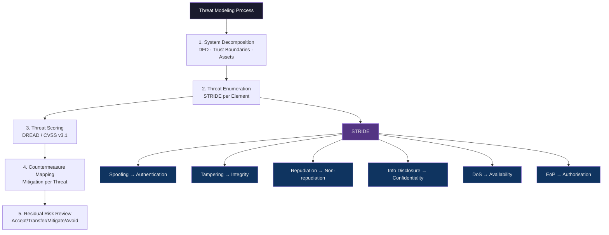

# 🎯 Threat Modeling

> [!abstract] TL;DR
> Threat modeling is the structured discipline of identifying, enumerating, and prioritising threats before attackers exploit them. STRIDE (Spoofing/Tampering/Repudiation/Information Disclosure/DoS/Elevation of Privilege) maps each threat category to a violated security property. PASTA's 7-stage methodology ties threat analysis to business risk. Attack trees decompose attacker goals into sub-goals. LINDDUN addresses privacy threats. DREAD and CVSS v3.1 score severity. The output is a prioritised threat register driving architecture decisions and security requirements.

---

## Intuition — Analogy First

Designing a bank vault without threat modeling is like an architect designing a building without a fire safety engineer — you focus on what you know (aesthetics, structural loads) and miss entire categories of risk (fire spread paths, emergency egress). Threat modeling forces you to ask: "If I were trying to break this, how would I start?"

The key insight is that threats are properties of the system design, not of individual components. A password field that doesn't hash is a threat-modelling miss, but so is a microservice that trusts its caller's claimed identity without verification — even if both components are individually "secure." STRIDE operationalises this by giving each threat a mnemonic that maps to a CIA Triad property, making it impossible to overlook entire classes.

---

## How It Works



---

## Key Concepts / Details

### STRIDE — Microsoft's Threat Classification

| Threat | Security Property Violated | Example | Mitigation |
|--------|--------------------------|---------|------------|
| **S**poofing | Authentication | Forging a JWT with `alg:none` | Strong AuthN, MFA, signed tokens |
| **T**ampering | Integrity | Modifying a serialised Java object | HMAC signing, TLS, input validation |
| **R**epudiation | Non-repudiation | Deleting audit logs | Append-only logs, WORM storage, digital signatures |
| **I**nformation Disclosure | Confidentiality | Verbose error messages, S3 bucket ACL | Encryption, sanitised errors, least-privilege |
| **D**oS | Availability | SYN flood, algorithmic complexity attack | Rate limiting, circuit breakers, CDN |
| **E**levation of Privilege | Authorisation | Exploiting SUID binary, Windows token abuse | Least privilege, capability dropping, sandbox |

**STRIDE-per-Element**: Apply all six categories to every element in your Data Flow Diagram (DFD) — processes, data stores, data flows, external entities, and trust boundary crossings.

### PASTA — 7-Stage Risk-Centric Model

Process for Attack Simulation and Threat Analysis:

1. **Define Objectives** — Business impact, compliance requirements
2. **Define Technical Scope** — Components, APIs, third-party dependencies
3. **Application Decomposition** — DFDs, use cases, entry points
4. **Threat Analysis** — Threat intelligence, threat actors, TTPs
5. **Vulnerability Analysis** — CVE/CVSS scan results, SAST/DAST findings
6. **Attack Modelling** — Attack trees, attack libraries
7. **Risk and Impact Analysis** — Business risk scoring, countermeasure ROI

PASTA bridges the gap between developer-centric STRIDE and business stakeholders; it produces a risk-adjusted output that executives can act on.

### Attack Trees — Decomposing Attacker Goals

An attack tree represents an adversary's goal at the root, with sub-goals as child nodes (AND/OR branches). Example for "Exfiltrate Customer PII":

```
Goal: Exfiltrate Customer PII
├── OR: Compromise Web App
│   ├── SQL Injection (CVE pattern)
│   ├── XSS + Session Hijack
│   └── SSRF → Internal DB
└── OR: Insider Threat
    ├── AND: Obtain credentials
    │   ├── Phishing email
    │   └── MFA bypass
    └── Abuse legitimate access
```

Quantitative attack trees assign probability and cost to each leaf, enabling ROI calculations for controls.

### LINDDUN — Privacy Threat Model

Maps to GDPR and privacy engineering:
- **L**inkability, **I**dentifiability, **N**on-repudiation, **D**etectability, **D**isclosure, **U**nawareness, **N**on-compliance

### DREAD Scoring (Legacy, Still Used in CVE Discussion)

| Factor | Weight |
|--------|--------|
| **D**amage potential | 1–10 |
| **R**eproducibility | 1–10 |
| **E**xploitability | 1–10 |
| **A**ffected users | 1–10 |
| **D**iscoverability | 1–10 |

Risk = Average of all five. Deprecated in favour of CVSS but useful in early-stage design discussions.

### CVSS v3.1 — Industry Standard Severity Scoring

**Base Score Metrics**:
- Attack Vector (Network/Adjacent/Local/Physical)
- Attack Complexity (Low/High)
- Privileges Required (None/Low/High)
- User Interaction (None/Required)
- Scope (Unchanged/Changed)
- CIA Impact (None/Low/High × 3)

Score 0–10: None(0) / Low(0.1–3.9) / Medium(4.0–6.9) / High(7.0–8.9) / Critical(9.0–10.0)

**Environmental Score** adjusts for your specific environment — a Critical vuln in a system with no network access drops to Medium environmental. Always use environmental score for patching SLAs.

---

## Real-World Notes

- Microsoft uses STRIDE in their SDL (Security Development Lifecycle); mandatory for all Azure services
- Google's Project Zero publishes attack trees for browser exploits showing AND-chains of prerequisites
- CVSS 9.8 (Log4Shell CVE-2021-44228): Network AV, Low AC, No PR, No UI, Changed Scope, High CIA — textbook critical
- Threat models must be living documents; re-run STRIDE after every significant architecture change

---

## Common Pitfalls

1. **One-time threat model** — Systems evolve; a threat model from initial design is stale after the first sprint
2. **STRIDE without DFD** — Applying STRIDE without a data flow diagram misses trust boundary crossings, which are where most vulnerabilities live
3. **Confusing likelihood with impact** — DREAD/CVSS scores severity; risk = likelihood × impact. A 10-CVSS vuln in an air-gapped system may have lower risk than a 6-CVSS vuln in a public API
4. **No threat actor profile** — Mitigations differ completely between a nation-state APT and an opportunistic scriptkiddie

---

## Related Concepts

- [[CIA_Triad_and_Security_Models|← CIA Triad]] — STRIDE categories map to CIA properties
- [[MITRE_ATT_CK|→ MITRE ATT&CK]] — Threat models link to ATT&CK techniques for red team validation
- [[Attack_Surface_Analysis|→ Attack Surface Analysis]] — Threat models scope what to enumerate
- [[Risk_Management_and_GRC|→ Risk & GRC]] — CVSS feeds into risk registers
- [[_MOC_Security_Foundations|↑ Security Foundations MOC]]

---

## Review Questions

1. Draw a DFD for a login microservice and apply STRIDE to each element. Which element has the most threat categories?
2. A product manager says "our app is low risk because it's internal-only." Which STRIDE categories still fully apply to internal systems?
3. Using CVSS v3.1, score a vulnerability: a remote unauthenticated attacker can read all database records via a crafted HTTP request, affecting 50,000 users.

---

## Sources

- Microsoft STRIDE: https://learn.microsoft.com/en-us/azure/security/develop/threat-modeling-tool-threats
- CVSS v3.1 Specification: https://www.first.org/cvss/specification-document
- Shostack, A. (2014). *Threat Modeling: Designing for Security*. Wiley.

#Cybersecurity #SecurityFoundations #ThreatModeling #STRIDE #PASTA
