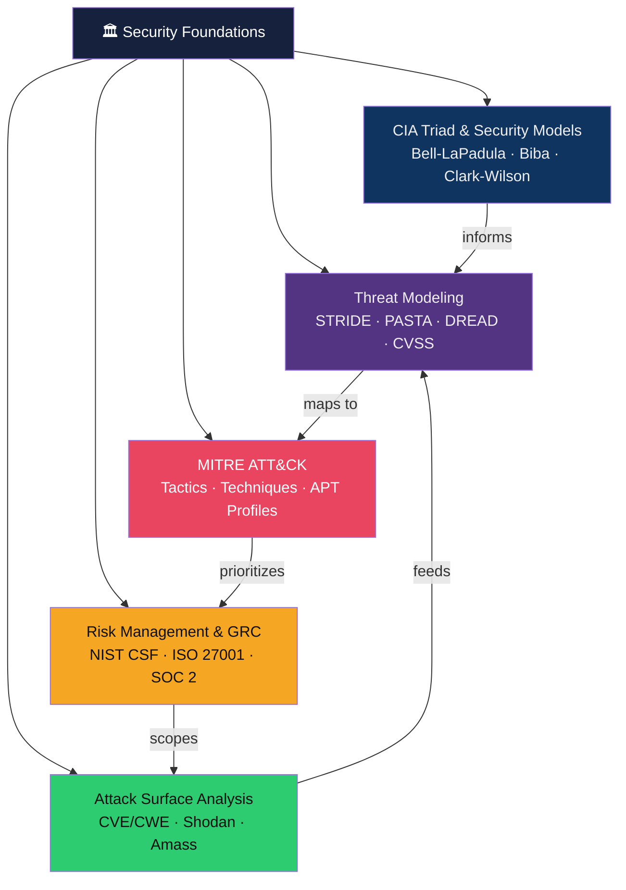

# 🏛️ Security Foundations — Map of Content

> [!abstract] Section Overview
> The bedrock of all security work: formal security models (CIA, Bell-LaPadula, Biba), threat modeling methodologies (STRIDE, PASTA, DREAD), the MITRE ATT&CK framework for adversary emulation, risk management under NIST CSF/ISO 27001, and systematic attack surface analysis using CVE/CWE taxonomies and open-source tooling.

---

## Concept Map

---

## Notes in This Section

| Note | Core Concept | Key Frameworks | Difficulty |
|------|-------------|----------------|------------|
| [[CIA_Triad_and_Security_Models]] | Confidentiality, Integrity, Availability + formal models | Bell-LaPadula, Biba, Clark-Wilson, Brewer-Nash | Beginner |
| [[Threat_Modeling]] | Structured adversary thinking | STRIDE, PASTA, Attack Trees, LINDDUN, DREAD | Intermediate |
| [[MITRE_ATT_CK]] | Adversary TTP framework | ATT&CK Navigator, D3FEND, APT29/Lazarus | Intermediate |
| [[Risk_Management_and_GRC]] | Quantified risk & compliance | NIST CSF, ISO 27001, SOC 2, CVSS | Intermediate |
| [[Attack_Surface_Analysis]] | Exposure enumeration | Shodan, Censys, Amass, CVE/CWE | Intermediate |

---

## Learning Path

1. [[CIA_Triad_and_Security_Models]] — understand what we're protecting and formal proofs
2. [[Threat_Modeling]] — learn to think like an attacker structurally
3. [[MITRE_ATT_CK]] — map threats to real adversary techniques
4. [[Attack_Surface_Analysis]] — enumerate what's exposed before adversaries do
5. [[Risk_Management_and_GRC]] — prioritize defences with quantified risk

---

## Key Questions for This Section

1. Why can't a system simultaneously maximise confidentiality, integrity, and availability?
2. What makes STRIDE superior to ad-hoc threat brainstorming?
3. How does MITRE ATT&CK Navigator enable gap analysis in a security programme?
4. What is the difference between a CVE and a CWE?
5. How does CVSS base score differ from CVSS environmental score — and which should drive patching SLAs?

---

## Related Sections

- [[02_Network_Security/_MOC_Network_Security|↗ Network Security]] — apply foundational models to network controls
- [[05_Penetration_Testing/_MOC_Penetration_Testing|↗ Penetration Testing]] — operationalise threat models via red team exercises
- [[06_Digital_Forensics_IR/_MOC_DFIR|↗ DFIR]] — respond to incidents using ATT&CK-mapped detections
- [[_MOC_Cybersecurity_Master|↑ Master MOC]]

#Cybersecurity #SecurityFoundations #MOC
