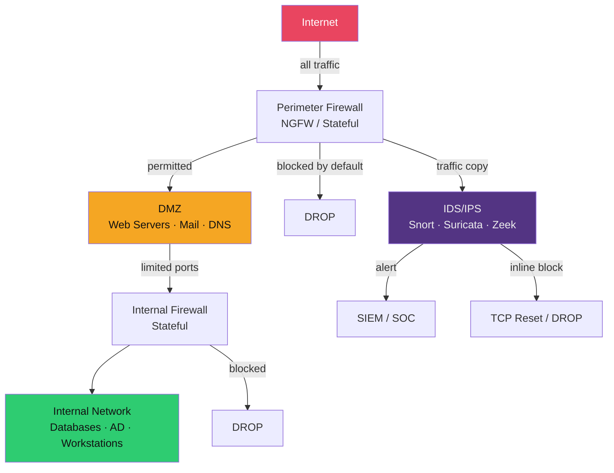

# 🔥 Firewalls and IDS/IPS

> [!abstract] TL;DR
> Firewalls evolved from stateless packet filters (match on IP/port headers only) → stateful conntrack (track connection state: NEW/ESTABLISHED/RELATED/INVALID) → NGFW (Layer 7 App-ID, TLS inspection, user identity). IDS detects; IPS blocks inline. Snort/Suricata rules match on content, flow direction, and metadata using `sid`/`rev` identifiers. The base-rate fallacy explains why a 99% TPR IDS with 1% FPR generates ~91% false positives in a typical enterprise with 0.1% attack rate — overwhelming SOC analyst capacity. DMZ architecture enforces directionality for internet-facing services.

---

## Intuition — Analogy First

A stateless packet filter is like a bouncer who checks only your wristband colour (IP/port) — anyone with the right wristband gets in. A stateful firewall is a bouncer with a clipboard: they know who entered and track that each conversation has two sides. An NGFW is a full-spectrum security checkpoint: they read your ID (identity), check your background (threat intelligence), and inspect your bag (TLS inspection) — even if you're wearing the right wristband.

The IDS/IPS analogy: an IDS is a security camera with a motion alert. It tells you something happened but doesn't stop the attacker. An IPS is an autonomous security door that locks when the camera detects a threat — faster response, but if tuned wrong, it locks out legitimate users.

---

## How It Works



### Firewall Evolution

| Generation | Inspection Level | State | Example Tech |
|-----------|-----------------|-------|-------------|
| Stateless | IP/TCP header only | None | `iptables -j DROP` (no conntrack) |
| Stateful | Session tracking | NEW/ESTABLISHED/RELATED/INVALID | `iptables -m conntrack` |
| Application (NGFW) | Layer 7 protocol | + App-ID, TLS decryption | Palo Alto, Fortinet, Cisco FTD |

---

## Key Concepts / Details

### iptables / nftables — Linux Firewall

iptables uses first-match-wins semantics with default policy (usually DROP for production):

```bash
# Default deny posture
iptables -P INPUT DROP
iptables -P FORWARD DROP
iptables -P OUTPUT ACCEPT

# Allow established/related connections (stateful)
iptables -A INPUT -m conntrack --ctstate ESTABLISHED,RELATED -j ACCEPT

# Allow SSH from management network only
iptables -A INPUT -s 192.168.1.0/24 -p tcp --dport 22 -m conntrack --ctstate NEW -j ACCEPT

# Allow HTTP/HTTPS from internet
iptables -A INPUT -p tcp -m multiport --dports 80,443 -m conntrack --ctstate NEW -j ACCEPT

# Log and drop everything else
iptables -A INPUT -j LOG --log-prefix "IPTABLES_DROP: "
iptables -A INPUT -j DROP
```

**nftables** (modern replacement): single framework for IPv4/IPv6/ARP, better performance, more expressive syntax:

```bash
nft add rule inet filter input ct state established,related accept
nft add rule inet filter input tcp dport { 80, 443 } accept
nft add rule inet filter input drop
```

### Conntrack States

| State | Meaning |
|-------|---------|
| `NEW` | First packet of a new connection |
| `ESTABLISHED` | Connection has been seen in both directions |
| `RELATED` | Related to an existing connection (FTP data channel) |
| `INVALID` | Doesn't match any known connection; DROP these |

### DMZ Architecture

A DMZ (De-Militarised Zone) places internet-facing servers in a network segment with restricted inbound AND outbound access:

- Internet → FW1 → DMZ web server (ports 80/443 only)
- DMZ → FW2 → Internal DB (port 5432 only, from web server IP)
- Internal → DMZ: prohibited (prevents insider reach to internet-facing services)
- DMZ → Internet: prohibited except for specific egress (prevents data exfil from compromised DMZ)

### NGFW — Application-Layer Inspection

Key NGFW capabilities:
- **App-ID**: Identifies applications regardless of port (e.g., Zoom on port 443 vs. HTTPS)
- **TLS Inspection**: Terminates TLS, inspects cleartext, re-encrypts — requires trusted CA cert deployment to endpoints
- **User-ID**: Maps traffic to Active Directory users, not just IPs
- **Threat Prevention**: Inline IPS signatures, URL filtering, sandboxing

### Snort / Suricata Rules

Snort rule anatomy:
```
action proto src_ip src_port direction dst_ip dst_port (options)
```

```bash
# Detect Mimikatz LSASS access attempt
alert tcp $HOME_NET any -> $HOME_NET 445 (
  msg:"CREDENTIAL_DUMPING Mimikatz SMB Passthrough";
  content:"|60 48 81 EC|"; depth:4;
  flow:established,to_server;
  classtype:credential-theft;
  sid:9001001; rev:1;
)

# Detect DNS tunneling (long subdomain)
alert dns any any -> any 53 (
  msg:"SUSPICIOUS DNS Tunneling Long Subdomain";
  dns.query; content:"."; pcre:"/([a-z0-9]{30,}\.){2,}/i";
  threshold:type both,track by_src,count 5,seconds 60;
  sid:9001002; rev:1;
)
```

Key options: `content` (literal byte match), `pcre` (regex), `flow` (direction/state), `threshold` (rate limit false positives), `sid` (unique rule ID), `rev` (revision).

### The Base-Rate Fallacy in IDS

Mathematical reality of intrusion detection:

- True Positive Rate (TPR/Sensitivity): 99% — the IDS detects 99% of real attacks
- False Positive Rate (FPR): 1% — the IDS falsely alerts on 1% of benign traffic
- Prior probability of attack (P(attack)): 0.1% in a typical enterprise (1 in 1000 events is malicious)

Using Bayes' theorem:
```
P(attack | alert) = P(alert | attack) × P(attack) / P(alert)
P(alert) = TPR × P(attack) + FPR × P(benign)
         = 0.99 × 0.001 + 0.01 × 0.999
         = 0.000990 + 0.009990 = 0.010980
P(attack | alert) = 0.000990 / 0.010980 ≈ 0.090 = ~9%
```

**Result**: ~91% of alerts are false positives, even with a 99% accurate IDS. This is why SOC teams tune rules aggressively and use UEBA/ML for anomaly detection rather than pure signature matching.

---

## Real-World Notes

- Palo Alto NGFW App-ID can identify 2,000+ applications; critical for blocking Tor, BitTorrent, and C2 traffic masquerading as HTTPS
- TLS inspection is controversial: it introduces a new trust anchor (the NGFW CA cert), adds latency, and breaks HSTS/certificate pinning
- Suricata supports multi-threading and AF_PACKET for high-throughput (10 Gbps+) IPS deployment; Snort 3 added similar capabilities
- Zeek (formerly Bro) generates structured logs (conn.log, dns.log, http.log, ssl.log) rather than alerts — used for forensics and threat hunting

---

## Common Pitfalls

1. **Default ACCEPT policy** — Many misconfigured firewalls default to ACCEPT and add deny rules; a process crash or rule flush leaves everything open. Always default-deny.
2. **Allowing INVALID conntrack** — INVALID state packets are often used in firewall evasion; explicitly DROP them
3. **IPS tuning neglect** — Out-of-the-box Snort/Suricata generates thousands of alerts/hour; must tune to environment or analysts ignore everything
4. **No egress filtering** — Most firewalls focus on ingress; egress filtering blocks data exfiltration and C2 beaconing

---

## Related Concepts

- [[VPN_and_Zero_Trust|→ VPN & Zero Trust]] — ZTN replaces perimeter firewall model
- [[TLS_and_SSL|→ TLS & SSL]] — NGFW TLS inspection context
- [[Network_Forensics|→ Network Forensics]] — Snort/Zeek logs feed forensic analysis
- [[Log_Analysis_and_SIEM|→ SIEM]] — Firewall logs feed SIEM correlation
- [[_MOC_Network_Security|↑ Network Security MOC]]

---

## Review Questions

1. Explain why a firewall with `iptables -P INPUT ACCEPT` and explicit DENY rules at the bottom is dangerous compared to default DROP with explicit ACCEPT rules.
2. Write a Suricata rule detecting HTTP POST requests to `*/login` paths with response codes 200/302 exceeding 100 per minute from the same source (credential stuffing detection).
3. In a 100,000-event-per-day enterprise environment with 1 in 10,000 events being malicious, how many false-positive alerts per day does a 98% TPR / 0.5% FPR IDS generate? How does this affect SOC capacity?

---

## Sources

- Snort Rule Writing Guide: https://docs.snort.org/rules/
- iptables Tutorial: https://www.frozentux.net/iptables-tutorial/iptables-tutorial.html
- Zeek Documentation: https://docs.zeek.org/

#Cybersecurity #NetworkSecurity #Firewall #IDS #IPS #Snort #Suricata
