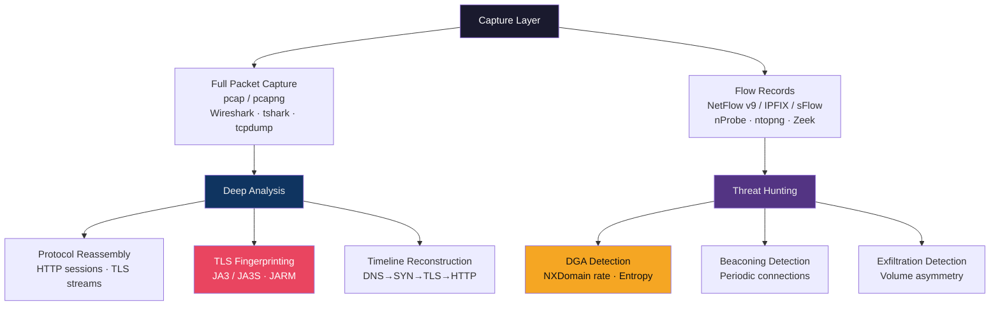

# 🔍 Network Forensics

> [!abstract] TL;DR
> Network forensics reconstructs what happened on a network from captured traffic (pcap) and flow records (NetFlow/IPFIX). Wireshark/tshark perform deep packet inspection and protocol reassembly. NetFlow provides metadata without payload: 5-tuple (src/dst IP, src/dst port, protocol) + byte/packet counts at ~1/100 the storage cost of full pcap. JA3/JA3S fingerprint TLS ClientHello/ServerHello fields to identify malware C2 tools by implementation even when IPs rotate. DGA (Domain Generation Algorithm) detection uses Shannon entropy and NXDomain rate analysis to find beaconing malware. Timeline reconstruction correlates DNS → TCP → HTTP/TLS events to rebuild attack sequences from minimal evidence.

---

## Intuition — Analogy First

Network forensics is detective work with a wire recorder. A pcap file is the complete recording of every conversation; NetFlow is the phone company's call record (who called whom, for how long, how many words) without the content. JA3 fingerprinting is like recognising a caller's voice even when they change phone numbers — the TLS implementation has consistent characteristics across connections.

The challenge: at 10 Gbps, a full pcap generates ~75 TB/day. You cannot store everything. Network forensics is therefore partly the science of deciding what to capture (selective recording, metadata-only fallback) and partly the science of extracting maximum signal from minimum data.

---

## How It Works



---

## Key Concepts / Details

### Wireshark and tshark — Packet Analysis

```bash
# Capture on interface eth0, filter HTTP traffic, save to file
tcpdump -i eth0 -w capture.pcap 'tcp port 80 or tcp port 443'

# tshark: command-line Wireshark
# Extract HTTP requests
tshark -r capture.pcap -Y "http.request" -T fields \
  -e frame.time -e ip.src -e http.host -e http.request.uri

# Extract TLS SNI (Server Name Indication) from ClientHello
tshark -r capture.pcap -Y "tls.handshake.type == 1" -T fields \
  -e ip.src -e ip.dst -e tls.handshake.extensions_server_name

# Follow a specific TCP stream (reconstruct session)
tshark -r capture.pcap -q -z follow,tcp,ascii,0

# Export HTTP objects (files transferred over HTTP)
tshark -r capture.pcap --export-objects http,/tmp/exported_files/
```

Useful Wireshark display filters:
```
# Show only DNS queries
dns.flags.response == 0

# Show all NXDOMAIN responses
dns.flags.rcode == 3

# Find large DNS responses (potential DNS tunneling)
dns and frame.len > 500

# TLS with specific cipher suite
tls.handshake.ciphersuite == 0xc02c

# HTTP with non-200 status (recon/error harvesting)
http.response.code != 200
```

### pcap vs NetFlow/IPFIX

| Feature | Full pcap | NetFlow/IPFIX |
|---------|-----------|---------------|
| Content visibility | Yes (payload) | No (metadata only) |
| Storage requirement | ~750 MB/s @ 1Gbps | ~1 MB/s @ 1Gbps |
| Protocol reconstruction | Full | None |
| Retention period | Hours–days | Weeks–months |
| Privacy risk | High (captures passwords, PII) | Low |
| Use case | Incident investigation | Baseline, anomaly detection |

Best practice: NetFlow for 90-day retention (threat hunting, long-term trends), pcap at chokepoints for 24–72 hours for incident response.

### JA3 and JA3S Fingerprinting

JA3 (John Althouse, Jeff Atkinson, Josh Atkins — Salesforce, 2017):

```
JA3 = MD5(TLSVersion,Ciphers,Extensions,EllipticCurves,EllipticCurvePointFormats)
```

The ClientHello fields:
- SSLVersion: e.g., 769 (TLS 1.0), 771 (TLS 1.2)
- Ciphers: comma-separated decimal cipher suite IDs
- Extensions: extension type IDs
- Elliptic curves: supported groups
- EC point formats: compressed/uncompressed

Example:
```
771,4866-4867-4865-49195-49196-49200-49199-159-158-49171-49172-57-51,0-23-65281-10-11-35-16-5-13-18-51-45-43-21,29-23-24,0
MD5 → ja3 = "bfbe2b31d4ea6ff41f99d9e9b50fbb60"
```

**JA3S**: Same concept for ServerHello — identifies server implementation (nginx vs IIS vs Go net/http).

**JARM** (Salesforce 2020): Active fingerprinting by sending 10 specially crafted ClientHellos and hashing the 10 ServerHello responses. Identifies server-side TLS stacks including C2 frameworks.

```bash
# JA3 extraction from pcap
python3 ja3.py capture.pcap
# Output: "bfbe2b31d4ea6ff41f99d9e9b50fbb60"

# Known C2 JA3 hashes (examples from threat intel)
# Cobalt Strike default: "72a589da586844d7f0818ce684948eea"
# Metasploit default:    "8d558a6c0fd2e6e5db6ca73b68e65e26"
```

### DGA Detection — Domain Generation Algorithms

Malware using DGAs (Conficker, Mirai, Dridex) generates hundreds of potential C2 domain names algorithmically. Only the attacker registers one; the rest return NXDOMAIN.

**Detection signals**:

| Signal | Threshold | Tool |
|--------|-----------|------|
| NXDOMAIN rate per host | > 50/hour | Zeek conn.log |
| Subdomain label entropy (bits/char) | > 3.5 (random) vs < 2.5 (words) | Python `scipy.stats.entropy` |
| Lexical features (no vowels, no English words) | ML classifier | ja3er, Bluecoat) |
| Query volume spike | 10× baseline | Elastic anomaly detection |

```python
import math
from collections import Counter

def shannon_entropy(domain):
    label = domain.split('.')[0]  # Check first label only
    freq = Counter(label)
    total = len(label)
    return -sum((c/total)*math.log2(c/total) for c in freq.values())

# English words: entropy ~2.5-3.0 bits/char
# DGA domains: entropy ~3.5-4.0 bits/char
print(shannon_entropy("google"))          # 2.25
print(shannon_entropy("xkjqmnzprwst"))   # 3.58 (DGA-like)
```

### Timeline Reconstruction

Correlating events across logs to reconstruct an attack:

```
14:23:01.445  DNS: workstation1 queries attacker.com → A: 198.51.100.1
14:23:01.891  TCP: workstation1:52341 → 198.51.100.1:443 SYN
14:23:01.943  TCP: SYN-ACK (connection established)
14:23:02.012  TLS: ClientHello (JA3: 72a589da586844d7f0818ce684948eea ← Cobalt Strike)
14:23:02.089  TLS: ServerHello + Certificate (CN: *.attacker.com, issued 2026-07-25)
14:23:02.190  TLS: Application data (C2 beacon, 4096 bytes)
14:23:32.190  TLS: Application data (response, 256 bytes — tasking)
```

This 30-second pattern repeating indefinitely = Cobalt Strike beacon with 30s sleep jitter.

Tools for automated correlation:
- **Zeek**: generates `conn.log`, `dns.log`, `ssl.log`, `http.log`, `files.log` — correlated by `uid` field
- **Arkime (formerly Moloch)**: indexed full-pcap search at scale
- **RITA** (Real Intelligence Threat Analytics): automated C2 beacon detection from Zeek logs

```bash
# RITA beacon detection from Zeek logs
rita import /path/to/zeek/logs /dataset/name
rita show-beacons /dataset/name | head -20
# Output: score, src, dst, connection_count, avg_interval, interval_jitter
```

---

## Real-World Notes

- In the SolarWinds investigation, network forensics from NetFlow data (not pcap — that wasn't available for 18 months of dwell time) identified anomalous connections from Orion servers to avsvmcloud.com C2 domains
- JA3 hash `72a589da586844d7f0818ce684948eea` is the default Cobalt Strike TLS fingerprint; defenders should alert on it even if the IP is unknown
- Zeek's `notice.log` integrates with threat intel feeds; a match between a connection IP and a threat intel IOC generates an automatic notice
- Network forensics without NTP synchronization produces unusable timestamps — verify clock sync before collection

---

## Common Pitfalls

1. **Capturing only at perimeter** — East-west traffic (lateral movement) is invisible; place capture taps on internal trunk links and vSwitches
2. **No VLAN tagging in pcap** — 802.1Q VLAN tags stripped by some interfaces; use `-e` flag or monitor ports that preserve tags
3. **JA3 as sole detection signal** — JA3 hashes can be modified with one line of C2 config; use JA3 as one signal in a multi-signal detection rule
4. **Not normalising timestamps** — Different log sources in UTC vs local time create correlation errors; enforce UTC across all log sources

---

## Related Concepts

- [[Firewalls_and_IDS_IPS|← Firewalls & IDS/IPS]] — Snort/Zeek are deployed alongside firewalls
- [[DNS_Security|← DNS Security]] — DGA detection, DNS tunneling analysis
- [[DFIR_Methodology|→ DFIR Methodology]] — Network forensics feeds IR investigations
- [[Log_Analysis_and_SIEM|→ Log Analysis & SIEM]] — Zeek/NetFlow feeds SIEM
- [[_MOC_Network_Security|↑ Network Security MOC]]

---

## Review Questions

1. You have 3 days of NetFlow records and a 6-hour pcap window around a suspected incident. How do you use both data sources to reconstruct an attacker's lateral movement path?
2. A host is generating 300 NXDOMAIN responses per hour to random-looking `.com` domains. Write a tshark command to extract all unique queried domains from the pcap, and describe the algorithm to classify them as DGA vs legitimate.
3. The JA3 hash from a suspicious process on a workstation matches a known Cobalt Strike default fingerprint. What additional evidence do you collect from the same pcap to confirm C2 beaconing?

---

## Sources

- Zeek Documentation: https://docs.zeek.org/
- RITA C2 Detection: https://github.com/activecm/rita
- JA3 Fingerprinting: https://github.com/salesforce/ja3
- Wireshark Display Filters: https://www.wireshark.org/docs/dfref/

#Cybersecurity #NetworkSecurity #Forensics #Wireshark #JA3 #DGA #NetFlow
