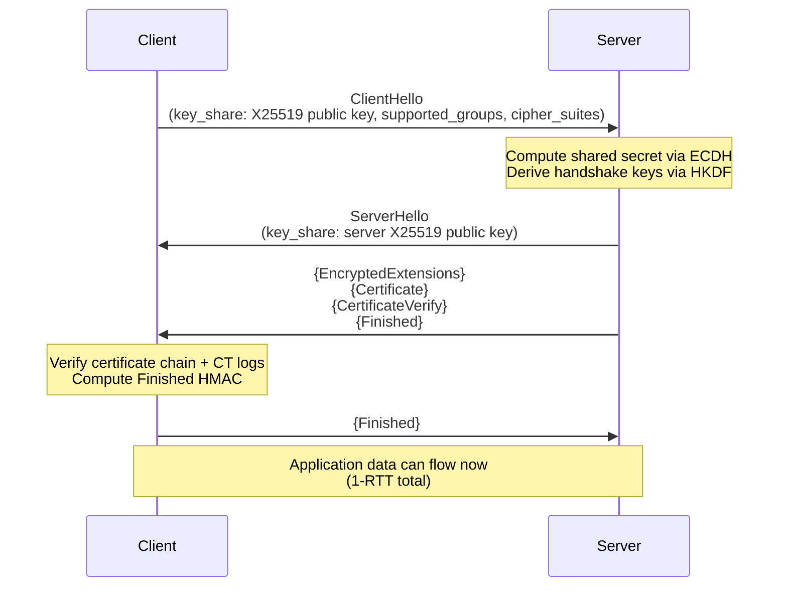

# 🔐 TLS and SSL

> [!abstract] TL;DR
> TLS 1.3 (RFC 8446, 2018) is the current standard, completing a full handshake in 1-RTT (vs. TLS 1.2's 2-RTT). The handshake: ClientHello (key share + cipher suites) → ServerHello (key share + cert) → Finished (HMAC over transcript). All keys derived via HKDF from early/handshake/master secrets. Record layer is AEAD-only (AES-GCM or ChaCha20-Poly1305). TLS 1.3 removes static RSA key exchange, CBC mode, RC4, SHA-1, compression, and insecure renegotiation. 0-RTT (PSK resumption) enables replay attacks on non-idempotent requests. OCSP stapling, certificate transparency (CT), and SANs are essential deployment best practices.

---

## Intuition — Analogy First

TLS is the envelope and seal around your internet communications. Without TLS, packets travel as postcards — legible to every postal worker (ISP, router, attacker on the same WiFi). TLS provides three properties: the message is sealed (confidentiality, AES-GCM), the seal cannot be faked (authentication, certificates), and the message hasn't been altered in transit (integrity, HMAC/AEAD).

The TLS 1.3 handshake redesign was driven by removing every cryptographic primitive with a known attack. RC4 (BEAST), CBC with MAC-then-Encrypt (POODLE, Lucky13), static RSA key exchange (no forward secrecy), MD5/SHA-1 signatures (collision attacks), compression (CRIME) — all removed. What remains is a minimal, auditable protocol that is provably secure under standard assumptions.

---

## How It Works

### TLS 1.3 Handshake (1-RTT)



### Key Schedule (HKDF)

TLS 1.3 uses HKDF (HMAC-based Key Derivation Function) to derive all session keys:

```
Early Secret = HKDF-Extract(0, PSK or 0)
    ↓ HKDF-Expand-Label
Handshake Secret = HKDF-Extract(Derived, ECDH shared secret)
    ↓ HKDF-Expand-Label
Master Secret = HKDF-Extract(Derived, 0)
    ↓ HKDF-Expand-Label → 4 symmetric keys:
    client_handshake_traffic_secret
    server_handshake_traffic_secret
    client_application_traffic_secret
    server_application_traffic_secret
```

Each key is bound to the full handshake transcript — any tampering with earlier messages causes authentication failure.

---

## Key Concepts / Details

### What TLS 1.3 Removed

| Removed Feature | Reason | Attack |
|----------------|--------|--------|
| Static RSA key exchange | No forward secrecy | Decrypt past sessions with stolen private key |
| CBC cipher suites | MAC-then-Encrypt flaw | POODLE (CVE-2014-3566), Lucky13 |
| RC4 | Statistical biases | BEAST, RC4 NOMORE |
| SHA-1 in signatures | Collision attacks | SHAttered (2017) |
| Data compression | Information leakage | CRIME, BREACH |
| Renegotiation | Protocol confusion | CVE-2009-3555 |
| MD5 in PRF | Collision attacks | — |

### Certificate Validation and SANs

TLS certificate validation steps:
1. Certificate chain to a trusted root CA (RFC 5280 path validation)
2. **Subject Alternative Names (SANs)**: The hostname must match a SAN entry (CN deprecated per RFC 2818)
3. **Basic Constraints**: CA:FALSE prevents leaf certificates from signing other certificates
4. **Key Usage**: `Digital Signature` required for TLS; CA certs need `Certificate Sign, CRL Sign`
5. **Validity period**: 398 days maximum for publicly-trusted certs (Apple/Google browser policy)

```python
# Python: verify SAN matching
import ssl, socket

context = ssl.create_default_context()
with socket.create_connection(("example.com", 443)) as sock:
    with context.wrap_socket(sock, server_hostname="example.com") as ssock:
        cert = ssock.getpeercert()
        print(cert['subjectAltName'])  # [('DNS', 'example.com'), ('DNS', '*.example.com')]
```

### OCSP Stapling

Certificate revocation problem: CRL (Certificate Revocation List) is large and downloaded infrequently; OCSP (Online Certificate Status Protocol) adds latency and privacy risk (CA learns which sites you visit).

**OCSP Stapling** solution: Server periodically fetches its own OCSP response from the CA, caches it, and "staples" it to the TLS handshake. Client gets fresh revocation status without contacting the CA.

Nginx configuration:
```nginx
ssl_stapling on;
ssl_stapling_verify on;
resolver 8.8.8.8 8.8.4.4 valid=300s;
ssl_trusted_certificate /etc/nginx/chain.pem;
```

**Soft-fail vs hard-fail**: Browser soft-fail (continue if OCSP unavailable) is the default — attackers can block OCSP responses to bypass revocation.

### Certificate Transparency (CT)

CT (RFC 6962) requires all publicly-trusted TLS certificates to be logged in append-only public CT logs before browsers trust them. This enables:
- Detection of misissued/unauthorized certificates for any domain
- Subdomain enumeration (all subdomains visible in CT logs via crt.sh)

Monitoring: use `certspotter` or `crt.sh` API to receive alerts when new certificates for your domain are issued.

### 0-RTT Resumption and Replay Risk

TLS 1.3 0-RTT allows sending application data in the first flight using a PSK (pre-shared key) from a previous session — eliminating the RTT penalty for reconnects. The risk:

- 0-RTT data is sent before server authentication is verified
- An on-path attacker can **replay** 0-RTT data to a different server instance
- Acceptable for idempotent GET requests; **prohibited for POST/PUT/DELETE** (state-changing operations)

Nginx/application mitigation:
```nginx
ssl_early_data on;  # Enable 0-RTT
# Applications must check $ssl_early_data header to reject replays on non-GET
```

### HSTS and TLS Deployment

```nginx
# Strict-Transport-Security: force HTTPS for 1 year, include subdomains, preload
add_header Strict-Transport-Security "max-age=31536000; includeSubDomains; preload" always;

# Disable TLS 1.0/1.1 (deprecated)
ssl_protocols TLSv1.2 TLSv1.3;

# TLS 1.3 cipher suites are fixed; for TLS 1.2:
ssl_ciphers ECDHE-ECDSA-AES256-GCM-SHA384:ECDHE-RSA-AES256-GCM-SHA384;
ssl_prefer_server_ciphers off;  # TLS 1.3 clients should choose
```

---

## Real-World Notes

- Chrome deprecates SHA-1 certificates caused near-zero transition — browser policy is more effective than RFC mandates for adoption
- JA3 fingerprinting (Salesforce research): MD5 hash of TLS ClientHello fields (version, ciphers, extensions, elliptic curves, EC point formats) — identifies malware C2 clients that share implementation fingerprints even if IPs rotate
- Let's Encrypt issues ~3 million certificates/day, making HTTPS adoption free; 98%+ of web traffic is now TLS-encrypted
- TLS interception by corporate proxies shows up in CT logs — privacy-conscious employees can detect it

---

## Common Pitfalls

1. **Pinning to leaf certificate** — Certificate rotation breaks pinned apps; pin to intermediate CA or use HPKP (deprecated — too risky, use Expect-CT instead)
2. **Missing OCSP stapling** — Clients perform OCSP check adding 50–200ms latency; enable stapling on all production servers
3. **0-RTT on POST endpoints** — State-changing operations must reject 0-RTT early data via the `Early-Data: 1` header check
4. **Trusting CN hostname matching** — CN hostname matching is deprecated; all modern TLS stacks use SANs; old code checking CN directly is broken

---

## Related Concepts

- [[TLS_Protocol_Deep_Dive|→ TLS Protocol Deep Dive]] — HKDF key schedule, 0-RTT, JA3 fingerprinting details
- [[Asymmetric_Cryptography_and_PKI|→ PKI & Asymmetric Crypto]] — Certificate chain, CA trust, OCSP
- [[DNS_Security|→ DNS Security]] — DoH/DoT, CT log monitoring, HSTS preload
- [[_MOC_Network_Security|↑ Network Security MOC]]

---

## Review Questions

1. A server supports TLS 1.2 with `ECDHE-RSA-AES128-CBC-SHA` and TLS 1.3. An attacker captures all encrypted traffic today. Which sessions are at risk if the server's private key is compromised in 5 years, and why?
2. A developer complains that their app breaks after certificate renewal. Diagnose: they have certificate pinning enabled and pinned to the leaf certificate. What should they pin to instead, and what's the recommended modern alternative to HPKP?
3. Your API accepts 0-RTT (early data) resumption. An attacker on the path replays a `POST /transfer` request 3 times. What is the exact mechanism of the replay, and how do you fix it?

---

## Sources

- RFC 8446 (TLS 1.3): https://www.rfc-editor.org/rfc/rfc8446
- Mozilla SSL Configuration Generator: https://ssl-config.mozilla.org/
- JA3 Fingerprinting: https://github.com/salesforce/ja3

#Cybersecurity #NetworkSecurity #TLS #SSL #PKI #HTTPS #HKDF
