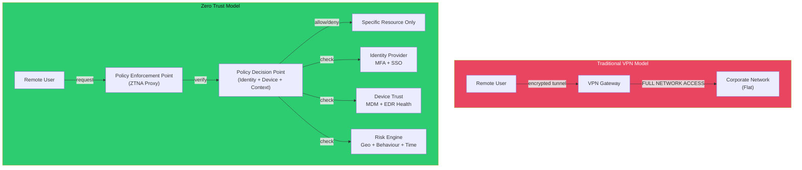

# 🔒 VPN and Zero Trust

> [!abstract] TL;DR
> Traditional VPNs (IPsec IKEv2, SSL/TLS) create encrypted tunnels that extend the corporate network perimeter to remote users — but once inside, lateral movement is trivial. Zero Trust replaces implicit perimeter trust with continuous verification: never trust, always verify, least-privilege access. WireGuard (Noise protocol, ChaCha20-Poly1305/Curve25519) is the modern VPN alternative: 4,000 lines of code vs. IPsec's 400,000, kernel-integrated, with superior performance. ZTNA, BeyondCorp, SDP, and SASE are the architectural patterns implementing Zero Trust at enterprise scale.

---

## Intuition — Analogy First

A traditional VPN is like a tunnel from your hotel room to the office building. Once you're in the tunnel, you're "on-premises" — you can walk anywhere in the building. If an attacker compromises your laptop, they walk anywhere too. The lateral movement problem is fundamental: the tunnel creates equivalence between "authenticated" and "trusted to do anything."

Zero Trust abolishes the tunnel analogy entirely. Instead, imagine the building issues a unique, scoped badge for every room you need to enter, re-verified biometrically every time you badge in. Even if someone clones your laptop, they can only access what your badge covers — and only if the continuous risk engine (device health, time of day, location anomaly) approves each request. This is BeyondCorp: Google's implementation that proved Zero Trust works at hyperscale.

---

## How It Works



---

## Key Concepts / Details

### IPsec — The Traditional Standard

IPsec operates at Layer 3 and has two modes:

| Mode | Description | Use Case |
|------|-------------|---------|
| **Tunnel mode** | Entire original packet encrypted + new IP header added | Site-to-site VPN, remote access |
| **Transport mode** | Only payload encrypted, original IP header preserved | Host-to-host communication |

**IKEv2** (Internet Key Exchange v2) manages key negotiation:
1. IKE_SA_INIT: Negotiate crypto algorithms, Diffie-Hellman exchange
2. IKE_AUTH: Authenticate peers (certificates or PSK), establish CHILD_SA
3. CREATE_CHILD_SA: Establish IPsec SAs for actual data

**IPsec protocols**:
- **ESP** (Encapsulating Security Payload, Protocol 50): Confidentiality + Integrity + Optional authentication — the standard choice
- **AH** (Authentication Header, Protocol 51): Integrity + authentication only, no encryption — rarely used today

Typical cipher suite: `AES-256-GCM + SHA-384 + ECP384 (ECDH P-384)`

### WireGuard — Modern VPN

WireGuard uses the **Noise Protocol Framework** with a fixed, modern cryptographic profile:

| Component | Algorithm |
|-----------|----------|
| Key exchange | Curve25519 (ECDH) |
| Symmetric encryption | ChaCha20-Poly1305 (AEAD) |
| Hashing | BLAKE2s |
| Handshake MAC | SipHash24 |

**Key properties**:
- ~4,000 lines of kernel code (vs. OpenVPN ~400,000, IPsec implementation ~400,000)
- Static public keys (like SSH) — no PKI required
- Roaming-friendly: connection migrates seamlessly between IP changes (mobile networks)
- No negotiation — one fixed modern cipher suite eliminates downgrade attacks

```bash
# WireGuard server configuration
[Interface]
PrivateKey = <server_private_key>
Address = 10.0.0.1/24
ListenPort = 51820

[Peer]
PublicKey = <client_public_key>
AllowedIPs = 10.0.0.2/32  # This client's VPN IP only

# WireGuard client configuration
[Interface]
PrivateKey = <client_private_key>
Address = 10.0.0.2/24

[Peer]
PublicKey = <server_public_key>
Endpoint = vpn.company.com:51820
AllowedIPs = 0.0.0.0/0  # Route all traffic through VPN
```

### Zero Trust Architecture — Principles

The NIST SP 800-207 Zero Trust principles:
1. All resources are accessed through secure channels regardless of location
2. Access is granted per-session based on dynamic policy (identity + device + context)
3. All assets, infrastructure, and communications are monitored and validated continuously
4. Network location (internal/external) is not sufficient for trust

### BeyondCorp — Google's Zero Trust Implementation

Google published BeyondCorp architecture after their 2010 "Operation Aurora" breach (APT41, CVE-2010-0249). Key components:
- **Access Proxy**: All applications fronted by an HTTP proxy; direct internal access blocked
- **Device Inventory**: Every device registered with certificates, MDM-managed
- **User Database**: Identity provider with MFA
- **Trust Inference Engine**: Real-time risk scoring from device health, location, behaviour
- **Access Control Engine**: Per-request policy evaluation

Result: Employees work from untrusted networks (cafes, home) with the same security posture as on-campus — the network perimeter is irrelevant.

### ZTNA vs Traditional VPN

| Feature | Traditional VPN | ZTNA |
|---------|----------------|------|
| Access scope | Full network | Per-application |
| Trust model | Implicit after auth | Continuous verification |
| Lateral movement risk | High | Minimal |
| Device health check | Point-in-time | Continuous |
| Application visibility | No | Yes (app-level access logs) |
| User experience | VPN client lag | Browser-native / transparent |

### SASE — Secure Access Service Edge

Gartner-defined architecture (2019) combining:
- SD-WAN (software-defined WAN)
- ZTNA (Zero Trust Network Access)
- CASB (Cloud Access Security Broker)
- SWG (Secure Web Gateway)
- FWaaS (Firewall as a Service)

All delivered as a cloud service, eliminating backhauling traffic to corporate DCs. Major vendors: Zscaler, Netskope, Cloudflare One, Palo Alto Prisma SASE.

### SDP — Software-Defined Perimeter

CSA (Cloud Security Alliance) SDP architecture:
1. Client authenticates to SDP Controller before any application access
2. Controller validates identity + device + context
3. Controller instructs SDP Gateway to open firewall rule specifically for this client-IP to this service-IP:port
4. Client connects directly to gateway (no need to know server IP beforehand)

"Dark cloud" principle: application servers have no publicly routable open ports — they're invisible until the controller authorises a connection.

---

## Real-World Notes

- Tailscale (built on WireGuard) enables zero-config mesh VPN across devices; uses coordination server for key distribution but all traffic is peer-to-peer WireGuard
- Split-tunnel VPN (route only corporate traffic through VPN) vs. full-tunnel (all traffic) — full-tunnel prevents DNS exfiltration but increases VPN gateway load
- WireGuard's fixed cipher suite eliminates negotiation attacks but means you cannot use post-quantum algorithms yet without wrappers (e.g., `boringtun` with Kyber hybrid)
- Zero Trust adoption: post-SolarWinds (2020), US federal agencies mandated ZTNA per CISA/OMB M-22-09

---

## Common Pitfalls

1. **VPN split tunnel without DNS control** — Split-tunnel that sends DNS queries through local resolver allows DNS-based data exfiltration even with VPN active
2. **IPsec with weak PSK** — Pre-shared keys in IPsec are susceptible to offline brute-force if captured during IKE; use certificate-based authentication
3. **Zero Trust without MDM** — ZTNA requires device health signals; if endpoint MDM enrollment is optional, device-based controls are bypassable
4. **Treating ZTNA as a firewall replacement** — ZTNA is an access control plane, not a network security control; still need IPS/EDR at endpoints

---

## Related Concepts

- [[Firewalls_and_IDS_IPS|← Firewalls & IDS/IPS]] — perimeter firewalls being replaced by ZTNA
- [[TLS_and_SSL|→ TLS & SSL]] — WireGuard and ZTNA proxies use TLS for web-facing components
- [[Symmetric_Encryption|→ Symmetric Encryption]] — ChaCha20-Poly1305 used in WireGuard
- [[_MOC_Network_Security|↑ Network Security MOC]]

---

## Review Questions

1. A WireGuard peer's `AllowedIPs` is set to `0.0.0.0/0`. Explain what this means for routing and why a "kill switch" (`PostDown` firewall rule) is critical for privacy.
2. Compare IKEv2/IPsec and WireGuard on: key management complexity, audit-ability, post-quantum readiness, and mobile roaming support.
3. An organisation moves from traditional VPN to ZTNA. An attacker compromises a contractor's device via a phishing email. What prevents lateral movement in the ZTNA model, and what residual risk remains?

---

## Sources

- WireGuard Technical Whitepaper: https://www.wireguard.com/papers/wireguard.pdf
- NIST SP 800-207 Zero Trust Architecture: https://csrc.nist.gov/publications/detail/sp/800/207/final
- BeyondCorp Paper: https://research.google/pubs/pub43231/

#Cybersecurity #NetworkSecurity #VPN #ZeroTrust #WireGuard #IPsec #ZTNA
