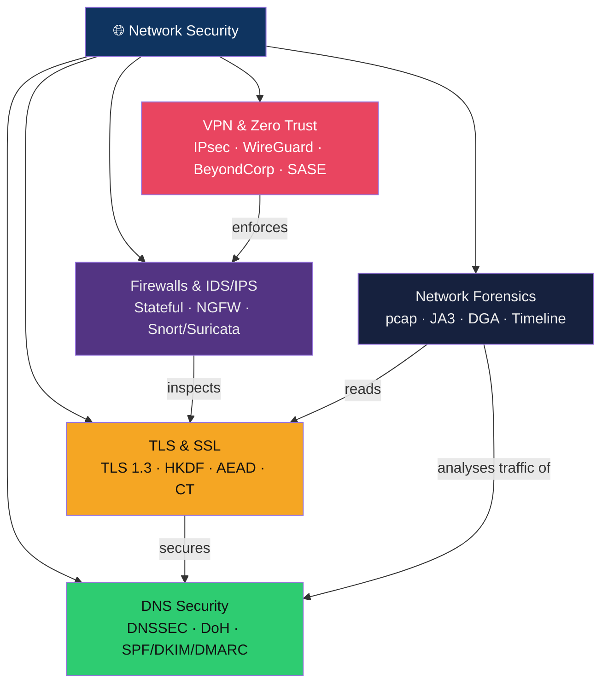

# 🌐 Network Security — Map of Content

> [!abstract] Section Overview
> Network security encompasses the technologies and practices that control traffic flow, encrypt communications, and detect malicious behaviour on networks. This section covers: stateful firewalls and NGFW inspection, IDS/IPS rule writing and base-rate fallacy, IPsec/WireGuard VPNs and Zero Trust architecture, the TLS 1.3 handshake and its security properties, DNS hardening with DNSSEC/DoH/SPF/DKIM/DMARC, and network forensics using pcap analysis, JA3 fingerprinting, and DGA detection.

---

## Concept Map

---

## Notes in This Section

| Note | Core Concept | Key Tools/Specs | Difficulty |
|------|-------------|-----------------|------------|
| [[Firewalls_and_IDS_IPS]] | Packet filtering to NGFW, IDS/IPS rules | iptables, Snort, Suricata, Zeek | Intermediate |
| [[VPN_and_Zero_Trust]] | IPsec/WireGuard tunnels, ZTNA, SASE | IKEv2, WireGuard, BeyondCorp, SDP | Intermediate |
| [[TLS_and_SSL]] | TLS 1.3 handshake and record layer | TLS 1.3, HKDF, AEAD, OCSP Stapling, CT | Intermediate–Advanced |
| [[DNS_Security]] | DNSSEC chain of trust, email auth | DNSSEC, DoH/DoT, RPZ, SPF, DMARC | Intermediate |
| [[Network_Forensics]] | Packet capture analysis, traffic reconstruction | Wireshark, tshark, JA3, NetFlow | Intermediate–Advanced |

---

## Learning Path

1. [[Firewalls_and_IDS_IPS]] — understand how traffic is filtered and detected
2. [[TLS_and_SSL]] — understand how traffic is encrypted
3. [[DNS_Security]] — understand how names are resolved and how to abuse/protect DNS
4. [[VPN_and_Zero_Trust]] — understand how to secure communications and access
5. [[Network_Forensics]] — understand how to reconstruct what happened

---

## Key Questions

1. Why does a 99% accurate IDS still produce ~91% false positives in a typical enterprise environment?
2. What fundamental security property does TLS 1.3 provide that TLS 1.2 with ECDHE does not guarantee by default?
3. Why does a split-horizon DNS configuration create a security risk?
4. How does WireGuard's cryptographic model differ from IPsec, and what are the operational tradeoffs?
5. What is JA3 fingerprinting and why does it matter for detecting C2 traffic?

---

## Related Sections

- [[01_Security_Foundations/_MOC_Security_Foundations|← Security Foundations]] — threat models, CVE/CWE context
- [[03_Web_Security/_MOC_Web_Security|→ Web Security]] — web traffic runs over the network stack
- [[04_Applied_Cryptography/_MOC_Applied_Cryptography|→ Applied Cryptography]] — cryptographic primitives underlying TLS and VPNs
- [[06_Digital_Forensics_IR/_MOC_DFIR|→ DFIR]] — network forensics feeds incident response
- [[_MOC_Cybersecurity_Master|↑ Master MOC]]

#Cybersecurity #NetworkSecurity #MOC
