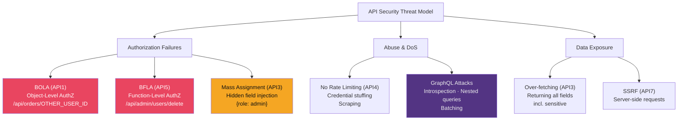

# 🔌 API Security

> [!abstract] TL;DR
> APIs are the dominant attack surface in modern applications. OWASP API Top 10 (2023) identifies: BOLA/API1 (Broken Object-Level Authorization — object IDOR), Broken Authentication/API2, Broken Object Property Level Authorization/API3 (mass assignment + over-exposure), Unrestricted Resource Consumption/API4 (rate limiting), BFLA/API5 (function-level privilege escalation), Unrestricted Access to Sensitive Business Flows/API6, SSRF/API7, Security Misconfiguration/API8, Improper Inventory/API9, Unsafe API Consumption/API10. GraphQL-specific risks include introspection disclosure, nested-query DoS (depth/complexity), and batching attacks. Rate limiting + pagination + request complexity limits are critical defensive controls.

---

## Intuition — Analogy First

APIs are vending machines that expose internal system functions. A traditional web app's UI limits what buttons users can press; an API exposes all the buttons and trusts callers to only press the ones they're supposed to. BOLA is pressing another user's button by changing the ID parameter. BFLA is pressing a button labelled "admin functions" that the UI never shows you but the API doesn't actually restrict. Mass assignment is passing extra fields the API wasn't designed to accept but the ORM blindly updates anyway.

The shift to microservices and mobile apps means API security is now more critical than traditional web app security — mobile apps communicate almost entirely via APIs, and backend-to-backend calls often have weaker authentication than user-facing interfaces.

---

## How It Works



---

## Key Concepts / Details

### BOLA — Broken Object-Level Authorization (API1)

The most common API vulnerability. Server fetches objects by ID without verifying the requesting user owns them:

```http
GET /api/v1/orders/10293  HTTP/1.1
Authorization: Bearer <user_A_token>

# Change 10293 to 10294 (user B's order)
GET /api/v1/orders/10294  HTTP/1.1
Authorization: Bearer <user_A_token>  ← still user A's token
# Response: 200 OK with user B's order data
```

**Fix — scoped queries**:
```python
# BAD: fetch by ID only
order = Order.query.get(order_id)

# GOOD: scope to authenticated user
order = Order.query.filter_by(
    id=order_id,
    user_id=current_user.id  # Always filter by authenticated user
).first_or_404()
```

Always authorise at the data layer, not just the endpoint layer.

### BFLA — Broken Function-Level Authorization (API5)

IDOR on function-level: users call administrative API endpoints they shouldn't have access to:

```http
# Normal user calls admin endpoint
DELETE /api/admin/users/5678  HTTP/1.1
Authorization: Bearer <normal_user_token>
# Response: 200 OK ← API doesn't check if user has admin role

# Or: HTTP method escalation
POST /api/orders/1234/status  → 403 Forbidden (user can't change status)
PUT /api/orders/1234/status   → 200 OK (server only restricts POST, not PUT)
```

**Fix**: Role-based access control at every endpoint:
```python
from functools import wraps

def require_role(role):
    def decorator(f):
        @wraps(f)
        def decorated(*args, **kwargs):
            if current_user.role != role:
                return {"error": "Forbidden"}, 403
            return f(*args, **kwargs)
        return decorated
    return decorator

@app.route('/api/admin/users/<int:user_id>', methods=['DELETE'])
@require_role('admin')
def delete_user(user_id):
    ...
```

### Mass Assignment — Hidden Field Injection

ORMs that bind request body directly to model attributes allow attackers to set unexpected fields:

```javascript
// Node.js/Express vulnerable pattern
app.put('/api/users/:id', (req, res) => {
    User.findByIdAndUpdate(req.params.id, req.body)  // Updates ALL fields from body!
});

// Attack: include privileged fields
PUT /api/users/1234
{"name": "John", "role": "admin", "email_verified": true, "credits": 99999}
```

**Fix**: Explicit allow-list of updatable fields:
```javascript
// Whitelist approach
const allowedFields = ['name', 'email', 'bio'];
const filteredUpdate = Object.fromEntries(
    Object.entries(req.body).filter(([key]) => allowedFields.includes(key))
);
User.findByIdAndUpdate(req.params.id, filteredUpdate);
```

In frameworks: use `strong_parameters` (Rails), `@RequestBody` with DTO (Spring), or Pydantic models (FastAPI) with explicit field declarations.

### Rate Limiting — Missing (API4)

Without rate limiting, APIs are vulnerable to:
- **Credential stuffing**: automated login with breached credential lists
- **Account enumeration**: different responses for valid/invalid usernames
- **Resource abuse**: heavy computation endpoints called indefinitely

```nginx
# Nginx rate limiting
limit_req_zone $binary_remote_addr zone=api:10m rate=100r/m;
limit_req_zone $binary_remote_addr zone=login:10m rate=5r/m;

location /api/v1/login {
    limit_req zone=login burst=10 nodelay;
    proxy_pass http://backend;
}

location /api/v1/ {
    limit_req zone=api burst=200;
    proxy_pass http://backend;
}
```

Application-level rate limiting with Redis:
```python
from redis import Redis
from flask import request, jsonify

redis_client = Redis()

def rate_limit(key_prefix, limit, window_seconds):
    key = f"{key_prefix}:{request.remote_addr}"
    count = redis_client.incr(key)
    if count == 1:
        redis_client.expire(key, window_seconds)
    if count > limit:
        return jsonify({"error": "Rate limit exceeded"}), 429
```

### GraphQL-Specific Attacks

**Introspection disclosure** (API8 misconfiguration):
```graphql
# Query all types and fields (exposes entire API schema)
{ __schema { types { name fields { name type { name } } } } }
```
Fix: disable introspection in production: `schema = make_executable_schema(..., introspection=False)`.

**Nested query DoS** (depth amplification):
```graphql
# Each level multiplies DB queries
{
  users {
    posts {
      comments {
        author {
          posts {
            comments { ... }
          }
        }
      }
    }
  }
}
```

Depth limiting:
```python
# graphene-django: depth limiting middleware
from graphene_django.views import GraphQLView
from graphql_depth_limit import depth_limit_middleware

schema = graphene.Schema(query=Query)
view = GraphQLView.as_view(
    schema=schema,
    middleware=[depth_limit_middleware(max_depth=5)]
)
```

**Query complexity limiting**:
```python
# Assign costs to fields; reject if total > threshold
QUERY_COST_LIMIT = 1000
# users = 10, posts = 5, comments = 3 per field
# Deep nested query cost: 10 × 5 × 3 × ... = exponential
```

**Batching attacks** (bypass rate limiting):
```json
[
  {"query": "mutation { login(username: \"admin\", password: \"pass1\") }"},
  {"query": "mutation { login(username: \"admin\", password: \"pass2\") }"},
  ...100 login attempts in one HTTP request...
]
```
Fix: rate limit by operation count in batch, not HTTP request count.

### API Security Best Practices

```yaml
# API Security Checklist
Authentication:
  - Use OAuth 2.0 + PKCE for user-facing APIs
  - Rotate API keys on compromise; support key revocation
  - Short-lived JWTs (15–60 min) + refresh token rotation

Authorization:
  - BOLA: scope all DB queries to authenticated user context
  - BFLA: role check at every endpoint, not just UI
  - Mass assignment: explicit allowlist for writable fields

Rate Limiting:
  - Per-user and per-IP rate limits
  - Separate limits for authentication endpoints (stricter)
  - GraphQL: depth + complexity + operation count limits

Data Exposure:
  - Return only required fields (not entire ORM objects)
  - Sensitive fields (password hash, internal IDs) never in responses
  - Pagination mandatory for list endpoints

Monitoring:
  - Log all API calls with auth context
  - Alert on unusual patterns: high 403/401 rates, scraping signatures
  - API gateway with threat detection (AWS WAF, Cloudflare)
```

---

## Real-World Notes

- Peloton API (2021): unauthenticated BOLA allowed reading any user's workout data and profile; fixed after 90-day disclosure
- Twitter API (2022): email/phone lookup API had no rate limiting, allowing enumeration of 5.4M user accounts
- USPS API (2018): unauthenticated endpoint exposed 60M user profiles via BOLA; open for 1 year before disclosure
- GraphQL "Batching DoS" has affected GitHub, Shopify — now standard in their bug bounty programmes

---

## Common Pitfalls

1. **Object ID as sole authorisation check** — UUID IDs prevent enumeration but not BOLA; authorisation check is still required even with UUIDs
2. **Rate limiting only at the gateway** — Application-level rate limits needed for business logic (e.g., coupon application, password reset)
3. **GraphQL introspection in production** — Entire schema exposed helps attackers enumerate targets; always disable in production
4. **Pagination without total count limits** — `?page=1&limit=99999` bypasses pagination; enforce server-side maximum page size

---

## Related Concepts

- [[JWT_and_OAuth|← JWT & OAuth]] — API authentication tokens
- [[OWASP_Top_10|← OWASP Top 10]] — SSRF, Misconfiguration, Injection overlap
- [[SQL_and_NoSQL_Injection|← SQL Injection]] — GraphQL injection into database queries
- [[_MOC_Web_Security|↑ Web Security MOC]]

---

## Review Questions

1. An API endpoint `GET /api/invoices/{invoice_id}` is authenticated via Bearer token. Describe the test methodology to determine if it's vulnerable to BOLA, the attack payload, and the SQL-level fix.
2. A Django REST Framework API uses `ModelSerializer` with `fields = '__all__'`. A `User` model has fields: name, email, password (hashed), is_admin, stripe_customer_id. Identify the security issues and provide a corrected serializer.
3. Design a rate limiting strategy for a GraphQL API that handles authentication mutations, heavy data queries, and bulk operations. What metrics do you limit on, and what limits?

---

## Sources

- OWASP API Security Top 10 2023: https://owasp.org/API-Security/
- GraphQL Security: https://cheatsheetseries.owasp.org/cheatsheets/GraphQL_Cheat_Sheet.html
- Peloton API Disclosure: https://jan.newmarch.name/Security/Peloton/

#Cybersecurity #WebSecurity #API #BOLA #BFLA #GraphQL #RateLimiting
