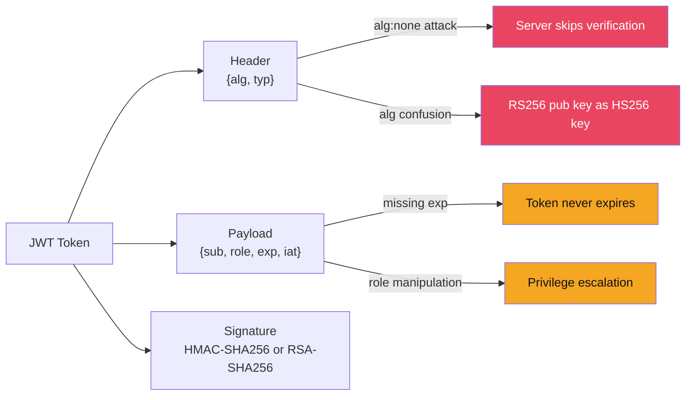
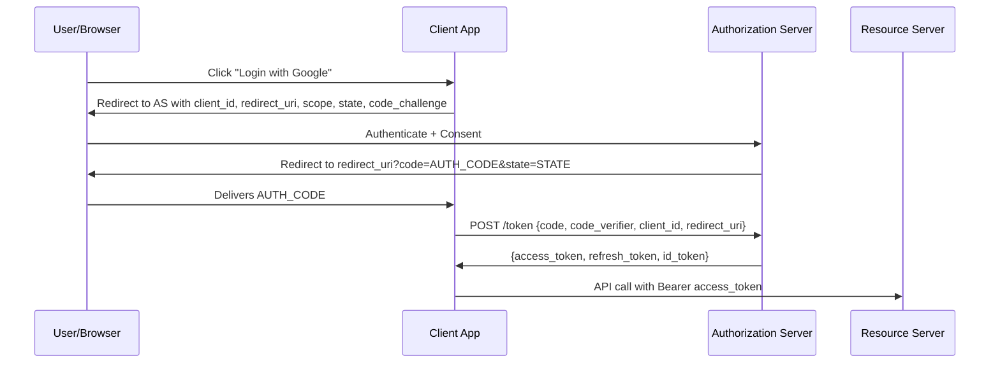

# 🔑 JWT and OAuth 2.0

> [!abstract] TL;DR
> JWTs (JSON Web Tokens) carry claims in three Base64URL-encoded parts: header.payload.signature. Critical vulnerabilities: `alg:none` attack (server accepts unsigned token if it trusts the header's algorithm field), RS256→HS256 key confusion (attacker signs with RS256 public key as HMAC-SHA256 key), and expiry bypass (no expiry validation). OAuth 2.0 with Authorization Code + PKCE is the secure flow; common misconfigs include redirect_uri bypass (open redirect), implicit flow token leakage, PKCE downgrade attacks, and missing state parameter (CSRF). Never store JWTs in `localStorage` (XSS risk); use `HttpOnly` + `SameSite=Strict` cookies.

---

## Intuition — Analogy First

A JWT is like a signed passport: it contains claims about who you are (the payload), and a stamp from the issuing authority (the signature) that proves authenticity. Anyone can read the passport (Base64URL is not encryption), but only the authority's signature key can create or verify it.

The `alg:none` attack is like a passport that has a field saying "signature type: none — just trust this." A poorly coded passport checker that reads that field and skips verification would accept forged passports. OAuth is the delegation protocol: it's the difference between giving someone your house key (sharing credentials) versus giving them a temporary door code (access token) for specific rooms (scopes) for a limited time.

---

## How It Works

### JWT Structure

```
eyJhbGciOiJSUzI1NiIsInR5cCI6IkpXVCJ9.eyJzdWIiOiIxMjM0Iiwicm9sZSI6InVzZXIiLCJleHAiOjE3NTM1MTI4MDB9.signature

Header (Base64URL decoded):
{"alg": "RS256", "typ": "JWT"}

Payload (Base64URL decoded):
{"sub": "1234", "role": "user", "exp": 1753512800}

Signature:
RSA-SHA256(base64url(header) + "." + base64url(payload), privateKey)
```



---

## Key Concepts / Details

### JWT Attack 1: `alg:none`

The JWT spec originally allowed `"alg": "none"`, producing an unsigned token (header.payload. — empty signature). Some libraries accepted this if they didn't explicitly reject the `none` algorithm:

```python
# Attack: modify payload to escalate privileges, set alg to none
import base64, json

header = base64.urlsafe_b64encode(b'{"alg":"none","typ":"JWT"}').rstrip(b'=')
payload = base64.urlsafe_b64encode(b'{"sub":"1234","role":"admin","exp":9999999999}').rstrip(b'=')
forged_token = header.decode() + "." + payload.decode() + "."

# If server uses: jwt.decode(token, verify=False) ← vulnerable!
# Or: algorithm=["RS256", "none"] ← vulnerable!
```

Fix: Explicitly specify allowed algorithms and reject `none`:
```python
# Python PyJWT
jwt.decode(token, public_key, algorithms=["RS256"])  # Whitelist only
# Never: algorithms=["RS256", "none"]
```

### JWT Attack 2: Algorithm Confusion (RS256 → HS256)

RS256 = RSA signature (asymmetric: sign with private key, verify with public key).
HS256 = HMAC-SHA256 (symmetric: same key for sign and verify).

Vulnerability: if the server accepts both HS256 and RS256, and the server uses the RS256 public key as the HMAC-SHA256 key for verification:

```python
# Attacker obtains the server's RS256 public key (often publicly accessible)
# Attacker signs token using HMAC-SHA256 with the PUBLIC KEY as the secret
# Server verifies: "algorithm is HS256, secret = public key → matches!"

import jwt
with open("public_key.pem", "rb") as f:
    public_key = f.read()

forged_token = jwt.encode(
    {"sub": "1234", "role": "admin"},
    public_key,  # Using public key as HS256 secret
    algorithm="HS256"
)
```

Fix: Never accept both HS256 and RS256 on the same endpoint. Algorithm must be determined by server configuration, not by the token header.

### JWT Attack 3: Missing Expiry

JWTs without `exp` claim (or without validating `exp`) never expire. Stolen tokens remain valid indefinitely.

```python
# Verify expiry explicitly
payload = jwt.decode(token, public_key, algorithms=["RS256"],
                     options={"verify_exp": True})  # Default True in PyJWT ≥2.0
```

### JWT Storage: localStorage vs Cookies

| Storage | XSS Access | CSRF Risk | HttpOnly | Recommendation |
|---------|-----------|-----------|----------|----------------|
| `localStorage` | Yes (JavaScript) | No | N/A | Never for auth tokens |
| `sessionStorage` | Yes (JavaScript) | No | N/A | Never for auth tokens |
| Cookie (default) | If no HttpOnly | Yes | Optional | Use HttpOnly + SameSite=Strict |
| Cookie (HttpOnly + SameSite=Strict) | No | No | Yes | Recommended |

```http
Set-Cookie: jwt=<token>; HttpOnly; Secure; SameSite=Strict; Path=/; Max-Age=3600
```

### OAuth 2.0 — Authorization Code Flow + PKCE

The secure OAuth flow for user-facing applications:



**PKCE (Proof Key for Code Exchange)** prevents authorization code interception:
```
code_verifier = random 43-128 char string (high entropy)
code_challenge = base64url(SHA256(code_verifier))

Step 1: Send code_challenge with /authorize request
Step 2: Send code_verifier with /token request
Server verifies: SHA256(code_verifier) == stored code_challenge
```

Even if the authorization code is intercepted, the attacker cannot exchange it without the `code_verifier`.

### OAuth Vulnerabilities

**redirect_uri bypass** (open redirect attack):
```
/authorize?client_id=APP&redirect_uri=https://evil.com&response_type=code
```
If the server allows any redirect_uri or uses prefix matching: `redirect_uri=https://app.com.evil.com`.
Fix: exact match validation of redirect_uri against pre-registered URIs.

**Missing `state` parameter** (CSRF on OAuth):
```
# Attacker initiates OAuth and captures the redirect URL before completing login
# Victim clicks attacker's auth URL → victim's account linked to attacker's identity
```
Fix: `state` parameter should be a random nonce, tied to session, verified on callback.

**Implicit flow** (deprecated): access token delivered in URL fragment → leaks in browser history, Referer headers, server logs. Use Authorization Code + PKCE instead.

**PKCE downgrade attack**: if server accepts `code_challenge_method=plain` (instead of S256), the challenge is just the verifier, removing the security property of hashing.
Fix: only accept `S256`.

---

## Real-World Notes

- CVE-2022-21449 "Psychic Signatures" (Java < 17.0.3): ECDSA signature verification bug accepted empty signature for any payload — effectively `alg:none` via cryptographic flaw
- Auth0 and Okta have both had JWT algorithm confusion vulnerabilities in their libraries (2017–2018)
- HackerOne bug bounty top earner 2021: OAuth redirect_uri bypass chains chained with account takeover, paying $100,000+
- Google's BeyondCorp uses short-lived JWTs (15 minutes) with device-context claims, requiring frequent re-issuance

---

## Common Pitfalls

1. **Storing tokens in localStorage** — Any XSS on any page in the application steals all tokens from localStorage permanently
2. **Accepting all algorithms** — `algorithms=["*"]` or not specifying algorithms allows all attacks above
3. **Not rotating refresh tokens** — Refresh tokens stolen via XSS or database breach allow indefinite access if not rotated on each use
4. **Implicit flow in SPAs** — Modern SPAs should use Authorization Code + PKCE; implicit flow was deprecated in OAuth 2.1

---

## Related Concepts

- [[API_Security|→ API Security]] — JWT tokens secure API endpoints
- [[XSS_and_CSRF|← XSS & CSRF]] — XSS steals localStorage tokens; CSRF exploits cookie-based auth
- [[Asymmetric_Cryptography_and_PKI|→ Asymmetric Crypto]] — RS256 signature mechanism
- [[_MOC_Web_Security|↑ Web Security MOC]]

---

## Review Questions

1. A JWT has header `{"alg":"HS256"}` and is verified server-side using the RSA public key as the HMAC secret. Explain the key confusion attack, including why the public key is obtainable by the attacker, and the fix.
2. Implement PKCE in Python: generate a code_verifier, compute the code_challenge, and verify them on the token endpoint. Why does S256 provide security that plain does not?
3. An OAuth application accepts redirect_uri as a prefix match: any URI starting with `https://app.com` is accepted. Describe the attack to steal authorization codes, and fix the validation.

---

## Sources

- JWT Attacks: https://portswigger.net/web-security/jwt
- OAuth 2.0 Security Best Practices: https://datatracker.ietf.org/doc/html/rfc9700
- PKCE RFC 7636: https://datatracker.ietf.org/doc/html/rfc7636

#Cybersecurity #WebSecurity #JWT #OAuth #PKCE #Authentication
