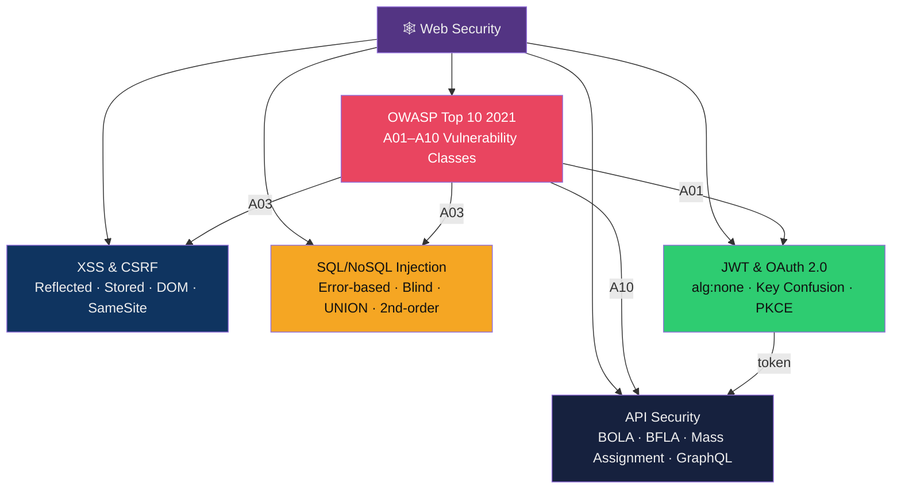

# 🕸️ Web Security — Map of Content

> [!abstract] Section Overview
> Web security addresses vulnerabilities in web applications, APIs, and browser-server interactions. This section covers the OWASP Top 10 2021 (A01 Broken Access Control to A10 SSRF), client-side attacks (XSS variants, CSRF with SameSite mitigations), server-side injection (SQL/NoSQL/GraphQL injection), authentication vulnerabilities (JWT attacks, OAuth misconfigurations), and modern API security issues (BOLA/BFLA, mass assignment, rate limiting, GraphQL complexity attacks).

---

## Concept Map

---

## Notes in This Section

| Note | Core Concept | CVEs / Tools | Difficulty |
|------|-------------|-------------|------------|
| [[OWASP_Top_10]] | Top 10 web vulnerability classes | Log4Shell CVE-2021-44228, SolarWinds deserialization | Intermediate |
| [[XSS_and_CSRF]] | Client-side injection and CSRF | DOMPurify, CSP, SameSite | Intermediate |
| [[SQL_and_NoSQL_Injection]] | Server-side injection attacks | sqlmap, Burp Suite, MongoDB $where | Intermediate |
| [[JWT_and_OAuth]] | Token security and OAuth flows | alg:none, PKCE, redirect_uri bypass | Intermediate–Advanced |
| [[API_Security]] | REST/GraphQL API attacks | BOLA, BFLA, mass assignment, introspection | Intermediate–Advanced |

---

## Learning Path

1. [[OWASP_Top_10]] — understand the threat landscape and category taxonomy
2. [[SQL_and_NoSQL_Injection]] — master server-side injection (still #1 attack category)
3. [[XSS_and_CSRF]] — master client-side injection and cross-site request forgery
4. [[JWT_and_OAuth]] — understand modern authentication vulnerabilities
5. [[API_Security]] — apply injection + AuthN knowledge to modern API architectures

---

## Key Questions

1. Why is Broken Access Control (A01) ranked above Injection (A03) in OWASP 2021, despite injection being more technically sophisticated?
2. How does stored XSS differ from reflected XSS in terms of delivery mechanism and impact?
3. What makes parameterized queries a real fix for SQL injection while ORM usage alone is not?
4. What is the `alg:none` attack against JWT, and why does it exist by design in the JWT specification?
5. Distinguish BOLA (Broken Object-Level Authorization) from BFLA (Broken Function-Level Authorization) with concrete examples.

---

## Related Sections

- [[02_Network_Security/_MOC_Network_Security|← Network Security]] — web traffic flows over TLS, DNS
- [[04_Applied_Cryptography/_MOC_Applied_Cryptography|→ Applied Cryptography]] — JWT cryptography, TLS for web security
- [[05_Penetration_Testing/_MOC_Penetration_Testing|→ Penetration Testing]] — web attack techniques in pentest context
- [[_MOC_Cybersecurity_Master|↑ Master MOC]]

#Cybersecurity #WebSecurity #MOC
