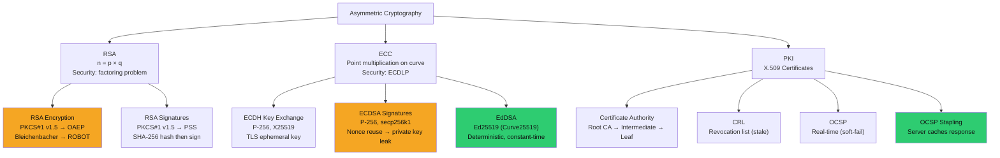

# 🔐 Asymmetric Cryptography and PKI

> [!abstract] TL;DR
> Asymmetric cryptography uses mathematically-linked key pairs: the public key can be freely shared, the private key must stay secret. RSA security relies on the difficulty of factoring n=p×q; PKCS#1 v1.5 padding is vulnerable to Bleichenbacher's adaptive chosen-ciphertext attack (ROBOT CVE-2017-13099) — use OAEP. ECC achieves equivalent security with much smaller keys: P-256 ≈ RSA-3072; Curve25519/Ed25519 resist side-channels via constant-time arithmetic. Nonce reuse in ECDSA recovers the private key (PS3 hack, Bitcoin thefts). X.509 certificates: SAN not CN, Basic Constraints CA:FALSE, chain validation. Revocation via CRL (stale) vs OCSP (real-time, soft-fail problem) vs OCSP stapling. HPKP deprecated due to bricking risk.

---

## Intuition — Analogy First

Asymmetric cryptography is a padlock system where anyone can lock (encrypt with your public key) but only you can unlock (decrypt with your private key). RSA's security comes from the mathematical difficulty of factoring large numbers: multiplying two 1024-bit primes takes microseconds, but finding those primes from their product would take longer than the age of the universe on classical computers.

ECC (Elliptic Curve Cryptography) replaces factoring with the discrete logarithm problem on elliptic curves — a fundamentally different hard problem. The reward: equivalent security to RSA at 1/10th the key size. Ed25519 signs in ~50μs and verifies in ~100μs with a 32-byte private key, compared to RSA-2048's 1,000–2,000μs signing time.

PKI is the trust infrastructure that binds public keys to identities. Without PKI, a man-in-the-middle can present their own public key claiming to be your bank. CAs (Certificate Authorities) solve this by signing certificates (identity + public key) with their own private key, which browsers trust because the CA's root certificate ships with the OS/browser.

---

## How It Works



---

## Key Concepts / Details

### RSA — Key Generation and Security

```python
# RSA key generation (conceptual)
p = large_prime()  # ~1024 bits for RSA-2048
q = large_prime()  # ~1024 bits
n = p * q          # 2048-bit modulus (public)
e = 65537          # Public exponent (standard choice)
d = mod_inverse(e, (p-1)*(q-1))  # Private exponent

# Encryption: C = M^e mod n
# Decryption: M = C^d mod n
# Signature: S = H(M)^d mod n
# Verification: H(M) == S^e mod n
```

Key sizes and equivalent security:
| RSA | ECC | Security Level |
|-----|-----|----------------|
| 1024-bit | 160-bit | 80-bit (broken, below 2030 minimum) |
| 2048-bit | 224-bit | 112-bit (current minimum) |
| 3072-bit | 256-bit | 128-bit (recommended) |
| 4096-bit | 384-bit | 192-bit |

**Bleichenbacher Attack (1998) — PKCS#1 v1.5**:
PKCS#1 v1.5 encryption padding: `0x00 0x02 [random bytes] 0x00 [message]`. If the server reveals whether decryption produced valid padding, an attacker can send crafted ciphertexts and use oracle responses to iteratively decrypt any ciphertext (~1 million queries for a 1024-bit RSA key).

**ROBOT (2017)**: Discovered that 1/3 of the Alexa top 100 websites were still vulnerable to Bleichenbacher-style attacks 19 years after the original disclosure. CVE-2017-13099 affected F5, Cisco, Citrix, Check Point products.

**Fix**: Use **OAEP** (Optimal Asymmetric Encryption Padding) — provably secure under IND-CCA2.

### ECC — Elliptic Curve Cryptography

ECC operates on curves of form `y² = x³ + ax + b (mod p)`. Point multiplication `Q = k × P` is easy; recovering `k` from `Q` and `P` is the Elliptic Curve Discrete Logarithm Problem (ECDLP).

**Common curves**:

| Curve | Equation | Security | Notes |
|-------|---------|---------|-------|
| P-256 (secp256r1) | NIST curve | 128-bit | TLS default, FIPS approved |
| P-384 (secp384r1) | NIST curve | 192-bit | NSA Suite B |
| secp256k1 | Bitcoin curve | 128-bit | Bitcoin, Ethereum |
| Curve25519 | Montgomery | 128-bit | WireGuard, TLS 1.3 ECDH |
| Ed25519 (EdDSA) | Edwards | 128-bit | SSH, Signal, TLS certs |

**Ed25519 advantages**:
- Deterministic signatures (no random nonce required — prevents nonce reuse attacks)
- Constant-time implementation by design (no timing side channels)
- 32-byte keys, 64-byte signatures
- ~50,000 signatures/second on modern hardware

**ECDSA nonce reuse catastrophe**:
```
If nonce k is reused for two signatures (r,s1) and (r,s2):
s1 = k^{-1}(H(m1) + r*d) mod n
s2 = k^{-1}(H(m2) + r*d) mod n
s1 - s2 = k^{-1}(H(m1) - H(m2))
k = (H(m1) - H(m2)) / (s1 - s2)   ← nonce recovered!
d = (s*k - H(m)) / r               ← private key recovered!
```

**Historical examples**: Sony PS3 (2010) — used constant k=1 for all ECDSA signatures → private key extracted, enabling pirated software signing. Multiple Bitcoin wallets (2012–2013) — broken random number generators reused nonces → private keys extracted, coins stolen.

**RFC 6979** defines deterministic ECDSA: k derived from private key and message hash (HMAC-DRBG), eliminating the nonce randomness requirement.

### X.509 Certificate Validation

Certificate validation steps (RFC 5280):

1. **Chain building**: Leaf → Intermediates → Root (trusted by OS/browser)
2. **Signature verification**: Each cert's signature verified with issuer's public key
3. **Validity period**: `notBefore` < now < `notAfter`
4. **Revocation**: CRL check or OCSP query
5. **Key Usage extension**: `Digital Signature` required for TLS server auth
6. **Extended Key Usage**: `Server Authentication (1.3.6.1.5.5.7.3.1)` required
7. **SAN matching**: hostname must match SAN (not CN — deprecated)
8. **Basic Constraints**: CA:FALSE for leaf certificates (prevents intermediate CA forgery)

```bash
# Inspect certificate details
openssl x509 -in cert.pem -text -noout | grep -A5 "Subject Alternative"
openssl x509 -in cert.pem -text -noout | grep "Basic Constraints"
openssl x509 -in cert.pem -text -noout | grep "Key Usage"

# Verify certificate chain
openssl verify -CAfile chain.pem -untrusted intermediate.pem leaf.pem

# Check OCSP status
openssl ocsp -issuer intermediate.pem -cert leaf.pem \
  -url "http://ocsp.ca.com" -text
```

**HPKP (HTTP Public Key Pinning)** — Deprecated (2019):
- Allowed websites to declare which public keys to trust
- Risk: misconfiguration or CA compromise → permanently bricks website access for all users with pinned old key
- Chrome removed support in 2018; use Expect-CT instead (CT log monitoring)

### Certificate Transparency (CT) and HSTS

**Certificate Transparency** (RFC 6962): All publicly-trusted certificates must be logged in CT logs (Google Argon, Cloudflare Nimbus, DigiCert Yeti). Browsers verify SCTs (Signed Certificate Timestamps) in TLS handshake or OCSP staple response.

CT enables:
- Detection of misissued certificates (domain owner receives alert)
- Subdomain discovery (all subdomains visible in CT logs via crt.sh)
- Accountability for CAs

**HSTS Preloading**: Sites can submit to Chrome/Firefox HSTS preload list — browser refuses HTTP connections forever, even on first visit (eliminates SSL stripping attack window).

---

## Real-World Notes

- DigiNotar (2011): CA compromised by Iranian hackers, issued fraudulent Google/CIA/Mossad certificates for MITM. Netherlands government used DigiNotar for all services — PKI trust collapse caused national infrastructure impact
- Let's Encrypt automated certificate issuance via ACME protocol made HTTPS free, driving adoption from 40% to 98% of web traffic (2014–2024)
- Apple enforced 398-day maximum certificate validity in 2020; forces more frequent rotation, reducing window for compromised certs
- Ed25519 adoption: GitHub (2021), OpenSSH since 6.5 (2014), Signal, TLS 1.3 with TLS_AES_128_GCM_SHA256 + X25519 key exchange

---

## Common Pitfalls

1. **Using PKCS#1 v1.5 for new systems** — Bleichenbacher/ROBOT attacks are well-understood; use OAEP for encryption, PSS for signatures
2. **ECDSA without RFC 6979** — Random nonce ECDSA in embedded systems with weak RNG = private key extraction; use Ed25519 or RFC 6979 deterministic ECDSA
3. **CN-based hostname matching** — Code that checks `cert.subject.CN == hostname` instead of SANs breaks for multi-SAN certs and is deprecated per RFC 2818
4. **Not stapling OCSP** — OCSP soft-fail (ignoring OCSP errors) defeats revocation; always enable OCSP stapling on web servers

---

## Related Concepts

- [[Symmetric_Encryption|← Symmetric Encryption]] — RSA/ECDH wraps symmetric session keys
- [[Hash_Functions_and_MACs|→ Hash Functions]] — RSA/ECDSA sign hash of message not message directly
- [[TLS_Protocol_Deep_Dive|→ TLS Protocol]] — X25519 key exchange + certificate authentication
- [[Post_Quantum_Cryptography|→ Post-Quantum Crypto]] — Shor's algorithm breaks RSA and ECC
- [[_MOC_Applied_Cryptography|↑ Applied Cryptography MOC]]

---

## Review Questions

1. A TLS server receives a PKCS#1 v1.5-encrypted premaster secret. How does Bleichenbacher's attack work, and how many oracle queries does it require to decrypt a 2048-bit RSA ciphertext?
2. A Bitcoin wallet application uses ECDSA with OpenSSL's random nonce generation on an embedded device with `/dev/urandom` not properly seeded at boot. Describe the attack to extract the private key.
3. You discover `Basic Constraints: CA:TRUE, pathLen=0` on a leaf certificate signed by DigiCert. What security implication does this have, and what would you do with this certificate as an attacker?

---

## Sources

- ROBOT Attack: https://robotattack.org/
- RFC 6979 Deterministic ECDSA: https://www.rfc-editor.org/rfc/rfc6979
- Certificate Transparency: https://certificate.transparency.dev/

#Cybersecurity #AppliedCryptography #RSA #ECC #PKI #X509 #Ed25519 #OCSP
