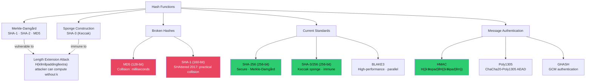

# #️⃣ Hash Functions and MACs

> [!abstract] TL;DR
> A cryptographic hash function maps arbitrary-length input to fixed-length output (digest), with three security properties: preimage resistance (~2ⁿ operations to find input given output), second-preimage resistance (~2ⁿ to find collision for a specific input), and collision resistance (~2^(n/2) by birthday attack). MD5 (128-bit) and SHA-1 (160-bit) are broken for collision resistance. SHA-2 family (SHA-256/SHA-384/SHA-512) are Merkle-Damgård constructions vulnerable to length extension attacks: H(k‖m) as MAC is broken. HMAC = H((k⊕opad)‖H((k⊕ipad)‖m)) fixes this. SHA-3 (Keccak sponge) is inherently immune to length extension. BLAKE3 is the modern high-performance choice. Never use raw hash for password storage — use KDFs (see [[Symmetric_Encryption]]).

---

## Intuition — Analogy First

A hash function is a fingerprinting machine: feed it any document, get a fixed-size fingerprint. Two different documents should never produce the same fingerprint (collision resistance). Knowing the fingerprint shouldn't let you reconstruct the document (preimage resistance). Changing even one bit in the document should change about half the fingerprint bits (avalanche effect).

The birthday paradox explains why collision resistance is harder than it seems: if you only need to find ANY two messages with the same hash (not a specific target), you only need ~2^(n/2) trials, not 2^n. For SHA-1 (160-bit), that's 2^80 operations — feasible with Google-scale compute. The SHAttered attack (2017) proved practical SHA-1 collision for the cost of ~$110,000 in GPU time.

HMAC adds a message authentication code to a hash: only someone with the secret key can produce or verify the MAC. Length extension attacks exploit the internal state of Merkle-Damgård hashes to append data to an authenticated message — HMAC's double-hash construction prevents this.

---

## How It Works



---

## Key Concepts / Details

### Security Properties

| Property | Definition | Security | Attack |
|----------|-----------|---------|--------|
| **Preimage resistance** | Given H(m), cannot find m | ~2^n | Brute force |
| **Second-preimage resistance** | Given m₁, cannot find m₂ where H(m₁)=H(m₂) | ~2^n | Brute force |
| **Collision resistance** | Cannot find any m₁≠m₂ with H(m₁)=H(m₂) | ~2^(n/2) | Birthday attack |

Implication: SHA-256 provides ~128-bit collision resistance (2^128 operations to find collision), not 256-bit — because of the birthday bound.

### MD5 and SHA-1 — Broken

**MD5 (128-bit)**:
- 2004: Wang et al. demonstrated collision attacks
- 2008: Researchers forged a CA certificate using MD5 collisions
- 2012: Flame malware (APT, suspected NSA/Israel) used rogue Microsoft certificate based on MD5 collision
- Practical collision: milliseconds on modern hardware

**SHA-1 (160-bit)**:
- 2017: SHAttered attack (Google/CWI) — first practical SHA-1 collision
- Cost: ~$110,000 of GPU compute (120 GPU-years)
- Produced two valid PDF files with identical SHA-1 hash but different content
- Chrome blocked SHA-1 certificates in 2017; all major browsers followed

**MD5 still appears in**: file integrity checks (non-security-critical), legacy system checksums, non-cryptographic fingerprinting. Context matters — MD5 for deduplication is fine; MD5 for digital signatures is catastrophically wrong.

### SHA-2 Family — Merkle-Damgård

SHA-2 is a family: SHA-224, SHA-256, SHA-384, SHA-512, SHA-512/224, SHA-512/256.

**SHA-256 internal structure**:
- Block size: 512 bits, digest size: 256 bits
- 64 rounds of ARX operations on 8 32-bit words (a-h)
- 64 round constants (first 32 bits of fractional parts of cube roots of first 64 primes)
- Padding: append 1-bit, then zeros, then message length as 64-bit big-endian

SHA-256 is secure and ubiquitous: TLS, HTTPS, Bitcoin, git (migrating from SHA-1), code signing.

### Length Extension Attack

**Vulnerability**: Merkle-Damgård hashes expose their internal state after processing a message. An attacker who knows H(m) can compute H(m ‖ padding ‖ extra) without knowing m.

```python
# Vulnerable MAC pattern: MAC = H(key || message)
mac = hashlib.sha256(secret_key + message).hexdigest()

# Attacker who knows mac, len(secret_key), message can extend:
# Compute H(secret_key || message || sha256_padding || extra_data)
# Without knowing secret_key!

# Python hashpumpy tool demonstrates this:
import hashpumpy
new_mac, new_data = hashpumpy.hashpump(
    known_mac,     # H(secret || message)
    known_message, # original message
    extra_data,    # data to append
    key_length     # length of key (guessable)
)
```

**Why HMAC is immune**:
```python
# HMAC construction
def hmac_sha256(key, message):
    if len(key) > 64: key = sha256(key)
    key = key.ljust(64, b'\x00')
    ipad = bytes(b ^ 0x36 for b in key)
    opad = bytes(b ^ 0x5c for b in key)
    inner = sha256(ipad + message)
    return sha256(opad + inner)
```
The outer hash (H(opad ‖ inner_hash)) prevents length extension — an attacker cannot compute H(opad ‖ new_extended_inner) without knowing the key.

**Immune constructions**: SHA-3 (Keccak sponge absorbs capacity bits that are never output), HMAC, BLAKE2/BLAKE3 (different design).

### SHA-3 / Keccak — Sponge Construction

SHA-3 uses a fundamentally different design: the **Keccak sponge**:

```
State: 1600-bit array (5×5×64 grid of 64-bit lanes)

Absorb phase:
  - XOR each block into the rate portion of state
  - Apply Keccak-f[1600] permutation (24 rounds of θ, ρ, π, χ, ι)
  - Repeat for all blocks

Squeeze phase:
  - Output rate portion of state
  - Apply permutation between output blocks if needed
```

Rate (r) + Capacity (c) = 1600 bits:
- SHA3-256: r=1088, c=512 → 256-bit digest, 256-bit security
- SHA3-512: r=576, c=1024 → 512-bit digest, 256-bit security
- SHAKE128/SHAKE256: variable-length output (XOF — Extendable Output Function)

Length extension immunity: the capacity bits (never output) are not accessible to an attacker.

### HMAC — Hash-based MAC

```python
import hmac, hashlib

key = b"secret_key_32_bytes_minimum____"  # ≥ block size preferred
message = b"transfer $100 to account 1234"

# HMAC-SHA256
mac = hmac.new(key, message, hashlib.sha256).hexdigest()

# Verify (constant-time comparison!)
def verify(key, message, expected_mac):
    computed = hmac.new(key, message, hashlib.sha256).digest()
    return hmac.compare_digest(computed, bytes.fromhex(expected_mac))

# NEVER use: computed_mac == expected_mac  ← timing attack!
# String comparison short-circuits → 'aaaa' vs 'aaab' takes longer than 'aaaa' vs 'bbbb'
# Attacker can byte-by-byte brute-force MAC via timing
```

### BLAKE3 — Modern High-Performance Hash

BLAKE3 (2020) properties:
- Based on BLAKE2 tree hashing + Bao content-addressed encryption
- Parallel: processes multiple chunks simultaneously using Merkle tree structure
- ~5× faster than SHA-256 on modern CPUs without hardware acceleration
- ~3 GB/s on a single core (vs SHA-256: ~600 MB/s)
- Keyed mode: `blake3.keyed_hash(key, message)` — replaces HMAC
- KDF mode: `blake3.derive_key(context, material)` — replaces HKDF
- Immune to length extension by design

---

## Real-World Notes

- Git migrating from SHA-1 to SHA-256 object IDs (SHA-256 git objects in progress 2024 — git objects format v3)
- NIST selected SHA-3 in 2012 as a backup to SHA-2 in case SHA-2 was broken; SHA-2 remains secure but SHA-3 provides algorithmic diversity
- Signal Protocol uses HMAC-SHA256 for message authentication in the Double Ratchet; BLAKE3 is increasingly adopted in newer protocols
- Password cracking with GPU: BLAKE3 hashed passwords crack at ~100 billion/sec (A100 GPU) — always use Argon2id, not any raw hash

---

## Common Pitfalls

1. **`H(key ‖ message)` as MAC** — Length extension attack; use HMAC or BLAKE3 keyed mode
2. **String equality for MAC comparison** — `==` is timing-vulnerable; use `hmac.compare_digest()` always
3. **MD5/SHA-1 for integrity in security context** — Tamper-evident file checksums, certificate fingerprints, code signing must use SHA-256 minimum
4. **Confusing hash length with security level** — SHA-256 has 128-bit collision resistance (2^128), not 256-bit; 128-bit is sufficient for current threats

---

## Related Concepts

- [[Symmetric_Encryption|← Symmetric Encryption]] — PBKDF2 uses HMAC; AEAD uses GHASH/Poly1305
- [[Asymmetric_Cryptography_and_PKI|→ Asymmetric Crypto]] — RSA/ECDSA sign hash of message
- [[TLS_Protocol_Deep_Dive|→ TLS Deep Dive]] — HKDF uses HMAC-SHA256 internally
- [[_MOC_Applied_Cryptography|↑ Applied Cryptography MOC]]

---

## Review Questions

1. A web application uses `MAC = SHA-256(api_secret + user_id + action)` to authenticate API requests. Demonstrate the length extension attack: given `SHA-256(secret_32b + "user=123&action=view")`, compute a valid MAC for `"user=123&action=view&action=delete"` without knowing the secret.
2. Git traditionally uses SHA-1 for object IDs. Explain why the SHAttered attack specifically threatens git's integrity model, and what the practical attack scenario is.
3. HMAC-SHA256 verification code uses `if hmac_computed == hmac_received:` (Python string comparison). Explain the timing attack, the information leaked per comparison, and the fix.

---

## Sources

- SHAttered SHA-1 Collision: https://shattered.io/
- HMAC RFC 2104: https://www.rfc-editor.org/rfc/rfc2104
- BLAKE3 Paper: https://github.com/BLAKE3-team/BLAKE3-specs

#Cybersecurity #AppliedCryptography #Hash #HMAC #SHA256 #SHA3 #BLAKE3 #LengthExtension
