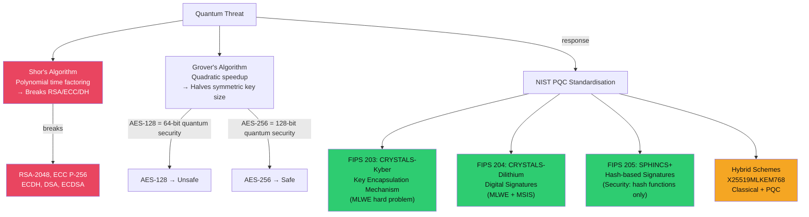

# ⚛️ Post-Quantum Cryptography

> [!abstract] TL;DR
> Quantum computers running Shor's algorithm can factor RSA moduli and solve ECDLP in polynomial time, completely breaking all current asymmetric cryptography (RSA, ECC, ECDH, ECDSA). Grover's algorithm provides quadratic speedup for brute-force search — it halves effective symmetric key length, so AES-256 remains safe (128-bit quantum security), but AES-128 drops to 64-bit security (broken). NIST standardised three PQC algorithms in 2024: CRYSTALS-Kyber (FIPS 203, KEM), CRYSTALS-Dilithium (FIPS 204, signatures), SPHINCS+ (FIPS 205, hash-based signatures). Hybrid schemes (X25519MLKEM768) combine classical and PQC for defence-in-depth. Crypto agility — designing systems to swap algorithms — is the key architectural principle for migration.

---

## Intuition — Analogy First

Classical computers solve problems sequentially. RSA's security relies on the fact that factoring a 2048-bit number takes longer than the age of the universe on a classical computer. A quantum computer with Shor's algorithm can factor the same number in polynomial time — roughly hours, not eons.

Think of it this way: a combination lock with 2^2048 combinations takes a classical computer 2^2047 tries on average to brute-force. A quantum computer using quantum parallelism processes all 2^2048 states simultaneously and finds the answer in polynomial time. This is not faster computing — it's a different computational model that fundamentally changes which problems are hard.

The good news: symmetric cryptography requires Grover's algorithm for brute force, which only provides a quadratic speedup (2^256 becomes 2^128 effective security for AES-256). AES-256 and SHA-256+ remain quantum-safe. The bad news: we don't know when a "cryptographically relevant quantum computer" (CRQC) will exist — estimates range from 2030 to never — but adversaries harvest encrypted data today for future decryption ("harvest now, decrypt later").

---

## How It Works



---

## Key Concepts / Details

### Quantum Algorithmic Threats

**Shor's Algorithm (1994)** — Breaks Public Key Cryptography:
- **RSA**: Factors n=p×q in O((log n)³) time vs classical O(e^(n^(1/3))) — exponential vs polynomial
- **ECC**: Solves ECDLP in polynomial time
- **DH/DSA/ECDSA**: All broken (rely on factoring or discrete log)
- Requires a quantum computer with ~4000 logical qubits for RSA-2048 (current quantum computers have ~1000 noisy physical qubits → far from cryptographically relevant)

**Grover's Algorithm (1996)** — Weakens Symmetric Cryptography:
- Provides O(√N) search instead of O(N) — quadratic speedup
- Effect on symmetric security levels:
  - AES-128: 128-bit → 64-bit quantum security (BROKEN)
  - AES-192: 192-bit → 96-bit quantum security (marginal)
  - AES-256: 256-bit → 128-bit quantum security (SAFE)
  - SHA-256: 128-bit collision resistance remains 128-bit quantum collision resistance (birthday bound dominates)
  - SHA-3-256: Same

**Harvest Now, Decrypt Later (HNDL)**:
Nation-state adversaries (assessed: China, Russia, USA) are believed to capture and store encrypted traffic today, intending to decrypt it when CRQCs become available. Data with 10+ year sensitivity (medical records, state secrets, long-term financial instruments) is at risk NOW.

### NIST PQC Standards (2024)

After an 8-year competition (2016–2024), NIST standardised:

**FIPS 203: ML-KEM (CRYSTALS-Kyber) — Key Encapsulation**

Based on **Module Learning With Errors (MLWE)**: given many noisy linear equations over polynomial rings, recover the secret. Believed hard for both classical and quantum computers.

| Parameter Set | Security Level | Public Key | Ciphertext | Shared Secret |
|--------------|---------------|------------|------------|---------------|
| ML-KEM-512 | 128-bit (quantum) | 800 B | 768 B | 32 B |
| ML-KEM-768 | 192-bit (quantum) | 1184 B | 1088 B | 32 B |
| ML-KEM-1024 | 256-bit (quantum) | 1568 B | 1568 B | 32 B |

```python
# ML-KEM usage (conceptual, using liboqs)
from oqs import KeyEncapsulation

# Key generation
kem = KeyEncapsulation('Kyber768')
public_key = kem.generate_keypair()

# Encapsulation (sender)
ciphertext, shared_secret = kem.encap_secret(public_key)

# Decapsulation (receiver)
shared_secret_recv = kem.decap_secret(ciphertext)
assert shared_secret == shared_secret_recv
```

**FIPS 204: ML-DSA (CRYSTALS-Dilithium) — Digital Signatures**

Also based on MLWE + MSIS (Module Short Integer Solution). Lattice-based.

| Parameter Set | Security Level | Public Key | Signature |
|--------------|---------------|------------|-----------|
| ML-DSA-44 | 128-bit | 1312 B | 2420 B |
| ML-DSA-65 | 192-bit | 1952 B | 3293 B |
| ML-DSA-87 | 256-bit | 2592 B | 4595 B |

Compare to Ed25519: 32B public key, 64B signature. PQC signatures are 30–70× larger.

**FIPS 205: SLH-DSA (SPHINCS+) — Hash-Based Signatures**

Security based entirely on hash function security — no algebraic structure to exploit. Quantum security = hash function security (Grover-resilient with SHA-3).

| Parameter Set | Security Level | Public Key | Signature |
|--------------|---------------|------------|-----------|
| SLH-DSA-SHA2-128s | 128-bit | 32 B | 7856 B |
| SLH-DSA-SHA2-256f | 256-bit | 64 B | 49856 B |

Very small public keys but large signatures. Suitable for code signing where signatures are verified infrequently.

### Hybrid Schemes — X25519MLKEM768

Hybrid key exchange combines classical ECDH with ML-KEM, providing security if either is unbroken:

```
X25519MLKEM768:
1. Generate X25519 ephemeral key pair (classical ECDH)
2. Generate ML-KEM-768 key pair
3. Combine shared secrets: final_secret = KDF(x25519_secret ‖ kyber_secret ‖ context)
```

If classical X25519 is broken by Shor's algorithm → ML-KEM provides security.
If ML-KEM has an undiscovered flaw → X25519 provides security.

IETF hybrid draft: `X25519MLKEM768` cipher suite for TLS 1.3 (draft-ietf-tls-hybrid-design).

Cloudflare, Google, and Apple have all deployed hybrid PQC in TLS (2023–2024).

### Crypto Agility — The Architectural Principle

Crypto agility: designing systems so that cryptographic algorithms can be replaced without architectural changes.

**Anti-pattern**: hardcoding algorithm names, key sizes, or cipher suites:
```python
# BAD: Hardcoded
cipher = AES(key_128)  # Can't swap to AES-256 without code change
hash_fn = MD5          # Legacy algorithm, can't easily replace

# GOOD: Algorithm-agnostic interfaces
cipher = create_cipher(config.symmetric_algo, key)  # Config-driven
hash_fn = create_hash(config.hash_algo)
```

**Migration checklist**:
1. Inventory all cryptographic uses (certificate issuance, TLS config, JWT algorithms, code signing, database encryption)
2. Replace RSA/ECDSA certificates with hybrid or ML-DSA certificates
3. Replace ECDH key exchange with hybrid X25519MLKEM768
4. Ensure AES-256 (not AES-128) for all long-lived data
5. SHA-256+ for all hashing (SHA-384/SHA-512 for signatures)

**Timeline estimates (NIST SP 1800-38C)**:
- 2025: Begin algorithm inventory and agility assessment
- 2030: Migrate priority systems (cryptographic certificates, PKI)
- 2035: Complete migration; classical public key algorithms deprecated
- 2035+: Shor-capable quantum computer may exist

---

## Real-World Notes

- NSA CNSA 2.0 (2022): US National Security Systems must use PQC for new development; ML-KEM and ML-DSA by 2030
- Google Chrome enabled X25519Kyber768 (draft hybrid) in Chrome 116 (2023) for ~30% of connections
- iMessage PQ3 (2024): Apple upgraded iMessage to post-quantum secure with CRYSTALS-Kyber hybrid
- Signal adopted PQXDH (Post-Quantum Extended Diffie-Hellman) using CRYSTALS-Kyber in 2023
- Lattice-based crypto is the frontier of cryptanalysis research; several NIST candidates were broken during the competition (SIKE, Rainbow) — multiple standardised alternatives are important

---

## Common Pitfalls

1. **"We'll migrate when quantum computers exist"** — HNDL means data encrypted today is at risk; migration takes 5–10 years for large organisations
2. **Deploying PQC without hybridisation** — PQC algorithms are newer and less analysed; hybrid (classical + PQC) provides defence-in-depth during transition
3. **Replacing only TLS** — Code signing, certificate issuance, at-rest encryption, HSMs, and VPNs all need migration — TLS is the most visible but not the only surface
4. **Keeping AES-128 because "quantum threat is theoretical"** — Grover's algorithm against AES-128 is practical once CRQCs exist; migrate to AES-256 now (minimal cost)

---

## Related Concepts

- [[Asymmetric_Cryptography_and_PKI|← Asymmetric & PKI]] — RSA/ECC being replaced by PQC
- [[Symmetric_Encryption|← Symmetric Encryption]] — AES-256 remains quantum-safe
- [[TLS_Protocol_Deep_Dive|← TLS Deep Dive]] — TLS 1.3 cipher suites being extended with PQC
- [[_MOC_Applied_Cryptography|↑ Applied Cryptography MOC]]

---

## Review Questions

1. A government agency encrypts 20-year-sensitive intelligence intercepts with RSA-4096. Explain the harvest-now-decrypt-later threat, estimate when a CRQC might make this data vulnerable, and recommend an immediate mitigation.
2. Compare ML-KEM-768 and Ed25519 on: public key size, signature/ciphertext size, performance (operations/second), and quantum security level. When would you choose each?
3. A security architect says "we use AES-256-GCM everywhere, so we're quantum-safe." Critique this statement — what's correct, what's missing, and what specific systems might still be vulnerable?

---

## Sources

- NIST FIPS 203 (ML-KEM): https://csrc.nist.gov/pubs/fips/203/final
- NIST FIPS 204 (ML-DSA): https://csrc.nist.gov/pubs/fips/204/final
- NSA CNSA 2.0: https://media.defense.gov/2022/Sep/07/2003071834/-1/-1/0/CSA_CNSA_2.0_ALGORITHMS_.PDF
- Apple iMessage PQ3: https://security.apple.com/blog/imessage-pq3/

#Cybersecurity #AppliedCryptography #PostQuantum #Kyber #Dilithium #SPHINCS #QuantumSafe
