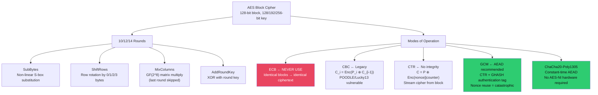

# 🔑 Symmetric Encryption

> [!abstract] TL;DR
> Symmetric encryption uses a single shared key for both encryption and decryption. AES (Advanced Encryption Standard) operates on 128-bit blocks with key sizes of 128/192/256 bits and 10/12/14 rounds respectively; each round applies SubBytes (S-box), ShiftRows, MixColumns, and AddRoundKey. ECB mode is broken (reveals patterns). CBC mode is vulnerable to padding oracle attacks (POODLE, Lucky13). CTR mode lacks integrity. GCM = CTR + GHASH authentication = AEAD, but nonce reuse is catastrophic (C1⊕C2=P1⊕P2 recovers both plaintexts). ChaCha20-Poly1305 is the constant-time alternative. Password hashing requires KDFs: Argon2id (OWASP recommended), bcrypt, scrypt — never raw SHA-256. Encrypt-then-MAC is the correct composition order.

---

## Intuition — Analogy First

AES is like a complex shuffling machine with 10+ stages: each round scrambles the 16-byte block using a different piece of the key. The S-box (SubBytes) is a lookup table that introduces non-linearity — without it, AES would be breakable by solving a system of linear equations. ShiftRows and MixColumns spread changes across the block so that a single bit change propagates throughout.

The mode of operation determines HOW AES handles messages longer than 16 bytes. ECB mode encrypts each 16-byte block independently with the same key — like using the same stamp for every box. An attacker sees that two identical plaintext blocks produce identical ciphertext blocks, leaking structure. The infamous "ECB penguin" is a Linux penguin image encrypted with AES-ECB: the outline is perfectly visible because uniform regions of colour produce identical ciphertext blocks.

---

## How It Works



---

## Key Concepts / Details

### AES Round Structure

Each AES round (except last) applies four transformations:

1. **SubBytes**: Each byte replaced by its GF(2⁸) inverse, then affine transform. Lookup table (S-box) provides non-linearity and confusion.

2. **ShiftRows**: Row 0 unchanged, Row 1 rotated left by 1, Row 2 by 2, Row 3 by 3. Provides inter-column mixing.

3. **MixColumns**: Each 4-byte column multiplied by a fixed MDS matrix over GF(2⁸). Provides diffusion — one byte change propagates to 4 bytes in next round.

4. **AddRoundKey**: XOR with 128-bit round key derived from main key via key schedule (Rijndael key expansion).

Key sizes and rounds:
- AES-128: 128-bit key, 10 rounds
- AES-192: 192-bit key, 12 rounds
- AES-256: 256-bit key, 14 rounds

### Modes of Operation

**ECB — Electronic Codebook (BROKEN)**:
```
C_i = Enc_K(P_i)   ← identical plaintexts → identical ciphertexts
```
Never use for structured data. Each block encrypted independently.

**CBC — Cipher Block Chaining (Legacy)**:
```
C_i = Enc_K(P_i ⊕ C_{i-1})
P_i = Dec_K(C_i) ⊕ C_{i-1}
```
IV must be random and unpredictable. Vulnerable to:
- **POODLE** (CVE-2014-3566): Exploits CBC padding in SSL 3.0/TLS 1.0
- **Lucky13**: Timing side-channel on CBC-MAC padding validation
Both attacks rely on the same fundamental flaw: MAC-then-Encrypt allows padding oracle attack.

**CTR — Counter Mode**:
```
C_i = P_i ⊕ Enc_K(nonce || counter_i)
```
Turns AES into a stream cipher. No padding needed. Parallelisable. No authentication — ciphertext manipulation is undetected.

**GCM — Galois/Counter Mode (AEAD)**:
```
C = CTR(P, K, nonce) ← confidentiality
Tag = GHASH(C, AAD, H) where H = Enc_K(0) ← authentication
```
AEAD: Authenticated Encryption with Associated Data. Tag covers both ciphertext AND additional data (headers, metadata).

**GCM nonce reuse catastrophe**:
```
If nonce is reused with same key:
C1 = P1 ⊕ KeyStream
C2 = P2 ⊕ KeyStream  (same keystream!)
C1 ⊕ C2 = P1 ⊕ P2   (keystream cancels!)
```
Known as the "forbidden attack" — nonce reuse in GCM recovers both plaintexts AND the authentication key H, allowing tag forgery. Solution: 96-bit random nonce (2^32 messages before collision risk with birthday bound), or AES-GCM-SIV (nonce-misuse resistant).

**ChaCha20-Poly1305**:
- ChaCha20: stream cipher using 32-bit ARX operations (Add, Rotate, XOR)
- Poly1305: MAC based on polynomial evaluation over GF(2^130-5)
- Constant-time by construction (no S-box table lookups vulnerable to cache timing)
- No hardware acceleration required (important for IoT/ARM devices without AES-NI)
- Used by: TLS 1.3, WireGuard, Signal Protocol

### Password Key Derivation Functions

**Never hash passwords with SHA-256** — it's fast (GH100 GPU: ~10 billion SHA-256/sec; 8-char password cracked in minutes).

| KDF | Algorithm | Key Parameter | OWASP Minimum |
|-----|-----------|--------------|---------------|
| **Argon2id** | Memory-hard, parallel-resistant | time=2, memory=64MB, parallelism=4 | Recommended 2024 |
| **bcrypt** | Blowfish-based, work factor | cost factor ≥ 12 | 10+ (but limited to 72 bytes) |
| **scrypt** | Memory+CPU hard | N=32768, r=8, p=1 | Acceptable |
| **PBKDF2** | HMAC iterations | ≥ 600,000 iterations (SHA-256) | Acceptable (FIPS compliant) |

```python
# Argon2id with Python (argon2-cffi)
from argon2 import PasswordHasher
ph = PasswordHasher(time_cost=2, memory_cost=65536, parallelism=4, hash_len=32)
hash = ph.hash("user_password")  # Stores $argon2id$v=19$m=65536,t=2,p=4$...
ph.verify(hash, "user_password")  # True

# PBKDF2 (FIPS compliant, Java/.NET environments)
import hashlib, os
salt = os.urandom(32)
key = hashlib.pbkdf2_hmac('sha256', password.encode(), salt, 600000)
```

### Encrypt-then-MAC vs MAC-then-Encrypt

| Order | Security | TLS 1.2 Mistake | TLS 1.3 Fix |
|-------|---------|-----------------|-------------|
| Encrypt-then-MAC | Secure | Not default in TLS 1.2 | Only AEAD (E+M built-in) |
| MAC-then-Encrypt | Vulnerable | Default! | Removed |
| Encrypt-and-MAC | Insecure | — | — |

**Why MAC-then-Encrypt is broken**: padding oracle attacks operate on the ciphertext before MAC verification, allowing decryption of ciphertext byte-by-byte by measuring timing differences in padding validation.

**TLS 1.3 fix**: AEAD-only cipher suites (AES-128-GCM, AES-256-GCM, ChaCha20-Poly1305) provide authenticated encryption by construction — separate MAC step eliminated.

---

## Real-World Notes

- AES-GCM is the dominant AEAD in TLS 1.3, TLS 1.2 (with ECDHE), SSH, IPsec
- Signal Protocol uses Double Ratchet with ChaCha20-Poly1305; WhatsApp, iMessage, Wire use Signal
- NIST AES competition (1997–2001): Rijndael selected over Serpent, Twofish, RC6, MARS
- Argon2id won the Password Hashing Competition (PHC) in 2015; OWASP now recommends it as first choice
- GCM is hardware-accelerated via AES-NI + CLMUL on x86-64 since 2010; ~10 GB/s on modern CPUs

---

## Common Pitfalls

1. **Reusing nonces in AES-GCM** — Even once destroys both confidentiality and integrity; generate nonces with `os.urandom(12)` never a counter that resets
2. **ECB mode for any structured data** — Images, structured databases, JSON payloads all leak patterns in ECB
3. **Using raw SHA-256 for passwords** — Fast hash = fast cracking; always use Argon2id/bcrypt with salt
4. **Forgetting associated data in AEAD** — HTTP headers, sender identity, sequence number should be authenticated (AAD) even if not encrypted

---

## Related Concepts

- [[Hash_Functions_and_MACs|→ Hash Functions & MACs]] — HMAC used in KDFs; SHA-256 used in PBKDF2
- [[TLS_Protocol_Deep_Dive|→ TLS Protocol Deep Dive]] — AES-GCM/ChaCha20 in TLS record layer
- [[Asymmetric_Cryptography_and_PKI|→ Asymmetric Crypto]] — Symmetric keys often wrapped with RSA/ECDH
- [[_MOC_Applied_Cryptography|↑ Applied Cryptography MOC]]

---

## Review Questions

1. An application encrypts user data with AES-128-GCM. The nonce is derived as a sequential counter starting at 0. After 2^32 messages with the same key, what is the probability of nonce collision, and what does an attacker gain from a single collision?
2. A developer stores passwords as `SHA256(password + username)`. Explain why this is inadequate, including a specific crack time estimate for an 8-character alphanumeric password on commodity hardware.
3. Compare MAC-then-Encrypt and Encrypt-then-MAC using the POODLE attack as a concrete example. Why does POODLE require MAC-then-Encrypt to work?

---

## Sources

- AES FIPS 197: https://csrc.nist.gov/publications/detail/fips/197/final
- Argon2 PHC: https://github.com/P-H-C/phc-winner-argon2
- GCM Forbidden Attack: https://eprint.iacr.org/2012/438.pdf

#Cybersecurity #AppliedCryptography #AES #GCM #ChaCha20 #AEAD #KDF #Argon2
