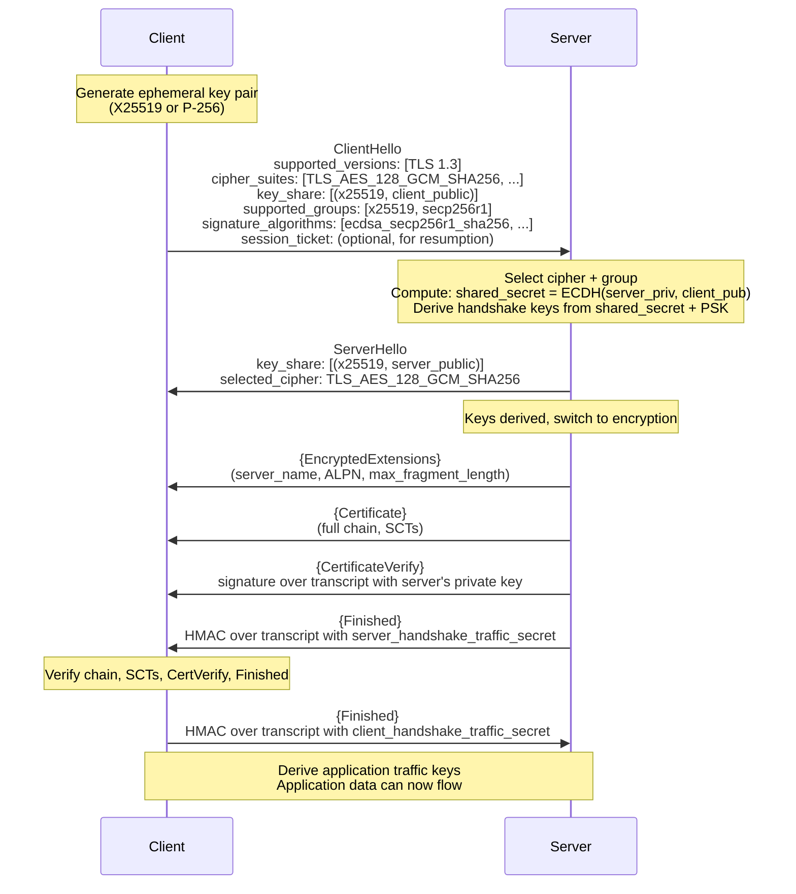

# 🔒 TLS 1.3 Protocol Deep Dive

> [!abstract] TL;DR
> TLS 1.3 (RFC 8446) achieves 1-RTT handshake by sending key_share in ClientHello (speculative ECDH). All keys are derived via HKDF (HMAC-based Key Derivation Function) from a three-stage hierarchy: Early Secret (from PSK or 0) → Handshake Secret (from ECDH result) → Master Secret. Each secret derives four traffic keys via HKDF-Expand-Label, all bound to the full handshake transcript. The record layer uses AEAD-only (AES-128-GCM, AES-256-GCM, ChaCha20-Poly1305). 0-RTT enables application data in the first flight using PSK resumption but enables replay attacks; safe only for idempotent operations. JA3 fingerprints the ClientHello to identify TLS implementation (useful for malware C2 detection).

---

## Intuition — Analogy First

TLS 1.3's key schedule is like a key derivation ceremony where each secret is computed from the previous one plus new information (like adding witnesses to a notarisation). The PSK (if resuming) comes in early; the ECDH result (freshness) comes in at the handshake stage; "nothing new" finalises the master secret. Each stage's keys are only valid for that stage — compromise of one stage doesn't compromise others.

The 1-RTT reduction over TLS 1.2 works by being optimistic: the client guesses which key exchange group the server will prefer and includes its ECDH public key in the ClientHello. If the guess is right (it almost always is for well-configured deployments), the server can compute the shared secret immediately and respond with encrypted data in the same flight.

---

## How It Works

### Complete TLS 1.3 Handshake



**Total RTT**: 1 (ClientHello → ServerHello+Server data → Client Finished → App data begins)

---

## Key Concepts / Details

### HKDF Key Schedule

HKDF (HMAC-based Key Derivation Function, RFC 5869) consists of two operations:
- `HKDF-Extract(salt, IKM)` = HMAC-SHA256(salt, IKM) — concentrates entropy
- `HKDF-Expand(PRK, info, length)` = HMAC-SHA256(PRK, info‖counter) — expands to needed length

TLS 1.3 uses `HKDF-Expand-Label(secret, label, context, length)`:
```
HKDF-Expand-Label(secret, label, context, length) =
  HKDF-Expand(secret, HkdfLabel, length)
where HkdfLabel = length ‖ "tls13 " + label ‖ context
```

**Three-stage key schedule**:

```
            0
            |
            v
PSK → HKDF-Extract → Early Secret
            |
            +-→ client_early_traffic_secret   (0-RTT data)
            +-→ early_exporter_master_secret
            |
            +-→ Derive-Secret("derived")
            |
            v
ECDH → HKDF-Extract → Handshake Secret
            |
            +-→ client_handshake_traffic_secret  (Client Finished)
            +-→ server_handshake_traffic_secret  (Server cert, Finished)
            |
            +-→ Derive-Secret("derived")
            |
            v
 0 → HKDF-Extract → Master Secret
            |
            +-→ client_application_traffic_secret  (client→server data)
            +-→ server_application_traffic_secret  (server→client data)
            +-→ exporter_master_secret
            +-→ resumption_master_secret          (new PSK for next session)
```

**Transcript binding**: Every HKDF-Expand-Label call includes the hash of the entire handshake transcript up to that point. Any tampering with earlier messages (e.g., ClientHello downgrade attempt) causes all derived keys to differ → Finished MAC fails → handshake aborts. This prevents downgrade attacks.

### Traffic Key Derivation

From each traffic secret, four keys are derived:
```
write_key = HKDF-Expand-Label(traffic_secret, "key", "", key_length)
write_iv  = HKDF-Expand-Label(traffic_secret, "iv", "", 12)  # 96-bit nonce base
```

Each AEAD record uses: `nonce = write_iv XOR (0-padded sequence_number)`

```python
# Conceptual key derivation
def derive_traffic_keys(traffic_secret, cipher="AES-128-GCM"):
    if cipher == "AES-128-GCM":
        key_len, iv_len = 16, 12
    elif cipher == "AES-256-GCM":
        key_len, iv_len = 32, 12
    elif cipher == "ChaCha20-Poly1305":
        key_len, iv_len = 32, 12
    
    key = hkdf_expand_label(traffic_secret, "key", b"", key_len)
    iv  = hkdf_expand_label(traffic_secret, "iv",  b"", iv_len)
    return key, iv

# Per-record nonce
def get_nonce(base_iv, seq_num):
    seq_bytes = seq_num.to_bytes(12, 'big')
    return bytes(a ^ b for a, b in zip(base_iv, seq_bytes))
```

### 0-RTT Resumption and Replay Attacks

0-RTT (Early Data) uses a PSK (Pre-Shared Key) from a previous session's `resumption_master_secret`. The client can send application data in the first flight, encrypted with `client_early_traffic_secret`.

**Replay attack mechanics**:
1. Client sends `ClientHello + Early Data: POST /transfer?amount=1000`
2. Attacker records this first flight
3. Server processes: transfer executes
4. Attacker replays the recorded first flight to a different server instance
5. Second server processes: transfer executes again

**Mitigations**:
- **Server-side**: Maintain a replay cache of early data nonces (expensive for distributed systems)
- **Application-layer**: Only accept 0-RTT for idempotent GET/HEAD requests; reject POST/PUT with `Early-Data: 1` header
- **Forward secrecy note**: 0-RTT data has no forward secrecy within the same session ticket lifetime

```nginx
# Nginx 0-RTT configuration
ssl_early_data on;
# Pass Early-Data header to application for replay detection
proxy_set_header Early-Data $ssl_early_data;
```

```python
# Application-layer 0-RTT protection
@app.route('/api/transfer', methods=['POST'])
def transfer():
    if request.headers.get('Early-Data') == '1':
        # Reject 0-RTT for state-changing operations
        return Response("Replay-unsafe operation", status=425, 
                       headers={'Retry-After': '0'})
    # Process normally
```

### JA3 and JARM Fingerprinting

**JA3** (client fingerprinting):
```python
# JA3 = MD5 of joined:
# TLSVersion, Ciphers, Extensions, EllipticCurves, EllipticCurvePointFormats

def compute_ja3(client_hello):
    components = [
        client_hello.tls_version,           # e.g., 771 (TLS 1.2 in legacy field)
        ','.join(client_hello.ciphers),      # e.g., "4866,4867,4865,49195"
        ','.join(client_hello.extensions),   # e.g., "0,23,65281,10,11"
        ','.join(client_hello.elliptic_curves), # e.g., "29,23,24"
        ','.join(client_hello.ec_point_formats) # e.g., "0"
    ]
    ja3_string = '-'.join(str(c) for c in components)
    return hashlib.md5(ja3_string.encode()).hexdigest()
```

**Known malicious JA3 hashes**:
| Tool | JA3 Hash |
|------|---------|
| Cobalt Strike (default) | `72a589da586844d7f0818ce684948eea` |
| Metasploit (default) | `8d558a6c0fd2e6e5db6ca73b68e65e26` |
| Dridex | `2d1eb5817ece335c65b0ad48a0a032c9` |
| Emotet | `b386946a5a44d1ddcc843bc75336dfce` |

**JA3S** (server fingerprinting): Same concept for ServerHello — identifies server TLS stack.

**JARM** (active fingerprinting): Send 10 crafted ClientHellos with specific parameters, hash the concatenated ServerHello responses. Identifies server-side TLS implementations including:
- Which TLS versions are supported
- Which ciphers are preferred
- ALPN behaviour
- Extension support

```bash
# JARM scan a server
python3 jarm.py target.com:443
# Output: JARM fingerprint (hex string identifying TLS implementation)
```

### Record Layer

```
TLS 1.3 Record:
+---+---+---+---+---+---+--------...--------+---..---+
|ContentType|TLS1.2|Length| Encrypted Data   |  Tag   |
|  (byte)   | (2B) | (2B) |   (plaintext)    | (16B)  |
+---+---+---+---+---+---+--------...--------+---..---+

ContentType: 23 (Application Data) — always, even for handshake records
             Legacy TLS1.2 = 0x0303 (compatibility with TLS 1.2 middleboxes)
Encrypted Data: AEAD(plaintext || real_content_type, key, nonce, record_header_as_AAD)
```

Record content type is now hidden inside the encrypted payload — TLS 1.3 records all look identical (content type 23) to network intermediaries, preventing traffic analysis by record type.

---

## Real-World Notes

- OpenSSL 3.x TLS 1.3 implementation: ~15,000 lines of code; formally verified components exist for the key schedule (Project Everest by Microsoft Research/INRIA)
- QUIC (HTTP/3) uses TLS 1.3 for its handshake but replaces TCP with UDP; QUIC's 0-RTT is the same protocol with same replay risks
- TLS 1.3 deployment: ~70% of TLS connections as of 2024 (Cloudflare Radar data)
- 0-RTT adoption: deliberately limited to ~20% of eligible connections by CDNs due to replay risk; only for GET-heavy workloads

---

## Common Pitfalls

1. **Allowing 0-RTT for all endpoints** — POST/PUT/DELETE with 0-RTT is a replay vulnerability; gate on `Early-Data` header
2. **Not validating Finished MAC** — Libraries that skip Finished verification allow downgrade attacks where the attacker tampered with cipher suite negotiation
3. **Using HKDF-Extract without transcript binding** — Deriving keys without the handshake transcript as context allows key separation attacks between sessions
4. **Forgetting key update** — Long-lived TLS 1.3 connections should trigger key updates (KeyUpdate message) after ~2^24 records to prevent nonce space exhaustion

---

## Related Concepts

- [[Symmetric_Encryption|← Symmetric Encryption]] — AES-GCM/ChaCha20-Poly1305 in record layer
- [[Asymmetric_Cryptography_and_PKI|← PKI]] — Certificate authentication in handshake
- [[Hash_Functions_and_MACs|← Hash & MACs]] — HMAC-SHA256 underpins HKDF
- [[TLS_and_SSL|← TLS Overview]] — Network-level TLS context
- [[_MOC_Applied_Cryptography|↑ Applied Cryptography MOC]]

---

## Review Questions

1. Trace the full HKDF key schedule for a TLS 1.3 session with no PSK (fresh handshake). List each intermediate secret, what material it's derived from, and what it's used for.
2. Explain why TLS 1.3 Finished messages prevent downgrade attacks: if an attacker changes the ClientHello's supported cipher suites, what specifically happens when Finished is verified?
3. A CDN enables TLS 1.3 0-RTT for all endpoints. An attacker captures a `POST /api/checkout` 0-RTT flight. Describe the replay attack, the business impact, and the fix using both HTTP 425 and application-level idempotency keys.

---

## Sources

- RFC 8446 (TLS 1.3): https://www.rfc-editor.org/rfc/rfc8446
- RFC 5869 (HKDF): https://www.rfc-editor.org/rfc/rfc5869
- JARM Fingerprinting: https://github.com/salesforce/jarm
- tls13.xargs.org: Interactive TLS 1.3 handshake visualiser

#Cybersecurity #AppliedCryptography #TLS #HKDF #ZeroRTT #JA3 #KeySchedule
