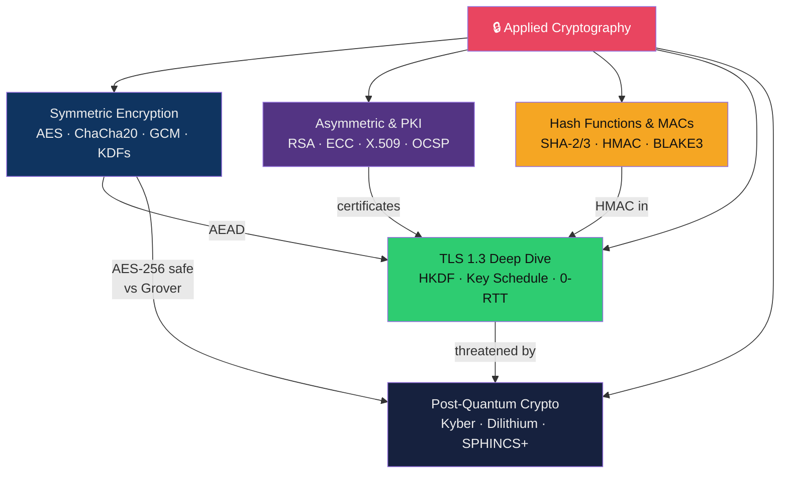

# 🔒 Applied Cryptography — Map of Content

> [!abstract] Section Overview
> Cryptography is the mathematical foundation of all digital security. This section covers symmetric encryption (AES modes, AEAD, KDFs), asymmetric cryptography and PKI (RSA, ECC, certificates, revocation), hash functions and MACs (SHA-2/SHA-3, HMAC, BLAKE3, length extension), the TLS 1.3 protocol in depth (HKDF key schedule, 0-RTT), and post-quantum cryptography (CRYSTALS-Kyber/Dilithium FIPS standards, Shor/Grover threat, crypto agility).

---

## Concept Map

---

## Notes in This Section

| Note | Core Concept | Key Algorithms | Difficulty |
|------|-------------|----------------|------------|
| [[Symmetric_Encryption]] | AES modes, padding oracles, AEAD, KDFs | AES-GCM, ChaCha20-Poly1305, Argon2id, PBKDF2 | Intermediate |
| [[Asymmetric_Cryptography_and_PKI]] | RSA/ECC, certificate chains, revocation | RSA-OAEP, P-256, Curve25519, Ed25519, X.509 | Advanced |
| [[Hash_Functions_and_MACs]] | Hash properties, HMAC, length extension | SHA-256, SHA-3, HMAC, BLAKE3 | Intermediate |
| [[TLS_Protocol_Deep_Dive]] | TLS 1.3 key schedule, handshake, 0-RTT | HKDF, X25519, AES-GCM, 0-RTT | Advanced |
| [[Post_Quantum_Cryptography]] | PQC algorithms, migration strategy | Kyber, Dilithium, SPHINCS+, hybrid X25519MLKEM768 | Advanced |

---

## Learning Path

1. [[Hash_Functions_and_MACs]] — foundation: what makes a hash secure
2. [[Symmetric_Encryption]] — AES and modern AEAD construction
3. [[Asymmetric_Cryptography_and_PKI]] — public key cryptography and PKI
4. [[TLS_Protocol_Deep_Dive]] — synthesises all primitives into TLS 1.3
5. [[Post_Quantum_Cryptography]] — next 10 years of cryptography migration

---

## Key Questions

1. Why is ECB mode fundamentally broken for any structured data, regardless of key strength?
2. What property does GCM provide that CBC does not, and why is nonce reuse in GCM catastrophic?
3. Why is PKCS#1 v1.5 RSA vulnerable to Bleichenbacher's attack and what does OAEP fix?
4. What does the length extension attack exploit in Merkle-Damgard hash functions, and which functions are immune?
5. Why does a quantum computer running Grover's algorithm only halve the effective key length of symmetric encryption, while Shor's algorithm completely breaks RSA/ECC?

---

## Related Sections

- [[02_Network_Security/_MOC_Network_Security|← Network Security]] — TLS, VPN crypto
- [[03_Web_Security/_MOC_Web_Security|← Web Security]] — JWT crypto, HTTPS
- [[05_Penetration_Testing/_MOC_Penetration_Testing|→ Penetration Testing]] — cryptographic attacks in pentest
- [[_MOC_Cybersecurity_Master|↑ Master MOC]]

#Cybersecurity #AppliedCryptography #MOC
